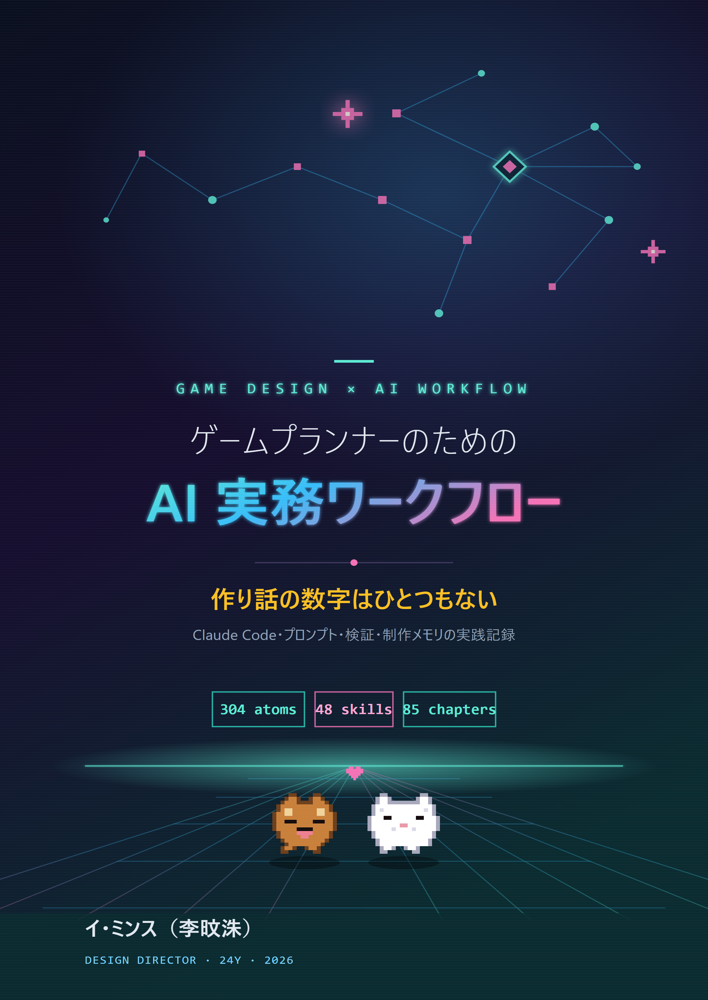

# ゲームプランナーのための AI 実務ワークフロー

> 作り話の数字はひとつもない — Claude Code・プロンプト・検証・制作メモリの実践記録

[](LICENSE)
[](https://github.com/eremes81/game-design-ai-practice)
[](https://bookk.co.kr/bookStore/6a298be0ff49b1a6034c7703)

**🌐 他言語版:** [한국어 — 原書](https://github.com/eremes81/game-design-ai-practice) · [English](https://github.com/eremes81/game-design-ai-practice-en) · **日本語**



ゲーム業界24年目のプランナー／デザインディレクターが、生成AI（Claude Code）を**毎日の実務**に組み込む方法をまとめた実践ガイドです。理論や展望ではなく、インストール・アカウント・料金という最初の画面から、システム企画・戦闘・ナラティブ・レベルデザイン・バランス・UX・ライブ運営、さらに議事録を決定に変える方法・検証ゲート・コスト管理・著作権まで、一つの作業を手を動かして最後まで追えるように構成しました。

副題の**「作り話の数字はひとつもない」**が本書の約束です。本文のすべての数値と事例は、本のために作った例ではなく実際の作業から出たものであり、コードの大半は外部依存なしに Python 標準ライブラリだけでそのまま動きます。

ゲーム業界の外で働く方にも開かれています。議事録を決定に変え、決定の波及を追跡し、検証ゲートで品質を守るワークフローは、職種に関係なく機能します。各章の「ゲームの外への適用」ボックスがその橋渡しであり、チームなしで一人で作る方のための「一人用ミニ版」も各章に付いています。

---

## 🌐 本版について

本書は韓国語原書『게임 기획 실무에서 바로 쓰는 AI·클로드 코드 활용법』（BOOKK、2026年 · ISBN 979-11-12-21479-9）の**日本語版**です。

本書の「正直さ第一」の原則に従い、この版がどう作られたかを正確に書いておきます。本版は、**本書自身のAIワークフローを使って韓国語原文から翻訳**したものです（用語固定シートに基づくClaude支援翻訳）。その後、著者本人が検収しました — ただし著者は日本語のネイティブスピーカーではありません。ワークド・トランスクリプトはすべて韓国語で行われた元セッションの翻訳であり、**日本語で再実行したものではありません**。手を加えていない韓国語の一次資料は[韓国語版リポジトリ](https://github.com/eremes81/game-design-ai-practice)にあります。コードの文法・識別子・数値・検証値には手を加えていません。

**ネイティブスピーカーの方からの訂正を心より歓迎します** — 不自然な文があれば、Issue または Pull Request をお寄せください。

---

## 📖 読みはじめる

- **[序文・本書の読み方](manuscript/_front-matter.md)** — まずは読み方のルートから
- **[1.0 始める前に — インストール・アカウント・料金・ターミナルサバイバルキット](manuscript/part01-foundation/chapter-0-setup-survival-kit.md)** — 最初の画面から追っていく
- 本文の図は ` ```mermaid ` コードで書かれており、**GitHub上でそのままレンダリング**されます。下の目次から章をクリックすればすぐ読めます。

## 原書（韓国語・紙の本）

| | |
|---|---|
| 著者 | イ・ミンス（李旼洙 / Minsoo Lee） |
| 出版 | BOOKK · 紙の本（韓国語） |
| ISBN | 979-11-12-21479-9 |
| 出版日 | 2026-06-11 |
| 分量 | 876ページ · 24部 + 付録A\~N + エピローグ |
| 購入 | **[BOOKKストア（韓国語の紙の本）](https://bookk.co.kr/bookStore/6a298be0ff49b1a6034c7703)** |

このリポジトリは同じ本の**日本語版（マークダウンソース）**を下記ライセンスで公開したものです。韓国語原書は [eremes81/game-design-ai-practice](https://github.com/eremes81/game-design-ai-practice)、英語版は [eremes81/game-design-ai-practice-en](https://github.com/eremes81/game-design-ai-practice-en) にあります。

## 🎁 発売記念割引（英語版 Leanpub）

> **[👉 クーポン LAUNCH30 で英語版を $13.30 で購入](https://leanpub.com/aiworkflowforgamedesigners/c/LAUNCH30)** — 定価 $19 から30%オフ · 無制限 · 有効期限なし

## 全体目次

> **24部 + 付録A\~N + エピローグ · 100章。** 付録は [`manuscript/part99-appendix/`](manuscript/part99-appendix)、奥付は [`manuscript/_colophon.md`](manuscript/_colophon.md)。

### 第1部 · 導入

- [1.0 始める前に — インストール・アカウント・料金・ターミナルサバイバルキット](manuscript/part01-foundation/chapter-0-setup-survival-kit.md)
- [1.1 ゲームプランナーとClaude Codeの最初の出会い](manuscript/part01-foundation/chapter-1-first-encounter.md)
- [1.2 モデル・トークン・ハーネス — 一つの作業のトークンが流れる道](manuscript/part01-foundation/chapter-2-model-token-harness.md)
- [1.3 メモリー・権限・設定インフラ](manuscript/part01-foundation/chapter-3-memory-permission-setting.md)

### 第2部 · 情報アーキテクチャ

- [2.1 YAMLフロントマター — すべてのドキュメントをデータに](manuscript/part02-info-architecture/chapter-4-yaml-frontmatter.md)
- [2.2 ページ別Atom — 1文書1決定の解剖](manuscript/part02-info-architecture/chapter-5-page-atom.md)
- [2.3 Layer設計 — ゲームシステムの抽象化](manuscript/part02-info-architecture/chapter-6-layer-design.md)
- [2.4 オントロジーとwikilinkグラフ — 意味の矢印を検証する](manuscript/part02-info-architecture/chapter-7-ontology-graph.md)

### 第3部 · システム企画

- [3.1 システムプランナーの仕事とLayer座標](manuscript/part03-system-design/chapter-09-system-designer-and-layer.md)
- [3.2 スキーマファースト — $스키마はデータより先](manuscript/part03-system-design/chapter-10-schema-first.md)
- [3.3 関係図の可視化 — 依存関係を目で見る](manuscript/part03-system-design/chapter-11-relation-map.md)
- [3.4 AI補助によるシステム設計プロンプトパターン](manuscript/part03-system-design/chapter-12-ai-assist-prompt-patterns.md)

### 第4部 · 戦闘企画

- [4.1 戦闘プランナーとLayer — 打撃感はどのマスに入るのか](manuscript/part04-combat-design/chapter-13-combat-designer-and-layer.md)
- [4.2 戦闘のLook & Feel — 手触りをデータで捉える](manuscript/part04-combat-design/chapter-14-look-and-feel.md)
- [4.3 コンボ・キャンセル・入力キュー — 経路を列挙して検証する](manuscript/part04-combat-design/chapter-15-combo-cancel-input.md)
- [4.4 AI支援による戦闘シミュレーション・検証](manuscript/part04-combat-design/chapter-16-ai-combat-simulation.md)

### 第5部 · ナラティブ

- [5.1 NarrativeDocs Layer 0〜4の構造](manuscript/part05-narrative-design/chapter-1-narrative-docs-layers.md)
- [5.2 世界観 → キャラクター → クエストの一貫性検証](manuscript/part05-narrative-design/chapter-2-consistency-verification.md)
- [5.3 AI支援によるナラティブ執筆](manuscript/part05-narrative-design/chapter-3-ai-assisted-narrative.md)
- [5.4 セリフ・ボイスの一貫性](manuscript/part05-narrative-design/chapter-4-dialogue-voice-consistency.md)

### 第6部 · コンテンツ企画

- [6.1 プロシージャルコンテンツ生成とAI — 二つの軸が交差する一マス](manuscript/part06-content-design/chapter-1-procedural-content-ai.md)
- [6.2 city_hunting_generator — 30の都市を4週間で作る](manuscript/part06-content-design/chapter-2-city-hunting-generator.md)
- [6.3 NPCのPersonaとSquad — 人形博物館から小さな社会へ](manuscript/part06-content-design/chapter-3-npc-persona-squad-pipeline.md)
- [6.4 コンテンツ量産ワークフロー — 複数のgeneratorを1本のラインにまとめる](manuscript/part06-content-design/chapter-4-content-production-workflow.md)

### 第7部 · レベルデザイン

- [7.1 プロシージャルレベルデザインマスター](manuscript/part07-level-design/chapter-1-procedural-level-design-master.md)
- [7.2 BehaviorTreeエディター — 人とAIが共にBT jsonを編集し検証するワークド・トランスクリプト](manuscript/part07-level-design/chapter-2-behaviortree-editor.md)
- [7.3 ダンジョン・フィールドのパターンライブラリー](manuscript/part07-level-design/chapter-3-dungeon-field-pattern-library.md)

### 第8部 · バランス

- [8.1 戦闘バランス公式 — 決定論というルールブックの居場所](manuscript/part08-balance-design/chapter-1-combat-balance-formula.md)
- [8.2 経済モデルをMachinationsへ — インフレは会議ではなくシミュレーションで捕まえる](manuscript/part08-balance-design/chapter-2-economy-machinations.md)
- [8.3 Damage Simulator — 仕様DPSとシミュレーション値が食い違った日](manuscript/part08-balance-design/chapter-3-damage-simulator-2008.md)
- [8.4 AI支援によるバランスシミュレーション](manuscript/part08-balance-design/chapter-4-ai-balance-simulation.md)
- [8.5 PvP・対戦バランス — 勝率マトリックス・マッチメイキング・サーバー権威](manuscript/part08-balance-design/chapter-5-pvp-competitive-balance.md)

### 第9部 · UX/UI

- [9.1 HUDスクリーンショットをlintにかける — 視線の逸脱・コントラスト不足をAIが捕まえる場所](manuscript/part09-ux-ui-design/chapter-1-hud-layout.md)
- [9.2 スキルボタン配列 — 配置案3つをAIが作り、lintが落とす](manuscript/part09-ux-ui-design/chapter-2-skill-ui-button-column.md)
- [9.3 ArtGuide/06_UI連携 — プランナーはmdで書き、アートチームはhtmlだけを見る](manuscript/part09-ux-ui-design/chapter-3-artguide-ui-collaboration.md)

### 第10部 · QA

- [10.1 整合性検証atom — 30シートのFKを守るcascade](manuscript/part10-qa-design/chapter-1-integrity-check-atoms.md)
- [10.2 決定検証3-layerセンサー — 人によるレビュー証拠の置き場所](manuscript/part10-qa-design/chapter-2-decision-validation-3-layer.md)
- [10.3 アルファGap Report — ギャップを自然言語で分類し、人が優先順位を付ける](manuscript/part10-qa-design/chapter-3-alpha-gap-report.md)

### 第11部 · キャラクター・ペット・乗り物

- [11.1 命名規約とスキル・アートのマッピング](manuscript/part11-character-pet-mount/chapter-1-naming-and-skill-art-mapping.md)
- [11.2 ペット・マウントシステム — テンプレート1種からインスタンス50種へ](manuscript/part11-character-pet-mount/chapter-2-pet-mount-system.md)

### 第12部 · アート

- [12.1 AIアートアセットパイプライン — 可逆な段階で量産し、不可逆ゲートの前で止まる](manuscript/part12-art-direction/chapter-1-ai-art-asset-pipeline.md)
- [12.2 ArtGuideの7領域（キャラクター・アニメ・モンスター・NPC・VFX・UI・環境）](manuscript/part12-art-direction/chapter-2-artguide-7-areas.md)
- [12.3 仕様書→コンセプト→インゲームアセットのフロー](manuscript/part12-art-direction/chapter-3-spec-to-asset-flow.md)

### 第13部 · データ・KPI

- [13.1 自由回答数百件をトピックに — クラスタリングはAI、診断は人間](manuscript/part13-data-kpi/chapter-1-faq-meta-game-analysis.md)
- [13.2 KPIの定義とトラッキング — 定義は人が、異常シグナルの診断はAIが](manuscript/part13-data-kpi/chapter-2-kpi-definition-tracking.md)
- [13.3 異常指標から決定まで — AIは仮説を、人は決定を](manuscript/part13-data-kpi/chapter-3-data-driven-decisions.md)

### 第14部 · モバイル

- [14.1 PC HUD 30種をモバイル10種に — 制約をルールブックに、圧縮をAIに](manuscript/part14-mobile-platform/chapter-1-mobile-hud-compression.md)
- [14.2 プラットフォーム別の違い（iOS / Android / PC）](manuscript/part14-mobile-platform/chapter-2-platform-differences.md)
- [14.3 タッチ／マウス入力デザイン](manuscript/part14-mobile-platform/chapter-3-touch-mouse-input-design.md)

### 第15部 · ライブ運営

- [15.1 運営（ライブオプス）概観 — イベント候補をAIが組み合わせ、ルールブックがふるいにかけ、人が選ぶ](manuscript/part15-live-ops/chapter-1-live-ops-overview.md)
- [15.2 イベント・シーズン運営 — テンプレート1枚からバリエーション候補10件を、チェックだけは人の手で](manuscript/part15-live-ops/chapter-2-event-season-ops.md)
- [15.3 フィードバック100件をトピックへ — クラスタリングはLLMに、優先順位は人に](manuscript/part15-live-ops/chapter-3-user-feedback-cycle.md)

### 第16部 · コミュニケーター

- [16.1 戦闘TF運営 — 隔離されたワークスペースから決定だけを正本へ](manuscript/part16-communicator/chapter-1-taskforce-operations.md)
- [16.2 他職種との連携 — 外部リクエストを3-trackに分類する](manuscript/part16-communicator/chapter-2-cross-job-collaboration.md)
- [16.3 一つの決定、三つのパッケージ — 職種別成果物のframing](manuscript/part16-communicator/chapter-3-cross-team-artifact-framing.md)

### 第17部 · 議事録

- [17.1 議事録はなぜ最大の痛みなのか](manuscript/part17-meeting-notes/chapter-1-concept-and-motivation.md)
- [17.2 議事録から決定を掘り出す抽出パイプライン](manuscript/part17-meeting-notes/chapter-2-extraction-pipeline.md)
- [17.3 会議の分類・キャプション・同期 — 資産になる議事録の3つの軸](manuscript/part17-meeting-notes/chapter-3-categories-and-sync.md)
- [17.4 議事録を決定データベースに — AI自動化の5つのポイント](manuscript/part17-meeting-notes/chapter-4-ai-meeting-automation.md)

### 第18部 · 意思決定・インパクト

- [18.1 意思決定追跡システム](manuscript/part18-decision-impact/chapter-1-decision-tracking-system.md)
- [18.2 インパクト伝播・等級分類](manuscript/part18-decision-impact/chapter-2-impact-propagation-classification.md)
- [18.3 決定前後の影響トラッキングワークフロー — 事前評価から事後検証まで](manuscript/part18-decision-impact/chapter-3-pre-post-tracking-workflow.md)
- [18.4 ドキュメント影響度grepワークフロー — impactで影響範囲を抽出する](manuscript/part18-decision-impact/chapter-4-doc-impact-grep-workflow.md)

### 第19部 · チームリーダー・リード

- [19.1 ビジョンを決定の採点表に — decisions/の26件をLLMにかけてみる](manuscript/part19-team-lead/chapter-1-vision-and-delegation.md)
- [19.2 対立を分類し、会議の決定を取りこぼさない — 会議リーダーシップのAI補助](manuscript/part19-team-lead/chapter-2-conflict-and-meeting-leadership.md)
- [19.3 AI導入戦略と経営陣の説得 — 保守的から進歩的へ、ROIは加工しない](manuscript/part19-team-lead/chapter-3-ai-adoption-strategy.md)

### 第20部 · チーム協業

- [20.1 一人のDDが5人分のコラボレーションメモリーを運営する — team_memoryシステム](manuscript/part20-team-collab/chapter-1-team-memory-operations.md)
- [20.2 チームメンバー別メモリー — ユーザーの引き出しと共有の引き出しの分離](manuscript/part20-team-collab/chapter-2-team-member-memory.md)
- [20.3 企画ポータル — チームがブラウザから入ってくる入口](manuscript/part20-team-collab/chapter-3-portal-web.md)
- [20.4 MCPプロジェクト管理 — コラボレーションツール・ドキュメントをLLMにつなぐ](manuscript/part20-team-collab/chapter-4-mcp-project-management.md)

### 第21部 · 自己改善

- [Part 21 · 第1章 振り返りがすべての出発点](manuscript/part21-self-improving/chapter-1-retro-as-origin.md)
- [Part 21 · 第2章 振り返りシステムとatom昇格 — 発見を恒久資産に](manuscript/part21-self-improving/chapter-2-retro-system-atom-promotion.md)
- [Part 21 · 第3章 self-improvingループを閉じる](manuscript/part21-self-improving/chapter-3-closing-the-loop.md)

### 第22部 · ガバナンス

- [22.1 プロンプトエンジニアリング — ゲームプランナーの作業指示書1枚](manuscript/part22-governance/chapter-1-prompt-engineering.md)
- [22.2 自信を持って嘘をつく同僚 — ハルシネーションを検証ゲートで防ぐ](manuscript/part22-governance/chapter-2-ai-safety-hallucination.md)
- [22.3 AIコスト管理 — トークン予算をコードで守る](manuscript/part22-governance/chapter-3-ai-cost-management.md)
- [22.4 著作権と倫理 — 成果物の権利・表示・合意を一つの手順で閉じる](manuscript/part22-governance/chapter-4-copyright-ethics.md)

### 第23部 · 拡張・次世代

- [Part 23 · 第1章 Wrapper・Cascade・Junctionパターン](manuscript/part23-extension/chapter-1-wrapper-cascade-junction.md)
- [Part 23 · 第2章 Hermes Agent導入記](manuscript/part23-extension/chapter-2-hermes-agent.md)
- [Part 23 · 第3章 ツールキュレーション — 使わないツールをデータで切り捨てる](manuscript/part23-extension/chapter-3-tool-curation.md)
- [Part 23 · 第4章 一人で作ったパズルゲーム — Critter Sort実践記](manuscript/part23-extension/chapter-4-personal-game-dev.md)

### 第24部 · 運営ノウハウ

- [24.1 検証システム — 整合・リンク・staleをコードで捕まえる](manuscript/part24-ops-deep/chapter-1-verification-system.md)
- [24.2 Mermaidダイアグラム自動化 — ドキュメントに自分の図を描かせる](manuscript/part24-ops-deep/chapter-2-mermaid-diagram-automation.md)
- [24.3 Wikilinkと文書の階層 — リンクと分類、検索の二つの入り口](manuscript/part24-ops-deep/chapter-3-wikilink-and-hierarchy.md)
- [24.4 出所追跡・data lineage](manuscript/part24-ops-deep/chapter-4-source-tracking-data-lineage.md)

### エピローグ・付録

- [エピローグ — 質問ウィンドウからゲームデザインルームへ](manuscript/part99-appendix/epilogue.md)
- [付録A. 会社PCシステムの詳細インベントリー](manuscript/part99-appendix/appendix-A-company-inventory.md)
- [付録B. ツール借用の手順（会社から個人へ汎用化する）](manuscript/part99-appendix/appendix-B-tool-adoption-procedure.md)
- [付録C. 権限・設定リファレンス](manuscript/part99-appendix/appendix-C-permissions-settings.md)
- [付録D. R&D文書の命名・Frontmatter標準](manuscript/part99-appendix/appendix-D-naming-frontmatter-standard.md)
- [付録E. MCPサーバーカタログ（ゲーム企画の視点）](manuscript/part99-appendix/appendix-E-mcp-server-catalog.md)
- [付録F. 事例索引（会社／個人PC）](manuscript/part99-appendix/appendix-F-case-index.md)
- [付録G. 運用スクリプト事例集](manuscript/part99-appendix/appendix-G-operation-scripts.md)
- [付録H. 過去の作業資料の再利用](manuscript/part99-appendix/appendix-H-past-work-reuse.md)
- [付録I. BehaviorTreeエディターの事例（発展）](manuscript/part99-appendix/appendix-I-behaviortree-editor.md)
- [付録J. 略語・用語集](manuscript/part99-appendix/appendix-J-glossary.md)
- [付録K. 他のLLM・ハーネスへの移植](manuscript/part99-appendix/appendix-K-tool-neutral-porting.md)
- [付録L. チーム導入TCO・オンボーディングワークシート](manuscript/part99-appendix/appendix-L-team-adoption-tco.md)
- [付録M. 次元ベクトル・埋め込み — ゲームプランナーのための直観](manuscript/part99-appendix/appendix-M-embedding-intuition.md)
- [付録N. 講義用15週進度表・難易度ガイド](manuscript/part99-appendix/appendix-N-course-syllabus.md)


---

## ライセンス

本書は **[CC BY-NC-SA 4.0](LICENSE)**（表示-非営利-継承）の下で利用できます。

- 非営利目的の共有・翻訳・翻案は、原著者（イ・ミンス · Minsoo Lee）と出典を表示すれば許可されます。
- 商業的利用には著者の別途許諾が必要です。

一部の例示用ラスター画像参照（例: `char_skill_ui.png`）は原本のないプレースホルダーのため、壊れた画像として表示されることがあります — 正式出版版（PDF/紙の本）ではその場所は埋まっています。

ⓒ イ・ミンス（Minsoo Lee）2026
