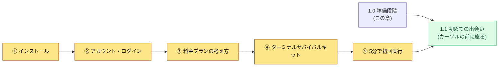
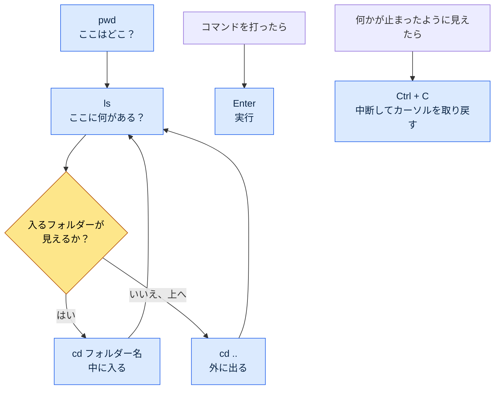
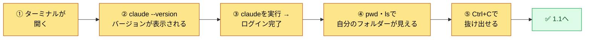

# 1.0 始める前に — インストール・アカウント・料金・ターミナルサバイバルキット

1.1は「初めての出会い」です。点滅するカーソルの前に座り、何かを打ってみる場です。ただ、その席に着くには、先に揃えておくべきものがあります。ツールがインストールされていて、ログインが済んでいて、料金がどのように発生するのかをおおよそ知っていて、黒い画面で文字をいくつか打てること。本章は1.1より1段階手前にあります。

多くの入門書はこの段階を飛ばします。「ターミナルを開いてください」と1行書いて先へ進みます。しかし、入門者はまさにその1行でつまずきます。ターミナルがどこにあるのか、何をインストールすればいいのか、インストール中に赤い文字が出たらどうすればいいのか。最初の1行で止まった人は、1.1までたどり着けません。本章の目標はただ一つ、最初の1行でつまずかせないことです。

本章は五つの部分で構成されています。インストール、アカウントとログイン、料金プランの考え方、ターミナルサバイバルキット、そして「5分で初回実行」チェックリストです。順番に進めば、1.1の席に着く準備が整います。



---

## 1.0.1 インストール — OS別の1行

インストールは公式の案内に従うのが原則です。ツールは頻繁に変わりますし、非公式な経路で入手したインストールファイルは危険です。そのため本書はダウンロードリンクを載せず、公式の入り口を見つける方法を案内します。検索窓に「Claude Code 公式ドキュメント」または「Claude Code install」と入力すれば、Anthropicの公式ドキュメントページが最初に出てきます。インストールコマンドは、そのページのものをそのまま使うのが最も安全です。

全体像は知っておくとよいでしょう。Claude Code（クロードコード。本書では英語表記に統一します）はターミナルで動くツールで、通常は1行のコマンドでインストールします。OSごとに流れが少し異なります。

| OS | 準備するもの | インストールの流れ（概念） |
|---|---|---|
| Windows | PowerShell（標準搭載） | 公式ドキュメントのインストールコマンド1行をPowerShellに貼り付け |
| macOS | ターミナル（標準搭載） | 公式ドキュメントのインストールコマンド1行をターミナルに貼り付け |
| Linux | ターミナル | 公式ドキュメントのインストールコマンド1行をターミナルに貼り付け |

三つのOSとも流れは同じです。「ターミナルを開く → 公式ドキュメントの1行を貼り付ける → Enter」。コマンドを暗記する必要はありません。公式ドキュメントからコピーして貼り付けるのが定石です。

インストール中に赤い文字（エラー）が出ても、慌てる必要はありません。入門者が出会うインストールエラーは、ほとんどが二つのうちどちらかです。権限の問題か、前提となるツール（例：Node.jsのようなランタイム）がない場合です。赤い文字が出たら、その文章全体をそのままコピーして検索するか、AIに聞けば十中八九解決します。エラーメッセージは敵ではなく手がかりです。

> インストールがうまくいったか確認する方法：ターミナルに`claude --version`と打ってEnter。バージョン番号が1行表示されればインストール成功です。「コマンドが見つかりません」のようなメッセージが出る場合は、まだインストールされていないか、ターミナルを開き直す必要があるケースです。ターミナルを完全に閉じてから開き直し、もう一度確認してみましょう。

---

## 1.0.2 アカウント・ログイン

インストールが終わったからといって、すぐに使えるわけではありません。Claude CodeはAnthropicのAIモデルを借りて使うツールなので、誰が使っているのかを確認するログインの段階が必要です。

流れは単純です。ターミナルで`claude`を初めて実行すると、ログインの案内が表示されます。通常はWebブラウザーが自動で開くので、そこでAnthropicアカウントでログインします（アカウントがなければ、その画面で新規作成できます）。ログインが終わると、ブラウザーには「もうターミナルに戻って大丈夫です」のような案内が、ターミナル側にも完了の表示が出ます。

ここで入門者がよくつまずくポイントが2か所あります。

一つ目は、ブラウザーが自動で開かない場合です。このときはターミナルに長いアドレス（URL）が1行表示されます。そのアドレスをコピーして、ブラウザーのアドレスバーに貼り付けて開けば大丈夫です。行き詰まったわけではなく、手動でもう1段階進めばよいだけです。

二つ目は、アカウントの種類を混同する場合です。Webチャット（Claude.ai）で使っていたアカウントと、Claude Codeのアカウント・料金がどうつながるかは、時期によってポリシーが異なることがあります。ログイン画面の案内と公式ドキュメントに従うのが最も正確です。初回実行の画面の指示どおりに進めば、ほとんどの場合は問題なくログインできます。

ログインは一度しておけば、そのPCでは維持されます。毎回やり直す必要はありません。

---

## 1.0.3 料金プランの考え方 — 定額サブスクリプション vs API従量課金

入門者が一番不安に思うのは「お金がいくらかかるのか」です。文字を打つたびに料金が発生するのではないか、という漠然とした恐れがあります。全体像を先につかめば、この不安は小さくなります。料金の方式は大きく二つに分かれます。

| 方式 | 課金形態 | たとえ | 向いている人 |
|---|---|---|---|
| 定額サブスクリプション | 月額固定 | 通信の定額プラン | 入門者・日常利用 |
| API従量課金 | 使った分だけ（トークン単位） | 電気メーター | 大量処理・自動化・開発連携 |

**定額サブスクリプション**は、月単位で決まった金額を払い、上限まで使う方式です。携帯電話の定額プランに似ています。毎月同じ金額なので予測がしやすく、「1行打つたびにいくら」を気にする必要がありません。そのため、入門者は定額サブスクリプションで始めるのが気楽です（著者の推定。正確なプラン構成と上限は時期によって変わるため、公式の料金ページで確認してください）。上限を超えたら、次の周期まで待つか、上位プランに上げます。

**API従量課金**は、実際に使った量（トークン）に比例して課金される方式です。電気メーターのように、使った分だけ請求されます。大量処理や自動化パイプライン、ほかのプログラムとの連携に向いています。うまく使えば効率的ですが、入門の段階では、使用量の感覚がつかめるまでコストの予測が難しいことがあります。

トークンとは何か、なぜそれを単位に課金するのかは、1.2（AIモデル・トークン・ハーネス）で詳しく扱います。ここでは一つだけ覚えておけば十分です。**入門者は通常、定額サブスクリプションで始めます。**毎月の金額が固定なので、「使っているうちに高額請求が来るのでは」という恐れなしに練習できるからです。プラン名・価格・上限は頻繁に変わるため、本書は特定の数字を載せていません。本書の内容は2026年半ばの時点を基準に書かれており、料金プラン・モデル・機能はその後も変わり続けます。現在の値は公式の料金ページで確認するのが最も正確です。

> 1行まとめ：使うたびにお金が出ていくのではという恐れ → 定額サブスクリプションなら毎月固定。入門は定額で始めると安心です。

---

## 1.0.4 ターミナルサバイバルキット — 黒い画面の恐怖を減らす

いよいよ最大の壁、黒い画面です。1.1が「点滅するカーソルの前でたじろぐ」から始まる理由がここにあります。GUIで24年働いてきた手にとって、ターミナルは不慣れなものです。しかし、最初の1行でつまずかないために必要なコマンドは、それほど多くありません。次の六つで十分です。

| コマンド | 読み方 | すること | たとえ |
|---|---|---|---|
| `pwd` | ピーダブリューディー | 今自分がどのフォルダーにいるかを表示 | 「ここはどこ？」 |
| `ls` | エルエス | 今のフォルダーの中に何があるかを一覧表示 | フォルダーウィンドウを開いて見る |
| `cd 폴더이름` | シーディー | そのフォルダーの中に入る（`폴더이름`の部分に入りたいフォルダー名を入れます） | フォルダーのダブルクリック |
| `cd ..` | シーディー　ドットドット | 1段階上のフォルダーに出る | 「戻る」ボタン |
| `Enter` | エンター | 打ったコマンドを実行 | 「OK」ボタン |
| `Ctrl + C` | コントロールシー | 今動いているものを中断 | 停止ボタン |

（Windows PowerShellでも`ls`・`cd`・`pwd`はそのまま通ります。macOS・Linuxも同じです。つまり、この六つはOSを選びません）。

この六つですることを図にすると、次のようになります。ターミナルでの移動は、結局フォルダーの中と外を行き来することであり、GUIでフォルダーをダブルクリックしたり「戻る」を押したりするのと同じ動作です。



黒い画面が怖い本当の理由は、「打ち間違えたら壊れそう」という感覚です。しかし、上の六つの中に何かを壊すコマンドはありません。`pwd`・`ls`・`cd`は見るか移動するだけで、ファイルを消したり変えたりしません。`Enter`は実行、`Ctrl + C`は中断にすぎません。ですから、この六つはいつでも安心して打って大丈夫です。

画面が止まったように見えることがあります。コマンドを打ったのにしばらく反応がなかったり、カーソルが別の行で点滅して、さらに何かの入力を待っているように見えたりするときです。そんなときは`Ctrl + C`を一度押せば、たいてい元のカーソルに戻ります。この「停止ボタン」があると知っているだけでも、黒い画面はずっと怖くなくなります。行き詰まったら`Ctrl + C`で抜け出して、やり直せばいいのです。

最後に、打った文字が大量にたまって画面がごちゃごちゃしてきたら、画面を空にできます。Windows PowerShell・macOS・Linuxのいずれも`clear`コマンドで空にします。空にしても、やったことが消えるわけではなく、見えている文字が片付くだけです。

---

## 1.0.5 「5分で初回実行」チェックリスト

ここまで来たら、準備は完了です。次の五つの項目を5分以内に通過できれば、1.1の席に着く資格ができたということです。一つでもつまずいたら、該当する節（1.0.1〜1.0.4）に戻ってください。



- [ ] ① ターミナルを開ける（Windows：PowerShell / macOS：ターミナル）
- [ ] ② `claude --version`と打つとバージョン番号が1行表示される（インストール確認）
- [ ] ③ `claude`を実行するとログイン済みになっている（または案内どおりにログイン完了）
- [ ] ④ `pwd`で現在地を、`ls`でフォルダーの中身を見られる
- [ ] ⑤ 何かが止まったとき、`Ctrl + C`で抜け出せる

五つの項目をすべて埋めたなら、黒い画面はもう未知の壁ではありません。ツールがインストールされ、ログインが済み、料金方式の全体像を知り、画面の中で移動し、止め方も分かっています。1.1はこの準備の上から始まります。点滅するカーソルの前に座り、初めて「このフォルダーに何があるか要約して」と打ってみる、その席に向かえば大丈夫です。

---

## 1.0.6 Python・pip — ツールを動かすには（必要なときだけ）

本書の前半（第1部・第2部）は、自然言語のプロンプトだけでついて来られます。ただし、第4部以降の一部の章では、小さなPythonスクリプトを直接動かします（例：`pip install pyyaml`、`pip install pyvis`）。Pythonが初めてでも大丈夫です。道は二つあります。


一つ目は、**自分でインストールする道**です。Pythonはpython.orgからダウンロードしてインストールし（インストール画面で［Add to PATH］に必ずチェックを入れます）、ターミナルで`python --version`と打って確認します。`pip`はPythonと一緒にインストールされるパッケージ管理ツールで、`pip install pyyaml`のように必要なパッケージを1行で取得します。

二つ目は、**AIに任せる道（推奨）**です。より簡単なのは、環境構築そのものをAIにやらせることです。ターミナルでこう頼めば大丈夫です。

```
Pythonが入っているか確認して、なければ自分のOSに合ったインストール方法を教えて。
あわせて、この章で必要なpyyamlパッケージをインストールするコマンドを1行でちょうだい。
```

（プロンプトの大意：「Pythonが入っているか確認して、なければ自分のOSに合ったインストール方法を教えて。あわせて、この章で必要なpyyamlパッケージをインストールするコマンドを1行でちょうだい」という依頼です）。

AIが環境を点検し、インストールコマンドを作ってくれます。行き詰まったら、その場でエラーメッセージをそのまま貼り付けて「このエラーはどう解決する？」と聞けば大丈夫です。ツールを動かす章ごとに、このパターン一つで十分です。Python・pipが負担に感じられる段階では、その章の「一人ミニ版」が、コードなしで進めるより軽い道を案内します。

---

### 次章のプレビュー
- 1.1 ゲームプランナーのClaude Codeとの初めての出会い — カーソルの前に座って最初の30分を持ちこたえる

---

## やってみよう

**setup**
1. お使いのOSのターミナルを開きましょう（Windows：PowerShell、macOS：ターミナル）。
2. 「Claude Code 公式ドキュメント」を検索して、公式のインストール案内ページを開いておきましょう。
3. タイマーを5分にセットしましょう。1.0.5のチェックリストの五つの項目を通過するのが目標です。

**prompt**（1行ずつ、順番に打ってみましょう。これはコマンドであって、自然言語の質問ではありません）
```
① claude --version      # バージョンが表示されればインストール成功
② pwd                   # 今自分がどのフォルダーにいるか
③ ls                    # このフォルダーに何があるか
④ cd ..                 # 1段階上に出る (そしてもう一度ls)
⑤ claude                # Claude Code 実行 (ログイン案内が出たら従う)
```

（コメントの大意：① バージョンが表示されればインストール成功／② 今自分がどのフォルダーにいるか／③ このフォルダーに何があるか／④ 1段階上に出る（そしてもう一度ls）／⑤ Claude Codeを実行（ログイン案内が出たら従う））

**verify**
- ①でバージョン番号が1行表示されれば、インストールは完了です。「コマンドが見つかりません」と出たら、ターミナルを閉じて開き直し、もう一度試してみましょう。
- ②・③・④でフォルダーを見たり移動したりしている間、何も壊れないことを自分の目で確かめましょう。この三つは見る・移動するだけの安全なコマンドです。
- ⑤の実行中に止まったように見えたら、`Ctrl + C`で抜け出しましょう。抜け出せたなら、「停止ボタンがある」ことを体で確認できたということです。

### 一人ミニ版

チームも会社のフォルダーもない個人なら、まずインストール（①）と、`Ctrl + C`で抜け出すことだけ先に身につけておきましょう。`claude --version`で「ツールが入った」ことを、`Ctrl + C`で「行き詰まっても抜け出せる」ことを確認できれば、黒い画面の恐怖の半分は、一人でも5分以内に片付きます。料金はまず定額サブスクリプションで始めれば、コストの心配なく思う存分練習できます。
