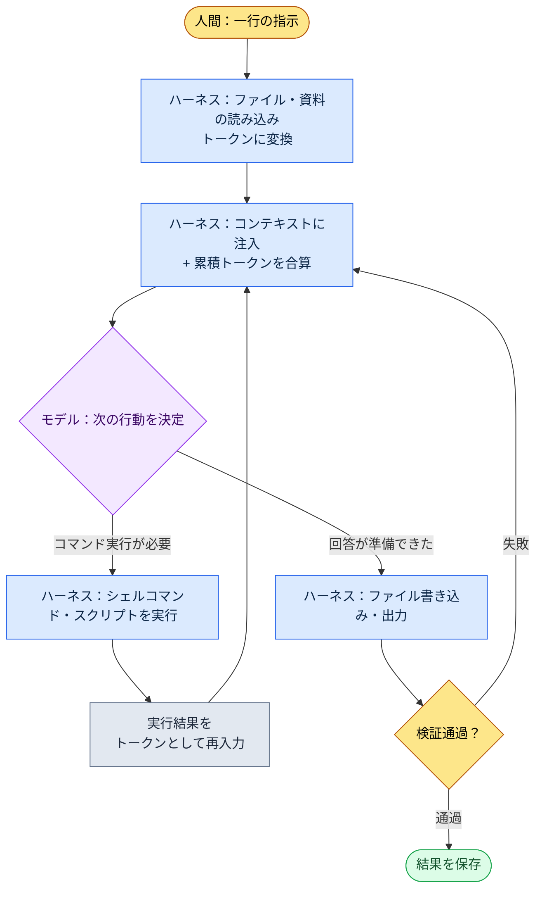

# 1.2 モデル・トークン・ハーネス — 一つの作業のトークンが流れる道

一つの作業を終えて、使用量を見たときのことです。今週の議事録が5件フォルダーに溜まっていて、月曜午前のスタンドアップの前までに「決定されたことだけ」を1枚にまとめなければなりません。私はClaude Codeのウィンドウに一行を打ち込みます。「このフォルダーの議事録から決定事項だけを抜き出して表にして」。エンターを押してから0.4秒ほど、画面の下のほうで小さな灰色の文字が点滅します。

```
Reading meeting-2026-05-25.md ... (1,840 tokens)
Reading meeting-2026-05-27.md ... (2,310 tokens)
```

この灰色の文字が本章のテーマです。韓国語の一文を投げると、ツールはそれをトークンに刻み、ファイルをトークンとして読み込んでモデルに入れ、モデルの答えを受け取ってファイルに書き込みます。この往復が1回回るたびにコストが計上され、モデルの「視野」に資料が積み上がっていきます。本章では、その灰色の文字の裏で起きていることをゲームプランナーの言葉で分解します。モデル・トークン・コンテキスト・ハーネス、四つの言葉で十分です。

> **用語メモ**
> - モデル（model）：答えを作る頭脳。Opus・Sonnet・Haikuのように、サイズと性格の異なる種類があります。
> - トークン（token）：文章を細かく刻んだ断片。課金・速度・視野はすべてこの単位で数えます。
> - コンテキストウィンドウ（context window）：モデルが一度に頭の中に収められるトークンの最大量。
> - ハーネス（harness）：モデルを働かせる車体。Claude Codeがその例です。

---

## 1.2.1 ハーネスループ — 灰色の文字の正体

先ほどの灰色の文字は、ランダムなログではなく、決まった循環の中の一つのボックスです。ハーネスがしていることは、結局のところ同じループを高速で回すことです。ファイルを読み込んでモデルに入れ、モデルが「このコマンドを実行せよ」と言えば実行し、その結果を再びモデルに入れます。このループが作業の終わりまで回り続けます。



この図で人間が手を触れるボックスは、いちばん上（指示）といちばん下（検証結果の確認）の二つだけで、真ん中のループはハーネスが自律的に回します。議事録5件を読み込む間に灰色の文字が5回点滅したのは、`Read → Inject`のボックスを5周したということです。Webチャットなら、ファイル5個を自分で開いてコピー＆ペーストしなければなりません。その労働をハーネスが肩代わりしてくれること。これがチャットボットとCLI型ハーネスを別の道具にする決定的な違いです。

ループが1周するたびに、`Inject`のボックスで累積トークンが合算されます。だからトークンを先に理解しないと、このループのコストも限界も見えてきません。まずトークンから見ていきます。

---

## 1.2.2 トークン — 一つの作業が使う実際の通貨

トークンは文字ではなく、モデルが文章を刻んだ断片です。経験則として、英語はおよそ4文字で1トークン、韓国語はおよそ2文字で1トークンに近い値になります（公式の換算ではなく、あくまで運用上の目安です。実際の値はモデルのトークナイザーが決め、文章ごとに異なります）。韓国語でスペース込み20文字なら、だいたい10トークン前後です。

あの議事録作業をトークンで追いかけてみます（以下の数値は同一作業の単一測定1回分です。議事録の分量や要約の長さによって変わるため、絶対値ではなく桁数と比率で読むことをおすすめします）。

| 段階 | 内容 | トークン（入力） | トークン（出力） |
|---|---|---|---|
| 指示 | 「決定事項だけを抜き出して表に」の一行 | \~25 | — |
| 議事録の読み込み ×5 | mdファイル5個の本文 | \~10,400 | — |
| 分類ルールの注入 | 会議カテゴリーのatom 1件（JIT） | \~480 | — |
| モデルの推論・表の作成 | 決定12件を表に | — | \~1,600 |
| 検証の再入力 | Linterが見つけた漏れ1件の再質問 | \~320 | \~210 |
| **累計** | | **\~11,225** | **\~1,810** |

二つのことが目に留まります。第一に、私が打った指示は25トークンなのに、作業全体では入力だけで1万1000トークンを超えています。コストのほとんどすべてが、私の文章ではなくツールが読み込んだ資料から発生しているのです。第二に、出力（1,810）は入力（11,225）の6分の1程度です。企画業務の自動化の大半は、このように多く読んで少なく書きます。だからコストを減らすには、出力を磨くより入力資料の量を制御するほうがはるかに効果が大きいのです。

作業が終わったあとに`/context`を打つと、そのセッションがコンテキストをどれだけ占有したかが見えます。トークンは意識しなければ印刷用紙のように無意識のうちに流れ出ていきますが、一度可視化すると姿勢が変わります。この可視化が節約の出発点です。

トークンを制御する道具は、抽象的な節約精神ではなく、入力資料を細かく扱う具体的なテクニックです。

1. **JIT注入** — 資料を全部あらかじめ積み込むのではなく、必要なときだけキーワードマッチングで引き込みます。上の表の「分類ルールの注入480トークン」がその例です。会議分類ルールの文書全体（数千トークン）ではなく、マッチしたatom 1件だけが入ってきました。
2. **要約キャッシュ** — 長い文書は、人間用の原本とは別にAI用の要約版を置きます。AIは要約版を読みます。
3. **atom分割** — 一つのファイルに一つの決定だけを収めれば（2.2で詳述）、必要な断片だけを正確に引き込めるので、トークンが節約できます。
4. **コンテキスト整理** — セッションが長くなったら圧縮します。Claude Codeは自動圧縮をサポートしています。
5. **モデル選択** — 単純な変換に大きなモデルを使うと、同じトークンでもコストが高くつきます。次の節のテーマです。

このうち1番のJIT注入は、本書の作業環境で実際に回っている仕掛けです。入力が一行入ってくると、`inject_memory.py`フックがメモリーatomをスコア順にマッチングして上位数件だけを選んで注入し、失敗しても作業の流れを止めません（実装の詳細は1.3で詳述）。「必要な資料だけ、上位数件だけ、失敗しても静かに」というトークン節約の原則が、コード1ファイルにそのまま収まっています。

---

## 1.2.3 モデル — 同じ車体、異なるエンジン

モデルは自動車のエンジンのようなもので、Claude Codeという同じ車体にOpus・Sonnet・Haikuという異なるエンジンを載せ替えられます。エンジンを替えると作業の性格が変わります。

<svg viewBox="0 0 640 230" xmlns="http://www.w3.org/2000/svg" font-family="sans-serif" font-size="13">
  <rect x="0" y="0" width="640" height="230" fill="#fafafa" stroke="#ddd"/>
  <text x="20" y="28" font-size="15" font-weight="bold">モデルマッチング — 深さ vs 速度・コスト</text>
  <!-- axes -->
  <line x1="80" y1="190" x2="600" y2="190" stroke="#888" stroke-width="1.5"/>
  <line x1="80" y1="190" x2="80" y2="55" stroke="#888" stroke-width="1.5"/>
  <text x="600" y="224" text-anchor="end" fill="#555">→ 速度・低コスト</text>
  <text x="76" y="50" text-anchor="end" fill="#555">推論の深さ ↑</text>
  <!-- Opus -->
  <circle cx="150" cy="80" r="34" fill="#7b4fbf" opacity="0.85"/>
  <text x="150" y="78" text-anchor="middle" fill="#fff" font-weight="bold">Opus</text>
  <text x="150" y="94" text-anchor="middle" fill="#fff" font-size="11">大型エンジン</text>
  <text x="150" y="138" text-anchor="middle" fill="#444" font-size="11">設計レビュー・GDD合成</text>
  <!-- Sonnet -->
  <circle cx="330" cy="120" r="34" fill="#3a86c8" opacity="0.85"/>
  <text x="330" y="118" text-anchor="middle" fill="#fff" font-weight="bold">Sonnet</text>
  <text x="330" y="134" text-anchor="middle" fill="#fff" font-size="11">中型エンジン</text>
  <text x="330" y="170" text-anchor="middle" fill="#444" font-size="11">議事録・日常 80%</text>
  <!-- Haiku -->
  <circle cx="510" cy="155" r="34" fill="#2a9d6f" opacity="0.85"/>
  <text x="510" y="153" text-anchor="middle" fill="#fff" font-weight="bold">Haiku</text>
  <text x="510" y="169" text-anchor="middle" fill="#fff" font-size="11">コンパクト</text>
  <text x="510" y="205" text-anchor="middle" fill="#444" font-size="11">シート単純変換</text>
</svg>

企画作業に当てはめると、こう分かれます。システム設計のレビューや、複数の資料を統合するGDD（Game Design Document、詳細仕様書）ドラフトの合成のように深い推論と整合性が必要な仕事はOpus、議事録からの決定抽出や日次要約のような日常作業の大半はSonnet、マスターデータの単純なフォーマット変換のようにほとんど判断のいらない仕事はHaikuに振ります。前の節の議事録作業をSonnetで回したのもこの基準です。決定を選んで表に移す仕事には、深い推論よりバランスと速度が合っています。

導入初期に誰もがはまる罠があります。すべての作業をいちばん良いエンジン、つまりOpusで回したくなる衝動です。その衝動に従うと、コストと速度の負担がそのまま運用の負担として返ってきて、作業にモデルを合わせる感覚が身につきません。運用の本当の技術は、毎回頭の中でモデルを選ぶことではなく、パターンが固まったあとに自動化として固定しておくことです。

- 日次の振り返り作成 → 自動的にSonnet
- システム設計レビュー → 自動的にOpus
- マスターデータの整合性チェック → 自動的にHaiku

こうした固定は、settings.jsonやスラッシュコマンドの中にモデルを明示しておくことで行います（1.3で詳述）。一度固めれば、毎回選ぶ手間がなくなります。

モデルはおおむね半年周期で新バージョンが出て、同じ名前でも4.5と4.6は別物です。新バージョンが出たら、ワークフローの中核となる作業5個だけを同じ入力で比較します。全部テストしようとすると疲れ果てます。5個の結果の違いだけでも、乗り換えるかどうかの判断には十分です。

---

## 1.2.4 コンテキストウィンドウ — ループが満ちていく限界

ループが1周するたびに`Inject`のボックスでトークンが累積すると述べました。その累積がぶつかる天井がコンテキストウィンドウ、つまりモデルが一度に処理できるトークンの最大量です。人間でいえばワーキングメモリー（working memory）です。

- Claude 4系：標準200Kトークン、拡張1Mトークンのオプション
- 200Kトークン ≈ 韓国語基準でA4約400ページ分

先ほどの議事録作業は累積入力が1万1000トークン台で、200Kの天井に対して6%あまりと余裕があります。しかし作業を切り替えずに同じウィンドウでセッションを長く引きずると、天井に近づいていきます。満杯になると古い内容が切り捨てられ、モデルが前半の「記憶」を失い始め、自動圧縮が発動して以前の会話が要約版に置き換えられます。

この天井を制御する習慣は四つです。

| パターン | いつ |
|---|---|
| セッション分離 | 別のテーマに移るときは新しいセッションを開く |
| 明示的な圧縮 | 一つの作業が終わったら核心だけ残して圧縮する |
| メモリーの外部化 | よく使う資料はatomに切り出し、JITでその都度注入する |
| コンテキストの可視化 | `/context`で現在の使用量を目で確認する |

ゲームプランナーがよく出会う重いケースは、会議資料・仕様書・マスターデータが同時に必要な作業で、こういうときに1Mオプションが役立ちます。ただし1Mにはコストと速度の負担が伴うので、普段は200Kで十分、資料の束が本当に大きいときだけ取り出します。

---

## 1.2.5 ハーネスが実際に嘘をふるい落とすとき — 検証ボックス

ループ図のいちばん下にある`검증 통과?`（検証通過？）のボックスに戻ります。このボックスがなければ、モデルのもっともらしい嘘がそのままファイルに保存されます。モデルは自信満々に間違った答えを正解のように出すことがあり（ハルシネーション、hallucination）、その頻度は世代が上がるほど減りますが、0にはなりません。だから検証を常設のボックスとして置きます。

企画の現場で危険なハルシネーションは具体的です。存在しないマスターデータのカラムを引用したり、間違った数式でバランスを計算したり、会議で決定されていない事項を決定済みのように要約したりします。議事録作業でいちばん怖いのは三つ目です。「議論だけして保留になった件」が決定の表にしれっと載ってくるケースです。

検証には五つのパターンがあります。

1. **原本照合** — AIの出力を原本資料ともう一度比較します（「これが本当にその資料にあったのか確認して」）。
2. **双方向変換** — A→Bに変換したあとB→Aに逆変換して、一致するかを見ます。
3. **サンプルチェック** — 出力のうち無作為の3〜5件を人が直接確認します。
4. **Linterによる自動化** — 出力が決められた形式・範囲・ルールに違反していないかを自動検査します。
5. **2モデルのクロスチェック** — Sonnetの出力をOpusがレビューします。

五つを毎回すべて行うのではなく、作業のリスクに応じて1〜3個を選びます。議事録作業では、4番のLinter（「決定に主体・内容・期限がすべて揃っているか」）と3番のサンプルチェック1回を組み合わせました。先ほどのトークン表の最後の行「検証の再入力320トークン」が、まさにLinterが漏れを捕まえてモデルに問い直したその往復で、ループ図でいえば`검증 실패 → Inject`（検証失敗 → Inject）としてもう1周回ったということです。

毎回人がすべてを検証していては導入効果が半減するので、検証もまた自動化の対象です。議事録の決定抽出ではLinterが形式の漏れを、マスターデータ変換では行数・合計・外部キーの整合性を、GDD自動生成では主要セクションの欠落を自動検査します。通過すれば人は見なくてよく、通過しなかったものだけを見ます。キャビネットいっぱいの書類のうち、赤い印のついたフォルダーだけを手に取る風景です。人の視線が危険な場所にだけ落ちるように設計すること。それが検証自動化の目的です。

---

## 1.2.6 四つの言葉が一つの作業に束ねられる場所

最後に、あの議事録作業を最初から最後まで、四つの言葉がどのように一本の糸に通されるのかを整理します。

| ボックス | 何が起きるか | どの概念 |
|---|---|---|
| 1 | Claude Codeを議事録フォルダーで実行 | ハーネス |
| 2 | 作業が議事録分析なのでSonnetを選択 | モデル |
| 3 | 合算約11Kトークン、200Kウィンドウの範囲内 — OK | トークン・コンテキスト |
| 4 | 会議分類ルールのatomをJITで自動注入 | トークン（節約） |
| 5 | モデルが決定12件を表として出力 | モデル・ハーネスループ |
| 6 | Linterが形式漏れ1件を検出 → 問い直して補強 | 検証（ループ1回追加） |
| 7 | `weekly-decisions-2026-W21.md`として保存・コミット | ハーネス |

手作業なら、議事録5件を開いて読み、決定だけを選んで書き写し、形式を整えるのに30分かかります。自動化されると5分に縮み、その5分の中で人の手がすることは、検証サンプルを一度ざっと確認することだけです。人の時間が本当に必要な場所（保留の件が決定として誤って載っていないか）にだけ、視線が落ちます。節約された25分ではなく、その視線の行き先が変わったこと。それが核心です。

---

## 1.2.7 よくある誤解

「Opusが常に優れている」が最もよくある誤解です。コストと速度を無視すればそのとおりですが、単純作業にOpusは無駄遣いです。作業ごとのマッチングが答えです。

「1Mコンテキストが常に必要だ」もよく出てきます。大半は200Kで十分で、1Mには負担が伴うので、本当に大きな資料の束にだけ使います。

「検証は人がやるもの」は半分だけ正しい考えです。自動検証できる部分が大半で、人は残りに集中します。

「トークンは気にしなくていい」は個人作業ではある程度通用しますが、複数人で一緒に使うと累積コストが急速に膨らみます。初期から可視化と節約のパターンを定着させるほうが安全です。

「ハーネスに違いはない」も意外と多い誤解です。同じモデルでも、チャットボットかCLIかで別の道具のように分かれます。先ほど見たコピー＆ペースト労働の有無がその違いです。

---

## 1.2.8 やってみよう

小さな作業一つで、本章の四つの言葉を自分で回してみましょう。

**setup**

- Claude Codeがインストールされた状態で、テキストノート（議事録・メモ）が2〜3個入ったフォルダーを一つ用意してください。
- そのフォルダーでClaude Codeを開いてください。

**prompt**

```
このフォルダーのノートから「決定されたこと」だけを選んで
主体・内容・期限の3列の表にして。
保留・議論中の件は除いて、表に入れた各行が
どのファイルから来たのかファイル名も一緒に書いて。
```

**verify**

- 作業が終わったら`/context`を打って、このセッションが使ったトークンを見てみましょう（思ったより入力が大きいことが確認できます）。
- 表の行を1〜2行選んで、書かれているファイル名を開き、本当に「決定」と書かれていたか原本と突き合わせてください（原本照合の検証）。
- 保留だった件が表に誤って載っていないか、一度ざっと確認してください（サンプルチェック）。

**一人ミニ版**

ツールを始めたばかりなら、上のうち二つだけを押さえてください。第一に、ノートはフォルダーごと任せて、コピー＆ペーストを自分でやらないこと（ハーネスループに任せます）。第二に、出力の表は必ずファイル名つきで受け取り、疑わしい行だけ原本を開いて見ること。モデル選択やトークンの可視化は、慣れてから足しても遅くありません。資料を手で運ばないことと、出力を原本と突き合わせること。この二つの習慣だけで、導入の半分は土台が固まります。

---

### 本章のポイント
- ハーネスは「読み込み→実行→再入力」のループを自律的に回し、人は指示と検証の二つのボックスにだけ手を入れます
- 一つの作業のコストは、自分が打った指示ではなく、ツールが読み込んだ資料からほとんどすべてが発生します
- モデルは作業に合わせて載せ替え、コンテキストの天井と検証は自動化で制御します

### 次章のプレビュー
- 第3章 メモリー・権限・設定インフラ — 一度セットアップすれば永久に働く基盤
