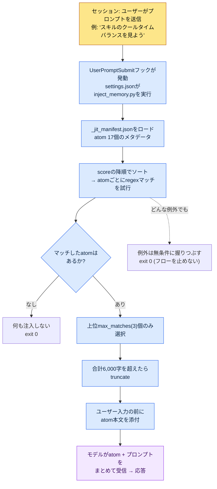

# 1.3 メモリー・権限・設定インフラ

新しいセッションを開き、「スキルのクールタイムバランスをちょっと見よう」と入力しました。エンターを押す前、画面の下のほうに小さなグレーの文字が1行、すっと流れていきます。`[memory injected: 2 atoms, 1,842 chars]`。私は何のファイルも開いていないのに、先週ルール化しておいたクールタイム（クールダウン）ルールの文書が、すでにモデルの入力の前に付け加えられて入っているという意味です。これが、インフラの敷かれた作業環境の最初のシグナルです。ツールを立ち上げた瞬間、ツールが私を覚えているのです。

この場面が可能になるためには、3つのものがあらかじめ整っていなければなりません。AIが何を記憶するか（メモリー）、AIが人の承認なしに何をできるか（権限）、その2つをオン・オフする中央スイッチ（settings.json）です。最初のセットアップにかかる時間は長くても1時間で、その1時間は以降6か月間、毎日節約される時間として返ってきます。ほぼ全額回収できる投資です。

この章は、著者が実際に個人PCで動かしている`settings.json`の1行、その1行が呼び出す`inject_memory.py`、そのファイルが読み込む`_jit_manifest.json`を順に開いてたどるウォークスルーです。最後まで読めば、「メモリーが自動注入される」という言葉が、どのファイルのどの行で起きていることなのか、手で指し示せるようになります。

---

## 1.3.1 settings.json — すべてが始まる1行

まず結論から見ます。著者の個人PCでメモリー自動注入をオンにしているのは、`settings.json`の中のたった1つのブロックです。

```json
{
  "hooks": {
    "UserPromptSubmit": [
      {
        "hooks": [
          {
            "type": "command",
            "command": "python ~/.claude/hooks/inject_memory.py"
          }
        ]
      }
    ]
  }
}
```

このブロックの意味を日本語に訳すと、こうなります。「ユーザーがプロンプトを送信するイベント（`UserPromptSubmit`）が起きるたびに、`inject_memory.py`というPythonスクリプトを1回実行せよ」。それだけです。AIが賢くて勝手に記憶しているのではなく、入力が入ってくるたびに、人が登録しておいたスクリプトが1回ずつ割り込む構造です。

`settings.json`はClaude Codeのすべての動作を制御する中央ファイルで、2つの層に分かれています。

- `~/.claude/settings.json` — グローバル。すべてのセッションに適用。チームと共有できる設定。
- `~/.claude/settings.local.json` — ローカル。このPCだけに適用。個人PC特有の設定。

2つはマージされて適用されます。そのため著者は、チームで共有すべきフックや権限は`settings.json`に、この自宅PCだけで使う絶対パスや個人ツールのパスは`settings.local.json`に分けて置いています。コラボレーション時のgitコンフリクトを避け、個人設定がチームのリポジトリに漏れる事故を防ぐ分離です。

よく使う項目は、フックのほかにもいくつかあります。

- `effortLevel` — モデルの推論の深さ。low / medium / high。仕様書の設計のように深い判断が必要な作業はhighにしておきます。
- `permissions` — AIが承認なしに実行できるコマンドの範囲（1.3.4で詳述）。
- `enabledPlugins` — 有効化されたプラグインのリスト。

ここで最も重要な、たった1つの運用習慣があります。`settings.json`は、小さなタイポ1つでツール自体が起動しなくなります。JSONのカンマが1つ欠けるだけでパースが壊れます。だから変更前のバックアップが必須です。著者のPCには実際に、こんなバックアップファイルが残っています。

```
settings.json.bak_2026-05
settings.local.json.bak_2026-05
```

日付のsuffixを付けて1部とっておけば、ロールバックは1秒です。gitで管理すればさらに良いでしょう。引き出しの中の古い合鍵のように、普段は使わなくても、鍵のかかったドアの前で必ず一度必要になる瞬間が来ます。

---

## 1.3.2 inject_memory.py — フックの中で実際に起きていること

今度は、`settings.json`が呼び出したスクリプトの中に入ります。ウォークスルーの背骨です。コードは100行余りですが、核心は5つの動作です。



5つの動作を順に書き下すと、こうなります。

**1) manifestを読む。** スクリプトはまず`~/.claude/projects/C--Users-user/memory/_jit_manifest.json`を開きます。このファイルにはatomのメタデータ（名前・パス・マッチ用regex・スコア）が整理されています。著者の個人PCには現在17個のatomが登録されています。

**2) scoreの降順でソートする。** atomごとに`score`値があります。スコアの高いatomほど先にマッチを試行されます。同じキーワードに複数のatomがヒットするとき、どれが優先権を持つかをこのスコアが決めます。

**3) regexでマッチする。** ユーザーの入力文字列を、各atomの`regex`パターンと照合します。入力に「쿨다운」（クールタイムを意味する韓国語キーワード）があれば、`쿨다운|cooldown|GCD`のパターンを持つatomがヒットします。大文字・小文字は区別せずに比較します。

**4) 最大3個までに絞る。** マッチがどれだけ多くても、`max_matches`（著者の環境では3）を超えたら上位3個だけを残します。さらに、選ばれたatom本文の合計の長さが6,000字を超えたら切り詰めます（truncate）。二重の上限で、入力が肥大化するのを防ぐ安全装置です。

**5) どんな例外でもexit 0で終わる。** 設計の核心です。manifestが壊れていても、ファイルが消えていても、regexが間違っていても、スクリプトは例外を静かに握りつぶし、終了コード0で終わります。フックが0以外のコードで死ぬと、ユーザーのプロンプト自体がブロックされることがあるからです。「メモリー注入が失敗しても、ユーザーの作業フローは絶対に止めない」という原則が、コードのいちばん外側のtry/exceptに記録されています。

重心は4番と5番にあります。4番（上限）はメモリーがトークンを爆発させないように抑え、5番（例外の握りつぶし）はインフラが作業を妨げないように抑えます。どちらも「自動化が人の足かせにならない」という同じ哲学の2つの顔です。

---

## 1.3.3 _jit_manifest.json — atomを呼び起こすキーワード辞書

1.2では「必要な資料だけ、上位数個だけ、失敗しても静かに」というトークン節約の原則を約束し、実装のディテールをこの章に持ち越しました。そのディテールが住んでいる場所が、`inject_memory.py`が読むmanifestです。JIT（Just-In-Time、必要なときだけ資料を呼び込む方式）の心臓部であり、atom 1つのエントリは次のような形をしています。

```json
{
  "atoms": [
    {
      "name": "combat_cooldown_rule_v2",
      "path": "atoms/combat/combat_cooldown_rule_v2.md",
      "regex": "쿨다운|cooldown|GCD",
      "score": 80
    },
    {
      "name": "user_health",
      "path": "memory/user_health.md",
      "regex": "건강|복약|컨디션|약물",
      "score": 95
    }
  ],
  "config": {
    "max_matches": 3,
    "case_insensitive": true
  }
}
```

4つのフィールドが1つのatomを定義します。

- `name` — atomの固有名。
- `path` — マッチしたら本文を読み込むファイルパス。
- `regex` — どのキーワードが入力に入ってきたらこのatomを呼び起こすかを定義するパターン。
- `score` — ソートの優先順位。高いほど先にマッチされ、先に枠を確保します。

`config`ブロックの`max_matches: 3`は、1.3.2で見た「最大3個」上限の出どころです。manifestを手で直せば、動作は即座に変わります。

規模の感覚を1つ押さえておきます。著者の**個人PC**はatom 17個、manifest 1式で軽く運用されています。一方、会社の実務環境（プロジェクトA）は、2026年5月時点のバックアップでチームatom 304個、skill 48個が登録されています。Hot atomの1つはscoreが356.53まで上がっていますが（ファイル名規則を扱う`view_html_filename_convention`系列）、最初から高かったのではなく、繰り返し呼び出され、検証されながら積み上がった痕跡です。

個人PCの17個と会社の304個の差が語っているのは、同じJITメカニズムでも、資料が積み上がる速度と規模はプロジェクトの密度に比例するという点です。最初から304個を作る必要はありません。核心のatom 5個から始めて、毎週1〜2個ずつルール化していけば、いつの間にかmanifestは厚くなっていきます。

> 著者の推定(未検証): scoreがマッチ・検証の回数に応じて累積するという記述は、運用パターンに基づく解釈です。スコア算定の式自体は環境ごとのmanifest設計によって変わるため、上記の356.53のような絶対値は著者の環境の実測スナップショットにすぎず、一般的な標準ではありません。

メモリーは2つの層に分けておくという原則も、ここでもう一度押さえます。

| 区分 | 場所 | ロードされるタイミング | 用途 |
|---|---|---|---|
| グローバル | `~/.claude/memory/` | すべてのセッション | 自分のアイデンティティ・コラボレーションルール・言語設定 |
| プロジェクト | `~/.claude/projects/<프로젝트>/memory/` | 該当プロジェクトのセッション | プロジェクトごとのatom・ルール・資料 |

グローバルは軽く保つほうが安全です。グローバルが重くなると、その重さがすべてのセッションにトークンコストとして積み重なるからです。オフィスにたとえれば、グローバルは机の上の名刺ホルダー（軽いほど毎日使いやすい）、プロジェクトメモリーは隣のキャビネットのフォルダー（プロジェクト単位で厚くなっても普段の負担はない）です。だから、自動ロードされるグローバルには核心だけを置き、豊富な資料はプロジェクトメモリーに蓄えたうえで、JITで必要なときだけ呼び起こします。

---

## 1.3.4 権限 — 作業の蓄積の痕跡が積み重なるホワイトリスト

いよいよ、インフラの3つ目の軸、権限です。Claude Codeはファイルを削除し、コマンドを実行し、外部APIを呼び出すことができます。強力さはリスクとともにやって来ます。権限システムがそのリスクを管理します。

権限は2種類に分かれます。人の承認なしに自動で実行されるものと、毎回承認を受けなければならないもの。どちらに何を置くかは、`settings.json`の`permissions`ブロックで定義します。

```json
{
  "permissions": {
    "allow": [
      "Bash(ls:*)",
      "Bash(git status:*)",
      "Bash(git diff:*)",
      "Read(*)",
      "Grep(*)"
    ],
    "deny": [
      "Bash(rm -rf:*)",
      "Bash(git push --force:*)"
    ]
  }
}
```

ここで視点の転換が必要です。この`allow`リストは単なる設定値ではなく、**作業の蓄積の痕跡**です。最初は読み取り・検索程度だけを自動許可にして、ほとんど空のままです。ところが1〜2か月同じ作業を繰り返していると、「このコマンド、毎回承認を押すのは面倒だな」というパターンが生まれ、それを1つずつ`allow`に移していきます。長くなったリストは、自分がこのツールで何を繰り返してきたかの指紋そのものです。

著者の会社環境（プロジェクトA）は、約80個の自動許可パターンを持っています。20個から始まり、6か月かけて60個が増えました。その60個を逆から読むと、この半年間どんな作業を繰り返したのかが浮かび上がります。マスターデータの抽出、関係図の生成、スキーマのドキュメント化。よく使うツールが、そのままよく許可した権限なのです。

権限の運用には、4つのパターンが定着しています。

- **ホワイトリストで始める** — 自動許可は最小限から出発し、必要なときだけ追加します。広く開けてから狭めるのではなく、狭く閉じてから開ける方向です。
- **危険なコマンドは明示的にブロック** — `rm -rf`や`git push --force`のように、一度の事故が致命的になるコマンドは`deny`に入れます。自動許可を広げても、この2つには手を付けません。
- **定期的な掃除** — 四半期ごとに`allow`を見直し、使わなくなった権限を削ります。痕跡は、積もるだけならノイズになります。
- **ドメインごとの分離** — グローバル権限とプロジェクト権限を分けます。自宅PCと会社PCが別のポリシーを持つように、環境ごとに許可範囲は異なります。

毎回承認ポップアップが出ると、人は疲れます。疲労を減らす仕掛けもあります。`fewer-permission-prompts`のようなスラッシュコマンドで頻出パターンを一括登録する、1セッションの間だけ一時許可を与える、個人作業に限って全権自動許可モードを使う、といったやり方です。ただし、最後のオプションはチーム環境ではおすすめしません。

疲労と安全のバランスは、自分で調整します。厳しすぎると作業が回らず、緩すぎると事故が起きます。緩めに始めても、四半期の掃除サイクルを備えておけば、バランスは自然に取れていきます。

---

## 1.3.5 セッションが始まるとき — メモリーと権限がともにロードされる図

ここまで見てきた3つの軸（settings・メモリー・権限）が、1つのセッションでどのように同時に働くのかを、入力1行を起点に広げてみます。以下は、「スキルのクールタイムバランスを見よう」と入力したときに実際に起きることの断面図です。

<svg viewBox="0 0 720 400" xmlns="http://www.w3.org/2000/svg" font-family="sans-serif" font-size="13">
  <rect x="0" y="0" width="720" height="400" fill="#fafafa"/>
  <!-- 縦レーン -->
  <rect x="20" y="20" width="200" height="360" fill="#eef3fb" stroke="#9bb8e0"/>
  <rect x="260" y="20" width="200" height="360" fill="#eef9f0" stroke="#9bd0a8"/>
  <rect x="500" y="20" width="200" height="360" fill="#fdf3ec" stroke="#e0b893"/>
  <text x="120" y="42" text-anchor="middle" font-weight="bold">settings.json</text>
  <text x="360" y="42" text-anchor="middle" font-weight="bold">メモリー (JIT)</text>
  <text x="600" y="42" text-anchor="middle" font-weight="bold">権限 (permissions)</text>
  <!-- settingsレーンのボックス -->
  <rect x="35" y="60" width="170" height="46" rx="5" fill="#ffffff" stroke="#7aa0d0"/>
  <text x="120" y="80" text-anchor="middle">UserPromptSubmit</text>
  <text x="120" y="97" text-anchor="middle">hook 発動</text>
  <rect x="35" y="130" width="170" height="46" rx="5" fill="#ffffff" stroke="#7aa0d0"/>
  <text x="120" y="150" text-anchor="middle">inject_memory.py</text>
  <text x="120" y="167" text-anchor="middle">実行 (exit 0 保証)</text>
  <!-- メモリーレーンのボックス -->
  <rect x="275" y="130" width="170" height="46" rx="5" fill="#ffffff" stroke="#5fae7e"/>
  <text x="360" y="150" text-anchor="middle">manifest 17 atom</text>
  <text x="360" y="167" text-anchor="middle">score ソート·regex</text>
  <rect x="275" y="200" width="170" height="46" rx="5" fill="#ffffff" stroke="#5fae7e"/>
  <text x="360" y="220" text-anchor="middle">上位3個·6000字</text>
  <text x="360" y="237" text-anchor="middle">上限を適用</text>
  <rect x="275" y="270" width="170" height="46" rx="5" fill="#ffffff" stroke="#5fae7e"/>
  <text x="360" y="290" text-anchor="middle">cooldown atom</text>
  <text x="360" y="307" text-anchor="middle">入力の前に添付</text>
  <!-- 権限レーンのボックス -->
  <rect x="515" y="270" width="170" height="46" rx="5" fill="#ffffff" stroke="#cf9560"/>
  <text x="600" y="290" text-anchor="middle">allow / deny</text>
  <text x="600" y="307" text-anchor="middle">ツール呼出ごとにチェック</text>
  <rect x="515" y="340" width="170" height="34" rx="5" fill="#ffffff" stroke="#cf9560"/>
  <text x="600" y="361" text-anchor="middle">読み取り自動 · 削除は承認</text>
  <!-- 矢印 -->
  <line x1="120" y1="106" x2="120" y2="130" stroke="#555" stroke-width="1.5" marker-end="url(#a)"/>
  <line x1="205" y1="153" x2="275" y2="153" stroke="#555" stroke-width="1.5" marker-end="url(#a)"/>
  <line x1="360" y1="176" x2="360" y2="200" stroke="#555" stroke-width="1.5" marker-end="url(#a)"/>
  <line x1="360" y1="246" x2="360" y2="270" stroke="#555" stroke-width="1.5" marker-end="url(#a)"/>
  <line x1="445" y1="293" x2="515" y2="293" stroke="#555" stroke-width="1.5" marker-end="url(#a)"/>
  <defs>
    <marker id="a" markerWidth="8" markerHeight="8" refX="6" refY="3" orient="auto">
      <path d="M0,0 L6,3 L0,6 Z" fill="#555"/>
    </marker>
  </defs>
</svg>

3つのレーンが、1つの入力で出会います。settings.jsonがフックを呼び起こし、フックがメモリーを選んで入力に添え、そうして作られた応答がツールを呼び出すときに、権限が最後のゲートとして働きます。ユーザーは「クールタイムを見よう」と1行打っただけなのに、3つのインフラが見えないところで順番に仕事をしています。これが、ツールが「自分のツール」だと感じられる瞬間の内部構造です。

---

## 1.3.6 初回セットアップガイド — 1時間で運用可能な状態へ

理論を見たので、手を動かします。初めてClaude Codeをインストールしたあと、1時間あれば上の図の全体を自分のPCに敷くことができます。5つの区間に分けます。

**0〜10分、インストール・起動確認。** インストール後、ターミナルでClaude Codeを起動します。フォルダー1つの中で「このフォルダーに何がある？」と聞いて、応答を確認します。まず、ツールが生きているかどうかから見ます。

**10〜25分、グローバルメモリー3つの作成。** 自動ロードされるグローバルは、3ファイルで十分です。

- `MEMORY.md`（5行） — 自分のアイデンティティ1行+ほかのファイルへのポインター。
- `user-profile.md`（20〜30行） — 名前・役割・専門分野・連絡先。
- `feedback-collaboration-style.md`（20〜30行） — 言語・口調・実行優先・説明簡潔のようなコラボレーションのルール。

著者の例をそのまま写して始めても構いません。運用しながら磨いていけばよいのです。

**25〜40分、settings.jsonの基本設定。** `effortLevel`をhighにし、権限のスターターセット（読み取り・検索は自動、書き込み・削除は承認）を入れ、バックアップを1部とります（`settings.json.bak_<날짜>` — `<날짜>`は「日付」を意味する韓国語のプレースホルダー）。バックアップは、この区間でいちばん重要な1行です。

**40〜55分、最初のプロジェクトatom 5個。** 自分が毎回忘れる決定、よく尋ねる情報を5個、atomにします。フォルダーは`~/.claude/projects/<프로젝트>/memory/`（`<프로젝트>`は「プロジェクト」を意味する韓国語のプレースホルダー）。形式は第5章を参照してください。5個なら、JIT manifestを今すぐ作らなくても、グローバル自動ロードだけで効果が出ます。

**55〜60分、テスト1回。** 新しいセッションを開き、自分の分野の質問を1つ投げます。グローバルメモリーが自動ロードされたか、応答のトーンが自分のコラボレーションルールに従っているかを確認します。

ここまでで1時間です。JIT manifestとフックは、atomが50個を超えるころ、自動ロードが重くなり始めたときに導入しても遅くありません。その時点で1.3.2の`inject_memory.py`を敷けばよいのです。

---

## 1.3.7 よくある失敗と回避法

導入初期に繰り返される失敗は5つにまとまり、それぞれが同じ事故原因の上に立っています。

| 失敗 | 事故原因 | 回避法 |
|---|---|---|
| グローバルに入れすぎる | すべてのセッションが重くなりトークンを浪費 | グローバルは5KB以内、詳細はプロジェクトメモリーへ移管 |
| すべての権限を自動許可 | 利便性がリスクを覆い隠す最初の場所 | 読み取り・検索のみ自動、書き込み・削除は承認（四半期の掃除を含む） |
| バックアップなしでsettingsを修正 | 壊れたsettingsがツール自体を起動不能にする | 変更前に`settings.json.bak_<날짜>`を自動保存 |
| atomをメモリーフォルダーに無限に積む | 自動ロードがトークン上限を圧迫 | 約50個からJIT manifestを導入 |
| チーム・個人の設定を1ファイルに混在 | gitコンフリクト・個人設定の漏えい | チームは`settings.json`、自分は`settings.local.json` |

5つすべてを初日から回避する必要はありません。グローバルの肥大化とバックアップ漏れは、最初の1時間以内に回避パターンを作っておくのがよく、残りの3つは1か月ほど運用しながら、自分にとって事故の可能性が高い場所に回避装置をはめ込むほうが自然です。

---

## 1.3.8 第1部を終えて

1.1はツールへの距離感を縮める場所で、1.2はそのツールの最小動作メカニズムをつかむ場所で、1.3はメモリー・権限・settingsで最初のインフラを敷く場所でした。この3章が、本書の導入部にあたります。ここまで終えれば、ツールを止めずに運用するための基本骨格は据わります。

核心は、この骨格が静的な設定ではないという点です。manifestのatomは毎週増え、`allow`リストは作業の痕跡に沿って長くなり、scoreは検証を経ながら積み上がります。インフラは敷いた瞬間に完成するのではなく、敷かれた上でユーザーとともに育ちます。個人PCの17個が会社の304個へと開いていく差が、その成長の距離です。

第2部からは、本格的な情報アーキテクチャに入ります。第4章のYAMLフロントマター、第5章のAtom、第6章のLayer、第7章のオントロジーが順に続きます。1.3ではmanifestの1エントリとしてしか見なかったatomが、2.2では1つの章の主役になります。背骨が据わってこそ、分野別の章が同じ座標の上で自分の居場所を見つけられるのです。

---

### 本章のポイント
- メモリーの自動注入は、settings.jsonのフック1行がinject_memory.pyを呼び起こす構造です
- 権限のallowリストは設定ではなく作業の蓄積の痕跡であり、四半期ごとに掃除します
- インフラは敷いたら終わりではなく、atom・権限・scoreがともに育つ、生きた骨格です

### 次章のプレビュー
- 第2部の開始：第4章。YAMLフロントマター — すべての文書をデータに

---

## やってみよう

**setup**
1. `~/.claude/settings.json`を開き、変更前に`settings.json.bak_<오늘날짜>`（`<오늘날짜>`は「今日の日付」の意）としてバックアップをとりましょう。
2. `permissions.allow`に`Read(*)`、`Grep(*)`、`Bash(ls:*)`、`Bash(git status:*)`を入れ、`permissions.deny`に`Bash(rm -rf:*)`、`Bash(git push --force:*)`を入力しましょう。
3. （atomが50個以上のとき）`hooks.UserPromptSubmit`に`python ~/.claude/hooks/inject_memory.py`を登録し、`_jit_manifest.json`にatomエントリ（name・path・regex・score）と`config.max_matches: 3`を書きましょう。

**prompt**
- 新しいセッションで、manifestのどれかのatomキーワードを意図的に含んだ質問を投げてみましょう。例：「クールタイムのルールを基準にスキルバランスを見よう」。

**verify**
- 入力直後に`[memory injected: N atoms]`のようなシグナルが表示されるか確認しましょう。
- 意図したatomが応答に反映されたかを見てみましょう。
- わざとmanifestに壊れたJSONを入れてみて、それでもプロンプトがブロックされずに動くか（exit 0保証）を確認したうえで、元に戻しましょう。

**一人ミニ版**
- フックもmanifestもなしで始めましょう。グローバルの`MEMORY.md`1ファイルにアイデンティティ3行+コラボレーションルール3行だけを書き、権限は`Read(*)`・`Grep(*)`だけを自動許可にしておきましょう。atomが手になじんで50個に近づいたとき、そのときに1.3.2のフックを載せましょう。インフラは小さく始めて痕跡に沿って育てるものであって、最初から304個をそろえるものではありません。
