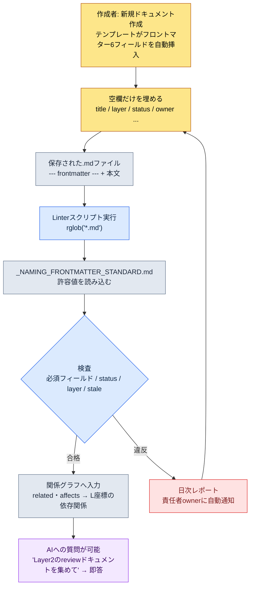

# 2.1 YAMLフロントマター — すべてのドキュメントをデータに

マイルストーンビルドを翌日に控えた夜、システムプランナーのチームメンバーAが社内メッセンジャーで尋ねてきました。「今週、報酬カーブに手を入れたドキュメントは何件ですか？　レビューが終わっているのはどこまでですか？」私は答えを知りませんでした。ドキュメントはフォルダのどこかにあり、誰が最後に手を入れたのか、どのマイルストーンのものなのかは、各自の記憶とファイル名の取り決めの中に散らばっていました。その夜、私たちがやったのは、ドキュメントの先頭に6行を書き込むという取り決めを作ることでした。その6行が、次のマイルストーンからは、チームメンバーAの質問に、人がフォルダを開かなくても答えられるようにしてくれました。

ドキュメントの先頭、`---`の間に書く数行のYAML。これをフロントマターと呼びます。この取り決めが、本文を一文字も読まずに「このドキュメントが何なのか」を、人と機械の両方に同時に伝えてくれます。本章では、その1行がどのように情報アーキテクチャ全体の入口座標になるのかを、実際に動くスクリプトで追いかけていきます。

先に用語を1つだけ押さえておきます。本書は企画ドキュメントを5つの**Layer**に分けます（第6章で本格的に扱います）。L0=世界観・コンセプト、L1=システムルール、L2=コンテンツ、L3=データ、L4=実装座標です。上から下へ依存するのが正常な方向です。下の節に出てくる`layer: 2`は「このドキュメントはコンテンツLayerにある」という座標の宣言です。

---

## 2.1.1 なぜ「ドキュメント」ではなく「データとしてのドキュメント」なのか

伝統的な企画ドキュメントは、Word、PPT、Googleドキュメントの上で生きてきました。本文は人が読むために最適化されています。ところが、ドキュメントの種類・責任・状態・位置といったメタ情報は、本文の中に溶け込んでいるか、フォルダ構造とファイル名の取り決めに依存しています。そのため「このドキュメントはどのマイルストーンのもので、誰が責任者で、最後のレビューはいつだったのか」を知るには、本文を開いてみるしかありません。

ここに2つの限界が重なります。第一に、ドキュメントが自分の正体を自分で語りません。正体は人の記憶とフォルダの取り決めの中にあり、その取り決めは時間とともに風化します。第二に、AIがコンテキストを推論する手がかりがありません。Claude Codeに「このドキュメントをレビューして」と頼むと、本文を最初から最後まで読んでトークンを浪費するうえ、責任範囲がどこまでなのかも分かりません。

YAMLフロントマターはこの2つを一度に解決します。ドキュメントの先頭にメタデータを明示的に書き込んでおけば、人も機械も本文を開かずにドキュメントを識別できます。キャビネットの引き出しの正面にラベルが貼ってあれば、引き出しを開けなくても中身が分かるのと同じです。そしてこのラベルは、単なる分類ツールにとどまりません。後で見るように、`layer`フィールド1つが、プロシージャル生成と自動チェックの入口座標になります。

---

## 2.1.2 実際のフロントマター — あるドキュメントの最初の14行

抽象的な例の代わりに、プロジェクトAの報酬カーブのドキュメントが実際に頭の上に載せているフロントマターをそのまま見てみます（ID・実名のみ仮名処理、構造は運用そのままです）。

```yaml
---
title: "メインクエスト12章 報酬カーブ"
layer: 2
status: review
owner: teammate_a
created: 2026-04-15
updated: 2026-05-20
related:
  - quest_main_chapter12
  - reward_curve_milestone_2
affects:
  - L3_BalanceSheet_v2
ip_check: passed
---

# メインクエスト12章 報酬カーブ

(本文開始)
```

核心は`---`の上と下の分離です。上はパーサーが読むデータ、下は人が読む本文です。Markdownレンダラーは通常フロントマターを非表示にするため、読むときの邪魔にはなりません。1つのファイルがデータ（frontmatter）とコンテンツ（本文）を一緒に収め、信頼できる唯一の情報源（single source of truth）になります。

`layer: 2`と`affects: [L3_BalanceSheet_v2]`、この2行に注目してください。「このコンテンツ（L2）のドキュメントが、データLayer（L3）のバランスシートに影響を与える」という宣言です。これだけで、ツールはL2→L3の依存関係を、本文なしにグラフとして描けます。逆に、L3のデータドキュメントがL1のシステムルールを`depends_on`で参照していたら（下から上へ向かう逆方向の依存）、それは設計の臭いです。ツールがその逆参照を自動で検出します。

YAMLがJSONより手で書きやすい理由は単純です。インデントで構造を表現でき、引用符がほとんど要らず、`#`コメントが使えます。プランナーが自分の手で埋めるのに適しています。

---

## 2.1.3 標準はどこに住むのか — `_NAMING_FRONTMATTER_STANDARD`

フィールドは際限なく増やせます。増やすほど記入の負担が大きくなり、標準が崩れていきます。そこでプロジェクトAは2つの層に分けて運用しています。すべてのドキュメント共通の最小限のコアフィールドと、分野別のドメイン拡張フィールドです。

共通の最小コアフィールドは6つです。

| フィールド | 形式 | 用途 |
|------|------|------|
| `title` | 文字列 | 人が読むためのタイトル。ファイル名と違っていてもよい |
| `layer` | 0〜4 | 第6章のLayer座標 |
| `status` | draft / review / approved / archived | ドキュメントの状態 |
| `owner` | ユーザー名 | 責任者（1人） |
| `created` | YYYY-MM-DD | 作成日 |
| `updated` | YYYY-MM-DD | 最終更新日 |

この6つだけで、ドキュメントの鮮度・責任・位置が即座に分かります。もっと足したくなる衝動を、最初の1か月は我慢します。運用しているうちに、どのフィールドが本当に必要かは自然と見えてきます。

分野別の拡張フィールドはドメインごとに異なります。システム企画は`depends_on`・`affects`、戦闘企画は`combat_phase`・`anim_target`、ナラティブは`world_region`・`chapter`、バランスは`data_sheet`・`formula_id`をよく使います。これらの拡張フィールドが自由に散らばってよいわけではないので、ただ1つの標準ドキュメントが正式名称・許容値・例を明文化して固定します。それが`_NAMING_FRONTMATTER_STANDARD.md`です。新しいフィールドを追加するには、このドキュメントを経由しなければなりません。そしてこの標準ドキュメント自体がatomとして登録されており、ドキュメント名の先頭にLayer番号を強制するルール（`docs_layer_numeric_prefix_naming` atom）と同じ系列で管理されています。

ここで重要な転換が起きます。標準が「人が読むドキュメント」でしかなければ、人はそれを破ります。標準を**機械が読むデータ**にすれば、機械がそれを強制します。次の節が、その転換の実際のコードです。

---

## 2.1.4 ワークド・トランスクリプト — 標準をコードで強制する、そしてdatetimeバグが残した教訓

今度は「プロジェクトAのすべてのMarkdownドキュメントがフロントマター標準を守っているかを検査するLinter」をClaude Codeに作らせました。核心となる要求は2つでした。検査項目（必須フィールドの欠落、statusの非標準値、layerの0〜4違反、reviewのまま90日以上更新されていないドキュメント）を検出すること、そして**許容値をコードにハードコーディングせず、標準ドキュメントから読み込むこと**。この分離が核心です。標準を直せば、コードを直さなくても検査基準が変わります。（スクリプト全文と実際に実行する手順は、本章末尾の「やってみよう」に置いています。）

ここで1つの事件がありました。Claudeが最初に出してきたコードは、STALE検査で`today - fm["updated"]`によって日付の差を計算し、コメントに「`updated: 2026-05-20`のように書かれていればPyYAMLが`datetime.date`として自動パースする」と書いていました。この説明は半分しか合っていません。実際のドキュメントに対して走らせると、一部のファイルでトレースバックが出ました。

```
TypeError: unsupported operand type(s) for -: 'datetime.date' and 'str'
```

原因は人の手にありました。ある作成者は`updated: 2026-05-20`と書き（dateとしてパースされます）、別の作成者は`updated: "2026-05-20"`と引用符を付けていました（文字列としてパースされます）。標準が日付の形式を確定していなかった場所で人の手が分かれ、Claudeは片方だけを仮定していたのです。私はこのコードを差し戻し、「2つの表記をどちらも安全にdateへ正規化し、`updated`がない場合もはじくように」ともう一度依頼しました。Claudeは入力の型を検査して、両方を`datetime.date`に正規化するヘルパーを差し込みました（修正後のブロックも「やってみよう」を参照してください）。

本当の教訓はコードのバグではありませんでした。**標準が日付の表記形式を確定していなかった場所で、人の手が分かれた**ということです。そこで`_NAMING_FRONTMATTER_STANDARD.md`に`updated: YYYY-MM-DD (따옴표 없이)`という1行を追加しました。Linterがコードで検査を回すうちに、検査対象である標準そのものの穴をあらわにしてくれた、というわけです。

修正後のスクリプトの最初の出力は、きれいなものではありませんでした。実際に出た汚い結果をそのまま載せます。

```
[NO-FM]   manuscript/legacy/old_combat_notes.md
[MISSING] manuscript/system/quest_flag_table.md: layer
[STATUS]  manuscript/content/town_intro.md: WIP
[LAYER]   manuscript/balance/dps_v2.md: None
[STALE]   manuscript/system/inventory_rules.md: 134d
```

この5行が、導入初期のチームの実際の状態でした。古いドキュメントにはフロントマターがそもそもなく（`NO-FM`）、あるドキュメントは`layer`を落としていて、誰かは`status: WIP`という非標準値を使い、バランスのドキュメント1つは`layer`を`None`のまま空けてあり、システムルールのドキュメント1つは134日間`review`状態のまま眠っていました。標準は最初から守られるものではありません。Linterは、その事実を毎朝あらわにするだけです。

---

## 2.1.5 frontmatterからスクリプトまで — 流れ

上のワークド・トランスクリプトを1枚の流れに圧縮すると、次のようになります。人が書いた1行が、どのように機械のチェックゲートまで流れていくかを示しています。



核心は2つです。第一に、標準（E）がスクリプト（D）から分離されています。標準を直せば、コードを直さなくても検査基準が変わります。第二に、違反（H）は行き止まりではなく、作成段階（B）へ戻るループです。人を責めるのではなく、本人のドキュメントを本人が直すように送り返します。

---

## 2.1.6 運用事例 — ある中規模チームの6か月

著者がディレクターとして運営するプロジェクトAでは、約6か月前にフロントマターを企画チーム全体（4〜5人）に導入しました。導入は一度に済んだわけではなく、4つの節目を経ました。

導入1週目の最大の拒否反応は「これを毎回手で書けというのか？」でした。新しいドキュメントのたびに6行を覚えて書くのは面倒です。解決策はテンプレートの自動挿入でした。VSCodeのスニペット、Obsidianのテンプレート、企画ポータルの「新規ドキュメント」ボタンが、空のYAMLブロックを自動で差し込んでくれます。作成者は空欄だけを埋めます。拒否反応は1週間以内に消えました。

1か月目には標準の衝突が起きました。複数のメンバーが自由にフィールドを追加するうちに、`owner`・`responsible`・`author`が同時に現れたのです。同じ概念なのに表記が3つあるため、検索も自動化も壊れました。解決策は、`_NAMING_FRONTMATTER_STANDARD.md`という1つのドキュメントに、すべてのフィールドの正式名称・許容値・例を整理し、新しいフィールドの追加をこのドキュメント経由でルール化したことでした。1か月以内に標準が安定しました。

3か月目には、2.1.4で見たLinterが入りました。標準があっても人は破ります。そこで、毎朝整合性レポートが自動生成され、社内メッセンジャーの共有チャンネルに落ちてくるようにしました。責任者は自分のドキュメントだけを見ればよい仕組みです。自動化の後、標準違反は目に見えて減りました（著者の推定であり、精密な測定値ではありません — 体感でおおよそ半分以下）。

6か月目には、AIとの結合が光りました。標準が安定すると、次のような質問に即答が返ってくるようになったのです。

- 「直近2週間に更新されたLayer 2のドキュメントのうち、statusがreviewのものを全部集めて」
- 「私がownerであるすべてのドキュメントの状態変化のタイムラインを描いて」
- 「この変更リクエストが影響を与える他のドキュメントの一覧を出して」 — `related`・`affects`のグラフをたどって自動で

結局、フロントマターは人とAIの間の共通語彙になりました。人が書けばAIが理解し、AIが書けば人が検証します。どちらも同じキーを見ています。ただし、1週目の拒否反応、1か月目の衝突、3か月目のLinter、6か月目の結合 — 積み重なった6か月が作った結果であって、一度に生まれたものではありません。

---

## 2.1.7 よくある失敗と回避策

導入初期に繰り返される失敗は5つにまとめられます。すべて同じ根 — 「標準を人の意志だけに委ねた場所」 — の上に立っています。

| 失敗 | 事故の原因 | 回避策 |
|---|---|---|
| フィールドを最初から多く定義しすぎる | 作成者が空欄を埋めるうちに疲れて品質が低下する | コアの6つから始め、1〜2か月後によく使うものだけ追加する |
| フィールド名が変わり続ける（`tag`→`tags`→`category`） | 古い名前が累積したドキュメントに残り、検索・自動化が壊れる | 名前を変えるときはマイグレーションスクリプトを伴わせる。古い名前を見つけたら自動変換または警告 |
| 人が毎回手で書く | 誤字・フィールド欠落・日付表記の分岐（2.1.4のあのバグ）が日常化する | テンプレート・スニペット・「新規ドキュメント」の自動化を優先する。人の手は意味のある値だけに |
| 標準だけ置いて検証なしに放置する | 標準があっても誰が破ったか分からず、自然に風化する | Linter＋日次自動レポートで、違反者本人が直すようにする |
| `layer`フィールドを忘れる | Layer座標がないと、分野間の可視性もチェックゲートもどちらも生まれない | `layer`を必須フィールドとして強制する。Linterが欠落を検出 |

5つの失敗を初日からすべて防ぐ必要はありません。1番と3番は導入1週目に回避パターンを押さえておき、2・4・5番は運用しながら、自分のチームが最もよくぶつかる場所から順に組み込んでいくのが自然です。

---

## 2.1.8 小さく始める — 3週間で定着させる

フロントマターの導入は、意外と軽い作業です。3週間あれば、1つのチームの中に根を下ろします。

1週目はコアの6フィールドを定義し、テンプレートを作って新規ドキュメントだけに適用し、記入の負担を最小化します。2週目はよく見る上位20件のドキュメントに手動で適用し、実際の使用の中でどのフィールドが足りないかを点検します。3週目にLinterと日次レポートを稼働させれば、そこからは標準が、人の意志ではなくツールの力で維持されます。

既存ドキュメント全体を一度にマイグレーションすることはしません。よく見るものから、新規ドキュメントから適用します。6か月もすれば、ほぼすべてのドキュメントにフロントマターが付きます。とはいえ、100%が目標ではありません。一度も開いたことのない古いドキュメントまでマイグレーションするために時間を使うのは無駄です。

---

## やってみよう

最小の単位で、1回のサイクルを自分の手で回してみましょう。

**setup**
- 作業フォルダに、検査対象の`.md`ドキュメントを2〜3個置きます。一部はわざと`layer`を抜いたり、`status: WIP`のような非標準値を入れたりしておきます。
- 同じフォルダに、標準ドキュメントとして次の行を置きます。
  ```
  status: allowed = ["draft", "review", "approved", "archived"]
  updated: YYYY-MM-DD (引用符なし)
  ```

**prompt**（Claude Codeに入力）
> このフォルダ以下のすべての.mdのYAMLフロントマターを検査するPythonスクリプトを書いて。必須フィールドtitle・layer・status・ownerの欠落、statusの許容値違反（標準ドキュメントから読み込むこと）、layerの0〜4整数違反、reviewなのにupdatedが90日を超えているものを検出して。`updated`が文字列で来てもdateで来ても安全に処理して、違反をファイル別に出力して。

**verify**
- スクリプトを実行し、わざと仕込んだ違反がすべて検出されるか確認します。
- 標準ドキュメントの`allowed`リストに`WIP`を追加してからもう一度実行し、コードを1行も直していないのに`status: WIP`が合格に変わるか確認します。標準とコードが分離されている証拠です。
- `updated`に引用符を付けたドキュメントと付けていないドキュメントを両方入れて、2.1.4で見た`TypeError`が出ないことを確認します。

**参考: Linterスクリプト全文**

2.1.4でClaudeが最初に出してきたコードです。STALE検査の行（`age = (today - fm["updated"]).days`）に、datetimeバグがそのまま入っています。

```python
import sys, datetime, pathlib, re
import yaml  # PyYAML

ROOT = pathlib.Path("manuscript")
STANDARD = pathlib.Path("_NAMING_FRONTMATTER_STANDARD.md")
REQUIRED = ["title", "layer", "status", "owner"]

def load_allowed_status(standard_path):
    # 標準ドキュメントから `status` の許容値を抽出
    text = standard_path.read_text(encoding="utf-8")
    m = re.search(r"status:\s*allowed\s*=\s*\[(.*?)\]", text)
    if not m:
        return ["draft", "review", "approved", "archived"]
    return [s.strip().strip('"').strip("'") for s in m.group(1).split(",")]

def parse_frontmatter(md_path):
    text = md_path.read_text(encoding="utf-8")
    if not text.startswith("---"):
        return None
    end = text.find("---", 3)
    block = text[3:end]
    return yaml.safe_load(block)

def main():
    allowed = load_allowed_status(STANDARD)
    today = datetime.date.today()
    violations = 0
    for md in ROOT.rglob("*.md"):
        fm = parse_frontmatter(md)
        if fm is None:
            print(f"[NO-FM]   {md}")
            violations += 1
            continue
        for field in REQUIRED:
            if field not in fm:
                print(f"[MISSING] {md}: {field}")
                violations += 1
        if fm.get("status") not in allowed:
            print(f"[STATUS]  {md}: {fm.get('status')}")
            violations += 1
        if not isinstance(fm.get("layer"), int) or not (0 <= fm.get("layer") <= 4):
            print(f"[LAYER]   {md}: {fm.get('layer')}")
            violations += 1
        if fm.get("status") == "review":
            age = (today - fm["updated"]).days   # ← ここが壊れる
            if age > 90:
                print(f"[STALE]   {md}: {age}d")
                violations += 1
    sys.exit(violations)
```

再依頼の後に直してきた核心ブロックです。`updated`が文字列で来てもdateで来ても、安全に正規化します。

```python
def as_date(v):
    if isinstance(v, datetime.date):
        return v
    if isinstance(v, str):
        return datetime.date.fromisoformat(v.strip())
    return None

# main() 内の STALE 検査の差し替え分
if fm.get("status") == "review":
    upd = as_date(fm.get("updated"))
    if upd is None:
        print(f"[MISSING] {md}: updated")
        violations += 1
    elif (today - upd).days > 90:
        print(f"[STALE]   {md}: {(today - upd).days}d")
        violations += 1
```

### 一人ミニ版

チームがなくても大丈夫です。1人で使うメモフォルダで、コアフィールドを`title`・`status`・`updated`の3つに減らし、Linterは「statusがreviewなのにupdatedが30日を超えたドキュメント」だけを検出するようにします。これだけでも、「レビューの途中のまま忘れてしまったドキュメント」が週に1回、水面に浮かび上がってきます。標準・テンプレート・検査の三角形は、1人の規模でもそのまま機能します。

---

### 本章のポイント
- フロントマターの数行は、本文を読まずにドキュメントを識別できる、最小のデータのレンガです
- 標準をコードから分離してドキュメントとして置けば、コードを直さずに検査基準を変えられます
- `layer`という1つのフィールドが、プロシージャル生成と自動チェックの入口座標になります
