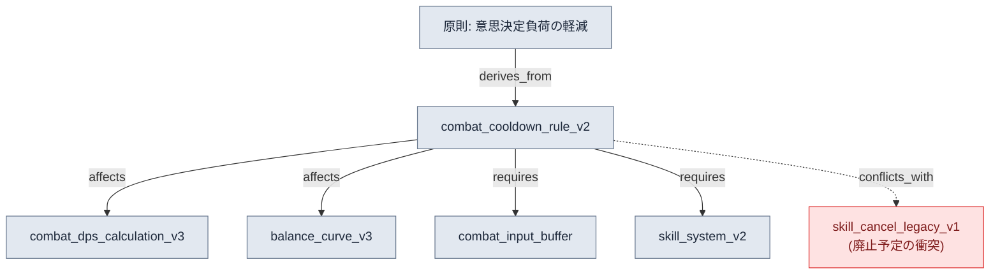
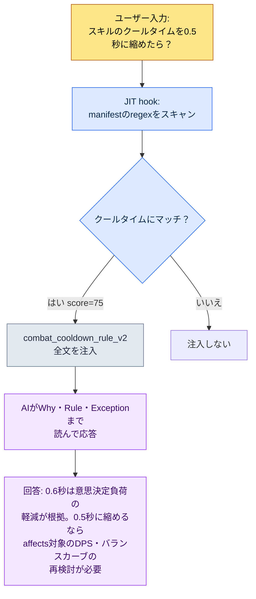

# 2.2 ページ別Atom — 1文書1決定の解剖

新人が入って最初の週、彼がチャットで尋ねてきました。「戦闘のクールタイム（クールダウン）は0.6秒で合っていますか？どのドキュメントに書いてありますか？」。私は「スキルシステムのGDD（Game Design Document、詳細仕様書）にありますよ」と答えました。彼はまた尋ねました。「そのGDDのどのセクションですか？クラス設計の次にダメージカーブ、その後ろにUI表示方式まで220行あるんですが」。ファイルを開いて直接探してあげました。137行目でした。彼は最後に尋ねました。「ところで、なぜ0.6秒なんですか？0.5ではだめだったんですか？」。その答えはどのドキュメントにもありませんでした。6か月前の会議で決めたことは覚えているのに、理由は議事録のどこかに埋もれていました。

この5分間の会話の中に、220行の統合ドキュメントが抱える3つの失敗がすべて詰まっています。位置を見つけられない（検索の失敗）、理由がない（文脈の喪失）、毎回人が仲介しなければならない（自動化の不可）。AIに同じ質問を投げると事情はさらに悪くなります。AIは220行をすべて読んだうえで、クールタイムとは無関係なダメージカーブの話まで混ぜて答えます。

本章の処方箋はシンプルです。**1つのドキュメントには1つの決定だけを入れる。**この原則で細かく分割した決定単位のドキュメントをatomと呼びます。220行のGDDを分割すると「クールタイムは0.6秒」が1つのatomになり、そのatomの中に位置・内容・理由・例外・関係が1か所に集まります。本章では抽象論の代わりに、実際のatom1つを最後まで解剖します。どう命名するか、どんなfrontmatterを記入するか、関係をどう明示するか、そしてその結果、AIがどうやってそのatom1つだけを正確に拾い上げるのか — そこまでを見ていきます。

---

## 2.2.1 検体を1つ選ぶ — `combat_cooldown_rule_v2`

解剖する検体は、プロジェクトAで実際に運用中のatom1つです。名前は`combat_cooldown_rule_v2`。ファイルの全文は次のとおりです。長くはありません。1つの決定だけを入れたのですから。

```markdown
---
name: combat_cooldown_rule_v2
title: "戦闘クールダウン規則 — v2"
type: rule
layer: 1
status: approved
owner: 이민수
created: 2026-03-10
updated: 2026-05-12
applies_to: [skill_system, item_system]
---

# 戦闘クールダウン規則 v2

Why (なぜ): 同時に使用可能なスキル数を制限して瞬間的な意思決定の負担を
減らし、コンボ入力の意味を保存するため。

Rule (規則): すべてのアクティブスキルはグローバルクールダウン0.6秒 + 個別
クールダウン(スキル別定義)を持つ。グローバルクールダウンの進行中は、いかなる
アクティブスキルも発動不可。

How to apply (適用):
- 新規スキル定義時に個別クールダウンを必ず明記
- L3_SkillSheetのcooldownカラムが0であれば本規則違反
- ビルド段階の整合性検査が違反を自動検出

Exceptions (例外):
- パッシブスキルは本規則の適用外
- 究極技は別途ゲージシステム (See: [[ultimate_gauge_system]])

Relations (関係):
- affects: [[combat_dps_calculation_v3]], [[balance_curve_v3]]
- derives_from: [[principle_decision_load_reduction]]
- conflicts_with: [[skill_cancel_rule_legacy_v1]]
- requires: [[combat_input_buffer_system]], [[skill_system_v2]]
- is_a: rule
- part_of: combat_system_master
```

このファイル1枚を、5つの部位に切り分けてみます。命名、frontmatter、単一の決定、関係、トレーサビリティ（追跡可能性）。5つの部位がすべてそろってはじめて、AIはこのatomを「単独でも意味が通る単位」として読みます。

---

## 2.2.2 部位① 命名 — 名前そのものが座標

ファイル名は`combat_cooldown_rule_v2`です。なんとなく付けた名前ではなく、3つのパーツからなる構造を持っています。

```
combat_         cooldown_rule          _v2
└ prefix        └ 決定本文             └ バージョン
  (どのドメイン)  (何についての決定)     (何回目の改訂)
```

prefixの`combat_`は「これは戦闘ドメインの決定」という座標です。プロジェクトAのルールatomは、prefixでドメインが分かれます。`quest_`（クエスト）、`data_`（データ運用）、`docs_`（ドキュメント運用）、`meeting_`（議事録）、`portal_`（企画ビューアー）。prefixを見るだけで、この決定が誰の責任領域なのか、どこから影響を受けるのかがつかめます。

命名が揺らげば、すべてが揺らぎます。同じ決定が`skill-cooldown.md`と`cooldown_skill_v2.md`として二重に存在すると、検索も壊れ、後で出てくるJITマッチングも壊れます。だからプロジェクトAは、命名規則そのものを1つのatomとして先に固定しました。それが`atom_naming_convention_v1`で、snake_case・prefix必須・バージョンsuffixを強制します。そしてこのルールは、人の意志ではなくLinterが守ります。prefixのないファイル名がコミットされると、ビルド段階で弾かれます。

命名には、本書全体を貫くより大きな設計が敷かれています。frontmatterの`layer: 1`がその2つ目の座標です。prefixが「どのドメインか」を語るなら、Layerは「どの抽象階層か」を語ります。2つの座標が組み合わさってはじめて、atomの位置が平面上の1点として確定します。ここでのLayerは座標にすぎません（0〜4の階層定義の詳細は2.3で扱います）。クールタイムルールは「生成を統制する入力ルール」なので、Layer 1に座ります。このLayer座標をドキュメント名の先頭に数字prefixとして強制するルールも別にあります — `docs_layer_numeric_prefix_naming`です。名前1つに、2つの座標軸が明示されているわけです。

この設計の本質は整理癖ではありません。私がチームに繰り返し言ってきた言葉があります。**「プロシージャル生成のために分けたLayerだったわけで」。**atomごとにドメイン座標（prefix）と階層座標（Layer）が明示されていれば、後でAIが「Layer 1のcombatルール全部を入力として受け取り、Layer 2のコンテンツを自動生成する」ことが可能になります。名前は、その自動化のアドレス体系なのです。

---

## 2.2.3 部位② frontmatter — 機械が読むラベル

本文の上、`---`の間にあるYAMLブロックがfrontmatterです。2.1で扱った標準をatomにそのまま適用したもので、人ではなく機械（ビルドスクリプト・JITフック・関係図ジェネレーター）が読むラベルです。

| フィールド | 値 | 機械がこれで行うこと |
|---|---|---|
| `name` | combat_cooldown_rule_v2 | ほかのatomのlink対象になる一意のID |
| `type` | rule | カテゴリー別の統計・フィルター（rule / concept / decision …） |
| `layer` | 1 | Layer別の色分け・整列、逆参照検出の基準軸 |
| `status` | approved | draft・approved・archivedのうちapprovedだけをビルドに含める |
| `applies_to` | [skill_system, item_system] | 影響範囲 — このルールが及ぶシステム |
| `created`/`updated` | 2026-03-10 / 2026-05-12 | 変更の追跡、古くなったatom点検の基準日 |

これらのラベルが記入されていれば、自動検査が可能になります。たとえば`layer: 1`と宣言されたシステムルールが、本文で`[[L3_SkillSheet_row_0042]]`のようなデータatom（Layer 3）を直接参照していれば、それは上位階層が下位階層の具体値に縛られる**逆参照（L3→L1）**です。プロジェクトAはこのパターンをビルド段階で自動検出します。ルールはデータの1行ではなく、データの形式を参照すべきだからです。frontmatterの`layer`という1行がなければ、この検査自体が成立しません。

`status: archived`の処理もfrontmatterの仕事です。決定が変わってもatomは削除されず、`status: archived`と`archived_at`の日付を受け取ります。ビルドとJITはarchivedなatomを除外します。記録は残しつつ、現役からは外れるのです。プロジェクトAの6か月の運用で、廃止率は約15%でした（著者の実測）。この比率が0%に近いなら、廃止のワークフローが機能していないサインだと読みます。

---

## 2.2.4 部位③ 単一の決定 — 一文で要約できるか

atom解剖の核心は、本文が決定を1つだけ入れているかの確認です。検査法はシンプルです。**このatomの決定を一文で要約してみてください。**

> 「すべてのアクティブスキルは、グローバルクールダウン（GCD）0.6秒を持つ。」

一文で終わります。合格です。もし要約が「クールタイムは0.6秒で、コンボ中は50%短縮される」のように二文になるなら、それは2つの決定です。`combat_cooldown_rule_v2`（基本クールタイム）と`combat_combo_cooldown_reduction_v1`（コンボ短縮）に分割します。

単一性を見る補助検査が、さらに2つあります。

**独立廃止検査。**このatom1つだけを廃止しても、システムが崩れないか？クールタイムルールを廃止すれば戦闘バランスは揺らぎますが、システムは回ります。単位として適切です。逆に、廃止すると別の5つが一緒に崩れるなら、その5つは実は1つの決定の5つの断片です。より大きなatomに統合すべきです。

**単一参照検査。**ほかの場所から`[[combat_cooldown_rule_v2]]`の1つだけをlinkとして張っても、意味が通るか？通るなら単位として適切です。この1行を参照するために本文のあちこちを全部読まなければならないなら、まだ分割が足りていません。

これらの検査を通過した本文は、自然と5つのセクションに整列します — Why、Rule、How、Exceptions、Relations。とくに**Whyを消さないでください。**冒頭で新人が最後に尋ねた「なぜ0.6秒なんですか？」の答えがここにあります — 「瞬間的な意思決定の負荷を減らし、コンボ入力の意味を保つため」。6か月後に誰かが「0.5秒に縮めよう」と提案するとき、この1行が議論の出発点になります。Whyが消えたatomは、誰も手を付けられない化石になります。

---

## 2.2.5 部位④ 関係 — 矢印が影響分析を生む

atomの一番下にあるRelationsセクションが、この検体を孤立したメモではなく、グラフの1ノードにします。核心は、単なる「関連ドキュメント」ではなく、**関係の種類を明示する**という点です。



6種類の関係が、それぞれ違う仕事をします。

- `derives_from`: この決定がどの上位原則から派生したのか。クールタイム0.6秒は「意思決定負荷の軽減」という原則の具体化です。
- `affects`: このatomが変わると、何が影響を受けるのか。0.6秒を0.5秒に変えると、DPS計算とバランスカーブが揺らぎます。**変更の前に、影響範囲を自動で抽出できます。**
- `requires`: この決定が成立するには、何が先になければならないのか。先行入力（入力バッファ）システムがなければ、GCDが入力を食ってしまいます。
- `conflicts_with`: 何と矛盾するのか。旧バージョンのスキルキャンセルルールと衝突しており、このリンクが「どちらか一方は廃止されるべきだ」というシグナルです。
- `is_a` / `part_of`: 分類（rule）と所属（combat_system_master）。グラフの骨格です。

単純な「Related: [ドキュメントA], [ドキュメントB]」というリンクだったら、人がいちいち調べなければなりません。関係タイプがenumとして記入されていれば、機械が調べます。「このatomを変えたら影響を受けるものを全部見せて」は`affects`をたどる自動クエリになり、「いま互いに矛盾しているルールを全部探して」は`conflicts_with`をスキャンする自動検査になります。この6つのenumの本格的なオントロジー設計は2.4で扱い、2.2では、atom標準がそのenumを先取りして適用した形だという点だけを押さえておきます。

関係の矢印は、関係図生成ツールの入力でもあります。プロジェクトAの`gen_relation_map.py`は、すべてのatomのfrontmatterの`layer`とRelationsセクションを読み、Layerごとに色分けしたインタラクティブな関係図HTMLを自動で描きます。atomの1つひとつが座標（Layer）と矢印（Relations）を持っているからこそ可能なことです。

---

## 2.2.6 部位⑤ トレーサビリティ — 1つのatomが防いだ30分

5つの部位がすべてそろったatomは、トレース可能です。誰が・いつ・なぜこの決定をし、何を違反として検出するのかが1か所にあります。トレーサビリティの価値は、統計ではなく、実際に防いだ事件として見えるときにもっとも鮮明になります。

プロジェクトAの`meeting_image_caption_standard`というatomは、議事録の添付画像に「どの画面か・なぜ添付したか・何の決定か」をキャプションとして必ず明記せよというルールです。このatomがなかった時代、ある議事録にスクリーンショットがキャプションなしで貼られ、1週間後にそれを見たチームメンバーが「これは何の画面？」を作成者に確認するのに30分かかりました。atomができた後、同じ漏れが再発したときは、ビルド段階のLinterがキャプションのない画像を自動で検出しました。修正まで5分。30分が5分になったのです。

もう1つの検体`skill_listing_budget_wrapper_only_policy`は、グローバルスラッシュコマンドのスロットを12個に制限し、本体のスキルは別のディレクトリに置き、グローバルにはwrapperを12個だけ公開せよというルールです。ルール化される前は、グローバルスラッシュコマンドが40個近くまで膨れ上がり、セッション開始のたびにトークン予算を食いつぶしていました。atomを定義してからは、自動整理ツールが毎セッション開始時に超過分を整理します。ルールが、人の記憶ではなくツールで執行されるのです。

こうしたatomが、プロジェクトAには約304個積み上がっています（著者の実測、6か月運用時点）。分布の大きな枝だけ見ると、再発防止ルール（rule）がもっとも大きな割合を占め、その次が一回限りの意思決定の固定化（decision）・ドメイン概念（concept）・コラボレーション矯正（feedback）の順です。1つのatomが防ぐ時間は分単位ですが、304個積み上がれば、累積の節約は日単位に乗ります。これが、atomを「整理」ではなく「資産」と呼ぶ理由です。

---

## 2.2.7 解剖から自動注入へ — JITの実際の動作

ここまで、atom1つを静的に解剖してきました。今度は、生きて動く瞬間を見ます。1.3のJIT（Just-In-Time）フックは、入力キーワードにマッチするatomだけを選び、その場でコンテキストに注入します。JIT manifestは、各atomにマッチング用キーワードとスコアをマッピングしたJSONです。

```json
{
  "name": "combat_cooldown_rule_v2",
  "path": "atoms/combat/combat_cooldown_rule_v2.md",
  "regex": "쿨다운|cooldown|글로벌 쿨다운|GCD",
  "score": 75
}
```

実際の注入は、こう流れます。



核心は最後のマスです。AIは単に「0.6秒でした」と答えません。atomのWhyを読んだので根拠を示し、Relationsの`affects`を読んだので、変更時に揺らぐ対象（DPS計算・バランスカーブ）まで先回りして指摘します。細かく分割し、理由を書き、関係を明示しておいた5つの部位が、すべて応答の中でよみがえるのです。

ここで、1文書1決定の原則が自動化の前提であることが明らかになります。もしこのatomが220行の統合GDDだったら、「クールタイム」という1単語がマッチした瞬間に、クラス設計・ダメージカーブ・UIまで丸ごと注入されてトークン予算が削られ、AIは5つの決定のどれに答えるべきか焦点を失います。**atomが小さく明確であるほど、JITの精度は上がります。細かく分割された状態は、整理の美徳ではなく自動注入の前提条件なのです。**

scoreは、コンテキスト予算を守る装置です。1つの入力に複数のatomがマッチしたら、scoreの上位N個だけを注入します（デフォルトは3個）。スコア付けの基準は、運用しながら決めていきます。

- 安全・セキュリティ・健康関連のatom = 95〜99（絶対に漏らさない）
- 核心メッセージ・哲学のatom = 90〜94
- ドメインの核心ルール = 75〜89（クールタイムルールはここ、75）
- 参考用・履歴のatom = 30〜50

---

## 2.2.8 個人atomとチーム共有atom — 2つの層の分離

解剖した検体`combat_cooldown_rule_v2`は、`status: approved`を受けたチーム共有atomです。すべてのatomが最初からこの場所に来るわけではありません。プロジェクトAは、atomを2つの層に分けています。

- **個人atom** — 未確定の仮説・個人メモ・その時点の記録の固定化。本人だけが見ます。標準は緩めです。
- **チーム共有atom** — 検証済みのルール。チームメンバー全員が見ます。命名・構造・承認プロセスを通過しなければなりません。

分離する理由は心理的なものです。個人atomが自由であってこそ、検証前の仮説を気負わずに書き、1週間後に廃棄できます。最初からチームに公開されると、「これが間違っていたらどうしよう」と思って、そもそも書かなくなります。逆に、チーム共有atomは厳格であってこそ、全員が信頼して参照します。

`combat_cooldown_rule_v2`も最初は、個人atomの「クールタイム0.6秒をテストしてみよう」という1行メモだったはずです。アルファビルドで検証された後、変更リクエストの形でチーム共有に昇格し、ほかのプランナーのレビューを経て`approved`になりました。この個人→チームの昇格フローそのものが、atomシステムが時間とともに賢くなっていくself-improvingループの一軸です。

---

## 2.2.9 よくある失敗5つ

atom運用の初期に繰り返される失敗は、5つに整理できます。どれも「atomを資産ではなく使い捨てのメモとして扱った」という同じ根から生まれます。

| 失敗 | 何が壊れるか | 回避法 |
|---|---|---|
| 最初の週に作りすぎる | 未検証のatomが積み上がり、運用が崩れる | 検証済みの1〜2個から始め、自然な増加に任せる |
| 廃止をしない | 古いatomがJITにマッチし続けて誤答を生む | 四半期点検、`status: archived`と`archived_at` |
| 抽象的すぎる/具体的すぎる | 「良いデザインをする」は検証不能、雑感の1行は無意味 | 「射程は0.5/1.5/3.0/5.0のみ」の水準で |
| 名前に一貫性がない | 検索・JITマッチングが丸ごと壊れる | 命名規則atomを先に作り、Linterで強制する |
| Whyを書かない | 時間が経つと誰も触れない化石になる | Why・Rule・How・Exception・Relationsの5セクションを強制する |

5つを最初の月から完璧に避ける必要はありません。1番と4番は命名規則atom1つでまとめて解決し、2・3・5番は運用3か月の時点で四半期点検を一度回せば、自然に整列します。

---

## 2.2.10 次の章へ

本章では、atom1つを5つの部位に切り分けてみました。名前（座標）、frontmatter（機械のラベル）、単一の決定（一文検査）、関係（影響分析）、トレーサビリティ（防いだ30分）。そしてその5つの部位が、JITの自動注入の中で丸ごとよみがえる様子を確認しました。

名前に明示された2つの座標のうちの1つ、`layer: 1`を、2.2では軽く触れるにとどめました。2.3が、そのLayerを正面から扱います。atomごとにLayer座標を与えると、分野が違っても、互いの成果物がどこに座っているのかが見え始めます。そして2.4は、本章でenum名だけ借りて使った6つの関係（affects・derives_from・conflicts_with・requires・is_a・part_of）を、オントロジーとして正式化します。YAML（2.1）→ Atom（2.2）→ Layer（2.3）→ Ontology（2.4）と続く情報アーキテクチャの背骨のうち、本章はその2つ目の継ぎ目でした。

---

### 本章のポイント
- atom1つは、名前・frontmatter・単一の決定・関係・トレーサビリティという5つの部位の合計です
- 1文書1決定の原則は、整理癖ではなくJIT自動注入の前提条件です
- 名前に明示されたドメイン・Layerの2つの座標は、プロシージャル生成のアドレス体系になります

---

## やってみよう — atomを1つ作ってJITで注入する

**setup.** 作業フォルダーに`atoms/`ディレクトリを作り、命名規則atom（`atom_naming_convention_v1`）を一番最初に書いてみましょう。snake_case・prefix必須・バージョンsuffixの3行だけでもかまいません。JITを使うなら、`_jit_manifest.json`に空の配列を1つ置いておきます。

**prompt.** 自分が毎回忘れてしまう決定を1つ選び、次のプロンプトでatomのドラフトをもらいましょう。

> 「次の決定をatomの標準形式で作ってください。決定：『アクティブスキルはグローバルクールダウン0.6秒を持つ』。セクションはWhy・Rule・How to apply・Exceptions・Relationsの5つ。frontmatterにはname（snake_case+prefix）、type、layer、status: draft、owner、createdを入れてください。決定が一文で要約できるかも、最後に確認してください。」

**verify.** 受け取ったatomを、3つの観点で検査しましょう。①決定が一文で要約できるか（できなければ分割します）。②Whyが空になっていないか。③manifestに`{"name", "path", "regex", "score"}`の1行を追加し、そのregexのキーワードを実際の入力として投げたとき、atomが注入されるか。3つを通過すれば、最初のatomの完成です。

---

## 一人ミニ版

チームもLinterもビルドパイプラインもない1人開発者なら、本章全体をノートアプリのフォルダー1つに縮められます。

- **命名**: ファイル名を`domain_decision_v1`という1つのルールで統一しましょう。Linterの代わりに、自分の目で守ります。
- **単一の決定**: ノート1枚に決定1つ。タイトルを一文で書けなければ、2枚に分割します。
- **Why必須**: ノートの一番上の1行に「なぜこう決めたのか」を書きましょう。この1行が、6か月後の自分を救います。
- **関係**: 正式なenumの代わりに、`→ 영향:`（影響）、`↑ 근거:`（根拠）、`✕ 충돌:`（衝突）の3つの印を書くだけでも、影響追跡の9割は生きます。
- **JIT代用**: manifestの代わりに、作業開始前に関連ノート1.2〜1.3を直接開いて、AIに貼り付けましょう。手動のJITです。

核心はツールではなく、5つの部位の習慣です。最初の10枚のノートがいちばん難しく、その山を越えれば、次の100枚は手が勝手に作ってくれます。
