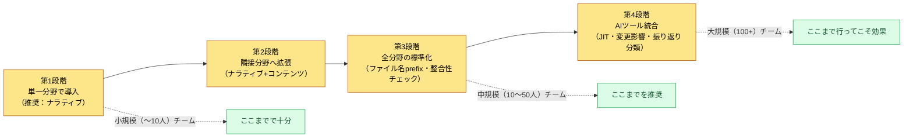

# 2.3 Layer設計 — ゲームシステムの抽象化

分野が3つから8つに増えつつあった四半期のことです。戦闘プランナーがスキルの射程を8mに確定しました。同じ週、レベルデザイナーはダンジョンの通路幅を6mで固定しました。どちらも自分の分野の中では完璧に合理的な決定でした。問題は3週間後のビルドで明らかになりました。範囲スキルが通路の壁を突き抜け、敵が見えもしない場所で死んでいったのです。誰のミスでもありません。二人には、互いの決定をのぞき込む窓がなかっただけです。

本章は、その窓を作る話です。各分野が自分の部屋をそのまま持ったまま、隣の部屋で何が起きているかを座標一つで分かるようにすること。その座標系をLayerと呼びます。

---

## 2.3.1 サイロ化 — 何度でもまた現れる敵

ゲーム企画は分野が細かく分化しています。システム・戦闘・ナラティブ・コンテンツ・レベル・バランス・UX・QA。各分野はそれぞれの道具・成果物・会議を持ちます。規模が大きくなるほど、それぞれが自分の領域に深く入り込み、他の分野が何をしているか分からない状態になります。これをサイロ（silo）化と呼びます。

サイロ化のコストは、時間が経ってからようやく表面化します。

- 戦闘プランナーが決めたスキルの射程が、レベルデザインの通路幅と合わない。
- ナラティブが設計したNPCの動機が、コンテンツ企画のクエスト報酬構造と衝突する。
- バランスプランナーが組んだ経済サイクルが、運営（ライブオプス）のログインボーナス日程とずれる。

実力不足が原因ではありません。それぞれが自分の分野で合理的に決定し、他分野の決定を認知する経路がなかっただけです。会議で埋めようとすれば会議が爆発的に増え、グループチャットで埋めようとすればシグナルがノイズに埋もれます。会議やグループチャットに価値がないという話ではなく、埋められる部分と埋められない部分の境界を明確にすることが核心です。

解決策は、領域を狭めずに（分野の分化は維持）、互いの流れが分かるように（統合された可視性）することです。相反して見える二つの要求は、同じ座標系の上に整列させれば同時に達成できます。その座標系がLayerです。オフィスにたとえれば、各自が自分の机を持ったまま、同じ壁掛け時計とカレンダーを見るようなものです。

---

## 2.3.2 Layerの定義 — 5階層の抽象化

本書で使うLayerは、0〜4の5階層の抽象化です。上に行くほど抽象的で変更がまれになり、下に行くほど具体的で変更が頻繁になります。

<svg viewBox="0 0 760 300" xmlns="http://www.w3.org/2000/svg" font-family="sans-serif" role="img" aria-label="Layer 0から4までの5階層の抽象化構造と各階層のプロシージャル生成の役割">
  <defs>
    <marker id="arrowDown" markerWidth="8" markerHeight="8" refX="4" refY="7" orient="auto">
      <path d="M0,0 L8,0 L4,8 z" fill="#555"/>
    </marker>
  </defs>
  <text x="20" y="24" font-size="13" fill="#888">抽象 · 不変</text>
  <text x="640" y="24" font-size="13" fill="#888">具体 · 変動</text>

  <rect x="20" y="36" width="720" height="42" rx="6" fill="#c0392b" opacity="0.9"/>
  <text x="34" y="55" font-size="14" fill="#fff" font-weight="bold">L0 ビジョン·核心価値</text>
  <text x="34" y="72" font-size="12" fill="#fff">プロシージャル生成の役割: コンテキストアンカー — 不変、毎回の呼び出しで注入される基準点</text>

  <rect x="20" y="86" width="720" height="42" rx="6" fill="#e67e22" opacity="0.9"/>
  <text x="34" y="105" font-size="14" fill="#fff" font-weight="bold">L1 システム·世界の骨格</text>
  <text x="34" y="122" font-size="12" fill="#fff">プロシージャル生成の役割: 生成入力ルール — ルールブック·関係·タグ(生成器が従う制約)</text>

  <rect x="20" y="136" width="720" height="42" rx="6" fill="#f1c40f" opacity="0.95"/>
  <text x="34" y="155" font-size="14" fill="#333" font-weight="bold">L2 コンテンツ·フロー</text>
  <text x="34" y="172" font-size="12" fill="#333">プロシージャル生成の役割: 生成本文が積み上がる場所 — クエスト·進行·レベルカーブ</text>

  <rect x="20" y="186" width="720" height="42" rx="6" fill="#27ae60" opacity="0.9"/>
  <text x="34" y="205" font-size="14" fill="#fff" font-weight="bold">L3 実装·データシート</text>
  <text x="34" y="222" font-size="12" fill="#fff">プロシージャル生成の役割: 数値·ID·関係 — シミュレーションの入力値</text>

  <rect x="20" y="236" width="720" height="42" rx="6" fill="#2980b9" opacity="0.9"/>
  <text x="34" y="255" font-size="14" fill="#fff" font-weight="bold">L4 ビルド·QA成果物</text>
  <text x="34" y="272" font-size="12" fill="#fff">プロシージャル生成の役割: 検証ゲート — ビルド結果·バグ·プレイキャプチャ</text>

  <line x1="10" y1="40" x2="10" y2="274" stroke="#555" stroke-width="1.5" marker-end="url(#arrowDown)"/>
</svg>

5つの階層それぞれがプロシージャル生成・自動化パイプラインで担う役割は、上の図の右側のラベルにあります。このマッピングが本章の背骨です。Layerを「よく整理されたフォルダ」としてだけ見るなら、半分しか見ていません。各階層は生成パイプラインの一段階（アンカー→ルール→本文→数値→ゲート）に正確に対応します。

| Layer | 何を入れるか | 変更頻度 |
|-------|---------------|-----------|
| Layer 0 | ゲームがプレイヤーに与えようとする核心体験。一文に圧縮できる | 非常に低い（プロジェクトの全生涯） |
| Layer 1 | ゲームシステムの大きな構造と世界観の骨格 | 低い（マイルストーン単位） |
| Layer 2 | プレイの流れ、クエストライン、進行段階、レベルカーブ | 中程度（スプリント単位） |
| Layer 3 | 実際のデータ値、パラメーター、数式、変数 | 高い（日単位） |
| Layer 4 | ビルドで確認された結果、バグレポート、プレイ映像 | 非常に高い（リアルタイム） |

この5階層はゲーム専用の概念ではありません。同じ背骨を一般のITプロダクト開発にそのまま移せます。ゲームを作ったことのない読者は、下の職務翻訳表で各階層を自分の成果物に対応させてみてください（左はゲーム企画のLayer、右はSaaS・アプリ・社内システムなどで同じ位置に置かれる成果物です）。

| Layer | ゲーム企画 | 一般ITプロダクト | 同じ問い |
|-------|-----------|--------------|-----------|
| L0 核心体験 | プレイヤーに与えようとする核心体験（一文） | プロダクトビジョン — 誰のどんな問題をどう解くか | 「これをなぜ作るのか」 |
| L1 システムルール | システム構造・世界観の骨格 | 業務・機能ルール — ドメインルール、権限モデル、中核ワークフロー | 「何がどう動くべきか」 |
| L2 コンテンツ | クエストライン・進行段階・レベルカーブ | リリース・ロードマップ — 機能のまとまり、リリース順序、マイルストーン | 「何をいつ出すのか」 |
| L3 データ | データ値・パラメーター・数式 | スペックシート — API仕様、フィールド定義、設定値、しきい値 | 「正確な値と定義は何か」 |
| L4 ビルド・QA | ビルド結果・バグ・プレイ映像 | デプロイ・QA — デプロイ成果物、バグレポート、モニタリングログ | 「実際に出たものが正しく動いているか」 |

読み方はゲームと同じです。上に行くほど変更がまれで（プロダクトビジョンは四半期に一度）、下に行くほど頻繁です（設定値は毎日）。先ほどのサイロ事故 — 射程と通路幅が衝突したあの場面 — は、一般ITの「バックエンドのフィールド定義（L3）とフロントの画面ルール（L1）がずれてリリース直前に爆発する」事態と正確に同じ構造です。分野の名前が違うだけで、背骨は一つです。

この5階層は絶対ではありません。規模とドメインによっては4階層が適切なことも、6階層が必要なこともあります。核心は数字が5であることではなく、階層を明示的に定義するという行為そのものです。

一つの成果物が二つのLayerにまたがることもあります。「スキルシステムGDD（Game Design Document、詳細仕様書）」はシステム設計（Layer 1）と具体データ（Layer 3）を同時に含みます。この場合は文書を分割するか、主Layerを1に置いてデータセクションを別シートに分離します。どちらの方式でも、各部分がどのLayerに住んでいるかを明示します。

---

## 2.3.3 メタ原則 — 分化と統合を同時に

分野は横に広がり、Layerは縦に積み上がります。一つの分野の作業は複数のLayerにまたがります。下のマトリクスは、11の分野（横）×Layer 0〜4（縦）の分布の重心を、セルの色の濃さで表現しています。濃いセルがその分野の重心Layerです。

<svg viewBox="0 0 820 320" xmlns="http://www.w3.org/2000/svg" font-family="sans-serif" font-size="11" role="img" aria-label="11の分野の横軸とLayer 0から4の縦軸の分化統合マトリクス">
  <!-- column headers (分野) -->
  <g fill="#333">
    <text x="120" y="30" transform="rotate(-35 120 30)">システム</text>
    <text x="180" y="30" transform="rotate(-35 180 30)">戦闘</text>
    <text x="240" y="30" transform="rotate(-35 240 30)">ナラティブ</text>
    <text x="300" y="30" transform="rotate(-35 300 30)">コンテンツ</text>
    <text x="360" y="30" transform="rotate(-35 360 30)">レベル</text>
    <text x="420" y="30" transform="rotate(-35 420 30)">バランス</text>
    <text x="480" y="30" transform="rotate(-35 480 30)">UX/UI</text>
    <text x="540" y="30" transform="rotate(-35 540 30)">QA</text>
    <text x="600" y="30" transform="rotate(-35 600 30)">キャラクター</text>
    <text x="660" y="30" transform="rotate(-35 660 30)">アート</text>
    <text x="720" y="30" transform="rotate(-35 720 30)">ライブ</text>
  </g>
  <!-- row labels (Layer) -->
  <g fill="#333" text-anchor="end">
    <text x="95" y="74">L0 ビジョン</text>
    <text x="95" y="124">L1 システム</text>
    <text x="95" y="174">L2 コンテンツ</text>
    <text x="95" y="224">L3 データ</text>
    <text x="95" y="274">L4 ビルド·QA</text>
  </g>
  <!-- grid cells: x columns at 110,170,...,710 ; y rows at 60,110,160,210,260 ; cell 50x40 -->
  <!-- color helper: dark=#2c3e50 mid=#7f8c9b light=#dfe4ea -->
  <!-- L0 row (y=60) -->
  <g>
    <rect x="110" y="60" width="50" height="40" fill="#dfe4ea" stroke="#fff"/>
    <rect x="170" y="60" width="50" height="40" fill="#dfe4ea" stroke="#fff"/>
    <rect x="230" y="60" width="50" height="40" fill="#2c3e50" stroke="#fff"/>
    <rect x="290" y="60" width="50" height="40" fill="#dfe4ea" stroke="#fff"/>
    <rect x="350" y="60" width="50" height="40" fill="#dfe4ea" stroke="#fff"/>
    <rect x="410" y="60" width="50" height="40" fill="#dfe4ea" stroke="#fff"/>
    <rect x="470" y="60" width="50" height="40" fill="#dfe4ea" stroke="#fff"/>
    <rect x="530" y="60" width="50" height="40" fill="#7f8c9b" stroke="#fff"/>
    <rect x="590" y="60" width="50" height="40" fill="#dfe4ea" stroke="#fff"/>
    <rect x="650" y="60" width="50" height="40" fill="#2c3e50" stroke="#fff"/>
    <rect x="710" y="60" width="50" height="40" fill="#dfe4ea" stroke="#fff"/>
  </g>
  <!-- L1 row (y=110) -->
  <g>
    <rect x="110" y="110" width="50" height="40" fill="#2c3e50" stroke="#fff"/>
    <rect x="170" y="110" width="50" height="40" fill="#2c3e50" stroke="#fff"/>
    <rect x="230" y="110" width="50" height="40" fill="#7f8c9b" stroke="#fff"/>
    <rect x="290" y="110" width="50" height="40" fill="#dfe4ea" stroke="#fff"/>
    <rect x="350" y="110" width="50" height="40" fill="#7f8c9b" stroke="#fff"/>
    <rect x="410" y="110" width="50" height="40" fill="#dfe4ea" stroke="#fff"/>
    <rect x="470" y="110" width="50" height="40" fill="#2c3e50" stroke="#fff"/>
    <rect x="530" y="110" width="50" height="40" fill="#7f8c9b" stroke="#fff"/>
    <rect x="590" y="110" width="50" height="40" fill="#2c3e50" stroke="#fff"/>
    <rect x="650" y="110" width="50" height="40" fill="#7f8c9b" stroke="#fff"/>
    <rect x="710" y="110" width="50" height="40" fill="#dfe4ea" stroke="#fff"/>
  </g>
  <!-- L2 row (y=160) -->
  <g>
    <rect x="110" y="160" width="50" height="40" fill="#7f8c9b" stroke="#fff"/>
    <rect x="170" y="160" width="50" height="40" fill="#7f8c9b" stroke="#fff"/>
    <rect x="230" y="160" width="50" height="40" fill="#2c3e50" stroke="#fff"/>
    <rect x="290" y="160" width="50" height="40" fill="#2c3e50" stroke="#fff"/>
    <rect x="350" y="160" width="50" height="40" fill="#2c3e50" stroke="#fff"/>
    <rect x="410" y="160" width="50" height="40" fill="#dfe4ea" stroke="#fff"/>
    <rect x="470" y="160" width="50" height="40" fill="#7f8c9b" stroke="#fff"/>
    <rect x="530" y="160" width="50" height="40" fill="#dfe4ea" stroke="#fff"/>
    <rect x="590" y="160" width="50" height="40" fill="#7f8c9b" stroke="#fff"/>
    <rect x="650" y="160" width="50" height="40" fill="#dfe4ea" stroke="#fff"/>
    <rect x="710" y="160" width="50" height="40" fill="#2c3e50" stroke="#fff"/>
  </g>
  <!-- L3 row (y=210) -->
  <g>
    <rect x="110" y="210" width="50" height="40" fill="#2c3e50" stroke="#fff"/>
    <rect x="170" y="210" width="50" height="40" fill="#2c3e50" stroke="#fff"/>
    <rect x="230" y="210" width="50" height="40" fill="#7f8c9b" stroke="#fff"/>
    <rect x="290" y="210" width="50" height="40" fill="#7f8c9b" stroke="#fff"/>
    <rect x="350" y="210" width="50" height="40" fill="#2c3e50" stroke="#fff"/>
    <rect x="410" y="210" width="50" height="40" fill="#2c3e50" stroke="#fff"/>
    <rect x="470" y="210" width="50" height="40" fill="#7f8c9b" stroke="#fff"/>
    <rect x="530" y="210" width="50" height="40" fill="#7f8c9b" stroke="#fff"/>
    <rect x="590" y="210" width="50" height="40" fill="#2c3e50" stroke="#fff"/>
    <rect x="650" y="210" width="50" height="40" fill="#dfe4ea" stroke="#fff"/>
    <rect x="710" y="210" width="50" height="40" fill="#7f8c9b" stroke="#fff"/>
  </g>
  <!-- L4 row (y=260) -->
  <g>
    <rect x="110" y="260" width="50" height="40" fill="#dfe4ea" stroke="#fff"/>
    <rect x="170" y="260" width="50" height="40" fill="#7f8c9b" stroke="#fff"/>
    <rect x="230" y="260" width="50" height="40" fill="#7f8c9b" stroke="#fff"/>
    <rect x="290" y="260" width="50" height="40" fill="#dfe4ea" stroke="#fff"/>
    <rect x="350" y="260" width="50" height="40" fill="#dfe4ea" stroke="#fff"/>
    <rect x="410" y="260" width="50" height="40" fill="#7f8c9b" stroke="#fff"/>
    <rect x="470" y="260" width="50" height="40" fill="#dfe4ea" stroke="#fff"/>
    <rect x="530" y="260" width="50" height="40" fill="#2c3e50" stroke="#fff"/>
    <rect x="590" y="260" width="50" height="40" fill="#dfe4ea" stroke="#fff"/>
    <rect x="650" y="260" width="50" height="40" fill="#7f8c9b" stroke="#fff"/>
    <rect x="710" y="260" width="50" height="40" fill="#2c3e50" stroke="#fff"/>
  </g>
  <!-- legend -->
  <g>
    <rect x="110" y="305" width="14" height="12" fill="#2c3e50"/>
    <text x="128" y="315" fill="#333">重心</text>
    <rect x="220" y="305" width="14" height="12" fill="#7f8c9b"/>
    <text x="238" y="315" fill="#333">副分布</text>
    <rect x="320" y="305" width="14" height="12" fill="#dfe4ea"/>
    <text x="338" y="315" fill="#333">微小·なし</text>
  </g>
</svg>

縦に読めば一つの分野がどのLayerにまたがるか、横に読めば一つのLayerにどの分野が集まるかが見えます。L0（ビジョン）の行はナラティブとアートディレクションが最も濃くなっています — ビジョンに最も近い二つの分野です。L3（データ）の行にはシステム・戦闘・レベル・バランス・キャラクターが濃く集まります — マスターデータの上でこれらが互いにぶつかるというシグナルです。

この分布を明示的に持っていれば、他の分野が「戦闘のLayer 2を見ればいい」と即座に位置を把握できます。サイロの壁が崩れるのではなく、壁に窓が開くのです。

マトリクス全体を一文に縮めるとこうなります。縦軸のLayerは生成を自動化するために、横軸の分野は専門性を生かすために分けました。両者が格子の一マスで出会います。

---

## 2.3.4 運営事例 — あるMMORPGプロジェクトの実測

著者がデザインディレクターとして運営しているMMORPGプロジェクトAでは、企画チーム（4〜5人）とともにLayerシステムを約6か月運用してきました（開発チーム全体は中規模、10〜50人）。具体的な事例を見てみましょう。

まず、ナラティブの5階層です。ナラティブ企画のフォルダ自体がLayerで分割されています。

<svg viewBox="0 0 640 230" xmlns="http://www.w3.org/2000/svg" font-family="sans-serif" font-size="13" role="img" aria-label="ナラティブフォルダのLayer 0から4までの分割構造">
  <text x="20" y="26" font-weight="bold" fill="#333">NarrativeDocs/</text>
  <g>
    <rect x="40" y="40" width="240" height="30" rx="4" fill="#c0392b" opacity="0.9"/>
    <text x="52" y="60" fill="#fff">Layer0_Vision/</text>
    <text x="300" y="60" fill="#555">世界の核心メッセージ、1.1~1.2</text>
  </g>
  <g>
    <rect x="40" y="76" width="240" height="30" rx="4" fill="#e67e22" opacity="0.9"/>
    <text x="52" y="96" fill="#fff">Layer1_World/</text>
    <text x="300" y="96" fill="#555">地域·勢力·時代の設定</text>
  </g>
  <g>
    <rect x="40" y="112" width="240" height="30" rx="4" fill="#f1c40f" opacity="0.95"/>
    <text x="52" y="132" fill="#333">Layer2_StoryLine/</text>
    <text x="300" y="132" fill="#555">メインクエストの流れ</text>
  </g>
  <g>
    <rect x="40" y="148" width="240" height="30" rx="4" fill="#27ae60" opacity="0.9"/>
    <text x="52" y="168" fill="#fff">Layer3_DialogueSheet/</text>
    <text x="300" y="168" fill="#555">実際の台詞·名前データ</text>
  </g>
  <g>
    <rect x="40" y="184" width="240" height="30" rx="4" fill="#2980b9" opacity="0.9"/>
    <text x="52" y="204" fill="#fff">Layer4_BuildVO/</text>
    <text x="300" y="204" fill="#555">ビルドに入ったボイスオーバー</text>
  </g>
</svg>

ナラティブライターがLayer 2でメインストーリーの一分岐を変えると、Layer 3の台詞シートに影響が及び、すでに録音済みのLayer 4のボイスには不可逆な影響が及ぶ可能性があります。Layerを明示しているからこそ、影響範囲を即座に追跡できます。

関係図の自動生成ツール`gen_relation_map.py`も併せて運用しています。マスターデータ間の外部キー関係を分析してインタラクティブなHTML関係図を作り、Layerをノードの色で表現します（赤=L1システム、黄=L2コンテンツ、緑=L3データ）。どのLayerからどのLayerへ依存が流れているかが一目で分かります。依存が逆に流れたら — L3がL1に向かって矢印を放ったら — ほぼ間違いなく設計上の欠陥です。

プロシージャルレベル生成のマスター文書は、Layer座標をfrontmatterに明示しています。

```yaml
---
title: プロシージャルレベルデザインマスター v0.1
layer_inputs: [L1.World, L2.StoryLine]
layer_outputs: [L3.LevelData, L4.PlayCapture]
---
```

この2行で「このパイプラインはLayer 1・2を入力として受け取り、Layer 3・4を作る」と宣言され、変更時の影響範囲計算が自動化されます。L0のビジョンは明示しなくても常に入力です — どんな生成であれ、ビジョンというアンカーは毎回付いて回るからです。

文書名にLayerのprefixを強制するatomルールもあります。チーム共有atomの一つはこうです。

> **`docs_layer_numeric_prefix_naming`**：マスターデータのファイル名は必ずLayer番号のprefix（`L1_`、`L2_`、`L3_`）を持たなければならない。prefixのないシートは整合性チェックで警告。

ルールは単純なほど強力です。名前順に並べ替えるだけでLayerごとにまとまり、AIツールもファイル名だけでLayerを把握します。人が忘れても整合性チェックが捕まえます。

---

## 2.3.5 逆参照の検出 — ワークド・トランスクリプト

前の節（2.3.4）で「L3がL1に向かって矢印を放ったら、ほぼ間違いなく設計上の欠陥」と述べました。この検出を人の目ではなくAIに任せるとどうなるでしょうか。実際に回してみた一連のやり取りを、整形せずそのまま掲載します（会社の識別情報のみ匿名化しています）。

**[プロンプト全文]**

```
添付した二つのfrontmatterを見て、Layerの依存方向が正常か確認して。
参照は高い番号→低い番号にだけ流れていれば正常。逆なら警告。

--- 文書 A (L1_combat_system.md) ---
title: 戦闘システム骨格
layer: L1
refs: [L3_skill_damage_sheet, L2_combat_flow]

--- 文書 B (L3_skill_damage_sheet.md) ---
title: スキルダメージシート
layer: L3
refs: [L1_combat_system]
```

**[Claudeの生の出力 — 要約なしでそのまま]**

```
二つの文書を検査しました。

文書 B (L3_skill_damage_sheet, L3):
  refs → [L1_combat_system]
  方向: L3 → L1 (具体 → 抽象)
  判定: 正常。データシートが自分の従うシステム骨格を
        参照するのは自然な方向です。

文書 A (L1_combat_system, L1):
  refs → [L3_skill_damage_sheet, L2_combat_flow]
  - L1 → L2 : 正常 (設計が下位の流れを指す)
  - L1 → L3 : ⚠ 逆方向警告
        L1のシステム骨格がL3のデータシートを直接参照して
        います。これは「設計文書が特定のデータ値に
        従属する」という意味で、データが変わるたびに設計
        文書に手を入れる結合を生みます。

勧告: 文書 A の refs から L3_skill_damage_sheet を除去。
      システム骨格が具体的な数値を知る必要があるなら、その数値を
      L1に抽象ルールとして移すか(例: 「基本ダメージは
      クラス係数 × レベル」)、L2のフロー文書を経由してください。

要約: 逆方向参照 1件 検出 (A: L1 → L3)。
```

**[人による検証/拒否]**

AIの判定は正しいです。ただし「L2のフロー文書を経由せよ」という勧告は、このケースでは行きすぎでした。L1が知るべきだったのはダメージ式の*形*であって、シートの特定のセルではありませんでした。そこで二つ目の勧告（抽象ルールとして引き上げる）だけを採択し、経由の提案は拒否しました。

**[再依頼]**

```
経由の提案は外して、「ダメージ公式の形だけL1に抽象ルールとして
上げる」という方向で L1_combat_system.md の修正diffだけ見せて。
refsも整理して。
```

この1サイクルが逆参照検出の本拠地です。AIが方向違反を捕まえ（自動）、人が勧告の適正ラインを削り（レビュー）、絞り込んだ作業だけを再び任せる（再依頼）。プロジェクトAでは`gen_relation_map.py`がグラフ単位で、`portal_layer_change_impact_check`というatomが変更検知のタイミングで発動し、影響範囲の点検を強制します。

この突き合わせを人が手作業でやれば、二つの文書を開いてrefsを照合し、方向を判定するのに数分かかります。文書が数百に増えれば事実上不可能です。逆参照はいつも一つ二つとひそかに入り込み、ずっと後のビルドで初めて爆発します。

---

## 2.3.6 Layer分解 = プロシージャル生成・自動化の前提

Layer統合の表面的な目的は、サイロの解消と協業言語の統一です（2.3.1〜2.3.5）。本質的な目的はもう一段深いところにあります。Layer分解が定着すると、プロシージャル生成・自動化の前提条件が整います。

前の二つの節の運営事例は、人が決定し、AIが検証・注入を手伝う段階でした。その次は、分野そのものの量産をAIが候補として作り、人が採択する段階に入ります。この移行の前提がLayer分解である理由は三つです。① AIによる候補生成は「どのLayerの何を生成するか」を明示できなければなりません。② 自動整合性チェックは、Layer間の依存方向が標準化されて初めて機能します（2.3.5の逆参照検出）。③ 変更影響の自動計算は、変更がどのLayerで起きたかという座標があって初めて可能です。三つとも「Layer分解がなければ自動化そのものが詰まる」に集約されます。座標を分けた手つきの先には、最初からプロシージャル生成が置かれていたのです。

分野別の部をまだ読んでいない段階で深入りする必要はないので、適用の二段階だけ輪郭をつかんでおきましょう。**保守的適用**では、人が決定し、AIが整合性チェック・変更影響計算・JIT注入を自動で支えます — 2.3.4・2.3.5の運営事例がここに当たります。ツールのコストは小さく、累積効果は運用6か月目あたりで表れ、大半の中規模（10〜50人）チームが到達できます。**進歩的適用**はさらに一歩進み、分野の量産そのものをAIが候補として作り（ナラティブのPersona、PCGルールブック、プロシージャルレベル、バランス変更候補、アートアセットなど）、人は「どの候補を採択するか」だけを決定します。分野ごとの形とツールの成熟度は、該当する分野の部で扱います。

進歩的適用に分野共通で必要な3要素は、① Layer分離・ラベリングのインフラ（frontmatter・atom・ファイル名prefix）、② 候補の生成・評価サイクル（AIが候補をN個 → 自動評価 → 順位・根拠レポート）、③ 人によるレビューゲート（採択された結果だけが次のLayerへ）です。ただし、どの時点でも決定論コア（シミュレーション・物理・法的制約）は人と決定論的なコードが担当し、すべてのレビューは不可逆段階（録音・キャスティング・ライブ公開など）に入る前の可逆段階で完結させます — この可逆/不可逆の境界は分野共通の原則です。

最後に時点の話を一つ。保守的適用は2010年代にも部分的に可能でしたが、進歩的適用は、AIによる候補生成の表現力、自動評価の自然言語解釈、人のレビュー負担という三つの限界に阻まれていました。LLMの発展以降、三つとも実用域に入り、進歩的適用が紙の上のビジョンから実務の段階へ降りてきました。AIの発展がプロシージャル生成・自動化の実現可能性を引き上げたという、この本全体を貫くメタメッセージがここにあります。

---

## 2.3.7 分野の座標 — 本書の分野別の部が住む場所

本書の分野別の部は、各分野が主にどのLayerに分布するかを導入部で明示し、章の中でもLayer座標を頻繁に使います。先に整理しておきます（2.3.3のマトリクスの重心を表に移したものです）。

| 分野 | 主なLayer | 備考 |
|------|----------|------|
| システム企画 | L1〜L3 | 設計骨格からマスターデータまで幅広く |
| 戦闘企画 | L1〜L3、一部L4 | コンボ骨格〜ダメージシート、ビルド計測 |
| ナラティブ企画 | L0〜L4 | 5層構造をフォルダで運用 |
| コンテンツ企画 | L2中心 | 進行フロー・クエストライン |
| レベルデザイン | L2〜L3 | プロシージャル生成パイプラインを含む |
| バランス企画 | L3中心、L4で計測 | データ値・カーブ・検証計測 |
| UX/UIデザイン | L1〜L3 | インタラクション骨格〜画面データ |
| QA設計 | L4中心、L0〜L3を検証 | すべてのLayerがビルドに反映されたかを検証 |
| キャラクター・ペット・マウント | L1〜L3 | システム・世界・データ |
| アートディレクション | L0〜L1 + L4成果物 | ビジョン・世界ガイド + ビルドのチェック |
| 運営（ライブオプス） | L2〜L4 | 運営サイクル・リアルタイムデータ |

各分野は他のLayerにも触れますが、重心が分かれば協業の通路が見えます。バランス（L3）と運営（L2〜L4）はL3で出会うため常に近くで協業すべきですし、ビジョン（L0）に最も近い二つの分野はナラティブとアートディレクションです。こうした隣接関係が、座標系の上で自然に浮かび上がります。

---

## 2.3.8 小さく始めて、大きく育てる

Layerシステムを最初から完璧に導入しようとすると、スタートすら切れません。段階的に取り入れるのが正解です。



- **第1段階（単一分野）**：一つの分野（推奨：ナラティブ）だけを選び、フォルダをLayerで分割します。他の分野はそのままにして、1〜2か月運用しながらLayerの定義を磨きます。
- **第2段階（隣接分野へ拡張）**：分化カーブが近い二つの分野（例：ナラティブ+コンテンツ）に同時に適用してLayerがかみ合うパターンを観察し、atomで整合性ルールを1〜2個作ります。
- **第3段階（全分野の標準化）**：全分野にLayer座標を与え、ファイル名ルール（`L1_`・`L2_`・`L3_`のprefix）を導入し、関係図・整合性チェックを自動化します。
- **第4段階（AIツール統合）**：JITフックでLayerメタデータを活用し、変更影響範囲を自動計算し、振り返りシステムにLayer分類を加えます。

各段階は最短でも1か月、長ければ四半期単位です。無理をすると人が疲弊します。運用負担が導入価値を超えないよう速度を調節するのがディレクターの仕事です。

小規模（〜10人）は第1〜2段階、中規模（10〜50人）は第3段階、大規模（100+）は第4段階まで行って初めて効果が出ます。小さいチームには使えないという意味ではありません。深さが違うだけで、核心的な価値は第1段階ですでに始まっています。

---

## 2.3.9 結論 — 本全体の背骨

Layerは単なるフォルダ整理の技法ではありません。分化したゲーム企画を一つの座標系で束ね、AIが推論できるようにするメタ原則であり、さらには分野別のプロシージャル生成・自動化に共通する前提条件です。

- 分化は生かす — 各分野の専門性と道具はそのまま残す。
- 統合は加える — すべての成果物が同じ座標系の上に整列する。
- AIはこの座標系を理解し、自動注入・整合性チェック・変更伝播を実行する（保守的適用）。
- 同じ座標系の上で、分野別の進歩的適用が段階的に育っていく。

本書の残りのすべての部は、本章を前提にしています。分野別の部は各分野がLayerで占める座標を導入部で明示し、プロセスの部はLayerを横断する運営システムを、運営の部はLayerシステム自体のself-improvingサイクルを扱います。

次の章（ゲームオントロジーと知識グラフ）は、Layerの上に意味の関係を加えます。Layerが座標なら、オントロジーはその座標の上の意味の矢印です。両者が合わさって初めて、AIは「この文書があの文書に影響を与える」を自律的に推論します。

はっきりさせておきたいことがあります。本章のどの自動化も、決定を代行してはいません。逆参照の検出で機械は違反候補を並べただけで、何をどこまで受け入れるかを選んだのは人の手でした。Layerは、人がより良い決定をより速く下せるよう助ける座標系であって、決定を丸投げする装置ではありません。

---

### 本章のポイント

- Layerは分野の分化を生かしたまま統合された可視性を加える座標系であり、本全体の背骨です。
- 5階層のそれぞれがプロシージャル生成の一つの役割（アンカー・ルール・本文・数値・ゲート）に対応します。
- 逆参照（L3→L1）の検出のように、AIが捕まえて人が削るのが自動化の正解の形です。

### 本章の核心atom（参考）

- `layer_unified_design_philosophy` — 本章の母体となるatom
- `docs_layer_numeric_prefix_naming` — ファイル名prefixの強制ルール
- `dead_table_5layer_cleanup` — 5階層外のシート整理ルール
- `portal_layer_change_impact_check` — 変更影響の自動チェック

### 次章のプレビュー

- 7章. ゲームオントロジーと知識グラフ — Layer座標の上に意味の矢印を加える
- 8章. Wikilinkシステム — 運営ノウハウから抽出した参照パターン

---

## やってみよう

**setup** — 一つの分野（推奨：ナラティブ）のフォルダを選び、下位フォルダを`Layer0_Vision/`から`Layer4_BuildVO/`まで5つに分けてみましょう。既存のファイルを該当するLayerへ移してください。名前が曖昧なファイルは「この文書が変わる頻度」を基準に配置します（頻繁に変わるなら下のLayer）。

**prompt** — マスターデータのfrontmatterを二つ選び、2.3.5のプロンプト全文をそのまま貼り付けて、Layerの依存方向を判定させてみましょう。核心ルールを一行だけ正確に与えれば十分です。「参照は具体→抽象（高い番号→低い番号）へのみ流れていれば正常」。

**verify** — AIが逆方向の参照を捕まえたら、その勧告をそのまま受け取らず、適正ラインを自分で削りましょう（2.3.5の「人による検証/拒否」）。採択した方向だけをdiffで再依頼します。名前順に並べ替えたときにLayerが上から下へまとまって見えれば、prefixルールが根付いた証拠です。

## 一人ミニ版

一人で作業していてもLayerは機能します。チームがないので「分野間のサイロ」はありませんが、「時点間のサイロ」があります。3週間前の自分と今日の自分は、互いの決定を忘れます。フォルダをLayer 0〜4に分けるだけでも — ビジョン1枚、システム骨格数枚、進行フロー、マスターデータ、ビルドメモ — 過去の自分がどのマスに何を置いたか即座に見つかります。AIに「いまL2の作業中」と一行添えるだけで、無関係なLayerの資料を引っ張ってこなくなります。4階層・3階層に減らしても構いません。数字ではなく「階層を明示する」という行為が核心です。
