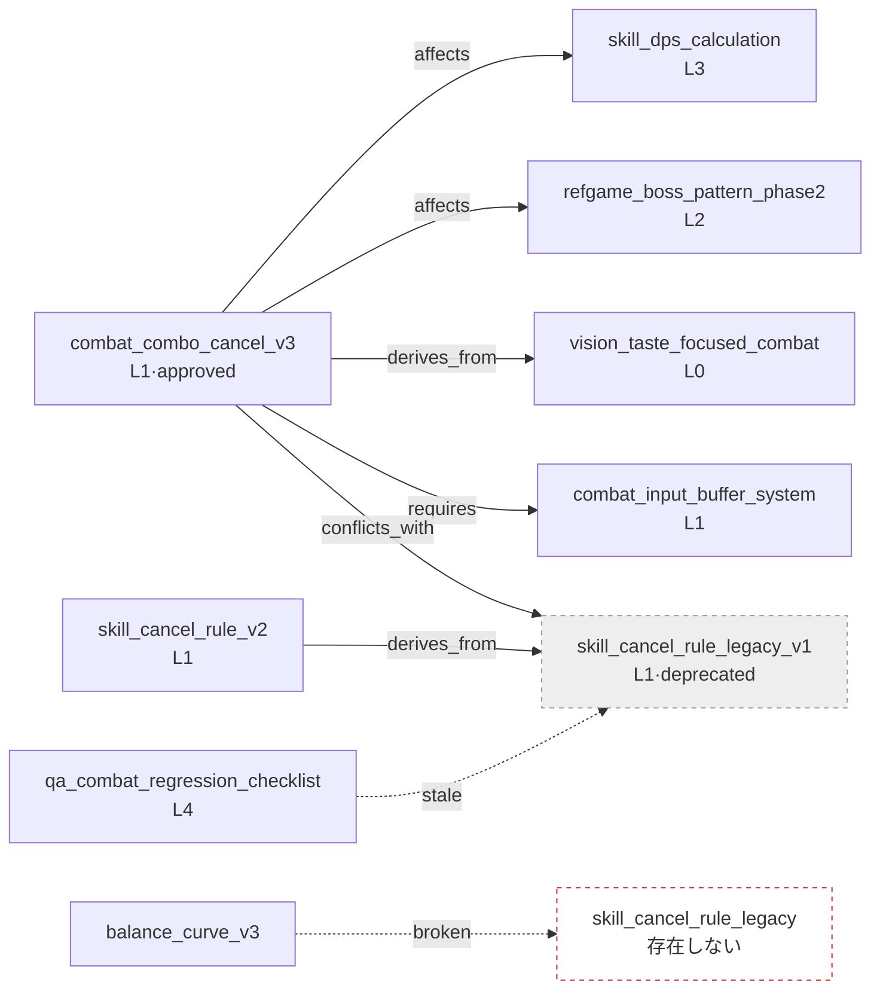

# 2.4 オントロジーとwikilinkグラフ — 意味の矢印を検証する

月曜の午前、変更リクエストが1件上がってきました。戦闘チームのメンバーAが社内メッセンジャーに一行を書き込みます。「グローバルクールダウン（GCD）を0.5秒 → 0.3秒に変えます。影響を受けるところはありますか？」普段ならここから30分の会議が始まります。ダメージ計算式の担当が手を挙げ、コンボキャンセルルールの担当が割り込み、誰かが「ボスパターンにも影響があるのでは」と尋ねます。誰も全体像を頭の中にすべて持ってはいないので、会議は記憶をたどる作業で埋まっていきます。

ところが今回は違います。リクエストが上がった1秒後、ボットが自動でコメントを付けます。「このatomを変えると4個のatomが影響を受けます。`skill_dps_calculation`、`combat_combo_cancel_v3`、`refgame_boss_pattern_phase2`、`balance_curve_v3`。担当：メンバーB、メンバーA、メンバーC」。会議は開かれませんでした。4人がそれぞれ自分のatomだけを確認して終わりました（このボットは後ほど自分たちの手で作ります — 2.4.3）。

このコメントは魔法ではありません。2.3ですべてのatomにLayer座標を与え、その上に本章で**意味の矢印** — どの決定がどの決定に影響を与えるのか — を加えたからです。座標は「ここに何がある」までしか語りません。「これがあれに影響を与える」「あれが先にないと成立しない」「この2つは同時に有効にしてはいけない」といった関係は、座標の上に描かれる矢印です。本章では、その矢印をどう表記し、壊れた矢印をどう自動で捕まえるかを扱います。

> **用語メモ**
> - オントロジー（ontology）：概念とその間の関係を明示的に定義した体系。本書では6〜12個の関係に単純化した軽量版を使います。
> - wikilink：`[[atom_name]]`形式の文書間リンク。Obsidian・Roamなどで使われる表記を借用しました。
> - バックリンク（backlink）：「このatomを指しているatom」の一覧。順方向参照の逆方向。
> - 孤立ノード（orphan）：どこからも参照されていないatom。廃止候補のシグナル。
> - リンク切れ（broken link）：存在しないatomを指すwikilink。タイポ・名前変更の痕跡。

---

## 2.4.1 関係は矢印だ — wikilinkだけでは足りない理由

2.1でYAMLフロントマターとしてメタデータを付け、atomの本文にはwikilinkをちりばめました。それだけで文書はすでに網の目のようにつながります。問題は、そのつながりが**何を意味するのか書かれていない**という点です。

```markdown
この決定は [[skill_cooldown_rule_v2]] の上で成立する。
```

この一行は「skill_cooldown_rule_v2に言及している」までしか語りません。なぜ言及するのでしょうか。この決定があの規則を**必要とする**（requires）のか、あの規則から**派生した**（derives_from）のか、それともあの規則と**競合する**（conflicts_with）のか。人は文章を読めば分かりますが、機械には分かりません。AIに「この決定を有効にすると壊れるものはあるか」と尋ねても、意味のないリンクだけでは答えられません。

そこでwikilinkに**関係タイプ**を着せます。ゲーム企画で実際に使われる関係は意外と少ないものです。次の6つが90%以上をカバーします。

<svg viewBox="0 0 720 250" xmlns="http://www.w3.org/2000/svg" font-family="sans-serif" font-size="13">
  <rect x="0" y="0" width="720" height="250" fill="#fbfbfd" stroke="#ddd"/>
  <!-- affects -->
  <rect x="20" y="20" width="120" height="44" rx="6" fill="#fff" stroke="#222"/>
  <text x="80" y="40" text-anchor="middle" font-weight="bold">affects</text>
  <text x="80" y="56" text-anchor="middle" fill="#666">影響を与える</text>
  <!-- derives_from -->
  <rect x="160" y="20" width="120" height="44" rx="6" fill="#fff" stroke="#1a66cc"/>
  <text x="220" y="40" text-anchor="middle" font-weight="bold" fill="#1a66cc">derives_from</text>
  <text x="220" y="56" text-anchor="middle" fill="#666">~から派生</text>
  <!-- requires -->
  <rect x="300" y="20" width="120" height="44" rx="6" fill="#fff" stroke="#e08a00"/>
  <text x="360" y="40" text-anchor="middle" font-weight="bold" fill="#e08a00">requires</text>
  <text x="360" y="56" text-anchor="middle" fill="#666">先に必要</text>
  <!-- conflicts_with -->
  <rect x="440" y="20" width="130" height="44" rx="6" fill="#fff" stroke="#cc2222"/>
  <text x="505" y="40" text-anchor="middle" font-weight="bold" fill="#cc2222">conflicts_with</text>
  <text x="505" y="56" text-anchor="middle" fill="#666">同時適用不可</text>
  <!-- is_a -->
  <rect x="590" y="20" width="110" height="44" rx="6" fill="#fff" stroke="#888"/>
  <text x="645" y="40" text-anchor="middle" font-weight="bold" fill="#888">is_a</text>
  <text x="645" y="56" text-anchor="middle" fill="#666">特殊事例</text>
  <!-- part_of -->
  <rect x="300" y="90" width="120" height="44" rx="6" fill="#fff" stroke="#bbb"/>
  <text x="360" y="110" text-anchor="middle" font-weight="bold" fill="#999">part_of</text>
  <text x="360" y="126" text-anchor="middle" fill="#666">~の一部</text>
  <!-- example wiring -->
  <text x="360" y="175" text-anchor="middle" fill="#333" font-size="14">例: combat_combo_cancel_v3 —[affects]→ skill_dps_calculation</text>
  <text x="360" y="200" text-anchor="middle" fill="#333" font-size="14">combat_combo_cancel_v3 —[derives_from]→ vision_taste_focused_combat</text>
  <text x="360" y="225" text-anchor="middle" fill="#333" font-size="14">combat_combo_cancel_v3 —[requires]→ combat_input_buffer_system</text>
</svg>

この6つをenumとして固定するatomが`ontology_relation_enum_v1`です。新しい関係タイプを追加するには、変更リクエストのレビューを通すようにします。増えても10〜12個が適正ラインで、最初はaffects・derives_from・requiresの3つで始めても十分です。関係を書く場所はatomのYAMLフロントマターです。

```yaml
---
name: combat_combo_cancel_v3
layer: 1
affects: [skill_dps_calculation, refgame_boss_pattern_phase2]
derives_from: [vision_taste_focused_combat]
requires: [combat_input_buffer_system, skill_cooldown_rule_v2]
conflicts_with: [skill_cancel_rule_legacy_v1]
---
```

人は順方向の1行だけを書きます。逆方向（「自分を誰がaffectsしているか」）は、ツールが全体をスキャンして計算します。affectsを両側に書くと同期の負担が2倍になり、片側だけ直してもう片側を忘れた瞬間、グラフが嘘をつき始めます。**一方向だけ手で、逆方向はツールで** — これが本章全体を貫く原則です。

---

## 2.4.2 ワークド・トランスクリプト — wikilinkのバックリンクとグラフ整合性を一度に検証する

ここからは、実際にあった1つのセッションを丸ごと載せます。状況はこうです。コンボキャンセル規則をv2からv3へ作り直すにあたり、`skill_cancel_rule_legacy_v1`を廃止することにしました。ただし廃止する前に、**このatomを指している他のatomがないか**（バックリンク）、そして**廃止後にリンク切れや競合が残らないか**（グラフ整合性）を確認しなければなりません。手でgrepすると見落とします。Claudeにやらせます。

### プロンプト（全文）

```
添付した atom フォルダ(decisions/)には atom があり、フロントマターに関係
(affects/derives_from/requires/conflicts_with/is_a/part_of)が書かれて
いるはず。本文には wikilink もある。いま skill_cancel_rule_legacy_v1
を廃棄しようとしているが、廃棄前に3つを検査して: 1) 逆参照 2) 壊れたリンク
3) 競合。推測せず実際にファイルを読んで答えて。見つからなければ見つからないと言って。
// 逆参照=YAML 関係+本文 wikilink の両方 / 壊れたリンク=廃棄で stale・未存在になるリンク
// 競合=conflicts_with の相手のうち status: approved が生きているか
```

### Claude出力（生のまま — 要約・整理なし）

> decisions/フォルダの47個のファイルを読みました。`skill_cancel_rule_legacy_v1`に対する3つの検査結果です。
>
> **1. バックリンク（このatomを指しているatom）**
>
> YAML関係で指しているatom：
> - `combat_combo_cancel_v3` — `conflicts_with: [skill_cancel_rule_legacy_v1]`
> - `skill_cancel_rule_v2` — `derives_from: [skill_cancel_rule_legacy_v1]`
>
> 本文のwikilinkで指しているatom：
> - `combat_combo_cancel_v3`の本文：「旧バージョン`[[skill_cancel_rule_legacy_v1]]`の先行入力の問題を解決する」
> - `qa_combat_regression_checklist`の本文：「リグレッション項目3番は`[[skill_cancel_rule_legacy_v1]]`を基準に作成」
>
> つまり**4個のatomがこのatomを参照**しています（YAML 2 + 本文wikilink 2。ただしcombat_combo_cancel_v3は両方なので、実際のatom数は3個です）。
>
> **2. リンク切れ（廃止で壊れる箇所）**
>
> 廃止そのものではwikilinkは「壊れ」ません — ファイルは残り、statusがdeprecatedになるだけだからです。ただし：
> - `qa_combat_regression_checklist`は廃止されたatomを基準にリグレッション項目を定義しているため、**内容として無効**になります。これはリンク切れではありませんが、staleリンクです。要検討。
> - もしファイルを**削除**までされるなら、上の4個の参照がすべてリンク切れになります。
>
> ⚠️ 1つ曖昧な点があります：`balance_curve_v3`の本文に`[[skill_cancel_rule_legacy]]`（末尾に`_v1`がない）というリンクがあります。これがタイポで`_v1`を指そうとしたものなのか、それとも別のatomを意図したものなのか、ファイルだけでは確信できません。`skill_cancel_rule_legacy`という名前のファイルはフォルダに**ありません**。つまり、これはすでにリンク切れである可能性が高いです。確認が必要です。
>
> **3. 競合の残存（conflicts_with相手が生きているか）**
>
> `skill_cancel_rule_legacy_v1`と`conflicts_with`で結ばれたatomは`combat_combo_cancel_v3`の1つです。
> - `combat_combo_cancel_v3`のstatus：**approved**（生きている）
>
> → 廃止対象と競合していた新規規則が正常に承認された状態です。これは正常です。旧バージョンを廃止して新バージョンが生き残る、自然な置き換えです。**競合残存の警告ではありません。**
>
> ---
> **要約**：廃止は安全ですが、2つを先に処理してください。
> (a) `qa_combat_regression_checklist`のstaleリンク — リグレッション項目3番の更新。
> (b) `balance_curve_v3`の`[[skill_cancel_rule_legacy]]` — タイポの疑い。すでにリンク切れの可能性。

### 人による検証と拒否

ここで私は、出力をそのまま受け取りませんでした。(a)は正しい — リグレッションチェックリストは私が更新すべきものです。しかし(b)で立ち止まりました。Claudeは`balance_curve_v3`の`[[skill_cancel_rule_legacy]]`を「タイポの疑い」としましたが、本当にリンク切れなのかは、私が直接フォルダを見る必要がありました。AIの「確信できない」は正直なシグナルであって、結論ではありません。

フォルダを開いて確認すると、`skill_cancel_rule_legacy`というファイルは実際にありませんでした。ところがgit logを見ると、6か月前に`skill_cancel_rule_legacy` → `skill_cancel_rule_legacy_v1`へと**名前だけを変えたコミット**がありました。そのとき`balance_curve_v3`の本文リンクを更新しそびれて、そのまま流してしまったのです。つまり、これはタイポではなく**リネーム後に取り残されたリンク切れ**でした。Claudeの「タイポの疑い」という推測は半分だけ当たっていました。原因はタイポではなくリネーム漏れです。この違いを私が捕まえていなければ、リグレッションチェックリストだけを直して、リンク切れはそのまま埋もれていたでしょう。

### 再依頼（確認済みの事実を反映）

```
確認した。[[skill_cancel_rule_legacy]] はタイポではなく、6か月前の
rename(_legacy → _legacy_v1) のとき本文リンクを直しそびれた壊れたリンクだった。

ではこの機会にフォルダ全体から「存在しない atom を指す wikilink」を
全部探して。本文 wikilink 基準で、対象ファイルがフォルダにないもの全部。
ファイル名とその中の壊れたリンクを表で。
```

> 47個のファイルのすべての`[[...]]`本文wikilinkを収集し、フォルダのファイル一覧と照合しました。対象ファイルが存在しないリンク切れは**3件**です。
>
> | リンクを持つファイル | リンク切れのwikilink | 推定原因 |
> |---|---|---|
> | `balance_curve_v3` | `[[skill_cancel_rule_legacy]]` | リネーム漏れ（→ `_v1`） |
> | `quest_reward_table_v2` | `[[concept_reward_currency]]` | 対象atomが未作成（計画だけあってファイルなし） |
> | `refgame_boss_pattern_phase2` | `[[skill_global_cooldown]]` | リネーム漏れ（→ `skill_global_cooldown_rule`） |
>
> 3件のうち2件（リネーム漏れ）は、対象のatom名を`_v1` / `_rule`に直せば済みます。1件（`concept_reward_currency`）は指す先のatom自体がないため、作成するかリンクを削除する必要があります。自動では直していません — どちらを意図されたのか、確認のうえ進めてください。

3件とも事実でした。手でgrepしていたら、`quest_reward_table_v2`のリンク切れはほぼ確実に見逃していたでしょう。あのリンクは「まだ作っていないatomをあらかじめ指しておいた」意図された未来参照でしたが、6か月間誰もそのatomを作らず、事実上、死んだ約束になっていました。

このセッションが示すことは単純です。**バックリンクの検出とリンク切れの検出は、フォルダ全体を読んで照合する作業に強いAIが担い、原因の判定と意図の確認は人が担う。**AIは「ここが壊れている」まで、人は「なぜ壊れ、どう直すか」まで、です。

---

## 2.4.3 グラフに描くと見えるもの — 検証を視覚に移す

前節の検査を毎回プロンプトで回すこともできますが、同じ検査をコードに固めると、グラフの上で一目で見えるようになります。プロジェクトAでは、2.3で紹介した`gen_relation_map.py`を拡張したグラフツールがR&Dとして動いています。核心は、フォルダのatomを読んで`networkx`の有向グラフとしてビルドした後、4つの検査関数を載せることです。

```python
import networkx as nx

# build_graph(folder): atom フォルダを読んでノード(=atom)と
#   YAML 関係エッジで DiGraph を作る。(全文は「やってみよう」)

def find_cycles(G):                      # 循環依存
    return list(nx.simple_cycles(G))

def find_orphans(G):                     # インバウンド 0 = 孤立候補
    return [n for n in G.nodes if G.in_degree(n) == 0]
```

核心は2行です。`simple_cycles`が循環依存（A requires B requires C requires A）を、`in_degree(n) == 0`が孤立ノードを捕まえます — 自分でDFSを書く必要はありません。残りの2つの関数も同じ調子の1行ものです。`find_broken_wikilinks`は本文の`[[...]]`を正規表現で収集してノード一覧にないものを選り分け、バックリンクはグラフを逆向きにたどれば出てきます（全文は「やってみよう」）。可視化は、ノードの色をLayerで、エッジの色を関係タイプで塗り、よく参照されるノード（インバウンドのエッジが多いノード）は大きく描いて、ハブが浮かび上がるようにします。キャビネットに色ラベルを貼って整理したフォルダのように、視野の中でパターンが先に浮かんでくるのです。

以下は、2.4.2のセッションで扱ったatomの実際の関係を写したグラフです。矢印の向きは「出発atomが到着atomへ関係を張る」という意味です。



点線で描かれた2本のエッジが、2.4.2で人による検証が捕まえた問題です。`qa → legacy`は廃止atom基準のstaleリンク、`balance_curve_v3 → skill_cancel_rule_legacy`は存在しないノードを指すリンク切れ。グラフに描けば、この2本の点線が実線の間で際立ちます。テキストだけで運用していたら、47個のファイルのどこかに埋もれて、永遠に見えなかったでしょう。

検証ゲート（Layer 4）で自動で回る規則は4つです。

- **循環依存**：`requires`の連鎖が自分自身に戻ってきたら警告。`simple_cycles`で検出。
- **競合の同時有効化**：`conflicts_with`で結ばれた2つのatomが両方とも`status: approved`なら警告（2.4.2のケースは片方がdeprecatedのため通過）。
- **孤立ノード**：インバウンド0で親もないatomは廃止候補として四半期ごとに点検。atom `graph_orphan_detection_quarterly`がこの周期を明示しています。
- **Layer逆行**：L1 → L3のaffectsは正常（上位の決定が下位のデータに影響）、L3 → L1のaffectsは疑わしい。2.3の逆参照検出と同じ原理です。atom `docs_layer_numeric_prefix_naming`が文書名にLayer番号のprefixを強制しているため、逆行はファイル名を見るだけでも一次的にふるい落とせます。

この4つの規則がコードに固まれば、2.4.2のように毎回プロンプトを組む必要はありません。変更リクエストが上がった瞬間にボットがグラフを再ビルドし、影響を受けるatomの一覧とリンク切れ・循環・競合を自動コメントとして付けます。章の冒頭の「4個のatomが影響を受けます」というコメントがまさにこれです — このボットが、先ほど予告したあのボットです。

---

## 2.4.4 なぜLayerだったのか — プロシージャル生成のために分けた座標

ここで、2.3と2.4がなぜひとまとまりなのかを押さえておく必要があります。Layer座標と関係の矢印は別々に導入したものではなく、同じ目的の2つの面です。

表面的には、Layerはコラボレーションの言語を統一します — 「これはL1のシステム決定」「あれはL3のデータ」と呼べば、分野が違っても同じ座標を共有できます。しかし本質的な目的は別のところにあります。**Layerはプロシージャル生成のために分けた座標でした。**

L0のビジョンはコンテキストのアンカーです — 不変であり、AIに毎回注入されます。L1のシステムは生成の入力規則です — ルールブック・関係・タグがここに住みます。L2のコンテンツは生成された本文が積み上がる場所、L3のデータは数値・ID・関係としてシミュレーションの入力、L4のビルド・QAは検証ゲートです。関係の矢印は、この座標の上で**生成の制約条件**として働きます。AIが新しいコンテンツを作るとき、`requires`の矢印は「これが先にないといけない」という前提になり、`conflicts_with`の矢印は「これは一緒に有効にしてはいけない」という禁止になります。

分野は分化しますが（戦闘・クエスト・経済がそれぞれ専門性を持つ）、すべての成果物がLayer座標を持つため互いを認知します。分化と統合が1つの座標系の上で同時に成立するのです。このグラフが十分に育てば、AIは候補を生成しながら関係の矢印を自動の制約として読み、人はレビューのゲートで違反の有無だけを確認すればよくなります。2.4.2のワークド・トランスクリプトがその縮小版です — AIがグラフを読んで制約違反（リンク切れ・競合）を見つけ、人がゲートで判定しました。

---

## 2.4.5 ドメイン概念もノードだ — 小さな語彙辞書

関係の矢印の出発点・到着点になるノードは、決定atomだけではありません。「スキル」「クエスト」「報酬」のようなドメイン概念を定義したatomも、グラフの第一級市民です。`concept_skill_definition_v1`はこんな形をしています。

```markdown
# スキル (Skill)
Definition: キャラクターが戦闘中に発動する単位アクション。入力・クールダウン・リソース・効果を含む。
Required Properties: input / cooldown / cost / effects
Subtypes: active_skill (is_a) / passive_skill (is_a) / ultimate_skill (is_a)
Not a skill: 自動攻撃 [[concept_auto_attack]] / 変身 [[concept_transformation]]
```

`boss_skill is_a skill`と書けば、上位概念の規則が自動的に継承されます。プロジェクトAにはこうした概念定義atomが19個ほどあり、すべての決定atomがこれらを参照します。語彙が1つの辞書に統一されると、会議・文書・コードの間の翻訳負担が消えます。机ごとに別の辞書を置かず、同じ辞書を共有するようなものです。先ほどのワークド・トランスクリプトでリンク切れとして捕まった`concept_reward_currency`が、まさに「辞書に載せると決めておきながら、まだ作っていない空の項目」でした。

---

## 2.4.6 軽く保つ — 学術オントロジーの罠

ここまで読むと、「これはOWL/RDFのような正式なオントロジーではないのか」という質問が出てきます。違います。そして、わざと違うように作りました。

学術オントロジー（OWL・RDF・SKOS）は強力ですが、関係タイプが数十〜数百個あり、専用の推論エンジンが必要で、運用するにはオントロジーの専門家が付かなければなりません。検索エンジン・医療・法律のように精密な推論が生死を分ける領域では必須です。しかしゲーム企画で実際に必要な推論は「変更の影響範囲」「先行依存関係」「競合検出」だけで、すべてグラフを1マスずつたどって調べる単純探索（BFS・DFS）のレベルで済みます。`networkx`の1行で循環を捕まえた前節がその証拠です。正式な推論エンジンは過剰です。

基準は1つです。**プランナーが手で運用できるか。**YAMLの6個のenum、`networkx`での処理、pyvisやD3.jsでの可視化。この線を越えた瞬間、ツールはツールであることをやめ、もう1つの負担になります。軽さは妥協ではなく、設計の意図です。

この罠を避けるうえで、繰り返される失敗が5つあります。どれも「オントロジーを強制標準として扱った場面」という同じ根から育ちます。

| 失敗 | 回避法 |
|---|---|
| 関係タイプを最初から定義しすぎる | 3つ（affects・derives_from・requires）で始め、必要なときだけ追加 |
| すべての決定に関係を強制する | 関係のないatomも正常と認める — 空の関係がグラフを汚す |
| affectsを双方向に書く | 一方向だけ手で、逆方向はツールで自動計算 |
| OWL・RDFへのこだわり | 運用できる水準（YAML + enum）にとどまる |
| 可視化なしでテキストだけ運用する | 単純なHTMLビューでも最初から提供する — 2.4.3の点線のように、見えなければ直されない |

1・2・3番は導入1か月以内にパターンを押さえ、4・5番は3か月目の振り返りで点検すれば、自然と整っていきます。

---

## 2.4.7 小さな始まりと次章

最初のひと月は赤字です。関係を書く負担だけが積み上がり、目に見える効果はありません。だから小さく始めます。最初の週はaffects・derives_from・requiresの3つの関係だけ、2〜4週目は中核のatom 20個に適用しながら、グラフが育っていく様子を見守ります。1か月目に前節レベルのHTMLグラフビューを1つ作れば、2か月目から可視化が価値を見せ始め、3か月目には自動検証（循環・競合・孤立・リンク切れ）が会議時間を直接減らします。赤字のひと月に耐えることが、導入の成否の分岐点です。

次の第8章Wikilinkでは、本章で矢印として扱った`[[...]]`表記を運用の次元で深く掘ります — バックリンクパネルを毎日どう使うか、名前変更時にリンクをまとめてどう更新するか（2.4.2のリネーム漏れをそもそも防ぐ方法）、Obsidianのようなツールのグラフビューを実務にどう溶かし込むか。YAML（第4章）→ Atom（第5章）→ Layer（第6章）→ Ontology（第7章）→ Wikilink（第8章）が、情報アーキテクチャの完成された五角形です。

---

## やってみよう

**setup.** atomが集まったフォルダ（例：`decisions/`）を決め、各atomのYAMLに関係キーを書く準備をしましょう。最初は`affects`・`derives_from`・`requires`の3つだけ。本文のリンクは`[[atom_name]]`形式に統一します。

**prompt.** 廃止・名前変更の前に、以下を投げてみましょう。

```
このフォルダのマークダウン atom を読んで。私が [対象_atom] を廃棄/変更しようとしているが
(1) 逆参照: この atom を YAML 関係と本文 wikilink で指す atom 全部
(2) 壊れたリンク: 変更/削除時に壊れるか stale になるリンク
(3) 競合の残存: conflicts_with の相手のうち status: approved のもの
を検査して。推測せず実際にファイルを読んで、見つからなければ見つからないと言って。
```

**verify.** AIが「タイポの疑い」「確信できない」と付けた箇所は、人が直接開いて確かめましょう。リンク切れの**原因**（タイポか、リネーム漏れか、未作成か）は、git logとフォルダの実物で人が判定します。自動修正はさせず、意図を確認してから自分の手で直します。

### グラフツール全文（2.4.3の抜粋）

本文（2.4.3）では核心の2つの関数だけを見せました。フォルダ全体をグラフとしてビルドし、4つの検査をかける全文は次のとおりです。

```python
import networkx as nx
import re, yaml, glob, os

REL_TYPES = ["affects", "derives_from", "requires",
             "conflicts_with", "is_a", "part_of"]
WIKILINK = re.compile(r"\[\[([a-zA-Z0-9_]+)\]\]")

def build_graph(folder):
    G = nx.DiGraph()
    files = {}
    for path in glob.glob(os.path.join(folder, "*.md")):
        name = os.path.splitext(os.path.basename(path))[0]
        text = open(path, encoding="utf-8").read()
        fm = yaml.safe_load(text.split("---")[1]) or {}
        files[name] = fm
        G.add_node(name, layer=fm.get("layer"), status=fm.get("status"))
    # YAML 関係エッジ
    for name, fm in files.items():
        for rel in REL_TYPES:
            for tgt in (fm.get(rel) or []):
                G.add_edge(name, tgt, type=rel)
    return G, files

def find_broken_wikilinks(folder, known_nodes):
    broken = []
    for path in glob.glob(os.path.join(folder, "*.md")):
        text = open(path, encoding="utf-8").read()
        for m in WIKILINK.findall(text):
            if m not in known_nodes:
                broken.append((os.path.basename(path), m))
    return broken

def find_orphans(G):
    # インバウンド 0 かつ part_of/is_a の親もないノード
    return [n for n in G.nodes if G.in_degree(n) == 0]

def find_cycles(G):
    return list(nx.simple_cycles(G))
```

### 一人ミニ版

ツールがなくても大丈夫です。atomフォルダが1つ、Claudeが1つあれば十分です。新しい決定を書くときにYAMLへ`requires`・`affects`の2行だけ追加し、廃止・名前変更が発生するたびに上のpromptを1回回してみましょう。グラフの可視化は後回しで構いません — リンク切れと競合を変更の直前に1回ざっと見る習慣、その1回が、一人運用で最大の赤字を防ぎます。

---

### 本章のポイント
- 座標の上に意味の矢印を着せてはじめて、「何が何に影響を与えるのか」が自動で推論できる
- バックリンク・リンク切れの検出はAIが、原因の判定と意図の確認は人が担う
- 軽さは妥協ではなく設計の意図 — 手で運用できなければツールが負担になる
