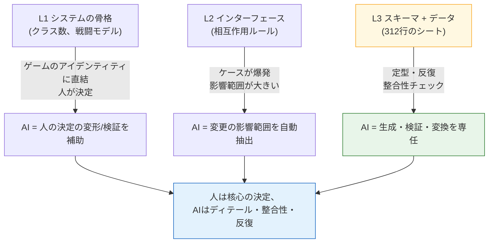

# 3.1 システムプランナーの仕事とLayer座標

木曜日の午後4時50分。バランス担当が埋めたスキルシートが、ちょうど上がってきました。スキルは312個。各スキルは`effect_id`という欄に効果番号を記入することになっており、その番号は別の効果シートにある行を指します。両者が噛み合って初めてゲームは動きます。合わなければ、クライアントが空の効果を呼び出すか、静かに落ちます。

以前の私は、これを目視でチェックしていました。スキルシートのセルを1つ見て、効果シートへジャンプし、番号を確認して、また戻る。これを312回。速くても2時間です。目がかすんでくる最後の50個で必ず1〜2個を見落とし、その1〜2個がQAビルドで火を噴きました。

本章は、その2時間がどこへ消えたのか、そしてあの整合性チェックがシステムプランナーの作業地図のどこに打たれる座標なのか、という話です。先に座標を定めないと、AIをどこに組み込むべきかを、いつまでも勘だけで決め続けることになります。

---

## 3.1.1 システムプランナーは4つのものを作る

システムプランナーは、抽象と具体のあいだを最も広く行き来する人です。ビジョンという霧を受け取り、マスターデータの最後のセルという固い数字まで引き下ろしていきます。その道のりで生まれる成果物は4種類です。

**（1）ビジョンを構造に翻訳する。** ディレクターが「打撃感が生きたアクション戦闘」と言えば、システムプランナーはそれをスキル・コンボ・キャンセル・ヒットストップという骨格に置き換えます。「成長の自己決定権」はクラス・スキルツリー・装備システムになります。霧が構造物になる最初の瞬間です。

**（2）システム間のインターフェースを仕様化する。** 戦闘・移動・インベントリ・ショップ・クエスト・ギルドが同時に動きます。戦闘中にインベントリを開いたら無敵が付くのか？　強化の最中にPvPの申請が届いたら？　こうしたケースの答えが集まって、「よくできている」という手触りを作ります。答えが抜けた場所ごとに、ユーザーはストレスを感じます。

**（3）マスターデータとそのスキーマに責任を持つ。** スキル312個の係数、数百個のアイテムの効果、数十種のモンスターの行動。値は自分で埋めるか、バランスやコンテンツの担当へ渡します。しかしシートの **カラム定義（スキーマ）** だけは、システムプランナーが握ります。ラベルの付いた引き出しを用意してあげる仕事です。引き出しが雑だと、人によって違う入れ方をしてしまい、整合性が壊れます。

**（4）行動ロジックを設計する。** キャラクターやモンスターのAIは、ステートマシン（FSM、Finite State Machine、有限状態機械）、ビヘイビアツリー（Behavior Tree、以下BT）、決定テーブル、プロシージャル規則といった形で出てきます。この資料がプログラマーに渡り、コードになります。

この4つがすべて1人の机の上で出会う、という点が核心です。だからこそ「今日は何に時間を使うか」が、システムプランナーにとって最大の運営判断になります。

---

## 3.1.2 システムの成果物はLayer座標を持つ

2.3で私たちは、ゲームの制作物全体をL0（ビジョン）からL4（ビルド）までの座標軸に載せました。今度は3.1.1の4つの成果物を、その軸の上にそのまま打ってみます。システム企画ほど、1つの分野の成果物が複数のLayerに広く散らばる例はまれです。

次の図は、成果物がLayer上のどこに住んでいて、各座標で誰と出会うのかを1枚に描いた地図です。

<svg viewBox="0 0 720 360" xmlns="http://www.w3.org/2000/svg" font-family="sans-serif" font-size="13">
  <!-- Layer bands -->
  <rect x="20" y="20" width="680" height="60" fill="#eceff1" stroke="#b0bec5"/>
  <rect x="20" y="80" width="680" height="60" fill="#e3f2fd" stroke="#90caf9"/>
  <rect x="20" y="140" width="680" height="60" fill="#e8f5e9" stroke="#a5d6a7"/>
  <rect x="20" y="200" width="680" height="60" fill="#fff8e1" stroke="#ffe082"/>
  <rect x="20" y="260" width="680" height="60" fill="#eceff1" stroke="#b0bec5"/>
  <!-- Layer labels -->
  <text x="34" y="55" font-weight="bold">L0</text>
  <text x="34" y="115" font-weight="bold" fill="#1565c0">L1</text>
  <text x="34" y="175" font-weight="bold" fill="#2e7d32">L2</text>
  <text x="34" y="235" font-weight="bold" fill="#f9a825">L3</text>
  <text x="34" y="295" font-weight="bold">L4</text>
  <!-- Layer descriptions -->
  <text x="80" y="55" fill="#607d8b">ビジョン — システムプランナーは受け取るだけ</text>
  <text x="80" y="108" fill="#0d47a1">システムの骨格: クラス・戦闘・インベントリ・ギルドの定義</text>
  <text x="80" y="168" fill="#1b5e20">インターフェース: システム間の相互作用ルール・優先順位</text>
  <text x="80" y="228" fill="#e65100">スキーマ + データ: シートのカラム定義、一部の値</text>
  <text x="80" y="295" fill="#607d8b">ビルド — QAが意図の反映を検証</text>
  <!-- Collaborator column -->
  <line x1="500" y1="20" x2="500" y2="320" stroke="#90a4ae" stroke-dasharray="4 3"/>
  <text x="512" y="55" fill="#607d8b" font-size="12">↔ ディレクター・ナラティブ</text>
  <text x="512" y="115" fill="#1565c0" font-size="12">↔ アートディレクション</text>
  <text x="512" y="175" fill="#2e7d32" font-size="12">↔ 他のシステムプランナー</text>
  <text x="512" y="235" fill="#f9a825" font-size="12">↔ バランス・コンテンツ</text>
  <text x="512" y="295" fill="#607d8b" font-size="12">↔ QA</text>
  <!-- responsibility arrow -->
  <line x1="62" y1="90" x2="62" y2="250" stroke="#c62828" stroke-width="2.5" marker-end="url(#ah)"/>
  <defs>
    <marker id="ah" markerWidth="8" markerHeight="8" refX="4" refY="4" orient="auto">
      <path d="M0,0 L8,4 L0,8 Z" fill="#c62828"/>
    </marker>
  </defs>
  <text x="335" y="338" fill="#c62828" font-size="12" font-weight="bold">システムプランナーが直接作る区間 (L1→L3)</text>
</svg>

この地図が語ることは2つです。第一に、システムプランナーはL0を**受け取って**L4まで**届かせる**という長い距離に責任を持ちます。第二に、自分の手で直接作る区間はL1〜L3で、その3つのマスごとに協業相手が変わります。マスが変わるたびに協業の言語も変わるため、座標を意識しないと会議が空回りし続けます。

ただし、1人がL1〜L3をすべて触るという意味ではありません。チームが大きければ、L1〜L2の担当とL3の担当は分かれます。チームが小さければ1人で全部見ます。座標は役割分担の地図であって、1人に全部押し付けろという命令ではありません。

---

## 3.1.3 座標が決まれば、AIを組み込む場所が見える

地図が描けたので、今度は色を塗ります。どの座標がAI導入の効果が大きいのか。やみくもに「全部自動化」ではなく、座標の性質を見て選びます。



核心は、**座標が下に降りるほどAIに専任させる比重が大きくなる**ということです。L1の「クラスをいくつにするか」はゲームのアイデンティティに直結するため、人が握るべきです。逆にL3の「312行の外部キーがすべて合っているか」は定型・反復なので、AIに丸ごと任せるべきです。L2はその中間です。決定は人がするものの、「このルールを変えたらどこまで揺れるのか」という影響範囲の抽出をAIが支えます。

この図が、3.1.4以降のすべての実習がなぜL3の近くから始まるのかを説明しています。効果が最も大きく、リスクが最も小さい場所だからです。スキーマツールが誤作動しても事故にはなりませんし、関係マップは図を描くだけですし、整合性チェックは人が拒否できます。

---

## 3.1.4 ワークド・トランスクリプト：座標L3でAIに整合性チェックを任せる

理論はここまでです。3.1の冒頭のあの木曜日に戻ります。スキルシートにある312個の`effect_id`が効果シートと合っているか、AIにやらせてみます。要約せず、実際にやり取りしたままを載せます。

データ入力は`schema-first`の原則に従います。つまり、人が先に**仕様書シート**を定義し、そこからEnumと`.proto`が生成され（VBA（Excelのマクロ言語）によるExport）、最後にcsvデータが埋められます。だから検証プロンプトも「スキーマから読め」で始まります。正本はスキーマドキュメントではなく **実際にexportされたJSON** だという点を、先に明言しておきます（`json_over_schema_doc_as_source_of_truth`）。ドキュメントは嘘をつけても、exportされたJSONは嘘をつけないからです。

### プロンプト（全文）

> あなたは私たちのプロジェクトのデータ整合性チェッカーです。
> 入力は2つのexport JSONです。
> 1) `skill.json` — 各スキルオブジェクトに`skill_id`、`name`、`effect_id`フィールドがあります。
> 2) `effect.json` — 各効果オブジェクトに`effect_id`、`effect_type`があります。
>
> 次を検査してください。
> (A) `skill.json`のすべての`effect_id`が`effect.json`に存在するか（外部キー整合性）。
> (B) `effect.json`にはあるが、どのスキルからも参照されていない孤児（orphan）効果。
> (C) `skill.json`の中で`effect_id`が空、または0になっている行。
>
> ルール：推測しないこと。JSONにないフィールドは「フィールドなし」と報告すること。
> 出力は(A)(B)(C)の3セクションに分け、違反1件ごとに`skill_id`（または`effect_id`）と理由を1行で。
> 違反がなければ、該当セクションに「違反なし」とだけ書くこと。

### Claudeの生の出力（加工・美化なし）

> 入力のJSON 2つを受け取っていません。現在のメッセージにはファイルの内容が添付されていません。
> 次のいずれかの形で送り直してください。
> - `skill.json`と`effect.json`の実際の内容（貼り付けまたはファイル添付）
> - または2つのファイルのパス
>
> 内容を受け取ったら(A)(B)(C)の順に検査します。ファイルなしで結果をでっち上げることはしません。

ここで止まったことが、むしろ信頼のシグナルでした。入力が空なのに、もっともらしいレポートが返ってきたとしたら、その綺麗さこそ危険信号です。手ぶらで検査結果を作り出さず、「まずファイルをください」と聞き返してきたほうが信頼できます。私は2つのJSONを実際に貼り付けて再依頼しました（分量の都合で、本文には一部のみ抜粋します）。

```json
// skill.json (抜粋)
[
  {"skill_id": 1001, "name": "強打",     "effect_id": 5001},
  {"skill_id": 1002, "name": "回転斬り", "effect_id": 5002},
  {"skill_id": 1003, "name": "盾上げ","effect_id": 0},
  {"skill_id": 1004, "name": "毒塗り", "effect_id": 5099}
]
```

```json
// effect.json (抜粋)
[
  {"effect_id": 5001, "effect_type": "DAMAGE"},
  {"effect_id": 5002, "effect_type": "DAMAGE"},
  {"effect_id": 5003, "effect_type": "BUFF"}
]
```

### Claudeの2回目の出力（実データ基準）

> **(A) 外部キー整合性 — 違反1件**
> - `skill_id: 1004` → `effect_id: 5099`が`effect.json`に存在しない（dangling reference）
>
> **(B) 孤児効果 — 違反1件**
> - `effect_id: 5003` (BUFF) → どのスキルからも参照されていない
>
> **(C) 空/0のeffect_id — 違反1件**
> - `skill_id: 1003` → `effect_id: 0`。意図された「効果なし」の可能性もあるため、0が有効値かどうかスキーマでの確認が必要。

### 人による検証と拒否

3件のうち2件は明白なバグでした。`5099`は、バランス担当が効果シートに行を追加する前に、スキル側へ先に書き込んでおいたものでした。作業の順序がずれた典型的なケースです。これで1つ捕まえました。

ところが(C)は**拒否**しました。私たちのプロジェクトでは、`effect_id: 0`は「パッシブスロット、効果なし」を意味する有効な約束値です。AIはそれを知らないので「確認が必要」と報告してきました。その判断自体は正しいものの、違反として数えるものではありません。そこで私は次の一手に進みました。この約束をatomとして固定化し、次のチェックからはAIが0を有効値として知っている状態を作ることです。

### 再依頼（ドメイン知識の注入）

> 追加ルール：`effect_id == 0`は「パッシブ、効果なし」を意味する、私たちのプロジェクトの有効な約束値です。
> したがって(C)では、`effect_id == 0`は違反ではありません。空文字列・null・負数のみを(C)の違反として報告してください。

> **(C) 空/0のeffect_id — 違反なし**
> （`effect_id: 0`は有効な約束値として処理。空/null/負数はなし。）

このたった1行の約束こそが、ドメイン知識の蓄積です。システム企画の決定は比較的恒久的なので、一度固定化すれば、1年後も同じチェックが同じ基準で回ります。キャビネットに決定カードが1枚積まれました。

このトランスクリプトで人がやったことは **3つだけ** です。（1）スキーマから読めという入力順序の指定、（2）`5099`が本物のバグであることの確認、（3）`0`が有効値だと知っていて、AIの判断を拒否・矯正したこと。残りの、312行をセル1つずつジャンプしながら見ていた2時間は消えました。自動化されたのはジャンプと照合という労働であり、残った3行分の判断こそが核心です。

---

## 3.1.5 蓄積される資産：座標をコードとして固める

上のトランスクリプトのチェックを毎回手作業で依頼することもできますが、L3で繰り返される仕事はツールとして固めるのがシステム企画の定石です。著者が運用している2つを引用します。抽象的な「プロジェクトAのツール」ではなく、実際に机の上で回っているものです。

`gen_relation_map.py`は、シートのカラム名と値を分析して外部キーの関係を自動検出し、インタラクティブなHTML関係マップを出力します。3.1.4で`skill.effect_id → effect.effect_id`という矢印を人が頭の中に描いたとすれば、このスクリプトはその矢印を、シート全体について図として描いてくれます。依存が逆行している場所（L3のデータがL1の骨格を逆参照する危険）が、図の上で即座に浮かび上がります。

`schema-doc`スキルは、xlsmの **$スキーマシート** をパースして、Markdown（マークダウン）形式のスキーマドキュメントを自動生成します。3.1.4の(C)で「0が有効値かどうかスキーマでの確認が必要」という質問が出てきた、あのスキーマです。人がほかのファイルを漁らなくても、最新のスキーマをすぐ読めるようにします。シートが変わればドキュメントも追従して変わるため、ドキュメントと実データが食い違うという持病が減ります。

2つのツールの持ち場を座標で言い直すと、こうなります。`schema-doc`はL3の**カラム定義**を守り、`gen_relation_map.py`はL2〜L3のあいだの**関係**を守ります。AI補助プロンプト（3.1.4のような検証）は、その上で回ります。3つはバラバラに動くのではなく、同じ座標軸の異なる高さを受け持ちます。

これらのツールの実際の使い方は、3.2・3.3・3.4で手を動かしながらたどります。3.1は「どこに組み込むか」を決める地図であり、続く3つの章が、組み込む作業そのものです。

---

## 3.1.6 漸進的な導入：リスクの小さい座標から

3つのツールを一度に稼働させると、運用の負担が効果より先に届きます。著者の経験では、安全な順序はリスクの小さい座標（下側）からです。

| 時期（推奨） | 導入 | 座標 | 失敗しても起きること |
|---|---|---|---|
| 1か月 | スキーマ優先（3.2） | L3 | ドキュメントが1回更新されないだけ |
| 2〜3か月 | 関係マップの可視化（3.3） | L2〜L3 | 図が不正確になるだけ |
| 3〜6か月 | AI補助プロンプト（3.4） | L1〜L3 | 検証を通すため、人が拒否できる |

期間は絶対的な基準ではありません。チームの規模や既存のインフラ次第で、倍かかることも、半分で終わることもあります（著者の推定、未検証）。変わらないのは**順序**です。リスクの大きい「決定の補助」を最後に置けば、先行する2つのツールでチームがすでに検証の習慣を身につけたあとに、最も敏感な場所へ触れることになります。

---

## 3.1.7 測定 — 正直に

数値を美化せずに記します。以下は、著者がディレクターとして運営するMMORPGプロジェクト（以下「プロジェクトA」）の企画チーム（人数4〜5人、開発チーム全体は中規模の10〜50人、運用約6か月）で観察したものです。正確な自動計測ではなく、作業ログと振り返りの記録に基づく **著者の観察** であり、方向性とおおよその比率としてだけ読むことをおすすめします。

- **整合性チェック**：312行のスキル↔効果の外部キー照合は、手作業では速くても2時間でした（冒頭のあの木曜日です）。AI検証では、入力の準備を除けば数分以内に違反リストが出ました。減ったのはジャンプと照合の労働であって、判断ではありません。
- **新規プランナーのオンボーディング**：関係マップのHTMLが1枚あれば、システムの依存構造を口頭で説明する会議を何度か減らせました。正確な回数は人によって異なるため、断定はしません（著者の観察）。
- **変更影響の議論**：「このルールを変えたらどこが揺れるのか」を会議で手探りしていたのを、AIから影響範囲のドラフトを先に受け取り、人がレビューする方式に変えました。会議がなくなったのではなく、会議が**レビュー**になったのです。

核心は、節約された時間が「ゲームを作らない時間」ではないという点です。その時間は、L1の骨格のような、AIに任せられない深い決定へと戻っていきます。労働を減らして判断に使うこと。それが本章のすすめる1行です。

---

## やってみよう：座標L3で整合性チェックを1回

**setup.** シートを2つ（例：スキル、効果）csvでexportしましょう。余裕があればJSONに変換しておきます（ドキュメントではなくexportの成果物が正本だという原則です）。2つのシートのあいだで外部キーを1組選びます（例：`skill.effect_id → effect.effect_id`）。

**prompt.** 3.1.4のプロンプト全文をそのまま使いましょう。核心の3行を抜かさないでください。（1）「スキーマ/構造から読むこと」、（2）「推測せず、ないものは『ない』と報告すること」、（3）「違反がなければ『違反なし』とだけ書くこと」の3つです。

**verify.** AIが挙げた違反リストを、人が1行ずつ確認します。本物のバグは直し、ドメインの約束値（例：`0 = 효과 없음`、つまり「0は効果なし」）のせいで生じた誤検知は**拒否**して、その約束をプロンプト（またはatom）に追加します。次のチェックから同じ誤検知が消えれば、資産が1枚積まれたということです。

### 一人ミニ版

チームもシートもない1人開発者なら、Googleスプレッドシートのタブ2つで十分です。1つのタブは「スキル」、もう1つのタブは「効果」。`effect_id`カラム1本で両者をつなぎましょう。タブをcsvでダウンロードして3.1.4のプロンプトに貼り付ければ、312行ではなく30行のシートでも、まったく同じようにdangling referenceと孤児効果が捕まります。規模が違うだけで、座標は同じです。L3から始めて、手になじんだら関係マップと影響範囲へ、1段ずつ上に登っていきましょう。

---

### 本章のポイント
- システムの4つの成果物は、L1の骨格からL3のシートまでの座標を持ち、座標がそのまま協業相手になります
- 座標が下（L3）へ降りるほど、AIに専任させる比重が大きくなり、リスクは小さくなります
- 自動化されるのはジャンプと照合という労働で、バグの確認と誤検知の拒否という判断は人の役割です
