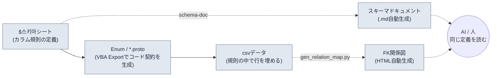

# 3.2 スキーマファースト — $스키마はデータより先

月曜の午前、新人プランナーが埋めたスキルシート120行をcsvへビルドしたところ、クライアントのログに赤い行が28個出ました。`class_id`が47番を参照しているのに、クラスシートには47番が存在しません。`element`の欄には、ある人は`Fire`と書き、別の人は`fire`と書き、さらに1行は`화염`（韓国語で「炎」）とハングルで書かれています。赤い行28個を1行ずつ手でたどるうちに、午後の半分が消えていきます。

この事故の原因は、データが間違っていたからではありません。**データを作る前に、そのデータが従うべき規則を明示しなかったから**です。規則が頭の中にしかなければ、人が替わった瞬間に規則も変わります。本章では、規則（スキーマ）をデータより先に作るワークフローを扱います。そして、その規則を人の手ではなくツールがドキュメントとして強制する形に変えていきます。

---

> **用語メモ**
> - スキーマ（schema）：マスターデータシートのカラム定義。名前・型・範囲・外部キー・説明。
> - `$스키마`：Excelのマスターデータ（xlsm）の中に置く、カラム定義専用のシート。データ行ではなく、カラムの規則だけを収めます。
> - FK（外部キー）：他のシートのPK（主キー）を参照するカラム。`class_id`がClassシートの行を指す、という形です。
> - proto：Protocol Buffersの定義（`.proto`）。クライアントとサーバーが共有するデータ構造・Enumの契約です。
> - 信頼できる唯一の情報源（single source of truth）：同じ情報を1か所だけで管理し、全員がそこを参照する運用原則です。

---

## 3.2.1 入力の順序こそがスキーマ

スキーマファーストを「カラムを事前に定義すること」とだけ理解しているなら、半分しか捉えていません。核心は**何を先に入力するかという順序**にあります。データを埋める手がどの順序で動くかが、整合性が守られるか崩れるかを決めます。

本書が推奨する入力順序は、4つのマスからなるパイプラインです。



左から右へ流れる実線が**強制される入力順序**です。`$스키마`を先に定義し、そこからEnumとprotoをVBA（Excelのマクロ言語）のExportで生成し、その契約の中でだけcsvデータを埋めます。点線は、その入力から自動的に派生する成果物（スキーマドキュメント`schema-doc`とFK関係図`gen_relation_map.py`）で、人とAIはこの派生物を通じて同じ定義を見ます。

この順序が強制されている限り、本章の冒頭で見た赤い行28個の大半は、**データを埋める前に**塞がれます。`element`が`fire/ice/lightning/none`の4つのうちの1つであるという事実がprotoのEnumとして固定されていれば、`Fire`も`화염`も入力段階で弾かれます。`class_id`がClassシートのPKを参照するという事実が`$스키마`に明示されていれば、47番の欠落はビルドではなくチェックの段階で先に捕まります。

順序を逆にすると、つまりデータを先に埋めてスキーマを後で整理すると、スキーマは事後の掃除になります。1000行がすでに積み上がった場所でカラム規則に手を入れると、規則がデータを追いかける形になり、その瞬間、情報源の主従が逆転します。

---

## 3.2.2 ワークド・トランスクリプト — `$스키마`からcsvまで一気に

言葉で説明する代わりに、実際に1つのシートを最初から最後まで通してみます。スキルシートを新しく作るとしましょう。以下は、AIの補助を入れて進めた全記録です。要約はせず、食い違った箇所と人が拒否した箇所をそのまま残します。

### ステップ1 — 人が`$스키마`を先に手で書く

ツールもAIもまだ呼びません。カラム規則は人が直接定義します。このステップだけは委任しません。

```
# Skill シート $스키마 (人が作成)
カラム           タイプ      範囲/制約              FK                  説明
skill_id       int        1000~9999            (PK)                スキル固有ID
name           string     1~30字                -                  表示名
class_id       int(FK)    -                    Class.class_id      使用可能クラス
cooldown       float      0.0~120.0            -                   再使用待機(秒)
damage_coef    float      0.0~10.0             -                   攻撃力乗算係数
element        enum       fire/ice/lightning/none  -              属性
is_passive     bool       true/false           -                  パッシブかどうか
```

### ステップ2 — AIにproto Enumのドラフトを任せる（プロンプト全文）

`$스키마`の`element` enumとFK構造をprotoの契約に移す作業です。形式変換なので、AIに任せられる仕事です。

> **プロンプト（全文）：**
> 以下はゲームのマスターデータシートのカラム仕様である。この仕様をProtocol Buffers（proto3）のメッセージとEnumに変換せよ。規則：（1）enum型のカラムは独立したenumとして定義し、最初の値は必ず`_UNSPECIFIED = 0`で始める。（2）FKカラムは参照先をコメントで残す。（3）範囲制約はprotoでは表現できないため、コメントとしてのみ残す。仕様にないカラムは追加しないこと。
> ```
> skill_id int PK / name string / class_id int FK→Class.class_id /
> cooldown float 0~120 / damage_coef float 0~10 /
> element enum{fire,ice,lightning,none} / is_passive bool
> ```

### ステップ3 — Claudeの生の出力（そのまま、手を加えず）

```proto
syntax = "proto3";

// Skill シートのデータ契約
// 注意: 範囲制約(cooldown 0~120, damage_coef 0~10)は
//       protoでは強制不可。Linterで検査すること。

enum SkillElement {
  SKILL_ELEMENT_UNSPECIFIED = 0;
  SKILL_ELEMENT_FIRE = 1;
  SKILL_ELEMENT_ICE = 2;
  SKILL_ELEMENT_LIGHTNING = 3;
  SKILL_ELEMENT_NONE = 4;   // ← 人によるレビューの印
}

message Skill {
  int32 skill_id = 1;       // PK
  string name = 2;
  int32 class_id = 3;       // FK → Class.class_id
  float cooldown = 4;
  float damage_coef = 5;
  SkillElement element = 6;
  bool is_passive = 7;
}
```

### ステップ4 — 人による検証と拒否

ここで人が1か所を拒否します。AIは`none`を`SKILL_ELEMENT_NONE = 4`としてenumの**末尾**に配置しましたが、`$스키마`において`none`は「属性なし」という既定の状態です。争点はprotoの0番の値です。proto3ではenumの0番は「値が入力されなかったときに自動的に入る場所」なので、0番を`_UNSPECIFIED`（値未入力）として空けておくか、`none`（意図的な無属性）のような意味のある値で埋めるかで判断が分かれます。両者を1つの場所に統合すると、**欄を空けたままにした行（ミス）**と**無属性をあえて選んだ行（意図）**が同じ0として入ってきて、永遠に区別できなくなります。AIは`_UNSPECIFIED = 0`と`none`を別個に置いてはいたものの、`none`を4番という末尾に送ったため、最もよく使う既定状態が検索・デバッグから遠ざかってしまいました。

人が下した決定は次のとおりです。
- `_UNSPECIFIED = 0`は維持します（欠落検出用）。
- `none`はそのまま残しつつ、csvの作成規則に「無属性は必ず`none`を明示、空欄禁止」を追加します。空欄=0=UNSPECIFIEDは入力エラーと見なします。
- この決定を`$스키마`の`element`行の説明に1行追加します：「無属性も明示（none）。空欄はエラー」。

AIの出力をそのまま使ったわけではありません。形式は受け取り、意味の境界線は人が引きました。

### ステップ5 — VBA ExportボタンでEnum/protoをシートから生成する

検証済みのproto定義は、ExcelのExportマクロ（`$스키마`シートのボタン）が一貫して出力します。人がIDEで再度タイピングすることはありません。シートが唯一の情報源なので、protoはシートから生まれます。この順序は、3.3で扱う「出力が正本」（`json_over_schema_doc_as_source_of_truth`）原則の延長です。ドキュメントがコードを説明するのではなく、シートがコードを生むのです。

### ステップ6 — ようやくcsvデータを埋める（AI補助、再リクエスト込み）

> **プロンプト（全文）：**
> 上のSkill protoと$스키마を満たすcsv行を5つ作れ。制約：class_idは[1,2,3]のいずれか（現在Classシートに存在するPK）、damage_coefはパッシブ（is_passive=true）なら0.0、elementはfire/ice/lightning/noneの文字列そのまま、空欄禁止。

Claudeの最初の出力では、1行が規則から外れていました。

```
skill_id,name,class_id,cooldown,damage_coef,element,is_passive
1001,화염베기,1,3.5,2.4,fire,false
1002,빙결의손,2,8.0,3.1,ice,false
1003,체력회복,1,0.0,1.2,none,true     ← 拒否: パッシブなのにdamage_coef≠0
1004,번개창,3,5.0,2.8,lightning,false
1005,방어태세,2,0.0,0.0,none,true
```

1003行が規則違反（`is_passive=true`なら`damage_coef=0.0`でなければならない）です。人が拒否して再リクエストしました。

> **再リクエスト（全文）：** 1003行が規則違反。is_passive=trueなのにdamage_coefが1.2だ。パッシブは0.0でなければならない。1003だけ直してもう一度出せ。

> **Claudeの再出力：** `1003,체력회복,1,0.0,0.0,none,true`

AIが最初の試行ですべてを正しく出せないのは、欠陥ではなく、ただ普通に起きることです。重要なのは、スキーマが敷かれていたおかげで、その外れた1行を**目で特定し、1行の指摘で元に戻せた**という点です。スキーマがなければ、1003はビルド後のゲーム内で「パッシブなのにダメージが出る」バグとして発見されていたはずです。

このトランスクリプト全体の教訓はシンプルです。入力順序が`$스키마 → proto → csv`に固定されていれば、AIは形式を素早く埋め、人は意味と違反だけをレビューします。順序が崩れると、人が形式から意味まで全部を抱え込むことになります。

---

## 3.2.3 schema-doc — スキーマを人が書き写さないために

`$스키마`をExcelの中に置くとプランナーにとっては快適ですが、AIやgit、外部ツールにとっては閉ざされた場所です。そこで、`$스키마`をMarkdown（マークダウン）に自動変換するツールを運用しています。スラッシュスキル`schema-doc`がこの仕事を担います。

動作は4ステップです。

1. Excel（xlsm）の`$스키마`シートをパースする（python-calamine、Rustによる高速化）
2. カラム定義の5要素を抽出する
3. Markdownの表に変換する
4. 同じフォルダーに`<시트명>_schema.md`（「シート名_schema.md」の意）を生成する

核心は、**人がスキーマを二度書かない**ことです。Excelで一度定義すれば、Markdownはツールが作ります。両者が食い違うことはあり得ません。3.3で扱う「スキーマドキュメントを正本に据えると実際の出力とずれる」という落とし穴を、ここでは「Excelが正本、ドキュメントは派生」とひっくり返すことで回避します。

`schema-doc`が生成した結果（先ほどのトランスクリプトのSkillシート基準）です。

```markdown
# Skill シート スキーマ  (自動生成 — 直接修正禁止)

| カラム | タイプ | 範囲/制約 | FK | 説明 |
|---|---|---|---|---|
| skill_id | int | 1000~9999 | (PK) | スキル固有ID |
| name | string | 1~30字 | - | 表示名 |
| class_id | int(FK) | - | Class.class_id | 使用可能クラス |
| cooldown | float | 0.0~120.0 | - | 再使用待機(秒) |
| damage_coef | float | 0.0~10.0 | - | 攻撃力乗算係数 |
| element | enum | fire/ice/lightning/none | - | 属性。無属性も明示(none)、空欄はエラー |
| is_passive | bool | true/false | - | パッシブかどうか。trueならdamage_coef=0 |

_source: Skill.xlsm / generated by schema-doc_
```

`element`と`is_passive`の説明欄に、3.2.2のステップ4・6で人が引いた境界線がそのまま入り込んでいる点に注目してください。人が`$스키마`に1行書いただけで、ドキュメント・proto・検証のすべてが同じ規則を共有するようになりました。これが、信頼できる唯一の情報源が実際に機能している姿です。

Markdownに落ちたスキーマは、3つの場所でただちに使われます。

- **AIによるデータ生成**：行を作る前にこの表を読み、定義された7つのカラム・各制約・FKを守った行だけを作ります。
- **新人プランナーのオンボーディング**：会議3回よりこの表1枚のほうが速いです。
- **Linter**：csvの各行がこの表に違反していないかを自動で照合します。

---

## 3.2.4 gen_relation_map.py — FKが生きているかをグラフで

スキーマがシートの**内側**の規則だとすれば、FKはシート**間**の規則です。`class_id`がClassシートを参照するという定義は`$스키마`に書かれていますが、その参照が今この瞬間に実際に生きているかどうかは、別途のチェックが必要です。

`gen_relation_map.py`は、各マスターデータシートのFK関係を自動検出し、インタラクティブなHTML関係図として描きます。Skillの`class_id`→Class、Itemの`set_id`→ItemSetのような矢印が1つの画面に集まると、「参照先が消えたFK」が切れた矢印として目に留まります。本章冒頭の47番欠落のような事故が、ビルドログの赤い行ではなく関係図の切れた線として、**データを埋めている最中に**見えるのです。

このツールの実際の使用例と可視化は3.3で本格的に扱います。本章で覚えておくべきことは1つです。`$스키마`がFKを明示しなければ、関係図にも整合性チェックにも、描くべきグラフがありません。**FKの明示は選択肢ではなく、スキーマファーストの前提です。**

---

## 3.2.5 スキーマファーストの5段階ワークフロー

3.2.2のトランスクリプトを一般化すると、5つのステップになります。各ステップの主体と成果物を分けて見ると、何を人が握り、何をツールに渡すのかが明確になります。

<svg xmlns="http://www.w3.org/2000/svg" width="720" height="300" font-family="sans-serif" font-size="13">
  <rect x="0" y="0" width="720" height="300" fill="#fbfbfb" stroke="#ddd"/>
  <text x="20" y="28" font-size="15" font-weight="bold">スキーマファースト5段階 — 主体 × 成果物</text>
  <!-- columns header -->
  <text x="40" y="62" font-weight="bold">段階</text>
  <text x="230" y="62" font-weight="bold">主体</text>
  <text x="430" y="62" font-weight="bold">成果物</text>
  <line x1="20" y1="72" x2="700" y2="72" stroke="#bbb"/>
  <!-- rows -->
  <text x="40" y="100">1. スキーマ設計</text>
  <rect x="220" y="86" width="120" height="22" fill="#e8f0fe" stroke="#9bb"/>
  <text x="232" y="102">人</text>
  <text x="430" y="100">$스키마 5要素·FK定義</text>
  <text x="40" y="138">2. 自動ドキュメント化</text>
  <rect x="220" y="124" width="120" height="22" fill="#e6f4ea" stroke="#9c9"/>
  <text x="232" y="140">schema-doc</text>
  <text x="430" y="138">スキーマ .md</text>
  <text x="40" y="176">3. 契約抽出</text>
  <rect x="220" y="162" width="120" height="22" fill="#e6f4ea" stroke="#9c9"/>
  <text x="232" y="178">VBA Export</text>
  <text x="430" y="176">Enum / *.proto</text>
  <text x="40" y="214">4. データドラフト</text>
  <rect x="220" y="200" width="120" height="22" fill="#fef7e0" stroke="#dca"/>
  <text x="232" y="216">AI + 人</text>
  <text x="430" y="214">csv行 (違反拒否·再リクエスト)</text>
  <text x="40" y="252">5. 整合性·影響</text>
  <rect x="220" y="238" width="120" height="22" fill="#e6f4ea" stroke="#9c9"/>
  <text x="232" y="254">Linter / 関係図</text>
  <text x="430" y="252">違反レポート·FKグラフ</text>
  <line x1="20" y1="270" x2="700" y2="270" stroke="#bbb"/>
  <text x="40" y="290" font-size="11" fill="#666">青=人の決定 / 緑=ツール自動 / 黄=AIドラフト+人のレビュー</text>
</svg>

5つのステップを最初の月にすべてそろえる必要はありません。ステップ1・2（スキーマ設計＋自動ドキュメント化）を回すだけでも、価値の半分はつかめます。ステップ3〜5は、運用に慣れてから段階的に追加します。最初から5ステップを強制すると、書き手の負担が定着前に運用を止めてしまいます。

---

## 3.2.6 プロジェクトAで測定したこと

著者がディレクターとして運営しているあるMMORPGプロジェクト（以下「プロジェクトA」）で、約6か月間このワークフローを回しました。以下の数値のうち、マスターデータのカラム一貫性と新規シートのドラフト時間はツールのログと作業記録から集計した実測値で、FK破損の頻度はビルド失敗のイシューから逆算した**著者の推定（未検証）**です。

| 項目 | 導入前 | 導入後 | 根拠 |
|---|---|---|---|
| カラム名の一貫性 | 約60% | 約95% | schema-doc照合の実測 |
| FK破損の頻度 | 週2〜3件 | 月1件以下 | ビルドイシューからの逆算（著者の推定） |
| 新規シートのドラフト時間 | 4〜8時間 | 1〜2時間 | 作業記録の実測 |
| 新人プランナーのシート理解 | 会議3回 | ドキュメント1回＋会議1回 | オンボーディング事例（方向性のみ） |

導入コストは、ツールの初期開発約3日＋運用定着約1か月です。6か月の累積効果に対して導入コストは小さかった、というのが運用上の結論です。ただし、上記の比率は1チーム・1プロジェクトの単一事例なので、他のチームにそのまま持ち込める保証はありません。

---

## 3.2.7 AIとスキーマのシナジー、そして境界

スキーマが敷かれると、AIによるデータ生成の信頼度は飛躍的に上がります。理由は、ハルシネーションの口実になる曖昧な入力範囲を、スキーマがあらかじめ塞いでくれるからです。「スキルを20個作って」というリクエストにスキーマがなければ、AIはもっともらしいカラムを発明し、手元のシートと互換性のない値を埋めます。スキーマがあれば、同じリクエストが、定義された7つのカラム・各制約・FKを守った行として返ってきます。3.2.2の1003行の事例のように違反が出ても、1行を指摘して再リクエストすれば終わりです。

その代わり、境界は明確です。**バランスの値はAIに任せません。**`damage_coef`をAIが「適当に」決めると、ゲームの意図と衝突します。形式の正しい候補を素早く並べるところまでがAIの仕事で、「このスキルの係数は2.4で正しいのか」には人が答えます。だからといって、AIがバランスに無用だという意味ではありません。曲線の滑らかさ・外れ値・範囲の統計は、AIが素早く捉えます。数字を測るのはツールに任せ、その数字が正しいかどうかは人が見極めます。

---

## 3.2.8 よくある失敗と回避策

| 失敗 | 回避策 |
|---|---|
| 1000行積み上げた後にスキーマを導入する | 新規シートは必ず`$스키마`を先に作る |
| `$스키마`とcsvの同期が崩れる | schema-docの自動化で両者を1つの情報源に束ねる |
| FKを明示しない | FKを明示しなければ関係図も整合性チェックも無意味になる |
| proto Enumの0番を意味のある値に使う | 0は`_UNSPECIFIED`（欠落検出用）、意味のある値は1から |
| スキーマドキュメントを人だけが読む | Markdownの表とメタ情報の統一でAIにも読ませる |

---

## やってみよう

**setup**
1. ご自身の担当分野で最も中心となるシートを1つ選んでください（スキル・アイテム・モンスターのいずれか）。
2. そのExcelファイルに`$스키마`という名前のシートを追加し、カラムごとに5要素（名前・型・範囲・FK・説明）を1行ずつ書いてください。このステップは人が直接行います。

**prompt**（proto/csvのドラフトにだけAIを使います）
> 以下の$스키마をproto3のメッセージとEnumに変換せよ。enumの最初の値は`_UNSPECIFIED = 0`。FKは参照先をコメントで。範囲制約はコメントのみ。仕様にないカラムの追加は禁止。
> （ここにご自身の$스키마を貼り付け）

続けて：
> 上のprotoと$스키마を満たすcsv行を5つ。制約違反の行は作るな。is_passive=trueならdamage_coef=0。

**verify**
1. AIが出した5行を1行ずつスキーマと照合してください。違反行があれば「N行目が違反、その行だけ直して」と再リクエストします（拒否と再リクエストは正常なプロセスです）。
2. `schema-doc`（または同等の簡単なPythonスクリプト）で`$스키마`を`.md`に書き出し、Excelの定義とドキュメントが一致しているか確認してください。
3. FKがあれば、参照先のPKが実際に存在するかを一度照合してください。

---

## 一人ミニ版

ツールもチームもなく一人で始めるなら、Excelファイル1つとテキストエディター1つで十分です。

1. シートの最初のタブに`$스키마`を作り、カラム規則を5要素で書きます（15分）。
2. その仕様をそのままコピーしてAIに「proto Enum + csv 5行」をリクエストします（10分）。
3. 返ってきたcsvをスキーマと目で照合し、違反した1行を再リクエストで直します（10分）。
4. `$스키마`のテキストをメモ帳で`skill_schema.md`として保存しておきます。これがあなたにとって最初の、信頼できる唯一の情報源です。

次のシートに進むときも、同じ4ステップを繰り返してください。四半期のうちに中心となるシート5〜10個が同じ順序でそろったら、そのときはじめてschema-docのような自動化を付ける価値が生まれます。

---

### 本章のポイント
- 入力順序を`$스키마→Enum/proto→csv`に強制すれば、違反はデータを埋める前に塞がれる
- Excelが正本・ドキュメントは派生。schema-docが両者を1つの情報源に束ね、人とAIが同じ定義を見る
- バランスの値は人が決定し、AIは形式の候補と外れ値の測定だけを担う

### 次章のプレビュー
- 3.3. 関係図の可視化 — gen_relation_map.pyでFKの依存関係を目で見る
