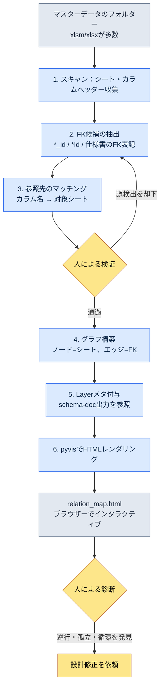

# 3.3 関係図の可視化 — 依存関係を目で見る

新人プランナーが入社初週に私の席へやって来ました。「クエスト報酬テーブルに手を入れようと思うのですが、ここを触るとどこが壊れますか？」私はモニターを指して答えようとして、止まりました。頭の中には絵がありました。`RewardTable`が`ItemTable`を参照し、`ItemTable`が`ItemEffectTable`を参照し、その上で`QuestTable`が報酬を参照して…ところが、その絵を言葉に置き換えた瞬間、聞き手の頭の中では形が崩れていきました。ホワイトボードにボックスを7つ描きました。矢印が絡まり始めました。30分後、彼はうなずいて席に戻り、翌日まったく同じ質問を再び持ってきました。

この場面が、本章を書かせました。システムプランナーの頭の中には依存関係のグラフがあります。問題は、それが頭の中にしかないことです。人が変われば絵も消えます。絵を外部化するツールが必要で、そうして作ったのが`gen_relation_map.py`です。

マスターデータが5〜10個のうちは頭の中だけで足ります。30個を超えると、人のワーキングメモリーでは抱えきれません。1つのプロジェクトのシートフォルダーは、たいていその線を早々に超えます。どこからどこへ依存しているかを文章で書き並べた表は、読んでも絵が浮かびません。本章では、外部キーの関係をインタラクティブHTMLの関係図として自動生成する過程を、ワークド・トランスクリプトとして最初から最後までたどります。

---

## 3.3.1 関係図が解決する4つの問題

ツールを作る前に、関係図がないときに実際に何が詰まるのかから押さえます。繰り返し起きたのは4つの場面でした。

**新人プランナーのオンボーディング。** 新しいプランナーがシステム構造を覚えるために会議を設定します。冒頭のあの場面です。言葉で伝えられた依存関係は、聞き手の頭の中で数日と持ちません。関係図1枚を一緒にクリックすれば、最初の会議で半分以上の絵が描けます。ホワイトボードの手描きと決定的に違うのは、図が消えずにその場に残ることです。

**変更の影響範囲の議論。** システム変更のリクエストが上がってきます。「これ、どこに影響しますか？」会議が設定され、長々と議論しても、漏れた領域が1つ2つ出てきます。関係図があれば、変更対象のノードをクリックしてインバウンドエッジをたどるだけで、影響範囲が目に入ります。議論は「この影響が本当に正しいか」と優先順位を決めるだけで済みます。

**依存の逆行の検出。** L3のマスターデータがL1のシステム文書を参照するのは正常です。逆方向（上位Layerが下位のマスターデータを直接参照する）は、ほぼ例外なく設計上の欠陥です。文章として並べたFKの一覧では、この逆行を人は捕まえられません。図であれば、Layerの色が食い違う矢印1本として即座に現れます。

**孤立したシートの発見。** どこからも参照されないシートが時々見つかります。古い企画の名残か、廃棄すると決めたのにファイルだけが残ったケースです。オフィスの片隅にラベルのない箱が転がっている風景と同じです。図があってこそ、その孤島を発見できます。

4つの問題に共通するのは、どれも「構造を目で見なければ解けない」という点です。文章と表では行き詰まります。

---

## 3.3.2 ワークド・トランスクリプト：マスターデータから関係図まで

ここからは実際にたどります。入力はマスターデータが入ったフォルダー1つ、出力はブラウザーで開く1枚のインタラクティブHTMLです。その間でAIがやったことと、人が検証・却下したポイントを漏れなく記します。

### 3.3.2.1 全体の流れ



肝心なのは、3番と5番の間にある人による検証ループです。FK候補の抽出は機械がたたき台を敷き、人がそこから誤検出を間引きます。このループを省くと、関係図はもっともらしく見えて間違った絵になります。

### 3.3.2.2 FKはどこから来るのか — 入力の順序

このツールの精度は、入力をどこから引いてくるかで決まります。3.2で定めたschema-first原則がそのまま適用されます。FK情報を「正」とする優先順位は次のとおりです。

1. **`$스키마`シート** — 各マスターデータの第一の「正」です。カラムごとに型・Enum・FKの参照先が明記されています。ここにFKが書かれていれば、それが第1順位です。
2. **`*.proto` / Enum定義** — VBA（Excelマクロ言語）のExportで吐き出されたスキーマです。仕様書が空のとき、型を補強します。
3. **実際の`csv`出力** — シートが書き出した実データです。仕様書にない関係も、データのパターンから現れます（例：`npc_id`カラムの値がすべて`NPCTable`のキー範囲内に収まっていれば、事実上FKです）。

ここで1つの原則をはっきりさせておきます。**スキーマ文書ではなく、実際のJSON/csv出力が「正」です。** 仕様書に`reward_id`がFKだと書かれていても、実データでそのカラムが空だったり、見当違いの値を指していたりすれば、間違っているのは仕様書のほうです。ツールは両者が食い違うときデータ側を信頼し、食い違いそのものをレポートに残します。これが、schema-docを「正」に据えない理由です。

### 3.3.2.3 ステップ1 — フォルダースキャンとFK候補の抽出

ツールの最初の動作は、フォルダー内のすべてのxlsm/xlsxを開いてシート・カラムヘッダーを収集することです。このステップ自体は機械的で、面白みはありません。面白いのは、FK候補を拾うルールです。最初は単純でした。カラム名が`*_id`または`*Id`で終わればFK候補と見なす。ところが、このルール1つでは誤検出と漏れの両方が出ました。

ここでAIをつなぎました。カラムヘッダーの一覧を丸ごと渡し、FKの参照先シートを推論させました。以下は、実際に投げたプロンプトの全文と生の出力です。

> **プロンプト：**
> 以下はゲームのマスターデータのシート名とカラムヘッダーの一覧である。各カラムが外部キー（FK）かどうか、FKの場合はどのシートのどのカラムを参照するかを推論せよ。カラム名の規則は通常`<대상시트단수형>_id`である。ただし、確信がなければ「不確実」と表示し、理由を書くこと。推測で埋めないこと。
>
> ```
> QuestTable: quest_id, title, npc_id, reward_id, prev_quest_id, region_id
> NPCTable: npc_id, name, region_id, faction_id
> RewardTable: reward_id, item_id, count, currency_id
> ItemTable: item_id, name, item_effect_id, grade
> ItemEffectTable: item_effect_id, effect_type, value
> RegionTable: region_id, name, parent_region_id
> ```

> **Claudeの生の出力（PK行は省略、FK判断のみ抜粋）：**
>
> **QuestTable**
> - `npc_id` → NPCTable.npc_id（クエストを与えるNPCと推定）
> - `reward_id` → RewardTable.reward_id
> - `prev_quest_id` → QuestTable.quest_id（先行クエスト、**自己参照**）
> - `region_id` → RegionTable.region_id
>
> **NPCTable**
> - `region_id` → RegionTable.region_id
> - `faction_id` → **不確実**：FactionTableが入力一覧にありません。カラム名の規則上はFactionTable.faction_idを参照すると見られますが、該当シートが提供されていないため参照先を確定できません。
>
> **RewardTable**
> - `item_id` → ItemTable.item_id
> - `currency_id` → **不確実**：CurrencyTableが一覧にありません。通貨の種類がEnumで管理されている可能性もあり、FKではないかもしれません。仕様書の確認が必要です。
>
> **ItemTable**
> - `item_effect_id` → ItemEffectTable.item_effect_id
> - `grade` → FKではない（Enumと推定：等級の値）
>
> **ItemEffectTable**
> - `effect_type` → FKではない（Enumと推定）
>
> **RegionTable**
> - `parent_region_id` → RegionTable.region_id（**自己参照**、地域の階層構造）
>
> 注意：上記の推論はカラム名の規則に基づいたものであり、実際のデータ値は確認していません。特に`count`や`value`のように`_id`で終わらないカラムはFK検査の対象から除外しており、隠れた参照があれば漏れます。

この出力に対して人がやったことは3つです。

- **却下1：**`faction_id` → AIはFactionTableが存在しないとして不確実扱いにしました。正しい判断です。ただし、実際には`faction_id`はEnumでした。ファクションが6種で固定のため、別シートを作らずEnumで管理しています。AIが存在しないシートをでっち上げずに判断を止めてくれたおかげで、人が仕様書を見てEnumと確定できました。**FKから除外。**
- **却下2：**`currency_id` → AIは両方の可能性を開けたままにしました。実データを見ると`CurrencyTable`は存在していました（入力一覧から私が漏らしていました）。**FKとして確定。** AIを責められない、人間側の入力漏れでした。
- **受け入れ：**`prev_quest_id`と`parent_region_id`の自己参照の検出。これは単純な正規表現ルールだったら見逃していたはずです。AIが「先行クエスト」「地域の階層」という意味付けまで添えてくれたことが、検証を速くしました。

ここで得た教訓は明確です。AIがもっとも役に立った場面は、速い推論ではなく、**わからない箇所を「不確実」のまま空けておいた抑制**でした。空欄を無理に埋めていたら、`faction_id`は見当違いのシートにつながり、その誤検出は関係図に偽の矢印として残って、新人プランナーを誤った方向へ導いていたはずです。

### 3.3.2.4 ステップ2 — グラフ構築とLayer付与

検証済みのFK一覧ができると、`gen_relation_map.py`がグラフを作ります。シートはノード、FKは有向エッジです。インバウンドエッジ数（ほかのシートが自分をどれだけ参照しているか）を数えてノードの大きさを決めます。多く参照されるほどノードは大きく、すなわちシステムのハブです。

Layerメタデータは、`schema-doc`スキルが作ったMarkdownのスキーマ文書から引いてきます。3.1で定義したLayer座標（L0〜L4）が各シートにラベルとして付いており、ツールはそれを読んでノードの色を塗ります。この連結が重要です。関係図がLayerを知らなければただのボックスと矢印にすぎず、Layerを知ってはじめて「逆行」を色で診断できます。

ツールの内部構造をコードの骨格で示すと、次のとおりです（中核の流れのみ抜粋）。

```python
# gen_relation_map.py (中核の流れの抜粋)
from pyvis.network import Network

LAYER_COLORS = {          # Layer パレット — atom 1個に標準化
    "L0": "#2c3e50",      # メタ/共用
    "L1": "#2980b9",      # システム
    "L2": "#27ae60",      # コンテンツ
    "L3": "#f39c12",      # データインスタンス
    "L4": "#c0392b",      # 派生/キャッシュ
}

def build_graph(fk_list, layer_map):
    net = Network(directed=True, height="900px")
    inbound = count_inbound(fk_list)          # インバウンドエッジ集計
    for sheet in all_sheets(fk_list):
        layer = layer_map.get(sheet, "L0")
        size = 10 + inbound[sheet] * 3        # ハブほど大きいノード
        net.add_node(sheet, color=LAYER_COLORS[layer],
                     size=size, title=sheet_tooltip(sheet))
    for src, dst, col in fk_list:
        # Layer 逆行検知: 上位Layerが下位を参照したら警告色
        edge_color = "#e74c3c" if is_reverse(src, dst, layer_map) else "#888"
        net.add_edge(src, dst, title=col, color=edge_color)
    return net
```

`is_reverse`が、このツールの小さな核心です。エッジの出発シートが到着シートより上位のLayerなら（例：L1 → L3）逆行と見なし、エッジを赤く塗ります。人が図を開いたとき赤い矢印が見えたら、それはほぼ例外なく手を入れるべき場所です。

### 3.3.2.5 ステップ3 — HTMLレンダリングと結果の構造

最後は、pyvisがインタラクティブHTMLを吐き出すステップです。ノードをクリックすると該当シートのカラム・Layer・インバウンド数がツールチップで表示され、検索ボックスでシート名によるフィルタリングができます。静的PNGではなくHTMLでなければならない理由がここにあります — ノード数が数十を超えると、静的画像では矢印が絡まって何も見えません。マウスでドラッグして広げ、関心のある領域だけをクリックで絞り込んではじめて、パターンがつかめます。

上の例のデータで作った関係図の構造をSVGに写すと、次のとおりです。色はLayerを、赤い矢印は（この例にはありませんが）逆行の位置を意味します。

<svg viewBox="0 0 720 360" xmlns="http://www.w3.org/2000/svg" font-family="sans-serif" font-size="13">
  <defs>
    <marker id="arrow" markerWidth="10" markerHeight="10" refX="9" refY="3" orient="auto" markerUnits="strokeWidth">
      <path d="M0,0 L9,3 L0,6 Z" fill="#888"/>
    </marker>
  </defs>
  <!-- nodes -->
  <rect x="40" y="30" width="130" height="40" rx="6" fill="#2980b9"/>
  <text x="105" y="55" fill="#fff" text-anchor="middle">RegionTable (L1)</text>
  <rect x="300" y="30" width="130" height="40" rx="6" fill="#27ae60"/>
  <text x="365" y="55" fill="#fff" text-anchor="middle">QuestTable (L2)</text>
  <rect x="560" y="30" width="130" height="40" rx="6" fill="#27ae60"/>
  <text x="625" y="55" fill="#fff" text-anchor="middle">NPCTable (L2)</text>
  <rect x="300" y="150" width="130" height="40" rx="6" fill="#f39c12"/>
  <text x="365" y="175" fill="#fff" text-anchor="middle">RewardTable (L3)</text>
  <rect x="560" y="150" width="130" height="40" rx="6" fill="#f39c12"/>
  <text x="625" y="175" fill="#fff" text-anchor="middle">ItemTable (L3)</text>
  <rect x="560" y="270" width="150" height="40" rx="6" fill="#f39c12"/>
  <text x="635" y="295" fill="#fff" text-anchor="middle">ItemEffectTable (L3)</text>
  <!-- edges -->
  <line x1="300" y1="50" x2="172" y2="50" stroke="#888" stroke-width="2" marker-end="url(#arrow)"/>
  <line x1="560" y1="50" x2="432" y2="50" stroke="#888" stroke-width="2" marker-end="url(#arrow)"/>
  <line x1="625" y1="70" x2="380" y2="150" stroke="#888" stroke-width="2" marker-end="url(#arrow)"/>
  <line x1="365" y1="70" x2="365" y2="150" stroke="#888" stroke-width="2" marker-end="url(#arrow)"/>
  <line x1="560" y1="170" x2="432" y2="170" stroke="#888" stroke-width="2" marker-end="url(#arrow)"/>
  <line x1="625" y1="190" x2="625" y2="270" stroke="#888" stroke-width="2" marker-end="url(#arrow)"/>
  <!-- self-ref -->
  <path d="M170,40 q40,-30 0,-10" fill="none" stroke="#888" stroke-width="2" marker-end="url(#arrow)"/>
  <text x="200" y="20" fill="#666" font-size="11">parent_region_id (自己参照)</text>
</svg>

ノードの大きさを見ると、`RegionTable`がもっとも多く参照されています（Quest・NPCの両方が指しています）。これがハブです。`ItemEffectTable`は葉のノードなので小さく表示されます。新人プランナーの「このシステムを理解するにはどこから見ればいいか」という質問の答えは、ノードの大きさの順序として、図の中にすでに入っています。

---

## 3.3.3 図がもたらす診断 — Layerとの結合

3.1でLayer座標を定義しました。本章の関係図がその座標を視覚へ引き上げると、文章や表では不可能だった4つの診断が、1つの画面で可能になります。

- **Layer逆行** — Layerの色が逆方向に流れる矢印（赤）。マスターデータがシステム設計へ逆向きに影響を与える、不自然な構造です。
- **孤立ノード** — どのエッジともつながっていない孤島。廃棄の候補です。
- **ハブの過負荷** — インバウンドエッジが異常に多い巨大ノード。1つのシートが多くの責任を負いすぎているサインで、分割を検討します。
- **循環依存** — 矢印が円を描く場所。ほぼ例外なく設計上の欠陥で、データのロード順の問題につながります。

ただし、図がすべての問題を捕まえるという意味ではありません。図が捕まえるのは**構造上の欠陥**です。このFKが本当に意味として正しい関係なのか（例：`npc_id`が本当に「クエストを与えるNPC」なのか、それとも「クエストに登場するNPC」なのか）は、図では解けません。それは人のドメイン判断の領分です。ツールは、人の判断が働く舞台を整えてくれるだけです。

---

## 3.3.4 自動更新がなければ陳腐化する

関係図は、一度作って終わりではありません。シートは毎週追加・変更されます。手動更新に任せた関係図は1〜2か月で実際の構造とずれ、ずれた地図は道を誤って案内するため、かえってないほうがましな状態になります。一度間違った図に痛い目を見たチームメンバーは、次から図を見ません — これがもっとも高くつく失敗です。

そこで、更新を自動トリガーに掛けます。

- **Git pre-pushフック** — マスターデータをプッシュする前に関係図を再生成します。常に最新の状態が保証されます。
- **変更リクエストの時点** — マスターデータの変更リクエストが上がってきたら、変更前後の関係図をdiffで比較してコメントに添付します。追加されたエッジは緑、消えたエッジは赤。レビュアーが影響範囲を図で見られます。
- **夜間バッチ** — 毎晩新しい関係図を作り、前日とのdiffを残します。
- **手動コマンド** — `/relation-map`スラッシュコマンドで即時生成します。会議中にその場で表示するときに使います。

生成されたHTMLは、社内の静的ホスティング（企画ポータル）へ自動デプロイします。別途ツールのインストールなしに、ブラウザーさえあれば誰もが同じ地図を見られます。机の横に常に広げてある地図と同じです。誰に聞かれても、同じ図を一緒に指さしながら答えます。

---

## 3.3.5 よくある失敗と回避策

| 失敗 | なぜ起きるか | 回避策 |
|---|---|---|
| ノードが100個を超えて図が絡まる | 全分野を1画面に詰め込む | ドメイン別フィルタリング、グループ別の分割ビュー |
| Layerの色がツールごとに異なる | パレットをコードごとに新しく定義 | パレットを1個のatomに標準化（`LAYER_COLORS`） |
| FK検出が`*_id`だけを拾い、漏れ・誤検出が出る | 正規表現1行に依存 | 仕様書でのFK明記+実データの値検証を併用 |
| 図は作ったのに誰も見ない | ワークフローに接続していない | 変更リクエスト・会議への図の添付を強制 |
| 作ったまま更新せず陳腐化 | 手動更新に依存 | 自動トリガー必須、手動では1か月で無用化 |

`gen_relation_map.py`の運用でもっとも頻繁に痛い目を見たのは、3行目です。`*_id`ルールだけを信じると、`count`や`value`のような隠れた参照を見逃し（3.3.2.3のAIもこの限界を自ら警告していました）、Enumである`grade`をFKと誤検出します。仕様書と実データの両方を見る検証ループが、この行の答えです。

---

## 3.3.6 一人ミニ版でまず試す

会社全体のマスターデータを一度に扱おうとすると重く、価値を見せる前に疲れてしまいます。自分の担当分野のフォルダー1つから小さく始めます。

### やってみよう

**setup.**
1. 自分が担当するマスターデータが5〜10個入ったフォルダーを1つ選んでみましょう。
2. `pip install pyvis openpyxl`で依存パッケージを入れましょう（Excelの読み取りは`excel-reader`スキルまたはopenpyxl）。
3. 各シートの`$스키마`シートにFKが明記されているか、まず確認しましょう。なければカラムヘッダーだけを集めます。

**prompt.** カラムヘッダーの一覧を集め、3.3.2.3のプロンプトをそのまま投げてみましょう。肝心なのは最後の1行です — 「確信がなければ不確実と表示し、推測で埋めないこと」。この一文が偽の矢印を防ぎます。

**verify.**
1. AIが出したFK候補を1行ずつ見ましょう。「不確実」と表示された行を、仕様書・実データで確定します。
2. Enumと疑われるカラム（`grade`や`effect_type`のように`_id`が付かないのにFKに見えるもの）はFKから外しましょう。
3. 自己参照（`prev_*_id`、`parent_*_id`）が正しく拾えているか確認しましょう。
4. 検証済みの一覧でグラフを描き、ブラウザーで開いて、赤い矢印（逆行）と孤島（孤立）を目で探してみましょう。

### 一人ミニ版

ツールを作る時間がなければ、最初の週は手で描いたmermaid 1枚から始めても構いません。シート5個のFKを3.3.2.3の形式でmermaidに直接書いてみましょう。この1枚を会議に持っていき、「これがうちのシステムの依存関係です」と見せれば、その場で価値が証明されます。価値が見えれば、自動化ツールは自然と後から付いてきます。最初から動くツールを出さなければ、という負担は下ろしてしまって大丈夫です。

拡張は次の順序で自然に流れていきます — 1週目は自分のシートのmermaid手描き → 2週目はLayerの色とクリックの追加 → 1か月で自動更新（gitフックまたは夜間バッチ）→ 3か月で社内ポータルへの配備 → 6か月で全シートの統合関係図。

---

## 3.3.7 次章への接続

3.2ではシートの内側（スキーマ）を、3.3ではシートの外側（関係）を扱いました。3.4は、この上にAI補助のプロンプトパターンを載せます。スキーマと関係が固まったシステムの上で、AIが整合性チェックと影響範囲の抽出をどう補助するのか、実用パターンへと続きます。

---

### 本章のポイント
- 頭の中の依存関係グラフを外部化すれば、人が変わっても同じ図がその場に残ります。
- FK抽出の精度を作るのは、AIが敷いたたたき台から人が誤検出を間引く検証ループです。
- 自動更新のない関係図は1〜2か月で陳腐化し、信頼を失います。

### 次章のプレビュー
- 3.4. AI補助のシステム設計プロンプトパターン
