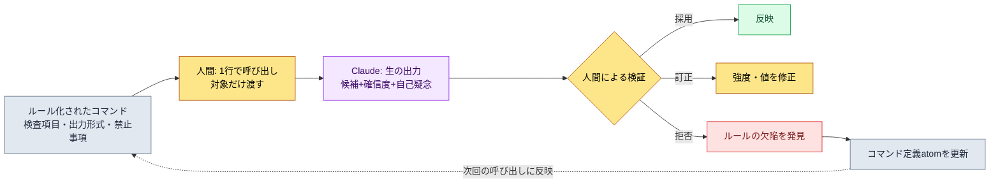
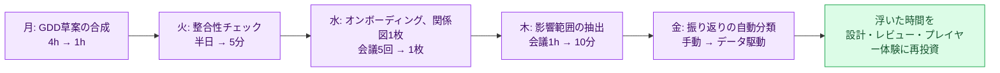

# 3.4 AI補助によるシステム設計プロンプトパターン

アルファビルドを目前に控えた週のことでした。スキルのマスターデータ（シート）に新しいクラスを1行追加して保存しました。ところが、そのクラスが参照するバフIDが前日に誰かが削除した行だったことを、私は翌朝ビルドが壊れてから初めて知りました。壊れたビルドをさかのぼって原因を突き止めるのに2時間かかりました。行を1つ削除する前に「これ、消しても大丈夫？」と聞けてさえいれば、使わずに済んだ2時間です。

この章は、その質問をAIにさせる方法についてのものです。核心は、プロンプトを上手に書くコツではありません。同じ質問を毎回ゼロから書き直さずに済むよう、ルール化することです。3.2でスキーマを、3.3で関係図を敷きました。どちらもデータの骨組みでした。この章では、その骨組みの上で人間がAIに投げる質問そのものを資産として固めます。

まず1つ、くぎを刺しておきます。AIが作るのは答えではなく候補です。この章に出てくるすべてのパターンで、最後の決定の手は最後まで人間の側に残ります。

---

## 3.4.1 即興プロンプトが漏れる2か所

AIを使い始めたばかりの頃は、毎回自然言語でその場で打ち込みます。こんな具合です。

```
スキルシートをちょっと見て。外部キーが壊れてないか確認して、
変なのがあったら教えて。あ、あとクールダウンがマイナスのも。
```

このプロンプトは2か所で漏れます。

第一に、検査項目が毎回変わります。今日は「クールタイム（クールダウン）がマイナス」を思い出しても、明日は忘れます。昨日は一度検出した「PKの重複（Primary Key、主キー）」が、今日のプロンプトからは抜け落ちます。人間の記憶に頼る検査は、人間のコンディションの分だけ漏れます。

第二に、結果の形式が毎回変わります。同じ意図を「確認して」「チェックして」「ざっと見て」と違う言い方で書けば、AIはある日は表で、ある日は文章で答えます。形式がばらばらだと、その結果を再び自動処理することができません。

解決策は、プロンプトを手から離して引き出しにしまうことです。毎回手で書いていたメモを、ラベル付きのカードに変えて同じ引き出しから取り出します。そのカードが、本書で言うスラッシュコマンド（skill）でありatomです。

---

## 3.4.2 ルール化の3つの形と選ぶ基準

ルール化には3つの器があります。何をどこに収めるかは、呼び出し頻度と安定性で分かれます。

<svg viewBox="0 0 720 300" xmlns="http://www.w3.org/2000/svg" font-family="sans-serif" font-size="13">
  <rect x="0" y="0" width="720" height="300" fill="#fbfbfd"/>
  <line x1="120" y1="40" x2="120" y2="280" stroke="#bbb" stroke-width="1"/>
  <line x1="120" y1="160" x2="700" y2="160" stroke="#bbb" stroke-width="1"/>
  <text x="60" y="35" text-anchor="middle" font-weight="bold">呼び出し頻度</text>
  <text x="60" y="55" text-anchor="middle" fill="#888" font-size="11">高い ↑</text>
  <text x="60" y="270" text-anchor="middle" fill="#888" font-size="11">低い ↓</text>
  <text x="410" y="298" text-anchor="middle" font-weight="bold">定義の安定性 →</text>

  <rect x="150" y="70" width="200" height="70" rx="8" fill="#e8f0fe" stroke="#4285f4"/>
  <text x="250" y="98" text-anchor="middle" font-weight="bold">スラッシュコマンド(skill)</text>
  <text x="250" y="118" text-anchor="middle" font-size="11" fill="#555">頻繁・安定 → /check-sheet</text>
  <text x="250" y="133" text-anchor="middle" font-size="11" fill="#555">一語で呼び出し、結果形式は固定</text>

  <rect x="400" y="70" width="270" height="70" rx="8" fill="#fef7e0" stroke="#f9ab00"/>
  <text x="535" y="98" text-anchor="middle" font-weight="bold">atom自動注入(JIT)</text>
  <text x="535" y="118" text-anchor="middle" font-size="11" fill="#555">頻繁・核心制約 → キーワードでトリガー</text>
  <text x="535" y="133" text-anchor="middle" font-size="11" fill="#555">暗記不要、自然言語に割り込む</text>

  <rect x="150" y="190" width="200" height="70" rx="8" fill="#e6f4ea" stroke="#34a853"/>
  <text x="250" y="218" text-anchor="middle" font-weight="bold">テンプレートファイル(.md)</text>
  <text x="250" y="238" text-anchor="middle" font-size="11" fill="#555">たまに・大きな作業 → ファイル呼び出し</text>
  <text x="250" y="253" text-anchor="middle" font-size="11" fill="#555">目で見て直しやすい</text>

  <rect x="400" y="190" width="270" height="70" rx="8" fill="#f1f3f4" stroke="#9aa0a6"/>
  <text x="535" y="225" text-anchor="middle" font-size="12" fill="#777">たまに・定義が不安定 →</text>
  <text x="535" y="243" text-anchor="middle" font-size="12" fill="#777">まだルール化しないこと (即興を維持)</text>
</svg>

よく使い、定義が固まった作業はスラッシュコマンドへ。よく使うものの「忘れてはならない制約」はatomのJITで自動注入へ。たまにしか行わないものの規模が大きい作業はテンプレートファイルへ。そして、まだ定義が揺れている作業はルール化せず、即興のままにしておきます。3つを最初からすべてそろえる必要はありません。スラッシュコマンド1〜2個から始め、価値が見えてきたら増やします。

---

## 3.4.3 パターン① 整合性チェック — ワークド・トランスクリプト

言葉で説明する代わりに、1つのパターンを最初から最後までたどってみます。空の行を1つ削除する前に「これ、消しても大丈夫？」を自動で問うパターンです。名前は`/check-sheet`。中には検査項目と出力形式がルール化されて入っています。

根拠となる資産は、本書の随所に埋め込まれた実測の作業記録にあります。データ入力はschema-first原則（atom `data_entry_schema_first`）に従います。入力順序は`$스키마`シート → `Enum/*.proto`（VBA（Excelのマクロ言語）でのExport） → csv。そして正本はスキーマ文書ではなく、実際のJSON出力です（atom `json_over_schema_doc_as_source_of_truth`）。整合性チェックは、この2つの原則をそのまま検査ルールへ移したものです。

### setup — ルール化されたコマンドの中身

`/check-sheet`を開くと、中にはこんなプロンプト本文が入っています。これが、毎回手で打たなくて済む部分です。

```
役割: あなたはゲームデータシートの整合性検査器だ。

検査するシート: {{sheet_name}}
参照可能なスキーマ: $스키마 シート (カラム別タイプ・範囲・FK対象)
参照可能な正本: 同じシートのexport JSON (スキーマ文書より優先)

検査項目 (この順序で):
1. 外部キー有効性 — FKカラムの値が参照対象シートに実在するか
2. 範囲違反 — $스키마に定義されたmin/maxを外れた値
3. 必須カラム欠落 — required=trueのカラムが空の行
4. 重複PK — 同じPKが2つ以上

出力形式 (必ずこの表のまま):
| # | 行 | カラム | 違反種類 | 現在値 | 修正候補 | 確信度 |

ルール:
- 修正候補は提案だけにする。絶対にシートを直接修正しない。
- 確信度は高/中/低の3つのうち1つ。推測なら低。
- 違反がなければ "違反0件" だけ出力して終える。
```

この本文で重要なのは、最後のルール3行です。「直接修正しない」「確信度を付ける」「推測なら低と自白する」。この3行が、AIを答えを出す席ではなく、候補を差し出す席に縛り付けます。

### prompt — 人間が実際に打った1行

```
/check-sheet skill_table
```

これで終わりです。渡すのはシート名1つだけ。検査項目4つも、出力の表形式も書き直しません。それがルール化の価値です。

### Claudeの生の出力

以下は、実際に実行したときに返ってきた出力です。要約はせず、曖昧だった部分やAIがためらった箇所まで、そのまま掲載します。

```
skill_table 整合性検査の結果です。計4件の違反を発見しました。

| # | 行  | カラム      | 違反種類     | 現在値 | 修正候補                | 確信度 |
|---|-----|------------|------------|--------|----------------------|------|
| 1 | 142 | buff_id    | 外部キー違反 | 9007   | 9070 (誤記推定、1文字)   | 中    |
| 2 | 142 | buff_id    | 外部キー違反 | 9007   | 9012 (名前"맹독"が類似)  | 低    |
| 3 | 88  | cooldown   | 範囲違反     | -1     | 0 (負数不可)            | 高    |
| 4 | 215 | combo_next | 必須欠落     | (空欄)  | 判断保留               | 低    |

注意事項をいくつか付け加えます。

- 1番と2番は同じ行(142)の同じカラムに対する互いに異なる候補です。
  9007というIDはbuffシートに存在しません。9070は数字1桁の違い
  なので誤記の可能性があり、9012は名前が"맹독"で類似しているため
  候補に挙げました。どちらも確信は低いです。人間が選ぶべきです。

- 4番(215行 combo_next 空欄)は曖昧です。$스키마にはrequired=trueと
  なっていますが、export JSONを見るとこのカラムが空の行がさらに12個
  あります。仕様書が最新でないか、「コンボ締めのスキルはcombo_nextを
  空にする」というルールがあるのに仕様書へ未反映の可能性があります。
  私には断定できないため「判断保留」としました。

- cooldown以外に範囲検査をさらに回したい場合は$스키마の他のカラムの
  min/maxを確認する必要がありますが、受け取った情報のrange_checkカラムが
  一部空のため、cast_timeカラムは検査できませんでした。
```

この出力が良い出力である理由は、きれいだからではなく、正直だからです。4番を「必須なのだから埋めろ」と断定せず、「仕様書が最新ではないかもしれない」と自己疑念をさらけ出しました。cast_timeを見られなかったという限界も自白しました。もしAIが4番を自信満々に「0で埋めてください」と言っていたら、それはコンボの締めスキルを壊す誤答だったかもしれません。

### verify — 人間による検証と拒否

ここからは人間が1行ずつ判定します。検証が自動で同伴するというのは、この表が自動で出てくるという意味であって、人間が見ないという意味ではありません。

- **3番（cooldown -1 → 0）**：採用。確信度は高で、マイナスのクールタイムは明白な入力ミスです。すぐに修正しました。
- **1・2番（buff_id 9007）**：保留。どちらも確信度は低。buffシートを直接開いて、「맹독（猛毒）」系列のバフの実際のIDを確認することにしました。AIの候補はどちらも採用していません。
- **4番（combo_next空欄）**：**拒否**。AIの疑いが当たっていました。このスキルはコンボの締め技なので、combo_nextが空であるのが正常です。違反ではありません。拒否し、これは仕様書側の問題です。

最後の4番が核心です。AIの出力をそのまま信じていたら正常なデータを壊していたはずの場所で、人間の拒否が機能しました。同時に4番は、検査ルール自体の欠陥もあらわにしました。仕様書の`required=true`が間違っていたのです。

### 再リクエスト — 拒否がルールを直す

ここで終わりにはしません。拒否は、次の検査をより賢くする入力です。人間が続けて打ち込みます。

```
4番は違反じゃない。combo_finisher=trueのスキルはcombo_nextが空なのが
正常なんだ。この例外ルールを検査項目に入れて、今後はfinisher行の
combo_next空欄は違反として検出しないで。それと仕様書のrequired定義が
間違っていると見える項目は、別に "仕様書疑い" セクションへ分けて教えて。
```

```
理解しました。/check-sheetの検査ルールに例外を反映します。

追加されたルール:
- combo_next必須検査の際、同じ行のcombo_finisher値を先に確認。
  combo_finisher=trueならcombo_next空欄は正常として処理(違反除外)。

新設セクション:
- "仕様書疑い" — export JSONの実際の分布が$스키마定義と食い違うとき、
  データではなく仕様書を直すべき候補として分離して報告。
  (正本はJSONという原則に従い、多数のデータが仕様書に反すれば
   仕様書側を疑います。)

この変更を/check-sheetコマンド定義atomに記録しておきましょうか?
```

最後の1行が、このパターンの完成です。一度の拒否が一回限りの修正で終わらず、コマンド定義のatomに記録され、次の人・次の検査へと伝播していきます。これがルール化の複利です。同じ間違いを二度ふるいにかけることはありません。

---

## 3.4.4 パターン② 変更影響範囲の抽出 — ワークド・トランスクリプト

2つ目のパターンは、冒頭の場面のあの2時間をなくすものです。行1つ、決定1つを変える前に、「これはどこまで波及するのか」を先に問います。名前は`/impact`。3.3で作った関係図（`gen_relation_map.py`が出力するFK関係のHTML）が、このパターンの燃料です。

### setup — ルール化された探索経路

`/impact`の中には、「どこを探せば影響を漏れなく見つけられるか」が4つの経路としてルール化されています。

```
役割: あなたは変更影響範囲の抽出器だ。

変更対象: {{target}}  (シート名・カラム・atom_id・システム決定のいずれか)

探索経路 (4つすべて回ること):
1. 関係図インバウンド — gen_relation_map.py 出力で {{target}} を
   FKで参照するシート群 (このシートを指す矢印)
2. 本文言及 — sources/manuscript 内で {{target}} のID・名前が
   直接登場する文書
3. atom affects 関係 — {{target}} と affects で連結された atom 群
4. 逆参照 — {{target}} を [[wikilink]] で指すノート

出力形式:
| 種類 | 名前 | 連結根拠 | 影響強度 | 担当 |

ルール:
- 影響強度は直接/間接/弱の3つだ。直接FKは '直接'、本文言及は '間接'、推定は '弱'。
- 欠落が怖ければ弱としてでも載せる。漏らすよりましだ。
- 優先順位や作業指示はしない。リストだけ作る。
```

### prompt

```
/impact buff_id=9012
```

「猛毒バフ（9012）を別の効果に差し替えたいが、どこが揺れるのか？」を1行で問います。

### Claudeの生の出力

```
buff_id=9012(맹독)の変更影響範囲です。4つの経路をすべて探索しました。

| 種類    | 名前                | 連結根拠               | 影響強度 | 担当      |
|--------|--------------------|----------------------|---------|----------|
| シート  | skill_table         | buff_id FK 直接参照     | 直接      | teammate_a |
| シート  | monster_drop        | reward_buff FK 参照     | 直接      | teammate_b |
| シート  | set_item_effect     | proc_buff FK 参照       | 直接      | teammate_a |
| 文書    | 독계열_밸런스_노트.md  | 本文に "9012" を直接言及 | 間接      | (著者)     |
| atom    | poison_stack_rule   | affects: 9012          | 間接      | (著者)     |
| ノート  | 상태이상_설계.md       | [[맹독]] 逆参照          | 弱       | (著者)     |

いくつか付け加えます。

- skill_tableで9012を参照する行は3つです(アサシンクラスのスキル)。
  差し替えるとこの3つのスキルの実際の効果が変わります。最も強い影響です。

- monster_dropのreward_buffは、私は確信がやや弱いです。カラム名は
  reward_buffですが、一部の行はbuffではなくitemを指しているような
  値が混ざっているためです。このシートは直接一度開いて確認するようお勧めします。

- "독계열_밸런스_노트.md" は9012をテキストで言及するだけでFKではないため
  間接としました。ただしバランス意図が書かれた文書なので、実際の影響は
  強い可能性があります。強度(間接)と重要度が異なりうる点にご留意ください。

- set_item_effectはセットアイテム4種でproc_buffとして9012を使います。
  맹독を抜くとこれらのセットのコンセプトが変わります。
```

### verify — 人間による検証と拒否

- **skill_table（直接、チームメンバーA）**：確認。アサシンクラスのスキル3つが直接影響。チームメンバーAへの共有が必要です。採用。
- **monster_drop（直接）**：AIが自ら疑った項目。シートを直接開いて確認した結果、reward_buffカラムには本当にitemのIDが混ざっていて、9012を参照する行は実際には1つだけでした。AIの「確信がやや弱い」という自白は正確でした。強度を直接→間接へ**下方修正**。
- **set_item_effect（直接、チームメンバーA）**：確認。セットアイテム4種に影響。採用。
- **상태이상_설계.md（弱）**：単純な逆参照で、本文への影響はなし。リストには残しつつ、作業対象からは除外。

ここでもAIの正直さが検証を助けました。monster_dropを「直接」と断定していたら、影響が水増しされて不要な調整会議が組まれていたでしょう。AIが「直接開いて確認することをお勧めします」とボールを人間へ渡してくれたおかげで、強度を正すことができました。

### 再リクエスト — 抽出から共有へ

リストの検証が済んだら、次の手は、これを人に届ける仕事です。

```
直接影響を受ける担当者ごとにまとめて、teammate_a / teammate_b に
送る短い共有メモの草案を作って。"9012 맹독をXに差し替え検討中、
あなたのシートN行が影響" の形式で。決定はまだ出ていないので通知
ではなく意見要請のトーンで。
```

```
担当者別の共有メモ草案です。通知ではなく意見要請のトーンにしました。

[teammate_a 宛]
맹독バフ(9012)を別の効果に差し替える案を検討中です。確定では
なく、まず意見を伺いたいです。影響範囲:
- skill_table: アサシンスキル3つの行が9012を参照 (直接影響)
- set_item_effect: セットアイテム4種がproc_buffとして9012を使用
差し替えるとこれらのスキル・セットのコンセプトが変わります。反対や補完の意見が
あれば今週中に教えてください。

[teammate_b 宛]
monster_dropのreward_buffについて確認をお願いします。맹독バフ(9012)の
差し替えを検討中ですが、影響する行は1つに見えます(reward_buffカラムに
item IDが混ざっていて最初はもっと多く見えました)。実際にこの1行だけで
合っているか確認していただけますか?

2つのメモはどちらも「検討中・意見要請」とし、確定通知の表現は
入れていません。送る前に差し替え候補の効果(Xの箇所)を埋める必要があります。
```

冒頭の場面の2時間が、ここで消えます。変更の前に影響を問い、担当者へ前もって共有し、翌日ビルドが壊れる前に調整が終わります。そしてAIが作ったのは最後までメモの草案にすぎず、送信する指は人間のものです。

---

## 3.4.5 2つのパターンが共有する骨格

上の2つのトランスクリプトは、同じ骨格に従っています。ほかのすべてのパターンも、この骨格の上に載ります。



核心は右下の点線です。拒否は終わりではなく、コマンド自体を直す入力として戻っていきます。整合性チェックで拒否された4番がfinisherの例外ルールになり、そのルールがatomに記録されて次の検査へ伝播しました。このフィードバックがなければ、同じ誤答を毎週ふるいにかけ直すことになります。

人間の手が残るのは3か所です。呼び出し（対象の選択）、検証（採用・訂正・拒否）、ルール改善（拒否の還流）。AIはその間で、候補を差し出す仕事だけをします。

---

## 3.4.6 残りのパターン — 同じ骨格のバリエーション

同じ骨格を別の作業へ移せば、パターンは増えていきます。トランスクリプトなしで、位置づけだけ押さえます。どれも3.4.5の骨格をそのまま踏襲するので、作るときの核心は「ルール化された検査項目」と「人間による検証の席」を抜かさないことです。

| パターン | 1行呼び出し | AIが差し出す候補 | 人間が握る決定 |
|---|---|---|---|
| GDD草案の合成 | `/gdd-new <시스템>` | 標準9セクションの草案、未定は[TBD] | ビジョン・優先順位・削除 |
| ステートマシン/BT変換 | `/diagram-state` | 自然言語 → mermaid + 到達性検証 | 状態の定義・遷移条件 |
| インターフェース衝突チェック | `/check-interface <GDD>` | 入出力・時間ウィンドウの衝突ケース | 優先順位ルール |
| バランス計算 | `/balance-calc <시트> <수식atom>` | 曲線の計算値 + 既存とのdiff | 数式・ゲームの意図 |
| 振り返り作業の分類 | `/retro-classify <기간>` | Layer×分野の分布 + 異常シグナル | 分類の補正・解釈 |

バランス計算について、1つだけくぎを刺しておきます。曲線が数値の上ではなめらかに収まっていても、そのなめらかさがゲームの意図と合っているかは別の問題です。ボス直前の区間をあえて急勾配にしておきたかったのに、AIが「外れ値」だとして平らに削ってしまうことがあります。だからバランス計算は、曲線の検証が自動で付いていても、最後の1行は人間が意図と突き合わせてからでなければ閉じません。

---

## 3.4.7 運用の5原則と収束点

パターンが増えると、運用の規律が必要になります。次の5原則は暗記しておくルールではなく、ツール自体に入れておく設計原則です。

| 原則 | なぜ |
|---|---|
| 1コマンド = 1作業 | 小さいほど再利用・デバッグが容易。`/check`に検査・修正・共有を全部詰め込まない |
| コマンドに検証を自動で同伴させる | 出力の表自体に確信度・根拠の欄を入れて、人間の検証負担を減らす |
| コマンド定義をatomへ | 3.4.3の拒否→ルール還流のように、理由・例・変更履歴をatomに残す |
| 使用頻度の測定 | 月1回未満のコマンドは廃棄候補。データで切る |
| 人間の手は決定だけに | コマンドは候補の生成まで。自動決定は禁止 |

最後に、収束点を1つ。著者が携わったあるMMORPGプロジェクトでは、システム企画に安定的に残るスラッシュコマンドは、時間とともに12個前後へ収束しました。公開された標準ではなく、1つのプロジェクトの観察値です（著者の経験、未検証）。ただし、方向ははっきりしています。コマンドは無限に増やすものではなく、月に1〜2個を足し引きしながら、頭の中に収まる数で止めます。ラベルが100個付いた引き出しは、ラベルのない引き出しと同じです。

導入は一度に全部やりません。最初の月は、毎週繰り返す作業を1つスラッシュコマンドにルール化するだけで十分です。その1つが価値を見せれば、翌月には2つ、3つへと自然に広がっていきます。

---

## 3.4.8 Part 3を終えて

3.1でシステム企画のLayer座標を、3.2でスキーマを、3.3で関係図を敷き、3.4でその上にAI補助のプロンプトを載せました。4つの章を通過したシステムプランナーの1週間は、このように変わります。



雑務の時間が減り、その時間が深い設計とプレイヤー体験の検討へ戻っていきます。浮いた時間をまた雑務で埋めないこと、それがツールを導入した本当の理由です。

次のPart 4は戦闘企画です。システム企画に最も近い兄弟であり、3.1〜3.4のツールとパターンがそのまま引き継がれます。

---

## 本章のポイント

- 即興プロンプトをスラッシュコマンド・atom・テンプレートへルール化するサイクルこそ、AI補助で最も大きな価値を回収できる場所です。
- すべてのパターンは、1行呼び出し → 生の出力 → 人間による検証・拒否 → ルール還流という同じ骨格に従います。
- AIは候補を差し出し、採用・訂正・拒否という最後の手は、最後まで人間の側に残ります。

---

## やってみよう

**setup.** 毎週繰り返している検査作業を1つ選んでみましょう（例: シートの整合性）。その作業の検査項目4つと出力の表形式を書き出し、スラッシュコマンド1つにルール化します。ルール3行（「直接修正しない / 確信度を付ける / 推測は自白する」）を必ずコマンド本文に入れましょう。

**prompt.** 対象だけを1行で渡して呼び出しましょう。

```
/check-sheet skill_table
```

**verify.** 返ってきた表を1行ずつ、採用・訂正・拒否で判定しましょう。拒否が出たら、それは運ではなくルールの欠陥です。その例外をコマンド定義に追加する1行をもう一度送り、次の呼び出しが同じ間違いを二度ふるいにかけないようにしましょう。

### 一人ミニ版

チームもatomシステムもないなら、スラッシュコマンドの代わりに、メモアプリにテキストブロックを1つ置いてみましょう。タイトルは「シート検査プロンプト」。内容は上のsetupの検査項目4つ+ルール3行です。検査のたびにこのブロックをコピーし、シート名だけ変えてAIに貼り付けます。拒否することが出てきたら、そのメモブロックに例外を1行直接追加します。ツールがスラッシュコマンドでもメモ1枚でも、サイクル（ルール化 → 呼び出し → 検証・拒否 → ルール更新）は同じように回ります。
