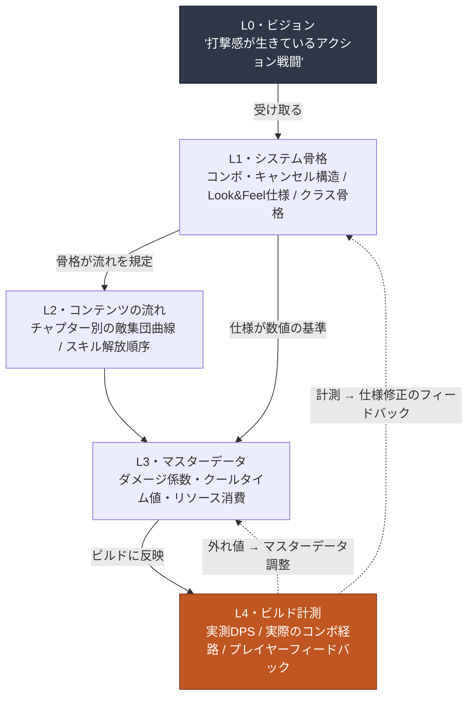

# 4.1 戦闘プランナーとLayer — 打撃感はどのマスに入るのか

> **本章の学習目標**（難易度🟡実務・前提：四則演算・表計算）：打撃感のような抽象的な形容詞を測定可能なシグナルへ分解し、戦闘プランナーの5つの成果物がLayerのどのマスに座るのかを、座標で指定できるようになります。

ビルド会議室。プログラマーが、たったいま組み込んだ新規スキルをモニターに映します。キャラクターが剣を振り、敵が後ろへ押し出されます。5人が見ています。誰かが言います。

「うーん……なんだか打撃感がちょっと弱いな」

隣の人がうなずきます。「ですよね、ちょっと物足りないですね」

プログラマーが尋ねます。「どこをどう変えればいいでしょうか？」

沈黙。会議室の5人のうち、誰もその質問に数字で答えられません。「打撃感が弱い」は5人全員が感じたのに、「ヒットストップを3フレームから5フレームに」と言える人はいません。会議は40分間、「もっとずっしりと」「インパクトが足りない」のような形容詞をやり取りした末、「ひとまず次のビルドでまた見ましょう」で終わります。

この場面が、戦闘企画のすべての問題を圧縮しています。プレイヤーが最も直接体感する分野なのに、その体感を言葉に移した瞬間、形容詞しか残りません。形容詞は測定できず、測定できなければ調整もできません。戦闘プランナーの最初の仕事は、この形容詞を数字へ引き下ろすことです。

本章は、その数字がどのマスに入るのかを定めます。戦闘プランナーが作る5つの成果物がそれぞれLayerのどこに座るのか、そしてその座標がなぜ自動化の前提条件になるのか。4.2・4.3・4.4の実戦ツールは、この座標の上で動きます。

> **専門外の読者のための一行。** この部で戦闘の数値やフレーム単位を覚える必要はありません。持ち帰っていただくのはただ一つ、これです — **「形容詞でやり取りされる依頼は、測定も調整もできない」**。「もっとずっしりと」を「何をいくつに」へ引き下ろした瞬間に協業が回り始めるという発想は、ゲーム外のどんな職務の曖昧なフィードバックにもそのまま適用できます。4.1.1の5つの成果物は軽く流し読みして、この一点だけ手に握って先へ進んでいただいて構いません。

---

## 4.1.1 戦闘プランナーの机の上にある5つのもの

戦闘プランナーが責任を持つ成果物を一行でまとめると、「プレイヤーの入力が画面上のアクションへ変換される全過程」です。これを5つの塊に分けます。

**第一に、戦闘Look & Feel仕様。** 打撃感・応答性・重量感のような抽象を、測定可能な数値に翻訳した文書です。これがこの分野で最も難しい成果物であり、残りの4つを評価する基準になります。

Look & Feelは、さらに4つのシグナルへ分解されます。

- **ヒットタイミング** — 入力ボタンを押した時点から、視覚・聴覚の反応が画面に出るまで何msか
- **ヒットストップ** — 打撃が命中する瞬間、画面が何フレーム止まるか（通常1〜6フレーム）
- **カメラシェイク** — 振幅・持続時間・減衰曲線
- **エフェクト同期** — VFX・SFX・UI反応が同じフレームでトリガーされるか

この仕様がなければ、会議室の場面が繰り返されます。仕様があれば、「ヒットストップ3→5フレーム、カメラシェイク振幅+20%」という調整指示が出ます。

**第二に、スキル・コンボ・キャンセルのシステム。** 入力がアクションへ変換されるルールです。

- スキル使用の流れ：入力 → 詠唱 → 発動 → 硬直（後隙）
- コンボのルール：どのスキルの後にどのスキルがつながり、そのボーナスは何か
- キャンセルのルール：どのアクションの最中に、どのアクションへキャンセルできるか
- 入力キュー（先行入力ウィンドウ）：アクション中に次の入力を受け付けるウィンドウ（ms）はいくつか

**第三に、キャラクター・モンスターAI。** NPCの行動ロジック — ビヘイビアツリー（Behavior Tree、以下BT）、ステートマシン（FSM（Finite State Machine、有限状態機械）/HFSM）、デシジョンテーブル。モンスターの行動パターン、ボスのフェーズ移行、味方NPCの連携、群衆シミュレーションがここに入ります。

**第四に、ダメージ・リソース・クールタイムの数式。** プレイヤーの選択が結果へ変換される数学です。ダメージ係数・防御減算・クリティカル・属性補正、リソース（MP/気力/スタミナ）の消費・回復曲線、クールタイム（クールダウン）の分布。

**第五に、アニメーション制御仕様。** 企画意図が実際のビルドでどう見えるかを定める図面 — アニメーショングラフ・BT・IKの接続です。これは通常プログラマー・アニメーターとの協業ですが、プランナーが意図の仕様を提供しなければ、ビルドで意図が壊れます。資材だけ渡して図面を渡さなければ、別の家が建ちます。

ここでの核心は、**5つが同じ机の上で出会う**という点です。コンボのルール（第二）が変わればダメージ数式（第四）のDPSが変わり、それがまたLook & Feel（第一）の体感の重さを変えます。どの成果物がどの成果物の入力なのかが明示されていなければ、一度の変更が5か所を揺らします。だから座標が必要なのです。

---

## 4.1.2 5つの成果物はLayerのどのマスに座るのか

2.3で定めたL0〜L4の座標の上に、戦闘の成果物5つを載せます。このマッピングが本章の背骨です。



表に整理し直すとこうなります。

| Layer | 戦闘企画の成果物 | 変更頻度 |
|---|---|---|
| L0 | （受け取る — ビジョン：「打撃感が生きているアクション戦闘」） | ほぼ固定 |
| L1 | コンボ・キャンセル構造 / Look & Feel仕様 / クラス骨格 | 遅い |
| L2 | チャプター別の敵集団進行曲線 / スキル解放の流れ | 中間 |
| L3 | スキルダメージ係数のマスターデータ、クールタイム値、リソース消費 | 速い |
| L4 | ビルド実測DPS、実際にコンボ可能な経路、プレイヤーフィードバック | ビルドごと |

戦闘企画の特徴は、**L4の比重が他分野より大きい**という点です。シナリオ企画ではL1仕様がほぼそのまま最終形ですが、戦闘は違います。「打撃感が良い」は、ビルドで直接手を動かして叩いてみて、画面を見なければ分からない領域です。仕様に「ヒットストップ5フレーム」と書いても、それが実際にずっしり感じられるかどうかはL4でしか確認できません。だからこそ、シミュレーションと自動計測ツールがこの分野で最も大きな価値を生みます（4.4）。

ただし、L4が大きいからといってL1の重要度が下がるわけではありません。点線の矢印を見てください。L4の計測値はL1仕様へフィードバックされます。仕様がなければ、計測値は「比較する基準」を失います。5フレームという仕様があってこそ、「実測4フレーム、1フレーム欠落」という診断が出ます。仕様 → ビルド → 計測 → 仕様修正のサイクルが、5つのLayerをすべて通ります。戦闘プランナーはこのサイクル全体に手を載せている、一つの机で最も多くのLayerが同時に回るポジションです。

---

## 4.1.3 形容詞を数字に — 実作業のひとつの背骨

抽象論はここまでです。ここからは会議室の場面に戻り、「打撃感が弱い」を実際に数字へ引き下ろす過程を、ワークド・トランスクリプトで見ます。道具はLLM一つです。出力は整えず、人が拒否した部分もそのまま残します。

著者がディレクターとして運営しているあるMMORPGプロジェクト（以下「プロジェクトA」）の戦闘TFで、新規近接スキル一つのLook & Feelを仕様化した実際の流れを再構成します。

### プロンプト（全文）

```
このスキルのLook & Feelを、形容詞ではなくms・フレームの数値に変えてくれ。
ヒットタイミング、ヒットストップ、カメラシェイク、エフェクト同期、硬直の5つ。
確信がないものは「このゲームで検証必要」と書いてくれ。

スキル: 大剣縦斬り (heavy_overhead_slash)
意図: 「ずっしりと振り下ろし、敵がよろめく感じ」
フレームレート: 60fps
```

### Claudeの生の出力（要約・整理なし）

> 大剣縦斬りの「ずっしり感」は、主に**ヒットストップと硬直の長さ**、そして**カメラシェイクの減衰**で作られます。項目別に提示します。
>
> **1) ヒットタイミング。** 重い武器ほど、入力から発動までの予備動作（発生）が長いほうが重量感が生きます。入力から最初の視覚反応（キャラクターが剣を持ち上げ始める）まで**50〜80ms**（3〜5フレーム）推奨。ただし、最初の*視覚*反応と最初の*打撃*反応は別物です。打撃の命中まではモーションの長さに依存するため、ここでは断定できません — **このゲームのモーション長で検証が必要**です。
>
> **2) ヒットストップ。** ずっしりした一撃の核心変数です。軽い攻撃が1〜2フレームなら、大剣縦斬りは**4〜6フレーム**（約67〜100ms）推奨。6フレームを超えると「ずっしり」が「引っかかり」へ変わり、応答性が悪くなります。
>
> **3) カメラシェイク。** 振幅は画面高さの約1〜2%、持続0.2〜0.3秒、減衰は線形より**ease-out（速く弱まる）**。重い一撃は、最初の振動が強く、速やかに収まる曲線が自然です。
>
> **4) エフェクト同期。** VFX（ヒットエフェクト）・SFX（打撃音）・ヒットストップは**必ず命中フレームに同時に**トリガーされる必要があります。1〜2フレームずれただけで「物足りなさ」として体感されます。UI反応（ダメージ数字）は1〜2フレーム遅れても問題ありません。
>
> **5) 硬直。** ずっしり感の代償として硬直が長くなります。命中後、被弾可能な状態へ復帰するまで**20〜30フレーム**（333〜500ms）推奨。ただしこの値は、ゲーム全体の戦闘テンポ（速いアクション vs 重厚なソウルライク）によって大きく変わります — **このゲームの基準テンポで検証が必要**です。
>
> まとめると、「ずっしり感 = 長い予備動作 + 4〜6フレームのヒットストップ + ease-outシェイク + 同一フレームのVFX/SFX/ストップ + 長い硬直」です。ただし上記の数字は一般的な推奨範囲であり、**実際の重量感はビルドで手を動かして叩いてみて調整して初めて確定します。**

### 人による検証・拒否・再依頼

ここでプランナーは、出力を丸ごと採用しません。2か所で立ち止まります。

**拒否1 — カメラシェイク振幅「画面高さの1〜2%」。** このゲームはモバイル優先です。小さな画面では1〜2%はほとんど見えません。モバイルの画面酔いの問題もあります。プランナーはこの推奨値を拒否し、「モバイルではシェイクの代わりに、ヒットストップの強調で重さを表現する」という自前の原則を適用します。LLMは一般論を出しただけで、このゲームのプラットフォーム制約は知りません。

**保留2 — ヒットストップ「4〜6フレーム」。** これは拒否ではなく保留です。範囲としては正しいものの、正確な値はビルドの手触りで決めます。仕様には「4フレームを基本値としてビルドに入れ、5・6フレームのバリエーションを作って3つを手で比較する」と書きます。

再依頼はこう出します。

```
モバイル優先のプロジェクトだ。カメラシェイクは最小化し、重量感を
ヒットストップ・硬直・SFXで表現する方向で仕様を書き直せ。
ヒットストップは4/5/6フレームの3バリエーションをビルド比較用に表で。
```

この2回目の出力でLLMは、モバイル制約を反映した仕様表を作ります。その表がビルドに入り、次のビルド会議でプランナーは形容詞の代わりに「4フレーム版は軽すぎる、5フレームを採択」と言います。40分の会議が、5分の決定に縮まります。

### このトランスクリプトが見せてくれるもの

3つです。第一に、LLMは**形容詞を数字の範囲へ引き下ろす一次ドラフト**を上手に作ります — これが会議室の沈黙を破ります。第二に、LLMは**このゲームの制約（モバイル・テンポ・モーション長）を知りません** — だから一般的な推奨値を出すだけで、拒否・調整は人の仕事です。第三に、LLM自身が「ビルドで手を動かして叩いてみて初めて確定する」と2回も釘を刺しました — 重量感の最終判断はL4の人の手にあるという事実を、道具も知っているのです。

---

## 4.1.4 AIが導入価値を回収する4つの持ち場

上のトランスクリプトは、一つの持ち場（仕様化）だけを見せました。戦闘企画全体でAIが価値を生む持ち場は4か所です。

**1) シミュレーション — 最大の価値。** DPS（Damage Per Second、秒間ダメージ）曲線・コンボ経路・リソース消費を、ビルドなしで事前計算します。ビルドを作って手で計測するより圧倒的に速いです。4.4で`simulate_dps`シミュレーターを直接扱います。

**2) ステートマシン・BTの自動生成。** 「このボスは体力50%以下で狂暴化し、狂暴化中は3連撃パターンを使う」のような自然言語の説明を、BT/FSMダイアグラムへ変換します。正確度は高いです — ルール構造はLLMが得意とする領域です。頭の中のロジックを図へ移す時間が節約されます。

**3) ビルドキャプチャーの自動分析。** プレイ映像からヒットタイミング・コンボ成功率・被害分布を自動抽出します。ただしこれは**実装難易度が最も高い持ち場**です（下で正直に検討します）。

**4) バランス調整候補の提案。** マスターデータの各行を分析して外れ値・曲線の非平滑さを検出し、調整候補を出します。人は選ぶだけです。

この4か所のうち、ビルドキャプチャーの自動分析（3）は、「できる」と「簡単にできる」の距離が最も遠い持ち場です。書籍ではよく「AIが映像から自動で全部抽出してくれます」と書かれますが、実際はそれほど単純ではありません。映像ピクセルベースのコンピュータービジョン、既製のビジョンAPI、ゲーム内telemetryログ — 3つのキャプチャー方法の正確度・実装負担の比較は**4.4を正とするので、そちらを参照**してください。ここでは結論だけ押さえます。

最も現実的な道は**ゲーム内telemetryログ**です。エンジンが「フレーム1204でskill_overheadが命中、ダメージ340、コンボカウント3」のようなイベントを直接記録するようにします。これはソースデータなので正確で、ロギングコードを一度挿入すれば終わりです。LLMはそのログを読んで、自然言語レポート（「3コンボまではリソース効率が良いが、4コンボから急減する」）へ要約するのに使います。映像は、人が疑わしいケースだけ目で確認する補助として残します。

つまり「AIが映像を自動分析する」というビジョンの現実的な形は、**telemetryログ + LLM要約**であって、ピクセルビジョンではありません。この正直な区分が、4.4のツール選択の出発点です。

そして、4つの持ち場すべてで変わらないことが一つ。**「打撃感が良い」の最終判断はAIにはできません。** それはプレイヤーの感情の領域であり、その感情に対する責任は人が引き受けます。AIはその感情判断の**根拠資料**を速く作ってくれるだけです。シミュレーション数値、BTダイアグラム、telemetryレポート — すべて、人が手触りで決定を下すための材料です。

---

## 4.1.5 座標を分けた本当の理由 — 自動化の前提条件

ここまでは「成果物をLayerで分ければ、協業のときに言葉が通じる」という表面的な理由でした。コンボのルールをL1に、ダメージのマスターデータをL3に置いたのは、変更頻度が違うからだと説明しました。正しい話ですが、それがすべてではありません。

座標を分けた本質的な理由は、**自動化がその上でしか動かないから**です。Layer分解がプロシージャル生成・自動化の前提であるという一般的な論題は2.3で扱ったので、ここではその前提が戦闘分野の3つの自動化でどう明暗を分けるのかに絞ります。

**第一に、シミュレーションは「何を入力し、何を変えられるのか」が区分されていなければ回りません。** 決定論的コア（物理・当たり判定 — L1骨格）と変更可能な仕様（ダメージ値・クールタイム — L3マスターデータ）が混ざっていると、シミュレーターは「変更候補空間」を定義できません。コアは固定、マスターデータは変数 — この分離があってこそ、`simulate_dps`が「ダメージ係数を280から340まで20刻みで上げながらDPS曲線を描け」のような探索を行えます。

**第二に、ビルドキャプチャーの自動分析は、アクションatomがラベリングされていて初めて意味を持ちます。** 仕様の側で「このフレーム区間は`skill_overhead`のhit段階」とラベル付けされたatomがあってこそ、telemetryログから抽出したシグナルを仕様と自動照合できます。ラベルがなければ、ログは「フレーム1204で何かが命中」という、意味のない点の羅列です。

**第三に、LLMによるコンボシーケンス生成は、キャンセルルール・入力キューが外部文書として分離されていて初めて動きます。** 「このキャラクターのキャンセル可能ペア7個と入力キュー200msの中で、5コンボのシーケンスを10個提案せよ」のような限定依頼は、キャンセルルールがコードの中に固定されておらず、文書として切り出されているときにのみ可能です。

3つが同じ一つの文を語っています。**決定論的コアが仕様と混ざれば自動化は塞がり、分離されれば自動化は開きます。** Layer分解は、協業言語の統一が表面の目的で、本質の目的は自動シミュレーション・キャプチャー分析・LLMシーケンス探索の前提条件を敷くことです。

### 保守的適用から進歩的適用へ

この前提が敷かれると、戦闘運営は2段階で進化します。

**保守的適用 — 人が設計し、自動が検証します。** いま、大半のアクション・MMORPGの戦闘運営はここにあります。人がコンボ・キャンセル仕様を直接書き、自動がDPS・リソースをシミュレートし、telemetryでキャプチャーして「仕様 vs 計測」の比較レポートを出します。人はその差を解釈して仕様修正を決定し、再び仕様作成へとサイクルが回ります。設計は人、シミュレーション・キャプチャー・比較は自動です。

**進歩的適用 — AIが候補を発議し、人は採択するだけ。** 次の段階です。AIがキャンセルペアと入力キューの範囲内でシーケンスを10〜30個自動列挙し、自動が各シーケンスのDPS・リソースを並列にシミュレートし、LLMが「リソース効率1位、入力難易度は中」のように順位・解釈を付けます。人の手に残る決定は「候補のうちどのシーケンスをシグネチャーとして採択するか」一つ、そしてディレクターによるビルド反映・モーションキャプチャーの決定だけです。シーケンスをゼロから作るのと、30個の中から選ぶのとでは、作業負担の次元が違います。

進歩的適用が定着するには、3つが揃う必要があります。（1）ビルドなしで1秒以内にDPS・リソース・生存時間を計算する決定論的シミュレーションインフラ、（2）コンボ・キャンセル・入力キューが外部文書として分離・ラベリングされたアクションatom、（3）telemetryベースのキャプチャー自動分析。3つとも、上で述べたLayer分解の直接の成果物です。

### モーションキャプチャーは不可逆の段階 — 決定ゲート

最後に可逆性です。戦闘プランナーのレビューサイクルには、巻き戻せる段階と巻き戻せない段階が混ざっており、その境界を知ることが重要です。

<svg viewBox="0 0 720 230" xmlns="http://www.w3.org/2000/svg" font-family="sans-serif">
  <rect x="0" y="0" width="720" height="230" fill="#fbfbfb"/>
  <text x="20" y="30" font-size="15" font-weight="bold" fill="#1a202c">可逆 ──────────────────▶ 決定ゲート ──────▶ 不可逆</text>

  <!-- 可逆段階のボックス -->
  <rect x="20" y="55" width="150" height="44" rx="6" fill="#c6f6d5" stroke="#2f855a"/>
  <text x="95" y="78" font-size="12" text-anchor="middle" fill="#22543d">コンボ・キャンセル</text>
  <text x="95" y="93" font-size="12" text-anchor="middle" fill="#22543d">仕様修正</text>

  <rect x="20" y="110" width="150" height="44" rx="6" fill="#c6f6d5" stroke="#2f855a"/>
  <text x="95" y="133" font-size="12" text-anchor="middle" fill="#22543d">シミュ実行・レポート</text>
  <text x="95" y="148" font-size="11" text-anchor="middle" fill="#22543d">(結果の破棄は自由)</text>

  <rect x="20" y="165" width="150" height="44" rx="6" fill="#c6f6d5" stroke="#2f855a"/>
  <text x="95" y="188" font-size="12" text-anchor="middle" fill="#22543d">データシート</text>
  <text x="95" y="203" font-size="12" text-anchor="middle" fill="#22543d">数値調整</text>

  <!-- 部分可逆 -->
  <rect x="220" y="110" width="160" height="44" rx="6" fill="#feebc8" stroke="#c05621"/>
  <text x="300" y="133" font-size="12" text-anchor="middle" fill="#7b341e">ビルド反映 (開発)</text>
  <text x="300" y="148" font-size="11" text-anchor="middle" fill="#7b341e">部分可逆</text>

  <!-- ゲート -->
  <line x1="430" y1="40" x2="430" y2="215" stroke="#e53e3e" stroke-width="2.5" stroke-dasharray="6 4"/>
  <text x="430" y="225" font-size="12" text-anchor="middle" fill="#e53e3e" font-weight="bold">決定ゲート</text>

  <!-- 不可逆 -->
  <rect x="480" y="80" width="210" height="48" rx="6" fill="#fed7d7" stroke="#c53030"/>
  <text x="585" y="103" font-size="12" text-anchor="middle" fill="#742a2a">モーキャプ (シグネチャーアクション)</text>
  <text x="585" y="119" font-size="11" text-anchor="middle" fill="#742a2a">スタジオ・俳優・再撮影コスト</text>

  <rect x="480" y="140" width="210" height="48" rx="6" fill="#fed7d7" stroke="#c53030"/>
  <text x="585" y="163" font-size="12" text-anchor="middle" fill="#742a2a">ビルド反映 (ライブ)</text>
  <text x="585" y="179" font-size="11" text-anchor="middle" fill="#742a2a">ホットフィックス費用・ユーザー認識変化</text>
</svg>

モーションキャプチャーは、戦闘で最も分厚い不可逆段階です。キャプチャースタジオのスケジュール、俳優のキャスティング、再撮影の費用、どれも大きくつきます。だからシグネチャーアクションのモーションキャプチャーは、**シミュレーションとキャプチャー自動分析が十分に回り、シーケンスを確定した後**にのみ進めます。保守的であれ進歩的であれ、モーションキャプチャーとライブビルドの直前を決定ゲートとして置きます。戦闘プランナーのすべてのレビューは、このゲートの左側の可逆段階で完結してこそ安全です。

---

## 4.1.6 会社での風景 — 何が減ったのか

プロジェクトAの戦闘TFが、上の座標とツールを6か月運営しながら計測した変化です。以下の数値はTF運営記録から抜き出したおおよその平均であり、精密な計測値ではなく、**体感変化の方向**として読むのが正確です。

| 項目 | 導入前 | 導入後 |
|---|---|---|
| Look & Feel会議の時間 | 平均2時間（主観の議論） | 平均30分（計測値ベース） |
| コンボダイアグラムの作成 | 1〜2時間/スキルセット | 10分/スキルセット |
| DPS曲線の検証 | ビルド後に手動計測（≈1日） | シミュレーション（≈10分） |
| 新スキルのバランス調整 | 3〜4回のビルドサイクル | 1〜2回のビルドサイクル |

数字そのものより、方向が核心です。4項目すべてが「主観の議論・手動計測・ビルドの繰り返し」から「計測値・シミュレーション・ダイアグラム自動化」へ移りました。会議室で形容詞が減り、数字が増えました。それが本章全体の言いたい一文です — 戦闘プランナーの仕事は、主観（打撃感・面白さ）から客観（数値・シミュレーション）へ渡る橋を架けることであり、AIはその橋を速く敷く道具です。橋の先で「ずっしりしている」を決める手は、依然として人のものです。

---

## 本章のポイント

- 戦闘企画は、L1仕様からL3マスターデータ、L4ビルド実測まで、一つの机で最も多くのLayerが同時に回るポジションです。
- Layer分解は、協業言語の統一が表面で、本質はシミュレーション・キャプチャー・LLM探索という自動化の前提条件です。
- 「打撃感が良い」の最終判断は人の仕事であり、AIはその判断の根拠資料を速く作ります。

---

## やってみよう — 形容詞を数字に引き下ろす

**setup.** LLMが一つあれば十分です。手元のスキルを一つ選んでください（新規でも既存でも）。そのスキルの意図を形容詞一行で書きます — 「ずっしりと」「素早く」「重々しく」のように。

**prompt.** 下の骨格にスキル情報を埋め込んでみましょう。

```
君は戦闘企画の補助だ。下のスキルのLook & Feelを「測定可能な
数値仕様」に変換せよ。形容詞ではなくms・フレーム・%単位で。
確信のない項目は「このゲームで検証必要」と明記せよ。

スキル: [名前]
意図: 「[形容詞一行]」
フレームレート: [60fpsなど]
項目: 1)ヒットタイミング 2)ヒットストップ 3)カメラシェイク 4)エフェクト同期 5)硬直
```

**verify.** 出力のすべての数字に、2つの質問を投げてみましょう。（1）このゲームの制約（プラットフォーム・テンポ・モーション長）でこの値は合っていますか？ → 合わなければ、制約を伝えて再依頼してください。（2）この値はビルドで手を動かして確定すべきものですか？ → そうであれば、単一の値の代わりに2〜3個のバリエーションを仕様に書き、ビルドで比較してください。LLMが「検証が必要」と釘を刺した項目は、絶対にそのまま採択しないでください。

## 4.1.7 一人ミニ版

一人で作るゲームなら、5つの成果物・5つのLayerをすべて揃える必要はありません。最低限、次の2つだけ行ってください。**一つ、Look & Feel仕様を1ページ** — 核心アクション3〜5個について、ヒットストップ・硬直・同期だけを数字で書きます。形容詞で書かれたメモは、6か月後の自分にも読み解けません。**二つ、コンボ・キャンセルをコードから分離して1ファイルに** — キャンセルペアをデータとして切り出しておけば、後でLLMに「このペアで作れるコンボを5個提案」と頼めます。この2つが、1人開発でも自動化の扉を開けておく最小の座標です。
