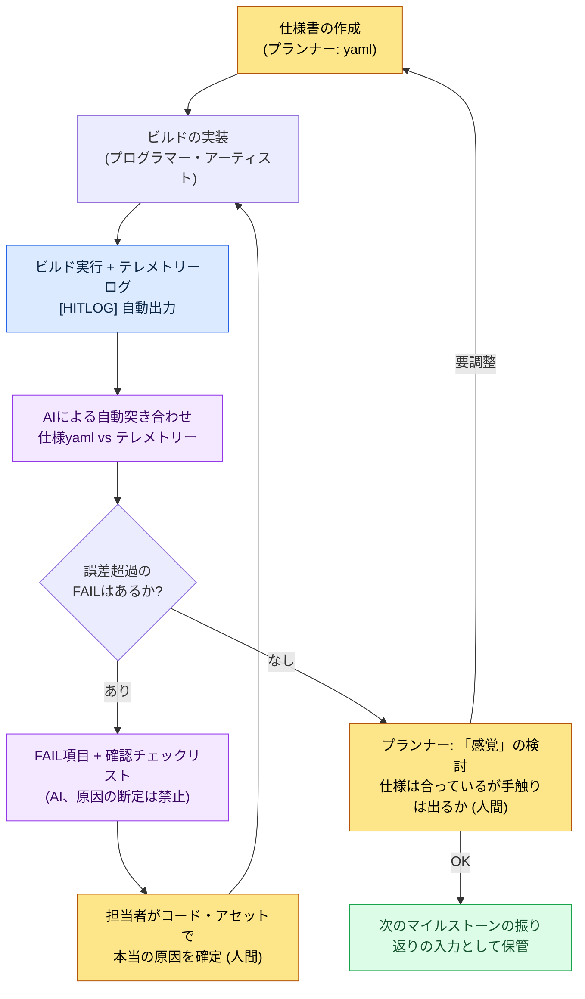

# 4.2 戦闘のLook & Feel — 手触りをデータで捉える

会議室のモニターの前に5人が集まっています。同じビルド、同じスキル、同じ30秒の映像が、画面で3回目のリピート再生されているところです。クライアントプログラマーが最初に口を開きます。「自分は問題ないと思いますけど」。アート担当が腕を組みます。「弱いですね。何か足りない感じ」。隣にいたプランナーが割り込みます。「エフェクトはいいんですが、手に馴染まないんですよ」。ディレクターはしばらく見てから決定を下します。「うーん……もう少しだけ重めにいきましょう」。

そして会議が終わります。「もう少しだけ重めに」が正確に何msで何フレームなのかは、誰も書き留めませんでした。次のビルドでプログラマーは自分が理解した「重さ」を実装し、アートは自分が理解した「重さ」を載せます。そして翌週、同じ会議室で同じ映像を見ながら、同じ会話が繰り返されます。

打撃感、手触り、Look & Feel。戦闘企画でもっとも頻繁に使われ、もっとも定義されていない言葉です。誰もが知っていると信じているのに頭の中の定義はバラバラで、議論が終わっても何も残りません。本章はその「感じ」を測定可能な数字に分解する作業を扱います。手触りを抽象からデータへ引きずり下ろす場です。

---

## 4.2.1 戦闘 = Look & Feel、システム = 動作

まず境界線を引いておきます。戦闘企画は大きく2つに分かれます。

- **戦闘システム**：どう動作するか。ダメージ計算式、クールタイム（クールダウン）、スタックの蓄積、状態異常のルール。次章（4.3 コンボ・キャンセル、4.4 AIシミュレーション）の領域です。
- **戦闘のLook & Feel**：どう感じられるか。ボタンを押してから画面がいつ反応するか、ヒットの瞬間に画面がどれだけ止まるか、エフェクトと音と振動が同じ瞬間に弾けるか。

本章は後者だけを扱います。ダメージが100でも120でも、手触りとは直接の関係がありません。その100のダメージが「入る瞬間」をプレイヤーがどう体感するかが手触りです。同じダメージ計算式でも、ヒットタイミングとヒットストップが違えば、まったく別のゲームのように感じられます。

まず正直に押さえておきたいことがあります。打撃感は3つの数字だけでは完成しません。攻撃モーション（アニメーション）の加速・減速カーブ、受け手側の反応（ヒットリアクション・硬直）、80〜90年代の日本のアクションゲームが好んで使ったデフォルメ（打撃の瞬間にキャラクターを誇張して伸ばし、つぶす残像・つぶれの表現）まで全部そろって、はじめて「当たった」というひとかたまりの感覚が立ち上がります。**本章が集中して測定可能な数字に引きずり下ろすもの**は、そのうちの3つの軸です。モーション・リアクション・デフォルメはアニメーター・アーティストの手がより大きく関わる領域なので、続く章とアートのパートで扱い、ここではプランナーが仕様書で固定し、ビルドで検証できる3つの軸に重きを置きます。その3つの軸は、次のように分かれます。

<svg viewBox="0 0 720 250" xmlns="http://www.w3.org/2000/svg" font-family="sans-serif">
  <rect x="0" y="0" width="720" height="250" fill="#fafafa" stroke="#ddd"/>
  <text x="360" y="32" text-anchor="middle" font-size="17" font-weight="bold" fill="#222">測定可能な3つの軸 (手触りのすべてではない)</text>
  <!-- axis 1 -->
  <rect x="40" y="70" width="190" height="140" rx="8" fill="#e8f0fe" stroke="#4a76d4" stroke-width="2"/>
  <text x="135" y="100" text-anchor="middle" font-size="15" font-weight="bold" fill="#2a4a9a">ヒットタイミング</text>
  <text x="135" y="128" text-anchor="middle" font-size="12" fill="#444">入力 → 反応</text>
  <text x="135" y="148" text-anchor="middle" font-size="12" fill="#444">いつ応答するか</text>
  <text x="135" y="178" text-anchor="middle" font-size="13" font-weight="bold" fill="#2a4a9a">単位: ms</text>
  <text x="135" y="198" text-anchor="middle" font-size="11" fill="#777">「反応が速いか」</text>
  <!-- axis 2 -->
  <rect x="265" y="70" width="190" height="140" rx="8" fill="#fde8e8" stroke="#d44a4a" stroke-width="2"/>
  <text x="360" y="100" text-anchor="middle" font-size="15" font-weight="bold" fill="#9a2a2a">ヒットストップ</text>
  <text x="360" y="128" text-anchor="middle" font-size="12" fill="#444">命中の瞬間</text>
  <text x="360" y="148" text-anchor="middle" font-size="12" fill="#444">時間を止める長さ</text>
  <text x="360" y="178" text-anchor="middle" font-size="13" font-weight="bold" fill="#9a2a2a">単位: frame</text>
  <text x="360" y="198" text-anchor="middle" font-size="11" fill="#777">「重みがあるか」</text>
  <!-- axis 3 -->
  <rect x="490" y="70" width="190" height="140" rx="8" fill="#e8f6ec" stroke="#3a9a5a" stroke-width="2"/>
  <text x="585" y="100" text-anchor="middle" font-size="15" font-weight="bold" fill="#1a6a3a">エフェクト同期</text>
  <text x="585" y="128" text-anchor="middle" font-size="12" fill="#444">VFX·SFX·UI·</text>
  <text x="585" y="148" text-anchor="middle" font-size="12" fill="#444">カメラ·振動</text>
  <text x="585" y="178" text-anchor="middle" font-size="13" font-weight="bold" fill="#1a6a3a">単位: frame offset</text>
  <text x="585" y="198" text-anchor="middle" font-size="11" fill="#777">「一つの事件のように弾けるか」</text>
  <!-- plus signs -->
  <text x="247" y="148" text-anchor="middle" font-size="26" fill="#999">+</text>
  <text x="472" y="148" text-anchor="middle" font-size="26" fill="#999">+</text>
  <text x="360" y="240" text-anchor="middle" font-size="12" fill="#666">この3つが測定対象 — モーション·ヒットリアクション·デフォルメはアート·アニメ領域(別途)</text>
</svg>

会議室で誰かが「弱い」と言うとき、その弱さは3つのうちのどれかから来ています。反応が遅いのか（タイミング）、ヒットの手応えがないのか（ヒットストップ）、バラバラに動いているのか（同期）。3つの軸に分解して問えば、「弱い」がようやく直せる文章になります。

ただし、「弱い」の原因がつねにこの3軸だけにあるわけではありません。手触りを構成する要素を漏れなく並べ、本章がどこまで責任を持つのか、線を引いておきます。

| Look & Feelの構成要素 | 何か | 本章での扱い |
|---|---|---|
| **ヒットタイミング** | 入力 → 最初の反応までのms。最初に疑われる要素 | 測定・仕様化（軸1） |
| **ヒットストップ** | ヒットの瞬間に時間を止めて重さを与える長さ | 測定・仕様化（軸2） |
| **カメラシェイク** | 打撃に合わせて画面が揺れる反動 | 測定・仕様化（軸3に含む） |
| **VFX・SFXタイミング** | エフェクトと音がヒットフレームに同期しているか | 測定・仕様化（軸3に含む） |
| 攻撃モーション（アニメーション） | 振りの加速・減速、予備動作とフォロースルーのカーブ | 言及（アート・アニメーション領域） |
| ヒットリアクション・硬直 | 受け手側がのけぞって硬直する反応 | 言及（次章・アートのパート） |
| デフォルメ | 打撃の瞬間に伸ばしつぶす誇張（残像・つぶれ） | 言及（アートのパート） |
| コントローラーの振動 | 手に伝わる物理フィードバック | 測定・仕様化（軸3に含む） |

上の4つが本章の3軸としてまとめられ、測定・仕様化の対象になります。中央の3つ（モーション・リアクション・デフォルメ）は欠かせないものの、プランナーひとりでは数字で閉じにくいアート・アニメーション領域なので、「存在する」ということだけを明確にしておきます。モーションが硬かったり、受け手側が平然と立っていたりすれば、3軸がすべて合っていても打撃感は立ちません。

---

## 4.2.2 ヒットタイミング — 入力から反応まで

3つの軸のうちタイミングを最初に扱うのには理由があります。プレイヤーが手触りを疑うとき真っ先に引っかかるのが「反応が遅い」という感覚であり、他のどこがどれだけ派手でも、入力がもたつけばその瞬間にすべてが崩れるからです。だから、タイミングから固めます。

手触りの最初の軸は時間です。ボタンを押したその瞬間（0ms）から、画面が最初に反応する瞬間まで何msかかるか。人間はこの遅延に驚くほど敏感です。60msと120msの違いを「言葉では説明できなくても、手は知っている」のです。

1回の攻撃は単純な1点ではなく、時間の上に広がる複数の事件です。通常攻撃の1段目を時間軸に載せると、こんな形になります。

<svg viewBox="0 0 720 270" xmlns="http://www.w3.org/2000/svg" font-family="sans-serif">
  <rect x="0" y="0" width="720" height="270" fill="#fafafa" stroke="#ddd"/>
  <text x="360" y="28" text-anchor="middle" font-size="16" font-weight="bold" fill="#222">通常攻撃の1段目 — 時間軸 (warrior / skill_id 1001)</text>
  <!-- timeline axis -->
  <line x1="60" y1="220" x2="680" y2="220" stroke="#333" stroke-width="2"/>
  <!-- ticks: 0,100,150,250,350 ms mapped 60..680 over 0..380ms => scale (680-60)/380=1.63px/ms -->
  <g font-size="11" fill="#555">
    <line x1="60" y1="215" x2="60" y2="225" stroke="#333"/><text x="60" y="245" text-anchor="middle">0ms</text>
    <line x1="223" y1="215" x2="223" y2="225" stroke="#333"/><text x="223" y="245" text-anchor="middle">100</text>
    <line x1="305" y1="215" x2="305" y2="225" stroke="#333"/><text x="305" y="245" text-anchor="middle">150</text>
    <line x1="468" y1="215" x2="468" y2="225" stroke="#333"/><text x="468" y="245" text-anchor="middle">250</text>
    <line x1="631" y1="215" x2="631" y2="225" stroke="#333"/><text x="631" y="245" text-anchor="middle">350</text>
  </g>
  <!-- input -->
  <line x1="60" y1="60" x2="60" y2="220" stroke="#4a76d4" stroke-width="2" stroke-dasharray="4 3"/>
  <text x="62" y="55" font-size="11" fill="#2a4a9a">入力(0)</text>
  <!-- casting motion bar 0..100 -->
  <rect x="60" y="70" width="163" height="20" rx="4" fill="#c9d8f5" stroke="#4a76d4"/>
  <text x="141" y="84" text-anchor="middle" font-size="11" fill="#2a4a9a">キャスティングモーション 0~100</text>
  <!-- hitbox 100..150 -->
  <rect x="223" y="98" width="82" height="20" rx="4" fill="#f5d6c9" stroke="#d4764a"/>
  <text x="264" y="112" text-anchor="middle" font-size="10" fill="#9a4a2a">ヒットボックス 100~150</text>
  <!-- vfx 100..250 -->
  <rect x="223" y="126" width="245" height="20" rx="4" fill="#d6e8d9" stroke="#3a9a5a"/>
  <text x="345" y="140" text-anchor="middle" font-size="11" fill="#1a6a3a">視覚エフェクト 100~250 (50ms遅延後にフェード)</text>
  <!-- damage at 110 -->
  <line x1="76" y1="154" x2="76" y2="172" stroke="#d44a4a" stroke-width="0"/>
  <circle cx="239" cy="164" r="6" fill="#d44a4a"/>
  <text x="248" y="168" font-size="10" fill="#9a2a2a">ダメージ適用 110 (視覚より10ms後 → 事実上同時と認識)</text>
  <!-- afterdelay 150..350 -->
  <rect x="305" y="182" width="326" height="18" rx="4" fill="#eee" stroke="#aaa"/>
  <text x="468" y="195" text-anchor="middle" font-size="10" fill="#777">後ディレイ 150~350 (次の入力受付まで)</text>
</svg>

この図でもっとも重要な数字は「当たり判定（ヒットボックス）が最初にオンになる100ms」です。ボタンを押してから100ms後に攻撃判定が始まるという意味です。この値が手触りの体感速度を決めます。

推奨範囲はジャンル・キャラクターごとに異なりますが、おおまかな基準線はあります。

| 種類 | 推奨 入力→反応 | 備考 |
|---|---|---|
| 即時反応（軽い攻撃） | 60〜120ms | 手に「吸い付く」感じの核心区間 |
| 重い反応（大型スキル） | 200〜400ms | 重さを出すための意図した発生の遅れ |
| チャージ（長い溜め） | 500〜2000ms | 意図した待機、別枠で処理 |

この範囲は絶対の基準ではありません。**著者の推定（未検証）**であり、カジュアルモバイルは入力に寛容な方向へ±50msほど揺れ、コンソールの格闘ゲームはより厳しく締める傾向があります。数字そのものより、「うちのゲームの軽い攻撃は90msで合意した」という基準線をチームで共有することが核心です。基準線があってはじめて、ビルドを見て「合っている/間違っている」を言えるようになります。

ところが、ここにひとつ落とし穴があります。人間の目では90msと110msを区別できません。60fpsでは1フレームは約16.67msで、この20msの差は1フレーム余りです。会議室での「ちょっと遅い気がするんだけど？」という言葉が正しいのか間違っているのか、目では最後まで判定がつきません。だから測定が必要なのです。

---

## 4.2.3 ビルドからタイミングをどう取り出すか — 正直な比較

仕様書に「当たり判定100ms」と書きました。ビルドで実際に100msでオンになることをどう確認するのか。自動化の道は3つ（映像分析・既製のvisionツール・ゲーム内テレメトリー）に分かれますが、3方式の精度・難易度の比較は4.4で本格的に扱います。ここでは結論だけ押さえます。実務で最初に敷くべきものは**ゲーム内テレメトリー**です。理由は単純です。VFXが画面に「現れたフレーム」を映像から推論するより、コードが`OnHit`イベントを発生させたフレームに直接`[HITLOG]`を1行出力するほうが、比較にならないほど正確で安上がりだからです。映像分析は入力オーバーレイのない外部映像（例：競合作の分析）にだけ使い、自分たちのビルドにはテレメトリーから敷きます。

テレメトリーログはこんな形をしています。

```
[HITLOG] frame=6  t_ms=100  evt=hitbox_on    skill=1001 char=warrior
[HITLOG] frame=6  t_ms=100  evt=vfx_trigger  skill=1001
[HITLOG] frame=6  t_ms=100  evt=sfx_trigger  skill=1001
[HITLOG] frame=7  t_ms=117  evt=damage_apply skill=1001 dmg=124
[HITLOG] frame=7  t_ms=117  evt=ui_dmgnum    skill=1001
[HITLOG] frame=6  t_ms=100  evt=cam_shake    skill=1001 amp=0.4
```

プランナーの仕事は、このログを仕様書と1行ずつ突き合わせることです。数値の換算と機械的な照合がほとんどなので、人間が目で繰り返すと疲れて間違えますが、LLMは疲れません。次の節で実際にやらせてみます。

---

## 4.2.4 ワークド・トランスクリプト — テレメトリーログを仕様書と突き合わせる

仕様のyamlとビルドのテレメトリーログを両方貼り付けて、AIに2つを突き合わせ、ズレている項目を見つけるよう指示しました。以下はプロンプトの全文とClaudeの生の出力、そして人間による検証プロセスの全体です。要約せず、そのまま載せます。

### 1次プロンプト

```
次は戦闘スキル1つの「ヒットタイミング仕様」と、実際のビルドから抜いた
telemetryログだ。仕様に対してビルドがずれている項目を表に整理して。

[仕様]
character: warrior
skill_id: 1001
fps: 60
events:
  hitbox_on:    {expect_ms: 100, tol_frame: 0}
  vfx_trigger:  {expect_ms: 100, tol_frame: 0}
  sfx_trigger:  {expect_ms: 100, tol_frame: 1}
  damage_apply: {expect_ms: 110, tol_frame: 1}
  ui_dmgnum:    {expect_ms: 100, tol_frame: 2}
  cam_shake:    {expect_ms: 100, tol_frame: 1}

[telemetryログ]
[HITLOG] frame=6  t_ms=100  evt=hitbox_on    skill=1001
[HITLOG] frame=6  t_ms=100  evt=vfx_trigger  skill=1001
[HITLOG] frame=8  t_ms=133  evt=sfx_trigger  skill=1001
[HITLOG] frame=7  t_ms=117  evt=damage_apply skill=1001
[HITLOG] frame=9  t_ms=150  evt=ui_dmgnum    skill=1001
[HITLOG] frame=6  t_ms=100  evt=cam_shake    skill=1001

60fps(1フレーム=16.67ms)。expect_msをフレームに換算してログのframeと
比較し、差がtol_frameを超えたらFAILと表示して。
```

### Claudeの生の出力（そのまま）

> まず仕様のexpect_msをフレームに換算します。60fpsではframe = round(ms / 16.67)です。
>
> - hitbox_on: 100 / 16.67 ≈ 6.0 → frame 6
> - vfx_trigger: 100 → frame 6
> - sfx_trigger: 100 → frame 6
> - damage_apply: 110 / 16.67 ≈ 6.6 → frame 7（四捨五入）
> - ui_dmgnum: 100 → frame 6
> - cam_shake: 100 → frame 6
>
> ログの実際のframeと比較した結果です。
>
> | イベント | 期待frame | 実際frame | 差（frame） | 許容 | 判定 |
> |---|---|---|---|---|---|
> | hitbox_on | 6 | 6 | 0 | 0 | PASS |
> | vfx_trigger | 6 | 6 | 0 | 0 | PASS |
> | sfx_trigger | 6 | 8 | +2 | 1 | **FAIL** |
> | damage_apply | 7 | 7 | 0 | 1 | PASS |
> | ui_dmgnum | 6 | 9 | +3 | 2 | **FAIL** |
> | cam_shake | 6 | 6 | 0 | 1 | PASS |
>
> 2項目が許容誤差を超えました。
> - **sfx_trigger**：サウンドが視覚ヒットより2フレーム（約33ms）遅れています。許容1フレームを超過。プレイヤーは「音が少しずれている」と感じる可能性が高いです。
> - **ui_dmgnum**：ダメージ数字が3フレーム（約50ms）遅れて表示されます。許容2フレームを超過。「当てたのに数字が遅れて出る」という違和感につながり得ます。
>
> damage_applyがframe 7であるのは、仕様上のframe 7（110ms換算）と一致するので正常です。ただし、damage_applyがhitbox_on（frame 6）より1フレーム後である点は、意図された設計かどうか確認が必要です。

### 人間による検証 — 1か所を拒否した

出力を受け取って、すぐに全部を信じたわけではありません。検証ポイントが2つありました。

**検証1（四捨五入の境界 — 通過）。**damage_applyの110ms換算が疑わしく見えました。110 / 16.67 = 6.598…です。四捨五入すれば7で合っています。しかし、もし仕様の意図が「6フレーム = 100msと同じフレーム」だったとしたら？　直接確認したところ、仕様には`damage_apply: expect_ms 110`としてvfx（100）と意図的に10msの差をつけたのが正しいと分かりました。だからframe 7への換算は正確でした。AIは通過です。

**検証2（最後の文 — 拒否）。**AIが最後に付け足した「damage_applyがhitbox_onより1フレーム後である点は、意図された設計かどうか確認が必要です」はノイズでした。仕様にすでにexpect_ms 110として意図が明記されているのに、AIがそれを「要確認」と問い返したのです。仕様を渡したなら仕様の中で答えを閉じるべきなのに、不要な質問を作り出しました。この文は採用しませんでした。

拒否の理由を添えて、再依頼しました。

### 2次プロンプト（再依頼）

```
damage_applyは仕様に110として意図が明記されているから「確認が必要」コメントは外して。
// 仕様の中で答えが閉じている項目を問い返すなという意味
FAILの2件(sfx, ui_dmgnum)だけ残して、原因の断定の代わりに
「確認すべきコード/リソースの位置」のチェックリストにして。
```

### Claudeの2次出力（そのまま）

> FAIL 2件についての確認チェックリストです。原因は断定せず、確認すべき地点だけを整理しました。
>
> **sfx_trigger（+2フレーム遅延）**
> - [ ] サウンドのトリガーが`hitbox_on`と同じイベントにバインドされているか、それとも別のアニメーション通知（Notify）に掛かっているか
> - [ ] オーディオアセット自体に先頭無音（leading silence）があるか — ファイル冒頭の空白区間が遅延に見えることがある
> - [ ] サウンド再生の呼び出しは同じフレームで入ったのに、出力レイテンシーで押し出されたのか（プラットフォームのオーディオバッファ）
>
> **ui_dmgnum（+3フレーム遅延）**
> - [ ] ダメージ数字のUIが`damage_apply`（frame 7）以降の別ティックで更新される構造か
> - [ ] UI更新が次フレームの末尾にまとめて処理されるのか（遅延レンダーキュー）
> - [ ] 数字ポップアップアニメーションの開始フレームに追加のディレイ値が入っているか
>
> 断定できること：2項目とも仕様の許容誤差を超えており、視覚ヒット（frame 6）より遅れています。断定できないこと：上記の原因のうちどれなのかは、コード/アセットを確認するまで分かりません。

この2次出力はそのまま採用しました。原因をでっち上げず、「確認すべき場所」に変えたのが、まさに求めていた形でした。このチェックリストをサウンド担当とUI担当にそのまま渡したところ、サウンドはオーディオアセットの先頭無音33msが犯人でした（チェックリストの2番目の項目）。UIは次フレーム更新の構造でした（1番目の項目）。

ここで分業の線がはっきりします。**AIは仕様書とログを機械的に突き合わせてFAILを捕まえ、人間は（a）AIが作り出した不要な問い返しを拒否し、（b）FAILの本当の原因をコードで確定します。**AIに原因の断定をさせると、もっともらしい嘘を作り出すので、「確認すべき場所」までにとどめるのが安全です。

---

## 4.2.5 ヒットストップ — 打撃の重さ

2つ目の軸は停止です。ヒットが命中した瞬間、ゲーム時間をごく短く止めたり遅くしたりする効果。これが「当てた」という感覚の強度を決めます。格闘ゲームとアクションRPGで、もっとも強力な手触りの道具です。長すぎればもたつき、短すぎれば重さが出ません。

推奨範囲（60fps基準）は次のとおりです。この数値はアクションゲームで通用するおおまかな慣行であり、絶対値はゲームごとに調整します。

| 種類 | 推奨フレーム | 換算 |
|---|---|---|
| 軽いヒット | 1〜2フレーム | 16〜33ms |
| 中間のヒット | 3〜5フレーム | 50〜83ms |
| 重いヒット（必殺技） | 6〜12フレーム | 100〜200ms |
| クリティカル・弱点ヒット | 上の値 + 2〜3フレーム | — |

キャラクター・スキルごとに変えて与えるべきです。全部同じにすると重さの差が出ず、結局すべての攻撃が同じトーンに収束します。これが、4.2のポイント3つのうちの1つにつながる地点です。

「誰が止まるのか」も設計上の選択です。

| オプション | 効果 | 適性 |
|---|---|---|
| 攻撃側だけ停止 | 攻撃側に重み、受け手側はノックバック・ダウンが進行 | アクション |
| 受け手側だけ停止 | 受け手側は一時停止、攻撃側は自由に動ける | コンボ親和 |
| 両方停止 | もっとも強い重み | 格闘ゲームの伝統 |

仕様書にはこう入力します。

```yaml
character: warrior
skill_id: 1001
hit_stop:
  attacker: 2          # frames
  victim: 4
  critical_multiplier: 1.5   # クリティカル時1.5倍 (四捨五入)
```

ヒットストップは、仕様の数字だけでは「合っている/間違っている」を閉じられない、手触り検証がもっとも難しい軸です。テレメトリーで「実際に4フレーム止まったか」は捕まえられますが、「4フレームが適切か」は人間がビルドを直接触りながら判定しなければなりません。AIは仕様との一致を保証し、人間はその仕様値そのものの適切さを見ます。

---

## 4.2.6 エフェクト同期 — 同じフレームですべてが弾けるか

3つ目の軸は同時性です。VFX（視覚エフェクト）・SFX（音）・UI（ダメージ数字）・カメラ（シェイク）・振動（コントローラー）が同じフレームで始まると、プレイヤーの脳はそれを「1つの事件」として束ねます。1〜2フレームずれただけで「違和感がある」、3〜5フレームずれると「バグみたいだ」という反応が出ます。先のワークド・トランスクリプトでsfxが2フレーム、uiが3フレーム遅れてFAILになったのが、まさにこの軸の問題でした。

同期対象の5種と許容誤差です。

| 要素 | トリガー時点 | 許容誤差 |
|---|---|---|
| VFX（視覚エフェクト） | ヒットフレーム | ±0（必ず同時） |
| SFX（サウンド） | ヒットフレーム | ±1フレーム（16ms） |
| UIダメージ数字 | ヒットフレーム | ±2フレーム |
| カメラシェイク | ヒットフレーム | ±1フレーム |
| コントローラーの振動 | ヒットフレーム | ±2フレーム |

核心は、この5種が**すべて**仕様書に入っていなければならないということです。よくある失敗が、VFXだけ仕様書に書いて、残りの4つを「うまく合わせてくれるだろう」で済ませることです。仕様書になければビルド検証の基準もなく、テレメトリーで捕まえても比較する対象がありません。5種が全部仕様書にあってはじめて、自動比較が閉じます。

自動比較には、前節のワークド・トランスクリプトがそのまま適用されます。テレメトリーログに5種のトリガーフレームが全部記録されていれば、AIが仕様書と突き合わせて誤差超過の項目だけをレポートします。人間が100個のスキルを毎ビルドごとに目で確認する必要はありません。ただし、AIが仕様とのズレを捕まえることと、人間が「仕様は全部合っているのに、それでも感覚が立たない」領域を捕まえることは、別物として残ります。

---

## 4.2.7 仕様書から次のビルドまで — 全体ループ

ここまでの断片を1つの流れにつなぎます。このループが回り始めると、会議室の「もう少しだけ重めに」が「ヒットストップ victim 4→6フレーム」に翻訳されます。



このループでは、AIが受け持つマス（D、F）と人間が受け持つマス（A、G、H）がはっきり分かれます。AIは機械的な突き合わせとチェックリストの生成に強く、人間は基準線の設定・原因の確定・最終的な感覚の判定に強いのです。自動化は人間を外すのではなく、毎回半日ずつ費やしていた「目でフレームを数える」作業から人間を解放し、「感覚」だけに集中できるようにします。

ループの最後のマス（I）が重要です。この測定データは一度使って捨てるものではなく、次のマイルストーンの振り返りの入力として再び入っていきます。「先四半期の手触りFAILはsfx同期に集中していた」のようなパターンがデータとして残れば、次の四半期はオーディオパイプラインから先に手を入れます。

---

## 4.2.8 測定が議論を減らした現場 — 運用観察

著者がディレクターとして参加したあるモバイルMMORPGプロジェクト（以下「プロジェクトA」）で、上記のループを約6か月回しながら観察した変化です。以下の数値は精密な計測ではなく、議事録のタイムスタンプとビルド検証の記録に基づく**著者の運用観察（推定を含む）**であり、方向性と比率で読んでいただきたいものです。絶対値を引用可能なベンチマークとして使わないでください。

| 項目 | 導入前 | 導入後 | 性格 |
|---|---|---|---|
| Look & Feel会議1件の所要 | 長く伸びがち | 半分以下に短縮 | 議事録基準、体感 |
| ビルド検証（多数のスキル） | ほぼ1日 | 大幅に短縮 | テレメトリー自動突き合わせの効果 |
| 「打撃感が弱い」フィードバックの解消 | 複数のビルドサイクル | 1〜2サイクル | サンプルが少なく、方向性のみ |
| 仕様書 vs ビルドの一致率 | 半分余り | おおむね一致 | テレメトリー導入後に測定可能に |

数字そのものより、定性的な変化が本質です。会議室で「弱いんですが」が出ると、すぐに「どの軸ですか？　タイミング？　ヒットストップ？　同期？」と問い返すようになり、答えが出なければテレメトリーを一緒に立ち上げました。**測定可能な客観が議論の終着点を作ったこと**が、6か月でもっとも大きな変化です。「もう少し重めに」が会議室の外へ出ていくことが減りました。

---

## 4.2.9 よくある失敗と回避策

| 失敗 | 回避策 |
|---|---|
| 仕様書なしでビルドから検証 | 仕様書が先。基準がなければ「合っている/間違っている」が不可能 |
| 映像分析から敷こうとする | 自分たちのビルドはテレメトリーから。映像分析は外部映像にだけ |
| AIにFAILの原因を断定させる | 「確認すべき場所」のチェックリストまで。原因は人間がコードで確定 |
| VFXだけ仕様化し、残り4種が漏れる | 5種（VFX・SFX・UI・カメラ・振動）すべてを仕様書に |
| 1キャラクターの仕様を全キャラクターにコピー | キャラクター・スキルごとに差別化。同じだと手触りが1つのトーンに収束 |
| ヒットストップをすべてのヒットに乱発 | 意味のあるヒットにだけ。乱発するともたつく |
| AI出力の問い返しをそのまま受け入れる | 仕様の中で閉じている項目の「要確認」コメントは拒否 |

---

## やってみよう

自分のプロジェクトに、このループを最小規模で敷いてみる手順です。

**setup**
1. 検証するスキルを1つ選びます（通常攻撃を推奨）。
2. コードのトリガー地点6か所（hitbox_on、vfx、sfx、damage_apply、ui_dmgnum、cam_shake）に、`[HITLOG] frame=X t_ms=Y evt=... skill=...`の形式でログを1行ずつ仕込みます。
3. 仕様のyamlを書きます（eventsブロックにexpect_ms + tol_frame）。本章の1次プロンプトの例をテンプレートとして使ってください。

**prompt**
4. ビルドを1回走らせて、テレメトリーログを集めます。
5. 仕様のyaml + テレメトリーログを一緒にAIに貼り付けて、こう指示します。「仕様書に対してビルドがずれている項目を、60fpsのフレーム換算で突き合わせてFAILだけ表にして。原因は断定せず、『確認すべき場所』のチェックリストで」（本章の2次プロンプトの形）。

**verify**
6. AI出力のフレーム換算を、1か所だけ自分で検算してみましょう（ms / 16.67を四捨五入）。1か所でも間違っていたら、全体を疑いましょう。
7. AIが仕様の中で閉じている項目を問い返したり、原因を断定したりしたら、拒否して再依頼しましょう。
8. FAILチェックリストを担当者に渡して、コード・アセットで本当の原因を確定してもらいましょう。

### 一人ミニ版

チームもテレメトリーのインフラもない個人開発者なら、こう縮めましょう。ビルドを60fpsで画面録画し、入力の瞬間が見えるようにキー入力オーバーレイをオンにします。検証するスキルを1回録画したあと、動画編集ソフトで「ボタンを押したフレーム」と「画面が最初に変わったフレーム」を自分で数えます。2つのフレーム番号と仕様の期待値をAIに渡して「60fps基準のmsに換算して仕様と比較して」と指示すれば、テレメトリーなしでも核心の1軸（ヒットタイミング）は検証できます。5種の同期までは難しいですが、「入力→反応」の1軸を押さえるだけでも、手触りの議論の半分は客観へ移ってきます。

---

次章は、1回のヒットからヒットの連続へ進みます。コンボ・キャンセル・入力キュー — 1つのヒットが次のヒットへ自然につながるようにするルールを扱います。

---

### 本章のポイント
- 手触りはヒットタイミング・ヒットストップ・エフェクト同期という3軸の合計であり、1軸だけいじると残りが揺らぎます。
- 映像分析よりゲーム内テレメトリーログのほうが正確で安上がりです — 自分たちのビルドにはテレメトリーから敷きます。
- AIは仕様との突き合わせでFAILを捕まえ、人間は問い返しを拒否し、原因をコードで確定します。

### 次章のプレビュー
- 4.3. コンボ・キャンセル・入力キュー
