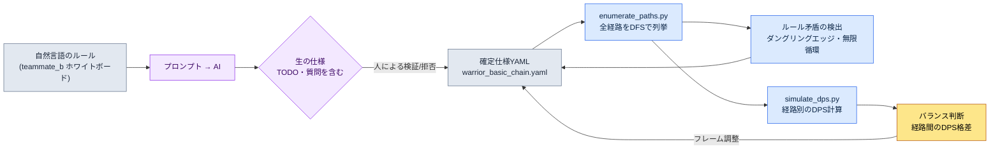

# 4.3 コンボ・キャンセル・入力キュー — 経路を列挙して検証する

バトルプランナーのチームメンバーBが、会議室のホワイトボードの前に立ってマーカーでボックスを描いていました。基本1、基本2、基本3、そして横へ抜ける強攻撃の分岐。矢印が7本ほどに増えたところで、誰かが尋ねました。「じゃあ、強攻撃の打ち上げの後に回避でキャンセルしたら、また基本1に戻れるんですか？」チームメンバーBはマーカーを止めました。ホワイトボード上のグラフには、その経路は描かれていませんでした。描けるのに描かなかったのか、ルール上不可能なのか、本人も即答できませんでした。

これがコンボ設計の本当の問題です。コンボは頭の中では「1-2-3とつながって強攻撃に分岐」のような単純な幹に見えます。ところがキャンセルと入力キューが絡むと、幹はグラフになります。ノード6個にキャンセルエッジを数本足しただけで、実際に踏める経路は数十通りに膨れ上がります。人間はその数十通りを頭の中ですべて展開できません。だから「この経路が強すぎる」というバランス事故は、ビルドに入った後になって初めて発見されるのです。

この章の目標は1つです。**コンボ経路を手で描かずに自動ですべて列挙し、各経路を検証するワークフロー**を作ること。自然言語で書いたルールを仕様に変換し、仕様から経路を列挙し、列挙した経路をシミュレーションにかけます。その過程でAIがどこまでやってくれて、どこで嘘をつくのか、生のままお見せします。

---

## 4.3.1 コンボは表ではなくグラフである

コンボを表に書くとこうなります。「基本1の次に基本2、基本2の次に基本3」。行と列で見た目はきれいです。ところがこの表は嘘をつきます。表は直線を前提にしているからです。実際の戦闘では、プレイヤーは基本2から強攻撃へ抜け、強攻撃を回避でキャンセルし、回避の直後にまた基本1を押します。この分岐と循環は、表の行の間に隠れてしまいます。

だからコンボの本当の形は**有向グラフ**です。アクションはノード、つながりはエッジ。各エッジには入力ウィンドウ（いつ入力を受け付けるか）と入力キーが付きます。ノードには持続フレームが、一部のノードにはボーナス条件（特定のノードを経由するとダメージ倍率が付く）が付きます。

戦士キャラクターの基本コンボ1セットをグラフに描くと、次のようになります。ノード6個、キャンセル分岐を含みます。

<svg viewBox="0 0 720 300" xmlns="http://www.w3.org/2000/svg" font-family="sans-serif" font-size="13">
  <defs>
    <marker id="arrow" markerWidth="10" markerHeight="10" refX="8" refY="3" orient="auto" markerUnits="strokeWidth">
      <path d="M0,0 L8,3 L0,6 Z" fill="#444"/>
    </marker>
  </defs>
  <!-- main chain -->
  <rect x="20" y="40" width="110" height="40" rx="6" fill="#e8f0fe" stroke="#3367d6"/>
  <text x="75" y="65" text-anchor="middle">基本1 (21f)</text>
  <rect x="200" y="40" width="110" height="40" rx="6" fill="#e8f0fe" stroke="#3367d6"/>
  <text x="255" y="65" text-anchor="middle">基本2 (24f)</text>
  <rect x="380" y="40" width="110" height="40" rx="6" fill="#e8f0fe" stroke="#3367d6"/>
  <text x="435" y="65" text-anchor="middle">基本3 (30f)</text>
  <rect x="560" y="40" width="140" height="40" rx="6" fill="#fce8e6" stroke="#c5221f"/>
  <text x="630" y="65" text-anchor="middle">フィニッシャー ×1.5</text>
  <!-- branch -->
  <rect x="200" y="150" width="110" height="40" rx="6" fill="#fef7e0" stroke="#e8a000"/>
  <text x="255" y="175" text-anchor="middle">強攻撃 (33f)</text>
  <rect x="380" y="150" width="110" height="40" rx="6" fill="#fef7e0" stroke="#e8a000"/>
  <text x="435" y="175" text-anchor="middle">打ち上げ (28f)</text>
  <rect x="200" y="240" width="110" height="40" rx="6" fill="#e6f4ea" stroke="#137333"/>
  <text x="255" y="265" text-anchor="middle">回避 (18f)</text>
  <!-- edges main -->
  <line x1="130" y1="60" x2="200" y2="60" stroke="#444" marker-end="url(#arrow)"/>
  <text x="165" y="52" text-anchor="middle" font-size="11">10~21f</text>
  <line x1="310" y1="60" x2="380" y2="60" stroke="#444" marker-end="url(#arrow)"/>
  <text x="345" y="52" text-anchor="middle" font-size="11">12~24f</text>
  <line x1="490" y1="60" x2="560" y2="60" stroke="#444" marker-end="url(#arrow)"/>
  <text x="525" y="52" text-anchor="middle" font-size="11">14~30f</text>
  <!-- branch edges -->
  <line x1="255" y1="80" x2="255" y2="150" stroke="#444" marker-end="url(#arrow)"/>
  <text x="300" y="118" text-anchor="middle" font-size="11">強攻撃 6~24f</text>
  <line x1="310" y1="170" x2="380" y2="170" stroke="#444" marker-end="url(#arrow)"/>
  <line x1="255" y1="190" x2="255" y2="240" stroke="#444" marker-end="url(#arrow)"/>
  <text x="300" y="218" text-anchor="middle" font-size="11">回避キャンセル</text>
  <!-- loop back -->
  <path d="M200,260 C90,260 75,140 75,80" fill="none" stroke="#137333" stroke-dasharray="5,4" marker-end="url(#arrow)"/>
  <text x="110" y="160" text-anchor="middle" font-size="11" fill="#137333">回避後 基本1 再進入</text>
</svg>

ホワイトボードと決定的に違う点が2つあります。第一に、各エッジに入力ウィンドウのフレーム範囲が明示されていることです。「強攻撃 6〜24f」は、基本2が始まってから6フレーム目から24フレーム目まで強攻撃の入力を受け付けるという意味です。第二に、点線で描いた回避→基本1の再進入エッジがあることです。チームメンバーBが会議室で即答できなかった、まさにあの経路です。グラフとして明示すれば、「ある/ない」がはっきりします。

このグラフを人が手で描くなら、ノード6個にエッジ7〜8本です。キャラクターが20人いて、キャラクターごとにコンボセットが3〜4個あれば、グラフは数百枚になります。手では追い切れません。だからグラフを**テキスト仕様**として書いておき、図と検証はそこから自動生成するのです。

---

## 4.3.2 仕様は人が読み、機械がパースする

上のグラフをYAML仕様に書き写します。核心はノード（`nodes`）、エッジ（`edges`）、ボーナス（`bonuses`）の3ブロックです。キャンセルルールもエッジの一種と見なします — 動作を断ち切って別のノードへ移るのも、結局はエッジだからです。

```yaml
# warrior_basic_chain.yaml
character: warrior
combo_id: basic_chain

nodes:
  - { id: basic_1,  name: 基本1,   duration_frames: 21 }
  - { id: basic_2,  name: 基本2,   duration_frames: 24 }
  - { id: basic_3,  name: 基本3,   duration_frames: 30 }
  - { id: heavy,    name: 強攻撃,  duration_frames: 33 }
  - { id: launch,   name: 打ち上げ,  duration_frames: 28 }
  - { id: dodge,    name: 回避,    duration_frames: 18, cancels_recovery: true }

edges:
  - { from: basic_1, to: basic_2, input: light, window: [10, 21] }
  - { from: basic_2, to: basic_3, input: light, window: [12, 24] }
  - { from: basic_2, to: heavy,   input: heavy, window: [6, 24] }
  - { from: heavy,   to: launch,  input: heavy, window: [10, 33] }
  - { from: heavy,   to: dodge,   input: dodge, window: [0, 33], type: cancel }
  - { from: basic_3, to: dodge,   input: dodge, window: [0, 30], type: cancel }
  - { from: dodge,   to: basic_1, input: light, window: [8, 18] }   # 再進入

bonuses:
  - { on: basic_3, requires_path: [basic_1, basic_2], damage_multiplier: 1.5 }
```

この仕様は2種類の読者を同時に満足させます。人は`window: [6, 24]`を読んで「強攻撃は基本2の中盤から受け付けるのか」と理解し、機械は同じ行をパースしてグラフの描画と経路の列挙に使います。1つのソースから、人の理解と機械の検証が同時に得られるのです。

上のフレーム数値（`21`、`24`、`[6, 24]`）は実測値ではなく、この章の説明のために著者が構成した例示値（未検証）です。実際のプロジェクトでは、これらの値はアニメーターが作ったモンタージュの長さと、ビルドのノーティファイのタイミングから得られます。仕様を最初に書く時点ではプランナーの意図値を入れ、ビルドが出た後にキャプチャして実測値に補正します — この補正ループは4.4で扱います。

---

## 4.3.3 ワークド・トランスクリプト — 自然言語から仕様まで

チームメンバーBがホワイトボードに描いたルールを自然言語で渡し、仕様YAMLに変換させます。要約はせず、プロンプト全文とClaudeの生の出力、人による検証/拒否をそのまま掲載します。

### プロンプト（全文）

```
次は戦士キャラクターのコンボルールだ。これをコンボ仕様YAMLに変換しろ。

ルール:
- 基本攻撃は1、2、3段とつながる。軽攻撃キー。
- 基本2の途中で強攻撃キーを押すと強攻撃へ抜けられる。
- 強攻撃の次に強攻撃をもう一度押すと敵を打ち上げる(打ち上げ)。
- 強攻撃はいつでも回避でキャンセル可能。
- 基本3も回避でキャンセル可能。
- 回避の直後には軽攻撃で基本1を再び始められる。
- 基本3は基本1と基本2を両方経由したときだけダメージが1.5倍。

仕様形式:
- nodes(id, name, duration_frames), edges(from, to, input, window, type),
  bonuses(on, requires_path, damage_multiplier)
- キャンセルエッジはtype: cancelで表示。
- フレーム値は、私が与えていないものはお前が決めずTODOのまま空けておけ。
```

最後の行が核心です。フレームを与えていないなら、でっち上げるなと明示しています。v3標準の3番（数値の正直さ）をプロンプトのレベルで強制しているのです。

### Claudeの生の出力（編集なし）

````
仕様に変換しました。フレーム値は提供されていないためTODOのまま残しました。

```yaml
character: warrior
combo_id: basic_chain
nodes:
  - { id: basic_1, name: 基本1, duration_frames: TODO }
  - { id: basic_2, name: 基本2, duration_frames: TODO }
  - { id: basic_3, name: 基本3, duration_frames: TODO }
  - { id: heavy,   name: 強攻撃, duration_frames: TODO }
  - { id: launch,  name: 打ち上げ, duration_frames: TODO }
  - { id: dodge,   name: 回避,   duration_frames: TODO }
edges:
  - { from: basic_1, to: basic_2, input: light, window: TODO }
  - { from: basic_2, to: basic_3, input: light, window: TODO }
  - { from: basic_2, to: heavy,   input: heavy, window: TODO }
  - { from: heavy,   to: launch,  input: heavy, window: TODO }
  - { from: heavy,   to: dodge,   input: dodge, window: TODO, type: cancel }
  - { from: basic_3, to: dodge,   input: dodge, window: TODO, type: cancel }
  - { from: dodge,   to: basic_1, input: light, window: TODO }
bonuses:
  - { on: basic_3, requires_path: [basic_1, basic_2], damage_multiplier: 1.5 }
```

確認が必要な部分:
1. 「回避直後の基本1再開」をdodge -> basic_1エッジとして入れましたが、これが
   回避の硬直中に入力を受け付けるのか、回避が完全に終わった後なのか不明確です。
2. 打ち上げ(launch)の次に続く空中コンボがあるかどうかルールにありません。
   打ち上げがコンボの終端かどうか確認が必要です。
3. 回避をノードとして置くか、エッジ(キャンセル動作)としてだけ置くか曖昧です。ひとまず
   ノードとして置きました — 回避自体が持続時間を持つアクションだと見なしました。
````

ここで評価してみましょう。まず良い点です。フレームをでっち上げず、すべてTODOのまま空けました。プロンプトの制約を守っています。そして最後に付けた3つの質問は、どれも本当に曖昧な箇所を突いています — とくに1番（再進入の入力タイミング）は、チームメンバーBが会議室で即答できなかった、まさにあの穴です。AIが人より先に穴を見つけたのです。

一方、曖昧な点もあります。3番で回避をノードにしたのは判断が分かれるところです。回避は「キャンセル動作」であると同時に「持続時間を持つアクション」でもあるので、どちらの扱いも正しいのです。AIが片方を選んだうえで「曖昧だ」と報告したのは正直ですが、これは設計上の決定なので、人が決めてあげる必要があります。

### 人による検証/拒否

3つの質問に答え、一部を拒否します。

- **1番（再進入タイミング）：** 回避の硬直（後隙）中（8〜18f）に入力を受け付けます。回避を最後まで見せた後ではなく、硬直キャンセルで基本1に再進入します。→ 採用、`window: [8, 18]`。
- **2番（打ち上げ以降）：** この章の範囲では、打ち上げをコンボの終端とします。空中コンボは別セットに分離します。→ AIの判断を採用。
- **3番（回避=ノード）：** ノードとして扱います。ただし`cancels_recovery: true`属性を追加して、「硬直を断ち切る動作」であることを明示します。→ 部分採用+属性追加。

そして1つを**拒否**します。AIは`dodge → basic_1`エッジに`type: cancel`を付けませんでしたが、これは回避の硬直を断ち切って進入するものなので、性質としてはキャンセルに当たります。しかしここでは「回避後の通常進入」と見なして、一般エッジのままにします — 硬直キャンセルと通常接続の区別は、このキャラクターではゲームの手触り上の差がないからです。人がドメイン判断でAIの分類を上書きした事例です。

### 再リクエスト

```
良い。次を反映して最終仕様を出し直せ:
- dodgeにcancels_recovery: trueを追加。
- dodge -> basic_1エッジのwindowは[8, 18]。
- 残りのフレームは依然として私が与えていないのでTODO維持。ただし上のグラフ例示値
  (basic_1=21, basic_2=24, basic_3=30, heavy=33, launch=28, dodge=18)を
  使うから、その値で埋めろ。これは未検証の例示値だとコメントで明記しろ。
```

この再リクエストで得られた結果が、4.3.2のYAMLです。一度では完成しませんでした。プロンプト → 生の出力 → 検証/拒否 → 再リクエスト。このサイクルが仕様の信頼度を作ります。AIが曖昧な箇所に印を付け、人がドメイン知識で決定する — どちらか一方だけでは成り立ちません。

---

## 4.3.4 経路を自動で列挙する

仕様がグラフなのですから、コンボ経路の列挙は**グラフ探索**の問題になります。開始ノードから出発して、終端ノード（またはフィニッシャー）まで到達するすべての経路を探す深さ優先探索（DFS）です。人はこれを頭の中ではできませんが、コードは一瞬でやってのけます。

著者のチームの隔離作業スペース`95_BattleTF`の中には、この列挙を担当する小さなスクリプトがあります。仕様YAMLを読み込んですべての経路を抽出し、各経路がルール上可能か（エッジが存在するか）を検証します。核心のロジックだけを示すと、次のとおりです。

```python
# 95_BattleTF/enumerate_paths.py (抜粋)
import yaml

def load_graph(path):
    spec = yaml.safe_load(open(path, encoding="utf-8"))
    adj = {}
    for e in spec["edges"]:
        adj.setdefault(e["from"], []).append(e)
    return spec, adj

def enumerate_paths(adj, start, max_depth=8):
    results = []
    def dfs(node, path, edges):
        # 終端ノード(出るエッジなし)か深さの上限なら経路を確定
        outs = adj.get(node, [])
        if not outs or len(path) >= max_depth:
            results.append((list(path), list(edges)))
            return
        for e in outs:
            if e["to"] in path:        # 循環防止: 1経路に同じノードは1回
                results.append((list(path), list(edges)))
                continue
            dfs(e["to"], path + [e["to"]], edges + [e])
    dfs(start, [start], [])
    return results
```

`basic_1`から始めて回すと、手では到底展開しきれない経路があふれ出てきます。一部だけ見ると、次のとおりです。

| # | 経路 | 備考 |
|---|---|---|
| 1 | 基本1 → 基本2 → 基本3 | 正規の3段、フィニッシャーボーナス充足 |
| 2 | 基本1 → 基本2 → 強攻撃 → 打ち上げ | 分岐コンボ |
| 3 | 基本1 → 基本2 → 強攻撃 → 回避 → 基本1 → … | 循環への進入 |
| 4 | 基本1 → 基本2 → 基本3 → 回避 → 基本1 → … | フィニッシャー後のリセット |

3番と4番が重要です。回避の再進入エッジのせいで、コンボが**循環**します。人がホワイトボードで見落としていたのが、まさにこうした循環経路です。DFSに循環防止（同じノードは1経路につき1回）のガードを入れないと、列挙が無限ループに陥ります — これはコードを最初に回したとき、実際に一度止まってしまって気づいた罠です。グラフに循環があるなら、列挙器には必ずガードが必要です。

列挙段階の成果物は2つです。第一に、ルール上可能なすべての経路のリスト。第二に、**ルール矛盾の検出**です — 仕様に`dodge → basic_1`エッジがあるのに、肝心の`dodge`ノードの定義が抜けていれば、列挙器が「未定義のノードを指すエッジ」として捕まえます。仕様を手で書くときに最もよくあるミスが、このダングリング参照です。

---

## 4.3.5 列挙した経路をシミュレーションにかける

経路のリストだけでは、「どの経路が強すぎるのか」は分かりません。各経路をDPSシミュレーターに入れる必要があります。著者のチームの`simulate_dps`がこの役割を担います — 経路（ノードのシーケンス）と各ノードのダメージ・フレーム、ボーナスルールを受け取り、総ダメージと総所要フレームを計算して、秒間ダメージ（DPS）を出します。

```python
# 95_BattleTF/simulate_dps.py (抜粋、60fps想定)
def simulate(path_nodes, node_dmg, node_frames, bonuses):
    total_dmg = 0
    total_frames = 0
    visited = []
    for nid in path_nodes:
        dmg = node_dmg.get(nid, 0)
        # ボーナス: requires_pathを全て経由したら倍率を適用
        for b in bonuses:
            if b["on"] == nid and all(r in visited for r in b["requires_path"]):
                dmg *= b["damage_multiplier"]
        total_dmg += dmg
        total_frames += node_frames[nid]
        visited.append(nid)
    seconds = total_frames / 60.0
    return {"dmg": total_dmg, "frames": total_frames,
            "dps": round(total_dmg / seconds, 1) if seconds else 0}
```

4.3.4の列挙結果をここへ丸ごと流し込むと、各経路のDPSが表になって出てきます。以下は、ノードのダメージに例示値（基本打撃100、強攻撃180、打ち上げ140 — いずれも未検証の架空値）を入れて回した結果です。

| 経路 | 総ダメージ | 総フレーム | DPS |
|---|---|---|---|
| 基本1→基本2→基本3（フィニッシャー×1.5） | 100+100+150 = 350 | 75 | 280.0 |
| 基本1→基本2→強攻撃→打ち上げ | 100+100+180+140 = 520 | 106 | 294.3 |
| 基本1→基本2→基本3→回避→基本1 | 350+0+100 = 450 | 144 | 187.5 |

この表が議論を変えます。「強攻撃の分岐のほうが正規の3段より強く見えないか？」という直感が、「強攻撃経路のDPSは294、正規の3段は280で、5%の優位」という数字に変わります。5%の優位が意図したものなら通過、そうでなければ強攻撃のフレームを伸ばしてDPSを下げます。ビルドが出る**前に**、仕様の段階でこの判断を行うのです。

ワークフロー全体を1枚で見ると、こうなります。



仕様（D）が中心にあり、列挙（E）・検証（F）・シミュレーション（G）がそこから枝分かれします。矛盾が見つかったり、バランスがずれていたりすれば、仕様に戻って直します。ホワイトボードにはこのループがありませんでした — だからホワイトボードのコンボは、ビルドに入った後になって初めて間違いに気づいたのです。

---

## 4.3.6 キャンセルと入力キュー — 経路を増やすつまみと狭めるつまみ

ここまで、コンボグラフと経路の列挙を見てきました。キャンセルと入力キューは、このグラフを調整する2つのつまみです。向きは正反対です。

**キャンセルはエッジを増やします。**キャンセルルールを1つ追加するたびにグラフにエッジが増え、列挙される経路の数は掛け算で膨らみます。だからキャンセルは「寛容なほど良い」わけではありません。キャンセルを緩めるほど経路が爆発的に増え、その中に意図しない強い経路（前節の循環経路のような）が紛れ込む確率が上がります。格闘ゲームの伝統がキャンセルを厳格に保つ理由、アクションRPGが寛容にする理由がここにあります — ジャンルが「許容する経路数」を決めるのです。絶対的な正解のウィンドウ値はありません。

キャンセルを扱うときは、必ず分離して明示します。ひとまとめの「何でもキャンセル」にすると、列挙器がすべてのノード間にキャンセルエッジを作り、経路が制御不能に膨らみます。

| キャンセル類型 | 仕様での表現 | 経路への効果 |
|---|---|---|
| アクションキャンセル | 特定ノード → 特定ノード、type: cancel | 選択的な分岐だけ追加 |
| 回避キャンセル | 多数ノード → dodge、window: [0, dur] | ほぼすべてのノードからの脱出口 |
| ガードキャンセル | 多数ノード → guard | 防御への移行、通常は硬直中に限定 |
| キャンセル不可 | 出ていくcancelエッジなし | 発動したら最後まで（スーパーアーマー） |

**入力キューは経路を狭めるのではなく、実際に踏めるようにします。**キューがなければ、プレイヤーは各エッジの入力ウィンドウ（たとえば`[12, 24]`）をフレーム単位で正確に合わせなければなりません。人間の反応速度ではほぼ不可能です。キューはウィンドウが開く前に押された入力をバッファーに保存しておき、ウィンドウが開いた瞬間に自動で発動させます — いわゆる先行入力の仕組みです。つまりキューはグラフの経路を変えるのではなく、グラフの上を人が歩けるように靴を履かせてくれるのです。

```yaml
input_queue:
  window_start_ratio: 0.5   # アクション進行率50%から次の入力をバッファリング
  expire_frames: 10         # バッファされた入力の有効期間
  priority: latest          # 同時多重入力時は最後を優先
```

3つのパラメーターのバランスが核心です。`window_start_ratio`が小さすぎると、アクション序盤の入力までバッファリングされて、意図しない次の動作が飛び出します。`expire_frames`が短すぎるとキューの意味がなくなって再び正確さを要求することになり、長すぎるとずっと前に押した入力が遅れて発動し、「なぜ急に動いたんだ」という事故が起きます。推奨の出発値は`expire_frames`が5〜15、`window_start_ratio`が0.5前後ですが — これはジャンルとキャラクターの重量感に応じて調整する出発点であって、正解ではありません。

運用上の注意を1つ。入力キューのパラメーターをキャラクターごとに全部変えてはいけません。グローバルな既定値を1つ置き、重量感が特別に異なるキャラクター（巨大ボス型など）だけoverrideします。キャラクター20人のキュー値を別々に管理すると、どれが意図した差でどれがミスなのか、区別がつかなくなります。

最後にもう1つ押さえておくことがあります。ここまでエッジを「ある/ない」だけで扱ってきましたが、エッジがあるとしても、**そのノードから次のノードへ実際にどう移るか**はまた別の決定です。コンボ間の接続方式には核心の分岐が3つあり、本書の深さの範囲外なのでコードでは扱いませんが、触れずにおくと仕様が半分しか描けていないことになります。

- **キャンセルノーティファイ（cancel notify）：** どの時点から現在のアニメーションを断ち切って、次の入力を受け付けるか。上のエッジのウィンドウ（`window: [10, 21]`）が、まさにこのノーティファイの表現です。ノーティファイを前倒しするとコンボは速くなり（打撃が終わる前に次へ）、遅らせると一撃一撃が重くなります。つまりウィンドウの開始値は単なる数字ではなく、「この打撃を最後まで見せるのか、次へ素早くつなぐのか」という感覚の決定なのです。
- **アニメーションブレンディング（anim blending）：** 2つのノードの間を滑らかに混ぜてつなぎます。強攻撃の終わりの姿勢から打ち上げの開始姿勢へ、数フレームかけて補間します。接続は滑らかで自然ですが、ブレンディング区間には攻撃判定の空白が生まれやすく、「断ち切れるキレ」が消えます。
- **フレームスキップ（frame skip）：** ブレンディングなしで現在のアニメーションの残りフレームを飛ばし、次のノードを即座に始めます。接続は小気味よく反応も速いですが、姿勢がカクカクと途切れて見えることがあります。格闘・アクションゲームの「キャンセルの感触」は、おおむねこちらです。

この3つは、同じエッジを巡ってもゲームの手触りを正反対にします。仕様の段階ではエッジの存在とウィンドウだけを決め、接続方式（ブレンディングかフレームスキップか）はビルドの段階でアニメーターと一緒に決めるのが普通です。ただし仕様に`transition: blend` / `transition: skip`のようなフィールドを1行だけ先に空けておけば、ビルド段階で「このエッジはどう移ると決めたんだっけ」と聞き直さずに済みます。接続方式は、コンボグラフの隠れた第3の軸です。

---

## 4.3.7 ビルド検証は別の仕事である（4.4の予告）

ここまでのすべての検証は、**仕様の上で**行われました。経路の列挙もDPSシミュレーションも矛盾の検出も、すべてYAMLを対象にしていました。ところが仕様のフレーム値はプランナーの意図値であって、ビルドの実測値ではありません。アニメーターが作ったモンタージュの実際の長さ、ビルドのノーティファイが実際に発火するフレーム、入力キューがエンジン上で実際に機能するウィンドウ — これらはビルドをキャプチャして測定しなければなりません。

ビルド映像から5つの信号（打撃の発生フレーム、硬直（後隙）、キャンセルウィンドウ、入力キュー、ヒットストップ）を自動抽出するのは実装難度が高く、現実的に最も信頼できるのはゲーム内テレメトリーです — ビルドの中に「このアクションがこのフレームでこの入力を受け付けた」というログを出させ、そのログを仕様と突き合わせます（キャプチャ方法の比較は4.4参照）。この突き合わせのループが4.4のテーマです。仕様上`[12, 24]`だったウィンドウがビルドで`[14, 26]`と測定されたら、仕様をビルドの実測値で補正するのです。

---

## 4.3.8 よくあるミスと回避策

| ミス | なぜ危険か | 回避策 |
|---|---|---|
| コンボを直線の表で書く | 分岐・循環が行の間に隠れて漏れる | グラフ（ノード+エッジ）で仕様化し、手で描かない |
| キャンセルを「何でも」にひとまとめ | 列挙経路が爆発し、強い経路が紛れ込む | アクション・回避・ガードのキャンセルを分離して明示 |
| 列挙器に循環ガードがない | 回避の再進入で無限ループ | 1経路につきノード1回のガード |
| 仕様のフレームを実測値と勘違い | 意図値とビルド値は異なる | 意図値と明示し、ビルドキャプチャで補正（4.4） |
| 入力キューをキャラクターごとに別々に | 意図した差/ミスの区別が不能 | グローバル既定値+一部のみoverride |
| AIが埋めたフレームをそのまま信じる | でっち上げた数値が仕様に入る | 「与えていない値はTODO」とプロンプトで強制 |

---

### 本章のポイント
- コンボは直線ではなくグラフなので、経路は人ではなくコードで列挙します。
- キャンセルは経路を増やすつまみ、入力キューは経路を歩けるようにする靴です。
- 同じエッジでも、接続方式（キャンセルノーティファイ・アニメーションブレンディング・フレームスキップ）が手触りを正反対にします。
- 仕様の上の検証とビルドの上の検証は別の仕事であり、後者はテレメトリーが現実的です。

---

## やってみよう — コンボ経路列挙のミニパイプライン

手を動かしてそのまま回せる、最小限の手順です。Pythonと`pyyaml`さえあれば大丈夫です。

**setup.** 作業フォルダーを1つ作り、その中に仕様ファイルとスクリプト2つを置いてください。

```
combo-mini/
  warrior_basic_chain.yaml   # 4.3.2の仕様
  enumerate_paths.py         # 4.3.4のDFS列挙器
  simulate_dps.py            # 4.3.5のシミュレーター
```

`pip install pyyaml`の後、仕様ファイルには4.3.2のYAMLをそのまま貼り付けてください。

**prompt.** 自然言語のルールを仕様に変換する段階は、AIに任せましょう。4.3.3のプロンプトをそのまま使い、最後の制約を必ず含めてください。

```
フレーム値は、私が与えていないものはお前が決めずTODOのまま空けておけ。
キャンセルエッジはtype: cancelで表示し、曖昧な部分は質問として別に出せ。
```

この2行が、AIによる数値の捏造と恣意的な判断を防ぎます。出てきた仕様のTODOと質問リストは、人が埋めます。

**verify.** 仕様が完成したら、2回検証してみましょう。

```bash
python enumerate_paths.py warrior_basic_chain.yaml   # 全経路 + 矛盾の出力
python simulate_dps.py    warrior_basic_chain.yaml   # 経路別のDPS表
```

列挙の出力では、（1）循環経路が無限に増えていないか、（2）未定義のノードを指すダングリングエッジがないかを確認してください。DPSの出力では、経路間の格差が意図した範囲内かを見てください。格差が大きければ、仕様のフレーム/ダメージを直してもう一度回してください。

### 一人ミニ版

ツールを別に作る時間がなければ、仕様の作成と経路の列挙を1回のAI対話で済ませましょう。自然言語のルールを渡し、「コンボ仕様YAMLに変換した後、開始ノードから可能なすべての経路を深さ優先で全部列挙し、循環は1回だけ回って打ち切ること。未定義のノードを指すエッジがあれば指摘すること」と、1つのプロンプトに詰め込んでください。AIが仕様化・列挙・矛盾検出を一度にやってくれます。DPSシミュレーションは、ノードのダメージを表で一緒に渡し、「各経路の総ダメージとフレームを計算して表にしてほしい」という後続リクエストで受け取ってください。精度は落ちますが、ホワイトボードよりはずっと遠くまで見通せます。核心は変わりません — コンボは頭の中で展開せず、列挙させて見るのです。
