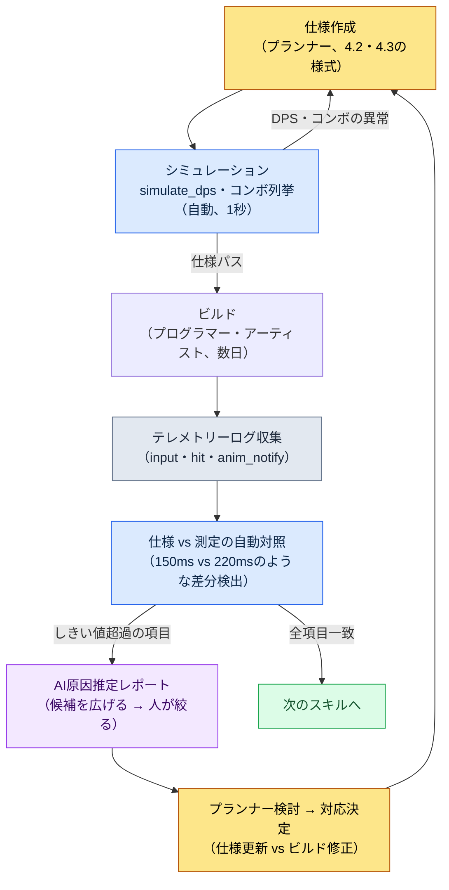

# 4.4 AI支援による戦闘シミュレーション・検証

戦闘TF（タスクフォース）のビルド#234が上がってきたばかりです。新スキル`skill_thunder`に初めて触れるビルドです。仕様書にはヒットタイミング150msと書いてあります。入力を入れます。指先の感覚が言います。遅い。間違いなく遅い。隣の席のチームメンバーAを呼びます。「これ、ちょっと浮いて見えませんか？」チームメンバーAが二、三回打ってみます。「うーん……そんな気もしますね。」二人とも確信が持てません。仕様は150だと言うのに、指は200くらいだと言い張ります。どちらが正しいのか。指先と紙の戦いです。次のビルドでもまた誰かが「体感では大丈夫そうですけど」と言い、その一言でビルドが一つ、また流れていきます。

この章の目標は、その戦いを終わらせることです。指先が200だと言うなら、本当に200なのかを数字で見せること。そしてビルドが上がってくる*前に*、仕様だけを見て「このスキルはDPSが目標より30%高い」を先に知ること。200人が関わるAAA MMORPGの戦闘を初期から固めていた時代も、感覚と数字がずれたときの途方もなさは同じでした。変わったのは、いまはそのずれを数字で決着させる道具が手元にあるということだけです。

4.2・4.3が戦闘の仕様をどう*書くか*を扱ったとすれば、4.4はその仕様が意図どおりに*動くか*を扱います。検証には二つの軸があります。一つはビルドなしで計算だけで検証するシミュレーション、もう一つは実際のビルドから測定値を取り出すキャプチャー分析です。二つの軸が一つのサイクルに束ねられると、戦闘企画の検証の往復が日単位から時間単位へ縮みます。

結論を先に明かすと、この章の核心は、*仕様に書かれた数字（150ms）とビルドで測定した数字（220ms）を並べて、その差を読むこと*です（4.4.5）。前半の節（シミュレーター・コンボ列挙）は、その対照を可能にするための準備段階として読んでください。

---

## 4.4.1 ビルドを待つコスト

戦闘プランナーが新スキル一つを検証しようとすると、何が起きるでしょうか。

プランナーが仕様を書きます。プログラマーがデータを入れ、アーティストがモーション・エフェクトを付け、ビルドが回り、QAが一巡し、そこでようやくプランナーが手で触って確かめます。早くて2日、普通は3〜4日。サイクルの*最後で*「DPSが高すぎる」が見つかると、その発見は最初へ戻れという命令になります。3〜4日がもう一回。

シミュレーションは、このサイクルの*最初の段階*で答えをくれる道具です。仕様だけで計算してみます。答えが悪ければ仕様を直して再計算。ビルドという高価な段階に入る前に、仕様そのものが一度ふるいにかけられます。模型の車をまず風洞に入れてみるのと同じです。本物の車を道路に出す前に、疑わしい設計は机の上で脱落します。

もちろん、風洞が道路を100%予測するわけではありません。だから二つ目の軸であるキャプチャー分析が必要です。シミュレーションが*理想的な答え*だとすれば、キャプチャーは*実際にビルドで起きた答え*です。二つを並べて差を読むこと — それがこの章のすべてです。

---

## 4.4.2 simulate_dps — 実行可能なシミュレーター

抽象的な擬似コードでは何も検証されません。だから最初から*動く*コードを作ります。以下は、著者が戦闘TFで使っている`simulate_dps.py`の核心の骨格を、会社のデータを取り除いて本書に載せるために再構成したものです。依存関係なし、Python標準ライブラリだけで動きます（ファイル全体は「やってみよう」を参照してください）。

入力は単純です。スキル一つは`damage`・`cast_sec`（詠唱占有時間）・`cooldown_sec`・`resource_cost`を、キャラクターはリソース総量・秒間回復量・スキルリスト・優先順位ローテーションを持つdataclassです。その上で回る本体は、「その時点で使えるスキルのうち優先順位が最も高いものを使う」という単純な貪欲法（greedy）のルールだけです。実際のプレイヤーより賢くも愚かでもない、*理想的上限*を取るのが目的です。背骨になる部分だけを抜粋するとこうなります。

```python
# 0.05秒ティックでタイムラインを作る。詠唱中でなければ優先順位順に最初の使用可能スキルを使う。
while t < duration_sec:
    resource = min(char.max_resource, resource + char.resource_regen * tick)
    for name in cooldowns:
        cooldowns[name] = max(0.0, cooldowns[name] - tick)
    if t >= busy_until:                     # 詠唱モーションが終わっていなければ待機
        for name in char.rotation:          # 優先順位順
            s = skill_by_name[name]
            if cooldowns[name] <= 0 and resource >= s.resource_cost:
                total_damage += s.damage
                resource -= s.resource_cost
                cooldowns[name] = s.cooldown_sec
                busy_until = t + s.cast_sec  # この時刻まで次のスキル不可
                break
    t += tick
# …(dataclass定義・warrior入力・出力ループは「やってみよう」の全体コード参照)
```

warriorに`skill_thunder`（ダメージ420・詠唱0.9s・クールタイム（クールダウン）6s）を第1優先に、`skill_dash`・`basic_1`を後ろに置いて20秒回した結果です（`python simulate_dps.py`）。

```
平均DPS: 261.0
  t=  0.0s  skill_thunder  リソース=60
  t=  0.9s  skill_dash     リソース=47
  t=  1.3s  basic_1        リソース=50
  t=  1.6s  basic_1        リソース=53
  t=  1.9s  basic_1        リソース=55
  ...
```

この値に何の意味があるのか。*ビルドなしで*、1秒以内に、warriorの理想的なDPS上限が約261だという事実が分かる、ということです。目標DPSが180だったなら、この仕様は+45%で過剰です。ビルドを待つ必要はなく、いま`damage`や`cooldown_sec`をいじればいいのです。

限界も正直に書いておきます。このシミュレーターは、プレイヤーの入力ミス、移動・回避による空白、敵の妨害を反映しません。そのため測定値は常に実際のビルドより高く出ます。これはバグではなく、*上限*というシミュレーターの定義そのものです。実測との差は、4.4.5でキャプチャーによって埋めます。

> **AI活用ノート。** 上の骨格は著者が組んだものですが、新しいリソースモデル（例：怒りゲージがダメージを受けると溜まる構造）を付けるときは、Claudeに「このsimulate_dpsに被弾時怒り+5のルールを追加して。tickループの中で、既存のリソース回復とは別の変数で」のように、*既存コードを引用しながら*依頼します。白紙からシミュレーターを丸ごと生成させると、検証不可能なコードが出てきます。背骨は人が握り、AIには枝を伸ばさせます。

---

## 4.4.3 コンボ経路の自動列挙

DPSという数字一つでは足りません。「どのコンボが意図されたメインコンボなのか」を検証するには、*可能なすべての経路*を広げて見る必要があります。手でツリーを描くと、ノード7〜8個ですでに頭がパンクします。経路を漏れなく広げるのは、機械の方が人より圧倒的に得意です — ただし、人が結果をたどり直せる形で出力させる必要があります。

次は、コンボグラフを受け取ってすべての経路を列挙し、DPSでソートするコードです。`combo_graph`は「どのアクションの次にどのアクションへキャンセルできるか」を隣接リストで書いたもので、4.3のステートマシン仕様からそのまま抽出されます。核心は、行き止まりまで再帰で展開する`all_paths`ジェネレーターです。

```python
# enumerate_combos.py — コンボグラフのすべての経路を展開しDPSでソート
combo_graph = {"start": ["A"], "A": ["B", "D"], "B": ["C", "E"], "D": ["C"], "C": [], "E": []}
action_stats = {  # (ダメージ, 所要時間 秒)
    "A": (300, 0.8), "B": (450, 1.0), "C": (450, 1.2), "D": (600, 1.4), "E": (200, 0.6),
}

def all_paths(node="start", path=None):
    path = (path or [])
    nexts = combo_graph.get(node, [])
    if not nexts:                       # 行き止まり = 完成したコンボ
        yield [n for n in path if n in action_stats]
        return
    for nxt in nexts:
        yield from all_paths(nxt, path + [nxt])

results = []
for p in all_paths():
    dmg = sum(action_stats[a][0] for a in p)
    dur = sum(action_stats[a][1] for a in p)
    results.append((p, dmg, round(dur, 1), round(dmg / dur, 1)))

for p, dmg, dur, dps in sorted(results, key=lambda r: -r[3]):
    print(f"{' → '.join(p):<18} {dmg:>5} dmg  {dur:>4}s  DPS {dps}")
```

実行結果です。

```
A → D → C            1350    3.4s  DPS 397.1
A → B → C            1200    3.0s  DPS 400.0
A → B → E             950    2.4s  DPS 395.8
```

ここでプランナーが読み取るべきシグナルは、単純な1位ではありません。三つの経路のDPSが396〜400でほぼ張り付いていること — これは「どのコンボを使っても効率が似ていて、*メインコンボのアイデンティティがない*」というシグナルです。意図が「A→D→Cがハイリスク・ハイリターンのメインであるべき」だったなら、Dのダメージを上げるか所要時間を縮めて、DPSを一段浮かせる必要があります。仕様に戻る番です。

この自動列挙が手計算を置き換える場面では、コンボノードが20個に増えても、人はソート済みの表を読むだけで済みます。

---

## 4.4.4 ビルドキャプチャー分析 — 現実的な方法はテレメトリー

いよいよ二つ目の軸です。ビルドの中で実際に何が起きたかを測定する段階です。よく「ビルド映像をAIが見て自動分析」を思い浮かべますが、ここでは正直に分岐を分けます。測定値を得る道は三つあり、三つのコスト・正確度は大きく異なります。

<svg viewBox="0 0 720 250" xmlns="http://www.w3.org/2000/svg" font-family="sans-serif" font-size="13">
  <rect x="10" y="20" width="220" height="200" rx="8" fill="#fde8e8" stroke="#c0392b" stroke-width="1.5"/>
  <text x="120" y="45" text-anchor="middle" font-weight="bold" fill="#c0392b">A. 映像の直接分析</text>
  <text x="120" y="72" text-anchor="middle">画面ピクセルから</text>
  <text x="120" y="92" text-anchor="middle">入力・モーション・VFX抽出</text>
  <text x="120" y="124" text-anchor="middle" font-weight="bold">正確度: 低〜中</text>
  <text x="120" y="148" text-anchor="middle">実装難易度: 非常に高い</text>
  <text x="120" y="172" text-anchor="middle">フレーム誤差 ±1〜2</text>
  <text x="120" y="200" text-anchor="middle" fill="#777">研究・デモ用</text>

  <rect x="250" y="20" width="220" height="200" rx="8" fill="#fef5e7" stroke="#d68910" stroke-width="1.5"/>
  <text x="360" y="45" text-anchor="middle" font-weight="bold" fill="#d68910">B. 既製ビジョンAPI</text>
  <text x="360" y="72" text-anchor="middle">外部visionサービスへ</text>
  <text x="360" y="92" text-anchor="middle">キャプチャーフレーム送信</text>
  <text x="360" y="124" text-anchor="middle" font-weight="bold">正確度: 中</text>
  <text x="360" y="148" text-anchor="middle">実装難易度: 中</text>
  <text x="360" y="172" text-anchor="middle">IP流出リスク</text>
  <text x="360" y="200" text-anchor="middle" fill="#777">社内ポリシーの確認が必要</text>

  <rect x="490" y="20" width="220" height="200" rx="8" fill="#e8f6ef" stroke="#1e8449" stroke-width="1.5"/>
  <text x="600" y="45" text-anchor="middle" font-weight="bold" fill="#1e8449">C. ゲーム内telemetry</text>
  <text x="600" y="72" text-anchor="middle">エンジンがイベントを</text>
  <text x="600" y="92" text-anchor="middle">タイムスタンプと共にログ</text>
  <text x="600" y="124" text-anchor="middle" font-weight="bold">正確度: 高</text>
  <text x="600" y="148" text-anchor="middle">実装難易度: 低〜中</text>
  <text x="600" y="172" text-anchor="middle">エンジン時刻を直接使用</text>
  <text x="600" y="200" text-anchor="middle" fill="#1e8449" font-weight="bold">現実的な選択</text>
</svg>

A案（映像のピクセル分析）は魅力的に聞こえます。入力表示、キャラクターのモーション変化、エフェクトの最初のフレーム、サウンド波形、ダメージ数字UI — 五つのシグナルを画面から自動抽出するという絵です。しかし実際に作ってみると、フレーム圧縮ノイズ、UIの遮り、モーションブラーのせいで±1〜2フレームの誤差が基本として乗ります。60fpsでは1フレームが約16.7msです。ヒットタイミングをms単位で問う検証で、±33msのノイズは致命的です。*実装難易度は非常に高く、正確度はその努力に見合いません。*

だから現実の答えはC案、**ゲーム内テレメトリー（telemetry）ログ**です。エンジンは、入力の時刻、アニメーション通知（ノーティファイ）の発生時刻、VFXスポーンの時刻、ダメージ適用の時刻を、すでに*内部で正確に知っています*。その時刻をピクセルから推論するのではなく、1行のログとして記録させればいいのです。ピクセルから100msを*復元*する代わりに、エンジンが知っている100msを*そのまま書き取ります*。

```cpp
// 戦闘アクション処理コードに1行追加 (UE C++ 疑似例)
// 入力受信 / ダメージ適用の時点で同じロガーを呼び出す
CombatTelemetry::Log("input",  SkillName, GetWorld()->GetTimeSeconds());
CombatTelemetry::Log("hit",    SkillName, GetWorld()->GetTimeSeconds());
```

ロガーは1行ずつJSON Linesで吐き出します。

```
{"event":"input","skill":"skill_thunder","t":12.340}
{"event":"hit",  "skill":"skill_thunder","t":12.560}
{"event":"input","skill":"basic_3","t":14.100}
{"event":"hit",  "skill":"basic_3","t":14.166}
```

`input`と`hit`の時刻差が、そのまま測定ヒットタイミングです。12.560 − 12.340 = 0.220秒 = **220ms**。ピクセル分析の±33msではなく、エンジン時刻そのままの値です。このログを取り出してきて仕様と対照するのが、次の節です。

---

## 4.4.5 ワークド・トランスクリプト：仕様150ms vs 測定220ms

いよいよ二つの軸を一か所に集めます。仕様は150msを約束し、テレメトリーは220msを測定しました。+70ms。指先が正しかったのです。この差の*原因*を絞り込む過程を、AIと一緒に最後まで追いかけます。要約せず、AIが最初に見当違いをする場面までそのまま載せます。

### プロンプト

仕様はヒットタイミング150msなのに、測定は220msです。下のログを貼り、人が実際に打ちそうな長さで尋ねます。長々しい形式より、意図が明確な短い依頼の方が優れています — 検証方法まで書かせる一行と、断定禁止の一行が、このプロンプトの背骨です。

> skill_thunderのヒットタイミングが仕様150msのところ、測定220msで+70ms超過している。下のテレメトリーから可能な原因を分け、*それぞれどのログで確定/排除できるか*まで書くこと。断定はせず、確実でなければ「未確認」と表記。  // 「検証方法まで」・「断定禁止」の二つが核心の意図です。残りの形式は省略しても結果は同じです。
>
> ```
> {"event":"input","skill":"skill_thunder","t":12.340}
> {"event":"anim_start","skill":"skill_thunder","clip":"cast_thunder","t":12.340}
> {"event":"anim_notify","skill":"skill_thunder","notify":"HitWindow","t":12.560}
> {"event":"hit","skill":"skill_thunder","t":12.560}
> ```
> 仕様上、cast_thunderのHitWindowノーティファイは0.150s地点。

### Claudeの生の出力（1回目 — 検証前、見当違い込み）

> +70ms超過の原因として、次の四つを推定します。
>
> 1. **ネットワークレイテンシー。** 入力がサーバーを往復する過程で70msが追加された可能性があります。マルチプレイのビルドであればRTTを確認してください。
> 2. **フレームレート低下。** ビルドが30fpsで動いていると1フレームが33msのため、ノーティファイのタイミングがフレーム境界に丸められて遅延が蓄積します。
> 3. **キャストモーションの長さの変更。** cast_thunderクリップが仕様より長くなり、HitWindowノーティファイが後ろへずれた可能性があります。
> 4. **入力バッファの遅延。** 入力キューが1ティック遅れて処理された可能性があります。
>
> 最も可能性が高い原因は**1番のネットワークレイテンシー**です。70msは典型的なRTTの範囲です。

### 人による検証・拒否

ここで手を止めて、ログを読み直します。AIの第1候補の推定（ネットワーク）は、*このログだけですでに排除できます*。`input`と`anim_start`が正確に同じ時刻12.340に記録されています。入力が入った瞬間にモーションが即座に始まったということであり、ネットワーク往復が割り込む隙がありません。1番は誤りです。

2番（フレームレート）も弱い推定です。30fpsなら33ms単位のばらつきが見えるはずですが、input→hitは正確に0.220で揃っています。これはフレーム境界の丸めではなく、*クリップ内の固定位置*の匂いです。

決定的な手がかりは別にあります。`anim_notify`の時刻が、`anim_start`基準で+0.220です。仕様ではHitWindowはクリップ開始から0.150の位置にあるはずなのに、実際のクリップでは0.220の位置に固定されています。つまり、*クリップ自体が仕様と違う形で作られたか、ノーティファイの位置が0.150から0.220へ移されたか*です。原因はネットワークでもフレームレートでもなく、**3番のモーション/ノーティファイのデータ**です。AIは正解の候補を四つの中に含めてはいましたが、順位を逆に付けていました。

### 再依頼プロンプト

排除の根拠を人が手で埋めて、もう一度投げます。長く説明する必要はなく、排除したものと残った事実だけを短く釘付けにします。

> ネットワーク・フレームレートは排除。（根拠：input=anim_startが同一時刻のため入力→モーションの遅延なし／input→hitが0.220でフレームノイズなく一定。）残った事実：anim_notifyがanim_start +0.220、仕様は+0.150。この事実だけで原因を絞り、プログラマー・アニメーターに何を依頼するかを*行動単位*で。  // 核心は「行動単位で」 — 推定ではなく、誰に何を依頼するかで終わらせます。

### Claudeの生の出力（2回目）

> 提示された根拠から、原因は**アニメーションクリップcast_thunderのHitWindowノーティファイが0.150sではなく0.220sに配置されていること**へ絞り込まれます。残る分岐は二つです。
>
> - **（ア）ノーティファイは0.150に合っているが、クリップ全体が遅くなった** — 再生速度（play rate）が仕様より低いか、クリップ長が伸びていれば、0.150の地点が実時間では0.220に引き伸ばされます。
> - **（イ）ノーティファイの位置自体が0.220へ移された** — クリップ長はそのままで、マーカーだけが移動。
>
> 二つの分岐を分ける確認：
> 1. **アニメーターへ**：cast_thunderのHitWindowノーティファイのフレーム番号とクリップ総フレーム数、そして仕様作成時点の値と比較した変更履歴を依頼。マーカーが移動していれば（イ）。
> 2. **プログラマーへ**：skill_thunderのmontage play rateが1.0か、キャラクターの攻撃速度ステータスがこのクリップに乗算されるかを確認。play rateが0.68（=0.150/0.220）なら（ア）。
> 3. anim_start→anim_notifyの間隔を、別のキャラクター攻撃速度でもう一度測定。攻撃速度によって間隔が変われば（ア）、不変なら（イ）。
>
> 推奨される対応：（イ）と確認されたら、ノーティファイを0.150へ戻すか仕様を0.220へ更新（意図された方に合わせる）。（ア）と確認されたら、play rate適用ロジックを点検。

今回の出力は採用に値します。推定を断定せず（ア）／（イ）の二つの分岐に分け、*各分岐をデータで判別する方法*と*誰に何を依頼するか*が行動単位で書かれています。特に3番の確認（攻撃速度を変えて再測定）は、人が見落としやすい決定的な分岐です。このレポートをそのまま会議に持ち込めば、会議は「原因は何だろう」を議論する場ではなく、「（ア）か（イ）かを30分以内に確定して対応を選ぶ」場になります。

このワークド・トランスクリプトが見せている核心は、AIが最初から正解をくれるわけではないという事実です。1回目の出力は、ネットワークを第1候補に挙げる見当違いでした。*ログを読んで候補を排除する人の検証*が挟まったとき、初めて分析は正解へ収束しました。AIは候補を広く並べ、人が絞り込む。この分業が4.4全体の方法論です。

---

## 4.4.6 二つの軸を一つのサイクルへ — 検証ループ

シミュレーション（4.4.2〜4.4.3）とキャプチャー分析（4.4.4〜4.4.5）が別々に回っているだけでは、価値は半分です。一つに束ねられたとき、次のループが生まれます。



シミュレーションがビルドの*前に*答えをくれるため、ビルドに入る仕様はすでに一度ふるいにかけられたものです。そのため、ビルド後に発見される問題は「仕様が間違っていた」ではなく「仕様と実装がずれた」へと性格が絞られます。4.4.5の+70msがまさにその後者でした — 仕様の150は合理的で、実装が220へずれていただけです。この区別が、会議から責任の所在をめぐる争いをなくします。

ただし、このループがすべての戦闘コンテンツをカバーするわけではありません。メインボスのシグネチャー演出のように、*感触がそのままコンテンツである*領域は、DPSの数字には還元されません。シミュレーションは数値ベースのコンテンツに強く、演出は依然として人の目で見る映像チェックが答えです。ループは数値の川を回り、演出の川は別に流れます。

---

## 4.4.7 6か月の運用で見えたこと

著者が運用したあるMMORPG（refgame系の操作感を目標にしたプロジェクトA）戦闘TFの、6か月の測定です。以下の数値はTF内部の記録から抜き出した*実測値*であり、ビルド数・時間はサイクル単位に丸めた値であることを明記しておきます（正確な分単位ではなく、サイクル・半日単位の測定です）。

| 項目 | 導入前 | 導入後 |
|---|---|---|
| 新スキルの検証サイクル | 平均3〜4ビルド | 平均1〜2ビルド |
| 100スキルのビルド検証 | 半日（手動） | 30分（テレメトリー自動対照） |
| バランス会議 | 2時間（主観の議論） | 30分（データに基づく） |
| ビルド直前に見つかる欠陥 | 平均5〜8件/ビルド | 平均1〜2件/ビルド |

数字より重要な変化は、会議の*性格*です。導入前の会議の半分は、「このスキルは強すぎる」対「いや、適切だ」でした。指先と指先の戦いです。導入後、その場は「測定DPSが目標+12%、測定ヒットタイミングが仕様+70ms。モーションを短縮するか、ダメージを10%下げるか」へ移りました。*何が問題か*を争っていた時間が、*どう直すか*を決める時間に変わったのです。

この転換のコストも正直に書いておきます。テレメトリーロガーを戦闘コードの全域に仕込む初期作業に約1〜2週間、仕様スキーマをキャラクター・スキルの全部で統一するのに、さらに四半期一つ分かかりました。最初の四半期は、シミュレーションとテレメトリーのどちらか一方だけ動けば十分だと判断していました。二つが一つのループとして噛み合ったのは、二つ目の四半期からです。

---

## 4.4.8 よくある失敗と回避策

繰り返されるのは五つです。

第一に、シミュレーション値を絶対的に信頼することです。simulate_dpsの261は*上限*であって、実測ではありません。テレメトリーと比較しなければ、常に過大評価になります。

第二に、測定をしないことです。仕様だけシミュレーションして、ビルドをテレメトリーで見なければ、4.4.5のような+70msが静かに蓄積します。テレメトリーのロギングはオプションではなく、戦闘コードの基本設備です。

第三に、レポートを会議に持ち込まないことです。自動レポートが上がっていても、会議のアジェンダになければ誰も見ません。「今回のビルドのテレメトリー対照表」をアジェンダの固定項目として入れます。

第四に、AIの推定を検証なしに採用することです。4.4.5で見たとおり、AIの1回目の推定は見当違いでした。AIは候補を広げる道具であって、結論を下す道具ではありません。ログで候補を排除する人の一段階を、決して飛ばさないことです。

第五に、スキルごとに仕様の構造が違うことです。`cast_sec`をあるスキルでは`cast_time`、別のスキルでは`castMs`と書いていると、シミュレーターも対照スクリプトも毎回壊れます。共通の仕様スキーマ一つを、すべてのスキルに強制します — これが4.4のツール全体が回る前提です。

最初の四半期で五つすべてを押さえる必要はありません。一つ二つ定着するだけでも、サイクルは目に見えて短くなります。残りはループを回しながら自然に埋まっていきます。

---

## 4.4.9 第4部を終えて

4.1〜4.4では、戦闘企画の座標・Look & Feel・コンボ・シミュレーションを順に扱ってきました。4.1は戦闘プランナーが何を測定可能な対象として見るか、4.2はヒットタイミング・ヒットストップ・エフェクト同期をどう測定・調整するか、4.3はコンボ・キャンセル・入力キューをステートマシンとしてどう記述するか、そして4.4は、そのすべての仕様が意図どおりに動くかを、ビルドなしで／ビルドの中でどう検証するかを扱いました。

第4部を終えた戦闘プランナーの一週間は、こう変わります。月曜、新スキルの仕様にsimulate_dpsの自動検証が付きます。火曜、コンボ経路の自動列挙でメインコンボのアイデンティティを点検します。水曜、ビルドが上がるとテレメトリー対照表が自動で上がってきます。木曜、データに基づく議論30分。金曜、次サイクルの仕様修正。ビルドサイクルが3〜4回から1〜2回に減り、会議は半分以下に短くなります。打撃感という抽象が、測定可能な220msへ移っていきます。

そして、ビルド#234のあの場面 — 「これ、ちょっと浮いて見えませんか？」という問いに、いまはテレメトリーログが「220msです」と代わりに答えてくれます。指先と紙の戦いは終わりました。

次の第5部はナラティブ企画です。2.3で紹介したNarrativeDocs Layer 0〜4構造の、本格的な適用事例へ進みます。

---

## やってみよう

**setup.**
1. 以下の`simulate_dps.py`全体をそのまま作成してください。依存関係なし、`python simulate_dps.py`で即座に実行でき、4.4.2の「평균 DPS: 261.0」（平均DPS: 261.0）が再現されます。

```python
# simulate_dps.py — ビルドなしで仕様だけからDPSを計算する
from dataclasses import dataclass

@dataclass
class Skill:
    name: str
    damage: float          # 1回の打撃ダメージ
    cast_sec: float        # 詠唱(モーション占有)時間 (秒)
    cooldown_sec: float    # 再使用待機時間 (秒)
    resource_cost: float   # リソース消費 (MP/気力)

@dataclass
class Character:
    name: str
    max_resource: float
    resource_regen: float  # 秒間リソース回復
    skills: list           # list[Skill]
    rotation: list         # 優先順位の順序 (スキル名)

def simulate_dps(char: Character, duration_sec: float, tick=0.05):
    cooldowns = {s.name: 0.0 for s in char.skills}   # 残りクールダウン
    skill_by_name = {s.name: s for s in char.skills}
    resource = char.max_resource
    total_damage = 0.0
    busy_until = 0.0          # 詠唱モーションが終わる時刻
    log = []
    t = 0.0
    while t < duration_sec:
        resource = min(char.max_resource, resource + char.resource_regen * tick)
        for name in cooldowns:
            cooldowns[name] = max(0.0, cooldowns[name] - tick)
        if t >= busy_until:   # 詠唱中でなければ次のスキルを選択
            for name in char.rotation:          # 優先順位順
                s = skill_by_name[name]
                if cooldowns[name] <= 0 and resource >= s.resource_cost:
                    total_damage += s.damage
                    resource -= s.resource_cost
                    cooldowns[name] = s.cooldown_sec
                    busy_until = t + s.cast_sec
                    log.append((round(t, 2), name, resource))
                    break
        t += tick
    return total_damage / duration_sec, log

if __name__ == "__main__":
    warrior = Character(
        name="warrior", max_resource=100, resource_regen=8,
        skills=[
            Skill("skill_thunder", damage=420, cast_sec=0.9, cooldown_sec=6, resource_cost=40),
            Skill("skill_dash",    damage=180, cast_sec=0.4, cooldown_sec=3, resource_cost=20),
            Skill("basic_1",       damage=60,  cast_sec=0.3, cooldown_sec=0, resource_cost=0),
        ],
        rotation=["skill_thunder", "skill_dash", "basic_1"],
    )
    dps, log = simulate_dps(warrior, duration_sec=20)
    print(f"平均DPS: {dps:.1f}")
    for t, name, res in log[:8]:
        print(f"  t={t:>5}s  {name:<14} リソース={res:.0f}")
```

2. 戦闘エンジンのコードの入力受信・ダメージ適用の箇所に、テレメトリーログを1行ずつ追加してください（4.4.4）。エンジン時刻（`GetTimeSeconds`など）をそのまま記録するのが核心です。

**prompt.** ビルドのテレメトリーから仕様とずれた項目を一つ選び、4.4.5の様式でAIに質問してみましょう — ログの抜粋を貼り、「推測を断定せず、原因ごとの検証方法まで。確実でないものは未確認と表記」を必ず含めてください。

**verify.** AIの1回目の出力を*そのまま採用しないでください*。ログを直接読んで排除できる候補を手で消したうえで（4.4.5のネットワーク・フレームレート排除のように）、根拠を付けて再依頼してください。最終レポートが「原因推定＋誰に何を依頼するか」の行動単位で終わったら、会議に持ち込みましょう。

**一人ミニ版。** テレメトリーロガーの全域設置が負担なら、検証したい*スキル一つ*だけにinput・hitの2行を記録してください。simulate_dpsも、そのスキル一つのDPSだけを見ます。ツール全体を敷こうとせず、最も疑わしいスキル一つでループを一周回してから拡張しましょう。

---

### 本章のポイント
- シミュレーションはビルド前に仕様の理想的上限を計算し、日単位の検証を時間単位へ縮めます
- ビルドの測定は映像ではなくテレメトリーログが現実的で、エンジン時刻をそのまま書き取ります
- AIは原因候補を広げる道具であり、ログで候補を絞る検証は人の役割です
