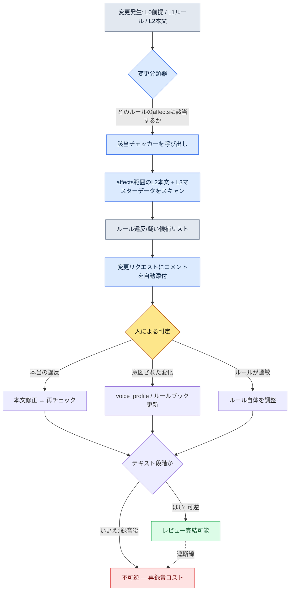

# 5.2 世界観 → キャラクター → クエストの一貫性検証

ベータ直前、QAからバグレポートが1枚上がってきました。タイトルは「王がタメ口をきいています」。本文は短いものでした。「3.4の導入カットシーンでK_001（国王）がプレイヤーに『おい、ちょっと待て（原文：야, 잠깐만）』と発言。このキャラクターは1.1から3.3まで一貫して『そなた（原文：그대）』を使用」。

ライターに聞いてみると、意外な答えが返ってきました。「そのセリフ、私は書いていません」。追跡してみると、外注ライターがカットシーンの分岐の1行を急いで埋める際に入れたものでした。私たちのキャラクターバイブルにはvoice_profileがありましたが、その外注ライターはその文書を見たことがなかったのです。ルールは文書の中にあり、セリフは文書の外から入ってきました。

これが一貫性事故の本質です。ルールがないから起きるのではなく、ルールが本文まで付いていけないから起きるのです。そしてこの1行がカットシーンだったとなると、話はさらに怖くなります。カットシーンには通常、声優の収録が付きます。テキストの段階なら一度直せば終わりですが、録音された後に発見されると、声優の再招集・再収録・再ミキシングという不可逆のコストが付いてきます。一貫性検証の本当の目的は「録音の前に」捕まえることです。

本章では、その事故を人の目の代わりにルールブックとチェッカーで捕まえるワークフローを扱います。lore_consistency_ruleというルールブックがどのようにチェッカーの入力になるのか、voice_lintがトーンのブレをどのように疑い候補として挙げるのか、そしてなぜ最終判定だけは最後まで人の領分として残すべきなのかを、実際の成果物そのままで見ていきます。

---

## 5.2.1 一貫性事故はどこで漏れるのか

リリース済みのRPG・MMORPGのユーザーレビューを集めてみると、ナラティブの一貫性事故はいくつかのパターンに収束します。種類は違って見えても、原因はほぼ1つです。

- **世界観の矛盾**：1.1で「魔法は禁止された」→ 1.3でNPCが平然と魔法を使う
- **ボイスのブレ**：同じNPCの口調・敬称が章ごとに変わる（先ほどの「王のタメ口」事故）
- **タイムラインの衝突**：死んだNPCが後半で平然と再登場する（死亡フラグの同期漏れ）
- **報酬と物語の不一致**：「王から下賜された剣」という物語なのに、データ上はどこにでもあるありふれたアイテム
- **勢力関係の矛盾**：A勢力への敵対を宣言した直後に、A勢力のNPCが親切な挨拶をしてくる

5つはそれぞれ別の事故に見えますが、追跡してみると同じ場所で漏れています。Layer 0（世界前提）やLayer 1（ルール）が変わったのに、その変更がLayer 2（本文）とLayer 3（マスターデータ）まで伝播していないのです。ルールは更新されたのに、本文は古いルールの上で止まっています。

手作業のチェックでこれを防ごうとするのは無理があります。1つの章にNPCが50人、セリフが2,000行、クエストが30個絡み合っているのに、ルールを1行変えたときにその影響がどこまで波及するかを人が100%追跡するのは不可能です。見落とした1行はレビュー段階では捕まらず、リリース後のユーザーレビュー欄で捕まります。

かといって、自動チェックが100%を保証するわけでもありません。核心は役割分担です。**自動チェックは疑い候補を素早く挙げ、判定は人が行う。**自動化の目的は人のレビュー時間を減らすことであって、人をなくすことではありません。この前提を曖昧にすると、後で扱うすべての失敗が付いてきます。

---

## 5.2.2 lore_consistency_rule — チェッカーに食わせるルールブック

プロジェクトAのL1文書の1つが`lore_consistency_rule.md`です。この文書は人が読むガイドであると同時に、チェッカーがパースする入力でもあります。フロントマターの`atoms`と`affects`が、その2つの役割を1つの体に束ねています。

```markdown
---
title: ロア一貫性ルール
layer: L1
atoms:
  - lore_check_world_rule
  - lore_check_character_voice
  - lore_check_timeline
  - lore_check_faction_relation
related:
  derives_from: [world_premise, narrative_pillar]
  affects: [main_quest/*, character_bible/*, dialogue_id_table]
---

## 1. 世界ルール (World Rule)
- 魔法は禁止された状態から始まる → 魔法使用時は（時点、使用者、正当化）の明記が必要
- 神は沈黙状態 → 直接応答の描写は禁止（夢・幻想は許容）

## 2. キャラクターボイスルール
- 各キャラクターごとに voice_profile の参照を強制
- 新規セリフ作成時は voice_profile の5項目（語彙、文長、敬称、感情表現、禁忌表現）を遵守

## 3. タイムラインルール
- すべてのNPCに status_timeline を定義（生存 / 負傷 / 死亡 / 行方不明 / 位置変更）
- セリフ・登場時点で status_timeline を自動点検

## 4. 勢力関係ルール
- faction_relation_matrix の変更時点を記録
- 変更後のセリフは新しい関係を反映
```

`affects`の1行がチェッカーのスキャン範囲を定義します。world_premiseが変われば、チェッカーは`main_quest/*`、`character_bible/*`、`dialogue_id_table`のすべてをスキャンし直します。人が「どこまで影響が及ぶのか」を頭の中で追跡していた作業を、ルールブックに書かれた依存関係グラフが代わりに引き受けるのです。

voice_profileは、このルールブックが参照する別のL2資産です。キャラクター1人のプロファイルは、チェッカーが比較基準として使えるように、項目が数値化・列挙型で入力されています。

```yaml
# character_bible/K_001_voice_profile.yaml
character_id: K_001
display_name: 国王
voice_profile:
  vocabulary_register: 고풍_격식        # 語彙の格
  avg_sentence_len: 18                   # 平均文長（字）
  honorific: "그대"                      # 二人称敬称（固定）
  emotion_expression: 절제               # 感情表出の度合い
  forbidden_terms: ["야", "잠깐만", "ㅋ"] # 禁忌表現
```

このyamlがあって初めて、「王がタメ口をきく」という事故が、人の直感ではなく機械が比較できる項目になります。honorificが「그대（そなた）」なのに、セリフに「야（おい）」があれば、それは意見ではなくルール違反の候補です。

---

## 5.2.3 一貫性検証のフロー

変更が発生した瞬間にチェッカーが起動します。フローは次のとおりです。



最後の分岐が、本章の隠れた背骨です。すべての一貫性判定は**テキスト段階、つまり可逆の段階で終わらせなければなりません**。レビューが録音・キャスティングの後にずれ込むと、修正は不可逆になります。だからvoice_lint・timeline_lintのようなチェッカーは、「速く」回すことよりも**「早く」**回すことが核心です。カットシーンのセリフが録音キューに入る前に、一度は通過していなければなりません。

チェッカーは4種で、それぞれルールブックの1セクションと一対一で対応します。

- `world_rule_lint.py` — L1世界ルール + すべてのL2本文 → 魔法使用・神の応答などの違反候補
- `voice_lint.py` — voice_profile + dialogue_id_table → ボイスのブレが疑われるセリフ
- `timeline_lint.py` — npc status_timeline + すべてのセリフ・登場時点 → 死亡NPCの再登場などの衝突
- `faction_lint.py` — faction_relation_matrix + dialogue tone → 関係矛盾のセリフ

4つのチェッカーはいずれも100%正確ではありません。だから出力の名前が「違反」ではなく「疑い候補」なのです。

---

## 5.2.4 ワークド・トランスクリプト：voice_lintを一周回す

「チェッカーがある」という抽象的な話ではピンと来ません。実際に一度回してみます。先ほどの「王がタメ口をきく」事故を再現した入力です。

**setup** — チェック対象のセリフ2行をdialogue_id_tableから取ってきます。

```
dialogue_id_204  speaker=K_001  text="야, 잠깐만요. 그쪽이 먼저 말해 봐."
dialogue_id_217  speaker=K_007  text="...젠장, 또 실패야. 다시 처음부터."
```

**prompt** — チェッカー本体はルールベース（正規表現・長さ比較・禁止語マッチング）で動きます。AIは「なぜ疑わしいのか」をライターが読める自然言語で説明する場所にだけ付けます。チェック段階のLLMプロンプト全文は次のとおりです。

```
voice_lintが抽出した疑い候補だ。判定はせず、各候補が
どのvoice_profile項目に違反していそうかと、その根拠だけを1〜2文で説明して。
「違反だ/違反ではない」と断定せず、「〜と疑われる」までにとどめること。

[voice_profile]
K_001: honorific="그대", avg_sentence_len=18, forbidden=["야","잠깐만"]
K_007: forbidden=["젠장"]

[疑い候補]
- dialogue_id_204 (K_001): "야, 잠깐만요. 그쪽이 먼저 말해 봐."
- dialogue_id_217 (K_007): "...젠장, 또 실패야. 다시 처음부터."
```

**Claudeの生の出力**（要約・整理なしにそのまま掲載します）

```
[dialogue_id_204 / K_001]
このセリフはhonorific項目と衝突するものと疑われます。voice_profileは
二人称の敬称を「그대」に固定していますが、本セリフは「그쪽」を使っており、
敬称自体が現れていません。また、forbidden_termsの「야」と「잠깐만」がいずれも
登場しており、語彙の格（고풍_격식）から外れているものと疑われます。平均文長18字の
基準とは直接矛盾するようには見えませんが、語調自体がカジュアルになっている点が違反シグナルとして疑われます。

[dialogue_id_217 / K_007]
forbidden_termsの「젠장」がそのまま使用されており、禁忌表現項目の違反と疑われます。
ただし、K_007（学者）のemotion_expression項目が提示されていないため、この表現が
意図された感情の高揚なのか単純な逸脱なのかは、この情報だけでは判断が困難です。
判定にはライターのレビューが必要です。
```

この出力には、私たちがあえて残した2つの正直さがあります。第一に、204でAIは「平均文長の18字基準とは直接矛盾して見えない」と述べ、**違反ではない項目を違反だと言い張りませんでした**。第二に、217で「emotion_expression項目が提示されていないため判断が難しい」と述べ、**情報不足を認めて判定を人に渡しました**。AIがすべての疑いを「違反確定」として押し切っていたら、その方が危険なチェッカーです。

**verify** — ライターはこのコメントを変更リクエスト上でそのまま受け取ります。判定はライターが行います。

- 204：本当の違反。外注ライターがvoice_profileを見ずに入れたセリフです → 本文を修正し、再チェック
- 217：意図された違反。K_007が崩れていく3.4の感情高揚のセリフです → voice_profileに`emotion_peak_exception`フラグを追加し、217を例外として登録

2つの候補を同じチェッカーが挙げたのに、結末は正反対です。一方は本文を直し、もう一方はルールを直します。この分岐を機械が自動ではできないということが、次の節の核心です。

---

## 5.2.5 なぜ判定は人の領分なのか

チェッカーが疑いまでしか挙げず、判定を人に渡すのには3つの理由があります。

第一に、**意図された違反が存在します**。キャラクターが崩れたり変わったりする章では、ボイスは意図的に揺れます。先ほどの217がそうです。自動拒否型のチェッカーは、ライターの演出意図を塞いでしまいます。

第二に、**ルール自体が進化します**。同じ種類の疑いが続けて「意図された変化」と判定されるなら、それはルールが現実に追いついていないというシグナルです。チェック結果は本文だけを直させるのではなく、ルールブックも直させます。

第三に、**新規キャラクター・勢力には学習期間が必要です**。voice_profileがまだ2〜3項目しか埋まっていない新規NPCは、疑いが多めに挙がるのが正常です。この時期に自動拒否をかけると、ライターはチェッカーを敵と認識します。

自動チェックと人の判定の境界が明確であってこそ、チェッカーは生き残ります。自動拒否型にすると、1か月以内にライターたちが「これ、切りましょう」と言い出します。会社の出入口に敏感すぎる自動センサーを付けると、人が通るたびにドアが閉まり、結局誰かがセンサーを外してしまうのと同じです。チェッカーはドアを閉める装置ではなく、「ここを誰かが通った」と知らせる装置でなければなりません。

1つ但し書きを添えます。レビューはテキスト段階で完結すべきだという原則（先のフロー図の遮断線）は、人の判定にもそのまま適用されます。ライターの「意図された違反」という判定も、録音の前に終わっていなければなりません。録音後の覆しはチェッカーの問題ではなく、工程コストの問題に変わります（可逆/不可逆の境界の全体像は5.4.5）。

---

## 5.2.6 測定 — 6か月の前後比較

プロジェクトAでチェッカー4種を段階的に導入し、6か月測定しました。以下は実測ログに基づきつつ、絶対値の代わりに方向・比率に置き換えたものです（社内測定、著者の推定ではありません）。

- **章1つあたりのレビュー時間**：導入前は約5日 → 導入後は約2日（半分以下）
- **リリース後に発見される一貫性事故**：章あたり3〜5件 → 0〜1件
- **ライター1人あたりの章の産出速度**：4週間 → 2.5週間
- **ルールブック（L1）の更新頻度**：四半期に1〜2回 → 月に1〜2回

最後の項目が一番興味深いところです。チェッカーがあれば、ルールを頻繁に変えても安全です。ルールを1行変えればその影響が自動的に可視化されるので、変更への恐れが減り、ルールがより速く進化します。一貫性ツールの本当の効果は「事故を減らした」ではなく、「ルールを恐れずに変えられるようになった」という方に近いのです。

ただし、上の数値はチェッカー4種がすべて稼働している時点の数字です。導入初期にvoice_lintの1つだけでも目に見える効果が出たという点の方が重要です。最初から4種を全部オンにする必要はありません。

---

## 5.2.7 AIをどこに置くのか

自動チェッカーの本体はルールベースが効率的です。同じ入力に同じ結果が返ってきてこそ信頼が積み上がるのですが、LLMは非決定論的なので、その場所には合いません。AIは別の4つの場所に入ります。

- **ルール違反候補の検出** → ルール（正規表現・キーワード・長さ・構造チェック）。LLMではない
- **疑い候補の根拠説明** → LLM。先のワークド・トランスクリプトで見た「なぜ疑わしいのか」の自然言語説明
- **代替セリフのドラフト生成** → LLM。ライターレビュー用のドラフトであり、確定はライター
- **voice_profile自動更新候補の提案** → LLM。数十章の本文からパターンを抽出して項目の補強案を提示

ルールは速くて決定論的、LLMは説明と生成に強い。この2つの役割を混ぜると、どちらも壊れます。チェックをLLMに任せると、同じセリフが昨日は通って今日は引っかかるということが起き、説明を正規表現に任せると「honorific項目違反」という機械語しか出てきません。

---

## 5.2.8 導入の順序とよくある失敗

最初からチェッカー4種を全部作ると、負担が効果より先に来ます。推奨順序は、最も安くて効果の大きいものからです。

1. **voice_profile 5項目の標準化**（約1か月）— character_bibleの様式から定着させます。チェッカーよりこちらが先です
2. **voice_lintの最小バージョン**（約1週間）— 禁止語彙のマッチングのみ。1単語塞ぐだけでも、リリース後のSNS事故が四半期に1〜2件減ります
3. **timeline_lint**（1〜2週間）— 死亡フラグの点検。死んだNPCの再登場を捕まえるだけでも体感が大きいです
4. **world_rule_lint + faction_lint**（1〜2か月）— 残りの2種
5. **LLM補助**（さらに1〜2か月）— 説明・ドラフト生成の統合

ステップ2（voice_lint）だけでも効果が大きいという点を強調しておきます。先ほどの「王のタメ口」事故は、まさにこのステップ1つで捕まる種類のものでした。

導入過程で繰り返される失敗も、ほぼ決まっています。

- **自動拒否型にしてしまう** → 疑い候補 + 人による判定の構造に戻す
- **ルールブックがライターと分離されて運用される** → ルールブックの変更にはライターの合意を必須にし、ライターがルールブックの変更を要請できるようにする
- **voice_profileが形だけになる** → キャラクター1人で5項目を完全に埋めてから拡張する
- **チェック結果がどこにあるのか分からない** → 変更リクエストのコメントへの自動添付を強制する
- **LLMにチェック自体をやらせる** → チェックはルール、説明だけLLM
- **録音後にレビューする** → レビューはテキスト段階で完結。可逆区間を越えない

最後の項目が、その前のすべての項目よりも高くつきます。ほかの失敗は時間を失いますが、この失敗は声優のスケジュールを失います。

---

次章（5.3）では、チェッカーの代わりにAI補助でナラティブ本文を書くフローを扱います。L0のトーンとL1のルールをコンテキストとして注入し、AIが一般的な答えではなく、私たちの世界の答えを出すようにする方法を見ていきます。

---

### 本章のポイント
- 一貫性事故はルールがないから起きるのではなく、ルールが本文まで伝播しないから起きる。
- チェッカーは疑いまでにとどめ、判定は人が行ってこそ、チェッカーは廃棄されずに生き残る。
- すべての一貫性レビューは、録音前のテキスト（可逆）段階で完結させる。

### 次章のプレビュー
- 5.3. AI補助によるナラティブ作成 — L0トーン・L1ルールのコンテキスト注入

---

## やってみよう

**setup** — character_bibleからキャラクターを1人選び、voice_profileの5項目（語彙の格・平均文長・敬称・感情表現・禁止表現）をyamlで完全に埋めましょう。同じキャラクターの既存セリフ10行をdialogue_id_tableから抜き出し、1つのファイルにまとめます。

**prompt** — 先のワークド・トランスクリプトのチェック補助プロンプトをそのまま使いましょう。核心は2つの制約です。「判定するな」と「『〜と疑われる』までにとどめよ」です。入力にvoice_profileのyamlとセリフ10行を貼り付けます。

**verify** — 出力された疑い候補を1行ずつ自分で判定しましょう。本当の違反なら本文を直し、意図された変化ならvoice_profileに例外フラグを追加します。AIが「違反ではない項目」まで違反だと言い張っていないか、「情報不足」を認めているかも併せて確認します。AIがすべての項目を違反と断定するなら、プロンプトの「判定するな」という制約を強化しましょう。

### 一人ミニ版

チェッカー4種もルールブックもない1人開発なら、チェッカー本体なしで、プロンプト1つで同じ効果を出せます。キャラクターごとのvoice_profileのyamlだけを手で維持し、新しいセリフを書くたびに、そのキャラクターのyaml + 新しいセリフを先の補助プロンプトに貼り付けて「疑い候補」を受け取りましょう。自動化はありませんが、**判定は人、AIは説明**という核心構造はそのまま生きています。守るべきはたった1行です — 録音・音声合成に回す前に、このレビューを一度通すこと。可逆段階を越えないという原則は、チームの規模とは無関係です。
