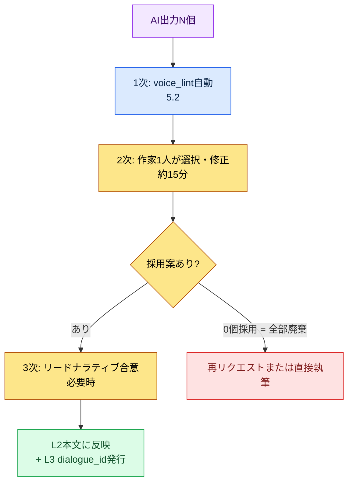
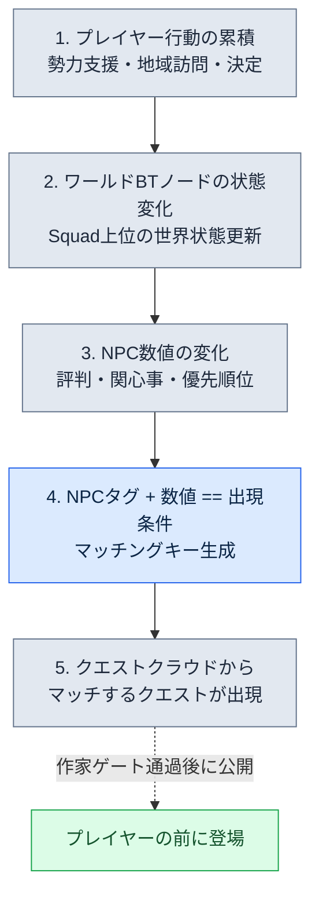

# 5.3 AI支援によるナラティブ執筆

新しいサイドNPCの最初のセリフを作っていた日のことです。空のチャット欄に「村の鍛冶屋NPCのセリフを5つ作って」と打ち込みました。5秒後、画面に「勇者よ、そなたの武器をわしに任せるがよい」が表示されました。どこかで見たような、ではなく、正確にどこで見たのか分かる気がする文章でした。同じプロンプトを別のチームの別のゲームに入れても、まったく同じ答えが返ってくるはずでした。その瞬間に気づいたのは、モデルが弱いということではなく、私がモデルにこちらのゲームのことを何ひとつ教えていなかったということでした。

AIは一般的なファンタジーの文章を上手に書きます。しかし、この世界の文章は書けません。違いはただ一つ、コンテキスト注入です。L0トーンとL1ルールを毎回のリクエストに添えて送れば、AIが吐き出す一行は「どこかで見たような文章」から「このゲームの文章」に変わります。本章ではその注入を4層で運用する実務を扱い、最後に同じ原理をワールドシミュレーション規模へ引き上げる進歩的な適用（ワールドBT（BehaviorTree、ビヘイビアツリー）+クエストクラウド）をRnDの最前線として押さえます。

---

## 5.3.1 コンテキストが空のときに起きること

ナラティブ分野でのAI支援は、最も早く導入され、最も早く信頼を失う領域です。失敗パターンがほとんど同じだからです。

「クエスト開始のセリフを5つ」と投げると、「勇者よ、われらの村が…」で始まる一般的なファンタジー5種が返ってきます。「このキャラクターのセリフを直して」と頼むと、ボイスが平準化されてすべてのNPCが似た口調に収束します。「チャプター1のシノプシスを書いて」と頼むと、どこかで見たことのあるRPGシノプシスの平均値が出てきます。

問題はモデルではなく、コンテキストが空だということです。モデルは学習データの平均を出力します。平均がほしくないなら、平均から遠ざかる手がかりを与えなければなりません。本章のテーマは、その手がかりをどう作り、どう注入するかです。

著者が運営するMMORPGプロジェクト（以下、プロジェクトA）では、ナラティブAI支援は4層のコンテキストを順番に積み上げます。5.1でNarrativeDocsをLayer 0〜4に分解したあの構造が、ここでそのまま注入単位として再利用されます。

<svg viewBox="0 0 720 300" xmlns="http://www.w3.org/2000/svg" font-family="sans-serif">
  <rect x="20" y="20" width="680" height="46" rx="6" fill="#1f2d3d"/>
  <text x="40" y="40" fill="#fff" font-size="14" font-weight="bold">Layer A · システムプロンプト</text>
  <text x="40" y="58" fill="#9fb3c8" font-size="11">作家ペルソナ · 禁則 (ほぼ不変、一度だけ定義)</text>

  <rect x="20" y="78" width="680" height="46" rx="6" fill="#27496d"/>
  <text x="40" y="98" fill="#fff" font-size="14" font-weight="bold">Layer B · L0ビジョン</text>
  <text x="40" y="116" fill="#bcd4e6" font-size="11">world_premise · narrative_pillar · tone_manifesto (≈7,000 tok, キャッシング)</text>

  <rect x="20" y="136" width="680" height="46" rx="6" fill="#2e6171"/>
  <text x="40" y="156" fill="#fff" font-size="14" font-weight="bold">Layer C · L1ルール (選択注入)</text>
  <text x="40" y="174" fill="#cfe8df" font-size="11">作業関連ルールの _summary 節だけを選んで (キャッシング)</text>

  <rect x="20" y="194" width="680" height="46" rx="6" fill="#3e885b"/>
  <text x="40" y="214" fill="#fff" font-size="14" font-weight="bold">Layer D · L2隣接本文</text>
  <text x="40" y="232" fill="#e3f2e8" font-size="11">同じキャラクターの直前のセリフ · 同じチャプターのシノプシス (原文のまま、毎回変更)</text>

  <rect x="180" y="254" width="360" height="36" rx="6" fill="#c0392b"/>
  <text x="200" y="277" fill="#fff" font-size="13" font-weight="bold">作業指示: "この時点の K_007 のセリフ3案"</text>

  <line x1="360" y1="66" x2="360" y2="78" stroke="#888" stroke-width="2"/>
  <line x1="360" y1="124" x2="360" y2="136" stroke="#888" stroke-width="2"/>
  <line x1="360" y1="182" x2="360" y2="194" stroke="#888" stroke-width="2"/>
  <line x1="360" y1="240" x2="360" y2="254" stroke="#888" stroke-width="2"/>
</svg>

4層を毎回すべて入れるわけではありません。作業タイプによって必要な層だけを取り出します。あるキャラクターの次のセリフの草案なら、A + B（トーンのみ）+ D（そのキャラクターの直近のセリフ10行）で十分です。新規サイドクエストのシノプシスならC（quest構造ルール）が加わります。分岐結果4案ならC（分岐規則）+ D（分岐直前の本文全体）が重くなります。机の上の書類棚からペルソナシート、世界観の一行、ルールブックのページ、隣接本文のひと束を、作業の大きさに合わせて選んで送るようなものです。

---

## 5.3.2 ワークド・トランスクリプト一本 — K_007の初めての感情セリフ

抽象的に説明する代わりに、実際の一つのリクエストを最後まで追いかけます。同じキャラクター（学者タイプのNPC、社内ID `K_007`）が初めて感情を表に出す場面のセリフ3案を作る作業です。プロンプト全文から始めます。

**送信したプロンプト（Layer A + B（トーン）+ D + 作業指示 + 出力形式）:**

```
[システム]
プロジェクトAのナラティブ作家だ。「勇者」・「選ばれし者」のようなRPG常套句は使わず、
口調は下の直前のセリフのトーンにそのまま従うこと。知らない設定はでっち上げず
「コンテキストでは判断不可」と答えること。君は草案だけ、決定は私がする。

[L0トーン — tone_manifesto 抜粋]
この世界の情緒は抑制だ。人物は感情を簡単に口にしない。
感情は爆発ではなくひび割れとして現れる。言葉の省略と短い文。

[参考 — K_007の直前5つのセリフ (時系列、原文のまま)]
1. "...それは私も初めて聞く話ですが。"
2. "記録はありますか? なければ疑うべきでしょう。"
3. "確実になるまで動かないでおきましょう。"
4. "私の意見はそれで終わりです。"
5. "...すみません。私は冷たすぎましたか。"

[状況]
仲間のNPCが傷ついたまま戻ってきた。学者は初めて感情を表に出さなければならない。

ちょうど3案だけ、各25字以内で。案ごとに末尾へ (反応タイプ: 怒り/悲しみ/否定) のラベルを付け、
説明や前置きは省くこと。
```

**Claudeの生の出力（要約・脚色なしそのまま）:**

```
1. "...なぜ一人で抱え込んだんですか。バカみたいに。" (反応タイプ: 悲しみ)
2. "記録を見るべきだった。私が、私が見落としたんです。" (反応タイプ: 否定)
3. "大丈夫です。全部大丈夫です。だからもう—" (反応タイプ: 否定)
```

ここで止まらないことが核心です。作家が3つの案を読んで検証します。1案目はトーンが合っています。直前のセリフ5番の「...죄송합니다（…すみません）」が見せたひび割れを、1案目は「바보같이（バカみたいに）」という一語で受け継ぎました。採用候補です。2案目は「제가, 제가 놓쳤어요（私が、私が見落としたんです）」の言いよどみが、学者の抑制とわずかにずれています。保留です。3案目はラベルが間違っています。「괜찮아요（大丈夫です）」を繰り返すのは否定ではなく回避に近いのですが、このプロジェクトのvoice_profileには、学者が感情を回避で処理するパターンがありません。却下です。

**再リクエスト（却下理由を明記して再送）:**

```
3案目は却下。「大丈夫です」の繰り返しはこの学者のパターンじゃない。この人物は感情を
回避ではなく「事実確認の失敗に対する自責」で処理する。1案目は採用する。
2・3案目の枠に、1案目と毛色の違う2案をもう一度。言いよどみなしで25字以内で。
```

**Claudeの2回目の出力:**

```
2. "記録は嘘をつきません。私が見なかったんです。" (反応タイプ: 自責)
3. "...座って。まず傷を。話はあとで。" (反応タイプ: 悲しみ)
```

今回は2つとも通過しました。2案目は「기록（記録）」という学者の核心語彙（直前のセリフ2番「기록이 있나요?（記録はありますか?）」）を自責の媒介として使い直し、3案目は抑制された命令形で、学者が感情を行動で押さえ込むパターンを見せました。最終採用は1案目+2案目+3案目です。この3行は5.2の`voice_lint`による自動チェックを通過したあとでL2本文に反映され、L3で`dialogue_id`の発行を受けます。

この一本のトランスクリプトに、本章のすべてが詰まっています。トーン注入（L0）が1案目を生かし、原文そのままの隣接本文（L2）が学者の語彙「기록（記録）」を再リクエストで再利用させ、出力形式の強制が雑談を防ぎ、作家の却下ゲートが3案目の間違ったラベルをふるい落としました。AIは一行たりとも最終決定していません。

---

## 5.3.3 Layer A — システムプロンプト、一行がすべてを左右する

いちばん上に敷かれるペルソナ定義です。一度決めたらほとんど変えません。上のトランスクリプトのシステムブロックがその実物です。5行のうち最後の1行（「草案だけを書き、決定は私がする」）が最も重要です。これが抜けると、AIは「最終版」のふりをした文章を自信満々に出してきて、作家はレビューの代わりに採点をするはめになります。そして3行目（「知らない設定はでっち上げず『コンテキストでは判断不可』と答える」）が2番目に重要です。この行がなければ、モデルは空欄をもっともらしい嘘で埋めます。ナラティブにおいて、もっともらしい嘘は数日後にロアの衝突として返ってきます。

---

## 5.3.4 Layer B — L0ビジョンとキャッシングの位置

L0は分量が少なく（5.1基準で約4.5ページ分）、ほぼ毎回全体を注入できます。韓国語基準の推定で`world_premise.md`が約2,500トークン、`narrative_pillar.md`が約1,500トークン、`tone_manifesto.md`が約3,000トークン、合わせて約7,000トークンです。（これらの数値は著者の推定（未検証）です。トークナイザーや文書の改訂によって変わります。）

7,000トークンを毎回のリクエストで送り直すと、コストが積み上がります。そこでプロンプトキャッシングをかけます。Anthropic・OpenAIの両方が対応している機能で、キャッシュヒット時には入力トークンのコストが大きく下がります。核心は、変わるものと変わらないものをメッセージの中で分離しておくことです。

```python
messages = [
    {"role": "system", "content": SYSTEM_PROMPT},
    {"role": "user", "content": [
        {"type": "text", "text": L0_FULL,      "cache_control": {"type": "ephemeral"}},
        {"type": "text", "text": L1_SELECTED,  "cache_control": {"type": "ephemeral"}},
        {"type": "text", "text": L2_ADJACENT},   # 毎回変更 — キャッシュしない
        {"type": "text", "text": TASK_INSTRUCTION},  # 毎回変更
    ]},
]
```

`cache_control`を付けたL0とL1はキャッシュ対象で、L2の隣接本文と作業指示は毎回変わるためキャッシュしません。キャッシュブロックを常にメッセージの前方にまとめておくことがヒット率を左右します。変わるブロックが前に挟まると、その後ろのキャッシュはすべて無効化されます。この順序を間違えることが、キャッシングを有効にしてもコストが下がらない最も多い原因です。

> キャッシュヒット率・コスト削減数値の詳細はPart 22（コスト）の章で扱います。ここでは「変わるものを後ろに寄せる」という原理だけ覚えておけば十分です。

---

## 5.3.5 Layer C — L1ルールを丸ごと入れない

L1ルールブックは分量が大きく、全部入れるとコンテキストがあふれ、さらに悪いことにモデルが核心を見落とします。作業に関連するルールだけを、それも`_summary`節だけを選びます。

メインクエストの分岐結果を作るときは`dialogue_branching_rule`と`faction_relation_matrix`を選びます。新規NPCのセリフならそのNPCの`voice_profile`と`tone_manifesto`。ロア辞典の新規項目なら`lore_consistency_rule`と`world_premise`。サイドクエストの骨格なら`quest_template`と`reputation_model`です。選択は人が直接行うか、wikilinkグラフ（第7部）をたどって自動抽出しますが、自動抽出のときは適合率より再現率を優先します。ルールが1つ抜ける損害のほうが、ルールが1つ余計に入る損害よりはるかに大きいからです。

ルールブックの本文を全部入れる代わりに、ルールブックファイルの冒頭に`_summary`節を置き、それだけを注入します。

```markdown
---
title: 分岐規則
layer: L1
---

## _summary
- 分岐はチャプターの末尾でのみ発生
- 分岐は2~3案。4案以上は禁止
- 分岐の選択は評判に +/-1 の影響、結末分岐には +/-3
- すべての分岐結果は24時間以内に結果を見せなければならない
- 分岐は取り消し不可 (セーブ分離推奨UIの表示)

## 1. 分岐発生時点の規則
(詳細説明、運営者参考用 — LLMには注入しない)
...
```

`_summary`の5行のほうが、本文50行よりLLM出力の品質に効きます。モデルは短く断定的なルールをよりよく守ります。長い説明はモデルの注意を分散させ、分散した注意はルール違反として返ってきます。

---

## 5.3.6 Layer D — 隣接本文は要約しない

直前のセリフ、隣接クエスト、同じチャプターのシノプシス。最も変動が大きいコンテキストです。同じキャラクターの新規セリフにはそのキャラクターの直前のセリフ10行を時系列で、チャプター中盤のクエストにはチャプターシノプシスと同じチャプターのクエストの1行要約を、分岐結果の結末には分岐直前の本文全体と選択肢テキストを入れます。多く入れすぎるとLLMは平均を出力し、少なすぎると一般化された出力になります。適正な範囲はトークン1,500〜3,000の間（著者の観察基準、未検証）です。

核心ルールを一つ。隣接本文は加工も要約もせず、原文のまま入れます。上のトランスクリプトで学者の直前のセリフ5行に手を入れずそのまま入れたからこそ、モデルは再リクエストの段階で「기록（記録）」という単語を正確につまみ上げ、自責の媒介として再利用できました。もしあの5行を「学者は慎重で冷たい」と要約して入れていたら、作家の微細な選択はすべて消え、モデルはまた平均へ戻っていたでしょう。要約は情報を減らすのではなく、作家がすでに下した決定を消すのです。

---

## 5.3.7 作家によるレビューワークフロー — 廃棄率を指標として使う

AI出力は常に草案です。レビューは決められたゲートを通過します。



作家がN個のうち0個を選ぶケース（全部廃棄）も正常です。上のトランスクリプトで3案目が却下されたように、却下は失敗ではなく、ゲートが機能した証拠です。だからこそ、廃棄率を作家別・キャラクター別に測定し、コンテキスト注入品質の指標とします。

廃棄率が0〜20%ならコンテキストが十分な安定運用なので、そのままにします。20〜50%は一般的な運用範囲なのでモニタリングだけ行います。50〜80%に上がったら、L1ルールの選択が抜けていないか再点検します。80%を超えたら、個別ルールの問題ではなくシステムプロンプトやペルソナ自体がずれているということなので、Layer Aを書き直します。廃棄率は週1回、作家別に集計して振り返りで共有します。

ただし、廃棄率は絶対的な指標ではありません。変化の速いキャラクター（たとえば上のトランスクリプトのK_007のように、初めて感情を表に出す転換点）は、廃棄率が高くても正常です。数字は対話の始まりであって、判決ではありません。

---

## 5.3.8 セキュリティ — コンテキスト流出をどう防ぐか

L0〜L1はゲームの核心IPです。外部LLM APIにそのまま送るのが負担なら、選択肢が分かれます。外部APIを学習不使用契約のまま使う方式が最も速いものの、法務レビューが必要です。会社名・固有名詞をplaceholderに置換して送る方式は、追加の処理コストがかかり、自然さが損なわれます。セルフホスティング（オープンモデル）はデータこそ安全ですが、品質・運用の負担が大きくなります。L0は内部に置いて草案だけ外部に送るハイブリッドは、運用が複雑です。

著者のプロジェクトAは1番目の方式（外部API+学習不使用契約）を使っています。2番目の方式は試したうえでやめました。placeholder置換が「○○王国の○○学者が○○について語った」という形に本文を平準化させ、出力品質を崩してしまったからです。匿名化が品質を殺すのは本書全体で繰り返されるトレードオフです（Part 1の匿名化の章を参照）。ナラティブではその損傷がとくに大きいのです。固有名詞がそのままトーンだからです。

---

## 5.3.9 よくある失敗と処方箋

システムプロンプトなしで作業指示だけ投げると、平均が出てきます。ペルソナと禁則を先に敷きます。L0を毎回全体注入しながらキャッシングを使わないと、コストが漏れます。キャッシュブロックを前方にまとめます。L1ルールブックを丸ごと入れると、モデルが核心を見落とします。`_summary`節だけを抜き出します。隣接本文を要約して入れると、作家の選択が消えます。原文のまま引用します。出力形式を決めないと、回答のかなりの数が「こちらが3つの候補です:」で始まり、作家がその前置きを本文と取り違える事故までついてきます。個数・長さ・ラベルを明示します。AI出力を最終版として使うと、レビューゲートが崩れます。常に作家ゲートを通過させます。廃棄率を測らないと、ツールの健全性が人の印象に依存します。週次で集計し、振り返りで共有します。

---

## 5.3.10 保守的な適用から進歩的な適用へ

ここまでは保守的な適用でした。作家がコンテキストを丁寧に注入し、AIは一行一行の草案だけを作ります。単位は「このキャラクターの次のセリフ3案」「このクエストのシノプシス」のような小さな作業です。安定していますが、量産規模と動的な反応性には限界があります。

ここで一つ、先に押さえておきます。プロシージャル生成・ワールドシミュレーション・動的クエストは、プランナーたちが20〜30年前から紙の上に描いてきたビジョンです。決定論的なルールブックベースのPCGは、ダンジョンの部屋・武器オプション・スポーン分布のような数値領域は扱えましたが、自然言語の本文・キャラクターペルソナ・物語の分岐・NPCの会話には手が届きませんでした。企画のかなりの部分が紙の上にとどまっていたわけです。2024〜2026年のLLMと画像モデルの発展が、その領域を実装可能な場所へ引き寄せました。AIの発展の核心的な意味はモデルのスコアではなく、長く紙の上にあった企画の実現可能性が開かれたことにあります。ただし、可能性が開かれることと、運用可能なシステムとして定着することは別の問題です。

### Layer分解がプロシージャル生成の前提だった

5.1のLayer 0〜4分解は、単なる整理ではなくプロシージャル生成の前提でした。5つの階層がそれぞれ生成パイプラインのどの段階（L0アンカー → L1ルールブック → L2本文 → L3数値 → L4ゲート）に対応するかは、§6.6と5.1.11で扱いました。要点は一つです — ひとかたまりの文書の上では、生成器がどこから読みどこに書くかを決められず、L0がどこにあるか分からないままコンテキストがぼやけ、L1・L2が一つのファイルの中で衝突して量産ラインが崩れます。Layer分解が先にあり、その上でプロシージャル生成が機能します。ここでは、その前提をナラティブAI支援の量産段階に適用します。

### 進歩的な適用の骨格 — クエストクラウド

3つの要素が束ねられます。第一に、NPC Personaがプロシージャルに生成されます。メインNPCは作家の手によりますが、サイドNPCは6.2〜6.3のgenerator・Squadパイプラインが量産します。各Personaは`voice_profile`とともにタグ（職業・勢力・性向・役割）を付けます。第二に、ワールドBTがSquadの上位に位置します。Squadが一つの狩り場のNPCグループの行動を束ねるなら、ワールドBTはその上でプレイヤー行動の累積数値を受け取り、世界全体の状態を更新します。プレイヤーがどの勢力を助けたか、どの地域によく行ったか、どんな決定を下したかがワールドBTのノード状態を揺らし、揺れたノードは影響圏のNPCたちの数値（評判・関心事・優先順位）に反映されます。第三に、クエストはクラウドモデルです。メインクエストを除くすべてのクエストがプロシージャルに生成され、それぞれタグ（誰が・どこで・なぜ・いつ）と出現条件を付けたまま漂います。どのクエストも特定のNPCに固定されません。

出現は5つの段階を経ます。



比喩で言えば、クエストは図書館の本棚に挿さっているのではなく、空中に漂う雲です。NPCがある状態に到達すると、自分に合った雲が降りてきて手に収まります。この構造でAIは一行を書く補助者ではなく、3つを同時に扱います。プロシージャル生成されたPersona・クエストの自然言語本文（説明・セリフ）、ワールドBTの状態がNPCに反映されるときの語彙の変動（同じ`voice_profile`を維持しつつ、話題はワールド状態に合わせて変動）、そして検証段階の疑義分類器（このクエストがこのNPCに出現してよいか）です。

### 不可逆の境界 — レビューはテキスト段階で終えなければならない

進歩的な適用でも、可逆/不可逆の境界（5.4.5）はそのまま生きています。クラウドから出現したクエストのセリフがレビューを通過しないまま音声パイプラインへ流れてしまうと、コードのロールバックでは戻せません。だからこそ、すべてのレビューゲート（`voice_lint`、疑義分類器、作家ゲート）を不可逆の境界の手前に置くことが、進歩的な適用の安全装置です。自動量産が加わるぶん、このゲートは保守的な適用よりもさらに固くなければなりません。

### どこで止まり、なぜ止まらないのか

本書は進歩的な適用の完成形までは扱いません。別の本一冊分の分量であり、会社・プロジェクトごとにインフラの前提が異なるからです。覚えておくべきことは2つだけです。まず、保守的な適用ができないチームは進歩的な適用もできません。保守的な適用でレビューゲートが回らなければ、進歩的な適用ではクラウドが暴走します。運用が生き残るには、プロシージャル生成インフラ、ワールドBTノードの定義・テストツール、出現クエストの自動疑義分類+作家ゲート、出現率・廃棄率・プレイヤー満足度の同時トラッキング、誤って出現したクエストの自動回収・差し替えがそろっていなければなりません。5つのうち1つでも欠けると、1四半期以内に廃棄されます。一貫性の事故が爆発的に増え、人のレビューが追いつかなくなるからです。

次に、進歩的な適用は量産を増やす道具ではなく、動的な反応性を増やす道具です。量産だけを狙うと、一般的なRPGの平均がクラウドの中に満ちあふれ、プレイヤーは「より多様に見えるのに、より空っぽな」世界に出会います。とはいえ、この道が危険なだけというわけでもありません。この領域はゲーム企画RnDの最前線です。プロシージャル生成・シミュレーション・LLMが出会う場所から、本当に新しいゲーム形式が生まれる可能性が最も高いのです。すぐに会社へ導入することはまれでも、次の5〜10年の方向性の一つとして見ておく価値はあります。

---

## 5.3.11 一つの章を最後までやってみよう

本章の保守的な適用をそのまま再現する手順です。

**setup.** L0の3ファイル（`world_premise.md`・`narrative_pillar.md`・`tone_manifesto.md`）を1つのテキストに結合し、`L0_FULL`変数に入れてください。システムプロンプトは上のトランスクリプトの5行のとおりに書き、最後の行（「草案だけを書き、決定は作家がする」）を抜かさないでください。セリフを作るキャラクターの直前のセリフ10行を、原文のままテキストとして集めます。

**prompt.** メッセージを`[시스템] → [L0 톤] → [참고: 직전 대사 원본] → [상황] → [출력 형식]`の順に組み立ててみましょう。出力形式には「正確にN案/各案の最大文字数/ラベル/それ以外は一切禁止」を必ず明記します。L0とL1にだけ`cache_control`を設定し、変わるブロックはメッセージの後ろに寄せます。

**verify.** 受け取ったN案を1行ずつ検証してみましょう。トーンが直前のセリフとつながっているか、ラベルが実際の反応と合っているか、このキャラクターが使わないパターン（回避・言いよどみなど）が混ざっていないかを見ます。却下する案は理由を明記して再リクエストします。0個採用も正常で、廃棄率として記録してください。通過した案だけを`voice_lint`に通してL2に反映し、L3で`dialogue_id`を発行します。

**一人ミニ版.** API・キャッシング・`voice_lint`がなくても核心は同じです。ChatGPT/Claudeのチャット画面が1つあれば十分です。キャラクターの直前のセリフ5〜10行を毎回コピペで先頭に敷き、出力形式の3行を常に付け、返ってきた答えのうち却下するものは理由を書いて再リクエストしてみましょう。キャッシングの代わりに同じ会話スレッドを維持すれば、前のコンテキストがそのまま残ります。廃棄率は紙1枚に「今週の採用12/全体30」のように手で数えて書けば十分です。道具が小さくても、4層注入とレビューゲートという骨格は一人の作家にもまったく同じように機能します。

---

### 本章のポイント
- コンテキスト4層（システム・L0・L1・隣接本文）のうち1層が抜けるだけで、出力は平均に収束します
- キャッシングは、変わらないL0・L1を前に寄せ、変わる本文を後ろへ回す分離があってこそ生きます
- レビューゲートと廃棄率が機能してはじめて、進歩的な適用（クエストクラウド）も暴走しません

### 次章のプレビュー
- 5.4. ダイアログ・ボイスの一貫性 — `voice_profile`をAIで抽出・更新し、ボイスをレビューする
