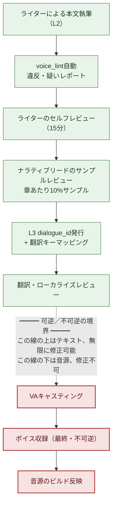

# 5.4 セリフ・ボイスの一貫性

収録ブース。ディレクターがヘッドホンを着け、手を挙げてキューを出します。声優が学者NPCのセリフを読み上げます。「와, 진짜 대박이네요（わあ、ほんとにすごいですね）」。ディレクターの手が止まります。このキャラクターは、5つの章を通して「와（わあ）」という感嘆詞を一度も口にしたことのない人物です。罵り言葉も、現代的な感嘆詞も口にせず、最後まで語尾を濁す学者です。それなのに、台本にはその行がそのまま載っています。

ここで2つのコストが同時に発生します。第一に、その行を直せば、声優は読み直さなければなりません。出演料とスタジオの時間は、すでに時計が回っています。第二に、もっと怖いのは、ディレクターがその行を捕まえられずに通してしまう場合です。収録が終わって音源がビルドに入れば、その学者はゲームの中で永遠にそういう話し方をします。収録した音源は、テキストのように1行の修正では元に戻せません。同じ声優の同じコンディション、同じブースをもう一度押さえなければならないのです。

本章では、そのブースの手前にある点線を扱います。点線の上はテキストなので無限に直せて、点線の下は音源なので直せません。すべてのセリフのレビューは、点線の上で終わらせなければなりません。そのためには、キャラクターごとに「この人はこう話す」が頭の中ではなくファイルとして記録されていて、新規セリフが上がってくるたびにそのファイルと自動で照合される必要があります。そのファイルを`voice_profile`と呼び、照合ツールを`voice_lint`と呼びます。

---

## 5.4.1 ボイスが揺らぐ場所

ナラティブの一貫性事故の中でもっとも頻繁に起きるのが、キャラクターボイスの揺らぎです。リリース後になってはじめて「このNPCはなぜ急に話し方が変わったのか」という報告が届きます。原因は毎回ほぼ同じです。

ライターが交代すると、同じNPCが別人になります。ライターが変わらなくても、6か月経てば本人が自分のトーンを忘れます。新規セリフを書くときにそのキャラクターの過去のセリフを開いて見なければ、コンテキストが途切れます。ボイスの規則がライターの頭の中にしかなく、文書になっていなければ、次の人には伝わりません。そして、ここ2年でもっとも速く増えた5つ目の原因 — キャラクター情報なしでLLMに「このNPCのセリフを作って」と投げると、AIは平均的で無難な、つまり誰の声でもないセリフを返してきます。

5つ目がAI導入の副作用です。前の章（5.3）のコンテキスト注入が処方箋ですが、注入するコンテキスト自体が貧弱なら、注入するものがありません。そのコンテキストこそが`voice_profile`です。本章では、このファイルを作り、自動で検査し、収録ブースの手前で終結させる1サイクルを見ていきます。

---

## 5.4.2 voice_profile — 5項目で固定された声

プロジェクトAでは、すべてのNPCが5項目からなる`voice_profile`を持ちます。語彙領域（よく使う単語群／絶対に使わない単語群）、文の長さ（平均・最大文字数）、敬語体系（一人称・二人称、敬語の比率、呼称）、感情表現（直接・間接・抑制のどの方式か）、禁止表現（絶対に使わない単語・構文）。5項目すべてに具体例が付いていなければなりません。「重厚な学者」のような抽象的な描写だけでは、人によって読み方が変わります。次のライターは、その学者を自分流に想像してしまうのです。

学者NPC `K_007`の実際のプロファイル形式は次のとおりです。このファイルがそのまま`voice_lint`の入力になります。

```markdown
---
title: K_007 学者 voice_profile
layer: L1
character_id: K_007
atoms:
  - voice_profile_k_007
related:
  derives_from: [character_bible/k_007.md]
  affects: [dialogue_id_table (K_007のすべてのセリフ)]
---

## 1. 語彙領域
- よく使う: "기록", "근거", "정황", "추정", "데이터", "사례"
- 絶対に使わない: "느낌", "감", "운명", "신의 뜻", "마음의 소리"

## 2. 文の長さ
- 平均: 18字
- 最大: 35字 (それ以上は2文に分割)
- 短い途切れが多い: "...아닙니다." "기록부터."

## 3. 敬語体系
- 一人称: "저"
- 二人称: 役職優先(대장님, 사령관님)。親密になった後にのみ名前。
- 敬語100% (回想シーン除く)
- 感嘆詞はほぼなし。あるときは "...아."

## 4. 感情表現
- 直接表現はほぼなし (怒り・喜び)
- 沈黙・語尾を濁すことで表現 ("...그런 식이라면.")
- 悲しみ: 話題転換で回避 ("...다른 얘기 합시다.")

## 5. 禁止表現
- 罵り言葉は一切なし
- 現代的な感嘆詞 "와", "헐", "대박"
- 3音節以上の漢字語を一文に2個以上
- "운명", "예언" など神秘主義語彙
```

この形式の核心は、抽象の置き場ごとに例文の行が付いているという点です。「感情を抑制する」ではなく、`"...그런 식이라면."`（「……そういうやり方なら。」）という実際のセリフが付きます。そうしてはじめて、次のライターも、翻訳者も、`voice_lint`も同じ基準を見ることができます。
5項目を翻訳・ローカライズの目で見直すと、2つのグループに分かれます。**言語依存**の属性（語彙領域・文の長さ・敬語体系の表層形）は翻訳先の言語ごとに決め直す必要があり、**言語非依存**の属性（感情を抑えるのか直接表現するのか、何を最後まで言わないのかといった態度）は、どの言語に移してもそのまま守られなければなりません。ローカライズ作業を依頼するときにこの区分を一緒に渡せば、翻訳者が表層の語彙だけを変えているうちにキャラクターの態度まで揺らしてしまう事態を防げます。

---

## 5.4.3 ワークド・トランスクリプト：本文からprofileを汲み上げる

最初からNPC 50人×5項目=250件を白紙の状態で書こうとすると、抽象に流れます。本文が1行もないまま「このキャラクターは冷たい学者」と書いても、その冷たさが何なのかは誰にも分かりません。そこで、順序を逆にします。メインNPC 5〜7人だけを最初からフルで作成し、残りは本文のセリフが20〜30行たまった後に、そのセリフからprofileを逆抽出します。

以下は、`K_007`のセリフが25行たまった後にprofileの草案を抽出した、実際のワークド・トランスクリプトです。要約はせず、AIが間違えた箇所までそのまま載せます。

**[ライターが投げたプロンプト全文]**

```
以下はキャラクター K_007 のセリフ25行です。

1. "기록부터 봅시다."
2. "...정황이 맞지 않습니다."
3. "추정일 뿐입니다. 근거가 없어요."
4. "그 사례는 저도 알고 있습니다."
5. "...아닙니다. 데이터가 다릅니다."
   (... 6~23番は中略なしで全体引用 ...)
24. "...그런 식이라면, 저는 빠지겠습니다."
25. "다른 얘기 합시다."

ここから、よく使う語彙(実際に出たものだけ)、平均文長、敬称・呼称のパターン、
感情表現の方式、一度も使っていない表現領域、この5つを抽出して。
項目ごとに根拠のセリフ2~3行を番号で引用し、"重厚な"・"冷たい" のような
主観的な印象は書かないで。
```

**[Claudeの生の出力 — 未加工]**

```
1. よく使う語彙
   - "기록" (1番), "정황" (2番), "추정/근거" (3番),
     "사례" (4番), "데이터" (5番)
   → 事実・証拠系の名詞に集中。

2. 平均文長
   - 25行平均 約14.6字。最長21字(24番)。
   → 短い単文中心。

3. 敬称・呼称
   - 一人称 "저"(3·24番)。終結語尾 "-습니다/-요" の敬語。
   - 二人称の呼称はこの25行には登場しない。
     → 呼称パターンはこの標本だけでは断定不可。(ライター確認必要)

4. 感情表現
   - 直接の感情語なし。拒否は "빠지겠습니다"(24)で、
     悲しみ/回避は話題転換 "다른 얘기 합시다"(25)で処理。
   → 抑制・間接型。

5. 一度も使っていない領域
   - 感嘆詞、罵り言葉、神秘主義語彙はすべて未出現。
   ※ ただし、"未出現"が"禁止"だという保証はない。
      標本が25行と少なく、偶然の未出現の可能性がある。
```

ここで2つのことを押さえておく必要があります。第一に、AIは3番の項目で立ち止まりました。「この標本だけでは断定不可」と、自分で限界線を引いたのです。呼称は25行の中に出てこなかったので、推定しなかった — これが正直な出力です。もしAIが「二人称は『대장님（隊長殿）』と推定」と埋めていたら、それはハルシネーションであり、profileに入れば汚染になります。第二に、5番の項目でAIは自分から免責を付けました。「未出現≠禁止」は核心的な警告です。感嘆詞が25行に出てこなかったのは、偶然かもしれないのです。

**[ライターの検証・拒否]**

ライターは1・2・4番を採用しました。3番の呼称はcharacter_bibleを開いて「隊長殿（대장님）優先、親密になった後は名前」を手動で埋めました — AIが空けておいた場所を、人が埋めるのです。5番はAIの警告どおり、「未出現」をそのまま「禁止」に昇格させませんでした。代わりにライターがキャラクター設定に照らして「現代的な感嘆詞・罵り言葉・神秘主義」だけを禁止として確定し、残りの未出現語彙は保留としました。

**[ライターの再依頼]**

```
"운명", "예언" は禁止で確定する。意味の重なる神秘主義語彙をあと10個抽出して。
ただ、K_007は学者として反証・批判の文脈では引用する可能性もあるから、その例外ケースも
1行で一緒に表示して。
```

この最後の再依頼が重要です。禁止を機械的に広げると、「学者が迷信を批判しながら『運命などというものは』と言う」正当なセリフまで塞がれます。そこで、禁止には例外となる文脈を一緒に定義させます。AIが候補を広げ、ライターが境界線を引く。この一周を回してはじめて`voice_profile_k_007`が確定し、L1に固定されます。

根拠の引用を強制し（「番号で引用」）、主観的な形容詞を禁止すれば（「重厚な・冷たい、の禁止」）、AIのハルシネーションが減り、ライターが検証できる表面が生まれます。profileはAIが書くものではなく、AIが草案を敷き、ライターが固定するものです。

---

## 5.4.4 voice_lint — 新規セリフごとに自動で照合

`voice_profile`がファイルとして存在すれば、新しいセリフが上がってくるたびに自動照合が可能になります。5つの検査のうち実戦で効果が大きいのは、禁止語彙のマッチング（語彙が禁止リストに引っかかるか）と語彙領域の違反（絶対に使わない単語群に入っているか）の2つです。文の長さの逸脱・敬語の欠落・頻出語彙の比率は偽陽性（false positive）が多いため、補助としてだけ使います。回想シーンの1行が平均の長さを揺らすことまで全部拾うと、ライターが警告に鈍感になります。

`voice_lint`は章の新規セリフの束を受け取り、次のようなレポートを出します。

```
voice_lint 結果 (ch04 新規セリフ32行, profile=voice_profile_k_007)
─────────────────────────────────────────────
[위반] dialogue_id_412 — K_007
  内容: "와, 진짜 대박이네요!"
  理由: 禁止語彙 "와", "대박" (profile §5)
  → ライターレビュー必要

[의심] dialogue_id_421 — K_007
  内容: "그 운명은 받아들이기 어렵습니다."
  理由: 禁止語彙領域 "운명" (profile §5)
        ただし '反証・批判の文脈' の例外可能 — ライター判定
  → ライターレビュー必要

[정상] 30件のセリフ
─────────────────────────────────────────────
要約: 위반 1 / 의심 1 / 정상 30
```

違反（[위반]）は赤、疑い（[의심]）は黄色です。どちらもライターの判定を経なければ通過できません。ここに絶対原則が1つあります — `voice_lint`は自動では拒否しません（5.2の原則の延長です）。上の`dialogue_id_421`を見てください。「運命（운명）」は禁止語ですが、学者が迷信に反論する文脈なら、正当な引用かもしれません。その判断はツールにはできません。自動拒否型のlintはこの微妙な場所を全部塞いでしまい、ライターからトーンを磨く機会まで奪います。lintは疑わしい箇所を照らす懐中電灯であって、扉に鍵をかける錠ではありません。

---

## 5.4.5 レビューゲート — 可逆と不可逆の間の点線

本章の背骨は、この1枚の図です。セリフ1行がライターの手を出発して声優の口に届くまでの間、レビューゲートが段階ごとに敷かれます。そして、その流れの真ん中に太い点線があります。



緑は可逆の段階、赤は不可逆の段階です。点線の上（緑）はすべてテキストです。セリフが1行気に入らなければ、キーボードで直せば済みます。コストはライターの数分です。点線の下（赤）は音源です。声優がブースでその行を読み、音源がビルドに入った瞬間、そのセリフはアセットとして固定されます。直すには同じ声優の同じコンディション、同じスタジオをもう一度押さえる必要があり、出演料・スタジオ・ディレクターの時間が最初とまったく同じだけ、またかかります。日程が厳しければ、同じ声優の追加セッション自体が押さえられないこともあります。

だから、たった1つのルールがすべてのワークフローを支配します — **すべてのレビューゲートは点線の上で終わらせる。** 収録はレビューの段階ではありません。レビューがすべて終わった結果を、アセットとして固定する段階です。点線の下で「このセリフ、おかしくないか」という疑問が生まれたら、それはさらにレビューすべき場所ではなく、上流のレビューが漏れていたというシグナルです。懐中電灯は点線の上ですべて照らし切らなければなりません。ブースは、暗くてもいい場所ではなく、暗くてはいけない場所なのです。

図の真ん中で、リードのサンプルレビューが「章あたり10%サンプル」と設定されています。この比率はレビュー時間と精度のバランス点です（著者の運用値、未検証の推定）。5%を下回ると事故が漏れ、20%を超えるとリード1人がボトルネックになります。lintが違反・疑いを先に濾し取ってくれるため、サンプルはlint通過分の中から抽出します — 人の目は、ツールには捕まえられない文脈の誤り（例：正当に見える「運命」の引用が、実はキャラクター崩壊）に集中します。

---

## 5.4.6 キャラクターは変わる — profileのバージョン管理

キャラクターが最後まで同じ話し方をすると、プロットが停滞します。仲間の死を経験した学者がその前とまったく同じトーンで話したら、むしろ嘘になります。変化が意図されたものなら、`voice_profile`も一緒にバージョンを上げます。

```markdown
---
character_id: K_007
voice_profile_versions:
  - v1: ch01~ch05 (初期 — 感情抑制、短文の学者)
  - v2: ch06~ch10 (仲間の死後 — 感情表現の頻度増加)
  - v3: ch11~ (覚醒後 — 直接話法の登場)
---
```

バージョンごとにprofileファイルが別にあり、`voice_lint`は検査対象のセリフの章番号を見て、どのバージョンを適用するかを選びます。ch07のセリフにv1の「感情抑制」ルールを当てると、まともな変化のセリフが軒並み疑いとして上がってきます。変化はバグではなく、設計です。

バージョンを上げるシグナルは3つです。ライターが意図的にトーンを揺らすなら、新規バージョンを発議してリードと合意します。`voice_lint`の疑い件数が1人のキャラクターでだんだん増えていくなら、それはライターが無意識のうちにトーンを移しているという — バージョン更新の時期が来たというシグナルです。character_bibleに変化イベント（死・覚醒・裏切り）が追加されたら、profile更新のalertが上がります。ただし、1人のキャラクターが章ごとに変わると一貫性が崩れるため、現実的なバージョン数はキャラクターあたり2〜4個です。

> **[方向標識 — ボイス空間でキャラクター間を見るなら（まだ時期尚早）]** `voice_lint`がルールによって「1人のキャラクターの中」の一貫性を守るものだとすれば、キャラクターごとの実際のセリフの束（1人のキャラクターが話したセリフ全体）を1つの点として埋め込んだ「ボイス空間」は、「キャラクター間」が十分に離れているかを見ます — 点同士が寄り固まっていくなら、それが§5.3.1・§5.4.1の指摘したボイスの平準化・収束の直接の測定値になります。ただし距離のしきい値を絶対値で固定せず、「寄り固まりつつある」という方向標識としてだけ読むべきであり、`voice_lint`を置き換える判定ゲートではありません（この発想は§8.2.7の次元ベクトル圧縮と同じ位置にあり、概念の直観は付録Mに地図1枚で解説してあります — 処方箋ではなく方向標識です）。

---

## 5.4.7 多言語・VAで増える一貫性の単位

セリフが多言語に翻訳され、声優のボイスが乗ると、管理単位は掛け算式に増えます。韓国語の1行が英語・東南アジアの言語へと枝分かれし、そのそれぞれにトーンが乗ります。

翻訳の一貫性でもっともよく漏れるのは、同じ表現が章ごとに違う訳になることです（翻訳メモリの一貫性チェックで拾います）。キャラクターの`voice_profile`が翻訳に反映されないこと（キャラクター別の翻訳ガイドを別途付けます）、新規語彙が用語集に未登録であること（用語集lint）がそれに続きます。翻訳ガイドは`voice_profile`から自動生成します — 「このキャラクターはフォーマルな敬語100%、感嘆詞なし、神秘主義語彙は禁止」を翻訳指示書の先頭に自動で付けます。翻訳者がその学者を英語に移すとき、同じ境界線を見ることになります。

VA（Voice Actor、声優）のレビューは、点線の下に触れる直前 — テキストとして可逆な最後の段階のレビューです。トーンの一貫性（怒り・悲しみの表現の強さ）はディレクターとナラティブが、発音の正確さ（固有名詞）は用語集の担当が、呼吸・区切り（profileの「短い途切れが多い」のような指示）はディレクターが見ます。レビュー結果は`voice_review_log.md`（L4）に通過・差し戻しとして記録し、次のキャラクターのキャスティング時に参照します。

差し戻しは、できる限りキャスティング・収録の直前までに終わらせます。ブースの中で見つかる台本の誤りは、その日のセッションを丸ごと崩し、次のセッションの日程まで揺らします。かといって、収録を遅らせながらレビューを引きずるのが答えでもありません。レビューがブース直前で頻繁に詰まるなら、それは上流（ライター・リード）のワークフローが遅いのであって、収録日程の問題ではないのです。

---

## 5.4.8 6か月の測定とコスト

プロジェクトAで、`voice_profile`+`voice_lint`の導入前後を6か月追跡しました。絶対件数は著者の推定（未検証）です。方向と比率だけを信頼してください。

| 項目 | 導入前 | 導入後 | 方向 |
|---|---|---|---|
| 章あたりのボイス事故（リリース後） | 5〜8件 | 1〜2件 | 約1/4 |
| 新規NPCのボイス定着 | 3章分 | 1章分 | 1/3 |
| ライター1人あたりの管理NPC数 | 約15人 | 約40人 | 約2.5倍 |
| 翻訳の一貫性事故（章あたり） | 10〜15件 | 2〜4件 | 約1/4 |
| ボイスレビュー時間（章あたり） | 3日 | 1日 | 1/3 |

もっとも意味のある行は、ライター1人あたりの管理NPC数です。約2.5倍というのはライターを減らしたという意味ではなく、同じライターが章あたりのNPCの多様性を増やせるという意味です。世界が、より賑わうのです。

コスト構造を見ると、導入コストよりも運用コストのほうがはるかに小さくなっています。`voice_profile`の作成はメイン7人にライター2週間、`voice_lint`ツールは開発1〜2週間に保守が月1日。運用側は、章あたりライターのセルフレビュー15分、リードのサンプルレビュー約2時間（10%サンプル）、変化のある章のprofile更新がキャラクターあたり1〜2日です。運用コストが小さくなければ、システムは生き残れません。運用が重いツールは、一四半期のうちに静かに廃棄されます。

---

## 5.4.9 よくある失敗

| パターン | 処方箋 |
|---|---|
| profileに抽象的な描写だけ（「重厚な」） | 5項目ごとに実際のセリフ例を強制 |
| 最初から50人フル作成を狙う | メイン7人はフル作成+残りは本文の蓄積から逆抽出 |
| voice_lintが自動拒否型 | 違反・疑い+ライター判定。拒否は人だけ |
| 禁止を機械的に広げる | 禁止に例外の文脈（「反証の引用は可」）を併記 |
| キャラクター変化時にprofile未更新 | バージョン管理（v1・v2・v3）、章番号で適用 |
| 翻訳にprofile未伝達 | profileから翻訳ガイドを自動生成 |
| 収録後にセリフ修正を試みる | 収録は不可逆。レビューは点線の上で終結 |
| 収録日程にレビューを圧縮 | 上流のワークフロー改善で解く |
| profileを頭の中だけに保管 | 必ずファイル化。頭の中はライター交代で消える |

---

## やってみよう — voice_lint 1サイクル

新しい章のセリフが上がってきたとき、profile 1つで一周回す最小の手順です。

**setup**
1. 対象キャラクターの`voice_profile_<id>.md`を開きます。なければ本文のセリフを20〜30行集めます。
2. 新規セリフを`id / 캐릭터 / 내용`（id／キャラクター／内容）形式のプレーンテキストの束として準備します。

**prompt**

```
K_007の voice_profile §5(禁止表現)だ。
[禁止リストを貼り付け]

ch04 新規セリフ32行。
[id / 内容 の形式で貼り付け]

各セリフを [위반](禁止語彙を直接含む) / [의심](禁止領域に触れるが例外文脈の可能性)
/ [정상]に分類して。[위반]·[의심]は id·内容·理由を表に。判定は私がやるから
自動で拒否はしないで。
```

**verify**
1. まず[위반]（違反）から見てください。明白ならテキストを直します（点線の上なので無料です）。
2. [의심]（疑い）は文脈で判定します。正当な引用なら通過、そうでなければ修正します。
3. 通過分から10%をサンプルとしてリードに送り、文脈の誤りをもう一度濾します。
4. すべての判定が終わった後にのみdialogue_idを発行し、収録キューへ回してください。ブースの手前では、もう検査しません。

**一人ミニ版** — ツールを作れない個人開発者なら、`voice_profile`をキャラクターあたり§5（禁止表現）の1項目だけ書いてください。新規セリフを書くたびにその禁止リストをプロンプトの先頭に付け、AIに「このリストに引っかかる行だけ表示して」と指示します。ツールなしでも、プロンプト1行でlintの80%が得られます。収録（またはTTS）に回す前にこの一度だけ通せば、ブース手前の点線は守られます。

---

### 本章のポイント
- ボイスの揺らぎの5つの原因のうちAIによる平準化がもっとも速く増えており、処方箋は貧弱なコンテキストではなく、実例の載ったvoice_profileです。
- voice_lintは違反・疑いを表示するだけで、拒否は人が行います。禁止には例外の文脈を一緒に定義します。
- すべてのレビューは収録ブース手前の点線の上で終わらせます — 点線の下の音源は、テキストのようには戻せません。

### 次章のプレビュー
- 6.1. プロシージャルコンテンツ生成とAI — どこで出会うのか
