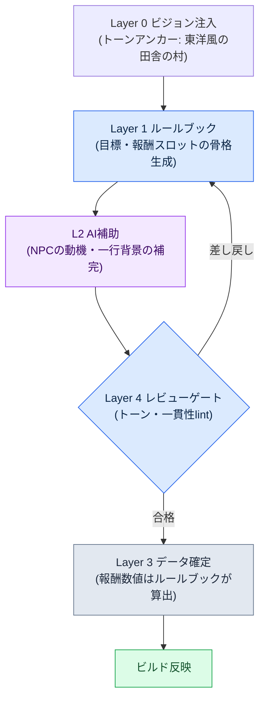

# 6.1 プロシージャルコンテンツ生成とAI — 二つの軸が交差する一マス

月曜の朝の企画会議。ホワイトボードに一行が書かれています。「リリースまでにサイドクエスト1,000本」。誰かが電卓を叩きます。ライター1人が1本に1日をかけると4年。5人がかりでも1年近くかかります。部屋の空気が重くなります。24年間この部屋に座り続けてきた私は、この数字を前に人々がいつも同じ二手に分かれることを知っています。一方は「分量を減らそう」と言い、もう一方は「ツールで量産しよう」と言います。そして決定は、ほぼ毎回その両方でした。

プロシージャルコンテンツ生成（Procedural Content Generation、以下PCG）は、その「ツールで量産しよう」側の古くからの答えです。ダンジョンの部屋配置、武器オプションの組み合わせ、敵スポーンプールは、20年前からルールブックと確率テーブルで自動化されてきました。新しいのはPCGそのものではなく、自然言語・画像・物語が入る場所にLLMと生成モデルが載ってきたという点です。

ただし本書で語ろうとしているのは、「AIをPCGに付けましょう」ではありません。それは誰でもやります。問題は*どこに*付けるかです。コンテンツの一かたまりを置いて、それが自動化のどの強度と、構造のどの層で出会うのかを一つのマスとして確定しないと、ツールはあるのに居場所がない状態になります。本章では、その一マスを座標として描く方法、そしてそのマスの上でコンテンツ一つが実際にパイプラインを一巡する様子を見ていきます。

---

## 6.1.1 PCGが止まっていた場所

伝統的なPCGは決定論に強い領域です。同じ入力には同じ出力が返り、検証が可能です。ダンジョンの部屋グラフ、武器オプションのprefix・suffix、敵スポーン分布は、だからこそ早くから定着しました。「炎の剣+5」は20年前にも自動で出ていました。

問題は、常にその次の場所でした。部屋は配置されても、部屋の中のNPCの名前・外見・短い背景はライターの手に残りました。「炎の剣+5」は出てきても、「王が失った最後の剣」という一行は出てきませんでした。クエストジェネレーターが目標と報酬の組み合わせを出してくれても、「なぜこのクエストをやるのか」は人が書いていました。

規模の大きいゲームでは、この場所が常にボトルネックでした。量産可能な領域と人手が必要な領域の比率はおよそ4対6で、その人手側の6が日程の大半を食っていました。量産ラインが4の側を速く作っても、6の側が追いつかなければ、サイクル全体がその速度に縛られます。

LLMと画像モデルが入ってくる場所が、まさにそこです。ルールブックが扱えなかった自然言語・物語・ビジュアルの領域まで、量産可能な範囲が広がります。だからといって、その場所を丸ごとAIに渡すのが答えではありません。AIは毎回少しずつ違う答えを出し、コンテキストが空だと「一般的なRPGの平均値」を吐き出します。だから*結合点*の設計が必要です。結合点は、二つの座標軸で定義されます。

---

## 6.1.2 一つ目の軸：自動化強度（L0〜L3）

縦軸は、人とルールブックとAIを*どんな比率で混ぜるか*です。私が働くとあるMMORPG開発会社（以下「プロジェクトA」）では、四段階に区切って使っています。

**L0 — 完全手作業。** すべての文字・決定が人の手から生まれます。メインクエストの本文、シグネチャーキャラクターのセリフ、分岐エンディング。一貫性と物語の深さがゲームのアイデンティティに直結する場所です。

**L1 — ルールブック自動化。** 伝統的なPCGの場所です。ルールブック・確率テーブル・BSPのような決定論アルゴリズムが出力を作り、人はチェックだけを行います。ダンジョンの部屋配置、武器オプションの組み合わせ、敵スポーンが代表例です。

**L2 — ルールブック+AI補助。** ルールブックが骨格を組み、AIがディテールを埋めます。サイドクエストのシノプシス、一般NPCの名前・短い背景、狩場の紹介文。人は入力メタデータと最後のレビューゲートだけに責任を持ちます。

**L3 — AI優先+人によるレビュー。** AIが本文を作り、人はレビューだけに入ります。魅力的ですが、非決定性・ハルシネーション・一貫性毀損のリスクがすべてここに集まります。

核心はL2です。L1の安定性とL3の量産力を組み合わせ、二つの領域の短所は検証ゲートで防ぎます。L3は早く導入したくなる誘惑が大きいのですが、レビュー負担が膨れ上がって1〜2四半期のうちに廃棄される事例を何度も見てきました。100本のうち70本が要確認項目として上がってくるなら、人が最初から100本書くほうが安上がりです。

---

## 6.1.3 二つ目の軸：Layer構造（L0〜L4）

縦軸だけでは、量産ラインは回りません。コンテンツ*そのもの*が層に分解されていてこそ、自動化が入り込む場所が生まれます。これが第5部で扱ったLayer分解であり、コンテンツ分野における横軸です。五つの階層がそれぞれプロシージャル生成における一つの役割（アンカー・ルールブック・本文・数値・ゲート）に対応するという一般論は§2.3.6で扱ったため、ここではコンテンツ量産ラインにそのまま当てはめます。Layer 0のビジョンはトーン・世界観のアンカー（生成のたびに注入）、Layer 1のシステムは生成ルールブック（規則・確率テーブル・タグ体系）、Layer 2のコンテンツは生成結果が積み上がる本文の場所（サイドクエスト・NPCの背景・都市の紹介文）、Layer 3のデータは数値・ID・関係（報酬・スポーン・カーブ）、Layer 4のビルド・QAは検証ゲート（lint・一貫性チェック・ライターによるレビュー）です。

この二つの軸は、別の話です。縦軸は「人がどれだけ手を入れるか」、横軸は「コンテンツのどの部位か」を語ります。しかし、二つは掛け算でしか意味を持ちません。コンテンツ一つを二つの軸の交差点、すなわち*一つのマス*に確定したとき、初めて「これは誰が、どこを、どう作るのか」が決まります。

---

## 6.1.4 二つの軸を一枚に — 自動化×Layerマトリクス

ここまで文章でほどいてきた二つの軸を、一枚のグリッドとして重ねてみます。横はコンテンツのLayer、縦は自動化強度です。各マスに入ったラベルは、プロジェクトAで実際にそのマスを占めているコンテンツです。色が濃いマスほど、量産ラインの重心に近い場所です。

<svg viewBox="0 0 760 440" xmlns="http://www.w3.org/2000/svg" font-family="sans-serif" font-size="12">
  <rect x="0" y="0" width="760" height="440" fill="#ffffff"/>
  <!-- 軸タイトル -->
  <text x="380" y="22" text-anchor="middle" font-size="14" font-weight="bold">自動化強度(縦) × Layer構造(横)</text>
  <text x="380" y="416" text-anchor="middle" font-weight="bold">→ Layer構造 (コンテンツのどの部位か)</text>
  <text x="18" y="220" text-anchor="middle" font-weight="bold" transform="rotate(-90 18 220)">↑ 自動化強度 (人がどれだけ手を入れるか)</text>
  <!-- 列ヘッダー -->
  <g text-anchor="middle" font-size="11" font-weight="bold">
    <text x="190" y="52">L0 ビジョン</text>
    <text x="310" y="52">L1 システム(ルールブック)</text>
    <text x="430" y="52">L2 コンテンツ(本文)</text>
    <text x="550" y="52">L3 データ</text>
    <text x="670" y="52">L4 ビルド·QA</text>
  </g>
  <!-- 行ヘッダー -->
  <g text-anchor="end" font-size="11" font-weight="bold">
    <text x="124" y="92">L0 手作業</text>
    <text x="124" y="172">L1 ルールブック</text>
    <text x="124" y="252">L2 ルールブック+AI</text>
    <text x="124" y="332">L3 AI優先</text>
  </g>
  <!-- グリッドセル: x=130..730 (5列,120幅) y=60..380 (4行,80高さ) -->
  <!-- 行 L0 手作業 -->
  <rect x="130" y="60" width="120" height="80" fill="#dfe7f3" stroke="#7a93c0"/>
  <text x="190" y="104" text-anchor="middle" font-size="10">トーン一行を直接作成</text>
  <rect x="250" y="60" width="120" height="80" fill="#f4f6fa" stroke="#c8c8c8"/>
  <rect x="370" y="60" width="120" height="80" fill="#eef1f6" stroke="#c8c8c8"/>
  <text x="430" y="98" text-anchor="middle" font-size="10">メインクエスト</text>
  <text x="430" y="112" text-anchor="middle" font-size="10">シグネチャーセリフ</text>
  <rect x="490" y="60" width="120" height="80" fill="#f4f6fa" stroke="#c8c8c8"/>
  <rect x="610" y="60" width="120" height="80" fill="#f4f6fa" stroke="#c8c8c8"/>
  <!-- 行 L1 ルールブック -->
  <rect x="130" y="140" width="120" height="80" fill="#f4f6fa" stroke="#c8c8c8"/>
  <rect x="250" y="140" width="120" height="80" fill="#b9cae6" stroke="#5b78ad"/>
  <text x="310" y="178" text-anchor="middle" font-size="10">ダンジョン部屋配置</text>
  <text x="310" y="192" text-anchor="middle" font-size="10">オプション·スポーン確率表</text>
  <rect x="370" y="140" width="120" height="80" fill="#f4f6fa" stroke="#c8c8c8"/>
  <rect x="490" y="140" width="120" height="80" fill="#eef1f6" stroke="#c8c8c8"/>
  <text x="550" y="184" text-anchor="middle" font-size="10">報酬カーブ算出</text>
  <rect x="610" y="140" width="120" height="80" fill="#f4f6fa" stroke="#c8c8c8"/>
  <!-- 行 L2 ルールブック+AI (重心) -->
  <rect x="130" y="220" width="120" height="80" fill="#f4f6fa" stroke="#c8c8c8"/>
  <rect x="250" y="220" width="120" height="80" fill="#eef1f6" stroke="#c8c8c8"/>
  <text x="310" y="264" text-anchor="middle" font-size="10">生成ルールブック定義</text>
  <rect x="370" y="220" width="120" height="80" fill="#7fa0d4" stroke="#385583"/>
  <text x="430" y="258" text-anchor="middle" font-size="10" font-weight="bold" fill="#ffffff">サイドクエスト骨格</text>
  <text x="430" y="274" text-anchor="middle" font-size="10" fill="#ffffff">NPC短い背景·紹介文</text>
  <text x="430" y="289" text-anchor="middle" font-size="9" fill="#ffffff">★ 重心</text>
  <rect x="490" y="220" width="120" height="80" fill="#f4f6fa" stroke="#c8c8c8"/>
  <rect x="610" y="220" width="120" height="80" fill="#eef1f6" stroke="#c8c8c8"/>
  <text x="670" y="264" text-anchor="middle" font-size="10">lint·一貫性チェック</text>
  <!-- 行 L3 AI優先 -->
  <rect x="130" y="300" width="120" height="80" fill="#f4f6fa" stroke="#c8c8c8"/>
  <rect x="250" y="300" width="120" height="80" fill="#f4f6fa" stroke="#c8c8c8"/>
  <rect x="370" y="300" width="120" height="80" fill="#e6ddec" stroke="#a98ec0"/>
  <text x="430" y="344" text-anchor="middle" font-size="10">パッチノート草案</text>
  <rect x="490" y="300" width="120" height="80" fill="#f4f6fa" stroke="#c8c8c8"/>
  <rect x="610" y="300" width="120" height="80" fill="#eef1f6" stroke="#c8c8c8"/>
  <text x="670" y="344" text-anchor="middle" font-size="10">ライターレビューゲート</text>
</svg>

このグリッドが本章の核心です。散文として散らばっていた「メインはL0」「サイドはL2」「報酬はルールブック」といった判断が、*一つの座標*に集まります。会議で新しいコンテンツが議題に上がったら、「これはどのマスか」という一つの質問で済みます。マスが決まれば、そのマスの縦座標が「誰が手を入れるのか」を、横座標が「どの部位なのか」を教えてくれます。

グリッドを読んでいると、二つのことが目に入ります。第一に、重心（濃いマス）はL2行×Layer 2列にあります。サイドクエストの骨格・NPCの背景がその場所です。量産ラインの心臓部です。第二に、一つのコンテンツが一つのマスにだけあるわけではありません。サイドクエストは本文（Layer 2）がL2のマスにありますが、その報酬数値（Layer 3）はL1のマスへ下ります。同じクエストでも、*部位ごとに違うマス*に住んでいます。これが、二つの軸を分離しておいた理由です。

---

## 6.1.5 一つのマスの上で回るミニパイプライン

重心のマス — L2行×Layer 2列、サイドクエストの骨格 — の上で、コンテンツ一つが実際に一巡する様子を見ます。流れは次のとおりです。



この流れを、ワークド・トランスクリプトで一度たどってみます。田舎の村のおつかいクエストを一つ作るとしましょう。

**ステップ1 — Layer 1のルールブックが骨格を出します。** ルールブックは決定論です。スロットを埋めただけの形で出てきます。

```
[クエスト骨格 — ルールブック出力]
地域: 향촌_3
依頼人役割: 薬草採り
目標タイプ: 収集(薬材 x6)
妨害要素: 狼スポーン(夜)
報酬スロット: { gold: ?, exp: ?, item: 採集鎌 }
```

**ステップ2 — AIにディテールを依頼します。** プロンプトの全文は次のとおりです（Layer 0のビジョンをコンテキストとして先に入力します）。

> あなたは東洋ファンタジーの田舎の村を舞台にしたMMORPGのクエストライターです。トーンアンカー：「素朴だが迷信と恐れが底に流れる田舎」。以下の骨格を受け取り、依頼人の動機一行とNPCの名前、そしてプレイヤーに見える依頼文二文を書いてください。報酬数値は絶対に作らないこと（システムが決めます）。出力はJSON。
> 骨格：{ 地域: 향촌_3, 依頼人: 薬草採り, 目標: 薬材6個の収集, 妨害: 夜の狼, 報酬アイテム: 採集鎌 }

**ステップ3 — Claudeの生の出力。**（要約せず、そのまま載せます）

```json
{
  "npc_name": "삼월 어멈",
  "motive": "夜ごとの狼の遠吠えで薬草畑が荒らされ、最後の薬材を採りに行く気力が出ない。",
  "quest_text": "夜になると狼どもが薬草畑を荒らしていくのじゃ。怖くて足がすくんでしもうて、山すその薬材六株だけ、わしの代わりに採ってきてくだされ。",
  "reward": { "gold": 120, "exp": 300 }
}
```

ここで立ち止まって見るべきものがあります。AIは`reward`フィールドを、*指示していないのに*作って入れました。これこそが、1軸と2軸がなぜ分離されるべきかをそのまま見せてくれます。報酬数値（Layer 3）はL1ルールブックの場所であって、AI（L2）の場所ではありません。AIにそれを任せると、呼び出しのたびに数字が揺れて、報酬カーブが崩れます。

**ステップ4 — 人による検証・拒否。** レビュー担当者は二つのことを行います。(1) `reward`フィールドを*削除*します — これはルールブックが埋めるマスです。(2) トーンを見ます。NPC名「삼월 어멈」（サムウォル・オモム、「三月ばあさん」の意）、動機の一行、依頼文の二文は村のトーンに合っています。合格です。もしAIが「魔法使いギルドの依頼」のような世界観の外の単語を入れていたら、ここで差し戻して骨格の段階に戻します。

**ステップ5 — Layer 3のデータ確定。** 削除された報酬スロットを、ルールブックが埋め直します。地域レベル・目標難易度に紐づいた決定論の公式です。`gold: 85, exp: 240`。AIが勝手に吐いた120・300ではなく、カーブに合った値が入ります。

この一巡が、重心マスの標準サイクルです。ルールブックが骨格、AIが肉付け、人がゲート、ルールブックが再び数値。コンテンツ1,000本が、すべてこのサイクルを回ります。マスが決まっているので、毎回「これは誰が作るのか」を議論し直すことはありません。

---

## 6.1.6 マスを決めるときに投げる五つの質問

新しいコンテンツをグリッドのどのマスに置くかを決めるには、五つの質問が役に立ちます。会議で量産の議題が上がるたびに書き留めて一緒に答えてみると、マス配置の一貫性が1四半期のうちに定着します。

一つ、量産の負担はどれほどか。リリースまでにN本必要か。Nが100を超えると、L0行はほぼ不可能です。

二つ、一貫性の要求はどれほど大きいか。コンテンツ間の一貫性が体験の核心ならレビューゲート（Layer 4）が強くなければならず、多様性が核心なら、より上の行へ行く余地があります。

三つ、非決定性を許容できるか。毎回少しずつ違う結果が豊かさを生む領域なのか、同じ結果が信頼の核心である領域なのか。

四つ、レビューコストはどれほどか。コンテンツ1本あたり5分なのか30分なのかが、運用サイクルの長さを決めます。

五つ、事故が起きたときのコストはどれほどか。廃棄・書き直しが自由なのか、一度世に出たらユーザーに影響する事故に直結するのか。

サイドクエストにこの五つを投げると、答えは一方向に集まります。1,000本以上（L0不可）、一貫性はメインより低い、非決定を許容、レビューは5〜10分、事故コストは低い（個別廃棄が可能）。五つの答えが揃うので、L2行×Layer 2のマスが自然です。同じ五つをメインクエストに投げると、正反対に集まります。50本、一貫性・物語の深さは最高、非決定は不許可、レビューコストは大きい、事故コストは非常に大きい — L0のマスです。

---

## 6.1.7 よくある四つの落とし穴

グリッドを描いておいても、はまる落とし穴は似ています。四つが繰り返されます。

第一に、**L3行から始めるケース。**「AIが勝手に100本」という期待で出発すると、レビューが爆発的に増えます。L1のマスを先に定着させ、L2へ上がり、L3は一部にだけ慎重に。先ほどのミニパイプラインで報酬フィールドを人が消したあの一動作が、L3行がなぜ危険なのかを小さく見せてくれます。

第二に、**ルールブックなしで丸ごとAIに委任するケース。**「サイドクエストを100本作って」は、一般的なRPGの平均値を呼び込みます。Layer 1のルールブックが骨格を先に組み、AIがその上で肉付けをしてこそ、「私たちのゲーム」のコンテンツが生まれます。ルールブック一冊を書く仕事は、PCGで最も手間がかかり、最も面白くない作業ですが、これを飛ばすと、その上のすべての量産が平均値に沈み込みます。

第三に、**レビューゲート（Layer 4）が空のケース。** AIの出力が自動でビルドに反映されると、一貫性インシデントに直結します。どのマスであれ、人のゲートは必須です。

第四に、**コストだけを見てツールを決めるケース。** LLM APIのコストは四半期ごとに下がりますが、一貫性インシデントのコストは下がりません。ツールの決定は、APIコストに一貫性・レビュー時間の合計を加えて見ます。

---

## 6.1.8 測定 — 重心のマスへ移した6か月

プロジェクトAでサイドクエストをL0のマスからL2のマスへ移した後、6か月を測定しました。以下の数値のうち絶対値は著者の推定（未検証）であり、変化の方向と比率が実測で観察された部分です。

| 項目 | L0の時期 | L2転換後 |
|---|---|---|
| ライター1人あたりクエスト1本の作成 | 約4時間 | 約50分（メタ30分+AI 5分+レビュー8分） |
| 週あたりの量産 | 5本 | 30〜40本 |
| 廃棄率 | ほぼ0% | 約20% |
| 一貫性インシデント（四半期あたり） | 3〜5件 | 5〜8件（補強後は正常） |
| ライター満足度（10点満点） | 8 | 6 → 7（ポリシー補強後） |

廃棄率は20%に上がりましたが、量産速度が6〜8倍なので、正味のスループットは4〜5倍に増えました。一貫性インシデントは四半期あたり5〜8件へと小幅に増えましたが、レビューゲートとルールブックの補強で、四半期のうちに正常範囲へ戻りました。

最も大きな変化は、数字ではなく人でした。最初はライターたちが「量産のレビュー係」になった気分だと言い、満足度が8から6に落ちました。これを回復するために、メインクエストとシグネチャーサイドクエスト（都市あたり1〜2本）にライターの時間を明示的に保証するポリシーを挟みました。量産ラインがライターの時間を吸い上げるのではなく、その時間をメインへ送り返すツールになるよう、はっきり決めたのです。6か月後、満足度は7に戻りました。

この測定から持ち帰るべきことは一つ。マスを移す決定は、スループット・ライターの時間配分・満足度が一緒についてこなければなりません。スループットだけを見れば量産は成功ですが、人は去っていきます。

---

## 6.1.9 Layer分解が先、PCGはその上に

Layer分解がプロシージャル生成の前提だという一般論は§2.3.6にあります。ここでは、それがPCGグリッドの上でどう現れるかだけを見ます。横軸（Layer 0〜4）が曖昧なチームでは、どのマスも安定して回りません。Layer 0のビジョンがどこにあるか分からなければ、ジェネレーターごとにトーンアンカーが空になって一般的なRPGの平均値が出てきますし、Layer 1のルールブックとLayer 2の本文が一つのファイルに混ざっていれば、規則一行を直すたびに本文の数十か所を一緒に触らなければならず、Layer 3のデータが本文に書き込まれていれば、報酬カーブの一度の調整にライターが1週間を使います — 先ほどのミニパイプラインで報酬を別のスロットとして切り離しておいた理由が、これです。

だからPCG導入の前に点検すべきは、ツールの選択ではなく、*横軸が分解されているか*です。5層が揃ったチームでL1のジェネレーターを付けるコストは、ライター1人の1四半期分です。5層が混ざったチームで同じ導入をすると、2四半期のうちに一貫性インシデントで廃棄されます。

最初から五つのマスが完璧である必要はありません。分離は漸進的に、インターフェースは狭く。最初の四半期にはLayer 0のトーン一行とLayer 1のルールブック一冊だけを切り離しておくだけでも、ジェネレーターが入る場所が開きます。だからといって、無限に先送りしてよいという意味ではありません。Layer 2の本文とLayer 3のデータが最後まで一かたまりのままなら、次章の具体的なツールも居場所を持てません。

---

## 6.1.10 次章のプレビュー

次章では、このグリッドの重心マスを占める具体的なツールを一つ解剖します。都市別の狩場を量産する`proj_city_hunting_generator`です。入力メタデータ・ルールブックの骨格・AI本文・検証ゲートが一つのサイクルにどう束ねられるのか、本章のミニパイプラインが実際のツール規模でどう大きくなるのかを見ます。

---

### 本章のポイント
- 自動化強度（縦L0〜L3）とLayer構造（横0〜4）は、掛け算でしか意味を持ちません。
- 量産ラインの重心はL2行×Layer 2のマス、サイドクエストの骨格です。
- 横軸の分解が先で、PCGはその上の一マスでだけ回ります。

---

## やってみよう — コンテンツ一つを一つのマスに載せる

**setup.** 量産候補のコンテンツを1種類選んでみましょう（例：サイドクエスト）。Layer 0のトーン一行と、Layer 1のルールブック骨格（スロット定義）を別ファイルとして切り離しておきます。報酬数値のスロットは、ルールブック側に空けておきます。

**prompt.** ビジョンをコンテキストとして入力した後に骨格を渡し、「報酬数値は作らないこと、出力はJSON」を明示しましょう。先ほどのステップ2のプロンプトを、そのまま変形して使えば大丈夫です。

**verify.** 三つを確認しましょう。(1) AIが報酬フィールドを勝手に入れていたら削除します（L3はルールブックの場所です）。(2) 世界観の外の単語があれば、骨格の段階へ差し戻します。(3) 合格分だけ、ルールブックが報酬数値を埋めてビルドに入れます。

**一人ミニ版。** チームがなくても大丈夫です。自分でルールブック一冊（スロット5個）とトーン一行だけを、テキストファイルとして作ってみましょう。クエスト10本を先ほどのサイクルで回してみて、レビューで何本を差し戻すか数えてみてください。差し戻し率が30%を超えるならマスが間違っているということなので — ルールブックの骨格をより細かくするか、一つ下の行（L1）へ下げてもう一度見てみましょう。差し戻し率が安定すれば、それが自分の規模でそのマスが機能しているという合図です。
