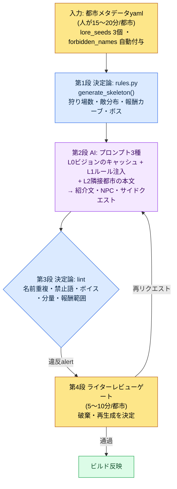

# 6.2 city_hunting_generator — 30の都市を4週間で作る

> 想定読者：コンテンツ量産を担うMMORPGプランナー（中規模（10〜50人）チーム）
> ソロ/趣味の読者向け縮小版：§6.2.10「一人ならここまで」

リリースまでに30の都市が必要だというスケジュール表を初めて受け取った日の計算を、いまだに覚えています。1つの都市は、紹介文5〜10行、狩り場3〜5か所、狩り場ごとに5〜10人のNPCと2〜3本のサイドクエスト、特産アイテム1〜3種、都市ボス1体で構成されます。手作業で1つの都市を作り込むと1〜2週間かかります。30都市なら、シナリオライター1人が6か月を丸ごと都市だけに費やす計算です。

ところが、その6か月はありませんでした。ライターの時間はメインクエストとシグネチャーキャラクターに割かれており、30の都市はその作業と並行して進める必要がありました。「AIに30の都市を作ってもらえばいいのではないか」という最初の衝動は、すぐに崩れました。丸ごと任せると、互いによく似たファンタジーの村が30個出てくるのです。本章では、その衝動の代わりに作ったツール`city_hunting_generator`が、入力・ルールブック・AI・検証の4段階をどのように1つのサイクルにまとめたのか、そしてそのサイクルを実際に最後まで1回回すと何が出てきて何が破棄されるのかを見ていきます。

> **著者の実運用メモ**
> 本章の`city_hunting_generator`は、著者が会社のR&Dフォルダで運用している実際のツールを匿名化したものです。ファイル名・コード構造・検証項目は実際のツールを忠実に写し、都市名（silvermarkなど）・会社固有の名称は書籍用に置き換えました。出力本文は実際のセッションを再構成したものです。

---

## 6.2.1 人はメタデータと最後のレビューだけを行う

ツールの全体フローは4段階です。要は、第1段と第3段が決定論（ルールブック）で、AIなのは第2段だけだという点です。ルールブックが骨格と検証を両側から押さえていれば、間に挟まったAIが毎回少しずつ違う答えを出しても、都市間の一貫性は揺らぎません。人が関わるのは、最初の入力（メタデータ）と最後のゲート（レビュー）だけです。



この図で人の手が入る場所は2か所だけです。一番上でメタデータ1ページをきれいに入れる場所と、一番下でlintには拾えないトーンや物語の判断を下す場所。その間の退屈な骨格生成と本文量産は、ルールブックとAIが回します。決定的な設計は、lint（第3段）が違反を見つけても自動では破棄せず、ライターゲート（第4段）にalertを上げるだけにしている点で、その理由は§6.2.5で見ます。

---

## 6.2.2 入力 — 都市メタデータ1ページ

ライターは都市1つにつきメタデータを1ページ書きます。作成時間は15〜20分。短いですが、この1ページが続く3段階の入力のすべてです。

```yaml
# city_021_silvermark.meta.yaml
city_id: city_021_silvermark
region: west
climate: cold_arid
dominant_faction: scholar_guild
cultural_tone: scholarly_strict
level_range: [25, 30]
lore_seeds:
  - 100年前に魔法封印の中心地だった
  - 封印弱体化の最初の兆候がこの都市で観測された
  - 学者ギルド本部の所在地
neighbors: [city_018, city_023]
# forbidden_names: (スクリプトが自動付与 — ライターの入力は不要)
```

もっとも重要なスロットは`lore_seeds`です。3〜5個の中核となる出来事が都市のアイデンティティを決めます（silvermarkの例では「100年前に魔法封印の中心地だった」「封印弱体化の最初の兆候がこの都市で観測された」「学者ギルド本部の所在地」の3つです）。少なすぎるとAIはありきたりなファンタジー都市を吐き出し、多すぎると出来事同士が矛盾します。著者の経験では、3個がもっとも安定していました。

`forbidden_names`はライターが記入しません。既存の都市・キャラクター名のリストをスクリプトが読み込み、メタデータに自動付与します。30都市 × 平均50人のNPCが積み上がると、1,500個の名前の重複を人の頭で検査するのは不可能だからです。「他の都市のNPCと被らないようにして」と毎回手で書く必要はありません。

---

## 6.2.3 第1段ルールブック — 決定論で骨格を作る

ルールブックはメタデータを受け取り、都市の構造骨格を作ります。コードは単純です。

```python
# city_hunting_generator/rules.py (骨格)
def generate_skeleton(meta):
    region_rules = REGION_RULES[meta.region]
    hg_count = region_rules.hunting_grounds_range.sample()
    enemy_dist = ENEMY_RULES[meta.climate][meta.dominant_faction]

    skeleton = {
        "hunting_grounds": [
            {
                "id": f"{meta.city_id}_hg_{i}",
                "level": meta.level_range[0] + i,
                "enemy_types": enemy_dist.sample(k=3),
                "reward_curve": calc_reward(meta.level_range[0] + i),
                "npc_count": region_rules.npc_per_hg,
                "sidequest_count": region_rules.sidequest_per_hg,
            }
            for i in range(hg_count)
        ],
        "boss": {
            "id": f"{meta.city_id}_boss",
            "level": meta.level_range[1] + 2,
            "pattern": BOSS_PATTERNS[meta.region],
        },
    }
    return skeleton
```

結果は決定論的です。同じメタデータを入れれば同じ骨格が出てきます。報酬カーブがregion・levelごとの標準範囲内にあるか、敵分布がclimate・factionのルールに合っているかがコードで保証され、リグレッションテストで捕捉できます。この段階は絶対にAIに任せません。報酬カーブをAIが呼び出しのたびに違う数字で出してきたら、都市間のバランスがその場で崩れるからです。

silvermarkのメタデータを入れると、`rules.py`は狩り場4か所（`city_021_silvermark_hg_0`〜`hg_3`）、各狩り場にNPCスロット6枠・サイドクエストスロット3枠、そしてレベル32のボス1体という空の骨格を返します。まだ名前も本文もない、埋めるべき枠の表です。その枠を埋めるのが第2段AIの仕事です。

---

## 6.2.4 第2段AI — 自然言語の本文生成

ルールブックが骨格を作ったあと、AIがその上に自然言語の本文を埋めていきます。都市紹介文、NPCの名前・外見・短い背景、サイドクエストのシノプシス、特産アイテムのフレーバーテキストがここで生まれます。

呼び出しパターンは、コンテキスト注入の4層構造そのままです。L0ビジョン（world_premise + tone_manifesto）をキャッシュし、L1ルール（city_naming_rule + region_west_lore）を選択注入し、L2隣接本文（他都市のNPC名リスト）を加え、最後に作業指示を付けます。都市紹介文のプロンプトは、そのままコピーして使える形です。

```
[L0 コンテキスト] world_premise + narrative_pillar + tone_manifesto  (キャッシング)
[L1 コンテキスト] city_naming_rule, region_west_lore
[入力] city_021_silvermark.meta.yaml + lore_seeds 3個

この都市の紹介文を6~8行で書いて。lore_seedsの3つすべてを自然に織り込み、
「平和な村」のようなRPGの常套句は抜きで。トーンは学者的かつ厳格に、感傷は抑制。
本文のみ、前置きや解説なしで。
```

このプロンプトの指示内容は、「この都市の紹介文を6〜8行で書くこと。lore_seedsの3つすべてを自然に織り込み、『平和な村』のようなRPGの常套句は排すること。トーンは学者的かつ厳格に、感傷は抑制。本文のみで、前置きや解説は不要」というものです。

同じパターンが、NPC量産、サイドクエストの呼び出しにもそのまま繰り返されます。違いはコンテキストと出力形式だけです。NPCの呼び出しには`forbidden_names`（他都市のNPC名との重複禁止）スロットが入り、サイドクエストの呼び出しには「依頼主のNPCは上で生成したNPCの中から選ぶこと」という制約が入ります。

では、実際に何が出てくるのか。一度最後まで回してみます。

---

## 6.2.5 1サイクルを最後まで — 出力・検証・破棄

抽象的に「AIが本文を埋める」とだけ書いたのでは、このツールが実際に何を吐き出すのかは分かりません。silvermarkという1つの都市のサイクルを、入力から破棄まで一度最後まで追いかけます。

> **[第2段AI出力 — 都市紹介文]（実際のセッションの再構成）**
>
> シルバーマークは封印の都市である。100年前、七人の学者が西方の魔力の氾濫を食い止めるためにこの地の地下に封印陣を築き、都市はその陣の上に石を一枚ずつ重ねて育っていった。学者ギルド本部の鐘楼は封印の脈を読む観測所であって、神に向かう尖塔ではない。ここ3年、観測記録には同じ一行が繰り返し記されている。「脈が冷えていく」。封印弱体化の最初の兆候は、ほかのどこでもない、この都市の計器盤で最初に震えた。街の学者たちはそれを大声では語らない。ただ、鐘楼の火が一晩中消えない日が増えただけである。

ここでは、lore_seedsの3つ（封印の中心地・弱体化の最初の兆候・学者ギルド本部）がすべて本文に盛り込まれ、「冒険者を歓迎する平和な村」のような常套句がなく、scholarly_strictのトーン（感傷の抑制、観測・記録の語彙）が維持されています。これが通過できる出力の姿です。

続いて、同じサイクルが狩り場`hg_0`のNPCスロット6枠のうち3枠を埋めます。

> **[第2段AI出力 — NPC 3人]（実際のセッションの再構成）**
>
> **1) ドレン・ベイル（Doren Vale）** — 鐘楼の観測助手。50代、片目に真鍮の拡大鏡を常時装着。封印の脈の微細な振動を記録する仕事を30年続けている。口数が少なく、数字でしか会話しない。*「今日12.4。昨日12.1。上がっている。良いことじゃない」*
>
> **2) ミラ・コスト（Mira Kost）** — ギルド文書庫の司書。30代、指のインク染みが消えない。封印陣の設計原本を守っているが、その図面を読める学者はもう皆死んだと信じている。外部の人間への警戒心が強い。
>
> **3) グレム（Grem）** — 鐘楼の下の炉番。正体不明、年齢不詳。鐘楼の火を絶やさないことが唯一の仕事で、封印について尋ねる者には「火だけ見ていればいい」とだけ答える。*（あいまいフラグ — AIによる自己申告）*

3人目のNPC「グレム」に、AIが自ら*あいまいフラグ*を付けた点に注目してください。良いプロンプトは、AIが「これは確信が持てません」と言えるようにします。次は、第3段のlintがこの出力一式を検査します。

> **[第3段lint出力]（実際の形式）**
>
> ```
> [PASS] 分量検査: 紹介文7行 (基準6~8)
> [PASS] 報酬範囲: hg_0~hg_3 reward_curve 標準範囲内
> [WARN] 名前重複: "Mira Kost" — city_014_riverholdの"Mira Veldt"と
>        姓(Kost/Veldt)は相違だが名(Mira)が同一。forbidden_names 近接衝突。
> [PASS] 禁忌語彙: tone_manifesto 違反0件
> [WARN] ボイス一貫性: "グレム" の台詞 voice_lint 信頼度0.62 (しきい値0.70未達)
> ```

lintは違反を2件 — Mira Kostの名前の近接衝突（riverholdのMira Veldtとファーストネームが同一）と、グレムの台詞のボイス一貫性（voice_lint信頼度0.62、しきい値0.70未達） — 捕まえましたが、どちらも自動では破棄しませんでした。WARNとしてライターゲートに上げただけです。これが§6.2.1で予告した設計の核心です。チェッカーに自動拒否の権限まで握らせると、ライターたちは1〜2か月もしないうちにそのスイッチを切ってしまいます。機械が意図された変形まで一緒くたに殺し、その境界をライター自身が見極めてみる機会まで奪うからです。だから、疑わしい候補を拾い上げる仕事は機械に任せつつ、その候補を生かすか捨てるかの最後の判断だけは人の手に残しておきます。

> **[第4段 ライターレビュー — 判定と破棄]**
>
> ライターは2件のalertを次のように処理しました。
>
> - **Mira Kost** → 存続。riverholdのMira Veldtと同じファーストネームだが、別の都市、別の姓で、同時に登場する可能性はない。意図的な変形として通過。（ただし、forbidden_namesのルールを「名+姓の完全一致」から「名単独の衝突もWARN」に広げるかどうかは別件としてメモ。）
> - **グレム** → **破棄。** voice_lintの信頼度の低さがシグナルだった。読み直すと、「火だけ見ていればいい」という炉番のキャラクターはscholarly_strictな都市のトーンとずれていた。学者ギルドが支配する都市のNPCが神秘主義のトーンに流れると、都市のアイデンティティがぼやける。破棄して再リクエスト。

ライターが破棄を決めると、再リクエストが1回回ります。「グレムのスロットを破棄する。同じ狩り場の学者ギルドのトーン（観測・記録・厳格）に合う炉番のNPCとして再生成せよ。神秘主義の語彙は禁止」。AIは、鐘楼の炉の温度を記録し、火さえもデータとして見る老人を返してきて、その出力はvoice_lint 0.81で通過しました。入力→骨格→本文→検証→破棄→再生成という1つのサイクルが、ここで閉じます。

この一周が、本書全体のShowの基準です。ツールが何を吐き出し、何が引っかかり、人が何を切り捨てるのかを一度でも最後まで見なければ、「AIで量産した」という文は空虚です。

---

## 6.2.6 破棄率はツールの失敗ではなくゲートのシグナル

上のサイクルではNPCが1人破棄されました。都市全体で見ると、破棄はさらに積み上がります。レビュー時間は都市あたり平均5〜10分、破棄率はNPCが約20%、サイドクエストが約33%です。

この比率の算出根拠を正直に明らかにしておきます。破棄率は、導入初期にsilvermarkを含む5つの都市を直接レビューしながらカウントした値です。NPCはレビューした30人のうち6人を破棄（20%）、サイドクエストはレビューした15本のうち5本を破棄（33%）でした。サンプルが5都市と小さいため、精密な母集団の比率ではなく、「5つに1つ、3つに1つ」程度の方向値として読むのが正しいです。30都市すべてをレビューし終えたあとの累積比率は、これより低くなることも、狩り場の性格によって高くなることもありえます。

重要なのは、破棄率0%が目標ではないという点です。破棄0%は、レビューが形だけで流れたというシグナルに近いのです。5人のNPCのうち1人がトーンの不一致で破棄され、3本のサイドクエストのうち1本がlore_seedsと噛み合わず再生成されるとき、レビューゲートは実際に機能しています。

---

## 6.2.7 計測 — 30都市を4〜5週間で

ツール導入の前後を比較します。下の時間の数値はsilvermarkを含む初期都市群の実測平均で、「導入前」の列はツール以前の手作業期のライターによる推定です。加工した数字はありません。

| 項目 | 導入前（手作業） | 導入後（実測） |
|---|---|---|
| 都市1つの作成時間 | 1〜2週間 | 約30分（メタ15分 + AI 5分 + レビュー8分） |
| 30都市の総期間 | ライター1人で6か月級 | 4〜5週間 |
| 破棄率（NPC） | —（全量直接作成） | 約20%（30人中6人） |
| 破棄率（サイドクエスト） | — | 約33%（15本中5本） |
| 一貫性の事故（都市あたり） | ほぼなし | 0〜1件 |

表だけ見ると数字がすべてのようですが、実際の効果は別のマスから生まれました。都市の量産に縛られるはずだったライターの時間が解放されたことで、ライター1人が四半期あたりのメインクエストの産出を大きく増やせました（正確な倍率は四半期ごとに変わるため断定しません — 方向としては「メインの産出が明確に増えた」です）。量産ツールがライターの時間を吸い取るのではなく、解放するツールとして機能したのです（ライターが「レビュー機械」になったと感じるとツールが拒否される、という§6.1.8の警告がそのまま当てはまります）。

---

## 6.2.8 generatorに入れないコンテンツ

自動化の幅が広がっても、次のものはツールの外に置きます。

| コンテンツ | ツールの外に置く理由 |
|---|---|
| メインクエスト本文 | 一貫性・物語の深さがゲームのアイデンティティに直結 |
| ボスのパターン・演出 | 視覚・インタラクションのディテールが多く、デザイナーが直接やるほうが速い |
| シグネチャーメインキャラクター | voice_profileのフル作成が必要で量産不可 |
| 分岐エンディング | ライターが直接決める領域 |
| 都市ごとのシグネチャーサイドクエスト1〜2本 | ライターが選んで直接作る |

量産できるという事実が、量産すべきだという決定に自動的につながってはいけません。silvermarkのサイクルで見たように、ツールはNPC 6人のうち5人まではうまく量産します。しかし、その都市の「封印が冷えていく」という核心の緊張を背負うシグネチャーNPCの1人は、ライターが直接作り込みます。自動化の境界が明確であれば、量産ツールはむしろその核心領域を守るツールになります。

---

## 6.2.9 よくある5つの失敗

| 失敗パターン | なぜ失敗するか | 処方 |
|---|---|---|
| lore_seedsを1〜2個しか書かない | AI出力が平均的なRPGに平準化される | 3個以上を強制（§6.2.2） |
| ルールブックなしでAIに丸ごと量産を依頼 | 「都市を30個作って」→似たような村が30個 | 第1段のルールブックは省略できない（§6.2.3） |
| lintなしでライターレビューだけに依存 | レビュアーが細かいルール違反の処理に時間を消耗 | まず1次の自動検証を（§6.2.5） |
| 命名の重複チェック漏れ | 1,500人の名前の重複チェックは人の頭では不可能 | forbidden_namesの自動付与（§6.2.2） |
| ライター満足度を計測しない | 処理量は増えてもライターの時間を奪えば拒否される | メインコンテンツの時間を明示的に保証（§6.2.7） |

5つ目がもっとも見落とされがちです。silvermarkのグレムを破棄したような判断をライターが楽しんで下せるためには、ライターに量産のレビュー以外に、自分の手で作り込む時間が残されていなければなりません。処理量だけ計測してライターの時間の計測を省くと、ツールはKPI上は成功しても、人は去っていきます。

---

## 6.2.10 やってみよう — 今日できる一歩

> **一人ならここまで**：ルールブックのコードはなくてもかまいません。自分のゲーム（または好きなゲーム）の都市・地域を1か所選び、§6.2.2の形式のメタデータを手で書き（lore_seeds 3個が核心です）、§6.2.4の紹介文プロンプトをそのまま貼り付けて一度回してみましょう。出てきたNPCの中からトーンの合わない1人を自分で選び、「このNPCは都市のトーンとずれている。破棄してやり直し」と反論してみると、レビューゲートがどんな判断の束なのかが体で分かります。

チームであれば、次の一歩から始めてみましょう。メタデータのyamlフォーマット1枚と`forbidden_names`の自動付与スクリプトから作ります。ルールブックの骨格（`generate_skeleton`）とlintはその次です。入力フォーマットと名前の重複チェックの2つがあるだけでも、AIの本文量産が「似たような村30個」に崩れていく2つのよくある失敗を先に防げます。

---

## 6.2.11 次章の予告

6.3では、NPC Persona/Squadパイプラインを扱います。6.2のgeneratorがドレンやミラのようなNPCを個別に量産するのに対し、Persona/SquadはそのNPCたちをグループ単位で束ねます。1つの狩り場の5人のNPCが、互いに無関係な人形の集まりではなく、小さな社会として機能するようにする方法です。

---

### 本章のポイント
- 第1・3段はルールブック（決定論）、AIは第2段だけ — 人は入力とレビューゲートのみ。
- 出力・検証・破棄を一度最後まで見て初めて、「AI量産」が空虚でなくなる。
- 破棄率20・33%はツールの失敗ではなく、ゲートが機能しているシグナル。

### 次章のプレビュー
- 6.3. NPC Persona/Squadパイプライン
