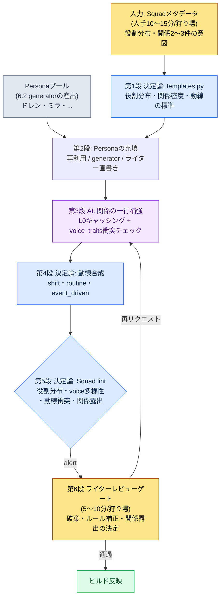

# 6.3 NPCのPersonaとSquad — 人形博物館から小さな社会へ

> 主な読者: NPC・狩り場コンテンツに責任を持つMMORPGプランナー（中規模（10〜50人）チーム）
> 一人・趣味の読者向けミニ版: §6.3.10「一人ならここまで」

6.2のgeneratorで一つの狩り場にNPCを5人量産し、ゲーム内に並べてみた日のことを覚えています。名前・外見・短い背景はすべて埋まっていて、座標だけ打って配置しました。ところが、実際にその狩り場を歩き回ってみると、妙に死んでいました。5人が同じ空間にいるのに、互いに一度も言及しません。2人が同じ岩の上に重なって立っていました。誰かが商人の役割を担う必要があったのに、5人全員が学者でした。ドレンもミラも、個別にはまともなNPCだったのに、束ねてみると人形の寄せ集めでした。

これが人形博物館の状態です。個々のNPCは全部作ったのに、グループとして生きていません。本章では、その5人を小さな社会として束ねるパイプラインを扱います。中心となる分解はPersonaとSquadです。オフィスにたとえると、Personaは社員個人の名刺で、Squadは一つのチームの組織図です。名刺を50枚積み上げても、組織図がなければ会社は回りません。そして本章の背骨は最後の段階、すなわち束ねたグループが「互いに知り合いのように話し、動くか」をAIと一サイクル最後まで検証する場面です。

> **著者による実運用メモ**
> 本章のSquadパイプラインは、著者が会社のR&Dフォルダで運用しているNPC Persona/Squadツールを匿名化したものです。yaml構造・検証項目・voice_lintのしきい値は実際のツールを忠実に移し、都市・NPCの名前は6.2と同じく書籍用に置き換えています。出力本文は、実際のセッションを再構成したものです。

---

## 6.3.1 Personaは名刺、Squadは組織図

Personaは個々のNPCのアイデンティティです。名前・外見・voice_profile・役割を持ちます。6.2のgeneratorが作るのがPersonaです。ドレン・ベイル、ミラ・コストが、それぞれ一つのPersonaです。

Squadは、そのPersonaたちをグループとして束ねる単位です。一つの狩り場に5人がどんな役割で分布し、互いにどんな関係で、どう動くのかを定義します。

| 単位 | 含む内容 | 作る主体 |
|---|---|---|
| Persona | 名前・外見・voice_profile・役割 | generator（6.2） |
| Squad | 役割分布・関係・動線 | Squadパイプライン（本章） |

この二つを分離しないと、二つの問題が同時に詰まります。Personaだけを量産すれば人形博物館になり、Squadから作ろうとすれば埋めるPersonaがありません。分離すれば、各単位の運用がシンプルになります。ただし、分離は断絶ではありません。要は二つの単位の間に再利用・検証の経路を敷いておくことで、それが本章の本論です。

このPersona→Squad分解は、単なる整理ではなく、もっと先へ進む道を開きます。NPCグループが役割・関係・数値として定型化されていてこそ、のちにワールド状態（プレイヤー行動の蓄積）がNPCの数値を揺らし、その数値がクエストの発現条件になる動的な反応性まで進めます。本章ではその進歩的適用の入口に触れるだけにとどめ、正面からは「人がレビューする保守的な量産」までを扱います。

---

## 6.3.2 入力 — Squadメタデータ1ページ

Squadの骨格は、狩り場1か所につきメタデータ1ページから始まります。6.2の都市メタデータと同じ思想です。人は役割分布と関係の意図だけを決め、埋める仕事はルールブックとAIが担います。

```yaml
# city_021_hg_3.squad.yaml
squad_id: city_021_hg_3_squad
hunting_ground: city_021_silvermark_hg_3
type: hunting_ground_residents
size: 5
roles:
  - role: quest_giver
    count: 1
    voice_traits: [authoritative, scholarly]
  - role: lore_keeper
    count: 1
    voice_traits: [scholarly, withdrawn]
  - role: merchant
    count: 1
    voice_traits: [practical, dry]
  - role: bystander
    count: 2
    voice_traits: [varied]
relationships:
  - between: [quest_giver, lore_keeper]
    type: mentor_and_former_student
  - between: [merchant, bystander_1]
    type: regular_customer
movement_pattern: stationary_with_shifts
```

最も重要なスロットは`relationships`です。関係が0件なら、5人は最後まで赤の他人のままです。関係が多すぎると（5人に5件以上）、ユーザーが覚えることが増えて、かえって埋もれます。著者の経験では、5人のSquadに核心となる関係2〜3件が最も安定しています。`voice_traits`は、5人が互いに異なる声を持つようにするための装置です。5人全員を`scholarly`で埋めると、検証段階でvoiceの平準化として弾かれます。

---

## 6.3.3 第1段・第2段 — ルールブックの骨格とPersonaの充填

まず、ルールブックがSquad骨格の標準を決めます。狩り場のregion・typeごとに、サイズ・役割分布・関係密度・動線パターンのデフォルト値がコードに入力されています。

```python
# npc_squad/templates.py (抜粋)
SQUAD_TEMPLATES = {
    ("west", "hunting_ground_residents"): {
        "size_range": (4, 6),
        "role_distribution": {
            "quest_giver": 1,
            "merchant": 1,
            "lore_keeper": (0, 1),
            "bystander": (1, 3),
        },
        "relationship_density": 2,        # 推奨される関係数
        "movement_pattern": "stationary_with_shifts",
    },
    ("east", "outpost_squad"): {
        "size_range": (3, 4),
        "role_distribution": {
            "commander": 1,
            "scout": 1,
            "support": (1, 2),
        },
        "relationship_density": 1,
        "movement_pattern": "patrol_loop",
    },
}
```

この段階は決定論です。西部の住民Squadでquest_giverだけが5人という事故は、コードのレベルで不可能です。役割分布がルールを外れれば、その場で止まります。

次に、各スロットへPersonaを埋めます。道は三つです。プールに合うPersonaがあれば再利用し（登場ウェイト+1）、なければ6.2のgeneratorで新しく作り、メインクエストの核心人物ならライターが直接書きます。silvermarkのhg_3 Squadでは、quest_giver・lore_keeperを6.2ですでに量産したミラ・ドレンで埋め、merchantとbystander 2人を新しく生成しました。ここまでは6.2のgeneratorサイクルと同じです。本章の本当の仕事はその次、束ねたグループが本当にグループとして機能するかを検証する場面です。

---

## 6.3.4 一サイクルを最後まで — 関係補強・動線・一貫性検証

抽象的に「AIが関係を補強する」とだけ書いても、このパイプラインが何を吐き出すのかは分かりません。silvermark hg_3 Squad一つの後半サイクルを、関係テキストの生成から破棄・再リクエストまで、一度最後まで追いかけます。

### 第3段 — AIによる関係補強

Squad骨格に入力された関係タグ（`mentor_and_former_student`）は抽象のままで、ゲーム内では見えません。これを一行の描写に変えてNPCのセリフ・イベントに埋め込むのが第3段です。プロンプトは、そのままコピーして使える形です。

```
[L0 コンテキスト] world_premise + tone_manifesto  (キャッシング)
[L1 コンテキスト] city_021_silvermark.lore (学者ギルド支配, scholarly_strict)
[Persona 1] quest_giver — ミラ・コスト、ギルド文書庫の司書、30代、インクの染み
[Persona 2] lore_keeper — ドレン・ベイル、鐘楼の観測補助、50代、数字でしか話さない
[関係タグ] mentor_and_former_student

この二人（師匠–かつての弟子）の関係を、ゲームのセリフに使う背景として1~2行だけ描写して。
ドレンは数字、ミラは文書 — 二つの口調がぶつからないように。トーンは厳格な学者風で、
神秘主義や「古い友人」のような常套句は抜いて。本文のみ。
```

> **[第3段 AI出力 — 関係の一行]（実際のセッションを再構成）**
>
> ドレンは20年前、ミラに封印陣の観測記録の表記法を教えた。今は立場が逆転し、ドレンが測定した数値を、ミラが文書庫の帳簿に書き写している。二人は毎週火曜日、観測値と帳簿が食い違う一マスをめぐって短く言い争う。

この出力は良い出来です。`mentor_and_former_student`が具体化され、ドレンの「数字」とミラの「文書」が衝突せずに一つの場面（数値を帳簿へ書き写す）に束ねられ、scholarly_strictのトーンも維持されています。同じプロンプトが、merchant–bystander_1の`regular_customer`関係にも繰り返されます。

### 第4段 — 動線合成

NPCが一日中同じ場所に立っていれば、また人形に戻ります。ルールブックが動線パターンを埋めます。stationaryは1か所固定（警備・ボス）、stationary_with_shiftsは8時間ごとに位置を微調整（一般）、routine_loopは時間割ベース（住民）、event_drivenはトリガー時のみ移動（クエストNPC）。これは決定論なので、AIは呼びません。

### 第5段 — Squad一貫性lint（このパイプラインのゲート）

ここで、束ねた5人が本当にグループとして機能するかを叩きます。6.2のlintが個々のNPCを見たのに対し、このlintはグループの一貫性を見ます。

> **[第5段 Squad lint出力]（実際の形式）**
>
> ```
> [PASS] 役割分布: quest_giver 1 · lore_keeper 1 · merchant 1 · bystander 2 (ルール充足)
> [PASS] 関係密度: 2件 (推奨 2, 充足)
> [WARN] voice多様性: scholarly系列 3/5 — quest_giver·lore_keeper·bystander_2
>        のvoice_profileコサイン類似度 0.83 (しきい値 0.80 超過)。平準化リスク。
> [WARN] 動線衝突: 14:00~16:00 区間 merchant·bystander_1 座標半径 1.5m 重複
> [FAIL] 関係露出: 関係2件が定義されたが、5人のセリフのどこにも他メンバーへの言及 0件。
>        関係がデータにのみ存在 — ゲーム内可視性 0。
> ```

lintが3件を拾いました。3件とも自動では破棄せず、ゲートに上げます — 疑わしい候補は機械が拾い上げ、生かすか捨てるかは人が決めるという、§6.2.5と同じ設計です。

> **[第6段 ライターレビュー — 判定と破棄]**
>
> ライターは、alert 3件を次のように処理しました。
>
> - **voiceの平準化（WARN）** → bystander_2を破棄。学者の都市とはいえ、5人全員が学者口調では狩り場が単調になります。bystander_2を`practical, dry`トーンの雑用係として再生成をリクエスト（quest_giver・lore_keeperが二人とも学者なのは都市のアイデンティティなので維持）。
> - **動線衝突（WARN）** → ルール補正。merchantのshift開始オフセットを+2時間ずらして14:00の重複を解消。AI呼び出しなしで動線パラメーターのみ調整。
> - **関係露出0（FAIL）** → 最も重要な件。関係を2件も定義しておきながらゲーム内で一度も見えないなら、そのデータは死んだデータです。ライターは核心の関係1件（ドレン–ミラ）を選び、セリフに埋め込むことを決定。

3件のうち2件はルール・再生成で閉じ、最後のFAILがこのパイプラインの核心です。ライターは、ドレンの会話分岐を一行追加するようリクエストしました。

```
ドレンのセリフに、ミラとの関係がさりげなくにじむ一行だけ差し込んで。
説明調ではなく脇道で。学者風のトーン、セリフ一行のみ。
```

> **[再リクエストの出力]**
>
> *「あの図面は文書庫にある。ミラに聞いてくれ。……20年前は私があの子に読み方を教えた側だったが、近ごろは逆でな。」*

この一行が入った瞬間、二人のNPCの関係がマスターデータからゲーム画面へ移ってきます。入力（Squadメタ）→骨格→Personaの充填→関係補強→動線→一貫性検証→破棄・露出の決定という一サイクルが、ここで閉じます。

この一周が、本章のShow基準です。「SquadでNPCを社会として束ねた」という文は、関係露出0件のFAILを人が一行のセリフで閉じる場面を一度でも見なければ、空虚です。

---

## 6.3.5 Persona→Squadの全体フロー

上のサイクルを、一枚の図として載せておきます。要点は、第1・2・4・5段が決定論（ルールブック・lint）で第3段だけがAIだという点、そして人の手は最上部の入力と最下部のゲートにしか触れないという点です。



人の手が触れる場所は二か所だけです。最上部で役割・関係の意図を決める場面と、最下部でlintが拾えないトーン・ナラティブを判定する場面。その間の骨格・動線・検証はルールブックが、関係の本文はAIが回します。

---

## 6.3.6 関係をゲームに見えるようにする三つの装置

第5段lintの`관계 노출`（関係露出）項目が、最も頻繁にFAILになります。関係がデータの中だけで生きているからです。関係をゲームの中へ引き出す装置は三つです。

第一に、**セリフでの言及**。§6.3.4のドレンのセリフのように、NPCが他のメンバーに一行だけ触れます。最も安く、最も効果が大きい方法です。

第二に、**動線の交差**。毎週火曜日にドレンとミラが文書庫に一緒にいる場面が、ゲーム内で観察されます。ユーザーが偶然見かければ「あの二人、何かあるのか」と気づきます。第4段の動線と関係が一致していれば、自然に生まれます。

第三に、**分岐条件**。quest_giverの頼みを断ると、lore_keeperの好感度も一緒に下がります。この第三の装置が、§6.3.1で述べた進歩的適用の入口です — 関係が単なる描写を超えて、ゲームの状態に影響を与え始める場面です。

三つの装置をすべて使う必要はありません。5人のSquadで核心の関係2〜3件だけを第一・第二の装置で露出させるだけでも、狩り場の体感は大きく変わります。やりすぎると、ユーザーが覚えることが増えます。ライターはレビュー段階で露出させる関係を選んで差し込み、残りはデータのままにしておきます。

---

## 6.3.7 測定 — 正直に

ツール導入の前後を比較します。加工した数値は使いません。時間・比率はsilvermarkを含む初期の狩り場数か所を直接レビューしながらカウントした値で、「導入前」の列は手作業時代のライターの推定です。

| 項目 | 導入前（手作業・推定） | 導入後（実測） |
|---|---|---|
| 狩り場1か所のSquadを束ねる | 約3〜4時間 | 約25分（メタ12分 + AI 5分 + レビュー8分） |
| 関係露出（セリフ・動線）の件数 | 狩り場あたり0〜1件 | 核心2〜3件のうち露出1〜2件 |
| 動線衝突（同じ座標に2人以上） | 狩り場あたり2〜3件 | lintで事前に遮断、0〜1件 |
| voice平準化による破棄 | —（チェックなし） | 5人中0〜1人を再生成 |

サンプルが狩り場数か所と小さいため、精密な母集団の比率ではなく、方向性を示す値として読むのが正しい姿勢です。最も大きな変化は、表には載りません。lintの`관계 노출`FAILが強制的にライターへ「この狩り場、関係が一つも見えません」を突きつけるため、量産物が人形博物館のままリリースされることが構造的に減りました。破棄0%・露出0件が目標ではないという点（§6.2.6）は、ここでも同じです。Squadが束ねる仕事の大部分を吸収しつつも、ドレンの最後のセリフ一行のような核心は、ライターが直接練り上げる時間が残っていなければなりません。

---

## 6.3.8 Personaプール — 同じ人物が複数の都市に現れたら

Squadが安定すると、自然についてくる運用がPersonaプールです。同じPersonaが複数の都市に登場できます。学者ギルド所属のNPCに都市3〜4か所で出会うのは、むしろ自然です。世界が狭く見えるのではなく、つながって見えます。

```yaml
persona_pool:
  - id: persona_doren_vale
    voice_traits: [terse, numeric]
    appearance_count: 3
    appearance_cities: [city_021, city_018, city_023]
    signature: false
  - id: persona_mira_kost
    voice_traits: [scholarly, withdrawn]
    appearance_count: 2
    signature: false
```

再利用比率には、健全な範囲があります。

| 再利用比率 | 状態 |
|---|---|
| 20%未満 | NPC分量の爆発的増加、識別の負担 |
| 30〜50% | 健全な運用範囲 |
| 70%以上 | NPCのマンネリ化、多様性の損傷 |

ただし、一つのNPCをあまりに多くの都市に登場させると「この人、また出てきた」になります。一つのPersonaの最大登場都市数は、5か所と上限を置きます。ボス部屋・シグネチャー人物は再利用禁止（`signature: true`）。同じPersonaの2回目の登場からは、視覚的なバリエーション（ライト・小道具）を強制します。この30〜50%という範囲は精密な数値ではなく、運用ガイドラインです — チーム・ゲームの規模に応じて補正が必要です。

> **[方向標識 — ペルソナプールを分布として見るなら（まだ時期尚早）]** プールが数百NPCまで育ったチームなら、一歩先へ進む方向があります — §8.2.7の「次元ベクトル」の節と同じ位置づけの方向標識です（処方ではありません — 概念の直観は付録M）。§6.3.4のvoice_lintは、すでに二つのPersonaのコサイン類似度（0.83のような値）で「近さ」を見ています。同じ埋め込みをプール全体にかければ、マンネリ化をライターの印象ではなく分布密度で診断できます — 「学者口調が一角に群れている」状態が、その領域の点密度として見えます。そうすれば、低密度領域に「また似たような学者」を新しく置く代わりに、近い二つのPersonaの間を補間したバリエーションで多様性を埋める道が開けます。ただし、同じ呼吸で添えるべき注意点が二つあります。補間で生成したPersonaは、二つのNPCをぎこちなく混ぜた「死んだ中間値」になりやすく、結局は人がvoiceをもう一度生かし直すことになります。そして上のマンネリ化比率（30〜50%）は精密値ではなく運用ガイドラインなので、それを埋め込み距離に換算した瞬間、緩さが精密なふりをして隠れる危険があります — 距離の値はライターの判定を助ける信号であって、判定そのものではありません。

---

## 6.3.9 よくある六つの失敗

| 失敗パターン | なぜ失敗するか | 処方 |
|---|---|---|
| Personaだけ量産してSquadを無視 | NPC 50人が全員いるのに狩り場が死んでいる | Squad骨格のルールブック導入（§6.3.3） |
| 役割分布ルールなしの自由生成 | 商人だけ5人、学者0人のような分布事故 | role_distributionの強制（§6.3.3） |
| 関係タグだけ置いて一行描写を省略 | 関係が抽象のままゲームに見えない | 第3段のAI関係補強（§6.3.4） |
| 関係露出のチェックなし | 関係を定義してもセリフ・動線への露出0件 | 第5段の`관계 노출`lint（§6.3.4） |
| 動線衝突チェックの欠落 | 同じ時間に同じ場所へ2人、リリース後に頻発 | 座標・時間帯の自動チェック（§6.3.4） |
| 再利用比率0%または70%+ | 0%は量産の爆発、70%+はマンネリ化 | プール運用 + 登場上限（§6.3.8） |

四つ目が、最も見落とされやすい失敗です。関係を定義する仕事と、関係をゲームに見えるようにする仕事は別の作業で、チェックがなければほぼ必ず後者が抜けます。silvermark hg_3でlintが関係露出0件をFAILとして突きつけなかったら、ドレンとミラはマスターデータの上でだけ師弟関係だったでしょう。

---

## 6.3.10 やってみよう — 今日できる一歩

> **一人ならここまで**: ルールブックもlintもなくて構いません。自分のゲーム（または好きなゲーム）の一つの場所にいるNPC 3〜5人を選び、§6.3.2の形式で役割と関係2件を手で書いてみましょう。次に§6.3.4の関係補強プロンプトをそのまま貼り付けて一行の描写を受け取り、最後に自分へ問いかけてみてください — 「この関係はいま、ゲームのセリフのどこに見えているか？」。一か所もなければ、それがまさにlintの`관계 노출 0` FAILです。NPC一人のセリフに他のメンバーへの一行を差し込み、そのFAILを手で閉じてみると、Squad検証が何を拾う作業なのか、体で分かります。

チームなら、次の一歩から始めましょう。Squadメタデータyamlの様式1枚と、第5段lintのうち**`관계 노출`チェック1行**から作ります（各NPCのセリフテキストに、他のメンバーの名前・役割が登場するかをgrep）。役割分布チェック・動線衝突チェックはその次です。関係露出チェックが一つあるだけでも、量産した狩り場が人形博物館のままリリースされるという最もよくある失敗を、先に防げます。

setup → prompt → verifyで要約すると — **setup**: Squadメタyamlに役割・関係を定義し、templates.pyで骨格を組みます。**prompt**: §6.3.4の形式で関係の一行を受け取りつつ、voice_traitsの衝突禁止・常套句禁止を強制します。**verify**: 第5段lintを回して`관계 노출`FAILを確認し、核心の関係1件をセリフに埋め込んで自分で閉じます。

---

### 本章のポイント
- Personaは名刺、Squadは組織図 — 分離してこそ、人形博物館が社会になります。
- 関係補強・動線・一貫性検証を一度最後まで見てこそ、「社会として束ねた」が空虚になりません。
- `관계 노출 0`（関係露出0）のFAILを人が一行のセリフで閉じることが、このパイプラインの心臓です。

### 次章のプレビュー
- 6.4 コンテンツ量産ワークフロー — Persona・Squad・都市生成を1週間サイクルにまとめる
