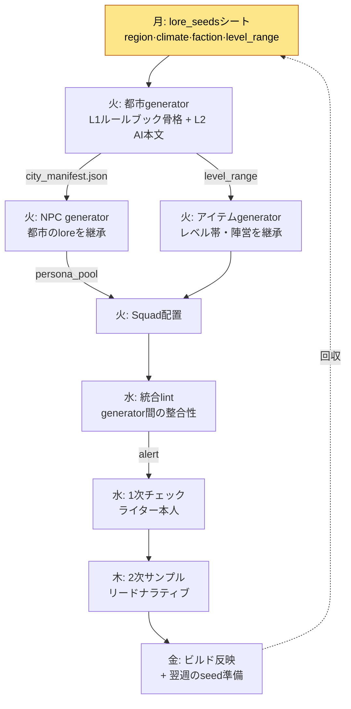

# 6.4 コンテンツ量産ワークフロー — 複数のgeneratorを1本のラインにまとめる

3つのツールをそれぞれ完成させたその週、私は一度に都市generatorを回し、NPC generatorを回し、アイテムgeneratorを回しました。3つとも、それぞれは問題なく動いていました。都市は7か所、NPCは110人、武器は60個が生成されました。ところが数日後、チェックの席に着いてようやく、同じ落とし穴を3回踏んでいたことに気づいたのです。

都市`port_harman`は「没落した漁村（몰락한 어촌）」として生成されたのに、その都市に配置されたNPCたちのペルソナは「繁栄する貿易港の裕福な商人（번성하는 무역항의 부유한 상인）」でした。都市generatorとNPC generatorが、互いに異なるlore_seedsを見ていたからです。アイテムgeneratorは、その都市の推奨レベルが12〜18なのに、レベル40の伝説武器をショップに並べていました。3つのツールはそれぞれ正しく、まとめられていなかったがゆえに間違っていたのです。

本章は、ツールを1つ作る話ではありません。6.2の都市generator、6.3のNPC Squad、そしてアイテムgeneratorを**1本の生産ラインにまとめる**運用の話です。ツールが3つなら落とし穴も3つになる、のではありません。落とし穴はツールとツールの隙間から新たに生まれるのです。

---

## 6.4.1 生産ラインという視点

都市・NPC・アイテムのgeneratorを別々に回すと、各ツールの出力が他のツールの入力と食い違います。解決策はツールをより賢くすることではなく、**共有メタデータを上流で一度確定し、その下にツールを並ばせる**ことです。6.2 ch2の都市generatorが単一ツールの模範だとすれば、本章はそのツールをラインの1ステーションへと格下げする作業です。

ライン全体はこう流れます。



鍵となるのは`city_manifest.json`という矢印です。都市generatorは都市を作りながら、その都市のアイデンティティ（没落した漁村なのか、繁栄する貿易港なのか）をmanifestとして書き出し、NPC generatorとアイテムgeneratorが**そのmanifestを入力として受け取ります**。私があのとき踏んだ落とし穴は、この矢印がなかったことが原因です。ツールをまとめるとは、ツールとツールの間にこの1行の契約を入れることなのです。

---

## 6.4.2 ツールをまとめる1行の契約 — manifest

都市generatorが都市を1つ作るたびに一緒に吐き出す`city_manifest.json`の実際の形はこうです。このファイルがNPC・アイテムgeneratorの入力になります。

```json
{
  "city_id": "port_harman",
  "display_name": "ハルマン港",
  "lore_seeds": ["没落した漁村", "古い交易の残響", "塩不足"],
  "region": "南部沿岸",
  "dominant_faction": "漁民ギルド",
  "level_range": [12, 18],
  "tone": "衰退·粘り強さ",
  "forbidden_names": ["ハラン", "ハルメン"],
  "neighbors": ["salt_marsh", "old_pier"]
}
```

NPC generatorは`lore_seeds`と`tone`を継承して、「没落した漁村の粘り強い人々」を作ります。アイテムgeneratorは`level_range`を継承して、12〜18レベルの武器だけを並べます。`forbidden_names`はすでに隣の都市で使われた名前なので、双方が避けます。3つのツールが、同じ1枚の契約書を見るのです。

このmanifestを作るときに私がClaudeに与えたプロンプトは次のとおりです。量産ラインの上流をまとめる最も重要な1回の呼び出しなので、全文をそのまま載せます。

> あなたはMMORPG都市generatorのmanifest作成器です。以下のライターのメタデータを受け取り、city_manifest.jsonを生成してください。
>
> ライター入力:
> - city_id: port_harman
> - lore_seeds: 몰락한 어촌, 옛 무역의 잔향, 소금 부족
> - region: 남부 연안
> - level_range: 12-18
>
> 規則:
> 1. dominant_factionはlore_seedsから推論すること。ただし隣の都市（salt_marsh、old_pier）の陣営と重複してはならない。隣の都市の陣営は[염전 조합, 밀수단]である。
> 2. forbidden_namesには、すでに隣接都市で使用されたNPC名・地名を入れること。提供リスト: [하란, 하르멘]。
> 3. toneは2語以内。lore_seedsと矛盾しないこと。
> 4. 推測した値とライターが明示した値を区別して表示すること。

Claudeの生の出力はこうでした。要約せず、そのまま載せます。1か所で規則を破っています。

> ```json
> {
>   "city_id": "port_harman",
>   "display_name": "ハルマン港",
>   "lore_seeds": ["没落した漁村", "古い交易の残響", "塩不足"],
>   "region": "南部沿岸",
>   "dominant_faction": "密輸団",   // ← 推論: 塩不足 + 古い交易 = 密貿易
>   "level_range": [12, 18],
>   "tone": "衰退·強欲",
>   "forbidden_names": ["ハラン", "ハルメン"],
>   "neighbors": ["salt_marsh", "old_pier"]
> }
> ```
> （推論した値: dominant_faction、tone、display_name / ライター明示: その他）
> 注意: dominant_factionを「밀수단」に選びましたが、規則1で隣の都市old_pierがすでに「밀수단」です。規則違反です。代替候補として「어민 길드」を提案します。

ここで重要なのは、AIが自ら規則違反を報告したという点です。「밀수단（密輸団）」はlore_seeds（塩不足・古い交易）から見れば魅力的な推論ですが、**ライン全体の視点では衝突**です。隣の都市がすでに密輸団なのです。私はAIの提案を受けて、`dominant_faction`を「어민 길드（漁民ギルド）」に、`tone`を「쇠락·끈질김（衰退・粘り強さ）」に修正しました。「탐욕（強欲）」は密輸団という前提から出てきた単語なので、漁民ギルドには合いませんでした。

この一度の検証・拒否・再指定が、ラインの上流を守ります。manifestが間違っていれば、その下のNPC 110人と武器60個が、すべて間違った前提の上に生成されます。上流で5分を使えば、下流で3時間を節約できるのです。

---

## 6.4.3 統合lint — ツールとツールの隙間を検査する

単一generatorのlintは、自分の出力しか見ません。都市lintは都市がルールブックを守ったかを見て、NPC lintはペルソナがvoiceの一貫性を守ったかを見ます。しかし、私が最初に踏んだ落とし穴は**各ツールの中ではなく、ツールとツールの間**にありました。だからラインには、単一lintの上にもう1層が必要です。都市・NPC・アイテムを一緒に読み、相互に検証する統合lintです。

統合lintが実際に捕まえる項目はこうです。

| 検査 | 何を比較するか | あのとき見逃したもの |
|---|---|---|
| ロア整合 | city.lore_seeds ↔ npc.persona | 漁村なのに裕福な商人 |
| レベル帯整合 | city.level_range ↔ item.required_level | 12〜18の都市にレベル40の武器 |
| 陣営衝突 | city.faction ↔ neighbor.faction | 密輸団の都市が2つ隣接 |
| 名前重複 | 全city・npc・itemの名前プール | forbidden_namesの未収集 |

この統合lintを回したときの実際の出力の一部です。自動破棄はしません。人が判定できるように、alertを上げるだけです。

> ```
> [統合lint] port_harman ライン検査 — 3 alert
>
> ALERT-1 (ロア整合) port_harman
>   city.lore_seeds = ["没落した漁村", ...]
>   npc[merchant_04].persona = "繁栄する貿易港の裕福な商人"
>   → 矛盾の可能性。意図された変形か確認が必要。
>
> ALERT-2 (レベル帯整合) port_harman
>   city.level_range = [12,18]
>   item[blade_legend_07].required_level = 40
>   → 推奨レベル帯超過 28。ショップ配置の再検討。
>
> ALERT-3 (名前重複) — 情報
>   npc[fisher_02].name = "ハラン"
>   city.forbidden_names = ["ハラン", ...]
>   → forbidden_namesと衝突。NPC名の再生成を推奨。
> ```

ALERT-1を見て、私は少し考え込みました。NPCが「繁栄する貿易港の裕福な商人」であることが、無条件に間違いだとは限りません。**かつて栄え、いまは没落した**都市なら、「かつて裕福だった、いまは貧しい商人」はむしろ良い物語です。そこで私はALERT-1を破棄ではなく「意図された変形」と判定したうえで、NPCのペルソナを「かつて栄えた貿易港の面影にすがる老いた商人」へと1行修正するよう依頼しました。ALERT-2は明白な事故なので、武器を削除しました。ALERT-3は名前だけ再生成しました。

自動lintが事故を防いだのではありません。自動lintは事故を**人の目の前に引きずり出し**、判定は人が下しました。これが6.1で述べたL2（ルールブック+AI補助）の核心です。AIが骨格とalertを作り、人が最後の判定をします。ALERT-1のように「間違っているように見えて、実は良い物語」を見分けることは、ルールブックにはできません。

---

## 6.4.4 1週間サイクルでラインを回す

ツールをまとめたら、次に必要なのはリズムです。ラインは1週間単位で回すのが最も安定していました。1週間という長さは、チェックが急増しない程度に短く、回収が滞らない程度に長いのです。私の机のカレンダーの1マスともかみ合います。

| 曜日 | ラインのステーション | ライターの時間 |
|---|---|---|
| 月 | lore_seedsシート作成（manifestの上流） | 半日（5〜7都市 × 15〜20分） |
| 火 | 都市→NPC→アイテムgeneratorの連鎖実行 | ライターの介入なし |
| 水 | 統合lint + 1次チェック（本人） | 1時間（5〜10分/都市） |
| 木 | 2次サンプルチェック（リードナラティブ） | 2〜3分/都市 |
| 金 | ビルド反映 + 翌週のseed準備 | 短時間 |

火曜日がラインの心臓です。都市generatorがmanifestを書き出すと、NPC generatorがそれをくわえ、アイテムgeneratorがそれをくわえ、Squadが配置まで行います。この連鎖が、ライターの介入なしにバックグラウンドで回ります。ライターはその間、メインクエスト（L0完全手作業）を書きます。ツールをまとめた本当の報酬がここにあります。ツールがばらばらなら、ライターは火曜日に3回手を入れなければなりませんが、まとまっていれば一度も触れずに済みます。

ライター1人が、1週間に都市5〜7か所、それに付随するNPC・武器まで量産します。4週間で都市20〜28か所。30か所という目標に、6週間で到達しました。

---

## 6.4.5 ラインの健全性 — 毎週見る4つの指標

ラインが健全かどうかは、印象ではなく数字で見ます。毎週自動集計される4つの指標です。

| 指標 | 正常範囲 | 逸脱時のシグナル |
|---|---|---|
| 統合lint通過率 | 80〜95% | 60%未満ならmanifestの上流が壊れている |
| generator間の衝突 | 都市あたり3〜5件 | 10件以上ならgenerator間の契約が壊れている |
| 人のチェックによる破棄率 | 10〜20% | 30%以上なら量産パラメータが間違っている |
| ライター1人のサイクル時間 | 5日 | 7日以上なら認知負荷が過大 |

最もラインらしい指標は2つ目の、**generator間の衝突件数**です。単一ツールだけを使っているときには、この数字は存在しません。この数字が突然10件を超えたら、ツールが1つ壊れたのではなく、**ツール間の契約（manifest）が壊れた**のです。たいていは、都市generatorのmanifestスキーマを変更したのに、NPC generatorが古いスキーマを読んでいるときに起きます。この指標がなければ、その事故はリリースまで見えません。

4つの指標は毎週、四半期の振り返りへ入力されます。傾向が悪化したら、翌週の量産都市数を5〜7か所から3〜5か所に減らし、原因を調べます。

---

## 6.4.6 ラインが崩れる3つの事故

複数のツールをまとめると、単一ツールにはなかった事故が生まれます。よく見た3つを記しておきます。

**第一に、契約不一致の事故。**都市generatorのmanifestに新しいフィールドを追加したのに、NPC generatorがそのフィールドを知らない。generator間の衝突指標が急増します。ツールを別々に開発していると、片方だけ更新されがちです。対応は、manifestスキーマに`version`フィールドを入れ、下流のgeneratorがバージョン不一致を即座にalertとして上げるようにすることです。人を責め立てるのではなく、契約を強制します。

**第二に、上流汚染の事故。**manifestが間違った前提で生成されると（§6.4.2の「密輸団」のように）、その下のすべてが汚染されます。人のチェックによる破棄率が30%を超えるのに、破棄された出力を見るとNPC個々の品質には問題がない。個々は問題ないのに、前提が間違っているのです。対応は、manifest生成の段階にチェックをもう1つ入れることです。下流の110個をチェックするより、上流の1個をチェックします。

**第三に、モデルドリフトの事故。**LLMが自動アップデートされ、出力の特性が変わります。都市・NPC・アイテムの3つのgeneratorが同時に揺らぎます。直近1週間の変更点を点検し、破棄サンプルを5個分析し、プロンプトやコンテキストを調整します。1週間のモニタリングの後、回復を確認します。

3つの事故への共通の対応は同じです。**人を非難せず、契約を補強します。**ライターがlore_seedsを1行しか書かなかったことが原因なら、「3行書いてください」と言う代わりに、manifest lintに強制チェックを追加します。とはいえ、人の責任がゼロという意味ではありません。システムの補強とは別に、事故のパターンは振り返りで共有します。

---

## 6.4.7 ライターの時間はどこへ行くのか

ラインをまとめる本当の目的は、ライターをなくすことではなく、ライターがシグネチャーに集中できるようにすることです。ツールがばらばらのときにライターの時間がどう散らばり、まとめた後にどう集まるのかを、1枚に描いておきます。

<svg viewBox="0 0 640 250" xmlns="http://www.w3.org/2000/svg" font-family="sans-serif" font-size="13">
  <text x="160" y="20" text-anchor="middle" font-weight="bold">導入前 (ツール分離)</text>
  <text x="480" y="20" text-anchor="middle" font-weight="bold">導入後 (ライン統合)</text>
  <!-- before bars -->
  <rect x="40" y="40" width="180" height="28" fill="#1d4ed8"/>
  <text x="50" y="59" fill="#fff">メインクエスト 30%</text>
  <rect x="40" y="72" width="120" height="28" fill="#2563eb"/>
  <text x="50" y="91" fill="#fff">シグネチャー 20%</text>
  <rect x="40" y="104" width="180" height="28" fill="#9ca3af"/>
  <text x="50" y="123" fill="#fff">量産サイドチェック 30%</text>
  <rect x="40" y="136" width="90" height="28" fill="#9ca3af"/>
  <text x="50" y="155" fill="#fff">量産NPC 15%</text>
  <rect x="40" y="168" width="30" height="28" fill="#d1d5db"/>
  <text x="76" y="187" fill="#374151">運営 5%</text>
  <!-- after bars -->
  <rect x="360" y="40" width="280" height="28" fill="#1d4ed8"/>
  <text x="370" y="59" fill="#fff">メインクエスト 50%</text>
  <rect x="360" y="72" width="170" height="28" fill="#2563eb"/>
  <text x="370" y="91" fill="#fff">シグネチャー 30%</text>
  <rect x="360" y="104" width="85" height="28" fill="#9ca3af"/>
  <text x="370" y="123" fill="#fff">チェック 15%</text>
  <rect x="360" y="136" width="30" height="28" fill="#9ca3af"/>
  <text x="396" y="155" fill="#374151">NPC 5%</text>
  <text x="360" y="187" fill="#374151" font-size="12">運営 0% — ラインが吸収</text>
  <text x="40" y="225" fill="#b45309" font-size="12">メイン+シグネチャー 50% →</text>
  <text x="360" y="225" fill="#b45309" font-size="12">メイン+シグネチャー 80%</text>
</svg>

メインとシグネチャーに、ライターの時間の80%が集まります。ただし、この配分はひとりでに維持されるものではありません。ラインを導入すると、ライターの時間がチェックへすべて流れていく傾向があります。そこで毎月時間配分を測定し、メインが50%を下回ったら量産都市数を減らして、メインの時間を回復させます。時間配分はポリシーとして守らなければなりません。

---

## 6.4.8 ラインを他のコンテンツへ拡張する

都市・NPC・アイテムのラインが安定したら、同じ骨格をダンジョン・図鑑・ライブイベントへ拡張します。鍵は**新しいパターンを作らない**ことです。「ダンジョンは都市と違うから、別の構造で」という誘惑が常にやってきます。しかし、ラインの骨格（共有manifest → generator連鎖 → 統合lint → 人のチェック）はまったく同じです。入力メタデータの様式と、ドメインのルールブックだけを差し替えます。

ダンジョンなら、`dungeon_manifest.json`に`boss_pattern`・`encounter_flow`のようなフィールドが追加され、ボスの動線といったドメインルールが統合lintに1行加わります。骨格は同じに、ルールだけ違うように。同じ骨格を維持すれば、ライターが新しいツールをまた覚える必要がなく、統合lintのインフラがそのまま再利用できます。ただし、ドメインの特殊性を無視しろという意味ではありません。ダンジョンには、都市にはない動線ルールが間違いなく必要です。

---

## 6.4.9 6か月稼働の結果

私のプロジェクトで、この統合ラインを6か月稼働させた結果です。都市・NPC・アイテムのgeneratorを別々に回していた時期と比較します。以下の絶対値は正確な集計ではなく**著者の推定（未検証）**であり、方向と比率は実測の傾向に従っています。

| 指標 | ツール分離の時期 | ライン統合後 |
|---|---|---|
| 量産都市（6週間） | 18か所 | 28か所 |
| 火曜日のライター介入回数 | 都市あたり3回 | 0回 |
| generator間の衝突（リリース後発見） | 四半期8〜12件 | 四半期2〜4件 |
| ライター1人の四半期あたりメインクエスト | 3本 | 8本 |
| 上流チェック時間 / 下流チェック時間 | 0 / 3時間 | 5分 / 1時間 |

最も重要な変化は最後の行です。ツールが分離していたときは、上流チェックが0で、下流チェックが3時間でした。ラインをまとめてmanifestを上流でチェックするようにしたら、上流の5分が下流の2時間を消しました。事故がツールの隙間から漏れなくなったので、リリース後の整合性事故も四半期8〜12件から2〜4件に減りました。

そして、トレードオフが明示的になりました。以前は「量産は危険だ」という抽象的な論争が四半期ごとに繰り返されていました。いまは「衝突 -8件 / メイン +5本」という具体的な比較の上で意思決定しています。

---

## 6.4.10 よくある失敗7つ

1) ツールをまとめず、別々に回すケース。落とし穴はツールの中ではなく、ツールとツールの間に生まれます。

2) manifestなしでgeneratorをつなぐケース。共有の契約がなければ、下流が上流と食い違います。

3) 統合lintを単一lintで代替するケース。単一lintは、generator間の衝突を見られません。

4) サイクルを5日から3日に圧縮するケース。5日がチェックの安全マージンです。

5) 上流（manifest）をチェックせず、下流をチェックするケース。下流の110個より、上流の1個を見てください。

6) 事故を人の責任だけに帰すケース。契約の補強とルールの自動化が答えです。

7) ラインを整えた後に「使わない」ケース。1週間サイクルを強制することが、ツールと同じくらい重要です。

---

## やってみよう

**setup.** 都市generator（6.2）とNPC generator（6.3）を準備しましょう。2つが共有する`city_manifest.json`のスキーマを1つ決めます。フィールドは最低限`lore_seeds·region·faction·level_range·forbidden_names·tone·version`です。

**prompt.** 本文のmanifest作成器プロンプトをそのまま使ってみましょう。鍵は最後の2つの規則です。「隣の都市の陣営と重複するな」（generator間衝突の防止）と、「推測した値と明示した値を区別して表示せよ」（チェック可能性）。都市を作ったらmanifestを書き出し、NPC・アイテムgeneratorがそのmanifestを入力として受け取るようにつなぎましょう。

**verify.** 統合lintを一度回してみましょう。ロア整合・レベル帯整合・陣営衝突・名前重複の4つを相互に検査します。alertが出たら自動破棄せず、人が判定します。「間違っているように見えて、実は良い物語」（没落した貿易港の老いた商人）を見分けるのは、人の役目です。

**一人ミニ版.** ツールが都市・NPCの2つだけでも、ラインは成立します。スプレッドシート1枚に都市ごとのlore_seeds・level_range・forbidden_namesを書き、NPC generatorのプロンプトにその行をまるごと貼り付けるだけで、manifestの役割を果たします。統合lintは、都市-NPCのロア整合1行だけでも、あの落とし穴を防げます。大げさなインフラがなくても、「ツールとツールの間に1行の契約を入れる」という原則1つで、ラインは始まります。

---

### 本章のポイント
- 落とし穴はツールの中ではなく、ツールとツールの間に生まれます。manifestでその隙間をまとめましょう
- 統合lintは破棄のための装置ではなく、人の目の前に事故を引きずり出す装置です
- 上流の5分のチェックが、下流の2時間のチェックを消します。上流で防ぎましょう
