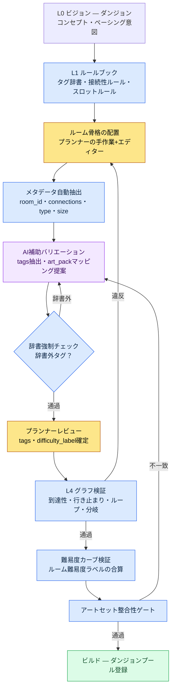

# 7.1 プロシージャルレベルデザインマスター

ダンジョン47番ルームの出口が塞がっていました。ビルドは通過し、QAも通過していました。ユーザーがボスルームの直前で壁を前に立ち尽くしているスクリーンショットがコミュニティに投稿されたのは、ライブ開始から3日目のことでした。そのルームは2四半期前に手作業で作ったルームをコピーして貼り付けたもので、コピーの過程で東側の通路の1本が、接続情報を持たないままビジュアルだけ残っていました。誰もそれを検証しませんでした。検証するツールがなかったのです。

この章は、その事故がビルド段階で自動的に遮断される仕組みを作る話です。核心は、空間を描く手先の器用さではなく、空間に付随するデータをルールで運用するやり方にあります。

---

レベルデザインの仕事場は製図室に近いものです。図面の1枚1枚は人の手から生まれますが、図面同士の一貫性・再利用・検証は、図面キャビネットの運用ルールが決めます。手で描いたダンジョン1個なら誰でも作れます。ダンジョン100個を、一貫した難易度カーブと行き止まりのないグラフで運用するのは、手先の器用さではなくシステムの問題です。

著者が企画ディレクターとして働くプロジェクトA（国内+東南アジア向けMMORPG、中規模（10〜50人）チーム、モバイル優先）で、このシステムの名前は`Procedural_Level_Design_Master`という1つのドキュメントです。この章では、そのドキュメントが何を統合し、AIがどこまで手を入れ、どこで止まるのかを扱います。毎回のランごとにダンジョンが新しく生成されるモバイルローグライトRPGの企画をリードし、プロシージャルな空間をルールで運用してきた経験が、この章の土台にあります。

## 7.1.1 二つの分かれ道 — 空間を作るのか、空間のメタデータを運用するのか

レベル自動化は二つの方向に分かれます。一つは、空間そのものをプロシージャルに生成することです。BSP分割（Binary Space Partitioning、空間を再帰的に二分割してルームを配置する古典的手法）、wave function collapse、ドランクンウォークグリッドのような伝統的PCG（Procedural Content Generation）がここに属します。もう一つは、空間のメタデータ（ルームタグ・接続性・難易度ラベル・イベントスロット）を運用することです。

伝統的PCGは一つ目に強みがあります。ローグライクやサンドボックスのように「毎回新しいマップ」がゲーム性の核心であるジャンルでは、一つ目が正解です。しかしMMORPGは違います。ユーザーは同じダンジョンを数十回周回します。動線を覚えてしまうほど周回します。だからダンジョンは手で磨き上げた固定空間であるべきで、自動化が入る場所は空間そのものではなく、**その空間を運用可能にするメタデータ**です。

メタデータがなぜ運用の背骨なのかは、成果物別に見れば明らかです。

| 成果物 | メタデータがないと |
|---|---|
| 数十個のダンジョンプール | どのルームがどこにあるか検索不能、再利用不能 |
| 難易度カーブの検証 | ルームごとの難易度ラベルがなく、カーブを描けない |
| クエスト・ボス位置の自動配置 | イベントスロットのメタがなく、手動で座標入力 |
| アートチームとの同期 | ルームタイプ→アートセットのマッピングがなく、ビジュアルの不一致 |
| ユーザー動線・滞在時間の測定 | ルームIDベースのテレメトリーが不可能 |

メタデータのないダンジョンは、ビルドは通っても運用ができません。本は山ほどあるのに索引のない図書館のようなものです。この章が「空間メタデータの運用」に集中する理由です。

## 7.1.2 マスタードキュメントは何を統合するのか

`Procedural_Level_Design_Master`は、四つの標準を1つのドキュメントに束ねます。ルームメタデータ様式、ルームタグ辞書、接続性ルール、検証チェックリストです。この四つが散らばっているときに何が起きるかから見てみましょう。プランナー5人がそれぞれ別のファイルで様式を参照すると、`type`フィールドをある人は`combat`、ある人は`Combat`、ある人は`battle_room`と書きます。検索が壊れ、統計が壊れ、最終的に自動化が壊れます。

この四つの標準はLayerで整理すると、それぞれの居場所がはっきりします。様式・辞書・ルールは生成を支配するルールブック（L1）に、生成されたルーム本体はコンテンツ（L2）に、シートの値はデータ（L3）に、検証はビルド・QAゲート（L4）にあります。

<svg viewBox="0 0 720 300" xmlns="http://www.w3.org/2000/svg" font-family="sans-serif" font-size="13">
  <rect x="20" y="20" width="680" height="44" rx="6" fill="#1e3a5f" stroke="#0f1f33"/>
  <text x="36" y="40" fill="#fff" font-weight="bold">L0 ビジョン</text>
  <text x="120" y="40" fill="#cfe2ff">レベルコンセプト・ペーシング意図（不変アンカー、生成・検証に毎回注入）</text>
  <text x="120" y="56" fill="#9fc0e8" font-size="11">— art_pack のトーン、難易度の意図</text>

  <rect x="20" y="76" width="680" height="44" rx="6" fill="#2a5d3a" stroke="#173a22"/>
  <text x="36" y="96" fill="#fff" font-weight="bold">L1 システム</text>
  <text x="120" y="96" fill="#d6f5df">ルールブック — ルームメタ様式 · タグ辞書 · 接続性ルール</text>
  <text x="120" y="112" fill="#a8dcb8" font-size="11">— Master ドキュメントが束ねる場所</text>

  <rect x="20" y="132" width="680" height="44" rx="6" fill="#5d4a2a" stroke="#3a2e17"/>
  <text x="36" y="152" fill="#fff" font-weight="bold">L2 コンテンツ</text>
  <text x="120" y="152" fill="#f5e6cf">メタデータが付与されたルーム本文（生成・磨き上げられた空間）</text>

  <rect x="20" y="188" width="680" height="44" rx="6" fill="#4a2a5d" stroke="#2e173a"/>
  <text x="36" y="208" fill="#fff" font-weight="bold">L3 データ</text>
  <text x="120" y="208" fill="#ead6f5">ルームサイズ・接続シート・イベントスロットID・敵データ</text>

  <rect x="20" y="244" width="680" height="44" rx="6" fill="#5d2a2a" stroke="#3a1717"/>
  <text x="36" y="264" fill="#fff" font-weight="bold">L4 ビルド・QA</text>
  <text x="120" y="264" fill="#f5d6d6">グラフ検証 · 難易度カーブ検証 · アートセット整合性ゲート</text>
</svg>

マスタードキュメントが四つの標準を統合するというのは、「本文を1つのファイルに詰め込む」という意味ではなく、「L1の場所にルールを集める」という意味です。だからこそ、後で出てくる自動化がLayerの境界の上に載せられるのです（分離が崩れると何が起きるかは7.1.11で扱います）。

## 7.1.3 ルームメタデータ様式 — 自動化が取り付く入力の場所

ルーム1つは次の様式に従います。この様式が自動化の入力インターフェースです。

```yaml
room_id: dungeon_021_room_07
dungeon: dungeon_021_silvermark_library
type: combat_room          # combat / puzzle / lore / safe / boss
size: medium               # small / medium / large
difficulty_label: hard_for_level_28
tags: [scholar_theme, vertical_layout, water_hazard]
connections:
  - target_room: dungeon_021_room_06
    type: door
    direction: south
  - target_room: dungeon_021_room_08
    type: passage
    direction: east
event_slots:
  - slot: enemy_spawn_1
    constraints: [scholar_enemy, level_28]
  - slot: lore_object_1
    constraints: [scholar_lore]
movement_complexity: 4     # 1~5
estimated_clear_time_sec: 90
art_pack: scholar_library_v2
```

各フィールドには、1つ以上の自動化の利用先があります。`type`はダンジョンプールの統計と難易度計算に、`tags`は検索・再利用・アートセットマッピングに、`connections`はグラフ検証（行き止まり検査）に、`event_slots`はクエスト・ボスの自動配置に使われます。利用先のないフィールドは様式に入れません。入力コストだけが増えて、価値がないからです。

## 7.1.4 ルームタグ辞書 — 小さく、直交に

タグはメタデータの検索キーです。無限に増殖すると検索が壊れます。引き出しにラベルが200枚も貼られていたら、何がどこにあるのか探せません。だから5カテゴリー×カテゴリーあたり約6個のenum、合わせて約30個で運用します。

| カテゴリー | enum数 | 例 |
|---|---|---|
| theme | 8 | scholar_theme, ruins_theme, forest_theme … |
| layout | 5 | vertical_layout, horizontal_corridor, open_arena … |
| hazard | 6 | water_hazard, fire_hazard, falling_hazard … |
| interaction | 4 | puzzle_required, lever_activation … |
| narrative | 7 | flashback_trigger, dialogue_zone … |

1つのルームでタグ5個を超えないようにします。正常は3〜4個です。新規タグを追加するには、四段階のゲートを通過しなければなりません。四半期あたり5ルーム以上で使われる見込みがあること、既存タグの組み合わせでは表現できないこと、検索・アートセットマッピングでの活用が明確であること、運用1か月後も5ルームを維持していること。最後の条件が核心です。一時的に作ったタグが1回使われて捨てられると、辞書が汚染されます。

## 7.1.5 プロシージャルレベルパイプライン — ルールブックから検証まで

ここまでの標準が一つの流れとしてどうつながるのか。その接続線こそが、この章を支える骨格です。ルールブックから始まり、AI補助のバリエーションを経て、ガードレール検証で終わるパイプラインです。



このパイプラインの三つの性格を押さえておきましょう。第一に、ルールブック（L1）がすべての生成の上流にあります。第二に、AIはルールブックが定義した辞書の中だけでバリエーションを作ります。Fゲートが辞書外の出力を差し戻します。第三に、検証（H・I・J）がビルド直前のゲートとして固定されているため、違反はコードで遮断され、人の注意力には依存しません。47番ルームの事故は、Hゲートがなかったから起きたことなのです。

## 7.1.6 接続性ルール — グラフで検証するガードレール

ルームメタの`connections`フィールドは、ダンジョン全体を1つの有向グラフにします。グラフになれば検証は自動です。

| 検査 | 違反時の処理 |
|---|---|
| 開始ルーム→ボスルームの到達可能性 | ビルド失敗として遮断 |
| 行き止まり（出口1個+non-safe_room） | alert（プランナーが検討） |
| 双方向接続の整合性（A→BがあるのにB→Aがない） | 自動補正 |
| ループ長（2〜3ルームの短いループ） | alert |
| 分岐幅（同時に4個以上の分岐） | プランナーが検討 |

測定スクリプトは次の形です。標準的なグラフアルゴリズム（最長経路・平均出次数・ループカウント・最短経路）の上に、ダンジョンの語彙をかぶせた薄いラッパーです。

```python
# level_graph_metrics.py
def measure(dungeon):
    graph = build_graph(dungeon.rooms)
    return {
        "depth":            longest_path_length(graph),
        "branching_factor": avg_out_degree(graph),
        "loop_count":       count_loops(graph),
        "dead_ends":        count_dead_ends(graph),
        "boss_reachability": shortest_path(graph.start, graph.boss),
    }
```

五つの指標が、他のダンジョンと比較可能な形で出力されます。ダンジョンプールの多様性指標として使います。ただし、指標が多様だからといってダンジョンが面白いという意味ではありません。指標は事故を遮断するためのものであって、面白さを保証するためのものではありません。行き止まり0件は面白さを保証しません。面白さはプランナーのインサイトから生まれ、グラフ検証はそのインサイトが事故に埋もれないよう、底を支えるだけです。

## 7.1.7 ワークド例題 — tags抽出をAIに任せ、却下し、再依頼する

自動化の中で、人が最も手を離したくなるのが`tags`の入力です。ルーム100個にタグを付ける作業は退屈ですし、ルームのスクリーンショットだけでは人間でも迷います。繰り返しが多く、判定基準が明確なこういう仕事こそ、AIがドラフトを支えるのに向いた場所です。この節では、その作業を実際に回したワークフローを、プロンプト、却下されたAIの出力、人による再依頼まで含めて、加工なしで広げます。

**1回目のプロンプト：**

```
[入力]
- ルームのスクリーンショット: (添付)
- ルーム面積: 18m × 12m, 天井高さ 9m (垂直2層構造)
- 配置された敵: scholar_phantom × 3, water_elemental × 1
- 隣接ルームの type: lore_room(西), combat_room(東)
- ルーム内に浅い水たまりあり

このルームに合うタグを3~5個、下の辞書からだけ選んで。辞書外のタグは作らず、
タグの enum だけをカンマ区切りで。

[タグ辞書 30個]
theme: scholar_theme, ruins_theme, forest_theme, cave_theme,
       crypt_theme, swamp_theme, mechanical_theme, celestial_theme
layout: vertical_layout, horizontal_corridor, open_arena,
        maze_layout, bridge_layout
hazard: water_hazard, fire_hazard, falling_hazard,
        poison_hazard, crush_hazard, dark_hazard
interaction: puzzle_required, lever_activation, key_gate, hidden_passage
narrative: flashback_trigger, dialogue_zone, lore_object_zone,
           ambush_setup, ritual_site, vista_point, rest_anchor
```

**Claudeの1回目の出力（生のまま）：**

```
scholar_theme, vertical_layout, water_hazard, ambush_setup, two_story_layout
```

ここで二つの問題がそのまま現れています。一つは、`two_story_layout`が辞書にないタグだという点です。モデルが「垂直2層構造」という入力に引きずられて、辞書外の単語を作り出しました。もう一つは、タグが5個と上限に達しているのに、`vertical_layout`と`two_story_layout`が意味的に重複している点です。layoutカテゴリーで2枠を使ってしまったわけです。

**人による却下の判断。** `two_story_layout`は辞書強制違反なので、自動却下の対象です（パイプラインのFゲート）。`ambush_setup`は判断が分かれます。敵が3体配置されてはいますが、スクリーンショット上で待ち伏せの構図なのか、単純な戦闘ルームなのか曖昧です。これはモデルが過剰解釈した可能性があります。隣接ルームが両方ともlore/combatなので、ナラティブ上の待ち伏せトリガーとしては根拠が弱い。却下です。

**2回目の再依頼：**

```
two_story_layout は辞書になく、vertical_layout と重複してる。外して。
ambush_setup も外して — 敵がいるからといって待ち伏せではない。
// (意図: narrative タグはナラティブ意図が明示されるときだけ。単純な戦闘は type で既に表現済み)
空き枠は無理に埋めなくていい。3~4個が正常。もう一度タグ付けして。
```

**Claudeの2回目の出力：**

```
scholar_theme, vertical_layout, water_hazard
```

今回は3個に減り、すべて辞書の中にあり、カテゴリーの重複もありません。人はこの結果を受け入れました。ルーム様式の`tags: [scholar_theme, vertical_layout, water_hazard]`は、こうして確定します。

このワークド例題の教訓は2行です。第一に、AIは入力の1つのディテール（「2層」）に過剰適合して辞書の外へ出ます。辞書強制ゲートがコードレベルでこれを捕まえなければなりません。第二に、AIは空き枠を埋めようとする傾向があります。「無理に埋めるな」と明示しないと、5枠すべてを埋めようとします。どちらの失敗もよくあるもので、どちらの処方も、プロンプトではなくルールブック（辞書+上限）で強制してこそ安定します。

## 7.1.8 メタデータの量産 — 誰が埋めて、誰がレビューするのか

プランナーがルーム1個のメタを手で埋めると、5〜10分かかります。ダンジョン1個（20〜30ルーム）なら2〜5時間、ダンジョン100個なら200〜500時間です（著者の推定、未検証。ルームあたり平均入力時間×ルーム数で換算した上限値）。すべて手で埋めていたら、プランナーはメタデータ入力の奴隷になります。

そこで、領域ごとに埋める主体を分けます。

| 領域 | 埋める主体 |
|---|---|
| room_id・dungeon・connections | エディターの自動抽出（L3） |
| type・size | ルーム面積・接続数ベースの自動分類 |
| tags | AI補助+プランナーレビュー（7.1.7） |
| event_slots | ルームtype別のルールブック |
| difficulty_label | ルーム内の敵データを合算して自動計算 |
| art_pack | ルームtype・ダンジョンthemeのマッピング |

プランナーが手で確定するのは、`tags`のレビューと`difficulty_label`の最終承認くらいです。残りはツールが埋め、人はレビューします。自動化の目的は、プランナーを入力作業から引き上げ、ペーシング・シグネチャールーム・再利用ポリシーの判断へ戻すことです。

## 7.1.9 ルームの再利用とその落とし穴

マスター標準の最大の効果はルームの再利用です。タグで検索可能なルームが30個あれば、ダンジョン5〜10個を組み合わせで作れます。ところが再利用率が高くなると、ダンジョンは陳腐化します。そこで、再利用にはガードレールを併設します。

| ガードレール | 定義 |
|---|---|
| 1つのルームは最大5個のダンジョンに登場 | 登場頻度を自動追跡 |
| 2回目の登場時はビジュアルバリエーションを強制 | ライト・小物の変更 |
| ボスルーム・シグネチャールームの再利用禁止 | flagで強制 |
| 再利用ルームへのネガティブフィードバックを追跡 | ユーザーテレメトリー |

再利用はコストを下げる手段であって、目的ではありません。再利用率そのものをKPIにした瞬間、ユーザー体験は単調になります。0%（全ルーム新規）なら量産コストが爆発し、70%を超えるとダンジョン同士の区別がつかなくなります。経験上、30〜40%の区間がコストと多様性のバランスポイントです（方向性の観察であり、正確な閾値はプロジェクトごとに異なります）。

## 7.1.10 よくある失敗と処方

| パターン | 処方 |
|---|---|
| メタ様式を5人が5通りに解釈 | MasterドキュメントでL1統合 |
| タグが50〜100個に増殖 | 30個の辞書+四段階ゲート |
| 行き止まり検査なしでビルド | グラフ検証をビルドゲートに |
| プランナーが全メタを手作業 | エディター抽出+AI補助 |
| AIが辞書外タグを生成 | 辞書強制ゲートで自動却下 |
| 再利用0%または70%超 | 30〜40%区間+バリエーションガードレール |

## 7.1.11 Layer分解はプロシージャルレベル生成の前提である

ここまでルールブック・生成・検証として解いてきた7.1.2〜7.1.6の構造そのものが、Layer分解の結果物です。Layer分解がプロシージャル生成・自動化の前提であるという一般論（L0アンカー→L1ルールブック→L2本文→L3数値→L4ゲート、ひとかたまりだと生成が崩れる）は、§6.6で扱いました。ここではそれをレベルメタデータの運用に適用します。

この分離がないと、ルーム配置・BSP・ペーシング・ナラティブトリガーが1つのファイルに混ざり、ルームを1マス動かすたびに、ペーシング意図・イベントスロット・接続性グラフが同時に壊れます。製図室・資材倉庫・検品室が1つの机に積み上がっていて、図面を1枚抜くと資材の送り状と検品表が一緒に抜けてしまう状況です。だから、7.1.7のAI補助が機能したのもLayerのおかげです。ルームID・接続性はエディター（L3自動抽出）で、タグはAI（L1辞書強制）で、difficulty_labelは合算（L3→L4）で埋まります。自動化はLayerの境界の上に載るのであって、ひとかたまりの上に載せれば、最初の四半期のうちに事故が爆増してツールそのものが廃棄されます。

ただし、最初から五段の引き出しを完璧に揃えなければならないという意味ではありません。分離は漸進的に、インターフェースは狭く、が原則です。最初の四半期は、L1ルールブック（タグ辞書+接続性ルール）とL3シート（ルームメタシート）だけ分離しても、自動化が入る場所は生まれます。L0ペーシング意図とL4検証ゲートは、四半期を重ねながら埋めていきます。標準が統一されてこそ自動化の入る場所が生まれ、自動化が進むほど、プランナーはルーム1マスの手作業ではなく、ペーシング・シグネチャー・再利用の判断に集中できるようになります。

---

### 本章のポイント

- レベル自動化の新しい持ち場は、空間そのものではなく、空間メタデータの運用にあります。
- 検証は人の注意力ではなくビルドゲートに固定してこそ、事故がライブに漏れません。
- AIのバリエーションはルールブックが定義した辞書の中だけで許可し、辞書外の出力はコードで却下します。

---

## やってみよう

**setup.** ダンジョンを1つ選び、ルームごとに`room_id · type · connections · tags`の4フィールドだけを持つYAMLシートを作ってみましょう。タグは、5カテゴリー約30個のenum辞書を先に紙1枚に固定します。

**prompt.** ルームのスクリーンショット+面積+敵の種類+隣接ルームのtypeを入れて、「この辞書からタグを3〜5個だけ選べ、辞書外のタグは禁止、空き枠は埋めるな」と依頼してみましょう（7.1.7のプロンプトそのまま）。

**verify.** （1）AIの出力に辞書外のタグがあれば、却下して再依頼しましょう。（2）`connections`でグラフを作り、開始→ボスの到達性と行き止まりを検査します。違反が1つでも出たら、そのルームはビルド不可としてマークしましょう。

### 一人ミニ版

ツールのインフラがない1人開発者なら、マスタードキュメントを1枚のMarkdown（マークダウン）から始めてみましょう。タグ辞書30行、接続性ルール5行、検証チェックリスト5行で十分です。グラフ検証は、ルームが10個以下なら紙に矢印を描いて行き止まりだけ目で確認しても、効果の80%が得られます。核心はツールではなく、「ルームにデータを付け、そのデータをルールで検査する」という習慣そのものです。ツールは、ルームが50個を超えて手作業での検査が苦しくなったときに付ければ十分です。

### 次章のプレビュー

- 7.2 BehaviorTreeエディター — レベルの隣接領域であるAIのビヘイビアツリーを、ルールブック・メタデータを土台に運用する
