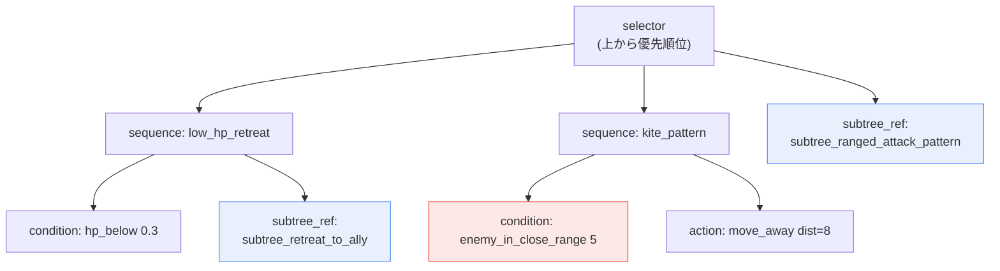
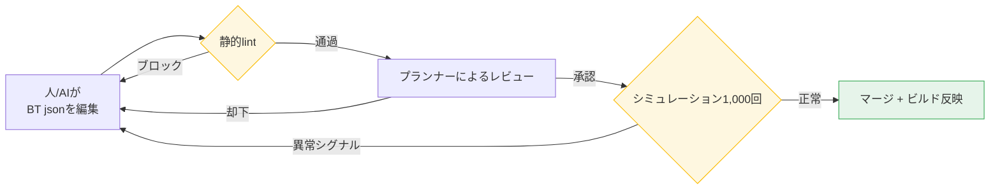

# 7.2 BehaviorTreeエディター — 人とAIが共にBT jsonを編集し検証するワークド・トランスクリプト

見習い魔法使いが1体、プレイヤーに張り付いて剣を振り回していました。遠距離の魔法キャスターとして設計したNPCです。HPは紙のように薄く、近接では一発もらっただけで死ぬのに、そいつは距離を取る気配がありませんでした。ビルドログには何のエラーもありません。エディターでBehaviorTreeを開き直してみても、ノードは問題なくつながっています。1時間にらみ続けた末に、原因を見つけました。後退分岐の距離条件が`5`ではなく`0.5`になっていたのです。5メートル以内に入られたら逃げるべきところが、0.5メートル、つまりほぼ目の前まで来ないと後退分岐が発動しなかったわけです。

たった数字一つでした。グラフィカルなノードエディターでは、その数字はノード内側のパネルを開かなければ見えず、変更履歴にも残りませんでした。誰がいつその値を変えたのか、追跡する方法がなかったのです。その日以降、筆者のプロジェクトAはBehaviorTreeをグラフィカルではなくjsonで扱い始めました。本章は、そのjsonを人とAIが共に編集し、機械が自動で検証する1サイクルの記録です。

---

## 7.2.1 BT（BehaviorTree、ビヘイビアツリー）が手に負えなくなるポイント

BehaviorTreeは、敵NPCの戦闘・移動・反応を定義する事実上の標準構造です。セレクター（selector）が優先順位どおりに分岐を試行し、シーケンス（sequence）が条件とアクションを順番に束ねます。構造自体は単純です。問題は規模です。

筆者のプロジェクトAでは、敵NPC 1体のBTはおよそ50〜200個のノードで構成され、運用対象のNPCは100体を超えていました。掛け合わせると、BTノードの総量は数万単位になります。この規模になると、「この後退パターンを変えたら、どのNPCに影響が出るのか」という質問に人が答えられなくなる瞬間が来ます。机の上にノートが100冊開いてあって、1冊目の1行を直すと、残り99冊のどこに波及するのかを目で追いかけるようなものです。

筆者がグラフィカルBTからjsonへ移行するにあたって要求したことは、次の4つでした。

<svg viewBox="0 0 720 250" xmlns="http://www.w3.org/2000/svg" font-family="sans-serif">
  <rect x="0" y="0" width="720" height="250" fill="#fafafa" stroke="#ddd"/>
  <rect x="30" y="30" width="300" height="80" rx="8" fill="#e8f0fe" stroke="#4285f4"/>
  <text x="180" y="58" text-anchor="middle" font-size="15" font-weight="bold" fill="#1a73e8">テキストで保存 (json)</text>
  <text x="180" y="82" text-anchor="middle" font-size="12" fill="#444">git diffで変更を1行単位まで追跡</text>
  <text x="180" y="100" text-anchor="middle" font-size="12" fill="#444">「数字一つ」の事故が履歴に残る</text>

  <rect x="390" y="30" width="300" height="80" rx="8" fill="#e6f4ea" stroke="#34a853"/>
  <text x="540" y="58" text-anchor="middle" font-size="15" font-weight="bold" fill="#188038">ノードメタデータの標準化</text>
  <text x="540" y="82" text-anchor="middle" font-size="12" fill="#444">category・tagsで検索・再利用</text>
  <text x="540" y="100" text-anchor="middle" font-size="12" fill="#444">「似たBT探し」が1行のクエリに</text>

  <rect x="30" y="140" width="300" height="80" rx="8" fill="#fef7e0" stroke="#fbbc04"/>
  <text x="180" y="168" text-anchor="middle" font-size="15" font-weight="bold" fill="#b06000">subtree引用 (参照再利用)</text>
  <text x="180" y="192" text-anchor="middle" font-size="12" fill="#444">共通パターン1個を多数のBTが共有</text>
  <text x="180" y="210" text-anchor="middle" font-size="12" fill="#444">コピペの代わりに1か所修正 → 一括反映</text>

  <rect x="390" y="140" width="300" height="80" rx="8" fill="#fce8e6" stroke="#ea4335"/>
  <text x="540" y="168" text-anchor="middle" font-size="15" font-weight="bold" fill="#c5221f">変更影響の自動可視化</text>
  <text x="540" y="192" text-anchor="middle" font-size="12" fill="#444">subtree修正がどのBTに届くか</text>
  <text x="540" y="210" text-anchor="middle" font-size="12" fill="#444">人の推定の代わりにスクリプトが算出</text>
</svg>

商用ゲームエンジンの組み込みBTエディターは、統合が楽で視覚的なデバッグに強いものです。ただし、バイナリ（binary）アセットとして保存される傾向があるため、テキストのdiffと変更影響の追跡には弱くなります。筆者のプロジェクトAは、運用BTが100体を超える運営型ゲームを前提としていたため、独自のjson BTフォーマットとエディターを自社開発する道を選びました。はっきりさせておきましょう。これはすべてのチームにとっての正解ではありません。運用BTが50体未満なら、エンジン組み込みのエディターをそのまま使うほうがほぼ常に安上がりです。自社開発の正当化については、本章の最後で改めて扱います。

---

## 7.2.2 BT json — 敵1体の行動をテキストで

まず成果物の形を見てみます。以下は、学者ギルドの遠距離支援型NPCのBTの一部です。要点は2つです。すべての行動がテキストなのでgitが1行単位で追跡できること、そして共通パターンを`subtree_ref`で参照していることです。

```json
{
  "bt_id": "bt_scholar_archer_v3",
  "category": "ranged_combatant",
  "tags": ["scholar_faction", "ranged", "support"],
  "description": "学者ギルドの遠距離支援型。距離維持 + 後退優先。",
  "root": {
    "type": "selector",
    "children": [
      {
        "type": "sequence",
        "name": "low_hp_retreat",
        "children": [
          {"type": "condition", "fn": "hp_below", "param": 0.3},
          {"type": "subtree_ref", "id": "subtree_retreat_to_ally"}
        ]
      },
      {
        "type": "sequence",
        "name": "kite_pattern",
        "children": [
          {"type": "condition", "fn": "enemy_in_close_range", "param": 5},
          {"type": "action", "fn": "move_away", "param": {"distance": 8}}
        ]
      },
      {"type": "subtree_ref", "id": "subtree_ranged_attack_pattern"}
    ]
  }
}
```

このツリーを図に展開すると、セレクターが上から3つの分岐を順に試行する構造です。冒頭のあのバグ（`enemy_in_close_range`の`param`が`5`か`0.5`か）が、jsonでは一目で見える1行になる点に注目してください。



| 要素 | 役割 |
|---|---|
| `bt_id` | git diff・変更追跡のキー |
| `category`・`tags` | 検索・再利用の単位 |
| `subtree_ref` | 共通パターンの参照（1か所の修正 → 多数のBTに反映） |
| `description` | プランナー・シナリオライター共有用 |

赤く塗った`enemy_in_close_range 5`が、冒頭で人の1時間を食いつぶしたあのノードです。jsonならコードレビュー一発で捕まります。

---

## 7.2.3 subtreeライブラリー — コピペの代わりに参照

100体を超える敵の行動には、繰り返し現れる塊があります。「味方の後ろへ後退」「遮蔽物へ後退」「遠距離攻撃パターン」といったものです。これをBTごとにコピーして入れてしまうと、後退ロジックを一つ直すたびに100か所を手作業で探して直すことになります。そこで共通パターンは別のsubtreeファイルとして切り出しておき、`subtree_ref`で参照するだけにします。

```
subtree_library/
├── retreat_patterns/
│   ├── subtree_retreat_to_ally.json
│   ├── subtree_retreat_to_cover.json
│   └── subtree_retreat_random.json
├── attack_patterns/
│   ├── subtree_ranged_attack_pattern.json
│   ├── subtree_melee_combo.json
│   └── subtree_aoe_attack.json
└── reaction_patterns/
    ├── subtree_react_to_ally_death.json
    └── subtree_react_to_player_taunt.json
```

こうしておけば、「このsubtreeを直したら誰に影響が出るのか」という質問が、人の推測ではなくスクリプトの出力になります。影響トラッカーは単純です。すべてのBTを開き、該当するsubtreeを参照しているBTの`bt_id`を集めるだけです。

```python
# bt_impact_tracker.py
import json, glob

def has_subtree_ref(node, target_id):
    if isinstance(node, dict):
        if node.get("type") == "subtree_ref" and node.get("id") == target_id:
            return True
        for child in node.get("children", []):
            if has_subtree_ref(child, target_id):
                return True
    return False

def find_affected_bts(subtree_id):
    affected = []
    for bt_file in glob.glob("bts/*.json"):
        bt = json.load(open(bt_file, encoding="utf-8"))
        if has_subtree_ref(bt["root"], subtree_id):
            affected.append(bt["bt_id"])
    return affected

# 使用
affected = find_affected_bts("subtree_ranged_attack_pattern")
# → ["bt_scholar_archer_v3", "bt_ranger_v2", "bt_sniper_v1", ...]
```

筆者のプロジェクトAでは、この関数をプルリクエスト（Pull Request）の段階に組み込んでおきました。誰かがsubtreeファイルに手を入れると、影響を受けるBTのリストが自動的にPRコメントに付きます。レビュアーは「後退パターンを1行直しただけで遠距離の敵12体が全部変わる」という事実を、マージ前に目にすることになります。

---

## 7.2.4 ワークド・トランスクリプト — AIが新しいBT草案を書く1サイクル

ここからが本章で最も重みのある部分です。新しい敵NPC「見習い魔法使い」のBT草案をAIに任せ、その出力を人が検証・却下・再依頼する1サイクルを、整えずにそのまま載せます。滑らかに刈り込まないのには理由があります。AIが最初の出力で何をどう間違えたのか、その失敗の手触りこそ、本章が伝えたいことのすべてだからです。

### Step 1 — 人が投げたプロンプト（全文）

```
[敵NPCコンセプト]
学者ギルドの見習い魔法使い。HPが低く魔法ダメージが高い。
近接回避を優先。味方の後ろへ後退した後に魔法攻撃。

[category] ranged_combatant

[参考BT] bt_scholar_archer_v3
(構造は類似。ただし弓攻撃の代わりに魔法攻撃へ差し替え)

[定義済み関数enum]
condition: hp_below, enemy_in_close_range, ally_nearby, mana_below
action: move_away, cast_spell, retreat, wait
subtree_ref id (使用可能リスト):
- subtree_retreat_to_ally
- subtree_ranged_attack_pattern   # 弓ベース。魔法用ではない
- subtree_magic_attack_pattern

このコンセプトでBT rootノードのjsonだけ書いて。subtree_refを最大限使って直接ノードは最小に、
関数は上のenumの中だけで。コンセプトにない行動は追加しないこと。説明なしでjsonのみ。
```

### Step 2 — Claudeの1次出力（加工なしそのまま）

```json
{
  "bt_id": "bt_scholar_apprentice_v1",
  "category": "ranged_combatant",
  "tags": ["scholar_faction", "magic", "fragile"],
  "description": "学者ギルドの見習い魔法使い。近接回避 + 味方の後ろへ後退 + 魔法攻撃。",
  "root": {
    "type": "selector",
    "children": [
      {
        "type": "sequence",
        "name": "low_hp_retreat",
        "children": [
          {"type": "condition", "fn": "hp_below", "param": 0.4},
          {"type": "subtree_ref", "id": "subtree_retreat_to_ally"}
        ]
      },
      {
        "type": "sequence",
        "name": "avoid_melee",
        "children": [
          {"type": "condition", "fn": "enemy_in_close_range", "param": 6},
          {"type": "action", "fn": "move_away", "param": {"distance": 10}}
        ]
      },
      {
        "type": "sequence",
        "name": "mana_recover",
        "children": [
          {"type": "condition", "fn": "mana_below", "param": 0.2},
          {"type": "action", "fn": "wait", "param": {"frames": 120}}
        ]
      },
      {"type": "subtree_ref", "id": "subtree_ranged_attack_pattern"}
    ]
  }
}
```

### Step 3 — 人による検証・却下

出力を受け取り、lint（次節で扱います）にかけ、目で読みました。3か所が引っかかりました。

1. **最後の分岐が間違っています。** `subtree_ranged_attack_pattern`は弓ベースの攻撃パターンです。enumのコメントに「마법용 아님（魔法用ではない）」と書いておいたにもかかわらず、AIは名前が似ている弓パターンを持ってきました。見習い魔法使いは`subtree_magic_attack_pattern`を使うべきです。— **却下。**

2. **コンセプトにない行動を追加しています。** `mana_recover`分岐（`mana_below` → `wait 120frame`）は、コンセプトに一行も書かれていない行動です。プロンプトで「明示されていない行動の追加は禁止」と釘を刺したにもかかわらず、AIが「魔法使いならマナ管理が自然だ」と判断して差し込んだものと見られます。もっともらしいものの、仕様違反です。— **却下。**

3. **後退のしきい値が疑わしいです。** `hp_below 0.4`は、参考BT（`0.3`）より早く後退を始めます。見習い魔法使いのほうが弱いのは確かなので、意図的かもしれません。ただ、AIが根拠を示したわけではないため、プランナーが決めるべき事項です。— **保留、プランナー確認。**

### Step 4 — 人による再依頼

```
3か所だけ直して。最後の分岐subtree_ranged_attack_patternは弓パターンだから
subtree_magic_attack_patternに替えて、mana_recover分岐はコンセプトにないから丸ごと削除、
hp_below 0.4は参考BT(0.3)に戻して — 0.4にする根拠があればdescriptionに1行で。
残りはそのまま、jsonのみ。
```

### Step 5 — Claudeの2次出力（修正版）

```json
{
  "bt_id": "bt_scholar_apprentice_v1",
  "category": "ranged_combatant",
  "tags": ["scholar_faction", "magic", "fragile"],
  "description": "学者ギルドの見習い魔法使い。近接回避 + 味方の後ろへ後退 + 魔法攻撃。HPが低いため後退しきい値0.3を維持(archerと同一)。",
  "root": {
    "type": "selector",
    "children": [
      {
        "type": "sequence",
        "name": "low_hp_retreat",
        "children": [
          {"type": "condition", "fn": "hp_below", "param": 0.3},
          {"type": "subtree_ref", "id": "subtree_retreat_to_ally"}
        ]
      },
      {
        "type": "sequence",
        "name": "avoid_melee",
        "children": [
          {"type": "condition", "fn": "enemy_in_close_range", "param": 6},
          {"type": "action", "fn": "move_away", "param": {"distance": 10}}
        ]
      },
      {"type": "subtree_ref", "id": "subtree_magic_attack_pattern"}
    ]
  }
}
```

2次出力はlintを通過し、プランナーによるレビューで`avoid_melee`の距離`6`をarcherに合わせて`5`へ1段下げた後、シミュレーションゲートへ回しました。ここで学べることは明確です。AIはBTの骨格を素早く埋めてくれますが、「名前が似ている誤ったsubtreeを引っ張ってくる」「もっともらしい追加行動を仕様なしに差し込む」という2種類の事故をほぼ毎回起こします。この2つの事故は、人の目とlintゲートでしか捕まえられません。だからAIの出力は草案であって、最終版ではないのです。

---

## 7.2.5 自動lint — 人が見落とすものを機械が先に捕まえる

BTはユーザー体験に直結します。敵が目の前で逃げないという事故がそのままリリースされれば、レビュースコアとなって返ってきます。だからマージ前に、機械が先に検査します。

| 検査 | 違反時 |
|---|---|
| 到達不能ノード | alert（セレクターから永遠に到達しない分岐） |
| 無限ループの危険 | ブロック（脱出条件のないsequence反復） |
| `subtree_ref`の参照先が存在しない | ブロック |
| アクション・条件関数がenum外 | ブロック |
| ノード数の急増（>500） | alert（BT分割を勧告） |
| 同一category内のBT応答時間のばらつき | alert（バランスリグレッションの疑い） |

最後の項目がこのlintの特異な点です。同じ`ranged_combatant`に括られたBT 5体のシミュレーション平均応答時間が大きく開いたら、それは誰かが1体のバランスを知らないうちに壊したというシグナルです。静的検査では捕まえられない「空気」を統計で捕まえる仕掛けです。

静的lintの次はシミュレーション検証です。BTを実際のゲームビルドなしにシミュレーターで1,000回走らせ、統計を取ります。

| 測定 | 正常範囲 |
|---|---|
| 平均生存時間（標準プレイヤー相手） | categoryごとの基準値 |
| 攻撃パターンの多様性（エントロピー） | 0.6以上 |
| 後退・接近行動の比率 | categoryごとの基準値 |
| 行動1回あたりの平均所要frame | 60 frame以下 |

ビルドを焼かなくても、5〜10分のうちに「このBTはあまりに早く死んでいないか」「一つの行動だけを繰り返していないか」を確認できます。異常シグナルが出たらjsonを直し、シミュレーションを回し直します。このサイクルが日単位から分単位へ縮むことこそ、json化の実質的な利益です。



---

## 7.2.6 測定 — 何が減ったのか

筆者のプロジェクトAにおける導入前後を表にまとめます。絶対値はチーム規模・ゲームジャンルによって変わるため、著者の推定（未検証）です。ただし、方向と比率は実際の運用で観察したとおりです。

| 項目 | 導入前（エンジン組み込みBTを直接） | 導入後（json+エディター） |
|---|---|---|
| 新しい敵1体のBT作成 | 1〜2日 | 2〜4時間 |
| BT変更の影響把握 | 推測・経験に依存 | 自動（subtree影響リスト） |
| 変更後の検証 | 実ビルドが必要 | シミュレーション5〜10分 |
| 敵NPC 100体の運用 | プランナー3人フルタイム | プランナー1〜2人 |
| リリース後のBT事故（異常行動） | 四半期あたり10〜15件（著者の推定） | 四半期あたり2〜4件（著者の推定） |

最も意味があるのは、最後の2行が同時に動いたという点です。普通、人員を減らせば品質は落ちます。ここではプランナーの数が減りながら、事故も減りました。人が手で追跡していた変更影響と検証を、機械が引き受けたからです。自動化の価値は「速くなる」ことよりも、この「減りながら同時に良くなる」ことにあります。

---

## 7.2.7 自社開発か、借用か

本章を読んで「うちもjson BTエディターを作ろう」と結論づけられては困ります。筆者のプロジェクトAが自社開発を選んだのは、特定の条件がかみ合ったからです。

| オプション | 長所/短所 |
|---|---|
| エンジン組み込みBTをそのまま使用 | 統合が容易/json変換・diffに弱い |
| 外部BTライブラリーの借用 | 標準化の利点/学習曲線・カスタマイズの限界 |
| 独自json BTエディター+ランタイム | 自由度・追跡性は最高/開発コストが大きい |

プロジェクトAが3番を選んだ根拠は4つでした。

- diff・git追跡が必須でした — 組み込みBTはバイナリアセットのため、冒頭の「数字一つ」事故を追跡できませんでした。
- subtree参照と自動影響追跡が運用の核心でした — 標準のBTツールでは弱い機能です。
- ビルドと分離されたランタイムでシミュレーション検証を回す必要がありました。
- AIによる補助作成を前提としていました — テキスト（json）ベースは大規模言語モデル（LLM、Large Language Model）に圧倒的に親和的です。

開発コストは1〜2か月。運用BTが100〜300体に達し、運営（ライブオプス）の期間が長くて初めて回収できます。30〜50体の規模では回収できません。自社開発の投資回収（ROI、Return On Investment）は、規模と運営期間の両方が保証されるときにだけ成立するという意味です。小さなチームなら、本章からは「jsonで保存する」「subtreeで参照する」「AIの出力はlint+レビューゲートを通す」という原則だけを持ち帰り、ツールは組み込みエディターや外部ライブラリーの上に載せて使うほうが正しいのです。

---

## 7.2.8 よくある失敗

| パターン | 処方 |
|---|---|
| BTをバイナリアセットだけで管理 | jsonで保存してgit追跡を生かす |
| subtreeなしでBTごとに同じパターンをコピペ | subtreeライブラリーに切り出して参照する |
| BTの影響追跡を手作業で | 影響分析スクリプトをPRに組み込む |
| シミュレーションなしで実ビルドだけで検証 | ビルドと分離されたシミュレーターを運用する |
| AI出力のBTをレビューなしで使用 | lint+プランナー+シミュレーションの三重ゲートを通す |
| 自社開発のROIを測らない | 100体以上・運営（ライブオプス）のときにだけ自社開発する |

---

### 本章のポイント

- BTをjsonで保存してこそ、「数字一つ」の事故がgit diffに残り、追跡できます。
- subtree参照と自動影響追跡が、100体運用のコピペ地獄を防ぎます。
- AIはBTの骨格を素早く埋めますが、誤った参照と仕様外の行動は人が捕まえます。

---

## やってみよう

小さなチームが今日から試せる最小サイクルです。

**setup** — 運用中の敵NPC 1体のBTを、手作業でjsonに書き起こしてみましょう（`bt_id`、`category`、`tags`、`root`）。共通の後退・攻撃パターンを一塊、`subtree_library/`に切り出して`subtree_ref`で参照します。

**prompt** — 似た系統の新しい敵1体をAIに任せてみましょう。上のワークド・トランスクリプトのプロンプト骨格（コンセプト+category+参考BT+使用可能な関数enum+「明示されていない行動の追加は禁止」+「jsonのみ」）をそのまま使えば大丈夫です。

**verify** — AIの出力を、（1）enum外の関数・存在しないsubtreeをはじくlint、（2）人の目、（3）シミュレーションまたはインゲームでの短い検証、この3つのゲートに通した後にだけマージしましょう。AIが「名前の似た誤ったsubtree」と「もっともらしい仕様外の行動」を差し込んでいないか、必ず確認してください。

### 一人ミニ版

エディターを作る余力がなければ、ツールはテキストエディターとgit、そして30行の`bt_impact_tracker.py`が1つあれば十分です。組み込みエディターで組んだBTを一度jsonにエクスポートしてgitに上げ、subtreeだけを別ファイルに切り出して参照しましょう。影響追跡スクリプトをコミットフックに掛ければ、一人でも「この後退パターンを直したらどの敵が変わるのか」を、推測ではなく出力として見られます。この一つの習慣だけで、冒頭の「数字一つに1時間」はコードレビューの1行に縮みます。

---

### 次章のプレビュー

- 7.3 ダンジョン・フィールドパターンライブラリー — ルームメタデータとsubtreeパターンを組み合わせ、レベルを運用単位で束ねます。
