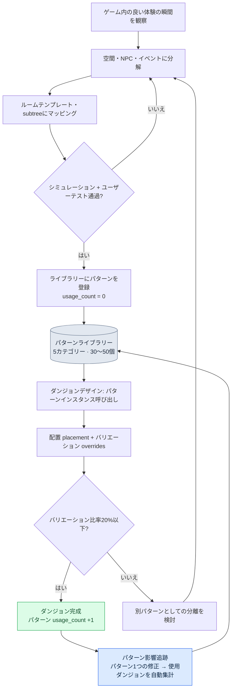

# 7.3 ダンジョン・フィールドのパターンライブラリー

ダンジョンレビューの席で、新人のレベルデザイナーが自分のダンジョンを1つ画面に映しました。狭い通路、後方から追いすがる速い敵、分岐点での回避の決断。よくできたダンジョンでした。問題は、それが私たちがすでに11個の別のダンジョンで作ってきたものと微妙に違っていたという点です。敵の追跡速度、罠が作動するタイミング、分岐点が現れる時点。どれ1つとして同じではありませんでした。新人は「追跡ダンジョン」という同じ名前の体験を作ったと信じていましたが、ユーザーが受け取った感覚はダンジョンごとにばらばらでした。

その日、私たちが決めたことは単純でした。「通路追跡」という体験を一度だけ正確に定義し、その定義を固定化しておくこと。次に誰かが追跡ダンジョンを作るときは、ゼロから組むのではなく、その固定化された定義を取り出して使うこと。これがパターンライブラリーの始まりでした。

ルームが空間の単位で、BehaviorTreeが行動の単位だとすれば、パターンは空間と行動とイベントを1つに束ねた運用単位です。パターン1つが複数のダンジョンで再利用されれば量産の負担が減り、さらに重要なことに、ユーザーが受け取る体験がダンジョンの間で一貫します。

---

## 7.3.1 パターンという運用単位

料理本のレシピを思い浮かべるとぴったりです。レシピ1枚には材料、調理手順、火加減、完成写真が一緒に載っています。店が変わっても、同じレシピに従えば同じ味になります。ただし店ごとに多少のバリエーションは許容します。パターンも同じです。空間（ルーム）、行動（BT subtree）、出来事（event）、結果（報酬・難易度）、そしてデザイナーによる意図の説明が1セットで入ります。

<svg viewBox="0 0 720 250" xmlns="http://www.w3.org/2000/svg" font-family="sans-serif" font-size="13">
  <rect x="10" y="10" width="700" height="230" fill="#fafafa" stroke="#ccc"/>
  <text x="360" y="35" text-anchor="middle" font-size="15" font-weight="bold">パターン = 5要素の束</text>
  <rect x="40" y="60" width="120" height="60" rx="6" fill="#e3f0ff" stroke="#5a8fd0"/>
  <text x="100" y="85" text-anchor="middle" font-weight="bold">空間</text>
  <text x="100" y="105" text-anchor="middle" font-size="11">ルームメタ 1~3個</text>
  <rect x="180" y="60" width="120" height="60" rx="6" fill="#e9f7e9" stroke="#6aa86a"/>
  <text x="240" y="85" text-anchor="middle" font-weight="bold">行動</text>
  <text x="240" y="105" text-anchor="middle" font-size="11">BT subtree 1~2個</text>
  <rect x="320" y="60" width="120" height="60" rx="6" fill="#fdf3e0" stroke="#d0a05a"/>
  <text x="380" y="85" text-anchor="middle" font-weight="bold">出来事</text>
  <text x="380" y="105" text-anchor="middle" font-size="11">event スロット</text>
  <rect x="460" y="60" width="120" height="60" rx="6" fill="#fde9ec" stroke="#d05a6e"/>
  <text x="520" y="85" text-anchor="middle" font-weight="bold">結果</text>
  <text x="520" y="105" text-anchor="middle" font-size="11">報酬・難易度ルール</text>
  <rect x="600" y="60" width="90" height="60" rx="6" fill="#f0e9fd" stroke="#8a5ad0"/>
  <text x="645" y="85" text-anchor="middle" font-weight="bold">意図</text>
  <text x="645" y="105" text-anchor="middle" font-size="11">説明</text>
  <text x="360" y="160" text-anchor="middle" font-size="13" font-style="italic">「通路追跡パターン」 = 狭い通路 + 速い敵BT + 罠event + 回避報酬</text>
  <line x1="100" y1="180" x2="620" y2="180" stroke="#999" stroke-width="1"/>
  <text x="360" y="210" text-anchor="middle" font-size="12">→ 一度検証されればダンジョン5~10個で同じ体験を再生産</text>
</svg>

パターンが1つ定義されると、ダンジョンごとに同じ体験を一貫して作れるようになります。一度検証されたレシピが、複数の店で同じ味を出すように。ただし同じレシピでも、店ごとに多少のバリエーションは持たせます。このバリエーションをどう管理するかが、パターン運用の半分です。後ほど扱うoverridesがその場所です。

---

## 7.3.2 パターン組み合わせのフロー

パターンライブラリーの核心は、パターンをルールブックとして固定化したうえで、それを組み合わせてダンジョンを生成するという点です。デザイナーが白紙の画面からダンジョンを組むのではなく、検証済みのパターンを選んで配置し、一部だけバリエーションを加えます。



このフローの左半分（観察→分解→マッピング→検証→登録）はパターンを作る過程で、右半分（呼び出し→配置・バリエーション→完成→追跡）はパターンを消費する過程です。作る仕事はまれにしか起きず、消費する仕事は頻繁に起きます。ライブラリーがうまく運用されれば、この非対称が量産効率につながります。

---

## 7.3.3 5つの基本カテゴリー

著者のプロジェクトAはアクションRPG系なので、5つのカテゴリーでパターンを分類しています。この分類はジャンルに依存します。ホラーゲームなら待ち伏せとナラティブビートの比重が違うでしょうし、パズルゲームなら環境を活用した戦闘が中心に来るでしょう。分類そのものを絶対視せず、自分のゲームの核心体験が何かをまず決めてから、カテゴリーを定めるべきです。

| カテゴリー | 核心体験 | 例 |
|---|---|---|
| pursuit | 追跡・逃走 | 通路追跡、峡谷からの逃走 |
| ambush | 待ち伏せ・奇襲 | ルーム進入時の待ち伏せ、視界の死角での待ち伏せ |
| puzzle_combat | 環境を活用した戦闘 | レバー・罠 + 戦闘 |
| boss_phase | ボスフェーズ | ボスフェーズ1〜3のパターン |
| narrative_beat | ナラティブビート | 回想トリガー、仲間の登場 |

5つのカテゴリーの中で、パターンはおおよそ30から50個の間を維持します。この数字には理由があります。パターンが100個を超えると、デザイナーがライブラリー全体を頭の中に収められなくなります。その瞬間、ライブラリーは検索に時間のかかる倉庫になり、デザイナーはいっそ新しく組むほうを選びます。ライブラリーがそっぽを向かれ始めると、一貫性という本来の目標が崩れます。だからこそ、パターン数の上限を意識的に管理することが、カテゴリー設計と同じくらい重要です。

---

## 7.3.4 パターンを固定化するフォーマット

パターン1つはYAMLファイル1枚で固定化されます。以下はプロジェクトAで実際に使っている形式を匿名化したものです。会社固有のアセット名とダンジョン番号は伏せましたが、フィールド構造と運用方式はそのままです。

```yaml
---
pattern_id: pattern_corridor_pursuit_v2
category: pursuit
description: 狭い通路で速い敵が後方から追跡、プレイヤーは分岐点で回避を決定
tags: [horizontal_corridor, scholar_theme_compatible]
rooms:
  - room_template: corridor_long
    size: medium
    connections_required: 2
  - room_template: junction_3way
    size: small
    connections_required: 3
npc_behaviors:
  - subtree_ref: subtree_aggressive_chase
    count: 2
  - subtree_ref: subtree_ranged_support
    count: 1
events:
  - type: trap_activation
    trigger: room_1_midpoint
  - type: enemy_spawn
    trigger: room_1_entry
difficulty_modifier: 1.2   # 一般ルーム比1.2倍の負担
reward_modifier: 1.3
clear_time_estimate_sec: 60
art_pack_compatible: [scholar_library, generic_dungeon]
narrative_slots:
  - slot: dialogue_during_chase
    constraints: [short_dialogue, fear_emotion]
usage_count: 12            # 12個のダンジョンで使用
last_modified: 2026-05-18
deprecated: false
---
```

このファイルが、12個のダンジョンの一部分ずつを同時に定義しています。`usage_count: 12`という1行の重みはそこから来ます。このパターンを修正すれば12個のダンジョンが一斉に影響を受けるという意味であり、だからこそパターンファイルに手を入れることは、ルーム1つを直すこととは別の重みを持ちます。

`subtree_aggressive_chase`や`subtree_ranged_support`のような参照は、7.2のBehaviorTreeエディターで定義したsubtreeをそのまま指しています。パターンがBTを直接抱え込まず、参照だけするのが核心です。BTを直せば、そのBTを参照するすべてのパターンが自動的についてきます。空間（ルームテンプレート）と行動（subtree）はそれぞれのライブラリーで管理され、パターンはその2つを結ぶ組み合わせ表の役割だけを担います。`clear_time_estimate_sec`や`difficulty_modifier`のような数値は著者の環境の運用値にすぎず、普遍的な定数ではありません。自分のゲームのシミュレーションとユーザーテストで直接測定して埋めるべきです。

---

## 7.3.5 パターンをダンジョンにインスタンス化する

ダンジョンをデザインするときは、パターンをゼロから組みません。ライブラリーから呼び出し、どこに置くかを指定し、このダンジョンでだけ変える部分をoverridesで上書きします。

```yaml
---
dungeon_id: dungeon_021_silvermark_library
pattern_instances:
  - instance: corridor_pursuit_1
    pattern_id: pattern_corridor_pursuit_v2
    placement:
      - room_id: dungeon_021_room_03
        as: corridor_long
      - room_id: dungeon_021_room_04
        as: junction_3way
    overrides:
      - field: npc_behaviors.0.subtree_ref
        value: subtree_scholar_chase   # 学者テーマの変種
      - field: events.0.trigger
        value: room_1_2nd_third         # トリガー位置の微調整
---
```

ここでダンジョン021は「通路追跡」パターンをそのまま使いつつ、追ってくる敵を一般の敵から学者テーマの変種に変え、罠が作動する位置を通路の中間から少し後ろにずらしました。パターンの80%はそのまま、20%だけバリエーションを加えています。

この比率には、運用経験から得た根拠があります。バリエーションが少なすぎると（0%に近いと）、ダンジョン同士が写し合ったようで飽きられます。バリエーションが多すぎると（50%を超えると）、それはもう同じパターンではありません。同じパターンを呼び出したと信じていても実際の体験はまったく別物という、新人が持ってきたあのダンジョンとそっくりの状況に逆戻りします。だから私たちは運用ルールを置いています。1つのインスタンスのoverridesがパターンのフィールドの半分を超えたら、それはバリエーションではなく新しいパターンの兆候です。別パターンとして分離すべきときが来たのです。

---

## 7.3.6 1行直すとどこが揺れるのか

`pattern_corridor_pursuit_v2`を修正すると、12個のダンジョンが影響を受けます。人がこれを手で追跡すると、必ず1つや2つは漏らします。だから、パターンとダンジョンの関係を自動で洗い出す小さなツールを置きます。

```python
# pattern_impact.py
import json
from glob import glob

def find_dungeons_using(pattern_id):
    affected = []
    for d in glob("dungeons/*.json"):
        dungeon = json.load(open(d, encoding="utf-8"))
        for inst in dungeon.get("pattern_instances", []):
            if inst["pattern_id"] == pattern_id:
                affected.append({
                    "dungeon": dungeon["dungeon_id"],
                    "instance": inst["instance"],
                    "has_overrides": bool(inst.get("overrides")),
                })
    return affected
```

この関数が返すリストの核心は`has_overrides`フラグです。overridesのないダンジョンはパターンをそのまま使っているので、自動更新しても安全です。overridesのあるダンジョンは、そのダンジョン固有のバリエーションがパターン修正と衝突しうるため、人による追加チェックが必要です。

修正の重みを人がいちいち感じ取る代わりに、ツールが「今回の修正でダンジョン12個が影響を受け、そのうち4個はバリエーションがあるので直接見る必要がある」と5分以内に報告するようにします。パターン変更への恐れを減らしてくれることが、このツールの本当の価値です。影響範囲が見えなければ、デザイナーはパターンをそもそも直そうとしなくなり、ライブラリーは更新されないままよどんでいきます。

---

## 7.3.7 パターンはどのように生まれるのか、そしてAIの居場所

ここで、最もよく受ける質問に正面から答えます。「パターンの作成もAIに任せればいいのではないですか？」

答えははっきりしています。だめです。パターン1つを作成する仕事は、デザイナーのインサイトが背骨です。良い追跡体験とは何か、分岐点がなぜそこでなければならないのか、罠がなぜ通路の中間ではなく2/3地点で作動してこそ緊張が生きるのか — これは、ゲームを直接触り、ユーザーの反応を見てきた人の判断です。AIにパターンをゼロから組ませると、すべてのパターンが無難で平均的な形に収束します。ライブラリーは「間違っていないパターン」で埋め尽くされますが、「記憶に残るパターン」は消えていきます。

だからといって、AIにやることがないわけではありません。パターン作成の5段階のうち2か所で、AIは強力な補助になります。

| 段階 | 産出物 | AIの役割 |
|---|---|---|
| 1. ゲーム内の良い体験の瞬間を観察 | ノート | デザイナー単独 |
| 2. その瞬間を空間・NPC・イベントに分解 | ドラフトyaml | デザイナー単独 |
| 3. 既存のルームテンプレート・subtreeにマッピング | 候補マッピング | AI補助（候補の推薦） |
| 4. シミュレーション + ユーザーテスト | 検証 | AI補助（シミュレーション実行） |
| 5. ライブラリーに登録 | usage_count = 0 | デザイナー単独 |

3段階目がAI補助の核心です。デザイナーが「狭い通路で速い敵が後方から追跡する」というドラフトを書いたとき、すでに数十個ずつ積み上がったルームテンプレートとsubtreeのライブラリーの中からどれがこの意図に合うかを、人が全部漁るのは非効率です。ここでAIにマッピング候補を推薦させます。以下は、実際に使っているプロンプトを匿名化したものです。

```
[入力]
- デザイナーのパターンドラフト yaml (下に添付)
- ルームテンプレートライブラリー (名前 + タグ + サイズの一覧)
- subtree ライブラリー (名前 + 行動要約の一覧)

このパターンを実装するルームテンプレートとsubtreeをライブラリーから選んで推薦して。
それぞれ2~3個ずつ、適合度1~5点とタグ・サイズ基準の一行の根拠を付けて。
ライブラリーにないものはでっち上げず推薦だけ、全部3点以下なら新規作成が必要だと言って。
```

このプロンプトにClaudeが実際に返した出力は次のとおりです。どこでためらい、どこで断言しているかがそのまま現れるよう、一文字も手を加えずに載せます。

```
ルームテンプレート候補:
1. corridor_long  (適合度 5)
   根拠: タグ horizontal_corridor が一致、size medium が「狭い通路」の意図に合致。
2. corridor_narrow_short  (適合度 3)
   根拠: 狭くはあるが長さが短く、追跡距離の確保が難しい。分岐点を配置する空間が不足。
3. hall_wide  (適合度 1)
   根拠: 広いホールは「狭い通路」の意図と正反対。追跡の圧迫感が生きない。

subtree 候補:
1. subtree_aggressive_chase  (適合度 5)
   根拠: 後方追跡の行動が定義済み、移動速度の重み付けあり。
2. subtree_ranged_support  (適合度 3)
   根拠: 追跡そのものではないが、圧迫の補助用に1体配置可能。
3. subtree_patrol_basic  (適合度 2)
   根拠: 巡回行動は追跡の意図と合わない。トリガー後に追跡へ切り替えるノードがない。

分岐点(junction)ルームテンプレート:
ライブラリーで 3way 分岐 + small サイズの条件を同時に満たす項目を
見つけられませんでした。junction_3way が最も近いものの size タグが空のため
適合度を確定できません。デザイナーの確認が必要です。
```

最後の段落が、この出力で最も価値ある部分です。AIは分岐点のルームテンプレートについて「確実ではない」と述べ、存在しない答えをでっち上げませんでした。デザイナーはこの報告を受けて、`junction_3way`のsizeタグが実際に空であるという事実を発見し、まずそのメタデータから埋めました。もしAIが空のタグを無視して適合度5を付けていたら、デザイナーは誤った信頼のままそれを採用していたでしょう。

これがAI補助の正しい形です。AIは候補を広げ、不確実さを表示し、選択と責任はデザイナーに残ります。マッピングの結果、適合度がすべて低ければ、そのときは新しいテンプレートを作成する別の作業が発生し、その作成はまた人の仕事になります。

> **[方向標識 — パターンを「体験ベクトル」に圧縮してみるなら（まだ時期尚早）]** 処方ではなく、研究動向として読んでください。§7.3.1がすでにパターンを「レシピ」と呼んでいます。1つのパターンは、ルームメタ・行動subtree・event・difficulty/reward_modifier・clear_timeが1セットになった座標値に近いものです。この束を「体験ベクトル」に圧縮すれば、適合度がすべて低いときに新規を組むという上記のフローを、いちいち漁る代わりに圧縮空間の空白領域として捉えられ、§7.3.8のdeprecated判定も、近接する重複を座標距離で補強できます。ただし3つの留保が付きます。difficulty/reward_modifierは§7.3.4のとおり著者の運用値であり、ゲームごとに軸のスケールが違うため圧縮空間をそのまま移植できないこと。補間はパターンの「生成」ではなく空白の「標識」までであること。そして、その標識の上でパターンを実際に組む仕事は依然としてデザイナーのインサイトが背骨だという、本節の原則を超えないこと。この発想は§8.2.7の次元ベクトル圧縮と同じ場所にあり、概念の直観は付録Mにあります — 土台が十分に積み上がったチームが数年後にのぞき込む領域として残しておきます。

---

## 7.3.8 使われないパターンを整理する

ライブラリーは、埋めることより空けることのほうが難しいものです。運用を1年ほど続けると、作ったままほとんど使われないパターンが溜まります。放っておくとライブラリーの検索コストが上がり、デザイナーがパターンを選ぶとき、死んだ選択肢までなめる必要が出てきます。だから定期的に整理します。

| 条件 | 処理 |
|---|---|
| 6か月間usage_countの増加が0 | deprecated候補に分類 |
| 検討会議で廃棄を決定 | `deprecated: true`を表示 |
| 既存の使用ダンジョン | そのまま保存（歴史的保存） |
| 新規ダンジョン | 該当パターンの使用禁止 |

核心は、廃棄が削除ではないという点です。すでにそのパターンを使っているダンジョンはそのまま残します。ライブサービスで稼働中のダンジョンに手を入れることのほうが、新規での使用を止めることより危険だからです。`deprecated: true`は「今後新しく使わない」という標識にすぎず、過去を消す命令ではありません。

机の引き出しの使わない道具を四半期に一度取り出して整理するように、ライブラリーも四半期に一度整理する日程を組んでおきます。この日程がなければライブラリーは一方向にだけ膨らみ、いつしかデザイナーがそっぽを向く倉庫になります。

---

## 7.3.9 効果を正直に測定する

著者のプロジェクトAでパターンライブラリーを1年運用して観察した変化です。下の表の時間数値は著者の環境での推定（未検証）であり、方向と相対比率だけが実際に観察されたものです。

| 項目 | 導入前 | 導入後 | 備考 |
|---|---|---|---|
| ダンジョン1個のデザイン時間 | 約2週間 | 約1週間 | 著者の推定、方向は明確 |
| ダンジョン間の体験の一貫性 | 分散が大きい | 安定 | ユーザー評価ベース、定性 |
| パターン1個あたりの使用ダンジョン平均 | — | 約8個 | 量産効率の核心指標 |
| 新規デザイナーのオンボーディング | 約2か月 | 約3週間 | 著者の推定、最も大きな体感効果 |
| パターン変更の影響把握 | 1〜2日の手作業 | 自動5分レポート | pattern_impact.py導入の効果 |

最も印象的だった変化は、最後から2行目の新人オンボーディングです。パターンライブラリーは、意図せずデザインの教科書の役割を果たしました。新人が「このゲームの追跡体験はこう作る」をパターンファイル1枚で読んで理解できるようになり、先輩が横について説明する時間が大きく減りました。最初に新人が持ってきた、ばらばらなダンジョンの問題が、ライブラリーそのものによって解消されたわけです。

「パターン1個あたりの使用ダンジョン平均約8個」という数字は、同じパターンを8回再利用したという意味であり、これが量産効率の正直な物差しです。ただし、この8という値は著者のゲームのダンジョン規模とパターン設計に依存します。ダンジョン数が少なかったり、毎回違うコンセプトを要求されたりするゲームでは、この値はずっと小さくなります。

---

## 7.3.10 ライブラリーを作らないという決定

最後に、この章全体をひっくり返す話をしてこそ正直というものです。パターンライブラリーは万能ではありません。ライブラリーを構築・運用するコストが回収されない環境は、確かにあります。

| 条件 | 勧告 |
|---|---|
| ダンジョン5個未満 | 手作業で十分、ライブラリー不要 |
| デザイナー1人 | 頭の中がそのままライブラリー |
| リリース1回、運営（ライブオプス）なし | 再利用の機会自体が少ない |
| 毎回まったく違うコンセプト | 再利用比率が低くROI未回収 |

ライブラリーのROI（Return on Investment、投資対効果）は、3つの条件がそろったときに回収されます。運営（ライブオプス）があり、デザイナーが3人以上で、ダンジョンが20個を超える場合です。運営型MMORPGが典型的な適用対象である理由はここにあります。上の表のどれかの行に自分のプロジェクトが当てはまるなら、ライブラリーを建てる前に立ち止まって考え直すべきです。ツールは問題があるときにだけ価値があり、ダンジョン5個のプロジェクトにとって、パターンライブラリーは問題よりコストのほうが大きいのです。

---

## 7.3.11 よくある失敗と処方箋

| 症状 | 処方 |
|---|---|
| パターンが100個を超えてデザイナーが覚えきれない | 30〜50個に整理、四半期ごとにdeprecatedを整理 |
| パターンの影響追跡を手作業で行う（漏れが発生） | pattern_impact.pyのような自動追跡ツール |
| overridesが80%以上（実質的な再利用ではない） | バリエーションが大きすぎる → 別パターンに分離 |
| パターン作成をAIに丸ごと委任 | 作成はデザイナーのインサイト、AIは3・4段階の補助のみ |
| usage_countを測定していない | 自動集計 + 四半期の振り返りで検討 |
| 新人にライブラリーの説明がない | オンボーディング資料にライブラリーツアーを含める |

この表の2行目と4行目が、最もよく足を引っ張ります。影響追跡を自動化しなければデザイナーがパターン修正を恐れてライブラリーが固まり、作成をAIに委任すればライブラリーが平均に収束します。どちらの失敗も、ライブラリーの生命である「検証された体験の再利用」を殺してしまいます。

---

## 7.3.12 第7部を締めくくる

第7部は、レベル分野を3つの層で積み上げてきました。7.1でルームメタデータとタグと接続性の標準を立て（空間）、7.2でJSONベースのBehaviorTreeエディターとsubtreeとシミュレーションを扱い（行動）、本章でその2つをイベントとともに束ねて再利用するパターンライブラリーに到達しました（運用単位）。空間と行動を別々に扱う運用の中で、同じ場所の決定が毎週違う形で揺れていたあの問題を、パターンという束として固定化して解決したことが、第7部全体の幹です。

この流れは、Layer統合設計とそのままかみ合います。ゲーム全体の空間のトーンというビジョンが上にあり、その下にレベル生成ルールとBTルールというシステムがあり、ルームとBTとパターンライブラリーがコンテンツ層を成し、ダンジョンインスタンスとパターン使用統計がデータとして積み上がり、lintとシミュレーションとユーザーテレメトリーがビルド・QAでこれを検証します。パターンライブラリーはこの5層のうちコンテンツ層の背骨でありながら、上に向かってはシステムのルールに従い、下に向かってはデータの統計を生成する連結リングです。

---

### 本章のポイント
- パターンは空間・行動・イベントを束ねた運用単位であり、3つを別々に扱うと同じ体験が毎週違う形で揺れます
- 80%の再利用 + 20%のバリエーションが推奨比率で、バリエーションが半分を超えたら、それは新しいパターンの兆候です
- パターン作成はデザイナーのインサイトの場所であり、AIはマッピング候補の推薦とシミュレーション補助までです

### 次章のプレビュー
- 8.1 CombatBalance・CombatFormula運用 — バランスデザインの2文書分離

---

## やってみよう — 追跡パターンを1つ固定化する

### setup
1. 作業フォルダーに`patterns/`と`dungeons/`の2つのディレクトリーを作ってください。
2. ルームテンプレート名の一覧とsubtree名の一覧を、それぞれ1行ずつ書いたテキストファイルとして準備してください（ライブラリーがなければ、架空の名前5個ずつで始めても構いません）。
3. 上の本文の`pattern_impact.py`をそのまま保存してください。

### prompt
デザイナーが自分でパターンのドラフトyamlを書きます（この部分は人の仕事です）。そのうえで、AIにはマッピングだけを任せましょう。本文のマッピングプロンプトをそのまま使い、入力に自分のドラフトと2つのライブラリー一覧を添えてください。核心となる制約の2行を落とさないでください。

```
- ライブラリーにない新しいテンプレートをでっち上げないでください。推薦だけにしてください。
- 適合度がすべて3以下なら、新規作成が必要だと明記してください。
```

### verify
1. AIがライブラリーにないテンプレート名をでっち上げていないか、1行ずつ確認してください。
2. 適合度スコアにタグ・サイズ基準の根拠が付いているかを見てください。根拠のないスコアは信頼しないでください。
3. パターンをダンジョン2個以上にインスタンス化したうえで`find_dungeons_using("pattern_...")`を実行し、その2つのダンジョンが正確に捕捉されるか確認してください。

### 一人ミニ版
一人で小さなゲームを作るなら、ライブラリーシステムは過剰です。代わりに、いちばん気に入っているダンジョン区間を1つ選び、その体験をyaml1枚に書き留めておくだけでも十分です。次のダンジョンを作るときに、その1枚を開いてコピーし、20%だけ直してみましょう。パターンライブラリーの本質 — 検証された体験の再利用 — は、ファイル1枚でも機能します。規模が大きくなったら、そのときにカテゴリーと追跡ツールを足せばよいのです。
