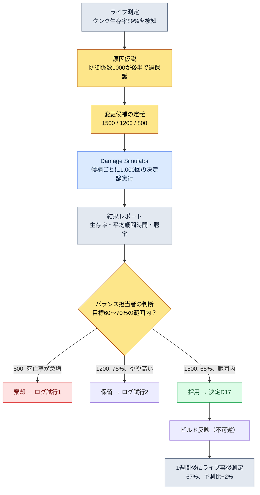

# 8.1 戦闘バランス公式 — 決定論というルールブックの居場所

> **本章の学習目標**（難易度🟡実務・前提：四則演算・表計算）：戦闘バランスを公式の居場所と数値の居場所に分離し、決定論・追跡可能性という2つの性質を根拠に、どこまでAIに任せ、どこから人がルールブックでロックすべきかを区別できるようになります。

午前2時、ライブサーバーのタンク職の生存率が89%に達したというアラートが届きました。ボスを最後まで倒せないタンクはいない一方で、死なないタンクが多すぎる。誰かが手を入れた痕跡を探そうと、マスターデータを開きます。防御係数の1行が目に入ります。`DEF / (DEF + 1000)`。この1000という数字がいつ、誰の手で、どんな根拠で1200から1000に引き下げられたのか、シートのどこにも書かれていません。チャットログを漁り、ビルド履歴を漁り、最後は3年前に退職したバランス担当者の記憶にたどり着いてようやく終わる追跡が始まります。

この場面は、戦闘バランスの運用を経験した人なら誰でも一度は通ります。そして、この場面の本当の原因は、その1000という数字が間違っていたことではありません。その数字が**公式**の居場所に住んでいたのに、公式が変わった**履歴**がどこにもなかったことにあります。戦闘バランスの公式は、ゲームの中で最も決定論的であるべき領域であり、最も追跡可能であるべき領域です。この2つの性質がなぜ、AIをこの場所に入れてはいけない理由になるのか。それが本章の背骨です。

> **専門外の方のための一言。** この部で出てくるz-score・シミュレーション・曲線になじみがなくても大丈夫です。持ち帰っていただきたいのは、ただ一つです — **「同じ入力には常に同じ出力でなければならないルール（公式）には、AIを入れない」**。決定論が必要な場所と探索が必要な場所を分けるこの判断は、会計規定・精算ロジック・契約条項のような「間違えてはいけないルール」を扱うあらゆる職種に、そのまま持ち込めます。数式そのものは8.1.2からゆっくり見ていただいてかまいません。

---

## 8.1.1 公式はルールブックである

ゲームデザインを長く続けていると、2種類のドキュメントが手に残ります。頻繁に変わるドキュメントと、ほとんど変わらないドキュメントです。戦闘バランスでほとんど変わらない側が公式です。「ダメージをどう計算するか」は四半期に1〜2回しか手を入れませんが、「このキャラクターの攻撃力はいくつか」は週に5〜6回手を入れます。頻度の違う2つの流れを1つのファイルに束ねると、頻繁に開け閉めする手の力で、たまにしか開け閉めしない紙のほうが破れてしまいます。

著者が運営するプロジェクトAでは、戦闘バランスは2つの居場所に分離されています。公式の居場所（ここでは`CombatFormula`と呼びます）と、数値の居場所（`CombatBalance`）です。公式の居場所に住む1行を、そのまま引用します。

```
final_damage = base_damage × dmg_multiplier × (1 − defense_factor) × variation

  base_damage    = skill_base × ATK × skill_coeff
  defense_factor = DEF / (DEF + 1000)
  variation      = uniform(0.95, 1.05)
```

この公式はルールブックです。ボードゲームのルール冊子を思い浮かべてください。ルール冊子には「サイコロを振って出た目の数だけ進む」と書いてあり、「今回は運が良ければもう少し進んでもよい」とは書いてありません。同じ入力には、常に同じ出力。これが決定論（determinism）です。攻撃力180、防御力80、スキル係数2.1を入れたら、いつどこで何回計算しても同じダメージが出なければなりません。もし同じ入力に違う出力が出るなら、それはバランスツールではなくギャンブルマシンです。

この決定論という1つの性質こそ、AIをこの場所に入れてはいけない第一の理由です。これは後ほど改めて見ます。まず、公式がルールブックらしくあるためにはどんな形であるべきかを見ていきましょう。

戦闘公式の中核領域は、ダメージの1行では終わりません。少なくとも3行が1セットで住んでいます。

```
# ダメージ
final_damage = base_damage × dmg_multiplier × (1 − defense_factor) × variation

# クリティカル
crit_damage  = final_damage × crit_multiplier
crit_chance  = base_crit + (LUK × 0.1)            # 上限 50%

# 回復
heal         = base_heal × healing_power × (1 − sickness_factor)
```

この3行を自然言語ではなくコードブロックで書くことには理由があります。自然言語は解釈の余地を残します。「防御力が高いほどダメージが減る」という文は、線形に減るのか、曲線で減るのか、どこで止まるのかを語りません。`DEF / (DEF + 1000)`は、ただ一通りにしか読めません。解釈の余地を0にするのがルールブックの仕事です。

---

## 8.1.2 曲線が決定論を決める

防御係数`DEF / (DEF + 1000)`の1行に、このゲームのバランス哲学の全体が詰まっています。この1行をグラフに描いてみると、なぜそうなのかが見えてきます。横軸が防御力、縦軸が受けるダメージを軽減する割合です。

<svg viewBox="0 0 640 320" xmlns="http://www.w3.org/2000/svg" font-family="sans-serif">
  <rect x="0" y="0" width="640" height="320" fill="#ffffff"/>
  <!-- axes -->
  <line x1="70" y1="270" x2="610" y2="270" stroke="#333" stroke-width="1.5"/>
  <line x1="70" y1="270" x2="70" y2="30" stroke="#333" stroke-width="1.5"/>
  <!-- y gridlines -->
  <line x1="70" y1="150" x2="610" y2="150" stroke="#e0e0e0" stroke-width="1"/>
  <text x="40" y="275" font-size="12" fill="#666">0%</text>
  <text x="34" y="155" font-size="12" fill="#666">50%</text>
  <text x="34" y="55" font-size="12" fill="#666" >~91%</text>
  <text x="300" y="300" font-size="13" fill="#333">防御力 DEF →</text>
  <!-- x ticks -->
  <text x="60" y="288" font-size="11" fill="#666">0</text>
  <text x="190" y="288" font-size="11" fill="#666">1000</text>
  <text x="320" y="288" font-size="11" fill="#666">2500</text>
  <text x="470" y="288" font-size="11" fill="#666">5000</text>
  <text x="585" y="288" font-size="11" fill="#666">10000</text>
  <!-- DEF/(DEF+1000) curve: x in [0,10000] mapped to [70,610]; y reduction in [0, ~0.909] mapped to [270, 50] -->
  <path d="M70,270 C 110,180 160,140 200,135 C 280,124 360,98 470,78 C 540,66 580,58 610,52"
        fill="none" stroke="#c0392b" stroke-width="2.5"/>
  <!-- diminishing-return marker at DEF=1000 (50%) -->
  <circle cx="200" cy="135" r="4" fill="#c0392b"/>
  <line x1="200" y1="135" x2="200" y2="270" stroke="#c0392b" stroke-width="1" stroke-dasharray="4 3"/>
  <text x="208" y="128" font-size="11" fill="#c0392b">DEF=1000でダメージ50%減少</text>
  <!-- linear ghost for contrast -->
  <line x1="70" y1="270" x2="430" y2="50" stroke="#95a5a6" stroke-width="1.5" stroke-dasharray="5 4"/>
  <text x="430" y="48" font-size="11" fill="#95a5a6">(線形なら — 採用せず)</text>
  <text x="120" y="240" font-size="11" fill="#c0392b">序盤は急勾配</text>
  <text x="470" y="100" font-size="11" fill="#c0392b">後半は緩やか (収穫逓減)</text>
</svg>

この曲線は漸近線（asymptote）にゆっくり近づいていきます。防御力1000でダメージをちょうど半分に削り、その先はどれだけ上げても100%には届きません。無敵が不可能であることが、この1行に織り込まれています。灰色の点線のように線形だったら、防御力1000でダメージをすべて防ぎ、それ以上はマイナスダメージ（殴られるほどHPが回復する）という意味の通らない領域に突入します。だから線形は採用しませんでした。

ここで午前2時の事故に戻ってみましょう。誰かがこの1000を1200に上げたとします。曲線全体が右に押しやられます。同じ防御力で防げるダメージが減るので、ゲーム全体のタンクが弱くなり、アタッカーの時間あたりダメージが上がります。**公式の定数1つがゲーム全体を揺るがします。** 数値1つ（あるキャラクターの攻撃力）を変えるのとは、影響の大きさが違います。この差こそ、公式と数値を別の居場所に置くべき理由であり、公式の変更には必ず履歴が付いて回らなければならない理由です。

---

## 8.1.3 公式の変更には履歴が付いて回る

午前2時の追跡が地獄だった理由はただ一つ、変更履歴がなかったからです。プロジェクトAでは、公式の変更はコードを1行直す作業ではなく、**決定1件を記録する作業**です。公式の隣には`CombatFormula_Decisions`という別ドキュメントが付いて回り、そこにはこう書かれます。

```markdown
## 決定 D17 (2026-04-22)
- 変更: defense_factorを DEF/(DEF+1000) → DEF/(DEF+1500)
- 事由: 高レベル帯(LV40+)でタンク生存率89%（ライブ測定）。ボス戦が間延びする原因。
- 試行 1: 800でシミュレーション → タンク死亡率が急増、ボス入場1分以内の全滅多数 → ロールバック
- 試行 2: 1200でシミュレーション → 生存率75% → 良好だが目標(60~70%)より高い
- 試行 3: 1500を採用 → シミュレーション生存率65%（目標範囲内）
- 影響 atom: combat_defense_formula, combat_tank_class_balance
- 事後測定(1週): ライブ生存率67%（シミュレーション予測65%比 +2%、範囲内）
```

この1件が、6か月後の「なぜこうなったのか」に答えます。さらに重要なのは、試行1と試行2が残っているという点です。800がなぜダメだったのか、1200がなぜ採用されなかったのかが記録されていれば、次の人が同じ失敗を繰り返さずに済みます。新しいバランス担当者が合流したとき、この決定ログ一式が最高のオンボーディング資料になります。

ここで正直に断っておくことが一つあります。上の試行1・2・3のシミュレーション数値（死亡率、生存率75%、65%）は、運用の流れを示すための**著者の推定値（未検証）**です。実際のゲームごとに曲線も目標範囲も異なります。ただし、「変更には試行が伴い、試行にはシミュレーションの根拠が伴い、採用の後には事後測定が伴う」という**構造**は、実際の運用そのままです。この構造のどこか1マスでも空けば、その空白が午前2時の追跡となって戻ってきます。

公式・数値・履歴という3つの居場所を一望すると、こうなります。

<svg viewBox="0 0 660 280" xmlns="http://www.w3.org/2000/svg" font-family="sans-serif">
  <rect x="0" y="0" width="660" height="280" fill="#ffffff"/>
  <!-- CombatFormula -->
  <rect x="30" y="40" width="180" height="120" rx="8" fill="#fdecea" stroke="#c0392b" stroke-width="1.5"/>
  <text x="120" y="66" font-size="14" text-anchor="middle" fill="#c0392b" font-weight="bold">CombatFormula</text>
  <text x="120" y="88" font-size="11" text-anchor="middle" fill="#333">公式 (ルールブック)</text>
  <text x="120" y="110" font-size="11" text-anchor="middle" fill="#666">四半期1~2回変更</text>
  <text x="120" y="130" font-size="11" text-anchor="middle" fill="#666">決定論 · AI禁止</text>
  <text x="120" y="150" font-size="11" text-anchor="middle" fill="#666">影響: ゲーム全体</text>
  <!-- CombatBalance -->
  <rect x="240" y="40" width="180" height="120" rx="8" fill="#eaf2fb" stroke="#2c6fbb" stroke-width="1.5"/>
  <text x="330" y="66" font-size="14" text-anchor="middle" fill="#2c6fbb" font-weight="bold">CombatBalance</text>
  <text x="330" y="88" font-size="11" text-anchor="middle" fill="#333">数値 (シート)</text>
  <text x="330" y="110" font-size="11" text-anchor="middle" fill="#666">週5~10回変更</text>
  <text x="330" y="130" font-size="11" text-anchor="middle" fill="#666">シミュレーションゲート通過</text>
  <text x="330" y="150" font-size="11" text-anchor="middle" fill="#666">影響: 該当キャラクター</text>
  <!-- Decisions -->
  <rect x="450" y="40" width="180" height="120" rx="8" fill="#eafaf1" stroke="#27865a" stroke-width="1.5"/>
  <text x="540" y="66" font-size="14" text-anchor="middle" fill="#27865a" font-weight="bold">_Decisions</text>
  <text x="540" y="88" font-size="11" text-anchor="middle" fill="#333">決定履歴 (ログ)</text>
  <text x="540" y="110" font-size="11" text-anchor="middle" fill="#666">変更ごとに1件</text>
  <text x="540" y="130" font-size="11" text-anchor="middle" fill="#666">事由·試行·事後測定</text>
  <text x="540" y="150" font-size="11" text-anchor="middle" fill="#666">オンボーディング中核資料</text>
  <!-- arrows -->
  <line x1="210" y1="100" x2="240" y2="100" stroke="#888" stroke-width="1.5" marker-end="url(#ah)"/>
  <line x1="120" y1="160" x2="120" y2="200" stroke="#27865a" stroke-width="1.5" marker-end="url(#ah)"/>
  <line x1="540" y1="160" x2="540" y2="200" stroke="#27865a" stroke-width="1.5" stroke-dasharray="4 3"/>
  <path d="M120,205 L540,205" stroke="#27865a" stroke-width="1.5" fill="none"/>
  <path d="M540,205 L540,162" stroke="#27865a" stroke-width="1.5" fill="none" marker-end="url(#ah)"/>
  <text x="225" y="225" font-size="11" text-anchor="middle" fill="#27865a">公式変更一件 → 決定ログ一件 (事由·試行·事後測定を同梱)</text>
  <defs>
    <marker id="ah" markerWidth="8" markerHeight="8" refX="6" refY="3" orient="auto">
      <path d="M0,0 L6,3 L0,6 Z" fill="#888"/>
    </marker>
  </defs>
</svg>

---

## 8.1.4 一つの公式が変わる実際の流れ

ここからは、D17がどう決定されたのかを最初からたどってみます。これが、決定論的なルールブックが実務で動く姿です。



この流れでは、シミュレーターの役割を正確に見る必要があります。`Damage Simulator`は3つの候補をそれぞれ1,000回ずつ回します。ここでの1,000回は、同じ入力を1,000回繰り返すという意味ではありません。公式の中の`variation = uniform(0.95, 1.05)`という±5%の乱数と、クリティカル率というもう一つの乱数のせいで、1戦1戦の結果が異なります。1,000戦を回して**分布**を見ます。平均生存率、最悪ケース、戦闘時間のばらつきを見るのです。

このシミュレーター自体が決定論的でなければならない、という点が重要です。同じ乱数シードを与えれば、1,000戦が一字一句違わず再現されなければなりません。そうしてはじめて、「1500で65%が出た」というD17の1行が、6か月後にもまったく同じように再現され、検証できます。シミュレーターが毎回違う結果を出すなら、決定ログは嘘になります。

著者がこのダメージシミュレーターを最初に作ったのは2008年です。当時はExcelマクロでしたが、今のプロジェクトAでは`balance-sim`スキルとしてカプセル化されています。18年の間にツールの外側は変わりましたが、中に入っているルールブックは一度も確率的だったことがありません。これが核心です。

---

## 8.1.5 なぜ報酬曲線と公式にAIは絶対禁止なのか

いよいよ、本章が最も言いたいことにたどり着きます。AIがゲームデザインのほぼすべての場所に入り込んでいる今、ただ一つ、絶対に入れてはいけない場所があります。戦闘公式と報酬曲線という、決定論の中核です。

LLMは本質的に確率的です。同じ質問に、毎回少しずつ違う答えを返します。それが良い文章とアイデアを生み出す力の源泉ですが、ルールブックの居場所には致命的です。「防御力80のキャラクターはダメージをいくつ受けるか」をLLMに答えさせると、今日は92、明日は94と答えかねません。ボードゲームのルール冊子で、ページをめくるたびにサイコロの目の意味が変わるようなものです。

報酬曲線はさらに危険です。「レベル30から31に上がるときの必要経験値」は、一度決めれば数十万人の進行速度を同時に規定します。ここに±2%の揺らぎが入るだけで、あるユーザーは同じ狩りをしても隣の人より遅く育ちます。公平性が崩れます。決定論は公正さと同義です。だから報酬曲線は人が手で決め、シートに入力し、二度と確率には任せません。

とはいえ、バランス領域全体からAIを追い出せという話ではありません。境界こそが核心です。

| 領域 | AI | 理由 |
|---|---|---|
| ダメージ・回復公式の計算 | 絶対禁止 | 決定論コア。同じ入力 = 同じ出力が崩れればギャンブルマシン |
| 報酬・経験値曲線 | 絶対禁止 | 数十万人の進行を同時に規定。揺らげば公平性が崩壊 |
| シミュレーター内部の演算 | 絶対禁止 | 再現不能になれば決定ログが嘘になる |
| シミュレーション結果の異常パターン検知 | 可 | 1,000件の結果から「このキャラクターは正常範囲外」をz-scoreで検知 |
| 変更候補の探索 | 可 | 「base_atk ±10%の範囲で候補を5つ提案」のような限定探索 |
| 決定ログの草案作成 | 可 | 会議内容 → Decisions項目の草案（人がレビュー） |
| 事後測定レポートの要約 | 可 | ライブデータの自然言語要約 |

線は明確です。**AIは決定論コアの外側にだけ住みます。** 計算しシミュレーションする内側はルールブックの領分であり、分析し、提案し、文章に起こす外側がAIの居場所です。この線を一度越えると、同じ入力に違う結果が出始め、その瞬間からバランスツールは信頼を失います。

この境界は、8.2で見る経済システムとまったく同じ構造です。経済でも、リソースの生産・消費の公式は決定論であり、インフレのパターン検知がAIの居場所です。バランス分野全体が同じ骨格で動いています。

---

## 8.1.6 もう一歩先へ — z-scoreで候補を発議する先進的適用

ここまでは、人が候補を作り、シミュレーションが検証する保守的適用でした。もう一歩進めば、候補を作る仕事までツールが代行できます。ただし、ルールブックは依然として人と決定論のものです。

異常パターン検知が出発点です。1,000戦のシミュレーション結果からキャラクターごとの勝率・生存率の分布を見て、平均から標準偏差の何倍離れているかをz-scoreで測ります。zが2を超えるキャラクターは「正常範囲外」として自動的にマークされます。午前2時のタンクも、この検知に引っかかっていたはずです。

検知を候補の発議につなげるには、あと2つ必要です。1つ目は**変更空間の定義**です。CombatBalanceシートに`tunable_range`のような列を設け、「この数値はどの範囲までなら触ってよいか」を明示します。2つ目は**シミュレーションの並列化**です。候補10個 × 1,000戦 = 10,000戦をビルドゲートの時間内に回すには、並列インフラが必要です。

この3つ（z-score検知・変更空間の定義・シミュレーション並列化）がそろえば、バランス担当者の手に残る決定は「どの候補を採用するか」の一つに絞られます。候補を0から作る仕事と、5つの中から選ぶ仕事では、負担が違います。ここでもAIが触れるのは候補の発議とレポートの解釈だけで、シミュレーション内側の演算と採用の決定は、決定論と人の居場所です。

最後に可逆性に触れておきます。シートの修正もシミュレーションの実行も可逆なので、いくらでもやり直せます。不可逆なただ一つの場所が、ビルド反映です。ライブに出た数値は、ユーザーが目にした瞬間からコミュニティの反応として残り、ロールバックしても痕跡は消えません。だから、人によるチェックはすべて、ビルド反映の直前、可逆の段階で終わらせます。

---

## やってみよう — 公式変更1件を安全に処理する

**setup.** 戦闘公式を自然言語の説明から切り離し、コードブロックだけで書いた`CombatFormula`ドキュメントと、その隣に空の`CombatFormula_Decisions`ログドキュメントを作りましょう。数値は別のシート（`CombatBalance`）に切り出します。

**prompt.** 公式の変更ではなく、**分析・草案**にだけAIを使いましょう。たとえば、シミュレーション結果のCSVを渡して、こう依頼します。

```
添付した1,000回のシミュレーション結果からキャラクター別勝率のz-scoreを計算し、
z>2のキャラクターを表に整理して。各キャラクターについて
どの数値（攻撃力/防御力/スキル係数）が異常の原因である可能性が高いか、
根拠とともに推定して。数値そのものは修正しないこと — 候補のみ提案。
```

**verify.** AIが出した候補をそのまま信じてはいけません。候補の数値を`CombatBalance`シートに自分で入力し、`Damage Simulator`（または`balance-sim`）に同じシードを与えて1,000回を回し直します。確認するのは2つです。(1)シミュレーション結果が目標範囲に収まるか。(2)同じシードでもう一度回して、一字一句違わず再現されるか。両方通れば採用し、採用したらすぐに`_Decisions`へ理由・試行（棄却した候補を含む）・予測値を書きましょう。ビルド反映の1週間後、ライブの測定値をそのログに追記します。

### 一人ミニ版

チームもシミュレーターもない1人開発でも、骨格は同じように機能します。公式はコードのコメントか、別の`.md`1枚にコードブロックで記録し、そのファイルの一番下に`## 변경 이력`を置きましょう。公式の定数を1つでも変えたら、日付・理由・変更前の値を1行書きます。シミュレーターは30行のPythonループで十分です。乱数シードを固定し、公式にキャラクターの数値を入れて1,000回回し、平均勝率だけ出力するだけでも、「勘で変えた」から「根拠で変えた」へ進めます。AIは、その出力CSVを読んで「どのキャラクターがおかしいか」を要約することだけに使いましょう。公式の1行をLLMに計算させることだけは、規模に関係なくやめましょう。

---

### 本章のポイント

- 戦闘公式は、同じ入力に同じ出力を返すルールブックであり、その決定論が崩れた瞬間、バランスツールはギャンブルマシンになります。
- 公式の変更には、理由・試行・事後測定を収めた決定履歴が必ず付いて回らなければ、6か月後の「なぜこうなったのか」に答えられません。
- AIは決定論コアの外側（異常検知・候補の発議・レポート）にだけ住み、公式の計算と報酬曲線には決して入り込みません。
