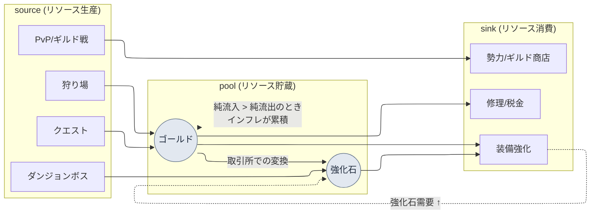

# 8.2 経済モデルをMachinationsへ — インフレは会議ではなくシミュレーションで捕まえる

> 第一想定読者：ライブ経済に責任を持つMMORPGのバランス/システムプランナー（中規模（10〜50人）チーム）
> 一人/趣味の読者向け縮小バージョン：§8.2.10「一人ならこれだけ」

ゴールドが漏れ始めたことに最初に気づいたのは、請求書ではなく取引所でした。リリース2か月目、強化石の相場がじわりと上がり、1か月後には2倍になりました。原因を探るために会議を設定しましたが、会議室から出てきたのはすべて「感覚」でした。ある人は新ダンジョンの報酬が過剰だと言い、ある人は狩り場の効率が上がったせいだと言い、ある人は単に高レベルユーザーが増えたからだと言いました。どれももっともらしく、だからこそ何も決まりませんでした。1時間を推測で燃やし、「ひとまず来週もっとデータを見よう」で終わりました。

問題は、リソースが1つではないことにあります。ゴールド・強化石・評判・名誉・ソウルストーンがそれぞれsource（入ってくる経路）とsink（出ていく経路）を持ち、その経路同士が互いを養い合います。強化石のボスはゴールドも落とします。ゴールドで買った装備が強化石を燃やします。リソース5種にフローが数十本も絡み合うと、頭の中の計算機では1つのリソースの1週間の収支すら正直に出せません。本章はその絡み合いを**Machinationsのノードモデル**へ移し、経済変更の意思決定を会議の推測ではなく**シミュレーションゲート**で通す方法を扱います。経済設計の一般理論は他の本に十分書かれていますから、本章はその理論を*AIワークフローで回す場面*だけに集中します。

> **著者の実運用メモ**
> 本章の事例は、著者が会社のR&Dフォルダで運用中の経済パイロット文書（`Economy_Machinations_Pilot`）と経済リサーチ作業領域を匿名化したものです。リソースの種類・source/sink構造・Pilot 4段階は実際の運用を忠実に写し、会社固有の名称・実数値は書籍用に置き換えるか、比率・方向のみで記しました。AI出力の本文は実際のセッションを再構成したものです。

---

## 8.2.1 経済は「リソース5種」ではなく「フロー数十本」

経済リソースを表に書くと5行なので、単純に見えます。落とし穴はリソースではなく、リソースをつなぐ**フロー**の本数にあります。

| リソース | source（流入） | sink（流出） |
|---|---|---|
| ゴールド | 狩り、クエスト報酬、取引所での販売 | 装備購入、強化、修理、税金 |
| 強化石 | ダンジョンボス、イベント | 装備強化、合成 |
| 評判 | サイドクエスト | 勢力商店、転職 |
| 名誉 | PvP、ギルド戦 | PvP商店、ギルド施設 |
| ソウルストーン | ボス討伐 | キャラクターの復活、スキル習得 |

リソースは5種ですが、source・sinkは合わせて二十数個あり、しかもリソース同士が変換されます（ゴールドで強化石を買う取引所は、ゴールドのsinkであると同時に強化石のsourceです）。フローが互いを養い合った瞬間、「ゴールドを5%多く供給したら強化石の相場はどうなるか」のような質問は、1つのリソースだけを見ても答えが出ません。これがキャラクターバランス（8.1）と経済バランスの決定的に違う点です。キャラクターバランスは数式1行で閉じますが、経済は**時間とともに累積する動的システム**なので、1週間の収支が0に近くても、26週を累積すると取引所が崩れます。

だから経済作業の本質は「数字をうまく選ぶこと」ではなく、**「フローが時間とともにどう累積するかをシミュレーションで見ること」**です。そして、そのシミュレーションモデルを手で組んで修正する作業は退屈で、やるたびに抜け漏れが生まれます。反復的で抜けやすいドラフト作業、しかしレビューは人ががっちり握るべき仕事 — この手触りの作業こそ、AIと人の分業線が最もきれいに引ける場所です。

まず、本章が扱う経済循環の骨格を1枚で載せておきます。



点線が本章の核心です。強化sinkが強化石の需要を引き上げて強化石の相場を押し上げ（`UP -.-> S`）、ゴールドの純流入が純流出を超えると、その超過分が毎週プール（pool）に積もってインフレとして累積します。この2本の点線を手計算で追跡するのは不可能なので、モデルが必要になります。

---

## 8.2.2 Machinations — 経済をノードグラフへ移すツール

Machinationsは、経済のフローをノードグラフとして描き、その上でシミュレーションを回すツールです。§8.2.1のmermaidを、実際に回せるモデルへ移す場面です。

| ノード | 役割 | 上の図では |
|---|---|---|
| Pool | リソースの貯蔵庫 | ゴールド・強化石 |
| Source | リソースの生産 | 狩り・クエスト・ボス |
| Drain | リソースの消費 | 強化・修理・商店 |
| Converter | リソースの変換 | 取引所（ゴールド→強化石） |
| Trigger | 条件付きの発動 | イベント・昇級報酬 |

これらのノードで経済をモデリングし、シミュレーションを1,000回回すと、単一の結果ではなく分布が得られます。「26週後のゴールド相場の中央値+X%、上位10%のユーザーは+Y%」のような形です。ただし、Machinationsは万能ではなく、導入自体がコストです。

| 限界 | 処方 |
|---|---|
| ゲームのコードとは別に動くため同期がずれる | 実際のテレメトリー（telemetry）で毎月/四半期ごとに補正（§8.2.6） |
| ノードグラフが大きくなると可読性が崩壊する | リソース別サブグラフに分割し、単一リソースから（§8.2.4） |
| シミュレーションは単純化されたユーザーモデル | 実際の行動分布で補正し、誤差のしきい値を設定 |
| 結果の解釈がドメイン知識に依存する | シミュレーション数値→意思決定をつなぐゲートの標準化（§8.2.5） |

そのため、Machinationsは無条件で導入するツールではありません。**リソース5種以上+リソース変換フロー+運営（ライブオプス）**という3つの条件が重なったときに元が取れます。リソース2〜3種の単純な経済ならExcelで十分で、その場合のMachinations導入は、効果より運用負担のほうが先に届きます。

---

## 8.2.3 ［ワークド・トランスクリプト］ゴールド単一リソースのモデルをAIでドラフトする

ツールの説明だけでは、これが実際に何を吐き出すのか分かりません。ゴールド1つをMachinationsモデルへ移す1サイクルを、入力プロンプトから人による拒否まで、最後まで追いかけます。入力プロンプトはそのままコピーして使え、出力は実際のセッションを再構成しました。

### ステップ1 — 入力：ゴールドのフローを機械が読める表へ

まず、ゴールドのsource・sinkをマスターデータから抜き出して表にします。新しく書くのではなく、抽出です。

```yaml
# gold_flows.yaml — ゴールド単一リソースのフロー (現行データシート抜粋)
resource: gold
sources:
  - id: hunting        # 狩り場ドロップ
    trigger: per_kill
    note: レベル帯別ドロップ曲線はreward_curveルールを適用
  - id: quest_reward   # クエスト報酬
    trigger: per_complete
  - id: market_sell    # 取引所での販売
    trigger: per_trade
sinks:
  - id: gear_buy       # 装備購入
  - id: enhance        # 強化コスト
  - id: repair         # 修理
  - id: tax            # 取引所税金 (sinkでありゴールド回収の核心)
# ユーザー行動分布(時間あたり狩り回数・クエスト完了率)はまだ空 → AIが仮定したら明示させる
```

### ステップ2 — プロンプト：モデルを作らせつつ、仮定と形式を強制する

```
添付のgold_flows.yamlは、ゴールド単一リソースのsource 3個・sink 4個だ。
これをMachinationsモデルへ移すノード仕様のドラフトを作れ。

ルール:
1) 各フローをノード種類(Source/Drain/Pool/Converter)に分類せよ。
2) 各ノードに「1週基準・ユーザー1人あたり期待流量」の算式を提案しつつ、
   ユーザー行動の仮定(時間あたり狩り回数・クエスト完了率など)が必要なら
   その仮定を別の行に「★仮定」と明示せよ。仮定を本文に隠すな。
3) sourceの総流入とsinkの総流出を分離し、1週の純収支(net)を計算せよ。
4) 取引所税金(tax)がゴールドを経済から永久に除去する唯一のsinkであることを
   反映し、他のsink(強化・修理)はゴールドがNPCへ移動するだけで回収では
   ないことを区別せよ。
5) 君が「確信できない」仮定は別途★を付け、人の決定に渡せ。

出力形式: 表 (ノード | 種類 | 1週流量算式 | 仮定 | 確信度)。それ以外の説明は禁止。
```

このプロンプトで実際に長く書かれているのは、モデルを作れという指示ではなく、仮定をどこにどう書くかというルールです。経済モデリングでAIを自由に放つと、もっともらしい数字を、仮定を隠したまま吐き出します。そうなると、モデルが間違っていても*どこが間違っているのか*を指させません。**ユーザー行動の仮定を本文の外へ引きずり出し、別の行に立たせること** — そこにこの依頼の重みがすべて載っています。仮定が見えてこそ、検証できます。

### ステップ3 — Claudeの出力（再構成、抜粋）

```
| ノード        | 種類      | 1週流量算式                            | 仮定             | 確信度 |
|--------------|-----------|----------------------------------------|------------------|-------|
| hunting      | Source    | 時間あたり討伐 × 平均ドロップ × 週間プレイ時間 | ★週15h、討伐80/h | 中    |
| quest_reward | Source    | デイリークエスト数 × 報酬 × 7 × 完了率   | ★完了率 0.7      | 中    |
| market_sell  | Source    | (ユーザー間の移転 — 純増ではない)        | 純経済には0寄与   | 高    |
| gear_buy     | Drain     | 購入頻度 × 平均価格                      | ★週1.2回         | 低    |
| enhance      | Drain     | 強化試行 × 1回あたりコスト               | ★週8回           | 中    |
| repair       | Drain     | 狩り時間 × 修理率                        |                  | 高    |
| tax          | Drain     | 取引額 × 税率 (★唯一の永久回収sink)      | ★税率 5%         | 高    |
| ── 純収支    | net       | Σsource − Σsink ≈ +(中活性基準で正)      | 上の仮定の合算時  | ★低   |

★仮定の警告: market_sellはユーザー↔ユーザーのゴールド移動で、経済総量には0寄与。
これをsourceとして足すとインフレを二重計上する。モデルで別途処理が必要。
★確信できない点: gear_buy頻度(週1.2回)は推測。実際の購入telemetry
なしではsinkが過小/過大に推定されうる → 人の決定が必要。
```

出力で最も価値があるのは表ではなく、**一番下の2行、「★가정 경고」（★仮定の警告）と「★확신 못 하는 점」（★確信できない点）**です。AIが自分のモデルの弱点を2か所、自ら申告しました。良いプロンプトは、AIに「この仮定は信じられません」と言わせます。

### ステップ4 — 検証と拒否（人の出番）

この出力をそのままモデルに入れてはいけません。AIが申告した2つの★のうち1つが、実際にモデルを壊す欠陥でした。

`market_sell`（取引所での販売）を、AIは最初Sourceに分類しました。しかし、取引所での販売は**ユーザーAのゴールドがユーザーBへ渡る移転**であって、経済にゴールドが新しく生まれるわけではありません。これをsourceの流入に足すと、インフレを二重に計上することになります。AIは★仮定の警告で自ら指摘してはいたものの、表の本文では依然としてSourceの欄に残していました — 申告はしたが、モデルからは外していない、半分だけ正しい出力です。これは、入力のyamlで`market_sell`の性格（ユーザー間の移転か新規生成か）を明示しなかった、人側のデータ欠陥でもありました。

そこで、再依頼します。

```
market_sellはユーザー↔ユーザーのゴールド移転であり、経済総量のsourceではない(入力
漏れの修正)。このノードをsource合算から外し、代わりに「取引所税金(tax)が
移転額の一部を永久回収するsink」としてのみモデルに反映せよ。純収支を
再計算し、market_sell除外がnetに与えた影響を1行で示せ。
```

AIは`market_sell`をsourceから取り除き、税金だけをsinkに残したモデルで答え直しました。その結果、純収支（net）は最初の推定より低くなりました — 取引所での販売をsourceに誤って入れていたとき、インフレを過大評価していたことが明らかになったのです。**この1往復こそが核心です。**人が最初から手で組めば半日かかり、ノード分類のミスを本人が見つけるのは難しいのに対し、AIドラフト+「仮定の明示」の強制+1回の拒否なら1時間以内で済み、AIが申告した★を人が判定する構造のおかげで、二重計上のような欠陥がモデルに入る前に捕まります（著者の推定 — 節約できる時間はチームやリソース数によって異なるため、絶対値よりも「手で最初から」と「ドラフト+人によるレビュー」という構造の違いとして読むのが正しいです）。

---

## 8.2.4 1リソースずつ — Pilot 4段階で導入する

ゴールドのモデルが1つ閉じたからといって、全リソースを一度にモデリングしてはいけません。著者の運用でも、全体を一度に投入しませんでした。単一リソースから始め、検証・補正を経て拡張する4段階を踏みました。

| 段階 | 範囲 | 核心ゲート |
|---|---|---|
| 1. 単一リソース（ゴールド）のモデリング | source 3・sink 4、§8.2.3のセッション | ノード分類・仮定の明示 |
| 2. シミュレーションvs実測の比較 | シミュレーションの1週net vs テレメトリーの1週 | 誤差しきい値の通過可否 |
| 3. モデル精度の補正 | ユーザー行動分布（低/中/高アクティブ）の反映 | セグメント別誤差の再測定 |
| 4. リソース拡張（5種） | 強化石・評判・名誉・ソウルストーンを段階的に追加 | 変換フロー（取引所）の検証 |

2段階目の比較検証が、この4段階の心臓です。シミュレーションと実測がずれているなら、間違っているのはゲームではなくモデルです。ずれたモデルで意思決定を下せば、その決定はライブで事故になって返ってきます。だから、拡張（4段階目）は必ず2・3段階目の検証を通過した後にだけ行います。この順序が崩れると、つまり単一リソースの検証を飛ばして5種を一度に入れると、どのリソースのモデルが間違っているのかさえ切り分けて指させなくなります。

---

## 8.2.5 シミュレーションゲート — 経済変更の意思決定に遮断壁を設ける

モデルが検証を通過したら、今度は経済に影響するすべての変更決定の前に**シミュレーションゲート**を立てます。会議で「感覚」によって通していた決定を、シミュレーションの通過に置き換える場面です。

| 決定の種類 | シミュレーション義務 |
|---|---|
| source・sinkの新規追加 | 必須 |
| リソース変換比率の変更（取引所レートなど） | 必須 |
| 新ダンジョン・イベント報酬の設計 | 必須 |
| 価格変更（±10%以上） | 必須 |
| 新規職業の効率検証 | 必須 |
| UI変更など経済と無関係 | 免除 |

ゲートが実際にどう機能するのか、§8.2.3で検証したゴールドモデルの上で、1つの決定を通してみます。

> **［シミュレーションゲート — イベント報酬の決定］（実際の形式を再構成）**
>
> ```
> [変更案]   週末イベント: デイリーログイン報酬 +500 ゴールド
> [ゲート]   source新規追加 → シミュレーション必須
> [シミュレーション1000回の結果]
>   - 1週のゴールド純収支: +6,900 → +10,400 (+50%)
>   - 26週累積時のゴールド相場中央値 ~+28% (インフレ警告: ±10%超過)
>   - 上位10%活性ユーザー: ~+41% (segment偏差が大きい)
> [判定]     FAIL — 安定範囲(±10%/長期)超過
> [補正案]   イベントsourceに同時sinkを付着: イベント限定商店(ゴールド回収)
>            再シミュレーション → 26週累積 +9% (PASS)
> ```

ゲートの価値は最後の2行にあります。「報酬+500を配ろう」という決定が会議の推測だったなら、「大丈夫そうだ」で通っていたでしょう。シミュレーションゲートはその決定を26週で+28%のインフレに換算して見せ、**sourceを追加するならsinkを一緒に付けよ**という補正案まで強制します。経済変更を推測ではなく、シミュレーションの通過/失敗で判定すること — これがゲートのすべてです。

ここで、よくはまる罠を1つ指摘します。セグメントの偏差です。中アクティブユーザー基準で+28%でも、上位10%は+41%です。ゴールドを最も多く稼ぐユーザー層がインフレを最も速く累積させるため、シミュレーションは平均だけを見ずに、セグメント別に回すべきです。平均だけを見ると、高アクティブユーザー発の相場崩壊を見逃します。

---

## 8.2.6 モデルはリリース後、テレメトリーで毎月進化する

シミュレーションゲートが信頼されるには、モデルが実際のゲームとずれていてはいけません。ゲームは毎週変わるので、モデルも追いかけて補正する必要があります。リリース後は、実際のテレメトリーで毎月（変更が少ない時期には四半期ごとに）モデルを突き合わせます。

```
モデル補正サイクル (月間)
─────────────────────────────────
1. 実際のユーザーtelemetry 1か月分を抽出 (リソース別フロー集計)
2. segment(低/中/高活性)別のsource·sink実測流量を算出
3. Machinationsシミュレーションと項目別に比較
4. 誤差 >15% の項目 = モデルパラメータ調整 (その項目の★仮定が違っていた印)
5. 調整後に再シミュレーション → 翌月ゲートの基準モデルとして使用
```

核心は4番です。誤差が大きい項目は、すなわち§8.2.3でAIが★で申告した「確信できない仮定」が実際とずれていたという信号です。たとえば、AIが推測した`gear_buy`の頻度（週1.2回）が実測では週2回だったなら、その仮定をテレメトリーの値に置き換えます。この補正を止めるとモデルがゲームからゆっくり離れていき、どこかの四半期で、シミュレーションゲートが「通したのに実際にはインフレが来た」という事故を起こします。その瞬間、シミュレーション自体の信頼が事後的に崩れます。補正は運用の付随作業ではなく、ゲートを生かしておくための正規のサイクルです。

---

## 8.2.7 進歩的適用 — 異常パターン検知・変更空間・シミュレーション並列化

ここまでが経済モデリングの「保守的適用」です。人が変更を発議し、モデルで検証し、結果で決定します。もう一歩進むと、8.1.6で見た進歩的適用の3つの軸 — z-score検知・変更空間の定義・シミュレーション並列化 — が、経済インフラの上でも同じように開けます。

**第一に、異常パターン検知。**毎月の補正サイクル（§8.2.6）の誤差比較を人が目で行う代わりに、モデルと実測の偏差がしきい値を超えた項目を、コードが先に拾い上げます。強化石の相場が2倍になったことを取引所を見て知るのではなく、「強化石のsource流量がモデル比+30%乖離」というアラートが、会議の前に届きます。

**第二に、変更空間の定義。**「報酬を+500配る/配らない」の二分法ではなく、報酬の範囲（0〜+1000）と同時sinkの範囲を変更空間として定義しておけば、その空間の中でインフレ±10%を満たす組み合わせを探索できます。人は「どこからどこまで」を決め、その中の最適な組み合わせの探索は自動化します。

**第三に、シミュレーション並列化。**変更案1つを1,000回回す代わりに、変更空間の中の候補数十個を並列に1,000回ずつ回して、分布を一度に比較します。会議室で1案ずつ議論していた場が、候補マトリクスのシミュレーション結果の比較に変わります。

共通する思想は、人が変更を*発議*していた場を、コードが変更空間を*探索*する場へ移すことです。ただし、保守的適用（§8.2.3\~8.2.6）が安定して回り、モデルがテレメトリーで検証された後の話です。検証されていないモデルで変更空間を自動探索すると、間違ったモデルが間違った最適値を自信満々に出してきます。

> **［急進的適用 — 経済を「次元ベクトル」に圧縮して探索する］（まだ時期尚早）**
>
> 進歩的適用からさらに一歩進んだ領域です。断定ではなく、研究動向として読んでください（次元ベクトル・埋め込み（エンベディング）が初めてなら、付録Mの「地図」を1枚先に見ると、以下が読みやすくなります — 本書の5つの「方向標識」は、すべてその図の上で回っています）。ここまで来た経済モデルは、リソース5種にフロー数十本が絡んだ高複雑度のシステムで、§8.2.7の変更空間の探索も、結局はその数十本のフローを1つずつパラメータに取って回す方式です。急進的な発想は、この複雑度自体を**次元ベクトルに圧縮**し、その圧縮空間の上で解を探すことです。
>
> 遠く見える比喩が1つ、手がかりになります。定性的で手につかみにくい領域の代表としてよく挙げられる料理レシピを、ある研究（Epicure — Radzikowski·Chen, 2026, arXiv:2605.22391 · デモ epicure.kaikaku.ai）では、11の出典のレシピ414万件から標準食材1,790種を選り出し、食材同士の関係を数百次元のベクトルに圧縮しました。核心は、「味」という定性的な対象も、食材間の関係を座標に換算すれば、似たレシピはベクトル空間で近くに集まり、その間を補間して新しい組み合わせを探索できるという点です — Epicureもこの圧縮空間で、1つの食材を特定の料理圏の方向へ回転させて対応する食材を見つける補間探索を示しています。
>
> 経済も原理は同じです。source・sink・変換フローをそれぞれ次元に取ったベクトルで経済状態を表現すれば、「インフレ±10%以内で安定した経済」が、その空間の1つの領域として捉えられます。そうなれば、変更案を1つずつシミュレーションにかける代わりに、その安定領域の中/近くで解を直接探索する道が開けます。候補を逐一回して比較していた§8.2.7の並列シミュレーションが、圧縮空間上の探索1回に絞り込まれる可能性です。
>
> なぜ「まだ時期尚早」なのか。第一に、何を次元に取るか（どのフローが独立で、どれが従属か）を決めること自体が、ドメインの難題です。第二に、圧縮は本質的に情報を捨てる作業なので、捨てた次元でライブの事故が起きえます。第三に、これらすべては、保守的適用のテレメトリー検証（§8.2.6）が固いときにだけ意味があります — 圧縮前のモデルがゲームとずれていれば、圧縮はその誤差まできれいに圧縮するだけです。だから本節は処方ではなく、**方向標識**です。いまやるべきことは保守的適用を正直に回すことであり、次元ベクトルは、その土台が十分に積み上がったチームが数年後にのぞき込む研究領域として残しておきます。

---

## 8.2.8 測定 — 会議がシミュレーションに変わった場所

ツール導入の前後を比較します。以下の時間・頻度は導入初期の運用で体感した方向を写したものなので、精密な絶対値として読むのではなく、どちらへ動いたかとして読むのが正しいです。

| 項目 | 導入前（会議・手計算） | 導入後（シミュレーションゲート） |
|---|---|---|
| 経済変更の決定→適用 | 2〜4週間（推測・再議論の繰り返し） | 1〜3日（シミュレーション検証1回） |
| インフレ事故 | 四半期あたり1〜2件（事後発見） | 四半期あたり0〜1件（ゲートで事前遮断） |
| source・sink追加の頻度 | 四半期に1〜2回（怖くて保守的） | 月1〜2回（シミュレーションが安全を保証） |
| 経済会議の頻度 | 週3〜4回 | 週1〜2回 |

表の数字より、最後の行の意味のほうが大きいです。会議頻度の減少は、シミュレーションが議論を置き換えたからです。「私の考えでは強化石にインフレが来そうだ」が「シミュレーション結果は26週で+28%」に変わると、推測をめぐって1時間争っていた場が、5分の結果共有で終わります。これは、著者のシステムの振り返りに固定化された概念（atom `automation_signal_value_over_time_savings` — 自動化の価値は時間の節約ではなくシグナルの露出）と正確に同じ場所です。シミュレーションゲートの本当の産出物は、節約された時間ではなく、会議で推測が占めていた場所を数字が占めるようにしたことです。

ただし、1つだけは正直に書いておきます。表の「四半期あたり1〜2件→0〜1件」は精密な測定値ではなく、運用の体感としての方向です。インフレ事故は定義（相場±何%を事故と見なすか）によってカウントが変わるため、絶対件数よりも「事後発見から事前遮断へ移った」という構造の変化として読むのが正しいです。

---

## 8.2.9 よくある失敗

| パターン | なぜ失敗するか | 処方 |
|---|---|---|
| 全リソースを一度にモデリング | どのリソースのモデルが間違っているか切り分け不能 | 単一リソースのPilotから（§8.2.4） |
| AIモデルの仮定をレビューなしで受け入れる | 取引所の二重計上のような欠陥がそのまま入る | 仮定の明示を強制+人による拒否（§8.2.3） |
| シミュレーションゲートなしで経済変更 | 事後のインフレ回復コストが莫大 | 義務シミュレーション項目の定義（§8.2.5） |
| 平均だけシミュレーションし、セグメントを無視 | 高アクティブユーザー発の相場崩壊を見逃す | セグメント別シミュレーション（§8.2.5） |
| リリース後にテレメトリー補正をしない | モデルがゲームから離れてゲートの信頼が崩壊 | 月/四半期の補正サイクル（§8.2.6） |
| 検証されていないモデルで変更空間を自動探索 | 間違ったモデルが間違った最適値を確信を持って出す | 保守的適用の安定後に進歩的適用へ（§8.2.7） |

2つ目が最も頻繁に見落とされます。§8.2.3で見た取引所の二重計上のように、AIはもっともらしいモデルを自信を持って吐き出しつつ、自分の仮定の弱点は★で申告するだけで、本文には欠陥を残しておきます。その★を人が判定しなければ、間違ったモデルが通過し、その上のすべてのシミュレーション決定が一緒に間違います。

---

## 8.2.10 やってみよう — 今日できる1ステップ

> **一人ならこれだけ**：Machinationsもテレメトリーもなくて構いません。自分のゲーム（または好きなゲーム）のリソースを1つ選んでsource・sinkを紙に書き出し、§8.2.3のプロンプトをそのまま貼り付けて、1週間の純収支モデルのドラフトを受け取ってみましょう。AIが★で明示した仮定を1つ選んで「この仮定は信じられない。根拠をもう一度示せ」と反論してみると、経済モデルがどんな仮定の束なのか — そして、その仮定が1つ崩れると結論がどうひっくり返るのか — が体に入ってきます。

チームなら、次の1ステップから始めましょう。全リソースではなく、**最も問題のあるリソース1つ**（普通はゴールドか強化石）を選んで§8.2.3の単一リソースモデルだけを先に立て、経済変更の決定1種類（例：イベント報酬）に§8.2.5のシミュレーションゲートをかけてください。リソース1つ+決定1種類だけでも、会議で推測をめぐって争っていた場を、数字1行に変えられます。

setup→prompt→verifyで要約すると — **setup**：問題のリソース1つのsource・sinkをyamlに抽出します。**prompt**：§8.2.3の形式でノードモデルのドラフトを受け取りつつ、ユーザー行動の仮定を★で明示させます。**verify**：AIが申告した★の仮定とノード分類（特にユーザー間の移転か新規生成か）を、人が直接拒否・再依頼します。

---

### 本章のポイント
- 経済はリソース5種ではなく、時間とともに累積するフロー数十本なので、シミュレーションが必要です。
- AIモデルのドラフトには仮定の明示を強制し、その仮定を人が拒否します。
- 経済変更は会議の推測ではなく、シミュレーションゲートの通過/失敗で判定します。

### 次章のプレビュー
- 8.3 Damage Simulator（2008〜） — 18年生きたシミュレーションツールがAI時代にどう再利用されるか
