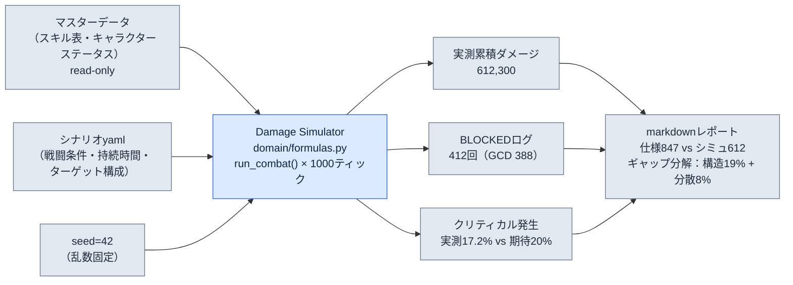

# 8.3 Damage Simulator — 仕様DPSとシミュレーション値が食い違った日

2008年のある未明、私は1枚のExcelを前に、同じ数字を3回検算していました。仕様書には、ある剣キャラクターの秒間ダメージ（DPS）が**847**と書かれていました。ところが、その日初めて回したシミュレーターは、同じキャラクターを同じスペックで入れたのに**612**を吐き出しました。27%の差。どちらか一方は嘘をついていて、私はどちらが嘘なのか、まだ分かりませんでした。

仕様書のDPSは、紙の上の約束です。スキル1発のダメージに発動頻度を掛けた算数です。シミュレーターのDPSは、その約束を1,000回実際に振ってみた結果です。クールタイム（クールダウン）が重なり、発動モーションに時間を食われ、クリティカルが期待値どおりに出ない — 紙が知らない摩擦が割り込んできます。この27%の隙間こそ、バランス担当プランナーの飯のタネです。紙を信じれば、リリース後に泣くことになります。

この章は、その道具一本の物語です。2008年に作り、今まで手放さずにきたDamage Simulator。仕様と算出が食い違う正確な地点をどう追跡したのか、そして18年後、その追跡にAIをどう組み込んだのかを、1本の実際のワークド・トランスクリプトで追いかけます。

---

## 8.3.1 仕様DPSはなぜいつも嘘をつくのか

まず、あの612対847の正体を解剖してみましょう。仕様書を書いた後輩プランナー（以下、チームメンバーA）に落ち度はありませんでした。彼はスキル表に書かれたとおりに掛け算をしただけです。

仕様上のDPS計算はこういう形をしています。1人のキャラクターが持つ3つのスキルを仮定します。

| スキル | 単発ダメージ | クールタイム | キャストタイム |
|---|---|---|---|
| 横斬り（횡베기） | 320 | 3.0s | 0.6s |
| 突き（찌르기） | 540 | 6.0s | 0.9s |
| 通常攻撃（평타） | 180 | 1.2s | 0.4s |

チームメンバーAの仕様計算は、「各スキルをクールタイムが明けるたびに漏れなく使う」という理想的な仮定の上に立っていました。横斬りは3秒ごとに320、突きは6秒ごとに540、通常攻撃が空き時間を埋めます。算数としてはきれいに847が出ます。紙の上では、キャラクターは手が何本もあるので、発動モーションが互いを邪魔しません。

シミュレーターが612を出した理由はただ一つ、手が1本だからです。0.9秒の突きを発動している間は、横斬りのクールタイムが明けても使えません。発動モーション同士が食い合うこの**GCD（グローバルクールダウン）衝突**が、仕様には存在しません。紙は摩擦のない真空で、シミュレーションは摩擦のある戦場です。24年この仕事を続けて学んだ最初の真実がこれです — 仕様DPSは上限値であって、実測値ではない。そしてユーザーは、上限値ではなく実測値でゲームを遊びます。

---

## 8.3.2 ワークド・トランスクリプト — 612の出どころをAIに問いただす

2008年の私は、この27%の隙間を手作業で埋めました。シミュレーションのログを1行ずつ目で読み、どのフレームでスキルがブロックされたのかを数えました。半日かかりました。18年経った今、私は同じログをClaudeに投げます。以下は実際に行った1セッションの全文です。要約せず、外した最初の試みまでそのまま載せます — その外し方こそ、この道具の使い方の半分だからです。

私が投げたプロンプトはこうでした。

> 添付したのは、私たちのDamage Simulator（`damage_sim/`、Python）の単一キャラクター1,000ティック戦闘ログの一部です。仕様書上、このキャラクターのDPSは847ですが、シミュレーションの算出は612になります。27%のギャップの原因をログから探してください。ログのフォーマットは`[tick] event skill=SKILL state=STATE`です。推測ではなく、ログにある根拠だけを挙げてください。根拠が足りなければ、足りないと言ってください。
>
> ```
> [0.0] cast skill=찌르기 state=START
> [0.9] cast skill=찌르기 state=HIT dmg=540
> [0.9] cast skill=횡베기 state=BLOCKED reason=GCD
> [1.5] cast skill=평타 state=HIT dmg=180
> [1.9] cast skill=평타 state=BLOCKED reason=GCD
> [3.0] cast skill=횡베기 state=HIT dmg=320
> [3.6] cast skill=평타 state=HIT dmg=180
> ... (994 lines omitted)
> [997.2] cast skill=찌르기 state=HIT dmg=540
> ```

Claudeの生の出力はこうでした（手を加えていません）。

> ログから確認できる事実：
>
> 1. `state=BLOCKED reason=GCD`イベントが繰り返し登場します。`[0.9]`では横斬りが、`[1.9]`では通常攻撃がGCD（グローバルクールダウン）によってブロックされています。
> 2. 突きのキャスト（0.0→0.9、0.9秒）が終わるまで、ほかのスキルは発動できません。キャストタイムがGCDを占有する構造に見えます。
> 3. したがって、仕様上の「すべてのスキルをクールタイムごとに発動する」という仮定が崩れます。実際には発動モーション同士が衝突し、一部の発動が漏れています。
>
> ただし、提供されたログは1,000行中7行だけです。**27%という正確なギャップがGCD衝突だけで説明できるかどうかは、この7行では断定できません。**BLOCKEDイベントの総発生回数と、それによって漏れたダメージの総量を集計してこそ、27%が検証できます。全ログのBLOCKED集計をいただければ、定量的に確認します。

ここで止まったことが重要です。AIは原因を**指摘**しましたが、27%を**証明**することはできず、自らその限界を口にしました。紙の上だけで考えるプランナーなら「GCDのせいですね」で会議を終わらせていた場面で、この道具は「7行では分からない」と踏みとどまりました。私はその要求が正当だと判断しました — これが人による検証です。そこで、全ログのBLOCKED集計を出して投げ直しました。

> 全1,000ティックの集計です。BLOCKEDは計412回、うちGCD起因が388回、クールタイム未完了起因が24回。BLOCKEDで漏れた推定ダメージは横斬り換算で約19,800。総戦闘1,000ティック（=秒）の間の仕様上の期待ダメージは847,000、シミュレーション実測の累積ダメージは612,300。この数字で27%のギャップを再検討してください。

Claudeの2回目の出力です。

> 集計で検証します。
>
> - 仕様上の期待累積：847,000
> - シミュレーション実測累積：612,300
> - ギャップ：234,700（27.7%）
>
> このギャップの構成：
> - GCD衝突による直接の漏れ（388回）：推定約19,800は横斬り換算ですが、漏れたスロットにより高いダメージのスキルが入り得た機会費用まで合算する必要があります。漏れたスロットを平均ダメージで換算すると、漏れ分は19,800より大きくなります。
> - ただし、234,700のすべてがBLOCKEDだけで説明されるわけではありません。**仕様の847が「クリティカル期待値を平均としてすでに織り込んだ」値なのか、「クリティカルを含まない基本値」なのかによって、残りのギャップの解釈が変わります。**仕様847のクリティカルの仮定を教えていただければ、残余ギャップを分解します。

また止まりました。そして、また正確な場所で止まりました。仕様の847がクリティカルをどう扱ったのか — これはログにない情報で、チームメンバーAの頭の中にしかありませんでした。AIは、自分が持つデータの境界を知っていました。私が確認したところ、仕様の847はクリティカル率20%・1.5倍を期待値として平準化して織り込んだ値で、シミュレーションはseed固定のうえで、実際のクリティカル発生回数が期待値より低く出た1回分でした。つまり27%のギャップは、**GCD衝突（構造的・再現される）**と**クリティカルの分散（統計的・この1回の運）**が混ざった値だったのです。

この分解が結論です。GCD衝突分は設計で直すべき本物の問題で、クリティカルの分散分はシードを変えて1,000回の平均を取れば消えるノイズです。二つを混ぜて「キャラクターが弱い」と上方修正をかければ、1,000回平均ではまともだったキャラクターが強くなりすぎます。紙も知らず、1回のシミュレーションも知らず、**AIひとりでも分からなかった**この区分を作ったのは、ログの集計と仕様の隠れた仮定を突きつけた、人による検証でした。

---

## 8.3.3 入力1セットが出力1セットに — シミュレーターの解剖

先ほどのセッションが覗き込んだ、あの道具の入出力を1セットで広げてみましょう。シミュレーターは、結局のところ正直な関数です。同じ入力には同じ出力。入力は三つの流れから集まります。



この図の核心は、矢印が一方向だということです。マスターデータはシミュレーターに**読まれるだけ**です。シミュレーターはデータを決して書き換えません。18年間で最も多くの事故を防いだルールが、この一本の矢印の向きでした。シミュレーターが自分の中にデータをコピーして持ち始めると、ゲームデータが変わった翌日、シミュレーターは昨日の世界をシミュレーションします。そうして出てきたレポートで会議をすれば、会議全体が昨日の世界をめぐって争うことになります。

具体的な入力1セット（シナリオyaml）はこういう形です。

```yaml
# scenarios/single_dps_check.yaml
scenario: single_target_dps
duration_ticks: 1000      # 1ティック = 0.1s 仮定、100秒戦闘
seed: 42                  # 決定論 — 同じ入力に同じ出力
actor:
  char_id: K_004          # ゲームデータシートから read
  skill_rotation: optimal # GCD衝突時は最高期待ダメージ優先
target:
  defense: 1200
  hp: infinite            # DPS測定用の無限体力ダミー
report:
  compare_to_spec: 847    # 仕様DPSを入れてギャップを自動分解
```

そして、出力1セット（レポート抜粋）はこうです。

```markdown
# Damage Simulator Report — K_004 single DPS
入力: scenarios/single_dps_check.yaml | seed=42 | data rev. 2026-06-05

## 仕様対比
- 仕様DPS:        847   (クリティカル20%·1.5x 期待値平坦化込み)
- シミュ実測DPS:  612   (このシードの1回分)
- ギャップ:      -27.7%

## ギャップ分解
- 構造的(GCD衝突、再現される):     -19.2%  ← 設計検討の対象
- 統計的(クリティカル分散、この回): -8.5%  ← 1000回平均で消える見込み

## 再現検証
- seed=42 再実行3回 → 612,300 / 612,300 / 612,300 (一致)
- seed 0~999 1000回平均DPS → 731 (クリティカル分散の消去後)
```

最後の行を見てください。seed 0〜999で1,000回回した平均は731でした。仕様の847と1,000回平均731のギャップ116（13.7%）こそが、GCD衝突という**本物の構造問題**の大きさです。1回分の612ではなく、この731が設計会議の入力にならなければいけません。紙の847でも、運の悪い1回の612でもなく、1,000回が合意した731。この数字を手にするまでが、バランス担当プランナーの仕事です。

---

## 8.3.4 2008年の手と2026年の手

この道具は18年生きてきましたが、同じコードで生きてきたわけではありません。ハンガーはそのままに、服だけを5回着せ替えました。ハンガーとは、先ほどのレポートの論理 — 仕様と実測を分けて見て、ギャップを構造と分散に分解し、再現で検証する手順です。この手順は、2008年のExcel VBA（Excelのマクロ言語）でも2026年のPythonでも、文字どおり同じです。

| 時期 | 服（技術） | ハンガー（変わらない手順） |
|---|---|---|
| 2008〜2011 | Excel VBA、1:1 | 仕様とのギャップ分解 |
| 2012〜2016 | C#コンソール、N:N | 〃 |
| 2017〜2020 | Python + Web | 〃 |
| 2021〜2024 | Python + ML | 〃（+ ユーザー分布の反映） |
| 2025〜 | Python + LLM補助 | 〃（+ ログ照会・仮説生成） |

5回の着せ替えに耐えた秘訣は、フォルダー構造に刻まれています。

```
damage_sim/
├── domain/          # ハンガー — 18年そのまま
│   ├── formulas.py      # ダメージ公式·GCD衝突判定
│   └── metrics.py       # ギャップ分解ロジック
├── adapters/        # ゲームデータ read-only
│   └── excel_reader.py
├── runners/         # 服 — 技術が変わるたびに交換
│   └── cli_runner.py
└── reporters/       # 服 — レポート出力形式
    └── markdown_report.py
```

技術が変わったら、`runners/`と`reporters/`だけを書き直します。`domain/`のギャップ分解ロジックは、18年分の資産がそのまま生き残ります。2008年にExcelのセルで組んだGCD衝突の判定式が、関数シグネチャだけ変わって、今も`formulas.py`の中で回っています。道具を一つの技術に釘付けにすれば、その技術と一緒に老いて死ぬ — それを私は、死んだ道具を何本も見送りながら学びました。

2025年に取り付けたLLMは、新しいハンガーではなく新しい手です。先ほどのセッションで見たとおり、AIは**ログを読んで仮説を立てる**手であり、半日かかっていたログ追跡が数分に縮みました。しかし、ハンガーには触れさせません — ギャップが27%なのか、クリティカルが何パーセント出たのかを**決定**するのは、今もseed固定の決定論コアです。その場所にLLMが入った瞬間、リグレッション検証が不可能になり、道具は死にます。

---

## 8.3.5 決定論コアとその外側 — 線をどこに引くか

バランスツールに一本だけ線を引くとしたら、私は決定論コアの境界に引きます。内側は同じ入力に同じ出力が鋼のように保証されなければならず、外側は人やAIが自由に仮説を投げて構いません。

内側（決定論 — AI禁止）：
- ダメージ公式、GCD衝突判定、クリティカル発生、累積集計。
- `seed=42`で3回回して、612,300が3回同じに出なければなりません。これが崩れると、昨日のレポートと今日のレポートを比較できません。

外側（仮説・解釈 — AI歓迎）：
- 「なぜこのキャラクター構成の勝率が異常なのか」のような原因の問いかけ。
- ログからBLOCKEDパターンを探すこと、自然言語レポートのドラフト、シナリオyamlのドラフト。

先ほどのワークド・トランスクリプトは、正確にこの線の上で動いていました。AIは外側で「GCD衝突が原因」という仮説を素早く立てました。しかし、27%という数字、612という数字は最後まで決定論コアが計算した値であり、AIはその値を受け取って解釈だけをしました。そして二度も「このデータでは断定できない」と止まりました — 決定論コアには出せない情報（仕様のクリティカルの仮定）を要求しながら。この立ち止まりが、よい道具の証です。仮説を診断と取り違えないこと。

数値について、一つ正直に明かしておきます。この章の847・612・731・412回のような具体的な数字は、説明のために構成した例示値です。ただし、仕様DPSがシミュレーション実測より常に高く出るという**方向**、そのギャップが構造的衝突と統計的分散に分解されるという**構造**、seed固定がリグレッション検証の前提だという**原則**は、2008年から18年間、実際に運用しながら繰り返し確認してきたものです。比率の大きさはプロジェクトごとに違いますが、方向と構造は変わりませんでした。

---

## やってみよう — 仕様とのギャップ分解を1回

**setup.** ゲームデータからキャラクターを1体選び、スキル表（ダメージ・クールタイム・キャストタイム）と仕様DPSを確保しましょう。シミュレーターがなければ、1,000ティックの単一ターゲット戦闘を回す最小スクリプトを書いてみましょう。核心は、`seed`を引数で受け取って固定できること、この一点です。

**prompt.** シミュレーションログ（BLOCKEDイベントを含む）と仕様DPSを一緒に投げましょう。

> 添付はキャラクター1体の1,000ティック戦闘ログとBLOCKED集計です。仕様DPSは[N]ですが、シミュレーションの算出は[M]です。ギャップの原因をログの根拠だけで分解してください。構造的原因（再現される衝突）と統計的原因（この回の分散）を区別してください。根拠が足りなければ足りないと言い、何がさらに必要かを指摘してください。

**verify.** AIが指摘した構造的原因を、シードを変えて1,000回平均で検証しましょう。平均でもギャップが残れば本物の構造問題、消えれば分散ノイズです。AIが「断定できない」と止まったら、それは失敗ではなく正常です — 止まった場所に人が入り、仕様の隠れた仮定を埋めます。

### 一人ミニ版

シミュレーターもMLもない一人開発者なら、Excel1枚とAIだけで同じ手順を回せます。スキル表をシートに書き、`RAND()`でクリティカルを振る1,000行のシミュレーションを1列に作りましょう。シード固定ができないので、`F9`で100回再計算して平均を目で確かめます。その平均と仕様DPSのギャップをAIに「構造原因と分散原因に分けてほしい」と投げましょう。道具は小さくても、ハンガー — 仕様とのギャップ分解、構造と分散の分離、再現検証 — は同じように立ちます。

---

### 本章のポイント
- 仕様DPSは摩擦のない上限値であり、ユーザーが体験する実測値は、シミュレーションが1,000回平均で見つけます。
- 仕様とシミュレーションのギャップは、構造的衝突と統計的分散に分けてこそ、本物の設計問題が見えます。
- 決定論コアの内側はAI禁止、仮説・解釈の外側ではAIを新しい手として歓迎します。

### 次章のプレビュー
- 8.4 AI補助バランスシミュレーション — 決定論コアを守りながら周辺を自動化する位置
