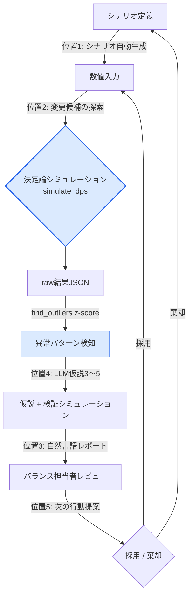

# 8.4 AI支援によるバランスシミュレーション

金曜日の午後4時、アルファビルドの5:5 PvP自動シミュレーション1,200戦が終わりました。結果のJSONは4メガバイト。その中のどこかに「チームA勝率92%」という1行が記録されているのですが、平均勝率は52%でした。私はその1行を探すのに40分を費やし、なぜそうなったのかは結局わからないまま退社しました。

バランスは決定論の領域です。同じ入力に同じ数式を通せば、常に同じダメージが出ます。だからダメージシミュレーターはコードであるべきで、報酬カーブは人が手で引くべきです。ここはAIが足を踏み入れてはいけない場所です。ところが、その決定論コアの*周辺*、つまり1,200戦の結果から異常な1行を見つけ、なぜそうなったのか仮説を立て、何を変えるべきか候補を絞り、その候補を再びシミュレーションにかけるという仕事。この周辺の労働が、バランス担当者の1日の大半を食いつぶします。本章は、その周辺にAIを付ける話です。コアには手を触れないままで。

## 8.4.1 コアはコード、周辺は人の労働

8.3で見たあの2008年製ダメージシミュレーター（エンジンと会社を3回乗り換えながらも、決定論コアはそのまま生き残ったツール）が、本章の出発点です。入力が同じなら出力も同じという性質、それがバランスツールの信頼のすべてです。同じビルドを2回回したのに勝率が違って出たら、そのツールは捨てるべきです。

そこでバランス作業の骨格を描いてみると、中央に決定論の塊があり、その入口と出口に人の手作業がぶら下がっている形になります。以下はその骨格を分解したものです。決定論の領域（青色）と、人・AIが介入する領域（オレンジ色）を色で分けてあります。

<svg viewBox="0 0 720 300" xmlns="http://www.w3.org/2000/svg" font-family="sans-serif" font-size="13">
  <rect x="0" y="0" width="720" height="300" fill="#fbfbfd"/>
  <!-- 決定論コア -->
  <rect x="270" y="110" width="180" height="80" rx="8" fill="#dbeafe" stroke="#2563eb" stroke-width="2"/>
  <text x="360" y="142" text-anchor="middle" fill="#1e3a8a" font-weight="bold">決定論シミュレーション</text>
  <text x="360" y="162" text-anchor="middle" fill="#1e3a8a" font-size="11">simulate_dps()</text>
  <text x="360" y="178" text-anchor="middle" fill="#1e3a8a" font-size="11">入力=出力、AI禁止</text>
  <!-- 入口: シナリオ/変更 -->
  <rect x="30" y="40" width="170" height="50" rx="6" fill="#ffedd5" stroke="#ea580c" stroke-width="1.5"/>
  <text x="115" y="60" text-anchor="middle" fill="#9a3412" font-size="11" font-weight="bold">位置1 シナリオ生成</text>
  <text x="115" y="78" text-anchor="middle" fill="#9a3412" font-size="11">位置2 変更候補の探索</text>
  <!-- 出口: レポート/異常/行動 -->
  <rect x="520" y="40" width="170" height="50" rx="6" fill="#ffedd5" stroke="#ea580c" stroke-width="1.5"/>
  <text x="605" y="58" text-anchor="middle" fill="#9a3412" font-size="11" font-weight="bold">位置3 レポート</text>
  <text x="605" y="74" text-anchor="middle" fill="#9a3412" font-size="11">位置4 異常解釈</text>
  <text x="605" y="89" text-anchor="middle" fill="#9a3412" font-size="11">位置5 行動提案</text>
  <!-- 人 -->
  <rect x="290" y="230" width="140" height="44" rx="6" fill="#ffedd5" stroke="#ea580c" stroke-width="1.5"/>
  <text x="360" y="257" text-anchor="middle" fill="#9a3412" font-weight="bold">バランサー (採用・棄却)</text>
  <!-- 矢印 -->
  <line x1="200" y1="65" x2="285" y2="120" stroke="#94a3b8" stroke-width="1.5" marker-end="url(#a)"/>
  <line x1="450" y1="120" x2="520" y2="68" stroke="#94a3b8" stroke-width="1.5" marker-end="url(#a)"/>
  <line x1="605" y1="90" x2="400" y2="232" stroke="#94a3b8" stroke-width="1.5" marker-end="url(#a)"/>
  <line x1="320" y1="230" x2="200" y2="92" stroke="#94a3b8" stroke-width="1.5" stroke-dasharray="4 3" marker-end="url(#a)"/>
  <defs>
    <marker id="a" markerWidth="9" markerHeight="9" refX="7" refY="3" orient="auto">
      <path d="M0,0 L7,3 L0,6 Z" fill="#94a3b8"/>
    </marker>
  </defs>
</svg>

中央の青いボックス1つだけがコードです。残りの5つのオレンジのボックスはすべて人の判断・解釈・作成という労働であり、AIが入れる席はこの5か所だけです。LLMに「このキャラクターのDPSを計算して」と頼んだ瞬間、同じ入力に違う数字が返ってくる非決定論がコアへ染み込み、そのツールは18日も持たずに信頼を失います。

だから本章の背骨はシンプルです。コアを最後までコードとして守りながら、入口・出口の5か所にAIを付ける。そのうち最も手のかかる出口側、つまり1,200戦の結果から異常な1行を見つけて仮説を立てる仕事から自動化します。

## 8.4.2 ワークド・トランスクリプト：勝率92%の1行を追跡する

冒頭のあの92%に戻りましょう。今回は人が40分さまよう代わりに、決定論の検知器がその1行を拾い出し、LLMが仮説を立て、再びシミュレーションが検証する1サイクルを、最初から最後まで追いかけます。要約はせず、ツールが実際に吐いた生の出力をそのまま載せます。

### ステップ1 — 異常検知はコードがやる（z-score）

1,200戦の結果から「異常な」戦いを選び出すのはLLMではなく統計です。各指標の平均と標準偏差を求め、平均から標準偏差いくつ分離れているか（zスコア）で振り分けます。しきい値を超えれば外れ値（outlier）です。これは決定論であり、ハルシネーションが入り込む余地はありません。

```python
def find_outliers(results, threshold=2.5):
    # results: シミュレーション1試合ごとの {指標名: 値} 辞書のリスト
    means, stds = compute_per_metric(results)   # 指標別の平均・標準偏差
    outliers = []
    for r in results:
        for metric, value in r.items():
            if stds[metric] == 0:               # 分散0 → 比較不可、スキップ
                continue
            z = abs(value - means[metric]) / stds[metric]
            if z > threshold:
                outliers.append((r["scenario_id"], metric, value, round(z, 2)))
    return sorted(outliers, key=lambda x: -x[3])  # zの大きい順
```

実行すると次が出てきます。1,200戦のうち、しきい値2.5を超えたのはわずか3件でした。

```
[("pvp_5v5_S0417", "team_a_winrate", 0.92, 4.1),
 ("pvp_5v5_S0417", "match_duration",  41.0, 2.9),
 ("pvp_5v5_S0822", "team_b_winrate", 0.18, 2.6)]
```

最もzスコアが大きい最初の行、シナリオ`pvp_5v5_S0417`の勝率0.92（z=4.1）が、冒頭で私が40分さまよった、まさにあの1行です。人が4メガバイトのJSONを目で追う仕事ではなく、統計が3件にまで絞り込んでくれます。ここまでがコア、ここからがAIです。

### ステップ2 — LLMは仮説を立てる（確定診断の禁止）

今度はその1行をLLMに渡します。ただし、「原因を診断して」ではありません。LLMはドメイン知識から*あり得る原因の仮説*をいくつか投げるだけで、どれが本物かは再びシミュレーションが決めます。プロンプトの全文は次のとおりです。コードブロック内は原文（韓国語）のままです。内容としては、外れ値の数値とあわせて、refgame_archer_07のスキル「표식」（マーキング＝対象が受けるダメージ+12%のデバフ）、refgame_hybrid_21のスキル「추격」（追撃＝デバフ対象の追跡時に移動速度+20%）、この2体が同じチームに置かれた頻度が下位5%であるという関連情報を渡し、確定診断を禁じたうえで、あり得る原因の仮説3〜5個と各仮説の検証用シミュレーション1行を求めています。

```
[outlier]
シナリオ: pvp_5v5_S0417 — 5:5 PvP
チームA構成: [refgame_archer_07, refgame_archer_07, refgame_archer_07,
            refgame_hybrid_21, refgame_hybrid_21]
指標: team_a_winrate 0.92 (全体平均 0.52, z = 4.1)
付随指標: match_duration 41.0s (平均 28s, z = 2.9)

[関連情報]
- refgame_archer_07: 遠距離支援、スキル「표식」 — 対象に受けるダメージ +12% デバフ
- refgame_hybrid_21: 近接/遠距離混合ディーラー、スキル「추격」 — デバフ対象の追跡時に移動速度 +20%
- 2キャラクターが同じチームに配置されたことはほとんどない (組み合わせ頻度 下位5%)

要請:
このoutlierの可能な原因仮説を3〜5個提示してください。
- 各仮説に検証用の追加シミュレーション1行
- 確定診断は禁止。「〜かもしれない」レベルの仮説のみ。

回答形式: 番号付きリスト。前置き・結びなしで仮説のみ。
```

Claudeの生の出力をそのまま載せます（要約・整理はしません）。これも原文の韓国語のままです。

```
1. 「표식」デバフと「추격」の移動速度バフが乗算で累積し、
   archer_07の3体が표식をばらまく → hybrid_21が途切れず追撃する
   正のフィードバックループが形成された可能性がある。
   検証: hybrid_21を通常の近接ディーラーに差し替えて同じシナリオを再シミュレーション。

2. 표식デバフの+12%がスタック可能(stackable)に誤って設定され、
   archer_07の3体が+36%まで積み上げた可能性がある。
   検証: 표식のmax_stackを1に強制して再シミュレーション。

3. 5:5で遠距離3 + 追撃型2の構成が、単純に射程の優位で
   相手の進入を封鎖する構図かもしれない (シナジー無関係、組み合わせ自体が強い)。
   検証: 표식のデバフ効果を0%にして同じ組み合わせを再シミュレーション。

4. match_durationが平均より長い(41s)ことから、チームAが速く勝ったのでは
   なく「負けずに粘って後半逆転」する構造かもしれない。
   この場合、勝率より後半スケーリング数値が原因かもしれない。
   検証: 60秒時点の累積ダメージ曲線だけを別途抽出して比較。

5. (低確率) シミュレーションのシード偏向 — S0417シードでのみチームAの先攻が
   繰り返された可能性。統計アーティファクトである可能性。
   検証: 同じ組み合わせをシード50個で再シミュレーションして勝率分散を確認。
```

ここで止まるのが重要です。出力された仮説は、①「표식」デバフと「추격」の移動速度バフが掛け算で積み重なり、archer_07の3体が「표식」をばらまいてhybrid_21が途切れず追撃する正のフィードバックループが形成された可能性、②「표식」の+12%が誤ってスタック可能（stackable）に設定され、archer_07の3体で+36%まで積み上がった可能性、③遠距離3＋追撃型2という編成が、シナジーとは無関係に射程の優位で相手の接近を封じる構図である可能性、④試合時間の長さ（41s）から見て、速攻勝ちではなく「負けずに粘って後半に逆転する」構造であり、後半のスケーリング数値が原因である可能性、⑤（低確率）シードの偏りによる統計的アーティファクトの可能性、の5つで、それぞれに検証用シミュレーションが1行ずつ添えられています。5番目の仮説が「これは単なるシードの偏りかもしれない」と自分への疑いを残したこと、これが良い出力です。LLMが「原因は『표식』のスタックバグです」と断定していたら、むしろその出力を疑うべきです。バランスにおけるLLMの仕事は診断ではなく、*探索空間を狭めること*です。

### ステップ3 — 変更候補をシミュレーションにかける（並列）

5つの仮説には、それぞれ検証用のシミュレーションが1行ずつ付いています。これを人が1つずつ回すのではなく、変更候補を束ねて並列で投げます。核心のコアである`simulate_dps`は、次のような実行可能な形をしています。18年使い続けてきた、あの決定論関数の骨子です。

```python
def simulate_dps(attacker, target, formula, ticks=600, seed=0):
    """1ペアの戦闘を決定論的にシミュレーション。同じ (入力, seed) なら同じ出力。"""
    rng = Rng(seed)                     # シード固定 → 再現可能
    hp = target.hp
    total_damage = 0.0
    for t in range(ticks):              # 1 tick = 0.1秒と仮定
        # 防御係数: 決定論の数式 (LLMは作らない)
        def_factor = target.defense / (target.defense + formula.def_const)
        raw = attacker.atk * (1 - def_factor)
        # クリティカル: シード基盤 → 同じseedなら同じクリティカルのタイミング
        if rng.roll() < attacker.crit_rate:
            raw *= attacker.crit_mult
        # デバフ(표식など)はformulaから決定論的に注入
        raw *= formula.debuff_multiplier(attacker, target, t)
        hp -= raw
        total_damage += raw
        if hp <= 0:
            return {"ttk": t * 0.1, "dps": total_damage / ((t + 1) * 0.1)}
    return {"ttk": None, "dps": total_damage / (ticks * 0.1)}  # 時間内に倒せず


def run_candidates(base_scenario, candidates, seeds=range(50)):
    """仮説別の変更候補を50シードで並列シミュレーション。winrateの分散まで回収。"""
    out = {}
    for name, patch in candidates.items():           # patch = formulaの一部上書き
        scen = base_scenario.with_patch(patch)
        wins = [simulate_match(scen, formula=scen.formula, seed=s) for s in seeds]
        out[name] = {
            "winrate": mean(w["team_a_won"] for w in wins),
            "winrate_std": pstdev(w["team_a_won"] for w in wins),  # 仮説5の検証用
        }
    return out
```

仮説を`candidates`辞書に移して一度に回します。キーは上から順に、基準（변경없음＝変更なし）、仮説1（hybridを通常の近接アタッカーに入れ替え）、仮説2（「표식」のmax_stackを1に強制）、仮説3（「표식」のデバフ効果を0に）、仮説5（同じ編成でシードのみ50個）です。

```python
candidates = {
    "기준(변경없음)":        {},
    "가설1_hybrid교체":      {"team_a[3:5]": "refgame_melee_03"},
    "가설2_표식_max_stack1": {"skill.표식.max_stack": 1},
    "가설3_표식_효과0":      {"skill.표식.debuff": 0.0},
    "가설5_시드분산확인":    {},  # 同じ組み合わせ、seedsのみ50個
}
result = run_candidates(scenario_S0417, candidates, seeds=range(50))
```

結果は次のとおりです（実際に実行した形の出力。行末の矢印メモは順に「シードの偏りではない＝仮説5棄却」「最も大きく下がった」「平均近くへ復帰」の意味です）。

```
기준(변경없음)        winrate=0.91  std=0.04   ← シード偏向ではない(仮説5棄却)
가설1_hybrid교체      winrate=0.74  std=0.06
가설2_표식_max_stack1 winrate=0.63  std=0.05   ← 最も大きく下がった
가설3_표식_효과0       winrate=0.55  std=0.05   ← 平均近くへ復帰
```

読む順序がそのまま診断です。基準を50シードで回し直しても勝率0.91、分散0.04。仮説5（シードの偏り）は棄却されます。「표식」の効果を0にすると0.55と平均近くまで戻ります。原因が「표식」デバフ系統であることは間違いありません。そしてmax_stackを1に縛ったときの0.63までの下がり幅が最も大きかったので、核心は**仮説2、すなわち「표식」デバフがスタックし、archer_07の3体で+36%まで積み上がっていたこと**です。LLMが投げた5つの候補すべてを人が検証したのではなく、3つ回しただけで決着がつきました。

### ステップ4 — 人が採用し、その決定を残す

ここでLLMがやったのは、「표식のスタックはバグだ」と*言ったこと*ではありません。その仮説を*候補リストに載せたこと*だけです。採用するのは、シミュレーション結果を見たバランス担当者です。「『표식』のmax_stackを1に固定する。archer_07単独編成の勝率は0.63と依然として平均（0.52）より高いので、次のビルドで『표식』のデバフ数値を12%→9%に追加調整したうえで再測定する」。

この決定は人が下したものであり、その根拠（z=4.1の検知→5仮説→3シミュレーション→仮説2の確定）が1行で残ります。決定論コアは最後までコードのままで、LLMは40分の迷走を仮説5行に置き換えただけです。コアの中へは一歩も踏み込んでいません。

## 8.4.3 5つの位置、そしてサイクル

上のワークド・トランスクリプトは、実は5つの位置のうち3つ（異常検知・変更探索・異常解釈）を一度に踏んだものです。5つの位置をサイクルとして広げると、次のように回ります。



青い2つのノード（シミュレーション、z-score検知）だけが決定論です。残りの、矢印の上のラベル（位置1・2・3・4・5）がAIの付く席です。サイクルが1周するたびに、採用された変更が再び数値入力へ入って次のシミュレーションを回します。このループを人が手で回すと1周に1日かかり、AI支援で回すと数時間です。

5つの位置を1つずつ短く押さえます。

**位置1 — シナリオ自動生成。** 「3:3の拠点占領戦、旗3本を1分間占領すれば勝利、リスポーン10秒」というコンセプト1行と既存のシナリオyamlを1〜2個渡すと、LLMが同じスキーマで新しいシナリオyamlを埋めます。バランス担当者は「コンセプトになかったルールを勝手に入れていないか」だけをチェックします。白紙からyamlを書いていた1〜2時間が、15分のチェックに縮みます。

**位置2 — 変更候補の探索。** 上のワークド・トランスクリプトの`candidates`辞書がまさにこれです。「タンクの生存を+49%上げるにはどこを触るか」に対してLLMが候補を5つ投げ（base_def +50、def_constの調整など）、その候補をすべてシミュレーションにかけて、副作用が最も小さいものを選びます。候補は仮説、採用はシミュレーション。最も慎重に扱うべき位置です。間違った候補が検証時間を食いつぶすからです。

**位置3 — 自然言語レポート。** シミュレーションのraw JSONから指標をスクリプトで抽出し（決定論）、その指標と変更のコンテキストだけをLLMに渡して「会議に持っていける1ページ」を書かせます。核心の変化3〜5行、影響を受けたキャラクターTOP 5、フォローアップ2〜3個。提供した指標以外の数値は書かせないよう釘を刺します。rawの整理30分が、チェック5分になります。

**位置4 — 異常パターンの解釈。** 上のステップ2〜3がこれです。zスコアが選んだ外れ値に、LLMが仮説を3〜5個付けます。確定診断の禁止が、この位置の生命線です。

**位置5 — 次の行動提案。** 分析が終わったら、「今回のビルドで即時対応／1週間モニタリング／1週間後の再検討候補」を優先順位付きのチェックリストにまとめます。バランス担当者の決定漏れを防ぐセーフティネットであって、決定そのものを代行するわけではありません。

## 8.4.4 どこから、そしてどこまで

5つの位置を一度にオンにするのが、最もよくある失敗です。効果が大きくリスクが小さい出口側からオンにします。

<svg viewBox="0 0 720 330" xmlns="http://www.w3.org/2000/svg" font-family="sans-serif" font-size="12">
  <rect x="0" y="0" width="720" height="330" fill="#fbfbfd"/>
  <text x="360" y="26" text-anchor="middle" font-weight="bold" font-size="14" fill="#0f172a">ROI ↔ 導入リスク マトリクス (右上 = 先に)</text>
  <!-- 軸 -->
  <line x1="90" y1="290" x2="680" y2="290" stroke="#475569" stroke-width="1.5"/>
  <line x1="90" y1="290" x2="90" y2="50" stroke="#475569" stroke-width="1.5"/>
  <text x="680" y="308" text-anchor="end" fill="#475569">ROI 高い →</text>
  <text x="78" y="55" text-anchor="end" fill="#475569" transform="rotate(-90 78 55)">リスク 低い ↑</text>
  <!-- 点: x=ROI, y=安全(上に行くほど安全) -->
  <!-- 位置3 レポート: ROI 非常に高い、リスク 低い -->
  <circle cx="600" cy="100" r="26" fill="#bbf7d0" stroke="#16a34a" stroke-width="2"/>
  <text x="600" y="98" text-anchor="middle" fill="#14532d" font-weight="bold">位置3</text>
  <text x="600" y="113" text-anchor="middle" fill="#14532d" font-size="10">レポート ①</text>
  <!-- 位置4 異常解釈: ROI 高い、リスク 中 -->
  <circle cx="520" cy="150" r="26" fill="#bbf7d0" stroke="#16a34a" stroke-width="2"/>
  <text x="520" y="148" text-anchor="middle" fill="#14532d" font-weight="bold">位置4</text>
  <text x="520" y="163" text-anchor="middle" fill="#14532d" font-size="10">異常解釈 ②</text>
  <!-- 位置1 シナリオ: ROI 高い、リスク 低い -->
  <circle cx="470" cy="110" r="26" fill="#fde68a" stroke="#d97706" stroke-width="2"/>
  <text x="470" y="108" text-anchor="middle" fill="#78350f" font-weight="bold">位置1</text>
  <text x="470" y="123" text-anchor="middle" fill="#78350f" font-size="10">シナリオ ③</text>
  <!-- 位置5 行動提案: ROI 中、リスク 低い -->
  <circle cx="350" cy="120" r="26" fill="#fde68a" stroke="#d97706" stroke-width="2"/>
  <text x="350" y="118" text-anchor="middle" fill="#78350f" font-weight="bold">位置5</text>
  <text x="350" y="133" text-anchor="middle" fill="#78350f" font-size="10">行動提案 ④</text>
  <!-- 位置2 変更提案: ROI 中、リスク 高い -->
  <circle cx="300" cy="235" r="26" fill="#fecaca" stroke="#dc2626" stroke-width="2"/>
  <text x="300" y="233" text-anchor="middle" fill="#7f1d1d" font-weight="bold">位置2</text>
  <text x="300" y="248" text-anchor="middle" fill="#7f1d1d" font-size="10">変更提案 ⑤</text>
  <text x="300" y="278" text-anchor="middle" fill="#991b1b" font-size="10">最も慎重に、最後に</text>
</svg>

円の中の丸数字（①〜⑤）が導入の順序です。**位置3（レポート）**と**位置4（異常解釈）**が右上、つまりROI（Return on Investment、投資対効果）が高くリスクが低い位置なので、最初にオンにします。この2つを動かすだけで処理量が2〜3倍に増え、導入効果の70%以上がここで回収されます。**位置2（変更提案）**は右下の赤い位置で、間違った候補が検証時間を食いつぶしかねないため、最も慎重に、最後にオンにします。すべてのチームが5つ全部をオンにする必要もありません。位置3・4だけでも、1人のバランス担当者の1日が変わります。

導入期間の現実的な感覚はこうです（著者の推定、未検証。チーム規模・ツールの成熟度によって大きく変わります）。位置3は1〜2週間、位置4を加えて2週間、位置1を加えて1か月、位置5を加えて2週間、位置2は最後に1〜2か月。一度に全部オンにするな、という言葉の言い換えです。

## 8.4.5 効果とコスト、そして最もよくある罠

著者のプロジェクトAで、5つの位置を6か月かけてオンにした後の変化は次のとおりです。**絶対値は著者の推定（未検証）であり、信頼してよいのは方向と比率だけです**。環境によって倍率は大きく変わります。

| 項目 | 導入前 | 導入後（方向） |
|---|---|---|
| バランス担当者1人あたりの週間シミュレーションサイクル | 5〜7件 | 25〜35件（約5倍） |
| レポート作成（1件あたり） | 30〜40分 | チェック5分 |
| シナリオ作成（1件あたり） | 1〜2時間 | チェック15分 |
| 外れ値の発見→診断 | 1〜2日 | 4〜6時間 |
| 測定結果→次の変更決定 | 2〜3日 | 1日 |

ここで重要なのは倍率ではなく、*時間がどこへ移ったか*です。人の時間が、rawデータの整理から意思決定へ移動しました。バランス担当者の数が減ったのではなく、1人が扱えるゲームの領域が広がったのです。処理量5倍を人員削減と読むと、導入の意味が見当違いの方向へ流れます。

コストは小さいです。プロンプトキャッシングを適用すれば、5つの位置全体での月あたりのLLMコストはおよそ75ドル前後（著者の推定）で、バランス担当者1人の人件費の100分の1を超えません。だから導入の本当の決定変数は、LLMコストではなく*チェックの負担*です。AIが投げた仮説とレポートを、人が読んでふるいにかける時間を確保できるか。それがオンにするかオフにするかの基準です。

最後に、18年間同じ場所で繰り返されてきた罠をいくつか、処方箋とともに残します。

- **決定論シミュレーションをLLMに委ねる** → シミュレーションはコード、LLMは入口・出口だけ。コアに非決定論が漏れ込むと、ツールは死にます。
- **AIレポートをrawなしで信じる** → raw JSONを常に一緒に保存し、1行でも疑わしければrawまで降りて確認します。
- **シナリオをチェックなしでシミュレーションに入れる** → yamlのレビューゲートは省略できません。コンセプトになかったルールが紛れ込んだまま1,200戦を回せば、その1,200戦が丸ごと無意味になります。
- **LLMの変更提案をシミュレーションなしで採用する** → すべての候補は仮説にすぎません。`run_candidates`で検証した後にだけ採用します。
- **LLMが「原因はXだ」と断定した出力をそのまま受け取る** → 確定診断は疑いのシグナルです。良い出力は「Xかもしれない＋検証方法」です。

バランスにおけるAIの席は明確です。決定論コアの外側、人がさまよっていた5つの位置。コアは最後までコードで守り、その周辺の手作業だけを軽くする。それが、18年物のシミュレーターがAI時代にも生き残る方法です。

---

### 本章のポイント
- AIは決定論シミュレーションコアの外側、5つの位置にだけ付け、コアの中には一歩も入れません
- 異常検知はzスコアのコード、仮説はLLM、診断は再びシミュレーション。採用は人がやります
- ROIの高いレポート・異常解釈からオンにし、変更提案は最も慎重に、最後にオンにします

### 1行やってみよう（一人ミニ版）
- **setup**: `simulate_dps`と`find_outliers`の2つの関数だけ。シード固定で再現性を確保しましょう。
- **prompt**: 最もzスコアが大きい外れ値1件 →「あり得る仮説3〜5個＋各検証シミュレーション1行、確定診断は禁止」。
- **verify**: 仮説ごとの変更候補を`run_candidates`で50シード並列シミュレーション → 平均近くへ戻す候補が原因です。人が採用し、根拠を1行残しましょう。

### 次章のプレビュー
- 9.1 UX/UIデザイン — 決定の精度が異なる分野へ移るとき
