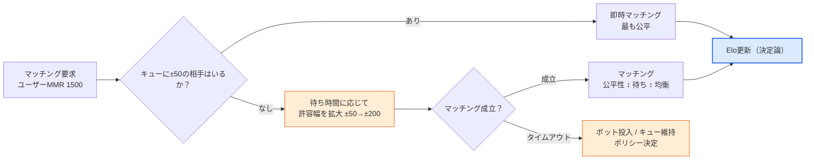
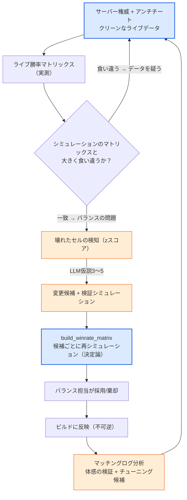

# 8.5 PvP・対戦バランス — 勝率マトリックス・マッチメイキング・サーバー権威

ここまで、この部の4つの章は一つの敵と戦ってきました。ボス1体を何秒で倒すか、タンクが89%生存するか、ゴールドが漏れていないか。すべて**単一ターゲット**に向けたダメージ・生存・収支の話でした。ところがPvPでは、敵は人間です。人間はボスのように決まったパターンでは動かず、同じクラスでも腕前が違い、何より*互いの弱点を狙ってきます*。PvEのバランスが深く作り込まれていてもPvPが丸ごと抜け落ちているケースが珍しくないのは、このためです。単一ターゲットのDPS曲線は8.1〜8.4で最後まで扱いましたが、「チョキがパーに勝つ」という相性の網の目は、まだ一度も描いていません。

本章はその空白を埋めます。扱うのは三つ — クラス・組み合わせ間の相性を収める**勝率マトリックス**、誰を誰と当てるかを決める**マッチメイキング/MMR**、そしてそれらすべての数値を嘘に変えかねない**サーバー権威・アンチチート**です。そして、この部全体を貫いてきた境界線はここでもそのままです。戦闘の計算式は決定論、マッチングと相性の検知はAI補助。一歩たりともぶれません。

---

## 8.5.1 PvPがPvEと異なるただ一つのこと

PvEにおけるキャラクターの強さは**絶対値**です。剣士のDPSが800なら800であり、ボスはその800をそのまま受けます。ところがPvPでは、強さは**相対的**です。剣士の800は弓使いには十分でも、被ダメージを30%減らす盾兵が相手では560まで削られ、足りなくなることがあります。同じキャラクターの強さが、*相手が誰かによって*変わるのです。この一点が、PvPバランスをPvEとは根本的に異なる問題にします。

だからPvPバランスの単位は、1キャラクターの数値ではなく**ペアの関係**です。「剣士 vs 弓使い」の勝率、「剣士 vs 盾兵」の勝率がそれぞれ別に存在し、これらの関係をすべて集めると1枚の表になります。横軸にも縦軸にも同じクラスの一覧が並び、セルごとに「行が列に勝つ確率」が書き込まれます。これが**勝率マトリックス**です。PvEにDPS曲線があるなら、PvPにはこのマトリックスがあります。

<svg viewBox="0 0 660 300" xmlns="http://www.w3.org/2000/svg" font-family="sans-serif" font-size="13">
  <rect x="0" y="0" width="660" height="300" fill="#ffffff"/>
  <text x="330" y="28" text-anchor="middle" font-weight="bold" font-size="14" fill="#0f172a">PvEは絶対値、PvPは関係</text>
  <!-- PvE side -->
  <rect x="30" y="60" width="120" height="60" rx="8" fill="#eaf2fb" stroke="#2c6fbb" stroke-width="1.5"/>
  <text x="90" y="86" text-anchor="middle" fill="#2c6fbb" font-weight="bold">剣士</text>
  <text x="90" y="106" text-anchor="middle" fill="#333" font-size="11">DPS 800</text>
  <line x1="150" y1="90" x2="210" y2="90" stroke="#888" stroke-width="1.5" marker-end="url(#ph)"/>
  <rect x="210" y="60" width="120" height="60" rx="8" fill="#f3f4f6" stroke="#6b7280" stroke-width="1.5"/>
  <text x="270" y="86" text-anchor="middle" fill="#374151" font-weight="bold">ボス</text>
  <text x="270" y="106" text-anchor="middle" fill="#333" font-size="11">800をそのまま受ける</text>
  <text x="180" y="150" text-anchor="middle" fill="#2c6fbb" font-size="11">PvE: 強さ = 絶対値</text>
  <!-- PvP side -->
  <rect x="30" y="190" width="120" height="50" rx="8" fill="#fdecea" stroke="#c0392b" stroke-width="1.5"/>
  <text x="90" y="220" text-anchor="middle" fill="#c0392b" font-weight="bold">剣士 800</text>
  <line x1="150" y1="200" x2="210" y2="200" stroke="#16a34a" stroke-width="1.5" marker-end="url(#ph)"/>
  <rect x="210" y="180" width="120" height="34" rx="6" fill="#dcfce7" stroke="#16a34a" stroke-width="1.2"/>
  <text x="270" y="202" text-anchor="middle" fill="#14532d" font-size="11">弓使い → 800 (有効)</text>
  <line x1="150" y1="215" x2="210" y2="232" stroke="#dc2626" stroke-width="1.5" marker-end="url(#ph)"/>
  <rect x="210" y="222" width="120" height="34" rx="6" fill="#fee2e2" stroke="#dc2626" stroke-width="1.2"/>
  <text x="270" y="244" text-anchor="middle" fill="#7f1d1d" font-size="11">盾兵 → 560 (不足)</text>
  <text x="200" y="284" text-anchor="middle" fill="#c0392b" font-size="11">PvP: 強さ = 相手によって変わる</text>
  <!-- matrix hint -->
  <rect x="400" y="60" width="230" height="196" rx="8" fill="#fbfbfd" stroke="#94a3b8" stroke-width="1.2"/>
  <text x="515" y="84" text-anchor="middle" fill="#0f172a" font-size="12" font-weight="bold">→ 勝率マトリックス</text>
  <text x="515" y="106" text-anchor="middle" fill="#475569" font-size="11">行が列に勝つ確率</text>
  <text x="430" y="140" fill="#475569" font-size="11" font-family="monospace">       弓使  盾兵  魔法</text>
  <text x="430" y="162" fill="#16a34a" font-size="11" font-family="monospace">剣士   .58  .42  .50</text>
  <text x="430" y="184" fill="#475569" font-size="11" font-family="monospace">弓使   --   .55  .47</text>
  <text x="430" y="206" fill="#475569" font-size="11" font-family="monospace">盾兵   --   --   .61</text>
  <text x="515" y="238" text-anchor="middle" fill="#94a3b8" font-size="10">(数字は例示 — 実測ではない)</text>
  <defs>
    <marker id="ph" markerWidth="8" markerHeight="8" refX="6" refY="3" orient="auto">
      <path d="M0,0 L6,3 L0,6 Z" fill="#888"/>
    </marker>
  </defs>
</svg>

右側の表の読み方は単純です。「剣士 vs 盾兵」のセルが0.42なら、剣士が盾兵に勝つ確率は42%、つまり盾兵が有利な相性です。すべてのセルが0.50に近ければ完璧な均衡ですが、そんなゲームは面白くありません。じゃんけんのように**循環する相性**があってこそ、クラス選択に意味が生まれます。問題は、その循環がどこかで途切れ、一つのクラスが全員に勝つセルが生まれるときです。午前2時のタンクがPvEの事故だったとすれば、「盾兵 vs 全クラスで勝率60%超」はPvPの事故です。

ここであらかじめ釘を刺しておきます。これらのセルを埋める数字（0.58、0.42など）はすべて**例示であり、実測ではありません**。ゲームごとにクラス数もスキルも、目標とする均衡ラインも異なります。本章で信頼すべきは数字ではなく、*マトリックスをどう埋め、どう点検し、その点検のどこにAIが付くのか*という構造です。

---

## 8.5.2 マトリックスを埋めるのはシミュレーション、読むのはAI

勝率マトリックスのセル一つを埋める作業は、8.4で見たあの決定論的シミュレーションと正確に同じ道具です。「剣士 vs 弓使い」を1,000戦自動でシミュレーションし、剣士が何戦勝ったかを数えれば、それがそのセルの勝率です。クラスがN個ならセルはN×N個、各セルを1,000戦ずつ回せば表が1枚埋まります。このシミュレーションは最後までコードです — 同じシードを与えれば、同じマトリックスが一字一句違わず再現されなければなりません。そうであって初めて、「今回のビルドで盾兵が強くなった」という言葉が嘘になりません。

ここにPvPならではの罠が一つあります。PvEのシミュレーションでは敵（ボス）は固定パターンですが、PvPのシミュレーションでは**相手も行動を選ばなければなりません**。剣士がどう戦うかを決めるボット（bot policy）が、両側に必要です。そしてこのボットが間抜けだと、マトリックス全体が嘘になります — 操作が壊滅的なボット同士を当てると「スキルをいつでも適当に使うクラス」が勝つマトリックスが出てきますが、実際の熟練ユーザーの手にかかれば正反対になり得ます。だからPvPマトリックスには常に「このボットがどの水準のプレイを模倣しているか」というただし書きが付かなければなりません。ボットは「クールタイム（クールダウン）が戻ったら使う」「HP 30%未満なら後退する」といったヒューリスティックで組むのが普通で、このヒューリスティック自体は決定論です。

ボットポリシーの骨子を実行可能な形に写すとこうなります — 入力が同じなら同じ行動を選ぶ、ハルシネーションが入り込む余地のない関数です。

```python
def bot_decide(me, enemy, cooldowns, t):
    """決定論ボットポリシー。同じ(状態)なら同じ行動。LLMが作るのではない。"""
    # 1) 生存優先: HP 30%未満なら回避/後退
    if me.hp_ratio < 0.30 and cooldowns["escape"] <= 0:
        return Action("escape")
    # 2) 相性スキル: 敵がデバフ免疫でなければマーク優先
    if cooldowns["mark"] <= 0 and not enemy.has("debuff_immune"):
        return Action("mark", target=enemy)
    # 3) 射程管理: 近接の敵が張り付いたら距離を取る (遠距離クラス)
    if me.is_ranged and dist(me, enemy) < me.kite_range:
        return Action("reposition")
    # 4) その他: クールダウンが戻った最大ダメージスキル
    return best_ready_damage_skill(me, cooldowns)


def simulate_pvp_match(class_a, class_b, formula, seed=0):
    """1:1の1戦を決定論的にシミュレーション。ダメージは8.1の式をそのまま使用。"""
    rng = Rng(seed)
    a, b = spawn(class_a), spawn(class_b)
    for t in range(MAX_TICKS):
        for me, foe in ((a, b), (b, a)):
            act = bot_decide(me, foe, me.cooldowns, t)
            apply_action(act, me, foe, formula, rng)   # formula = 決定論ダメージ式
        if a.hp <= 0 or b.hp <= 0:
            break
    return {"winner": "a" if b.hp <= 0 else "b" if a.hp <= 0 else "draw",
            "duration": t * TICK}
```

マトリックス1枚を丸ごと埋めるのは、この関数をセルごとに1,000回回す外側のループです。

```python
def build_winrate_matrix(classes, formula, n=1000):
    matrix = {}
    for ca in classes:
        for cb in classes:
            if ca == cb:
                continue
            wins = sum(
                simulate_pvp_match(ca, cb, formula, seed=s)["winner"] == "a"
                for s in range(n)
            )
            matrix[(ca, cb)] = wins / n          # caがcbに勝った割合
    return matrix
```

ここまでがコアで、最後までコードです。AIはこの表を*作る*側ではなく*読む*側に付きます。Nが8ならセルは56個。人間が56個の勝率を目で追いながら「どこが壊れているか」を探すのは、午前2時の4メガJSONと同じ労働です。おかしいセルを選び出すのは、8.4のzスコア検知がそのまま担います。

```python
def find_broken_cells(matrix, low=0.40, high=0.60):
    """均衡線(0.5)の外へ大きく外れたセルを決定論的に絞り込む。"""
    broken = []
    for (ca, cb), wr in matrix.items():
        if wr > high or wr < low:
            broken.append((ca, cb, round(wr, 2)))
    return sorted(broken, key=lambda x: abs(x[2] - 0.5), reverse=True)
```

検知がセルを絞り込んだら、そのセルをLLMに渡します。ただし、8.4と同じ規律です — **確定診断は禁止、仮説と検証シミュレーションのみ**。たとえば「盾兵 vs 魔法使い 0.68（zが最大）」の1行を与えて、こう要請します。

```
[壊れたセル]
盾兵 → 魔法使い 勝率 0.68 (均衡線 0.50、マトリックス内で z 最大)
付帯: このマッチの平均持続時間 38s (全体平均 22s)

[関連情報]
- 盾兵: 受けるダメージ -30% パッシブ "鉄壁"、沈黙スキル "盾強打"(2秒)
- 魔法使い: 全ダメージの70%が詠唱1.5秒のスキルに集中
- 両クラスのマッチ頻度は実測キューで上位 (人気の組み合わせ)

要請: この相性崩壊の可能性のある原因仮説3~5個 + 各検証シミュレーション1行。
確定診断は禁止。"〜かもしれない" の水準のみ。
```

LLMは「『鉄壁』の-30%と沈黙2秒が重なり、魔法使いが核心の詠唱スキルを一度も入れられないまま死ぬ、正のフィードバックかもしれない／検証：沈黙の持続を1秒に減らして同じセルを再シミュレーション」のように、探索空間を絞り込む仮説を投げるだけです。どれが本物かは、再び`build_winrate_matrix`を候補ごとに回して決めます。マッチ継続時間が平均の1.7倍だという手がかりまでLLMが仮説に織り込んでくれること — 人間が56セルを目で追っていては見落としやすいその結び付きこそ、この場面でAIが稼ぐ時間です。

---

## 8.5.3 マッチメイキング：相性を左右するもう一つのバランス

勝率マトリックスを完璧に合わせても、ユーザーが「負けた」と感じる本当の原因は別にあります。**誰と当たるか**です。実力1500のユーザーが2200のユーザーに当たれば、クラス相性が5:5でも結果は決まっています。だからマッチメイキングは単なるサーバー機能ではなく、**バランスの一部**です。マトリックスがクラス間の公平性を受け持つなら、マッチメイキングは実力間の公平性を受け持ちます。

ほとんどの対戦ゲームはMMR（Matchmaking Rating、マッチメイキングレート）を持っています。勝てば上がり、負ければ下がる隠しレートで、近いレート同士を当てます。レートの更新は決定論的な計算式です — Elo（イロレーティング）が最も広く使われており、公開された標準であるため、本書で引用してよい数少ない数式の一つです。

```
# Elo: 公開標準の更新式 (でっち上げた値ではない)
expected_a = 1 / (1 + 10 ** ((rating_b - rating_a) / 400))
new_rating_a = rating_a + K * (score_a - expected_a)
#   score_a: 勝てば1、負ければ0
#   K: 更新強度の定数 (ゲームが決める値。通常16~40の範囲で選択)
#   400, 10: Eloの定義に埋め込まれた定数
```

この式自体は決定論であり、AIが入る場所ではありません。ところがマッチメイキングには、決定論的な計算式だけでは解けない*緊張*が一つあります。**公平性 ↔ 待ち時間**のトレードオフです。レートが正確に同じ相手だけを当てればマッチは公平ですが、そんな相手がキューにいなければユーザーは10分待つことになります。レート差を寛大に許容すれば早くマッチしますが、マッチは不公平になります。深夜帯、不人気クラス、高レート帯ほど、この緊張は激しくなります。



青いノード（Elo更新）だけが決定論です。オレンジのノード — 許容幅をいつ、どれだけ広げるか、タイムアウト時に何をするか — が、AI補助の届く場所です。ただし、ここでもAIが*リアルタイムのマッチング決定*を下すわけではありません。それは高速かつ再現可能であるべきサーバーロジックなので、ルールベースのコードの場所です。AIが付くのは、そのルールを**チューニングするための分析**です。「先週のマッチングログで、どのレート帯・時間帯・クラスのマッチ品質（勝率の偏り・待ち時間）が悪かったか」を要約し、「許容幅の曲線をどう変えれば、どの帯域の待ち時間が減るか」の候補を提案する仕事です。8.4の位置3（レポート）・位置4（異常の解釈）・位置2（変更候補の探索）が、マッチングログへと舞台だけを移したものです。

マッチメイキングが勝率マトリックスと絡む地点も押さえておきます。マッチングアルゴリズムがクラスを考慮せずレートだけを合わせると、壊れた相性のセルがそのまま露出します。盾兵が魔法使いに68%勝つセルが生きたまま、マッチングが両者を頻繁に当てれば、魔法使いユーザーの体感の敗北はマトリックスの数値以上に積み上がります。だからマトリックスの点検とマッチングログの分析は別々に回るものではなく、*同じサイクルの入口と出口*です — マトリックスで壊れたセルを直し、マッチングログでそのセルが実際にどれだけ当たったかを確認します。

---

## 8.5.4 サーバー権威：バランスの前提

ここまでのすべての話 — マトリックス、MMR、シミュレーション — は、一つのことを暗黙の前提にしていました。**ユーザーが報告してくる結果は真実だ、ということです。** PvEではこれはほとんど問題になりません。一人でボスを倒すのに、誰を騙すというのでしょうか。ところがPvPには相手がいて、勝てばレートが上がり、だからこそ**騙す動機が生まれます**。ダメージを改ざんし、位置を改ざんし、クールタイムを無視するクライアントが現れた瞬間、8.1の決定論的な計算式は紙の上だけの決定論になります。実際のサーバーでは、誰かの剣士が計算式より2倍強いダメージを叩き込んでいるのです。

だから対戦ゲームの第一のバランス規則は、マトリックスより先に来ます。**結果をクライアントに決めさせないこと。** ダメージ計算、クールタイム判定、命中判定 — バランスに触れるすべての演算は、サーバーが権威を持ちます。クライアントは入力（どこへ移動するか、どのスキルを使うか）だけを送り、その入力が計算式に合っているか、クールタイムが戻っているか、射程内かは、すべてサーバーが検証し直します。クライアントが送ってきた「ダメージ999」はサーバーが無視し、サーバーが計算式で算出した値だけを適用します。

<svg viewBox="0 0 680 270" xmlns="http://www.w3.org/2000/svg" font-family="sans-serif" font-size="12">
  <rect x="0" y="0" width="680" height="270" fill="#ffffff"/>
  <text x="340" y="26" text-anchor="middle" font-weight="bold" font-size="14" fill="#0f172a">サーバー権威 = バランス式の唯一の執行者</text>
  <!-- client -->
  <rect x="40" y="80" width="160" height="110" rx="8" fill="#fdecea" stroke="#c0392b" stroke-width="1.5"/>
  <text x="120" y="106" text-anchor="middle" fill="#c0392b" font-weight="bold">クライアント</text>
  <text x="120" y="128" text-anchor="middle" fill="#333">入力のみ送信</text>
  <text x="120" y="148" text-anchor="middle" fill="#666" font-size="11">"スキル1使用、座標(x,y)"</text>
  <text x="120" y="170" text-anchor="middle" fill="#991b1b" font-size="11">結果を決められない</text>
  <!-- arrow -->
  <line x1="200" y1="120" x2="290" y2="120" stroke="#888" stroke-width="1.5" marker-end="url(#sh)"/>
  <text x="245" y="112" text-anchor="middle" fill="#666" font-size="10">入力</text>
  <line x1="290" y1="155" x2="200" y2="155" stroke="#16a34a" stroke-width="1.5" marker-end="url(#sh)"/>
  <text x="245" y="172" text-anchor="middle" fill="#16a34a" font-size="10">検証済みの結果</text>
  <!-- server -->
  <rect x="290" y="70" width="200" height="130" rx="8" fill="#dbeafe" stroke="#2563eb" stroke-width="2"/>
  <text x="390" y="96" text-anchor="middle" fill="#1e3a8a" font-weight="bold">サーバー (権威)</text>
  <text x="390" y="118" text-anchor="middle" fill="#1e3a8a" font-size="11">クールダウン/射程検証</text>
  <text x="390" y="138" text-anchor="middle" fill="#1e3a8a" font-size="11">ダメージ = 式(8.1)</text>
  <text x="390" y="158" text-anchor="middle" fill="#1e3a8a" font-size="11">決定論 · 執行</text>
  <text x="390" y="184" text-anchor="middle" fill="#1e40af" font-size="11">"ダメージ999" 無視</text>
  <!-- anticheat / logs -->
  <rect x="540" y="80" width="110" height="110" rx="8" fill="#ffedd5" stroke="#ea580c" stroke-width="1.5"/>
  <text x="595" y="106" text-anchor="middle" fill="#9a3412" font-weight="bold" font-size="12">異常ログ</text>
  <text x="595" y="128" text-anchor="middle" fill="#9a3412" font-size="11">不可能な入力</text>
  <text x="595" y="146" text-anchor="middle" fill="#9a3412" font-size="11">パターン検知</text>
  <text x="595" y="170" text-anchor="middle" fill="#9a3412" font-size="11">AI補助可能</text>
  <line x1="490" y1="135" x2="540" y2="135" stroke="#888" stroke-width="1.5" marker-end="url(#sh)"/>
  <defs>
    <marker id="sh" markerWidth="8" markerHeight="8" refX="6" refY="3" orient="auto">
      <path d="M0,0 L6,3 L0,6 Z" fill="#888"/>
    </marker>
  </defs>
</svg>

サーバー権威が崩れれば、バランス作業の全体が嘘になります。勝率マトリックスをどれほど精緻に合わせても、ライブで一つのクラスがダメージを改ざんしていれば、そのマトリックスは紙の上の約束にすぎません。だからアンチチートは別個のセキュリティ業務ではなく、**バランスデータの信頼性の問題**です。ライブの勝率がシミュレーションのマトリックスと大きく食い違うとき、最初に疑うべきは「計算式が間違っているのか」ではなく「このデータはクリーンか」でなければなりません。

ここでAIの場所が再び明確になります。チート判定そのもの — 「この入力を無効にする」 — は決定論的ルールの仕事です。0.1秒で30メートル移動した入力は物理的に不可能なので、ルールで弾きます。同じ入力には同じ判定が出なければならず、不当なアカウント停止（誤BAN）を生んではならないので、ここに確率的なLLMを置くことはできません。一方で、**異常パターンを*候補*として絞り込む仕事**にはAI補助が届きます。サーバーログから「このアカウントの命中率分布は人間の分布からzいくつ分外れている」「このアカウント群は同一の異常パターンを共有している」といった候補を集め、人によるレビューに上げます。8.1の表をPvPに移すと、境界はこうなります。

| 領域 | AI | 理由 |
|---|---|---|
| サーバーのダメージ・命中・クールタイム判定 | 絶対禁止 | 決定論コア。同じ入力=同じ判定が崩れれば公平性が崩壊 |
| Elo/MMRレート更新 | 絶対禁止 | 公開標準の決定論式。揺らげば順位が嘘になる |
| チート遮断（BAN）の判定そのもの | 絶対禁止 | 誤BANは許されない。同じ証拠=同じ判定 |
| 勝率マトリックスのシミュレーション | 絶対禁止 | 再現不能なら「このクラスが強くなった」が嘘になる |
| 壊れた相性セルの検知・解釈 | 可能 | zスコアでセルを絞り、LLMが仮説（確定診断は禁止） |
| マッチングログの品質分析・チューニング候補 | 可能 | 待ち/公平のトレードオフの変更候補を提案（シミュレーションで検証） |
| チート疑いパターンの候補抽出 | 可能 | 人によるレビューに上げる候補のみ。BANの決定は人間・ルール |

線引きは8.1と一字一句違いません。**AIは決定論コアの外側にだけ棲みます。** 執行する内側 — ダメージ、レート、BAN — はルールブックであり、検知し、解釈し、候補を押し出す外側がAIの場所です。

---

## 8.5.5 一つのサイクルに束ねる

三つのテーマ — マトリックス、マッチング、サーバー権威 — は、別々に回る三つの仕事ではありません。一つの対戦バランスサイクルの三つの区間です。サーバー権威がクリーンなデータを保証し、そのデータでマトリックスを点検し、マッチングログで点検結果が実際のキューでどう体感されるかを確認し、再びシミュレーションで候補を検証してビルドに反映します。



青いノード（サーバー権威、シミュレーション再計算）が決定論、オレンジのノード（検知・仮説・マッチング分析）がAI補助です。このサイクルで最もよくある失敗は、C分岐を飛ばすことです。ライブのマトリックスがシミュレーションと食い違ったとき、すぐに計算式から手を付けると、実はチートで汚染されたデータを追いかけて、何の問題もないクラスを下方修正することになります。データのクリーンさを先に疑うこの一つの分岐が、8.1の「変更履歴」と同じ役割をPvPで果たします — 抜かせば、あの午前2時が戻ってきます。

最後に、PvPバランスにまつわる18年分の罠をいくつか、処方箋とともに残しておきます。

- **ボットポリシーが間抜けなのにマトリックスを信じる** → ボットの水準を常に明記し、可能ならライブの実測勝率で補正します。ボットのマトリックスは*方向*だけ、絶対値は実測で。
- **マッチングをレートだけで合わせ、クラス相性を無視する** → 壊れたセルが生きていれば、マッチングがそのセルを露出させます。マトリックスの点検とマッチング分析は同じサイクルに束ねます。
- **ライブ勝率の食い違いをすぐ計算式のせいにする** → まずデータのクリーンさ（チート・バグ）を疑います。汚染されたデータで下方修正すれば、何の問題もないクラスが壊れます。
- **チート検知をLLMに委ねる** → BAN判定は決定論的ルール。LLMは*候補抽出*まで。誤BANは取り返しがつきません。
- **勝率0.50を目標にすべてのセルを平坦化する** → 完全な均衡はクラス選択の意味を殺します。目標は*循環する相性*であって、すべてのセルを0.50にすることではありません。

PvPにおけるAIの場所はPvEと同じです。決定論コア — ダメージ、レート、BAN、シミュレーション — の外側にある検知・解釈・候補です。コアはコードとサーバー権威で守り、人間が56セルを目で追い、マッチングログをさまよっていた手作業だけを取り除きます — この部全体が一つの骨格で動いているという最後の証拠が、本章です。

---

## やってみよう — 勝率マトリックスを1枚点検する

**setup.** 8.4の`simulate_dps`を1:1に拡張した`simulate_pvp_match`と、両側のボットを動かす`bot_decide`（ヒューリスティックな決定論）を作ってください。シードを固定し、同じマトリックスが再現されるかどうかからまず確認します。ダメージは必ず8.1の計算式をそのまま持ってきて使い、ボットが模倣するプレイ水準を1行で記録してください。

**prompt.** `find_broken_cells`で均衡ライン（0.40〜0.60）の外のセルを絞り込んだあと、zが最大の1セルだけをLLMに渡します。

```
添付した壊れたセル(盾兵 vs 魔法使い 0.68、マッチ持続時間 38s/平均 22s)について
可能性のある原因仮説3~5個と、各検証用の再シミュレーション1行を提示してほしい。
関連スキル・パッシブ情報は下に添付。確定診断は禁止 — "〜かもしれない"のみ。
数値を直接修正せず、候補だけを提案すること。
```

**verify.** AIの仮説をそのまま信じないでください。各仮説の変更候補を`build_winrate_matrix`に入れて同じシードで再シミュレーションし、そのセルが0.50付近に戻りながら*ほかのセルを壊していないか*を併せて確認します（PvPの変更は、1セルを直そうとして隣のセルを台無しにしがちです）。二つの条件を満たす候補だけを採用し、8.1と同じように決定ログに理由・棄却した候補・予測値を残してください。ビルド反映の1週間後、ライブの実測勝率をそのログに書き添えます。

### 一人ミニ版

クラスが二つだけでサーバーもない一人プロトタイプでも、骨格は同じです。マトリックスは2×2で十分で、シミュレーションは8.1の30行ループにボットポリシー1行（クールタイムが戻ったら最大ダメージのスキル）を足すだけで済みます。サーバー権威は「結果をクライアントに決めさせない」という原則だけをコード構造で守ればよく、本格的なアンチチートはユーザーが付く前には必要ありません。MMRも最初は省略し、マトリックスが一方に60%超傾いていないかだけを、1,000戦回して確認してください。AIはその結果を読み、「どのマッチが壊れていて、その原因として何があり得るか」を要約することにだけ使います。規模にかかわらず守るべき線はただ一つ — ダメージと勝敗はコードとサーバーが決め、LLMには絶対に任せないことです。

---

### 本章のポイント

- PvPにおける強さは絶対値ではなく関係です。単位は1キャラクターの数値ではなく勝率マトリックスの1セルであり、目標はすべてのセルを0.50にすることではなく、循環する相性です。
- マトリックスを埋めるのは決定論的シミュレーション、壊れたセルを絞り込んで仮説を立てるのはzスコアとAIです。マッチメイキングの公平性↔待ち時間のトレードオフも、チートパターンも同じ境界線で — 執行はコード・サーバー、検知・候補はAIです。
- サーバー権威はバランスの前提です。ライブの勝率がシミュレーションと食い違ったら、計算式よりも先にデータのクリーンさを疑います。

### 次章のプレビュー
- 9.1 UX/UIデザイン — 意思決定の精度が別の分野に移るとき
