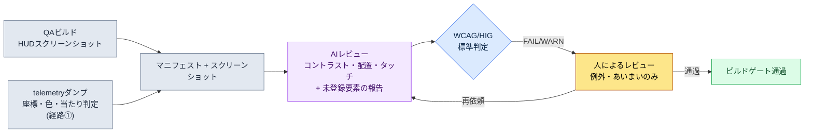

# 9.1 HUDスクリーンショットをlintにかける — 視線の逸脱・コントラスト不足をAIが捕まえる場所

> 主な読者：HUD・UIを担当するUXプランナー（中規模（10〜50人）チーム）
> 1人/趣味の読者向け縮小バージョン：§9.1.8「一人ならこれだけ」

QAビルドで新しいデバフ通知をHUDに載せた日、デザイナーは「よく見える」と言いました。翌日、ユーザー掲示板には「デバフが見えなくて死んだ」という書き込みが上がりました。通知は画面中央に、グレーの背景に淡い黄色の文字で表示されていました。デザイナーのモニターでは見えていて、戦闘中に爆発エフェクトが画面を覆う6インチのスマートフォンでは見えませんでした。問題は、これが初めてではないという点でした。ビルドごとに、画面ごとに、同じ種類の事故が「今回は大丈夫だろう」で繰り返されていました。

本章では、その繰り返しを断ち切る一つの作業に集中します。**完成したHUDスクリーンショット1枚を入力として受け取り、P0要素が視線の届く領域（上部ステータスバンド・左右下のアクションコーナー）を外れていないか、文字のコントラストが可読のしきい値を超えているかを自動で検出するlintゲート**です。優先度表・視線の流れ・プラットフォーム分岐といったHUD設計の一般原則はすでに他の書籍に十分書かれているので、本章はその原則を*ビルドごとに自動で強制するレビューループ*にだけ紙面を使います。核心は、AIが画面を見て「この文字はコントラスト2.0:1なのでWCAGの4.5:1に未達」と、座標と数字で言うようにさせることです。「よく見えますけど」という水掛け論を、コードと標準に置き換えます。

---

## 9.1.1 レビュー基準は「感覚」ではなく公開標準

HUDのレビューが毎回人によって違う結論になるのは、基準が「見える/見えない」という主観だからです。幸い、可読性・アクセシビリティの多くは、すでに標準化団体が数字で確定してくれています。でっち上げる必要はありません。

| レビュー項目 | 標準基準（出典） | 自動判定 |
|---|---|---|
| 通常テキストのコントラスト比 | 4.5:1以上（WCAG 2.1 SC 1.4.3） | 可能 — 前景・背景の色値から計算 |
| 大きいテキスト（18pt+）のコントラスト | 3:1以上（WCAG 2.1 SC 1.4.3） | 可能 |
| 非テキスト（アイコン・ゲージ）のコントラスト | 3:1以上（WCAG 2.1 SC 1.4.11） | 可能 |
| タッチターゲットの最小サイズ | 44×44 pt（Apple HIG）/ 48×48 dp（Material） | 可能 — 要素サイズで |
| 親指の到達領域 | **横持ち両手操作**時に左下・右下コーナーが「容易」（左親指=移動、右親指=スキル）。業界で通用するthumb-zoneモデル | 部分 — 領域ルールで |

最後の行（親指の到達領域）だけは定量的な合格ラインではなく業界で通用するモデルで、上の4行はW3C・Apple・Googleが公開した合格ラインです。コントラスト比はとくに明確です。WCAGは2色の相対輝度を`(L1+0.05)/(L2+0.05)`で計算するよう、公式まで公開しています。グレー（#888）の背景に淡い黄色（#D4C84A）の文字のコントラストは、この公式に入れると約2.0:1になります — 4.5:1未達、つまり標準上は明白な不合格です。「デザイナーのモニターでは見えた」という反論が通らない場所です。

ここで一つはっきりさせておきます。MMORPG・RPGのモバイル画面は**横持ち（landscape）が標準**です。理由は情報量と操作です。同じインチ数でも横に持てば、1画面に収まる常時情報が縦より多く、両手の親指で左（移動）・右（スキル）を同時に操作できます。縦持ち片手グリップはカジュアルパズル・放置系には合いますが、同時情報が多く両手操作が必要なMMORPGには合いません。そのため本章のすべての視線・配置判定は、横持ち両手グリップを前提とします。画面は、上部の横長ステータスバンド、左右二つの下部アクションコーナー、その間の中央ゲーム領域、そしてゲーム領域の下の中央下部スロットバンド（消費・自動アイテム・クイックスロット）に分かれます。

この5行が、本章でAIに渡す**レビュー用ルールブック**です。「デバフがちょっと見えにくい気がする」ではなく「デバフのテキストはコントラスト2.0:1でSC 1.4.3違反」と言えるようになってはじめて、人がレビューしてもAIがレビューしても同じ判定になります。

プラットフォーム基準をPCと並べて置くと、レビューの出発点がはっきりします。プロジェクトAはモバイル優先+PC補助なので、両方の基準をルールブックに入れます。

| 基準 | PC（補助プラットフォーム） | モバイル（優先プラットフォーム、横持ち） |
|---|---|---|
| 画面・入力 | 27インチ+ / マウスの1px精度・ホバー・ショートカット | 6.xインチ横持ち / 両手親指、ホバーなし |
| 同時常時情報 | 30〜50種に対応可能 | 12〜16種が限界（著者の推定、未検証） |
| 視線・操作の到達 | 画面全域（カーソルがどこへでも届く） | 上部ステータスバンド+左下・右下コーナー+中央下部スロットバンドのみ「容易」 |
| 精度 | 1pxクリック | 最小44ptタッチターゲット（HIG） |
| 主なレビューリスク | 情報過密による認知負荷 | 狭い画面+指による遮蔽+中央埋もれ |

PCはマウスの精度・ホバーのツールチップ・大きな画面のおかげで、情報を多く表示しても視線と操作が届きます。モバイルは横持ちなので縦よりはましですが、PCほどは載せられず、押す要素が両側の親指コーナーに縛られ、ホバーがないためP0情報は常時表示でなければなりません。そのためモバイルHUDレビューの本質は「きれいか」ではなく、**「P0が視線の届く場所（上部・両コーナー）にあり、文字が標準のコントラストを超えているか」**です。その判定が人によってぶれないように標準で固定するのが、本章の仕事です。

---

## 9.1.2 ［ワークド・トランスクリプト］HUDスクリーンショット1枚をlintにかける

実際にどう回すのか、1サイクルを最後までお見せします。以下は著者のプロジェクト（モバイル優先MMORPG、以下「プロジェクトA」）の戦闘HUDレビューセッションを忠実に再現したものです。入力プロンプトはそのままコピーして使えますし、出力は実際のセッションを再構成したものです。

### ステップ1 — 入力：スクリーンショット+要素マニフェストを一緒に投げる

スクリーンショットだけを投げると、AIは画面を「推測」します。そこで、ビルドがすでに知っている要素の座標・色・分類をマニフェストとして一緒に入れます。これは新しく書くものではなく、ビルド成果物から抽出するだけで済みます（抽出方法の現実は§9.1.4で正直に比較します）。

```yaml
# hud_capture_manifest.yaml — QAビルドのスクリーンショットに同梱
screen: { w_pt: 844, h_pt: 390 }   # 6.xインチ横持ち、pt単位（横持ちグリップ）
elements:
  - id: hp_bar        # HPバー
    class: P0
    rect_pt: [12, 18, 150, 16]      # x, y, w, h — 上部左側
    fg: "#FF5A5A"  ; bg: "#1A1A1A"
  - id: skill_slot_1  # スキルスロット（右親指）
    class: P0
    rect_pt: [760, 300, 40, 40]     # ← 右下コーナー、サイズに注目
    fg: "#FFFFFF"  ; bg: "#202830"
  - id: debuff_alert  # デバフ通知（昨日追加）
    class: P0
    rect_pt: [400, 180, 70, 24]     # ← 画面中央、位置に注目
    fg: "#D4C84A"  ; bg: "#888888"   # ← コントラストに注目
  - id: minimap
    class: P1
    rect_pt: [744, 20, 80, 80]       # 右上
    fg: "#A0C0FF"  ; bg: "#101820"
```

### ステップ2 — プロンプト：レビューをさせつつ、標準と形式を強制する

```
添付のスクリーンショットはプロジェクトAの戦闘HUDで（横持ち両手グリップ）、yamlはその画面の要素別の座標・色・分類。両者を突き合わせてレビューして。
コントラストはfg/bgからWCAGで計算して数値まで書いて — テキスト4.5:1、アイコン・大きい文字3:1未達ならFAIL。
P0が上部ステータスバンドや左・右下コーナーを外れて画面中央に浮いていたらWARN（中央は戦闘エフェクトに埋もれる）。
操作要素が44pt未満か、親指コーナー・中央下部スロットバンドを外れていたらFAIL。
マニフェストにないのに画面に見えるものがあれば別途報告して、確信が持てないものは「あいまい」に分けてこちらに渡して。
表だけで出して（要素|検査|測定値|判定|備考）、説明は抜きで。
// （意図: P0=0.5秒以内に見つけるべき情報 / 消費・自動・クイックスロットは中央下部が正常）
```

レビュールールよりも、そのルールをどう出力するかに多くの行が割かれている点が重要です。AIに自由を与えると、「全体的にすっきりしていますね」のような褒め言葉を吐き出します。そこで**計算式（WCAGコントラスト）、合格ライン（4.5:1・44pt）、出力形式（表）、測定値の表記義務、そして「確信が持てなければ人に渡せ」という逃げ道**を、あらかじめ釘として打ち込んでおきます。この5本の釘が、褒め言葉を測定値に変えます。

### ステップ3 — Claudeの出力（再構成、生のまま）

```
| 要素         | 検査        | 測定値                    | 判定 | 備考                                |
|-------------|------------|--------------------------|------|-------------------------------------|
| hp_bar      | コントラスト | #FF5A5A/#1A1A1A = 5.7:1   | PASS | 非テキストゲージ、3:1充足            |
| hp_bar      | 配置        | 上部左側 (12,18)          | PASS | P0 上部ステータスバンド              |
| skill_slot_1| タッチ      | 40×40 pt、右下コーナー    | FAIL | HIG 44pt未達、4pt不足（コーナーはOK）|
| skill_slot_1| 配置        | 右下 (760,300)            | PASS | 右親指の到達コーナー                 |
| debuff_alert| コントラスト | #D4C84A/#888888 = 2.0:1   | FAIL | 通常テキスト4.5:1未達 (SC 1.4.3)    |
| debuff_alert| 配置        | 画面中央部 (400,180)      | WARN | P0なのに中央 — 戦闘エフェクトに埋没  |
| minimap     | コントラスト | #A0C0FF/#101820 = 9.8:1   | PASS |                                     |
| minimap     | 配置        | 右上 (744,20)             | PASS | P1、上部ステータスバンド右側は許容   |

追加報告:
- マニフェストは4種だが、スクリーンショットの左下に黄色の点滅アイコンが
  もう1つ見える（座標推定 ~70,330）。マニフェスト漏れの疑い。（あいまい —
  画面だけでは何の要素か断定できない）

要約: FAIL 2件（skill_slot_1 タッチ、debuff_alert コントラスト）、WARN 1件（debuff_alert
配置）、あいまい 1件（未登録アイコン）。
```

出力でもっとも価値のある部分は、合格/不合格の表ではなく、**いちばん下の「追加報告（추가 신고）」と「あいまい（애매）」**です。AIがマニフェストにない点滅アイコンを画面から見つけ出し、それが何かは自分では断定できないと人に渡した場所です。良いプロンプトは、AIが「これは私には分かりません」と言えるようにします。

### ステップ4 — 検証と拒否（人の出番）

この出力をそのまま受け取ってはいけません。AIのレビューそのものを、人が一度レビューします。実際にこのセッションでは、1件が人の手でひっくり返されました。

`debuff_alert`のコントラストFAILと配置WARNは正しいです。グレーの背景に淡い黄色は§9.1.1で見たとおり標準違反ですし、P0通知を横画面の中央に置いたのも、戦闘エフェクトに埋もれる典型的なミスです。ここまではAIが正しかったのです。

問題は`skill_slot_1`のタッチFAILです。AIはマニフェストの`40×40 pt`をそのまま信じて「44pt未達」と判定しましたが、実際のビルドではこのスロットは見た目こそ40ptであるものの、**タッチの当たり判定が四方に6pt拡張**されていて、実際のタップ領域は52ptです。マニフェストの`rect_pt`は*描画される矩形*だけを含み、*当たり判定*を含んでいませんでした — つまり入力データの欠陥であって、AIの誤判定ではありません。AIは与えられたデータの中で正確に判定しましたし（コーナー位置の判定は正しかったです）、人はコードが知らないビルドの事情（当たり判定の拡張）を知っていました。このFAILは人が棄却します。

そこで二つのことを同時に行います。マニフェスト抽出スクリプトが当たり判定も取り出すように直し（データ欠陥の修正）、AIに再依頼します。

```
skill_slot_1は見た目のサイズは40ptだが、ヒットボックスが四方に6pt拡張されていて実際のタップ領域は52pt（マニフェストにhit_rectを追加した）。この基準でタッチをもう一度見て。
debuff_alert FAIL/WARNはそのままにして、コントラスト4.5:1を超える配色を3つ提案して（黄色系は維持、背景を暗く）。中央から上部ステータスバンド右側へ移す座標も1つ出して。
```

AIは`skill_slot_1`を当たり判定52pt基準でPASSに訂正し、デバフのコントラストのために背景を#2A2A00に暗くして7.8:1を作る配色3案と、通知を上部ステータスバンド右側（約600,18）へ移す座標を返してくれました。1往復で終わります。**ビルドごとに画面を目でなぞると同じ事故が繰り返されますが、スクリーンショット+マニフェストをlintにかければコントラスト・配置・タッチの違反が数字として出てきて、人はコードが知らない例外（当たり判定）とあいまいなもの（未登録アイコン）だけを判定します**（レビュー1画面が手作業では十数分、このループでは数分 — 著者の推定、未検証の仮説です。絶対時間よりも「目でなぞる」と「標準で測定する」の構造の違いとして読むのが正しいです）。

---

## 9.1.3 横持ちHUDの視線・配置 — なぜ中央は危険なのか

先のセッションで`debuff_alert`がWARNを受けた理由、そしてP0情報をどこに置くべきかを1枚の図として残しておくと、以後のすべての配置判定が速くなります。横に持ったスマートフォンでは、画面は四つの場所に分かれます。**上部の横長ステータスバンド**（視線が最初に届き、指は行かない読み取り専用）、**左下・右下の二つのコーナー**（両手の親指が届く操作の場所 — 左親指=移動、右親指=スキル）、その間の**中央ゲーム領域**（戦闘が起きる場所）、そしてゲーム領域の下の**中央下部スロットバンド**（消費・自動アイテムとクイックスロット・スキルスロットを置く場所）です。下の図では、緑・アンバーがP0とスロットの安全な領域、赤がP0通知が埋もれるゲーム中央です。

<svg viewBox="0 0 660 340" xmlns="http://www.w3.org/2000/svg" role="img" aria-label="モバイル横持ちHUDの視線領域とP0/P1配置図">
  <!-- スマートフォン外枠（横持ち） -->
  <rect x="20" y="30" width="620" height="280" rx="30" ry="30" fill="#0f1117" stroke="#3a3f4b" stroke-width="3"/>
  <rect x="34" y="44" width="592" height="252" rx="14" ry="14" fill="#11151d"/>
  <!-- 上部ステータスband（緑 — 視線の第1順位、読み取り専用） -->
  <rect x="34" y="44" width="592" height="56" fill="#14532d" opacity="0.55"/>
  <path d="M44 52 H616" fill="none" stroke="#22c55e" stroke-width="2.5" stroke-dasharray="6 4"/>
  <text x="330" y="92" fill="#bbf7d0" font-family="sans-serif" font-size="12" text-anchor="middle" font-weight="bold">上部横長ステータスバンド — 視線の第1順位（HP・MP・ターゲット、読み取り専用）</text>
  <!-- 中央危険帯（赤）：ゲーム領域、P0を置くとエフェクトに埋もれる -->
  <rect x="180" y="100" width="300" height="138" fill="#7f1d1d" opacity="0.4"/>
  <text x="330" y="158" fill="#fecaca" font-family="sans-serif" font-size="13" text-anchor="middle">中央 — ゲーム領域（エフェクト暴走）</text>
  <text x="330" y="178" fill="#fecaca" font-family="sans-serif" font-size="11" text-anchor="middle">P0通知を置くと埋もれる — debuff_alertが引っかかった場所</text>
  <!-- 中央下部スロットバンド（アンバー — 消費・クイックスロット・自動、ゲーム領域の下） -->
  <text x="330" y="240" fill="#b45309" font-family="sans-serif" font-size="11" text-anchor="middle" font-weight="bold">中央下部 — 消費・クイックスロット・自動</text>
  <rect x="248" y="248" width="164" height="42" rx="8" fill="#f59e0b" opacity="0.5" stroke="#f59e0b" stroke-width="2" stroke-dasharray="5 4"/>
  <circle cx="298" cy="270" r="11" fill="#fbbf24"/><text x="298" y="274" fill="#000" font-size="8" text-anchor="middle">ポーション</text>
  <circle cx="330" cy="270" r="11" fill="#fbbf24"/><text x="330" y="274" fill="#000" font-size="8" text-anchor="middle">自動</text>
  <circle cx="362" cy="270" r="11" fill="#fbbf24"/><text x="362" y="274" fill="#000" font-size="8" text-anchor="middle">スロット</text>
  <!-- 左下親指コーナー（緑） -->
  <path d="M34 296 L34 146 A150 150 0 0 1 184 296 Z" fill="#14532d" opacity="0.7"/>
  <path d="M34 146 A150 150 0 0 1 184 296" fill="none" stroke="#22c55e" stroke-width="2.5" stroke-dasharray="5 4"/>
  <text x="92" y="254" fill="#bbf7d0" font-family="sans-serif" font-size="13" text-anchor="middle" font-weight="bold">左親指</text>
  <text x="92" y="274" fill="#bbf7d0" font-family="sans-serif" font-size="12" text-anchor="middle">移動</text>
  <!-- 右下親指コーナー（緑） -->
  <path d="M626 296 L626 146 A150 150 0 0 0 476 296 Z" fill="#14532d" opacity="0.7"/>
  <path d="M626 146 A150 150 0 0 0 476 296" fill="none" stroke="#22c55e" stroke-width="2.5" stroke-dasharray="5 4"/>
  <text x="568" y="254" fill="#bbf7d0" font-family="sans-serif" font-size="13" text-anchor="middle" font-weight="bold">右親指</text>
  <text x="568" y="274" fill="#bbf7d0" font-family="sans-serif" font-size="12" text-anchor="middle">スキル</text>
  <!-- 実際の要素の点 -->
  <rect x="60" y="60" width="60" height="10" rx="3" fill="#ef4444"/><text x="90" y="68" fill="#fff" font-size="8" text-anchor="middle">HP</text>
  <rect x="60" y="78" width="60" height="10" rx="3" fill="#3b82f6"/><text x="90" y="86" fill="#fff" font-size="8" text-anchor="middle">MP</text>
  <rect x="300" y="56" width="44" height="20" rx="4" fill="#0ea5e9" opacity="0.8"/><text x="322" y="70" fill="#fff" font-size="8" text-anchor="middle">ターゲット</text>
  <rect x="560" y="54" width="48" height="40" rx="6" fill="#0ea5e9" opacity="0.7"/><text x="584" y="78" fill="#fff" font-size="8" text-anchor="middle">マップ P1</text>
  <circle cx="330" cy="204" r="13" fill="#facc15" opacity="0.5"/><text x="330" y="208" fill="#000" font-size="6" text-anchor="middle">デバフ?</text>
  <circle cx="92" cy="220" r="17" fill="#22c55e"/><text x="92" y="224" fill="#000" font-size="9" text-anchor="middle">移動</text>
  <circle cx="556" cy="222" r="14" fill="#22c55e"/><text x="556" y="226" fill="#000" font-size="9" text-anchor="middle">スキル</text>
  <circle cx="592" cy="210" r="13" fill="#22c55e"/><text x="592" y="214" fill="#000" font-size="9" text-anchor="middle">スキル</text>
  <circle cx="600" cy="272" r="12" fill="#22c55e"/><text x="600" y="276" fill="#000" font-size="8" text-anchor="middle">スキル</text>
</svg>

ルールは単純です。**P0情報（HP・MP・重要通知）は緑（上部の横長ステータスバンドまたは左右下のコーナー）の中に置きます。**視線が最初に届くか、親指がつねにとどまる通り道だからです。逆に**ゲーム中央（赤）は戦闘そのものが起きる場所**なので、ここにP0通知を置くと、エフェクトが画面を覆った瞬間に情報が埋もれます。一つ注意 — ゲーム中央と**中央下部**は別物です。ゲーム中央は危険ですが、その下の**中央下部スロットバンド（アンバー）は消費・自動アイテムとクイックスロット・スキルスロットが住む場所**です。自分が使うもの、自動で消費されるものを一目で見るために、両親指の間に置きます。そして**読むだけの情報（HP/MP/ターゲットの体力）は上部に**、**押す要素（移動・スキル）は左右下のコーナーに**、**消費・スロットは中央下部に** — この三つが指・視線の領域です。§9.1.2でデバフ通知がWARNを受けた理由が、この図1枚で説明できます — 0.5秒以内に見なければならないP0を、よりによっていちばん見えないゲーム中央に置いたからです。訂正案で上部ステータスバンド右側へ移したのは、まさにこの図の緑へ戻したということです。

---

## 9.1.4 座標をどう取り出すか — 実装の正直さ

本章のlintは、「要素別の座標・色」がきれいに入ってくるという前提の上に成り立ちます。ところが、その座標を*どこからどう取り出すか*が、実際にはもっとも現実的な分かれ道です。書籍がよくごまかす場所なので、三つの経路を正直に比較します。正解は一つではなく、チームの状況によって分かれます。

| 経路 | 何をするか | 強み | 弱み / 現実 |
|---|---|---|---|
| ① ゲーム内telemetryログ | UIフレームワークが描画するウィジェットの座標・サイズ・色をビルドが直接ダンプ | 座標が**正確**（推定ではない）、当たり判定・アンカーまで出る | UIコードにダンプ用フックを仕込む必要あり。プログラマーとの協業が必要。一度敷けばもっとも信頼できる |
| ② 既製のvision API | スクリーンショットをOCR・物体検出APIに入れてテキスト・ボックスの座標を抽出 | ビルド修正が不要、外部のスクリーンショットでも可能 | 座標が**近似値**、ゲージ・アイコンのような非テキストは分類が弱い。外部送信=未公開ビルドの流出リスク |
| ③ 自前実装（ピクセル分析） | スクリーンショットを直接読んで色の境界・ボックスをヒューリスティックに抽出 | 依存関係が最小、色コントラストの計算には十分 | 要素の*意味*（これがP0かどうか）が分からない。マニフェストと照合してこそ役に立つ。保守の負担 |

三つの経路の関係が、本章のワークド・トランスクリプトをそのまま説明します。§9.1.2で**コントラスト検査が正確だったのは、色値（fg/bg）が①・③で正確に入ってきたから**であり、**タッチFAILが人の手でひっくり返ったのは、当たり判定がマニフェストから抜けていたから**です（②・③は当たり判定を見られません。①だけが見られます）。つまり*コントラスト*はピクセルだけでも捕まえられますが、*タッチの当たり判定*は①のtelemetryなしには捕まえられません。この限界を知って始めてこそ、AIレビューの結果をどこまで信じるかの線が引けます。

著者プロジェクトの選択は、**①telemetryを正本とし、AIはスクリーンショット+telemetryマニフェストを照合するレビュアー**として使う構造です。画面にだけ見えてマニフェストにないもの（§9.1.2の未登録の点滅アイコン）をAIが捕まえ、マニフェストにはあるのに画面ではずれているものを人が捕まえます。どちらか一方だけでは、両側に死角が残ります。



人の手が触れる場所は2か所だけです。telemetryダンプをきれいに入れる場所（先頭）と、コード・標準が捕まえられない例外（当たり判定）・あいまいなもの（未登録要素）を判定する場所（最後）です。その間の退屈なコントラスト計算と配置照合は、AIと標準が回します。

---

## 9.1.5 ルールブックをコードに — コントラスト・タッチ・コーナーの自動ゲート

AIレビューが毎回計算をやり直すと、トークンと時間がかかります。コントラスト・タッチ・コーナー到達のように、**決定論的に答えが出る項目はコードが先にさばきます。**AIはコードが捕まえられないもの（画面の意味解釈、未登録要素）にだけ入ります。両者は競争ではなく分担です。

```python
# hud_lint.py — HUDマニフェスト標準検証（骨格）
# 入力: telemetryマニフェスト（要素別 rect/hit_rect/fg/bg/class/interactive）
# 出力: WCAG/HIG + 両手到達の違反リスト

def _luminance(hex_color):           # WCAG相対輝度
    r, g, b = (int(hex_color[i:i+2], 16) / 255 for i in (1, 3, 5))
    f = lambda c: c/12.92 if c <= 0.03928 else ((c+0.055)/1.055) ** 2.4
    R, G, B = f(r), f(g), f(b)
    return 0.2126*R + 0.7152*G + 0.0722*B

def contrast_ratio(fg, bg):          # WCAGコントラスト比
    L1, L2 = sorted((_luminance(fg), _luminance(bg)), reverse=True)
    return (L1 + 0.05) / (L2 + 0.05)

def in_thumb_corner(e, w, h):
    """横持ち両手の親指が届く左・右下コーナーか。"""
    x, y = e["hit_rect"][0] / w, e["hit_rect"][1] / h
    bottom = y > 0.55
    left_corner  = bottom and x < 0.30   # 左手親指 = 移動
    right_corner = bottom and x > 0.70   # 右手親指 = スキル
    return left_corner or right_corner

def lint(elements, screen_w, screen_h):
    issues = []
    for e in elements:
        # 規則A: コントラスト比（テキスト4.5:1 / 非テキスト・大きい文字3:1）
        need = 4.5 if e["kind"] == "text" else 3.0
        cr = contrast_ratio(e["fg"], e["bg"])
        if cr < need:
            issues.append(f"[A] {e['id']}: 대비 {cr:.1f}:1 < {need}:1 (WCAG SC 1.4.3)")
        # 規則B: タッチターゲット — ヒットボックス基準（見た目のサイズではない）
        if e.get("interactive"):
            tap = min(e["hit_rect"][2], e["hit_rect"][3])   # ← rectではなくhit_rect
            if tap < 44:
                issues.append(f"[B] {e['id']}: 탭 {tap}pt < 44pt (HIG)")
            # 規則C: 操作要素は両手親指コーナー（左・右下）になければならない
            if not in_thumb_corner(e, screen_w, screen_h):
                issues.append(f"[C] {e['id']}: 조작 요소가 양손 엄지 코너 밖에 배치됨 "
                              f"(x={e['hit_rect'][0]}, y={e['hit_rect'][1]})")
    return issues
```

このコードが、会議での「この文字、ちょっと見えにくくないですか？」という水掛け論を終わらせます。`[A] debuff_alert: 대비 2.0:1 < 4.5:1 (WCAG SC 1.4.3)`とコードが出力すれば、議論することはありません。直せばいいのです。注目すべき2行は、ルールBが`rect`ではなく`hit_rect`を見るという点、そしてルールCが操作要素を左下・右下の二つのコーナーだけ通すという点です — §9.1.2で人がAIをひっくり返したあの教訓（当たり判定）と、横持ち両手グリップの到達限界が、一緒にコードへ入りました。単一の「親指の弧」しきい値一つではなく、左親指（移動）・右親指（スキル）の二つのコーナーを別々に見るという点が、横持ち判定の核心です。一度人が捕まえた例外は、次からはコードが捕まえます。そこでAIには「コードがPASSにしたものではなく、画面でしか見えない異常（未登録要素・視覚的な重なり・見切れ）を報告せよ」という狭い役割だけを残します。決定論で捕まえられるものはコードが、画面の意味解釈が必要なものはAIが、ビルドの事情を知る必要のある例外は人が — この分担が核心です。

---

## 9.1.6 本章の数値の出典

本章に出てきた数値の出典は三つだけです。コントラスト4.5:1・タッチ44pt・48dpはWCAG SC 1.4.3・HIG・Materialの公式値であり、#888の背景に#D4C84Aの文字が約2.0:1であることも、その公式に色値を入れた計算値です（§9.1.1・§9.1.5）。「レビュー1画面が手作業で十数分、ループで数分」・「横持ちの常時情報12〜16種」は未検証の著者推定なので、本文にそう明記しました。残り（ビルド別のコントラストFAIL件数、タッチ当たり判定の未達数、親指コーナーからの逸脱件数、telemetryの誤タップ率）は、ビルドログで直接数えられる値です。ユーザーの不満件数のように、HUD一つでは因果を断定できない結果指標はKPIに上げていません。

---

## 9.1.7 よくある失敗

| パターン | なぜ失敗するか | 処方 |
|---|---|---|
| デザイナーのモニターで目視レビュー | 6インチ・戦闘エフェクトの条件が抜けてコントラスト事故が繰り返される | スクリーンショットlintをビルドゲートに（§9.1.2） |
| スクリーンショットだけAIに投げて「レビューして」 | 座標を推測して近似判定になり、信頼できない | telemetryマニフェストを同梱（§9.1.4） |
| 見た目のサイズでタッチターゲットを判定 | 当たり判定の拡張を見落とし、問題ないボタンをFAILにする | `hit_rect`基準の検査（§9.1.5） |
| P0通知を画面中央に配置 | 戦闘エフェクトに埋もれて「見えなくて死んだ」 | 上部ステータスバンド・両コーナーへ（§9.1.3） |
| 操作ボタンを画面左の中央・上部に配置 | 横持ち両手グリップでは親指が届かない | 左下・右下コーナーへ（§9.1.5ルールC） |
| 縦持ち片手グリップを前提に設計 | MMORPGは横持ち両手が標準で、情報・操作が合わない | 横持ち両手へ転換（§9.1.1） |
| コントラストを「見える/見えない」で議論 | 結論が人によって違う | WCAG 4.5:1の計算値で（§9.1.1） |

四つ目がもっとも頻繁に繰り返されます。新しい通知を急いで載せるとき、空いているスペースが画面中央しかないのでそこに置きます — そしてその中央こそが、まさにゲームが起きている場所なのです。

---

## 9.1.8 やってみよう — 今日できる一歩

> **一人ならこれだけ**：telemetryもマニフェストもなくて構いません。自分のゲーム（または好きなゲーム）の横持ちHUDスクリーンショットを1枚撮り、いちばん小さい文字・アイコン2〜3個の前景/背景の色をスポイトで抽出して手で書き留めたうえで、§9.1.2のプロンプトを貼って一度回してみましょう。AIが計算したコントラスト数値を一つ選び、オンラインのWCAGコントラスト計算ツールで自分で検算してみると、「見える/見えない」がどう数字になるのかが体で分かります。AIが画面中央に置いたP0があれば、「なぜ中央が危険なのか、もう一度見直して」と反論してみましょう。

チームなら、次の一歩から始めましょう。UIフレームワークからウィジェットの座標・色・当たり判定をダンプするtelemetryフック（経路①）をまずプログラマーと合意し、§9.1.5の`contrast_ratio`という一つの関数からビルドに入れます。コントラスト計算は標準の公式なので異論がなく、関数一つあるだけでも、ビルドごとのコントラストFAILが数字として出てきます。その次に`in_thumb_corner`を載せれば、横持ち両手の操作要素のコーナー逸脱までコードが捕まえます。配置・未登録要素のような解釈は、その上にAIとして載せればよいのです。

---

### 本章のポイント
- HUDのレビュー基準は感覚ではなく公開標準です（WCAG 4.5:1・HIG 44pt）。
- スクリーンショット+telemetryマニフェストをAIにかけて、コントラスト・配置・未登録要素を検出します。
- 横持ち両手グリップでは、押す要素は左右下のコーナー、読む情報は上部ステータスバンド — 中央は埋もれます。

### 次章のプレビュー
- 9.2 スキルスロットは4カラムか8カラムか — 一つの決定が認知・戦闘・プラットフォーム・面積に同時に及ぼす影響を、測定で解く事例
