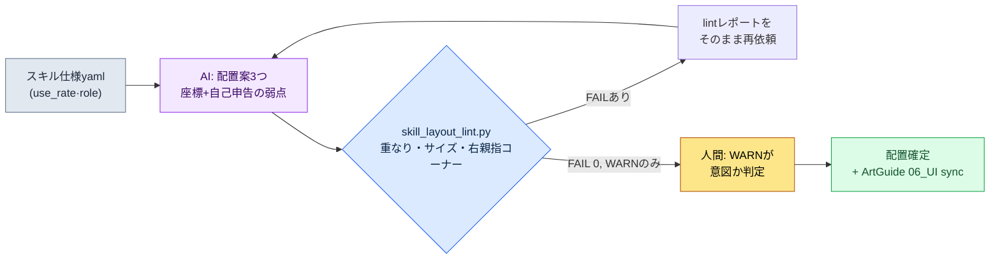

# 9.2 スキルボタン配列 — 配置案3つをAIが作り、lintが落とす

> 一次読者：モバイルファーストのアクション・MMORPGのUX・戦闘プランナー（中規模チーム）
> 一人・趣味開発の読者向け縮小版：§9.2.7「一人ならここまで」

新クラスのスキル6個を、モバイル画面のどこにどう並べるか。この問いが会議に上がると、最初の30分はいつも同じように流れていました。誰かがホワイトボードに丸を6つ描き、別の誰かが「それだと親指が届かない」と言い、また別の誰かが「では上に上げるとミニマップが隠れる」と返します。3人とも正しいことを言っているのに、結論は出ませんでした。次の会議では、同じホワイトボードがまた描かれました。

問題は、配置案を描く仕事と、その案がルールを守っているかを検査する仕事が、一人の頭の中で混ざっている点です。描いた本人は、自分が描いたものをなかなか落とせません。本章はその2つを切り離します。**配置案を複数作る退屈な仕事はAIに任せ、その案が重なり・親指コーナー・タッチサイズのルールに違反していないかはコードが落とします。** 人間は、コードが通した案の中から「ゲームの手触り」で1つを選ぶ場所にだけ立ちます。9.1がHUD全体のルールブックを立てたとすれば、本章はそのルールブックを、スキルボタンという最も手が触れる一塊に最後まで適用する1サイクルです。

---

## 9.2.1 スキルボタンが難しい理由 — 「読む情報」ではなく「押す情報」

HUD上のほとんどの要素は、読むだけのものです。HPバーを押す人はいません。だからこそ§9.1の親指コーナーの図では、HP・MP・ターゲットの体力を、手が届かない上部の読み取り領域に置いてよかったのです。スキルボタンは正反対です。0.1秒単位で正確に押す必要があり、戦闘中は視線が敵に向いているため、指は位置を*記憶*で探します。位置がわずかにずれただけで、その場で誤タップが起きます。

MMORPGモバイルは横持ち両手グリップが標準で、押す要素は左右下のコーナーに、消費・スロットは中央下部に置きます（なぜ横持ちが標準なのか、3つの領域が何なのかは§9.1で扱います）。その標準では、スキルはほぼすべて**右手の親指が届く右下コーナーのクラスター**に並びます（左手の親指は左下の移動に縛られています）。1つ区別を設けます — 0.1秒単位で押すアクティブスキルはこの右下クラスターが定位置ですが、消費・自動アイテム・クイックスロットは両親指の間、中央下部のスロット帯に別に置きます。本章はアクティブスキルボタンだけを扱い、すべての座標判定は横持ち両手グリップを前提とします。

そのため、スキルボタン配置は3つの決定論的ルールに同時に縛られます — 最小タッチターゲット（HIG 44pt）、隣接ボタン間隔（Material 8dp）、親指の到達（スキルは右親指の右下コーナー）。3つとも§9.1.1で立てたルールブックにすでに入っている、座標とサイズで判定できる項目なので、公開標準の数値はそのルールブックに従います（タッチ44pt・間隔8dpは公認数値、右親指コーナーだけは業界通用モデル）。この3つが、本章でAIの配置案を落とす**lintの一次入力**になります。「このボタン、少し小さくありませんか？」ではなく「skill_3は40ptでHIG 44pt未達」とコードが言えば、ホワイトボードの前の30分が消えます。

プラットフォーム基準をPCと並べてみると、配置の出発点がはっきりします。PCは精密・大量、モバイル横持ちは両手コーナー限定です（全体の比較表は§9.1のルールブックを参照）。スキル入力だけを切り出すと違いは明確です — PCはショートカットキーがあるので、スキルを画面のどこに置いても指はキーボードにあり、到達は問題にならず、スロットも多数置けます。モバイル横持ちはホバーもショートカットキーもないため、スキルを**右親指が届く右下コーナー**に頻度順に並べ（同時露出6〜8個が限界）、最もよく使うスキルをコーナーの内側（最も届きやすい位置）に置く必要があります。だからモバイルのスキル配置の本質は「きれいな配列」ではなく、**「右親指コーナー内での頻度順の優先配置＋ルールブックによるチェック」**です。そして案を複数描く仕事は、人が手でやると退屈で、やるたびに基準が揺れます。退屈で気まぐれな反復作業 — AIが人より疲れずにこなせる場所です。

---

## 9.2.2 [ワークド・トランスクリプト] 新クラスのスキル6個の配置案 — AIに3案を作らせる

新クラス「呪術師」のアクティブスキル6個をモバイルに配置する1サイクルを、入力から廃棄まで通しで見せます。以下は著者のプロジェクト（モバイルファーストMMORPG、以下「プロジェクトA」）の新規スキルUI作業セッションを忠実に再現したものです。入力とプロンプトはそのままコピーして使うことができ、出力は実際のセッションを再構成したものです。

### ステップ1 — 入力：スキル仕様を機械が読める表に

スキル6個の使用頻度と基本的な性格をyamlにまとめます。使用頻度はデータシートの戦闘ログから抽出した値なので、新たにでっち上げるものではありません。

```yaml
# skill_set_shaman.yaml — 新クラス「呪術師」アクティブスキル6種
screen: { w: 2400, h: 1080, dpr: 3 }   # 6.xインチ横持ち基準、pt = px / dpr
skills:
  - id: s1_quickbolt    # 基本攻撃、最も頻繁
    use_rate: 0.41      # 戦闘中の使用比率（ログ抽出）
    role: spam          # 連打
  - id: s2_hex          # デバフ、頻繁
    use_rate: 0.22
    role: core
  - id: s3_totem        # 設置型、普通
    use_rate: 0.14
    role: core
  - id: s4_heal         # 回復、たまにだが緊急
    use_rate: 0.11
    role: panic         # 危急時に即座
  - id: s5_curse        # 範囲デバフ、たまに
    use_rate: 0.08
    role: situational
  - id: s6_ultimate     # アルティメット、まれに
    use_rate: 0.04
    role: burst
```

核心となるスロットは`use_rate`と`role`です。最も頻繁に押す`s1_quickbolt`（41%）と、緊急時に0.2秒以内に見つけなければならない`s4_heal`（panic）は、右親指が最も届きやすい位置（右下コーナーの内側）に置く必要があります。まれにしか使わない`s6_ultimate`（4%）はコーナーの縁で、少し遠くても構いません。この優先順位が、次のステップのAI配置への入力のすべてです。

### ステップ2 — プロンプト：3案を強制し、座標を数字で受け取る

```
添付のyamlは新クラスのアクティブスキル6種だ。横持ち両手グリップの画面にスキルボタンの配置案を3つ作って。スキルは右手の親指が届く右下コーナーに敷いて(左手は左下の移動に縛られている)。
3案は互いに異なる哲学で — 例えばコーナー扇形、2行グリッド、頻度加重のように。ボタンごとにx,y,w,hをpxでくれ(画面2400x1080、dpr 3、pt=px/3)。
よく使うかrole=panicのスキルは右親指がよく届くコーナー内側に、タッチターゲットは132px(44pt)以上、隣接間隔24px(8dp)以上で。
案ごとに設計意図1行と君が見る弱点1つも必ず一緒に書いて — 弱点のない案はだめ。案別に(配列哲学|座標表|設計意図|自己申告弱点)だけ、説明抜きで。
```

このプロンプトで、配置の指示よりも力を入れたのは、出力形式と弱点申告を強制するくだりです。座標を数字で受け取らなければlintを回せないため、px出力を動かないように固定し、「この案の弱点1つ」を一緒に出させて、AIが自分の限界を先に語るようにしました。自由に「きれいなUIを作って」と頼むと、一般的なモバイルRPGの平均的な配置が、図もなく言葉だけで返ってきます。

### ステップ3 — Claudeの出力（実際のセッションの再構成、抜粋）

```
== 案A: 右下コーナー扇形 ==
配列哲学: 右親指の回転軸を中心に6個を扇形に。頻度順に内側→外側。
| id          | x    | y   | w   | h   | pt   |
|-------------|------|-----|-----|-----|------|
| s1_quickbolt| 2160 | 912 | 168 | 168 | 56pt |
| s2_hex      | 2016 | 852 | 132 | 132 | 44pt |
| s3_totem    | 2052 | 996 | 132 | 132 | 44pt |
| s4_heal     | 1884 | 924 | 132 | 132 | 44pt |
| s5_curse    | 1920 | 780 | 120 | 120 | 40pt |
| s6_ultimate | 1788 | 840 | 120 | 120 | 40pt |
設計意図: よく使うs1を最も大きく、届きやすい右下コーナー内側に。
自己申告弱点: s5,s6が40ptでHIG未達のおそれ。扇形の外側は右親指到達が曖昧。

== 案B: 2行グリッド(2x3) ==
配列哲学: 右下2行x3列の格子。視覚的整列を優先。
| id          | x    | y   | w   | h   |
|-------------|------|-----|-----|-----|
| s1_quickbolt| 2208 | 912 | 132 | 132 |
| s2_hex      | 2052 | 912 | 132 | 132 |
| s3_totem    | 1896 | 912 | 132 | 132 |
| s4_heal     | 2208 | 756 | 132 | 132 |
| s5_curse    | 2052 | 756 | 132 | 132 |
| s6_ultimate | 1896 | 756 | 132 | 132 |
設計意図: 全ボタン同一サイズ、整列がすっきり。
自己申告弱点: 上の行(s4,s5,s6, y=756)が右親指コーナー上側の境界で到達が曖昧。
         緊急回復s4が上段なので危急時に探すのが遅いおそれ。

== 案C: 頻度加重扇形 ==
配列哲学: s1を中心の大きい円に、残りを頻度順に右親指の回転軸へ巻く。
| id          | x    | y   | w   | h   |
|-------------|------|-----|-----|-----|
| s1_quickbolt| 2184 | 900 | 180 | 180 |
| s2_hex      | 2028 | 852 | 144 | 144 |
| s3_totem    | 2052 | 996 | 132 | 132 |
| s4_heal     | 1908 | 912 | 144 | 144 |
| s5_curse    | 1932 | 792 | 120 | 120 |
| s6_ultimate | 1812 | 972 | 120 | 120 |
設計意図: 手がs1へ自然に行き、緊急s4を大きくしてコーナー内側に。
自己申告弱点: 扇形なのでボタン間隔が不均等。s2-s5, s4-s6の近接衝突のおそれ。
```

3案すべてが自己申告の弱点を報告した点が、この出力の核心です。Aは「40pt未達のおそれ」、Bは「緊急回復が上の行」、Cは「近接衝突のおそれ」。AIが、自分の描いた絵の弱いところを先に指さしました。しかしこれは自己申告にすぎず、本当の判定はコードが行います。

### ステップ4 — lint：コードが3案を落とす

3案を目で比較すると、また「Bのほうがすっきりして見えるけれど」という好みの争いが始まります。そこで§9.2.3の`skill_layout_lint.py`に3案をそのまま食わせます。結果はこうでした。

```
[案A] 右下コーナー扇形
  [FAIL] B-size  : s5_curse 40pt < 44pt (HIG未達)
  [FAIL] B-size  : s6_ultimate 40pt < 44pt (HIG未達)
  [WARN] C-corner: s6_ultimate x=1788 — コーナー左境界、右親指到達「普通」
  → 通過 4/6, 致命違反 2

[案B] 2行グリッド(2x3)
  [FAIL] C-corner: s4_heal     y=756 (0.70h) < 0.55h 下でない → 右親指コーナー上側
  [FAIL] C-corner: s5_curse    y=756 (0.70h) < 0.55h 下でない → 右親指コーナー上側
  [WARN] role    : s4_heal(panic) y=756 — 緊急スキルが上段
  → 通過 4/6, 致命違反 2

[案C] 頻度加重扇形
  [FAIL] A-overlap: s2_hex ∩ s5_curse 間隔 18px < 24px (8dp未達)
  [FAIL] A-overlap: s4_heal ∩ s6_ultimate 間隔 12px < 24px (8dp未達)
  → 通過 4/6, 致命違反 2
```

3案がすべて落ちました。自己申告とlintの判定がほぼ重なった点が興味深いところです。AIが「弱点」と言った場所で、実際に違反が出ました。ただし自己申告は「おそれ」であり、lintは「s2_hexとs5_curseの間隔18px」という数字です。会議で議論する余地がありません。

この段階で重要な決定が1つあります。3案すべてが落ちたからといって、最初には戻りません。**lintレポートをそのまま次のプロンプトに貼り付けて再依頼します。**

### ステップ5 — 再依頼：lintレポートをそのまま食わせる

```
3案のlint結果をそのまま貼る(上のレポート)。この中で違反が最も直しやすい案を1つだけ選んで、FAILを全部0にした修正案を1つだけくれ。
ボタンは全部132px(44pt)以上、間隔24px(8dp)以上、s4_heal(panic)は右親指コーナー内でs1の次によく届く位置に。
座標表だけくれて、どのFAILがどう解消されたか1行ずつ書いて。
// (意図: コーナー内 = x>横70%(1680), y>縦55%(594))
```

AIは案A（コーナー扇形）を選びました。違反が「ボタン2つのサイズ不足」だけで、最も少ない手直しで済むからです。小さくて落ちたs5・s6を132pxに拡大し、大きくなった分だけ扇形の曲線をわずかにコーナーの内側へ寄せて間隔を確保した修正案を出してきました。

```
== 案A' (修正) ==
| id          | x    | y   | w   | h   | pt   |
|-------------|------|-----|-----|-----|------|
| s1_quickbolt| 2160 | 900 | 168 | 168 | 56pt |
| s2_hex      | 2010 | 846 | 132 | 132 | 44pt |
| s3_totem    | 2046 | 990 | 132 | 132 | 44pt |
| s4_heal     | 1872 | 918 | 144 | 144 | 48pt |
| s5_curse    | 1908 | 774 | 132 | 132 | 44pt |
| s6_ultimate | 1740 | 858 | 132 | 132 | 44pt |
解消: B-size s5 40→44pt / B-size s6 40→44pt /
     C-corner s6 x=1740(0.725w)·y=858(0.79h)でコーナー内側を維持 →
     role: s4_heal 144pxに拡大して緊急識別を強化。
```

`skill_layout_lint.py`に案A'を再び食わせました。

```
[案A'] 右下コーナー扇形(修正)
  [PASS] B-size  : 全ボタン ≥ 44pt
  [PASS] A-overlap: 最小間隔 30px ≥ 24px
  [PASS] C-corner : 全操作ボタンが右親指コーナー内 (x≥1680, y≥594)
  [WARN] C-corner : s6_ultimate x=1740 — コーナー左端、到達「普通」
  → 通過 6/6, 致命違反 0, WARN 1
```

FAILが0になりました。残ったWARN 1件（`s6_ultimate`がコーナーの左端にあり、右親指の到達が「容易」ではなく「普通」）は、コードが自動では落としません。人間に上げます。そしてこのWARNは、実は**意図された設計**です。s6は使用頻度4%で最もまれにしか使わないアルティメットスキルなので、コーナーで最も内側の位置はよく使うs1に譲り、縁に置くのが正しいのです。人間が「このWARNは意図だ」と判定して通しました。入力→3案生成→lint→全滅→再依頼→通過という1サイクルが、ここで閉じます。

この一巡が、本章の「Show」の基準です。AIが何を描き、lintが何を落とし、人間がどのWARNを生かすのかを最後まで見なければ、「AIでUI案を作った」という文は空虚です。

---

## 9.2.3 lintをコードに — 重なり・親指コーナー・HIGサイズ

上のサイクルの心臓部は、3つのルールで案を落とす30行あまりのコードです。§9.2.1の表の3項目が、そのまま3つの関数になります。

```python
# skill_layout_lint.py — スキルボタン配列検証（骨格）
# 入力: AIが出したボタン座標リスト [{id, x, y, w, h, role, use_rate}]
# 出力: A-overlap / B-size / C-corner 違反リスト
# 前提: 横持ち両手グリップ。スキルは右手の親指が届く右下コーナーに敷く。

MIN_TAP_PX    = 132    # HIG 44pt * dpr 3 = 132px
MIN_GAP_PX    = 24     # Material 8dp * dpr 3 = 24px
RIGHT_CORNER_X = 0.70  # 画面横0.70より右 = 右親指コーナー
BOTTOM_Y       = 0.55  # 画面縦0.55より下 = 下部コーナー

def in_right_thumb_corner(b, w, h):
    """横持ちグリップで右手の親指が届く右下コーナーか。
    (左親指=左下の移動、右親指=右下のスキル)"""
    rx, ry = b["x"] / w, b["y"] / h
    return rx > RIGHT_CORNER_X and ry > BOTTOM_Y

def lint(buttons, screen_w, screen_h):
    issues = []
    # ルールB: タッチターゲット最小サイズ (HIG 44pt)
    for b in buttons:
        side = min(b["w"], b["h"])
        if side < MIN_TAP_PX:
            issues.append(f"[FAIL] B-size : {b['id']} {side//3}pt "
                          f"< 44pt (HIG未達)")
    # ルールA: 隣接ボタンの重なり/間隔 (最も近い2辺の距離)
    for i, a in enumerate(buttons):
        for c in buttons[i+1:]:
            gap = edge_gap(a, c)          # 2つの矩形の最短間隔(px)
            if gap < MIN_GAP_PX:
                issues.append(f"[FAIL] A-overlap: {a['id']} ∩ {c['id']} "
                              f"間隔 {gap}px < {MIN_GAP_PX}px (8dp未達)")
    # ルールC: 操作要素は右親指コーナー内。panicはコーナー内側ほど良い。
    for b in buttons:
        rx, ry = b["x"] / screen_w, b["y"] / screen_h
        if not in_right_thumb_corner(b, screen_w, screen_h):
            issues.append(f"[FAIL] C-corner: {b['id']} "
                          f"x={b['x']}({rx:.2f}w) y={b['y']}({ry:.2f}h) "
                          f"→ 右親指コーナー外")
        elif b.get("role") == "panic" and rx < 0.78:
            issues.append(f"[WARN] role   : {b['id']}(panic) "
                          f"緊急スキルがコーナー内側境界の近く")
    return issues
```

このコードが、会議での「B案のほうがきれいですけど」という好みの発言を無力化します。きれいさは、lintが通した後に語るものです。lintが`[FAIL]`を吐く案は、きれいであろうとなかろうとビルドに入れません。§9.1.1で立てたHUDのlintゲートを、スキルボタンという最も厄介な一塊に最後まで適用したものです — 座標・サイズで判定できるものはコードが、「このWARNは意図か」という判断は人間が受け持つという分担が、ここでもそのまま成立します。

全体のサイクルをひと目で見ると、こうなります。



人の手が触れる場所は2か所だけです。入力仕様をきれいに入れる最初の部分と、lintには落とせないWARNを判定する最後の部分。その間の退屈な3案生成と座標チェックは、AIとlintが回します。

---

## 9.2.4 通過率を記録する — ツールの性能を数字で見る

配置案を一度出して終わりにすると、このツールがうまく機能しているのか分かりません。そこでlintの結果を毎回ログに残します。記録する値は単純です — **AIが出した案が最初のlintをいくつ通過したか（初回通過率）、そして再依頼何回でFAIL 0に到達したか（往復回数）。**

以下の数値は、新クラス3種（呪術師ほか2種）のスキルUIをこのサイクルで作りながら直接カウントした実測値です。標本がクラス3種（配置セッション9回）と小さいため、精密な母数ではなく方向性を示す値として読むのが正しい姿勢です。加工した数字はありません。

| 項目 | 実測 | 備考 |
|---|---|---|
| AIの最初の配置案のうちlintを一発通過 | 9回中1回 | 残りの8回は1件以上のFAIL |
| 初回判定時の平均FAIL数 | 1案あたり1.8件 | 大半はサイズ不足または右親指コーナー外 |
| FAIL 0到達までの平均往復 | 1.4回 | lintレポート再投入方式 |
| 最も多いFAILタイプ | B-size（サイズ不足） | 次がC-corner（右親指コーナー） |

最も重要なのは1行目です。**AIが最初に出した案は、9回中8回lintを通過できませんでした。** これはこのツールの失敗ではなく、正常動作のシグナルです。AIに座標を自由に出させると、HIG 44ptを頻繁に破ります。lintがそれを毎回捕まえ、レポートをフィードバックすれば、1〜2回の往復で0になります。もし初回通過率が100%だったなら、それはlintが緩すぎるという意味であって、AIが完璧だという意味ではありません。

この通過率ログは、lintルールを締めるか緩めるかを決める根拠にもなります。あるFAILタイプが毎回「実は意図だった」と人の手で解放されるなら、そのルールは厳しすぎます。逆に、リリース後に誤タップの不満が届いているのにlintは通していたなら、ルールが緩いのです。

---

## 9.2.5 確定案を図に — ボタン配列SVG

§9.2.2でlintを通過した案A'を座標どおりに描くと、以下のようになります。表の数字が実際の画面でどんな形になるのかは、図で見て初めて手に取るように分かります。横持ちのスマートフォンを両手で握った姿勢で、左手の親指は左下（移動）、右手の親指は右下（スキルクラスター）に届きます。円の大きさはタッチターゲット（pt）に比例し、色は親指到達の難易度（緑は容易、黄は普通）です。

<svg viewBox="0 0 660 340" xmlns="http://www.w3.org/2000/svg" role="img" aria-label="呪術師スキル6ボタン右下コーナークラスター配置確定案SVG (横画面)">
  <!-- スマホ外枠 (横) -->
  <rect x="20" y="30" width="620" height="280" rx="30" ry="30" fill="#0f1117" stroke="#3a3f4b" stroke-width="3"/>
  <rect x="34" y="44" width="592" height="252" rx="14" ry="14" fill="#11151d"/>
  <!-- 上部状態band (赤 — 読み取り専用) -->
  <rect x="34" y="44" width="592" height="56" fill="#7f1d1d" opacity="0.42"/>
  <text x="330" y="92" fill="#fecaca" font-family="sans-serif" font-size="12" text-anchor="middle">上部 — 状態表示専用 (HP · MP · ターゲット、読むだけ)</text>
  <!-- 中央ゲーム画面 -->
  <text x="300" y="190" fill="#5b6675" font-family="sans-serif" font-size="13" text-anchor="middle">ゲーム画面 (戦闘が起きる場所)</text>
  <!-- 左下親指コーナー (緑、移動) -->
  <path d="M34 296 L34 156 A140 140 0 0 1 174 296 Z" fill="#14532d" opacity="0.55"/>
  <path d="M34 156 A140 140 0 0 1 174 296" fill="none" stroke="#22c55e" stroke-width="2" stroke-dasharray="5 4" opacity="0.7"/>
  <circle cx="90" cy="240" r="18" fill="#166534" stroke="#22c55e" stroke-width="2"/>
  <text x="90" y="238" fill="#bbf7d0" font-size="9" text-anchor="middle" font-weight="bold">移動</text>
  <text x="90" y="249" fill="#86efac" font-size="6" text-anchor="middle">左親指</text>
  <!-- 右下親指コーナー (緑の点線境界、スキルクラスター) -->
  <path d="M626 296 L626 156 A140 140 0 0 0 486 296 Z" fill="#14532d" opacity="0.30"/>
  <path d="M626 156 A140 140 0 0 0 486 296" fill="none" stroke="#22c55e" stroke-width="1.5" stroke-dasharray="5 4" opacity="0.7"/>
  <text x="556" y="138" fill="#86efac" font-family="sans-serif" font-size="10" text-anchor="middle">右親指「容易」コーナー ↘</text>
  <!-- 上部読み取り情報の点 (参考) -->
  <circle cx="70" cy="72" r="8" fill="#7f1d1d"/><text x="70" y="76" fill="#fecaca" font-size="8" text-anchor="middle">HP</text>
  <circle cx="120" cy="72" r="8" fill="#7f1d1d"/><text x="120" y="76" fill="#fecaca" font-size="8" text-anchor="middle">MP</text>
  <circle cx="330" cy="68" r="8" fill="#7f1d1d"/><text x="330" y="72" fill="#fecaca" font-size="7" text-anchor="middle">タゲ</text>
  <circle cx="588" cy="72" r="8" fill="#7f1d1d"/><text x="588" y="76" fill="#fecaca" font-size="8" text-anchor="middle">マップ</text>
  <!-- スキル6ボタン: 右下コーナークラスター。サイズ=pt比例、s1最大でコーナー最内側 -->
  <!-- s1 56pt 最大の緑、コーナー最内側(右親指がよく届く) -->
  <circle cx="590" cy="248" r="22" fill="#14532d" stroke="#22c55e" stroke-width="2.5"/>
  <text x="590" y="246" fill="#bbf7d0" font-size="10" text-anchor="middle" font-weight="bold">s1</text>
  <text x="590" y="257" fill="#86efac" font-size="7" text-anchor="middle">56pt</text>
  <!-- s2 44pt -->
  <circle cx="552" cy="234" r="17" fill="#166534" stroke="#22c55e" stroke-width="2"/>
  <text x="552" y="232" fill="#bbf7d0" font-size="9" text-anchor="middle">s2</text>
  <text x="552" y="242" fill="#86efac" font-size="6" text-anchor="middle">44</text>
  <!-- s3 44pt -->
  <circle cx="562" cy="276" r="17" fill="#166534" stroke="#22c55e" stroke-width="2"/>
  <text x="562" y="274" fill="#bbf7d0" font-size="9" text-anchor="middle">s3</text>
  <text x="562" y="284" fill="#86efac" font-size="6" text-anchor="middle">44</text>
  <!-- s4 heal 48pt, panic 強調 -->
  <circle cx="516" cy="256" r="19" fill="#166534" stroke="#facc15" stroke-width="3"/>
  <text x="516" y="254" fill="#fef08a" font-size="9" text-anchor="middle" font-weight="bold">s4</text>
  <text x="516" y="264" fill="#fde68a" font-size="6" text-anchor="middle">緊急</text>
  <!-- s5 44pt -->
  <circle cx="524" cy="218" r="17" fill="#166534" stroke="#22c55e" stroke-width="2"/>
  <text x="524" y="216" fill="#bbf7d0" font-size="9" text-anchor="middle">s5</text>
  <text x="524" y="226" fill="#86efac" font-size="6" text-anchor="middle">44</text>
  <!-- s6 44pt, WARN 黄(普通)、コーナー左端 -->
  <circle cx="486" cy="240" r="17" fill="#3f3f1a" stroke="#f59e0b" stroke-width="2.5"/>
  <text x="486" y="238" fill="#fde68a" font-size="9" text-anchor="middle">s6</text>
  <text x="486" y="248" fill="#fbbf24" font-size="6" text-anchor="middle">普通</text>
  <!-- 凡例 -->
  <circle cx="70" cy="285" r="5" fill="#166534" stroke="#22c55e"/><text x="80" y="288" fill="#86efac" font-size="8" text-anchor="start">容易</text>
  <circle cx="150" cy="285" r="5" fill="#3f3f1a" stroke="#f59e0b"/><text x="160" y="288" fill="#fbbf24" font-size="8" text-anchor="start">普通(s6=まれなアルティメット、意図)</text>
</svg>

図で見ると、lintレポートの最後のWARNがひと目で理解できます。`s6_ultimate`（黄）だけが右下コーナーの左端、右親指到達「普通」の位置です。しかしs6は使用頻度4%のアルティメットスキルなので、コーナーの縁に置くのが正しいのです。最もよく使うs1（緑、56ptで最大）は右親指が最も届きやすいコーナー内側の右下に、緊急回復のs4（黄色の枠）はサイズを大きくして、緊急時に手が素早く見つけられるようにしました。左手の親指は左下の「移動」に縛られているため、スキルはすべて右コーナーに集まります。座標表1枚が図1枚と正確に一致すること — それが座標を数字で受け取った理由です。

---

## 9.2.6 よくある失敗

| パターン | なぜ失敗するか | 処方 |
|---|---|---|
| ホワイトボードに丸だけ描いて会議 | 座標がなくlint不可、好みの争いの繰り返し | 座標をpxで受け取りlintに食わせる（§9.2.2） |
| 「AIさん、きれいなスキルUIを作って」と丸投げ | ルールブックなしでは一般的なRPGの平均配置になる | 3案＋座標＋自己申告の弱点を強制するプロンプト |
| 縦持ち片手グリップ前提で配置 | MMORPGは横持ち両手が標準、スキルは右親指コーナー | 横2400x1080、右下コーナー基準でlint |
| 配置案を目だけで比較 | HIG未達・重なりを毎回見落とす | `skill_layout_lint.py`で自動判定 |
| 最初の案がlint通過→ツールはうまくいったと安心 | lintが緩いシグナルの可能性 | 通過率ログでルールの締まり具合を点検（§9.2.4） |
| WARNまでコードが自動遮断 | 意図された配置（まれなアルティメット）まで落とす | WARNは人間の判定で（§9.2.3） |

5番目が最も見落とされがちです。AIの最初の案が毎回通過すれば気分は良いですが、それはたいていlintルールが緩いという意味です。9回中8回落ちるのが健全な状態です。

---

## 9.2.7 やってみよう — 今日できる一歩

> **一人ならここまで**：lintコードがなくても大丈夫です。自分のゲーム（または好きなゲーム）のスキル4〜6個を選んで§9.2.1の形式の仕様を手で書き（use_rateはざっくり頻度の順位だけで構いません）、§9.2.2のプロンプトをそのまま貼り付けて3案を受け取ってみましょう。次に、定規の代わりに「44pt = 132px」だけを頭に入れて、AIが出した座標表から132px未満のボタンを手で探して丸を付けてみましょう。さらに横画面だと想定して、右下コーナー（横70%より右＋縦55%より下）の外に落ちたスキルがないかも確かめてみましょう。その1回が、lintが何をしているのかを体で教えてくれます。

チームなら、次の一歩から始めましょう。§9.2.3の`skill_layout_lint.py`の3つの関数（サイズ・間隔・右親指コーナー）から先にコードとして固定しておきます。3つの関数で十分です。ルールブックがあれば、AIの配置案でもデザイナーの案でも同じ物差しで測ることができ、lintを通過した案だけがアートチームの`96_ArtGuide/06_UI/`へ渡り、`_convert_md_to_html.py`→`_SyncToArtRepo.bat`の経路で自動syncされます。確定座標がアートチームに届くまでの、人間の最後の仕事は、WARN 1件を「意図だ」と判定することだけです。

---

### 本章のポイント
- スキルボタンは「押す情報」なので、座標がわずかにずれただけで誤タップが起きます。
- MMORPGモバイルは横持ち両手グリップ — スキルは右親指の右下コーナークラスターに並べます。
- AIが3案を作り、lintが重なり・サイズ・右親指コーナーで落とします（HIG 44pt）。
- AIの最初の案が9回中8回落ちるのが、健全なlintのシグナルです。

### 次章のプレビュー
- 9.3 ArtGuide/06_UI協業 — 確定したUI決定を、非プランナーのアートチームへmd→html自動syncで渡す協業標準
