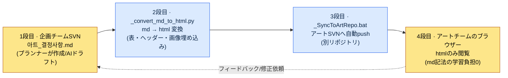

# 9.3 ArtGuide/06_UI連携 — プランナーはmdで書き、アートチームはhtmlだけを見る

> 主な読者：非企画職（アート）と毎日連携するUX・UIプランナー（中規模チーム）
> 一人/趣味の読者向けミニ版：§9.3.8「一人ならこれだけ」

プランナーがMarkdown（マークダウン）でUIの決定事項を整理しておくと、仕事がすっきりします。バージョン管理ができ、diffが見え、AIにそのまま渡せます。問題は、アートチームがMarkdownを読まないことです。より正確に言えば、読む理由がないのです。アートデザイナーに「`아트_결정사항.md`をSVNから取得して見てください」と言うと、半分はSVNクライアントをインストールしておらず、残りの半分は`##`ヘッダーや表の記法が崩れたままメモ帳で開いた画面を見ながら「これ、どうやって見るんですか」と聞いてきます。

ここで間違った処方は「アートチームにMarkdownを教えよう」です。アートデザイナーの時間はピクセルを磨くことに使うべきです。Markdownの記法、SVNのチェックアウト、diffの見方を学ぶのに費やす時間は、すべて損失です。正しい処方は、**プランナー側で変換と受け渡しを自動化し、アートチームの学習負担を0にすること**です。プランナーはmdで書き、スクリプトがhtmlに変換し、別のスクリプトがアートのリポジトリへ押し込み、アートチームはブラウザーでhtmlだけを見ます。本章では、そのパイプラインを実際に一度最後まで回します — 決定事項のドラフトをAIで作るところから、変換・受け渡しの自動化、そして人が何を拒否するかまで。

---

## 9.3.1 連携が壊れる本当の場所は「フォーマット」

企画とアートの連携が壊れる理由を「決定権の曖昧さ」とまとめる本は多いです。誰が色を決め、誰が機能を決めるのか。その分担も重要ですが、分担表をどれほどうまく描いても、**その分担表をアートチームが読めなければ**何も起こりません。実務でより頻繁に事故が起きる場所は、決定権ではなく受け渡しのフォーマットです。

著者のプロジェクト（モバイル優先のMMORPG、以下「プロジェクトA」）で実際に繰り返された事故は次のとおりです。

| 事故 | 表面的な原因 | 本当の原因 |
|---|---|---|
| アートが旧バージョンの決定事項で作業 | 「最新版を受け取っていませんでした」 | 受け渡しが手動（メール添付）のため漏れる |
| 決定事項の表が崩れて見える | 「これ、どうなってるんですか」 | mdをメモ帳で開いたため |
| 「その決定、どこに書いてありますか？」 | 口頭での伝達 | 正本（カノニカル）がチャットに散らばっている |

3つの事故はいずれも決定権の問題ではありません。**正本のドキュメントが、アートチームが読むフォーマットで、自動的に、常に最新の状態で届かないから**起きるのです。だから本章の道具は、分担表ではなく受け渡しのパイプラインです。分担は一度合意すれば終わりですが、受け渡しは決定が変わるたびに毎回発生するからです。

まず実際のフォルダー構造から見ます。プロジェクトAのアートガイドは`workspace/96_ArtGuide/`の下で7つのドメインに分かれています。

```
96_ArtGuide/
├── 00_Common/      # 共通 (スタイル・カラーパレット・ライティング基準)
├── 01_Character/
├── 02_Animation/
├── 03_Monster/
├── 04_NPC/
├── 05_VFX/
├── 06_UI/          # ← この章が扱う領域
└── 07_Env/
```

そして、このフォルダーには運用ファイルが2つ一緒に住んでいます。`_convert_md_to_html.py`と`_SyncToArtRepo.bat`です。この2つのファイルが本章の背骨です。

---

## 9.3.2 4段syncパイプライン — プランナーのmdからアートチームのブラウザーまで

全体の流れは4つの段階です。核心は、**人（プランナー）は1段目のmdだけを触り、残りの3段はすべてスクリプトが回す**という点です。アートチームは4段目のhtmlだけを見ます。mdの存在自体を知らなくてもかまいません。



各段階が正確に何をするのかを押さえます。

**1段目（プランナー、人間）** — `06_UI/아트_결정사항.md`に決定事項をMarkdownで書きます。ここにAIを組み込む方法が§9.3.4の背骨です。決定事項は「ボタンのprimaryカラーは#3A7BD5」「タッチターゲットは最小44pt」のような項目です。

**2段目（`_convert_md_to_html.py`、自動）** — mdをhtmlに変換します。単純な変換ではなく、アートチームが見やすいように表をレンダリングし、``の画像参照をインラインで埋め込み、目次を付けます。アートデザイナーがブラウザーでダブルクリック1回で開ける、自己完結のhtmlができあがります。

**3段目（`_SyncToArtRepo.bat`、自動）** — 変換されたhtmlを**アートチームの別のSVNリポジトリ**へpushします。企画リポジトリとアートリポジトリが分離されているのが核心です。アートチームは自分のリポジトリだけを見ればよく、企画リポジトリの権限や構造を知る必要はありません。

**4段目（アートチーム、人間）** — アートデザイナーは、自分のリポジトリに同期されたhtmlをブラウザーで開きます。Markdownの記法も、SVNコマンドも、diffの見方も学ぶ必要はありません。**md記法の学習負担が0**であることが、このパイプラインの設計目標であり成功基準です。

フィードバックは4段目から1段目へ戻ってきます。アートが「この決定、おかしいです」と言えば、プランナーがmdを直し、2〜3段目が再び自動で回ります。アートは更新されたhtmlを開き直すだけで済みます。

---

## 9.3.3 なぜ変換・受け渡しを自動化するのか — 学習負担の非対称性

ここで一度立ち止まり、設計意図を明示します。mdをhtmlに変換すること自体は、ささいな作業です。本当の設計は、**誰の学習負担を誰が引き受けるか**を決めたところにあります。

選択肢は2つありました。

<svg viewBox="0 0 640 300" xmlns="http://www.w3.org/2000/svg" role="img" aria-label="学習負担の配分 二方式の比較 — アートチームがmdを学ぶ案 vs プランナーが自動化を引き受ける案">
  <!-- 左: 誤った案 -->
  <rect x="20" y="20" width="280" height="260" rx="10" fill="#1a1014" stroke="#7f1d1d" stroke-width="2"/>
  <text x="160" y="48" fill="#fecaca" font-family="sans-serif" font-size="15" text-anchor="middle" font-weight="bold">案A — アートチームがmdを学ぶ</text>
  <rect x="50" y="70" width="100" height="44" rx="6" fill="#3a1518" stroke="#b91c1c"/>
  <text x="100" y="97" fill="#fca5a5" font-family="sans-serif" font-size="12" text-anchor="middle">プランナー</text>
  <text x="100" y="135" fill="#fca5a5" font-family="sans-serif" font-size="11" text-anchor="middle">mdのみ作成</text>
  <line x1="150" y1="92" x2="190" y2="92" stroke="#b91c1c" stroke-width="2" marker-end="url(#arrowR)"/>
  <rect x="190" y="70" width="100" height="44" rx="6" fill="#3a1518" stroke="#b91c1c"/>
  <text x="240" y="91" fill="#fca5a5" font-family="sans-serif" font-size="12" text-anchor="middle">アート5人</text>
  <text x="240" y="107" fill="#fca5a5" font-family="sans-serif" font-size="10" text-anchor="middle">×SVN・md学習</text>
  <text x="160" y="170" fill="#fda4af" font-family="sans-serif" font-size="11" text-anchor="middle">学習コスト = 1回の作成 ×</text>
  <text x="160" y="188" fill="#fda4af" font-family="sans-serif" font-size="11" text-anchor="middle">アートの人数分だけ掛け算</text>
  <text x="160" y="222" fill="#f87171" font-family="sans-serif" font-size="12" text-anchor="middle" font-weight="bold">負担がピクセル作業の時間を</text>
  <text x="160" y="240" fill="#f87171" font-family="sans-serif" font-size="12" text-anchor="middle" font-weight="bold">蝕む → 拒否される</text>
  <!-- 右: 採択案 -->
  <rect x="340" y="20" width="280" height="260" rx="10" fill="#0d1512" stroke="#15803d" stroke-width="2"/>
  <text x="480" y="48" fill="#bbf7d0" font-family="sans-serif" font-size="15" text-anchor="middle" font-weight="bold">案B — プランナーが自動化する</text>
  <rect x="370" y="70" width="100" height="44" rx="6" fill="#0f2417" stroke="#16a34a"/>
  <text x="420" y="91" fill="#86efac" font-family="sans-serif" font-size="12" text-anchor="middle">プランナー</text>
  <text x="420" y="107" fill="#86efac" font-family="sans-serif" font-size="10" text-anchor="middle">md+スクリプト1回</text>
  <line x1="470" y1="92" x2="510" y2="92" stroke="#16a34a" stroke-width="2" marker-end="url(#arrowG)"/>
  <rect x="510" y="70" width="100" height="44" rx="6" fill="#0f2417" stroke="#16a34a"/>
  <text x="560" y="91" fill="#86efac" font-family="sans-serif" font-size="12" text-anchor="middle">アート5人</text>
  <text x="560" y="107" fill="#86efac" font-family="sans-serif" font-size="10" text-anchor="middle">htmlダブルクリック</text>
  <text x="480" y="170" fill="#86efac" font-family="sans-serif" font-size="11" text-anchor="middle">学習コスト = プランナー1回</text>
  <text x="480" y="188" fill="#86efac" font-family="sans-serif" font-size="11" text-anchor="middle">(アートの負担 0)</text>
  <text x="480" y="222" fill="#4ade80" font-family="sans-serif" font-size="12" text-anchor="middle" font-weight="bold">アートはピクセルだけに集中</text>
  <text x="480" y="240" fill="#4ade80" font-family="sans-serif" font-size="12" text-anchor="middle" font-weight="bold">→ 持続する</text>
  <defs>
    <marker id="arrowR" markerWidth="8" markerHeight="8" refX="6" refY="3" orient="auto"><path d="M0,0 L6,3 L0,6 Z" fill="#b91c1c"/></marker>
    <marker id="arrowG" markerWidth="8" markerHeight="8" refX="6" refY="3" orient="auto"><path d="M0,0 L6,3 L0,6 Z" fill="#16a34a"/></marker>
  </defs>
</svg>

核心は非対称性です。案Aは、学習コストがアートの人数分だけ掛け算され、そのコストが新しいメンバーが入るたびに再発します。案Bは、プランナーが一度スクリプトを書けば終わりで、アート側の限界コストは0です。**負担を、人数が多い側ではなく自動化が可能な側に寄せること** — これが非企画職との連携ツールの第1原則です。この原則が崩れると、つまり連携ツールが相手の職種に新しい学習を強要すると、そのツールは1〜2四半期のうちに「使われなく」なります。

---

## 9.3.4 [ワークド・トランスクリプト] UI決定事項のmdドラフトをAIで作る

1段目でプランナーがmdを書くと述べましたが、そのmdドラフトをAIで作る場面を、1サイクル最後までお見せします。決定会議が終わると、散発的なメモ（チャット・ホワイトボードの写真・口頭での合意）が残ります。これを正本の決定事項mdに整理する作業は退屈で、毎回形式がぶれます。AIにぴったりの仕事です。ただし、**決定そのものは人間が行い、AIは決定を決められたフォーマットに整理するだけ**という境界が核心です。

### ステップ1 — 入力：会議メモの生データ

```
[UI決定会議メモ — 06_UI スキルスロット関連、生データ]
- スキルスロットのボタンサイズを大きくすることになった。モバイルで小さすぎるので。
- 色はアートが決めることに。ただしprimaryトーンは青系を維持。
- スロット非アクティブ（クールダウン）状態の表現はグレー+数字オーバーレイで合意
- 多言語… スキル名が長くなるのはどうする？ いったん保留
- あ、それとロングプレスでスキル説明が出るように（これは機能、企画確定）
```

### ステップ2 — プロンプト：決定/保留/責任者を強制的に分離する

```
添付はUI決定会議の生メモだよ。アートチームに渡す決定事項マークダウンに整理して。
各項目を[確定]/[保留]/[アート決定]に分類して（確定=企画が決めアートが従う、保留=未決+理由、アート決定=視覚表現なのでアートが決める・企画は制約のみ）、根拠/制約を一行ずつ付けて — メモに根拠がなければ「根拠未記載」と正直に書き、推測で埋めないで。
タッチサイズのように公開標準で検証できるものは標準を明記して、メモにない項目は絶対に新しくでっち上げないで。
表は|項目|分類|決定/制約|根拠|検証可能かどうか|、frontmatter(title, layer: L1)を含めて全文でちょうだい。
```

このプロンプトの重心は、整理作業ではなく、分類の強制とでっち上げの禁止に置かれています。AIに決定事項の整理をさせると、メモになかった「ベストプラクティス」を親切に追加してしまいます。その追加分は、アートチームには「企画が確定した決定」として読まれます。だから、**[確定]/[保留]/[アート決定]の分類、根拠の義務化、そして「メモになければでっち上げるな」という釘**を打ち込みます。

### ステップ3 — Claudeの生の出力（実際のセッションの再構成）

```markdown
---
title: 06_UI 決定事項 — スキルスロット
layer: L1
---

# 06_UI 決定事項 — スキルスロット

| 項目 | 分類 | 決定/制約 | 根拠 | 検証可能 |
|---|---|---|---|---|
| スキルスロットのボタンサイズ | [確定] | 最小 44×44 pt 以上 | モバイルのタッチターゲット、Apple HIG 44pt推奨 | ✅ 座標・サイズ |
| primaryトーン | [アート決定] | 青系を維持（制約）、正確な値はアート | メモ: 「primaryトーンは青系を維持」 | △ 色の値 |
| クールダウン状態の表現 | [確定] | グレーオーバーレイ + 残り数字 | 会議で合意 | ◯ 視覚検収 |
| スキル名の多言語の長さ | [保留] | 後日の会議 | メモ: 「いったん保留」 — 長い言語（独・露）の検証未実施 | — |
| ロングプレスのスキル説明 | [確定] | ロングプレス → ツールチップ表示 | 機能確定（企画領域） | ◯ 動作検収 |
| スロット間の間隔 | [確定] | 最小 8 dp 推奨 | 根拠未記載 — メモになし、Material推奨値を参考 | ✅ |
```

### ステップ4 — 検証と拒否（人間の出番）

この出力をそのまま正本として上げてはいけません。1行、引っかかります。

最後の行、`슬롯 간 간격 | 최소 8 dp`（スロット間の間隔 | 最小8dp）です。メモを見直すと、会議で間隔の話は**一度も出ていません**。AIが「モバイルUIだから間隔の基準もあるべきだろう」と判断し、Material Designの推奨値を親切に追加したのです。ルール5（「メモにない項目のでっち上げ禁止」）違反です。AIは`근거 미기재`（根拠未記載）と正直に書いてはいますが、項目自体を作るべきではありませんでした。この1行がアートチームに渡れば、「企画が8dpの間隔を確定した」と読まれます。

そこで再依頼します。

```
「スロット間の間隔」は会議メモになく、君が追加したものだよ。表から外して。
メモにはないけど決定が必要そうなものは、表ではなくいちばん下の「## 未決 — 次回会議の議題」に候補としてだけ載せて、決定事項の表にはメモに実際にあった項目だけ残して。
```

AIは間隔の項目を表から外し、いちばん下に「次回会議の議題：スロット間の間隔基準（現在未定）、多言語スキル名の長さの処理」を候補として分離しました。これで決定事項の表には会議で実際に決めたことだけが残り、AIが思いついた合理的な候補は「確定」ではなく「議題」へ格下げされました。この分離が重要な理由は、アートチームが受け取るドキュメントの中で**何が確定で何がまだ議論中なのかが混ざると、アートが未定事項を確定と思い込んで作業を始めてしまう**からです。

この1往復で1段目（md）が完成しました。ここからは人の手を離れ、2〜3段目の自動化へ進みます。

---

## 9.3.5 2〜3段目の自動化 — 変換と受け渡しに人は手を触れない

完成したmdは、ここからスクリプトが処理します。変換スクリプトの骨格は単純です。

```python
# _convert_md_to_html.py (骨格)
# 入力: 06_UI/*.md (プランナーが書いた決定事項)
# 出力: 同名の .html (アートチームがブラウザーで開く自己完結ファイル)

def convert(md_path):
    md_text = read(md_path)
    front, body = split_frontmatter(md_text)          # title・layer 抽出
    html_body = markdown_to_html(body, extensions=[
        "tables",        # 表レンダリング (アートがメモ帳で見ていた崩れた表を解決)
        "fenced_code",
    ])
    html_body = embed_images_inline(html_body, base_dir=md_path.parent)
    # ↑  のような参照をインライン埋め込み →
    #   アートが画像ファイルを別途受け取らなくて済む
    toc = build_toc(html_body)                         # 目次の自動生成
    return render_template(title=front["title"], toc=toc, body=html_body)
```

ここで、変換が単純なmd→htmlではないという点が核心です。3つのことを追加で行います。**表を正しくレンダリングし**（アートがメモ帳で見ていた崩れた`|---|`が消えます）、**画像をインラインで埋め込み**（アートが画像ファイルを別途受け取る必要がなくなります）、**目次を自動で付けます**（決定事項が長くなっても、アートは目的の項目へジャンプできます）。この3つが「htmlだけ見ればいい」を実際に成立させます。

受け渡しスクリプトは、こうまとめられます。

```bat
REM _SyncToArtRepo.bat (骨格)
REM 1) 06_UI のすべての md を html に変換
python _convert_md_to_html.py 06_UI\*.md

REM 2) 変換された html をアート SVN の作業コピーへコピー
xcopy 06_UI\*.html %ART_REPO%\UI\ /Y

REM 3) アート SVN に自動コミット・push (別リポジトリ)
svn add %ART_REPO%\UI\*.html --force
svn commit %ART_REPO%\UI -m "[auto] 06_UI 決定事項更新"
```

プランナーがやることは、`_SyncToArtRepo.bat`のダブルクリック1回です（あるいは決定事項のコミット時に自動実行されるよう、フックを掛けます）。これで変換・コピー・アートリポジトリへのpushが一度に回ります。アートチームは、自分のリポジトリを更新すれば最新のhtmlが届いています。

> **AIはどこまで入るのか** — この2〜3段目の自動化コードは、AIに書かせてもかまいません。「mdフォルダーを受け取り、表・画像込みのhtmlに変換して別のSVNへpushするスクリプトを書いて」は、AIが得意とする領域です。しかし、**どの決定を確定とするか、何をアート決定として渡すか**（§9.3.4）はAIに委ねません。コードはAI、決定は人間 — 本書全体で繰り返される分担が、ここでもそのまま当てはまります。

---

## 9.3.6 画像プロンプトも「設計意図」を先に書く

アートとの連携でAIが誤って使われる代表例が、画像プロンプトです。プランナーがアートチームにリファレンスを渡すとき、あるいはコンセプトを素早く可視化するときに、画像生成AIを使います。このときよくある間違いは、結果の描写（「青い丸ボタン、グロー効果、4K」）から書くことです。

著者の連携原則の1つが`image_prompt_design_intent_first` — **画像プロンプトも、結果の描写ではなく設計意図を先に書く**というものです。

| 方式 | プロンプト | 問題/効果 |
|---|---|---|
| 結果優先（悪い） | 「青い丸ボタン、グロー、4K、ゲームUI」 | アートが「なぜ青？」を問えない。意図が蒸発する |
| 意図優先（良い） | 「クールタイム（クールダウン）中かどうかを直感的に伝えるスキルボタン。アクティブ=すぐ押したくなる視覚的な引力、クールタイム中=抑制。トーンはprimaryの青系」 | アートが意図を見て、より良いビジュアル案を逆提案できる |

違いは、アートチームがプロンプトを受け取ったときに何ができるかです。結果の描写だけを受け取った場合、アートはそのまま描くか無視するかの2択です。**設計意図を受け取れば、アートはその意図をより良く解く、自分のビジュアル案を提案できます。** これが、プランナーがアートの決定領域（§9.3.4の[アート決定]）を侵さずに方向を示す方法です。プランナーは「何のために」を渡し、アートは「どう見せるか」を決めます。

だから§9.3.4の決定事項mdに画像リファレンスを入れるときも、キャプションを「青いボタン」ではなく「クールタイム状態の区別が目的のスロット — 正確な表現はアート決定」と書きます。変換スクリプトがこのキャプションごとhtmlに埋め込むので、アートは画像と意図を一緒に受け取ります。

---

## 9.3.7 測定 — 何を正直に数えられるか

このパイプラインの効果を、「連携事故が70%減った」のような数字で書きたい誘惑があります。そうした数値は、検証されていなければ本の信頼を削ります。正直に区分します。

**公開標準で検証可能なもの** — 決定事項に載るタッチ44pt・間隔8dp・コントラスト4.5:1のような公開標準は、§9.1のルールブックに従います。でっち上げた数値ではなく、そのまま引用してlintで自動検証できる値です。

**測定可能な運用指標** — このパイプラインで実際に数えられるのは、次のようなものです。アートが旧バージョンで作業した事故の件数（受け渡しが自動なら0に収束します）、アートチームの新メンバーが決定事項を初めて開いて見るまでにかかる時間（htmlのダブルクリックなら分単位です）、決定の変更がアートリポジトリに反映されるまでの遅延（スクリプトの実行時間です）。この3つは「感覚」ではなく、ログと観測で数えられます。

**著者の推定（未検証の仮説）** — 「手動のメール受け渡しのときより漏れが減った」という方向は明らかですが、正確な減少率はサンプルを別途記録していないため、断定しません。絶対値ではなく**方向**で読んでください。受け渡しが人の手に懸かっていれば忙しい週には必ず漏れが出ますし、受け渡しがスクリプトなら漏れは構造的に消えます。

---

## 9.3.8 やってみよう — 今日できる一歩

> **一人ならこれだけ**：アートチームもSVNもなくてかまいません。自分が依頼する外注アート、あるいは一緒に作っている友人にUIの決定を伝える場面を想像してみましょう。§9.3.4のプロンプトをそのまま使って、頭の中の散発的なUI決定を[確定]/[保留]/[アート決定]に分類したmdを1枚、AIで作ってみましょう。その中からAIが「親切に追加した」項目（メモになかったもの）を1つ見つけて、「これは私が決めた覚えがない、外して」と反論してみると、決定の整理における人間とAIの境界がどこにあるのか、体に入ってきます。変換は`markdown`パッケージで`python -m markdown decision.md > decision.html`の1行で十分です。

チームなら、次の一歩から始めましょう。大げさな双方向同期から作り始めるのではなく、**変換1行+受け渡し1行**から入れます。決定事項mdをhtmlに変換するスクリプト（§9.3.5の表レンダリング・画像埋め込みだけ）と、そのhtmlをアートが見る場所（共有ドライブでも別リポジトリでも）へコピーする1行です。この2行があるだけで、「アートがmdをメモ帳で開いて崩れた表に出会う」という最もよくある事故が消えます。分担表や決定権の整理は、その次です。

setup → prompt → verifyに要約すると、次のとおりです。

| ステップ | やること |
|---|---|
| setup | `_convert_md_to_html.py`（変換）+受け渡し1行（コピー/push）を先に入れます |
| prompt | §9.3.4のプロンプトで会議メモを[確定]/[保留]/[アート決定]のmdに整理します |
| verify | AIがでっち上げた項目（メモにないもの）を拒否 → 変換・受け渡しを自動実行 → アートはhtmlだけを確認します |

---

### 本章のポイント
- 連携が壊れる本当の場所は、決定権ではなく受け渡しのフォーマットです。
- プランナーはmdで書き、スクリプトがhtmlで届ける — アートの学習負担は0です。
- 決定の整理はAIのドラフト、でっち上げた項目の拒否は人間 — コードはAI、決定は人間です。

### 次章のプレビュー
- 10.1 integrity_check atomの総括 — UI検証をゲームデータ全体の検証へ拡張します。
