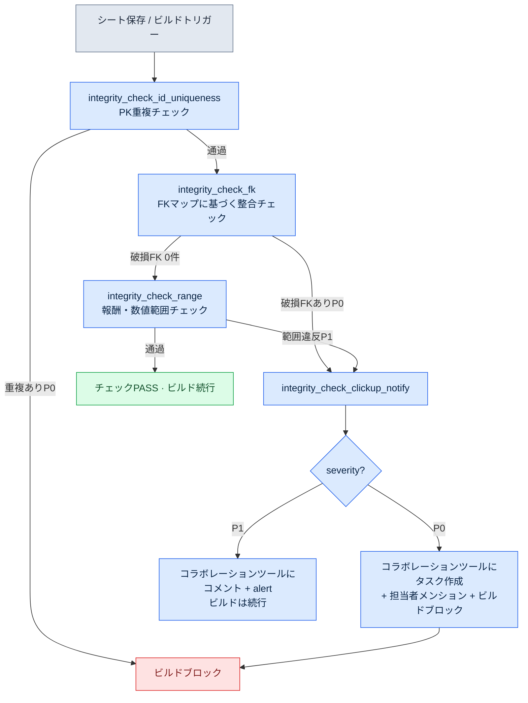

# 10.1 整合性検証atom — 30シートのFKを守るcascade

金曜の夕方6時40分。翌週月曜の社内ビルドに、クエスト12種を新しく入れると決めていた日でした。私は`quest_table`に新しい行を追加し、報酬シートに対応する行を埋め、ダイアログシートにNPCのセリフを紐付けました。3枚のシート、約50行。目で2回見直して、問題なさそうに見えました。

月曜の朝、ビルドが壊れました。新しいクエストのうち1件が参照する`reward_id`が、報酬シートに存在しなかったのです。金曜の夕方に報酬行を1つ削除して追加し直したとき、idを1文字打ち間違えていました。`rwd_q318`を`rwd_q381`と。人間の目では絶対に捕まえられない類のタイポです。2つのシートは別のフォルダーにあり、別の人が、別の時間に触ります。行が50個のうちは目で捕まえられます。しかし30を超えるシートが互いを外部キー（FK）で参照し始めると、人間の目はもはや検査ツールではありません。

本章では、そのタイポをビルドが壊れる前に捕まえるチェックatomの一種 — `integrity_check_fk` — が、30を超えるシートのFK整合をチェックし、破損したときにコラボレーションツール（タスクや日程を管理するSaaS — 本プロジェクトではClickUpを使っており、JIRAやRedmineも同じ位置づけです）で担当者へ通知する流れを、私が実際に回した1つのセッションをたどりながらお見せします。

他人が作ったものの中からずれた1行を見つけ出す仕事で、私はこの業界に入りました。シングルプレイゲームのQA・チェックが最初の仕事で、当時は手と目が唯一の検査ツールでした。20年余りが過ぎた今は、同じ仕事をコードに任せています — 人間の目が検査ツールであることをやめた場所で。

---

## 10.1.1 チェックが捕まえるべきもの — FK破損の構造

まず、何をチェックするのかを図で見ます。ゲームのマスターデータ（データシート群）はリレーショナルデータベースと同じです。あるシートの列が、別のシートの主キーを指します。この矢印が切れると、ランタイムでゲームが落ちるか、さらに悪い場合は黙って空の値を表示します。

<svg viewBox="0 0 640 260" xmlns="http://www.w3.org/2000/svg" font-family="sans-serif" font-size="13">
  <rect x="20" y="30" width="150" height="90" rx="6" fill="#eef4ff" stroke="#3b6fb6" stroke-width="1.5"/>
  <text x="95" y="50" text-anchor="middle" font-weight="bold">quest_table</text>
  <line x1="20" y1="60" x2="170" y2="60" stroke="#3b6fb6"/>
  <text x="32" y="78">quest_id (PK)</text>
  <text x="32" y="98" fill="#c0392b">reward_id (FK)</text>
  <text x="32" y="116" fill="#c0392b">npc_id (FK)</text>

  <rect x="250" y="20" width="150" height="60" rx="6" fill="#eafbe7" stroke="#3a9d3a" stroke-width="1.5"/>
  <text x="325" y="40" text-anchor="middle" font-weight="bold">reward_table</text>
  <line x1="250" y1="50" x2="400" y2="50" stroke="#3a9d3a"/>
  <text x="262" y="68">reward_id (PK)</text>

  <rect x="250" y="150" width="150" height="60" rx="6" fill="#eafbe7" stroke="#3a9d3a" stroke-width="1.5"/>
  <text x="325" y="170" text-anchor="middle" font-weight="bold">npc_table</text>
  <line x1="250" y1="180" x2="400" y2="180" stroke="#3a9d3a"/>
  <text x="262" y="198">npc_id (PK)</text>

  <line x1="170" y1="93" x2="250" y2="55" stroke="#3a9d3a" stroke-width="2" marker-end="url(#ok)"/>
  <line x1="170" y1="111" x2="250" y2="175" stroke="#c0392b" stroke-width="2" stroke-dasharray="6 4" marker-end="url(#bad)"/>
  <text x="430" y="120" fill="#c0392b" font-weight="bold">npc_id 'npc_307' →</text>
  <text x="430" y="140" fill="#c0392b">npc_tableに存在しない (破損FK)</text>

  <defs>
    <marker id="ok" markerWidth="8" markerHeight="8" refX="6" refY="4" orient="auto"><path d="M0,0 L8,4 L0,8 Z" fill="#3a9d3a"/></marker>
    <marker id="bad" markerWidth="8" markerHeight="8" refX="6" refY="4" orient="auto"><path d="M0,0 L8,4 L0,8 Z" fill="#c0392b"/></marker>
  </defs>
</svg>

緑の実線は生きている参照です。`quest_table.reward_id`が指す値が、`reward_table.reward_id`に実際に存在します。赤の点線は死んだ参照です — あるクエストの`npc_id`が、`npc_table`に存在しないidを指しています。`integrity_check_fk`が捕まえるのが、この赤い点線です。

プロジェクトAのマスターデータには、こうした参照が1つや2つではありません。30を超えるシートが互いを指し合い、FKの矢印をすべて描くと1ページに収まりません。人が毎回手でたどるのは不可能です。

---

## 10.1.2 1つのセッション — 壊れたFKをチェックが捕まえる全過程

ここからは、私が実際に回したセッションです。要約せず、プロンプト全文と生の出力、そして私が拒否して再依頼した部分まで、そのまま記します。

### ステップ1 — シートを読ませてFK候補を抽出させる

まずチェッカーに、「どの列がどのシートを指すのか」というFKマップから作らせました。30シートのFKを人が1つずつ登録するのは非現実的なので、仕様書シートの列命名規則（`*_id`は同名のシートを指す）から候補を自動推論させました。私が入力したプロンプト全文は次のとおりです。

> 添付した仕様書シート（`$스키마`タブ）を読み、すべてのデータシートから外部キー（FK）と思われる列を推論してください。ルールは次のとおり。(1)列名が`xxx_id`の形式で、(2)`xxx_table`または`xxx_list`シートに同名のPK（Primary Key、主キー）列が存在すれば、FK候補とみなします。推論結果を`{source_sheet, source_column, target_sheet, target_column, confidence}`のリストとしてJSON出力。ルールで断定できないものはconfidenceをlowにして、理由を書いてください。

Claudeの生の出力の一部です（曖昧な項目も含めてそのまま転記します）。

```json
[
  {"source_sheet":"quest_table","source_column":"reward_id",
   "target_sheet":"reward_table","target_column":"reward_id","confidence":"high"},
  {"source_sheet":"quest_table","source_column":"npc_id",
   "target_sheet":"npc_table","target_column":"npc_id","confidence":"high"},
  {"source_sheet":"quest_table","source_column":"prev_quest_id",
   "target_sheet":"quest_table","target_column":"quest_id","confidence":"medium",
   "note":"名前がquest_idではなくprev_quest_idのため規則に掛からない。同一シートの自己参照と推定。人の確認が必要"},
  {"source_sheet":"reward_table","source_column":"item_id",
   "target_sheet":"item_table","target_column":"item_id","confidence":"high"},
  {"source_sheet":"dialogue_table","source_column":"speaker_id",
   "target_sheet":"npc_table","target_column":"npc_id","confidence":"low",
   "note":"speaker_idがnpc_idを指すのかplayerを指すのか不明。speakerが'player'の行もあるように見える。断定不可"}
]
```

ここで、2つの項目をそのまま通しませんでした。`prev_quest_id`（自己参照）はチェック対象として採用しつつ、「空の値（最初のクエスト）は違反ではない」という例外を私が直接付けました。`dialogue_table.speaker_id`は拒否しました — `speaker`が`'player'`の行が実際にあり、これをFKとしてチェックすると、プレイヤーのセリフがすべて誤検出（偽の違反）として挙がってしまうためです。

この拒否が重要です。自動推論したFKマップを人のレビューなしにそのまま使うと、初回実行で数百件の誤検出があふれます。人が一度ふるいにかけてこそ、チェックは信頼を得ます。

### ステップ2 — レビュー済みのFKマップでチェックatomを定義する

ふるいにかけたFKマップを、`integrity_check_fk` atomの入力として固定しました。atomの様式は次のとおりです。これはプロジェクトAで実際に使っているチェックatom 1個の全文です。

```yaml
---
name: integrity_check_fk
description: 登録されたFKマップに従い、すべてのsourceカラム値がtargetシートのPKに存在することを検証
type: integrity_check
category: data
priority: P0          # 破損FKはビルドブロック
execution_time:
  - on_save           # シート保存時は該当シートのみ
  - on_build          # ビルド時は全FK
  - nightly           # 毎日0時に全体 + レポート
input:
  fk_map: fk_map.reviewed.json   # ステップ1~2で人がレビューしたマップ
output_format: violation_list
on_violation:
  - notify: clickup           # 失敗時はClickUpに通知
related_atoms:
  - integrity_check_clickup_notify
  - integrity_check_id_uniqueness
---
```

チェックのロジック自体は長くありません。sourceシートの各値が、targetシートのPK集合に存在するかを確認する集合メンバーシップ検査です。

```python
def check_fk(fk_map, sheets):
    violations = []
    for fk in fk_map:
        pk_set = {r[fk["target_column"]] for r in sheets[fk["target_sheet"]]}
        for i, row in enumerate(sheets[fk["source_sheet"]]):
            val = row[fk["source_column"]]
            if val in ("", None):          # 空のFKは例外 (ステップ1で決めた規則)
                continue
            if val not in pk_set:
                violations.append({
                    "fk": f'{fk["source_sheet"]}.{fk["source_column"]}',
                    "row": i + 2,          # ヘッダー1行 + 1-index
                    "value": val,
                    "target": fk["target_sheet"],
                    "severity": fk.get("severity", "P0"),
                })
    return violations
```

### ステップ3 — チェックを回し、本当に壊れたFKを捕まえる

レビュー済みのマップで、30シート全体にチェックを回しました。出力は標準の`violation_list`です。次が、その日に実際に出た結果です（id・シート名は匿名化していますが、違反件数と構造は実物です）。

```json
{
  "check": "integrity_check_fk",
  "executed_at": "2026-05-18 09:14:02",
  "input_files": 31,
  "violations": [
    {"fk": "quest_table.reward_id", "row": 318, "value": "rwd_q381",
     "target": "reward_table", "severity": "P0",
     "message": "reward_id 'rwd_q381'がreward_tableに存在しない。'rwd_q318'のタイポと推定"},
    {"fk": "quest_table.prev_quest_id", "row": 502, "value": "q_0500",
     "target": "quest_table", "severity": "P0",
     "message": "prev_quest_id 'q_0500'がquest_tableに存在しない。'q_500'の表記不一致(0パディング)と推定"}
  ],
  "summary": {"fk_checked": 23, "rows_scanned": 4117, "violations": 2, "passed": 4115}
}
```

金曜の夕方のあのタイポ（`rwd_q381`）が、最初の行で捕まりました。2件目は、私が知らなかった別の問題でした。あるクエストの`prev_quest_id`が`q_0500`なのに、実際のクエストidは`q_500`だったのです。0パディングが入った表記の不一致。人間の目には同じに見えますが、文字列としては別の値で、ゲームは先行クエストを見つけられず、そのクエストをロック状態のままにします。リリースされていたら、プレイヤーからの問い合わせが届いていた類の欠陥です。

`message`フィールドの「오타로 추정（タイポと推定）」「0 패딩 추정（0パディングと推定）」は、チェッカーに、単純なメンバーシップ失敗にとどまらず最も近いPK値（編集距離基準）を併せて提示させた部分です。人が「なぜ壊れたのか」を追跡する時間を減らします。ただし、この推定はあくまでヒントで、実際の修正値は人が決めます。

---

## 10.1.3 壊れたとき — コラボレーションツール通知までのcascade

ここまでが、チェック1個の動作です。しかし、チェックが違反を捕まえても、誰も見なければ意味がありません。核心は、違反がまっすぐ担当者へ届く流れです。プロジェクトAでは、この流れを`integrity_check_clickup_notify`という別のatomが担当します（JITメタデータ上のインパクトスコアは294.93で、検証atom群の中で最も高く評価されたatomの1つです — 整合性の失敗を人に届けることが、チェックそのものと同じくらい重要だという意味です）。

全体のcascadeは次のとおりです。チェックatomが順に実行され、どこかの段階でP0違反が出ると、通知atomへ流れます。



このcascadeには、2つの設計上の決定が入っています。

第一に、**PK重複チェックがFKチェックより先です。**FKチェックは、targetシートのPKがユニークであることを前提とします。PKが重複していると、「この値はPK集合にあるか」という問い自体が無意味になります。そこで`integrity_check_fk`のatomに`related_atoms: integrity_check_id_uniqueness`を明記し、cascade内の順序を固定しました。依存するチェックが失敗したら、FKチェックはスキップします — 回しても偽の結果しか出ないためです。

第二に、**通知の強度はseverityで分かれます。**P0（壊れたFK）はコラボレーションツールにタスクを作り、FKマップに登録された担当者（`reward_table`なら報酬担当）をメンションし、ビルドをブロックします。P1（報酬数値が推奨範囲を外れている — 間違いというより検討が必要なケース）はコメントとalertだけを残し、ビルドは通します。すべての違反をビルドブロックにすると、人々はやがて、ビルドブロックを無視する方法を学びます。ブロックは、本当に止めるべきものにだけ使います。

コラボレーションツールに実際に作成されるタスクの本文は、`violation_list`の1項目がそのまま変換された形です。

```
[P0] integrity_check_fk 違反 — ビルドブロック済み
シート: quest_table  |  カラム: reward_id  |  行: 318
値 'rwd_q381'がreward_tableに存在しません。
最も近い候補: 'rwd_q318' (編集距離 1)
担当: @報酬_担当  |  検出: 2026-05-18 09:14  |  ビルド: nightly-0042
```

チェック結果が人の受信トレイに届くまで、手は一度も入りません。チェック → 分類 → タスク作成 → メンションが、1本のパイプラインです。これが可能なのは、`violation_list`が標準の出力様式だからです。どのチェックatomが捕まえたものでも出力構造が同じなので、通知atom 1つがすべてのチェック結果を受けて処理します。

---

## 10.1.4 誤検出を減らす運用 — レビューの証跡を残す

チェックを最初に有効化すると、誤検出が必ず出ます。ステップ1の`speaker_id`がその例です。これを放置すると、人々は違反レポートを「どうせ大半が誤検出だから見なくていい」と学習します — チェッカーの信頼が崩れる、最もよくある経路です。

プロジェクトAでは、`human_review_attestation_evidence_mandatory`という原則でこれを防ぎます。誤検出と判定して例外処理するとき、**誰が・いつ・なぜそう判断したのかを証跡として残さなければなりません**。FKマップファイル（`fk_map.reviewed.json`）の例外項目ごとに、次が付きます。

```json
{
  "source_sheet": "dialogue_table", "source_column": "speaker_id",
  "excluded": true,
  "review": {
    "by": "이민수", "at": "2026-05-18",
    "reason": "speaker_idはnpc_idまたは'player'リテラルを持つ。FK単一検査には不適合。",
    "follow_up": "speaker_typeカラム追加後、分岐検査として再導入を検討"
  }
}
```

この証跡がないと、しばらく経って「この列はなぜチェックしていないのか」という疑問が再び浮かんだとき、答える根拠がありません。すると再びチェックに入れて、再び数百件の誤検出を見ることになります。レビューの証跡は、同じ議論を繰り返させません。

---

## やってみよう — FK整合チェックを初めて立ち上げる

自分のデータシートにFKチェックを導入したい読者のための、最小限の手順です。

**setup.** データシートのフォルダーと、列の仕様（どの列がPKで、どれがFKか）を1か所に集めます。仕様がなければ、列名の規則（`*_id`）だけでも始められます。

**prompt.** 次をチェッカーに入力してみましょう。

> このデータシート群からFK候補を推論してください。`xxx_id`列が`xxx_table`の同名PKを指すなら、FKとみなします。結果を`{source_sheet, source_column, target_sheet, target_column, confidence}`のJSONで出力し、ルールで断定できないものはconfidenceをlowにして、理由を書いてください。

**verify.** 出力されたFKマップは、**必ず人が1行ずつレビューしてください。**自己参照（`prev_*`）、リテラルの混在（`'player'`のような）、多態参照（状況によって別のシートを指す列）は、自動推論がよく間違えます。ふるいにかけたマップでチェックを回し、初回実行で出た違反を1件ずつ「本当の破損 / 誤検出」に分類しましょう。誤検出は例外処理しつつ、理由をファイルに残します。

この3つのステップを経れば、金曜の夕方の1文字のタイポが月曜のビルドを壊すことはなくなります。チェックが土曜未明のnightlyでそのタイポを捕まえ、月曜の出勤前には、コラボレーションツールのタスクが1件、担当者を待っています。

**一人ミニ版。** 一人で作業していてコラボレーションツールがなくても、このチェックには意味があります。FKマップを手で10行ほど書き、上のPython関数を1つ回すだけでも、壊れた参照は捕まります。通知はコンソール出力やテキストファイルで十分です。核心は通知チャネルではなく、「人間の目では捕まえられない参照エラーを、機械が捕まえて人に届ける」という流れそのものです。

---

### 本章のポイント
- FKの整合は、シートが30を超えると人間の目では捕まえられません。集合メンバーシップ検査1つが、その仕事を肩代わりします。
- 自動推論したFKマップは、必ず人がレビューしなければなりません。誤検出をふるい分け、その理由を証跡として残すことが、チェッカーの信頼の核心です。
- チェックの価値は違反を捕まえることで終わらず、コラボレーションツール通知のcascadeで担当者に届いたとき完成します。

### 次章のプレビュー
- 10.2 決定整合性3-layerセンサー — データの整合性を超えて、決定と決定・決定とデータ・決定とユーザーの間のずれを捕まえる、より複雑な検証へと続きます。
