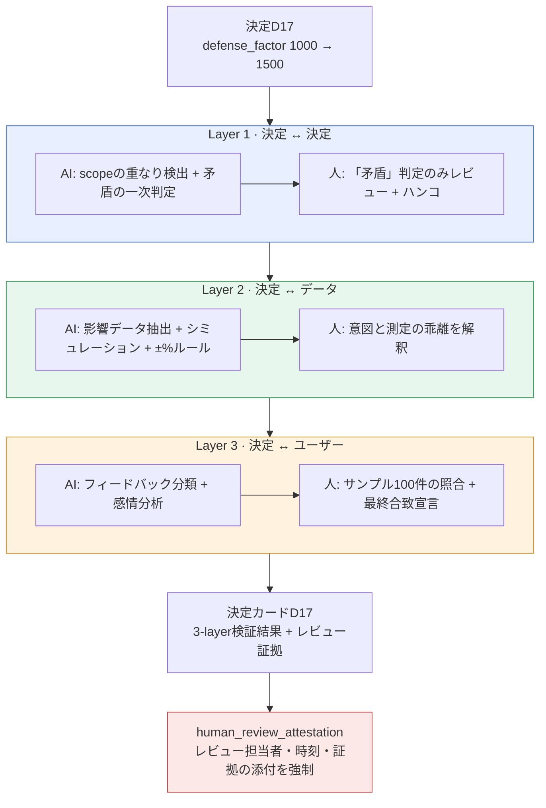

# 10.2 決定検証3-layerセンサー — 人によるレビュー証拠の置き場所

夜11時、nightlyジョブがコラボレーションツールにカードを1枚差し込みました。タイトルは`[integrity] D17 부합 측정 미수행 7일 경과`（D17の合致測定が未実施のまま7日経過）。適用から1週間経った決定が「本当に意図どおり動いたのか」を誰も確認しないままビルドに残っている、という通知でした。データは無事でした。シートの形式も、FKも、enumも通過していました。それでも、決定は検証されていなかったのです。

このギャップが本章の出発点です。データに欠陥がなくても決定は間違いうるのであり、その間違いを捕まえる場所は、データチェックとは別のところにあります。その場所を3つの層に分け、各層でAIがどこまで補助し、人がどこでハンコを押すのかを明示すること — それが決定検証3-layerセンサーです。

---

## 10.2.1 データが通過しても決定は間違う

`check`カスケードは4種類のチェックを一度に回します — doc-audit（文書の一貫性）、data-qa（データ品質）、integrity（完全性）、link（相互参照の切れ）です。この4つが通過すれば「データは無事」という意味です。しかし、無事なデータの上に間違った決定が載ることがあります。

報酬のマスターデータが形式上完璧でも、その数値がインフレを引き起こすなら。FKがユニークでも、2つのクエストが同じ時刻に同じNPCを占有するなら。voiceが一貫していても、2人のキャラクターの関係設定が矛盾するなら — データチェックはすべて通過し、決定はすべて間違っています。データチェックは「欄が埋まっているか」を見ますが、決定チェックは「その値がほかの決定・ほかのデータ・実際のユーザーと噛み合っているか」を見ます。会計にたとえるなら、前者は伝票の様式チェックで、後者は財務諸表の整合性監査です。

だから決定検証には、データ検証とは**分離されたセンサー**を置きます。1つのチェックに束ねると「通過/失敗」の1行に押しつぶされ、失敗したときにデータの問題なのか決定の問題なのか、解釈が曖昧になります。分離すれば責任が明確になります。

---

## 10.2.2 3つの層、3つの時点、3種類のレビュー担当者

3-layerセンサーの核心は、検証の**次元**を3つに分けた点です。各層は、見る対象も、動作する時点も、AIと人の役割分担も異なります。



3つの層すべてで、最後のハンコは人が押します — そのハンコこそが、`human_review_attestation_evidence_mandatory` atomが強制する証拠です。各層が何を見て、誰がどこでハンコを押すのかは、以下で順に見ていきます。

---

## 10.2.3 Layer 1 — AIが絞り込み、人は「矛盾」だけをレビューする

新しい決定が既存の決定とぶつからないかをチェックする層です。決定ペアは決定数の2乗で増えるため、決定が200個なら約2万ペアになります。人が手作業で全部を見ることはできません。そこでAIが一次フィルターを回します。

```python
# decision_conflict_check.py — Layer 1 センサー
def check_new_decision(new_decision, existing_decisions):
    conflicts = []
    for existing in existing_decisions:
        if has_overlap(new_decision.scope, existing.scope):   # 機械的1次: scopeの積集合
            verdict = llm_judge(new_decision, existing)        # AI 2次: 矛盾/補完/無関係
            if verdict.label == "矛盾":
                conflicts.append({
                    "with": existing.id,
                    "label": verdict.label,
                    "reason": verdict.reason,
                    "needs_human_review": True,                # 人によるレビューのフラグ
                })
    return conflicts
```

`has_overlap`は機械的な一次フィルターです。scopeはatom領域（`combat`・`narrative`・`economy`など）なので、積集合の計算は正確です。重ならないペアは即座に捨てます。2万ペアはたいてい数十ペアまで減ります。その数十ペアだけをAIが見ます。

### 完結ワークド・トランスクリプト — Layer 1 矛盾判定

ここでは、実際に何がやり取りされるのかを最後まで見せます。要約せず、曖昧な出力もそのまま残します。

**① 人が送ったプロンプト（全文）**

```
次の2つの決定が矛盾するか判定してください。

[決定A] (2026-03-XX) 戦闘のグローバルクールダウンを0.5秒に全スキル統一
[決定B] (2026-04-XX) 回復系スキルはグローバルクールダウンの適用外とする

判定形式（この形式のみ、他の言葉は禁止）:
- label: 矛盾 | 補完 | 無関係
- reason: 1行
- confidence: 0.0~1.0

推測しないでください。根拠が弱ければconfidenceを下げてください。
```

（プロンプトの内容: 「戦闘のGCDを0.5秒に全スキル統一」という決定Aと、「回復系スキルはGCDの適用外」という決定Bが矛盾するかを、label（矛盾｜補完｜無関係）・reason 1行・confidence 0.0〜1.0の固定形式だけで判定させ、根拠が弱ければconfidenceを下げるよう指示しています。）

**② Claudeの生の出力（加工なし）**

```
- label: 補完
- reason: 決定Bは、決定Aが定めた0.5秒統一ルールに回復系という明示的な例外を追加する構造であり、ルールを覆さずに狭めている。
- confidence: 0.74
```

**③ 人による検証／拒否**

判定は「補完」、confidenceは0.74です。ルール上「補完・無関係」は自動通過ですが、confidenceが0.8未満なら人が1行でも確認することになっています。レビュー担当のチームメンバーAが決定Bの原文を読み直し、ひとつの事実を発見しました — 決定Bには「ただし、回復スキルも固有のクールタイム（クールダウン）1.2秒を持つ」というただし書きが付いていたのです。AIは要約された1行だけを受け取っており、このただし書きを入力として受け取っていませんでした。チームメンバーAはAIの判定を**受け入れつつ補強**として処理し、「AIが見た入力は不完全だった」と記録に残しました。

**④ 再依頼（入力補強後）**

```
[追加の手がかり] 決定Bには「回復スキルはグローバルクールダウンは免除するが、固有クールダウン1.2秒を
持つ」という条件が付いています。この手がかりを含めて再判定してください。
```

```
- label: 補完
- reason: 固有クールダウン1.2秒がグローバルの0.5秒より長く、回復スキルは免除されても
  むしろより長い間隔を持つ。Aの意図（連打防止）と衝突しないため補完が強化される。
- confidence: 0.91
```

判定は「補完」のままですが、根拠が固くなり（固有クールタイム1.2秒はグローバルの0.5秒より長いため、回復スキルは免除されてもむしろ間隔が長くなり、決定Aの意図である連打防止と衝突しない）、confidenceは0.74→0.91に上がりました。チームメンバーAはここでハンコを押しました。核心は結果ではなく**過程の記録**です — AIの一次判定、人が発見した入力の欠落、補強しての再依頼、最終レビュー。この4つの段階が、そのまま決定カードのLayer 1証拠欄に入力されます。

このトランスクリプトの原則はひとつです。**AIの「補完・無関係」判定も無条件には通過させない。** AIが間違っていたのではなく、AIが受け取った情報が不完全だったのであり、それを発見できるのは決定の原文を知っている人です。

チェックの時点は3か所です。新規決定の追加時に即時+alert、pending atomの昇格時にチェックしてから昇格、nightlyで全ペアを再チェックします。

---

## 10.2.4 Layer 2 — AIがほぼすべてをこなし、人は乖離を解釈する

決定がデータにどう反映され、意図と合致しているかを測定する層です。もっとも自動化しやすく、もっとも正確です。シミュレーターとマスターデータがすでにあるなら、検証ルールを載せるだけで済みます。

決定`D17`（defense_factor 1000→1500）を例にとると、センサーが自動で`CombatBalance`シートと自動シミュレーションの結果、影響を受けたキャラクターデータを引き出し、意図（タンクの生存+49%）と測定（シミュレーション+52%）を比較します。合致判定のルールは定量的です。

| 意図に対する測定の差 | 処理 | 誰が |
|---|---|---|
| ±10%以内 | 合致（自動通過） | AI |
| ±10〜25% | alert・再検討 | 人が解釈 |
| ±25%超 | 違反・決定の再検討義務 | 人が決定 |

ここでの人の役割は「AIが合致と言ったから通過」ではありません。**alert区間と違反区間を解釈すること**が人の仕事です。D17のシミュレーションは+52%で±10%以内に収まり自動合致でしたが、同じシミュレーションが副次効果をひとつ吐き出しました — ハイブリッドキャラクター`K_021`が意図の外で+28%強くなったのです。D17の直接の意図ではないため、合致ルールには引っかかりません。ルール上は通過なのに人の目には事故 — この区間を捕まえることが、Layer 2に人が存在する理由です。

この層の自動化率は約95%でもっとも高い水準です。それでも5%が残るのは、まさにこの解釈のためです。数字がルールを通過することと、その数字がゲームにとって正しいことは、別の問いです。

---

## 10.2.5 Layer 3 — AIが分類し、人が最終合致を宣言する

3つの層のうち、もっとも難しい層です。決定が実際のユーザーに意図どおり作用したかを見ます。ビルドリリースの1〜2週間後の実測指標（タンクの平均生存時間、タンクを含む5:5 PvPの勝率）と、自然言語のフィードバック（フォーラム・SNS）を入力として受け取ります。

自然言語のフィードバックが検証の入力になる — これがこの層の特徴です。フォーラム約200件、SNS約1,500件をAIがカテゴリーに分類し、感情を付けます。

```
[AIフィードバック分類 — タンク関連の1週間収集分]
   肯定 62%   否定 23% (「タンクが強くなりすぎ」が多数)   無関係 15%
```

（分類結果の内訳: タンク関連の1週間収集分で、肯定62%・否定23%（「タンクが強くなりすぎ」が多数）・無関係15%。）

ここで止まると罠にはまります。AIの感情分類は、韓国語と英語が混ざると精度が落ちます（「탱커 강해졌다 ㅋㅋ（タンク強くなったww）」が肯定なのか皮肉なのか、判定が揺れます）。そこで運用ルールとして、**四半期ごとに人がサンプル100件を直接分類し、AIの結果と照合します。** 照合で誤差がしきい値以上なら、その四半期の分類は信頼せず、人が全数を再分類します。

最終的な合致宣言は人が行います。D17の場合、実測+44%（シミュレーション予測+52%、誤差8% — 正常範囲）で、フィードバックは肯定優勢でした。AIは「肯定優勢+意図の範囲内」という入力を整理して上げましたが、**合致だとハンコを押したのは人**です。自動化率は約70%、人が30%です。この層だけは、完全自動が原理的に不可能です。ユーザーの言葉の意味を、機械は最後まで判定できないからです。

---

## 10.2.6 人によるレビュー証拠は選択ではなく強制である

3つの層の最後のハンコを人が押すのなら、そのハンコが**実際に押されたという証拠**がなければ、システム全体が崩れます。レビューしたと口で言うだけで実際にはしていないケースを、どう防ぐのか。プロジェクトAでは、atom `human_review_attestation_evidence_mandatory`がこれを強制します。

このatomのルールは単純で、妥協がありません。**決定カードのどの層であれ「AI判定 → 人によるレビュー」が起きたなら、レビュー担当者の識別・レビュー時刻・レビュー証拠（補強メモ、拒否理由、サンプル照合結果のうち最低1つ）がカードに添付されなければならない。証拠が空なら、そのカードは「検証完了」に昇格できない。**

証拠が空なら、`integrity_check_clickup_notify` atomが作動します。整合性の失敗 — ここでは「レビューのハンコはあるのに証拠がない」 — を検知すると、コラボレーションツールに即座にカードを作ります。本章冒頭の夜11時のカードが、まさにこのメカニズムです。

この2つのatomがペアになって「検証の検証」を作ります。3-layerセンサーが決定を検証し、attestation atomがその検証を人が実際に行ったかを検証し、notify atomが証拠の欠落を捕まえて通知します。AIの補助がどれほど広範囲でも、**責任の最後の1マスは、証拠を残した人の名前**で埋められます。

---

## 10.2.7 決定カード — 検証と証拠が1枚に集まる場所

3つの層の結果とレビュー証拠が集まる単位が決定カードです。カード1枚が決定1件の完結単位であり、四半期の振り返りの入力へと流れていきます。以下はD17カードの構造です。

<svg viewBox="0 0 720 430" xmlns="http://www.w3.org/2000/svg" font-family="sans-serif" font-size="13">
  <rect x="10" y="10" width="700" height="410" rx="10" fill="#fafbfc" stroke="#888"/>
  <text x="30" y="40" font-size="16" font-weight="bold">決定カード D17</text>
  <text x="30" y="62" fill="#555">変更: defense_factor 1000 → 1500   ·   適用 2026-03-XX</text>
  <line x1="30" y1="74" x2="690" y2="74" stroke="#ccc"/>

  <rect x="30" y="86" width="660" height="86" rx="6" fill="#e8f0ff" stroke="#4a72c0"/>
  <text x="42" y="106" font-weight="bold" fill="#2a4a90">Layer 1 · 決定の整合</text>
  <text x="42" y="126">✓ 矛盾する決定なし   ·   7つの隣接決定と補完関係</text>
  <text x="42" y="146" fill="#b03a3a">証拠: チームメンバーA, 2026-03-XX 14:20, 入力欠落の補強メモ1件</text>
  <text x="42" y="164" fill="#777" font-size="11">AI 1次判定 → 人によるレビュー (confidence 0.74 → 補強後 0.91)</text>

  <rect x="30" y="180" width="660" height="78" rx="6" fill="#e8f7ed" stroke="#3a9a5a"/>
  <text x="42" y="200" font-weight="bold" fill="#1f6a3a">Layer 2 · データ合致</text>
  <text x="42" y="220">✓ シミュ +52% vs 意図 +49% (合致, ±10%内)</text>
  <text x="42" y="240" fill="#c07a1a">⚠ K_021 ハイブリッドが意図外で +28% — 人の解釈: 後続決定が必要</text>

  <rect x="30" y="266" width="660" height="78" rx="6" fill="#fff3e0" stroke="#d08a2a"/>
  <text x="42" y="286" font-weight="bold" fill="#9a5a10">Layer 3 · ユーザー合致</text>
  <text x="42" y="306">✓ 実測 +44% vs シミュ +52% (誤差 8%, 正常)   ·   フィードバック肯定優勢</text>
  <text x="42" y="326" fill="#b03a3a">証拠: 四半期サンプル100件の人による照合完了, AI分類一致率 88%</text>

  <rect x="30" y="352" width="660" height="52" rx="6" fill="#fde8e8" stroke="#c04a4a"/>
  <text x="42" y="374" font-weight="bold" fill="#a02020">全体: ✓ 合致 (K_021 副作用の後続決定をコラボツールに登録)</text>
  <text x="42" y="394" fill="#777" font-size="11">attestation検証: 3層すべてレビュー証拠の添付を確認 → カード昇格を許可</text>
</svg>

赤い行が核心です。各層の「증거:」（証拠）行が空なら、attestation atomがカードの昇格を止め、notify atomがコラボレーションツールに知らせます。6か月後に誰かが「なぜdefense_factorを1500にしたのか」と尋ねたら、このカード1枚が意図・測定・実測・レビュー担当者まで全部答えてくれます。決定カードは、第18部の意思決定追跡atomと同じメタデータの流れの上で動作します。

---

## 10.2.8 自動化率と導入順序

3つの層は自動化の度合いが異なります（それぞれ約80%・95%・70%、前の節で見たとおりです）。3つとも部分自動であり、最後のハンコは3つとも人が押しますが、人の作業量は全体として80%以上減ります。

導入はLayer 2からです。シミュレーションとマスターデータがすでにあるなら、検証ルールを追加するだけで済むため、1〜2か月で効果が出ます。次にLayer 1（インフラは少ないのに効果が大きい、追加1か月）、最後にLayer 3（インフラがもっとも大きく効果も大きい、追加2〜3か月）です。Layer 3を最初から付けようとして座礁するのが、よくある失敗です。

> **数値表記について**: 上の自動化率と下の効果比率は、著者のプロジェクトの運用観察に基づく**著者の推定（未検証）**です。精密な測定値ではなく、方向とおおよその比率として読んでください。合致ルールの±10%/±25%のしきい値は実際の運用ルールであり、atom名（`integrity_check_clickup_notify`、`human_review_attestation_evidence_mandatory`）は実在のatomです。

導入前後の変化を方向として整理するとこうなります。四半期あたりの決定矛盾事故は数件からほぼ0件に、決定後1週間の合致測定の実施率は一部から大半に、事故発生前の副作用発見率は半分未満から大半に上がりました。もっとも意味のある変化はトレーサビリティです — かなり時間が経ったあとでも決定の背景をたどれる比率が、少数からほぼすべてに変わりました。決定カードが、ゲームの決定の歴史を保存するからです。

---

## 10.2.9 よくある失敗

| パターン | 処方 |
|---|---|
| Layer 1だけ運用する（矛盾チェックのみ） | Layer 2・3を追加して次元を埋める |
| Layer 3を最初から導入する | Layer 2から、インフラが小さい順に |
| AIの「補完・無関係」判定を無批判に受け入れる | confidenceのしきい値+人によるサンプルレビュー |
| レビューのハンコだけ押して証拠を添付しない | attestation atomが昇格を遮断する |
| 証拠欠落の通知を無視する | notify atomのコラボレーションツールカードを未完了として扱う |
| ユーザーフィードバックのAI分類を盲信する | 四半期ごとにサンプル100件を人が照合する |

---

### 本章のポイント

- データの完全性と決定の整合性は別のセンサーです。1つのチェックに束ねると、失敗の解釈が曖昧になります。
- 3つの層すべてでAIが補助しますが、最後のハンコは人が押します。次元が違うだけで、原則は同じです。
- レビュー証拠が空なら、カードは昇格できません。attestation atomが「検証の検証」を行います。

---

### やってみよう — 一人ミニ版

**setup.** 決定ログを1つのファイルに集めてみましょう（決定id・scope・意図・適用日）。scopeは`combat`・`narrative`・`economy`のようにenumで固定します。シミュレーションがなければ、Layer 2は「関連するマスターデータの手動比較」から始めても構いません。

**prompt.** 新しい決定が生まれるたびに、既存の決定と1ペアずつAIに尋ねてみましょう。形式は固定します（プロンプトの内容: 2つの決定が矛盾するかを、label（矛盾｜補完｜無関係）・reason 1行・confidence 0.0〜1.0だけで出力させ、推測を禁じ、根拠が弱ければconfidenceを下げさせる指示です）。
```
次の2つの決定が矛盾するか判定してください。
[決定A] ...
[決定B] ...
形式のみ出力: label(矛盾|補完|無関係) / reason 1行 / confidence 0.0~1.0
推測禁止。根拠が弱ければconfidenceを下げる。
```

**verify.** 「矛盾」判定とconfidence 0.8未満の判定は、人が決定の原文を読み直して確認しましょう。確認したら、決定カードに**レビュー担当者の名前・時刻・メモ（補強/拒否/照合のいずれか）**を必ず残します。証拠欄が空なら、そのカードを「検証完了」に上げてはいけません — この1行がattestation atomの一人バージョンです。一人運用でも、6か月後の自分のために証拠を残しましょう。
