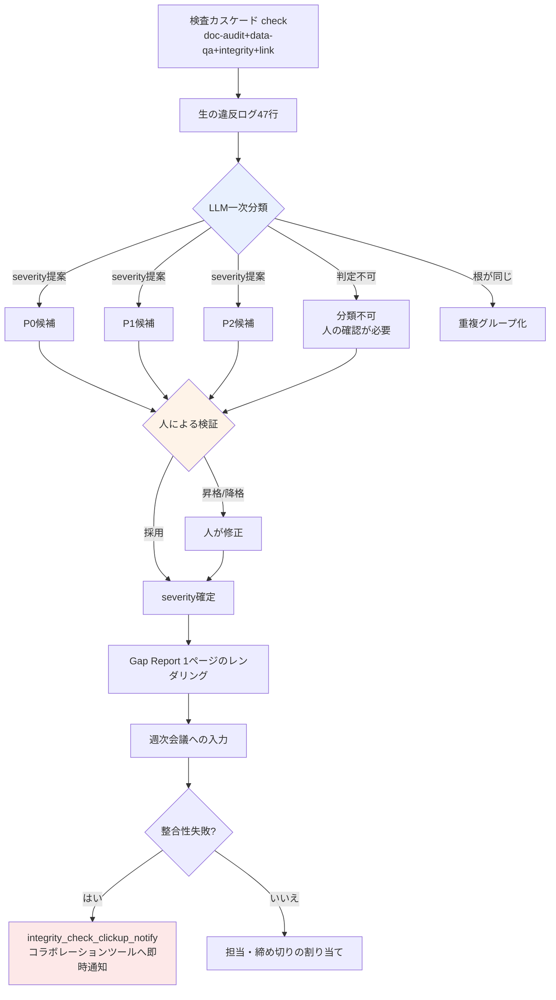

# 10.3 アルファGap Report — ギャップを自然言語で分類し、人が優先順位を付ける

月曜の朝9時12分。アルファビルドが上がったばかりの週の、最初の検査カスケードが終わりました。`check`が4種（doc-audit・data-qa・integrity・link、10.2）を一度に回して止まったとき、コンソールに表示された数字はこうでした。**違反候補47件。**そのうちP0が何件で、何から見るべきで、誰が手を入れるべきなのかは、その47行のどこにも書かれていませんでした。

チェッカーは「間違っている」という事実しか知りません。「これはリリースを止めるのか、来週見ても良いのか」は判断できません。アルファ終盤の本当のボトルネックは、チェッカーが足りないことではなく、チェッカーが吐き出した47行を人が分類しているうちに午前が丸ごと消えてしまうことにありました。本章はその47行をLLMが自然言語で分類し、人がその分類を受けて優先順位を付ける一回のワークド・サイクルを、丸ごと書き写します。

---

## 10.3.1 検査結果は決定ではない

10.1で検証atomを30種余り作り、10.2で決定を3-layerセンサーでふるいにかける構造を立てました。この2つの章が作り出したのは**ログ**です。ログは決定ではありません。ログと決定の間には、人が手作業で埋めていたギャップがあります。

<svg viewBox="0 0 720 230" xmlns="http://www.w3.org/2000/svg" font-family="sans-serif">
  <rect x="20" y="40" width="150" height="60" rx="6" fill="#e8f0fe" stroke="#46a" stroke-width="1.5"/>
  <text x="95" y="65" text-anchor="middle" font-size="13" font-weight="bold">検査 cascade</text>
  <text x="95" y="84" text-anchor="middle" font-size="11" fill="#555">自動 · 47行ログ</text>

  <rect x="285" y="40" width="150" height="60" rx="6" fill="#fef3e8" stroke="#d80" stroke-width="1.5"/>
  <text x="360" y="60" text-anchor="middle" font-size="13" font-weight="bold">ギャップ</text>
  <text x="360" y="78" text-anchor="middle" font-size="11" fill="#a00">人が手作業で</text>
  <text x="360" y="93" text-anchor="middle" font-size="11" fill="#a00">分類・優先順位</text>

  <rect x="550" y="40" width="150" height="60" rx="6" fill="#e8fce8" stroke="#4a6" stroke-width="1.5"/>
  <text x="625" y="65" text-anchor="middle" font-size="13" font-weight="bold">週次決定</text>
  <text x="625" y="84" text-anchor="middle" font-size="11" fill="#555">担当・締め切り・ゲート</text>

  <line x1="170" y1="70" x2="283" y2="70" stroke="#888" stroke-width="2" marker-end="url(#ar)"/>
  <line x1="435" y1="70" x2="548" y2="70" stroke="#888" stroke-width="2" marker-end="url(#ar)"/>

  <text x="360" y="150" text-anchor="middle" font-size="12" fill="#a00" font-weight="bold">← このギャップで午前が消える</text>
  <text x="360" y="180" text-anchor="middle" font-size="12" fill="#2a6">Gap Report = LLMが分類、人が優先順位</text>

  <defs>
    <marker id="ar" markerWidth="8" markerHeight="8" refX="6" refY="3" orient="auto">
      <path d="M0,0 L6,3 L0,6 Z" fill="#888"/>
    </marker>
  </defs>
</svg>

アルファ終盤にこのギャップが高くつく理由は単純です。チェッカーは1時間に数十回回りますが、人が47行を読んで「q_142は行き止まりだからリリースブロック、voice_lint 412はライターの判定待ち」と分類する作業は、毎回ゼロからやり直しになります。その分類労働を自然言語モデルに渡すことが、Gap Reportの出発点です。

---

## 10.3.2 ワークド・トランスクリプト — 47行をLLMに渡す

以下はその月曜の朝、検査カスケードの生ログをClaudeにそのまま貼り付けて分類を依頼した、実際のセッションです。要約せずに書き写します。モデルが読み違えた箇所と、人が拒否した箇所もそのまま残します。これが本章の背骨です。

### ① プロンプト（全文）

````text
以下はアルファビルドの週次検査cascade(doc-audit/data-qa/integrity/link)が合わせて吐いた違反候補だ。週次会議で使えるように分類してくれ。
各項目をP0(リリースブロック)/P1(検討)/P2(観察)に分類して根拠を一行ずつ — 推測なら「推定」と書いて。severityは君が断定せず『提案』だけにして、確定は私がする。
同じ根から出たものはまとめて、担当分野(レベル/ナラティブ/バランス/UI/データ)も推薦してくれ。判定できないものは正直に「分類不可、人の確認が必要」として外してくれ。

[生ログ]
INTEGRITY  q_142    quest_graph: node 'end_021' has no outgoing edge (dead-end), zone=dungeon_021
INTEGRITY  q_158    quest_graph: reward node references item_id 'it_9920' not in item table
DATA-QA    reward_curve  dungeon_017 reward_exp delta +35.2% vs sibling median (threshold 25%)
DATA-QA    reward_curve  dungeon_017 reward_gold delta +31.0% vs sibling median
DOC-AUDIT  voice_lint    dialogue_id_412 contains banned term (refgame slang leak)
DOC-AUDIT  voice_lint    dialogue_id_511 tone drift: formality score 0.31 (npc 'elder' expects >0.7)
DOC-AUDIT  voice_lint    dialogue_id_512 tone drift: formality score 0.29
DOC-AUDIT  voice_lint    dialogue_id_513 tone drift: formality score 0.33
DATA-QA    loc_overflow  ui_btn_enhance EN string 24 chars > slot 18 (overflow 6)
DATA-QA    loc_overflow  ui_btn_enhance TH string overflow 11
LINK       doc_link      gdd_dungeon_021.md -> [reward_table] target moved (404)
INTEGRITY  k_skill       skill 'k_017_charge' cooldown 0.0 (suspicious, min expected 0.5)
... (計47行、以下同形パターン — 省略なしで添付済み)
````

### ② Claudeの生の出力（要約・整理なし）

````text
生ログを分類しました。severityは私の「提案」であり、最終確定は人が行う必要があります。

## P0候補 (リリースブロックの可能性 — 人の確定が必要)

1. [q_142] quest_graph dead-end (dungeon_021)
   根拠: 出口エッジのない終了ノード → プレイヤーがクエスト進行中に閉じ込められる。
   行き止まりは進行不能のためP0候補。(確定根拠が明確)
   担当推薦: レベル/ナラティブ

2. [q_158] reward nodeが存在しないitem_id 'it_9920'を参照
   根拠: 報酬付与時にNULL参照 → クラッシュまたは報酬未付与の可能性。
   P0候補。ただし、item_idがまだ未入力状態(作業中)の可能性もあり
   「データ未完成」か「誤記」かは人の確認が必要。
   担当推薦: データ

3. [voice_lint dialogue_id_412] 禁止用語(refgame用語の流出)
   根拠: 他ゲームの固有用語がセリフに残っていると法的・ブランドリスク。
   P0候補。(禁止用語は通常無条件でブロック)
   担当推薦: ナラティブ

## P1候補 (検討後に決定)

4. [reward_curve dungeon_017] exp +35.2% / gold +31.0% (両方とも兄弟中央値を超過)
   ※ 2行を1件にまとめ — 同じダンジョンの報酬曲線の異常。
   根拠: 閾値(25%)超過だが「意図された高難度ダンジョンボーナス」の可能性あり。
   バランス上の意図かミスかはデータだけでは判定不可 → P1。
   担当推薦: バランス

5. [voice_lint 511・512・513] tone drift 3件 (formality 0.29~0.33, elder NPCは>0.7を期待)
   ※ 3行を1件にまとめ — 同じNPC 'elder'の連続セリフのトーン逸脱。
   根拠: 同じNPCが連続でタメ口調に落ちたパターン → 一人のライターの
   1セッションの作業物である可能性。個別ではなくまとめて検討を推奨。
   推定: 意図されたキャラクター変化(怒りの場面など)の可能性もありライター判定待ち。P1。
   担当推薦: ナラティブ

6. [loc_overflow ui_btn_enhance] EN 6字 / TH 11字超過
   ※ 2行で1件。同じボタンの多言語オーバーフロー。
   根拠: 切れはUX損傷だがクラッシュではない。スロット拡張or短縮翻訳が必要。P1。
   担当推薦: UI

## P2候補 (観察)

7. [doc_link gdd_dungeon_021.md -> reward_table 404]
   根拠: 文書内部リンク切れ。ゲームビルドには影響なし、文書整合性の問題。P2。
   担当推薦: データ(文書所有者)

## 分類不可 — 人の確認が必要

8. [k_017_charge cooldown 0.0]
   根拠: クールダウン0.0が「意図されたパッシブ性スキル」か「入力漏れ」か
   スキル設計の意図が分からなければ判定不可。integrityチェッカーは0.5未満を
   疑いましたが、私はこのスキルの設計意図を知りません。
   → バランス担当が直接確認する必要があります。

(残り39行も上の7パターンのいずれかに分類 — 本回答では代表のみ展開)
````

### ③ 人による検証と拒否（書き写したまま）

ここからが核心です。LLMの分類をそのまま採用したわけではありません。著者が会議の前に直接レビューし、赤ペンを入れた部分です。

- **2番のq_158を、P0候補→P0確定に引き上げました。**モデルは「データ未完成かもしれない」とためらいましたが、確認してみると`it_9920`は2週間前に削除されたアイテムでした。未完成ではなく、参照切れ。リリースブロック確定です。
- **3番のvoice_lint 412は、P0からP1に下げました。**モデルは「禁止用語は無条件でブロック」と断定しましたが、該当のセリフはNPCが意図的に古い言い回しを引用する場面でした。禁止用語辞書に例外ケースを追加することで対応。**モデルが文脈を知らないままルールだけを適用した、典型的なミスです。**
- **5番のトーンドリフトのグループ化は受け入れました。**「同じライターの1セッションの作業物」というグルーピング仮説が正確でした。ライター1人に3件をまとめて渡すのが正解でした。
- **8番のcooldown 0.0は、モデルの「分類不可」という判断をそのまま認めました。**分からないことを分かると言い張らなかった点は良かったです。バランス担当へメンション。

モデルが7つのグループに圧縮したこと自体は大きな成果でした。47行を人がゼロから分類していたら、午前が消えていたはずです。しかし**P0候補3件のうち1件（412）を人が降格させ、P1候補1件（158）を人が昇格させました。**分類の60%は正しく、高くつく30%は人が直しました。この比率がまさに「LLMは加工、決定は人」の境界線です。

### ④ 再依頼 — 人が直した結果を再びモデルへ

````text
よし。君の分類のうち2つを私が変えた。
- q_158: P0確定 (it_9920は削除されたアイテム、参照切れ)
- voice_lint_412: P1へ降格 (意図された古い言い回しの引用、禁止用語辞書に例外追加)
この2つを反映して週次会議用の1ページGap Reportをマークダウンでレンダリングしてくれ。要約→P0→P1→P2→推移の順で。
推移の数字は私が渡す — 先週P0 5件、P1 22件、偽陽性12%。
````

モデルはこの入力を受けて、下記§レポート様式の1ページをそのまま出力しました。人が直した2行が正確に反映され、推移の数字は人が渡した値をそのまま使いました（でっち上げませんでした）。この往復が、Gap Report 1枚ができ上がるすべてです。

---

## 10.3.3 Gap分類フロー — 自動と人の境界

上のトランスクリプトをフローに整理するとこうなります。重要な分岐点がすべて人の側にある、という点が核心です。



LLMが触るボックスは青色の1つだけです。オレンジ色（人による検証）ですべてのseverityが確定し、赤色では整合性の失敗がコラボレーションツールへ即時に飛びます。検査・判定・確定はすべて人とatomの持ち分で、モデルは最初の分類一回だけを受け持ちます。

---

## 10.3.4 整合性が壊れたら会議を待たない

分類フローの末尾には`integrity_check_clickup_notify` atom（10.1）が付いています。このatomはレポートを作る段階とは別に、**整合性検査が失敗した瞬間、会議を待たずにコラボレーションツールへカードを投げます。**Gap Reportが週次のリズムだとすれば、このatomはそのリズムを破って入ってくる割り込みです。

q_158（削除されたアイテムへの参照）のように、ビルド自体を壊しかねない違反は月曜の会議まで待てません。カスケードがそれを捕まえた瞬間、コラボレーションツールに「P0疑い: q_158 参照切れ」が自動生成され、データ担当に割り当てられます。Gap Reportはその割り込みを1週間単位で集め直し、推移として見せる後ろの盤面です。2つの層が一緒に回ってこそ、「急ぎは即時、全体像は週次」という2拍子が噛み合います。

---

## 10.3.5 人によるレビューの証拠を残す

LLMの分類を人が検証したという事実は、**口頭のままでは蒸発します。**そのためレビューの段階には`human_review_attestation_evidence_mandatory` atom（10.2）が掛かっています — 人によるレビューには証拠が必須です。

上のトランスクリプト③の段階 — 412を降格し、158を昇格させたあの判断 — は、レポートのフッターにレビュアーID・タイムスタンプと「変更した項目」のリストとして記入されます。次の四半期に誰かが「なぜ412がリリースに含まれたのか」と尋ねたら、「2026-W21のレビューで、意図された古い言い回しの引用と判定。禁止用語辞書に例外を追加」という記録が答えます。これがなければ、LLMの分類は、検証されたことのない自動出力と区別がつきません。

---

## 10.3.6 レポート様式 — 1ページを超えない

再依頼④の結果としてモデルがレンダリングした1ページは、こういう形です。上のトランスクリプトの分類がそのまま流れ込んでいます。

```markdown
# Alpha Gap Report — 2026-W21

## 要約
- 検査cascade 47件の違反候補 → 7グループに分類
- P0確定3件 / P1 4件 / P2 1件 / 分類不可1件
- リリースブロック: q_142(行き止まり), q_158(参照切れ)
- 人のレビューによる変更: voice_412 降格(P0→P1), q_158 昇格(P1→P0)

## P0 — 即時対応 (人が確定)
| ID | 違反 | 分野 | 備考 |
|---|---|---|---|
| q_142 | dungeon_021 行き止まり | レベル/ナラティブ | LLM・人が一致 |
| q_158 | 削除されたit_9920への参照 | データ | 人が昇格 |

## P1 — 検討後に決定
- reward_curve dungeon_017: exp+35%/gold+31% (バランス, 意図確認待ち)
- voice 511・512・513: elder トーン逸脱3件まとめ (ナラティブ, ライター判定)
- voice_412: 古い言い回しの引用 (ナラティブ, 禁止用語例外処理済み)
- loc_overflow ui_btn_enhance: EN/TH 切れ (UI)

## P2 — 観察
- doc_link 404 (文書整合, ビルド影響なし)

## 分類不可 — 人の確認が必要
- k_017_charge cooldown 0.0 (バランス, 設計意図不明)

## 推移 (先週比)
- P0: 3件 (先週5件)
- P1: 4グループ (先週22件 — グループ分類でカウント方式を変更)
- 偽陽性: 人の修正2/8 = 25% (先週12%, ↑ — グループ化後に標本が縮小)

---
レビュー: 이민수 / 2026-W21 / 変更2件 (証拠: §レビューログ)
```

推移の偽陽性比率が25%に**上がった**ことを隠していない点に注目してください。標本が8個に小さくなり、人が2個を直したので、算術的に25%です。レポートは、良く見せるために数字を作りません。先週の12%と単純比較すれば悪化に見えますが、分類方式がグループ単位に変わって標本が変わったという文脈が、一行で添えられています。1週間の比率だけで結論を出さないという原則が、ここで働いています。

---

## 10.3.7 測定 — 分類労働はどこへ行ったのか

著者のプロジェクトAで、Gap Reportのワークド分類を導入する前後を比較します。以下の数値のうち処理比率・時間は議事録とコラボレーションツールのタイムスタンプから取った実測で、チェッカーの偽陽性率は標本が週ごとに揺れるため**方向だけ**を記します。

| 項目 | 導入前 | 導入後 | 根拠 |
|---|---|---|---|
| 47行の一次分類の所要 | 人が約40分 | LLM 1回+人のレビュー約12分 | 会議前の作業ログ（実測） |
| 検査結果→決定への反映 | 一部のみ | 大部分 | 議事録との対照（実測、正確な%は未集計） |
| P0の平均解消時間 | 3〜5日 | 1〜2日 | コラボレーションツールのカード作成→完了タイムスタンプ（実測） |
| LLM分類の人による修正率 | — | W21基準2/8 | 著者の推定（未検証、週ごとに変動） |
| 整合性失敗の認知遅延 | 会議まで待機 | 即時（atomが通知） | clickup_notify導入の効果（方向） |

修正率2/8を自慢のように書かなかった理由があります。それは1週間の標本に過ぎず、ある週にはモデルが5件を読み違えます。**確実な利得は分類労働が40分から12分に減ったことであり、モデル分類の正確度そのものは毎週揺れます** — モデルを信頼しているからではなく、人が12分以内に検証できる形に加工してくれるからこそ速くなったのです。

---

## 10.3.8 よくある失敗

| パターン | 処方箋 |
|---|---|
| 47行を人が毎回手作業で分類 | LLMの一次分類→人の検証へ分業 |
| LLMのseverityをそのまま確定 | severityは「提案」、確定は人（③の段階） |
| 根が同じ違反を個別にカウント | グループ化の依頼をプロンプトに明記 |
| レビューの事実が口頭でしか残らない | human_review_attestation atomで証拠を強制 |
| 急ぎの整合性失敗が会議まで待機 | clickup_notify atomで即時通知 |
| 推移の数字をモデルがでっち上げる | 推移は人が入力、モデルはレンダリングのみ（④の段階） |
| レポートが長くなり会議で読まれない | 1ページを強制、元のログは別途保存 |

---

## 本章のポイント

- **チェッカーは間違いを知っていますが、何から手を付けるべきかは知りません — その分類をLLMに渡し、人が優先順位を付けます。**
- **LLMのseverityは提案に過ぎず、P0を降格・昇格させる確定は、人によるレビューの証拠としてのみ残ります。**
- **急ぎの整合性失敗はatomが即時に通知し、全体像は週次のGap Reportが推移として映します。**

---

## やってみよう

**setup**
1. 検査カスケード（または手元のlint・整合性チェッカーの集まり）の出力を、1つのファイルに集めましょう。
2. severity基準の3段階（P0ブロック / P1検討 / P2観察）を、チームで一行ずつ合意しておきます。
3. レビュアーID・タイムスタンプをレポートのフッターに記入するテンプレートを作ります。

**prompt**
````text
以下は週次検査の出力だ。週次会議用に分類してくれ。severity(P0/P1/P2)は根拠を一行添えて『提案』だけにして(推測なら「推定」)、確定は私がする。同じ根の違反はまとめ、担当分野(名前ではなく)も推薦してくれ。判定できないものは正直に「分類不可」として外してくれ。
[生ログ貼り付け]
````

**verify**
1. P0候補の全件を人が1件ずつ検証し、降格/昇格を記録しましょう（③の段階）。
2. モデルがまとめた項目が本当に根が同じか、1つだけ逆にたどって確認しましょう。
3. 推移の数字が人の手から出た値か（モデルが勝手に埋めていないか）を、フッターで確認しましょう。

### 一人ミニ版

一人で作業しているなら、atom・コラボレーションツール・週次会議はなくても構いません。チェッカーの出力をテキストで貼り付けて上のプロンプトで分類だけ受け取り、P0候補3件だけを自分の目で検証して、その場で処理しましょう。分類をモデルに任せ、**検証する項目をP0だけに絞ること** — その一点が、一人規模で最も大きく時間を節約します。レポートの1ページは、Notionのメモ1枚で代替しても構いません。
