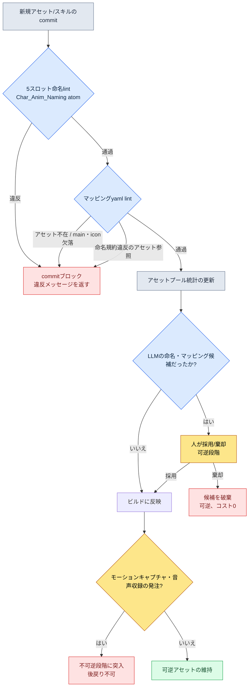

# 11.1 命名規約とスキル・アートのマッピング

スプリント締め切りの2日前、戦闘アーティストが社内メッセンジャーに短い動画を1本投げてきました。新規武人クラスの3段コンボです。1段目と2段目は刃風がうなっているのに、3段目では何の音もしませんでした。無音。本人はサウンドをすべて付けたと言い、サウンド担当はファイルをすべて渡したと言いました。どちらも嘘をついているわけではありませんでした。サウンドファイルは確かにリポジトリにありました。`combo3_swing_final_real.wav`という名前で。ゲームコードが探していた名前は`sfx_K012_combo3_swing.wav`でした。一文字も重なっていません。

この無音事故の追跡に、その日の午後が丸ごと消えました。クリップ1つ、サウンド1つの問題ではありません。名前を人が自由に付けられる限り、この種の事故は四半期ごとに数十件ずつ生まれ直します。本章は、その自由をルールに変える話です。

> **本章で答える質問**
> - アセット1万個の規模では、なぜ名前が自由ではなくルールなのか
> - 命名規約をatomとして強制し、lintで自動検証すると、何が閉じられるのか
> - スキル1つに付くアニメ・VFX・サウンド・アイコンのマッピングをAIがドラフトし、人が採用するワークド・トランスクリプト

> **専門外の読者のための一行。** アセット1万個やfbxファイル名の書式は、ゲームだけの事情に見えます。しかし、持ち帰っていただきたいただ一つのことは、ドメインを選びません — **「名前を自由に付けた瞬間、検索・自動化・連携がまとめて閉ざされる」**。規模が大きくなれば命名は好みではなくルールにならなければならず、ルールになった名前だけをコードが自動で見つけて使えるという原則は、文書・資産・顧客レコードを扱うどんな仕事にも当てはまります。

---

## 11.1.1 アセット1万個という規模

著者がディレクションするプロジェクトAは、モバイルファーストのMMORPGです。キャラクターアニメーションアセットのおおよその規模は以下のとおりです。プレイヤークラス数と敵NPCの種類は実際の運用数値で、クリップ数と全体の推定値は著者の推定（未検証）です。

| アセット | 数 |
|---|---|
| プレイヤーキャラクターのクラス | 6 |
| 敵NPCの種類 | 80〜100 |
| キャラクター1体あたりの平均クリップ | 100〜150（著者の推定） |
| 全体クリップの推定 | 約10,000〜15,000（著者の推定） |

1万個。これは引き出し1万個と同じです。ラベルの付いていない引き出し1万個を前に「攻撃モーションはどこだったか」を探すのは、人の記憶力に賭けをする行為です。そしてその賭けは必ず負けます。見つからなければ、結果は二つに一つです。作業時間が2倍に延びるか、見つからなかったので同じ動作を新しく作るかです。後者のほうがたちが悪いです。アセットが肥大化するうえに、後から同じ動作が2つ、微妙に違う形で転がり回ることになるからです。

名前が自由領域である場合、閉ざされるのは検索だけではありません。「スキルIDからアニメーションファイルをコードが自動で見つけてくる」自動ルーティングも一緒に閉ざされます。名前から規則を読み取れなければ、コードはスキル一つひとつについてどのファイルを使うかを手で書いたマッピングテーブルを抱えていなければなりません。そのテーブルは、新規キャラクターが入ってくるたびに手作業で増えていきます。

---

## 11.1.2 5スロット命名書式 — atomとして固定化する

プロジェクトAのアニメーションファイル名は、5つのスロットに固定されています。

```
<role>_<id>_<category>_<action>_<variant>.fbx

char_K001_idle_default_v1.fbx
char_K001_locomotion_walk_forward.fbx
char_K001_combat_attack_combo1_v2.fbx
char_K001_react_hit_heavy.fbx
enemy_E021_combat_skill_aoe_v1.fbx
```

5つのスロットはすべて、定められたenumに従います。自由入力が許されるスロットは`id`の一つだけで、そのスロットさえ`[A-Z]\d{3}`形式で縛られます。

| スロット | enum数 | 例 |
|---|---|---|
| role | 4 | char, enemy, pet, mount |
| id | 形式固定 | K001, E021, P003, M005 |
| category | 8 | idle, locomotion, combat, react, death, social, cinematic, system |
| action | カテゴリー別10〜30 | walk, run, attack, skill_aoe, hit_heavy |
| variant | 形式固定 | default, v1, v2, _short, _long |

ここでの核心は書式そのものではなく、書式をどこに記録しておくかです。命名規約をWiki文書の1ページに書いておくだけなら、それは誰も読まないラベルです。著者はこの規約を`Char_Anim_Naming_Convention`という、信頼できる唯一の情報源（single source of truth）となるatomにし、人もlintもLLMもすべてこのatom一つだけを参照するようにしました。書式が文書ではなくatomとして固定化された瞬間、命名は「推奨事項」から「通過しなければならない関門」へと性格が変わります。

`action`スロットのenumは無限に増えうるというのが弱点です。そこで、カテゴリー別の標準actionを辞書として管理します。

```yaml
combat:
  - attack_basic
  - attack_combo1
  - attack_combo2
  - skill_<skill_id>
  - parry
  - dodge_forward
  - dodge_back
react:
  - hit_light
  - hit_heavy
  - knockback
  - stagger
  - stun
locomotion:
  - idle
  - walk_forward
  - run_forward
  - sprint
  - jump_start
  - jump_loop
  - jump_land
```

新規actionを辞書に入れるかどうかは、手続きで判断します。四半期あたり3キャラクター以上が使いうるか、既存のactionでは本当に表現できないか、カテゴリーが明確か、そして最も重要なこととして — variantで吸収できるのではないか、です。variantで処理できるならactionは増やしません。action辞書が100個以内に保たれていれば、運用が健全であるサインです。ただし、これを絶対の上限として受け取りはしません。新規ジャンルや新規クラスが入ってくれば、一度に30〜40個増えることもあります。防ぐべきは数字ではなく、無秩序な増殖です。

---

## 11.1.3 lintがcommitを止める

書式をatomに記録したら、次はそのatomを自動で強制する検証器が必要です。人が毎回目視で5つのスロットを検査するわけにはいきません。以下がそのlintの背骨です。

```python
# anim_naming_lint.py
import re, yaml

NAMING_PATTERN = re.compile(
    r"^(?P<role>char|enemy|pet|mount)_"
    r"(?P<id>[A-Z]\d{3})_"
    r"(?P<category>idle|locomotion|combat|react|death|social|cinematic|system)_"
    r"(?P<action>[a-z_]+?)"
    r"(?:_(?P<variant>v\d+|short|long|light|heavy|left|right|forward|back))?"
    r"\.fbx$"
)

ACTION_DICT = yaml.safe_load(open("char_anim_naming_convention.yaml"))

def check(filename):
    m = NAMING_PATTERN.match(filename)
    if not m:
        return f"命名規則違反(5スロット形式不一致): {filename}"

    category, action = m.group("category"), m.group("action")
    # skill_<id> 形式は動的actionなのでprefixのみ検査
    base = "skill" if action.startswith("skill_") else action
    if base not in ACTION_DICT.get(category, []):
        return f"action enum外({category}): {action}"

    return None
```

新しいfbxがリポジトリに入った瞬間、この検査が走ります。違反ならcommitがブロックされます。ここで重要なのは、違反を人の責任にしないという点です。無音事故を起こしたアーティストを責める代わりに、「その名前はそもそもcommitできてはいけなかった」という方向へ、責任を道具に押し付けます。人はミスをし、道具はそのミスを防ぐ。これが命名システムの基本姿勢です。

命名が強制されると、その見返りとして自動ルーティングが解放されます。

```python
def play_skill_animation(character, skill_id):
    anim_path = f"char_{character.id}_combat_skill_{skill_id}.fbx"
    if not exists(anim_path):
        anim_path = f"char_{character.id}_combat_skill_default.fbx"  # fallback
    play(anim_path)
```

手で書いたマッピングテーブルが消えます。新規キャラクターや新規スキルが入ってきても、アニメファイルを規約どおりに追加するだけで、コードは1行も変わりません。無音事故に戻ってみると、もしあのサウンドファイルが`sfx_K012_combo3_swing.wav`という規約名でしか入れなかったとしたら — そもそも`combo3_swing_final_real.wav`はcommit段階ではじかれていたはずで、あの日の午後は丸ごと生き残っていたはずです。

variantスロットは、action enumを守る安全弁です。同じ動作のバージョン（v1、v2）、長さ（_short、_long）、強度（_light、_heavy）、方向（_forward、_back）はすべてvariantで吸収し、actionを細かく分岐させる代わりに受け止めます。そしてゲームコードは、そのvariantをコンテキストに応じて選んで使えます。

```python
def select_variant(base_action, context):
    if context.distance < 3:
        return f"{base_action}_short"
    if context.distance > 10:
        return f"{base_action}_long"
    return base_action
```

命名規約がコードの分岐点になるわけです。

---

## 11.1.4 スキル1つにアセット10個 — マッピングyaml

命名がL1だとすれば、スキルとアセットをつなぐマッピングはL2です。スキル1個は通常、アニメーション2〜3個、VFX1〜3個、サウンド2〜5個、UIアイコン1個を引き連れています。平均してアセット10個。スキルが200個なら、マッピング対象は約2,000個です。この規模を人の頭で管理するのは不可能です。そこでスキル1つにつきyamlを1枚置き、そのスキルのアセットはその1枚からだけ読むように縛ります。

```yaml
---
skill_id: skill_K001_combo1
description: K001 コンボ1 (3打連続)
type: melee_combo
animations:
  - clip: char_K001_combat_attack_combo1_v2.fbx
    role: main
    bone_alignment: spine_03
vfx:
  - asset: vfx_K001_combo1_slash.vfx
    socket: weapon_tip
    timing_ms: [0, 150, 300]
  - asset: vfx_hit_blood_light.vfx
    socket: target
    timing_ms: [150]
sound:
  - asset: sfx_K001_combo1_swing.wav
    volume: 0.8
    timing_ms: 0
  - asset: sfx_hit_metal_light.wav
    volume: 0.6
    timing_ms: 150
ui_icon: icon_skill_K001_combo1.png
ui_tooltip_key: skill_K001_combo1_tooltip
verified: true
---
```

この1枚が、スキル1つのアセット全体です。そしてこのyaml内のすべてのアセットパスは、11.1の5スロット規約に従います。命名lintが崩れれば、このマッピングも一緒に崩れます。2つの層はペアで動作します。

マッピングが1か所に集まると、影響追跡が自動で解放されます。あるVFXを作り直そうとするとき、それがどのスキルに影響するのかを手で探し回る必要がありません。

```python
def find_skills_using(asset):
    affected = []
    for path in glob("skills/*.yaml"):
        skill = yaml.safe_load(open(path))
        for cat in ("vfx", "sound", "animations"):
            for entry in skill.get(cat, []):
                if entry.get("asset") == asset or entry.get("clip") == asset:
                    affected.append(skill["skill_id"])
    return affected

# find_skills_using("vfx_hit_blood_light.vfx")
# → ["skill_K001_combo1", "skill_K005_combo2", "skill_E021_attack_basic", ...]
```

アセット差し替えの会議に、影響を受けるスキルの一覧が自動で添付されます。「これを変えたらどこに影響しますか？」という質問が出る前に、答えがすでに議事録の横に置かれています。

マッピングにもlintが付きます。すべてのアセットファイルが実際に存在するか、animations.mainとui_iconがそれぞれ1つずつあるか、timing_msがアニメーションの長さの範囲内にあるか、そして — すべてのアセットパスが11.1の命名規約を通過するか、です。最後の項目が、2つの層を束ねる釘です。ビルド時に自動で走ります。

---

## 11.1.5 命名・マッピング検証フロー

ここまでの命名lintとマッピングlintが1つのゲートとしてどうつながるのかを、フローで整理します。



このフローの末尾に可逆/不可逆の境界があるという点に注目してください。yamlの修正、LLM候補、キーフレームまでは、すべて可逆です。気に入らなければ破棄すれば済み、コストはほぼ0です。しかし、モーションキャプチャの撮影、声優の音声収録、シグネチャーボイスのキャスティングへ進んだ瞬間、不可逆に変わります。俳優とスタジオの予約、収録ブース、契約、市場の認知が懸かってきます。だからこそ、すべての命名・マッピング・ペルソナの決定は、不可逆段階の直前、つまりyamlとLLM候補とキーフレームという可逆領域の中で終えなければなりません。

---

## 11.1.6 ワークド・トランスクリプト — 新規スキルのマッピングドラフトをAIに

ここまでがシステムで、ここからはAIがどこに入ってくるのかを、実際のセッションそのままでお見せします。新しい火炎スキル`skill_K012_flame_burst`のアセットマッピングのドラフトをLLMに任せる場面です。

**プロンプト（全文）：**

```
以下は我々のプロジェクトのキャラクターアニメーション命名規約(atom)と既存アセットプール統計、
そして類似スキルyaml 1件である。

[命名規約]
<role>_<id>_<category>_<action>_<variant>.fbx
role: char|enemy|pet|mount / category: idle|locomotion|combat|react|death|social|cinematic|system

[アセットプール TOP使用アセット]
sfx_hit_metal_light.wav (47スキル), vfx_dust_kickup.vfx (38スキル),
vfx_fire_burst_med.vfx (22スキル), sfx_fire_whoosh.wav (19スキル)

[類似スキル yaml]
skill_id: skill_K005_fire_slash / type: melee_fire
animations: [char_K005_combat_attack_fire_v1.fbx]
vfx: [vfx_K005_fire_slash.vfx, vfx_fire_burst_med.vfx]
sound: [sfx_K005_fire_swing.wav, sfx_fire_whoosh.wav]

新規スキル: skill_K012_flame_burst (K012 武人, 範囲火炎爆発, 1打)
このスキルのマッピングyamlドラフトを作成せよ。既存アセットプールを最大限再利用し、
新規制作が必要なアセットは[NEW]タグを付けて表示せよ。
```

**Claudeの生の出力（要約・整理なし）：**

```yaml
skill_id: skill_K012_flame_burst
description: K012 武人 範囲火炎爆発 (1打)
type: aoe_fire
animations:
  - clip: char_K012_combat_skill_flame_burst_v1.fbx   # [NEW] 新規モーション必要
    role: main
    bone_alignment: spine_03
vfx:
  - asset: vfx_fire_burst_med.vfx     # 再利用 (プール22スキル)
    socket: ground
    timing_ms: [200]
  - asset: vfx_K012_flame_ring.vfx    # [NEW] 範囲表現用の新規
    socket: ground
    timing_ms: [200, 350]
sound:
  - asset: sfx_fire_whoosh.wav        # 再利用 (プール19スキル)
    volume: 0.8
    timing_ms: 0
  - asset: sfx_explosion_low.wav      # [NEW] 爆発音の新規と推定
    volume: 0.9
    timing_ms: 200
ui_icon: icon_skill_K012_flame_burst.png   # [NEW]
ui_tooltip_key: skill_K012_flame_burst_tooltip
verified: false
```

> 参考：`char_K012_combat_skill_flame_burst_v1.fbx`ではactionが
> `skill_flame_burst`になっているが、命名規約上、skill actionは`skill_<skill_id>`
> 形式が正しいかどうか確認が必要。`skill_K012`と`skill_flame_burst`の
> どちらを使うのか規約に明記されていないため推定した。

**人による検証/拒否：**

最後の参考が、まさに弱点を突いていました。LLMが知らないのではなく、規約atomにそのスロットの形式が曖昧に書かれていたのです。実際、プロジェクトAの規約は`skill_<skill_id>`形式を使います。したがってファイル名は`char_K012_combat_skill_K012_v1.fbx`が正解です。LLMが作った`skill_flame_burst`は拒否です。そして`sfx_explosion_low.wav`は[NEW]と表示されましたが、アセットプールを見直すと、`sfx_impact_heavy.wav`が47スキルで爆発音としてすでに使われていました。LLMに渡したプール統計がTOP4までだったため、見落としたのです。新規制作の代わりに再利用へ切り替えます。

**再依頼：**

```
2点を修正して再作成せよ。
1. skill action形式は skill_<skill_id> である。K012スキルならactionは skill_K012。
2. アセットプールに sfx_impact_heavy.wav (47スキル, 爆発/衝撃音)がある。
   sfx_explosion_low.wav の新規制作の代わりにこれを再利用せよ。
全体プール統計は以下のとおり。[全38種添付]
```

この1サイクルでLLMがやったことは「それらしいドラフト」であり、人がやったことは「規約の曖昧な箇所の発見・プールの欠落の発見・再利用の決定」です。LLMは新規アセット候補をあまりにも簡単に[NEW]と打つ傾向があるため、再利用の判断は最後まで人が握ります。それでも、空の画面でyamlをゼロから組むのと、採用・拒否すべきドラフトを受け取って直すのとでは、作業負担が違います。

---

## 11.1.7 保守から進歩へ — 人が採用だけをする段階

上のトランスクリプトこそ、進歩的適用の一場面です。命名・マッピングの運用は2つの段階に分かれます。

保守的段階では人が命名を与え、マッピングを組み、自動化は検証（lint）と追跡（`find_skills_using`）だけを受け持ちます。現在、ほとんどのMMORPGのキャラクター・アセット運用はここにあります。進歩的段階では、命名ドラフト、マッピングドラフト、さらにNPCペルソナの生成までLLMが候補を出し、人の手に残る決定は「どの候補を採用するか」の一つに絞られます。

進歩的段階が定着するには、3つのものが揃っていなければなりません。1つ目は命名規約のlintエンジンです。LLMが出した命名候補も、人が組んだものとまったく同じように5スロットlintを通過して初めて採用されます。上のトランスクリプトでLLMの`skill_flame_burst`が拒否されたのが、このゲートです。2つ目はNPCペルソナの自動生成器です。キャラクターyamlをvoice_profile・anim_set・skill_setの3軸に分解しておけば、LLMが「50代の武人、慎重、低いトーン」のような描写を受け取り、3軸の候補をそれぞれ分けて提案できます。NPC100体の3軸をゼロから組むのと、ペルソナごとに数個の候補から選ぶのとでは、負担が違います。3つ目はマッピング候補の生成器です。`find_skills_using`の逆方向 — 「この新しいスキルに合う既存アセット」の検索をアセットプール統計と結び付け、スロット別の再利用候補を提案します。新規制作のコストを下げ、再利用率を高める双方向の効果です。

3つの要素はすべて同じインフラ（yaml・lint・アセットプール統計）の上で動きます。命名規約とマッピングyamlが信頼できる唯一の情報源として整列しているときにだけ稼働し、整列が崩れればLLMに渡す入力そのものがなくなります。

この3つの要素が2010年代にも理論的には可能だったという点は、押さえておく価値があります。詰まっていたのは3か所でした。動作が何であるかを自然言語で理解できず5スロット候補を出せなかったこと、voice・anim・skillを切り分けて束ねるのは人の直観の領域だったこと、「似た雰囲気のVFX」をテキスト描写で探すのが難しかったことです。2023年以降のLLMの発展で、3か所すべてが支援可能な領域に入ってきました。紙の上にしかなかった進歩的なキャラクターアセット化ビジョンのかなりの部分が、実務適用の段階へ移ってきたわけです。

---

## 11.1.8 測定 — 導入前後

プロジェクトAの命名・マッピング導入前後の比較です。検索時間とオンボーディング期間は著者が実際に体感・記録した方向性であり、比率の項目は四半期の振り返りで集計した実測です。絶対値の一部は著者の推定（未検証）であることを明記しておきます。

| 項目 | 導入前 | 導入後 |
|---|---|---|
| 動作の検索時間（アニメーター） | 5〜10分 | 30秒 |
| 重複制作の比率 | 12〜15% | 1〜2% |
| 新規キャラクターのルーティングコード変更 | 50〜100行 | 0行 |
| 新規スキルのアセット欠落事故 | 四半期あたり5〜8件 | 0〜1件 |
| 未使用アセットの累積（ライブラリー比率） | 約30% | 約8% |
| 新人アニメーターのオンボーディング | 2週間 | 3日 |

最後の項目が、最も静かですが大きな効果です。命名規約のatom一つが、そのままオンボーディングガイドになります。新人アニメーターには「名前はこの5つのスロットで付け、lintに止められたらlintの言うことを聞く」という一文だけで、初日から作業が可能になります。

---

## 11.1.9 よくある失敗

| パターン | 処方 |
|---|---|
| 命名規約をWiki文書としてだけ置く | 単一atomとして固定化+lintで強制 |
| action enumの無限増殖 | 辞書+新規追加の手続き |
| 命名検証なしのcommit | 自動lintでcommitをブロック |
| コードにハードコードされたマッピングテーブル | 命名ベースの自動ルーティング |
| variantなしでactionを細かく分岐 | variantスロットで吸収 |
| アセットマッピングがコード・シート・文書に分散 | yaml1ファイルに統合 |
| LLMのマッピング候補を検証なしで採用 | 命名lint+人による再利用判断 |
| 命名違反を人の責任にする | lintを補強し、責任を道具へ |

---

### 本章のポイント
- アセット1万個の規模では、名前は作り手の自由ではなく、通過しなければならない関門です
- 命名規約をatomに記録しlintで強制すれば、自動ルーティングとマッピングが解放されます
- LLMは命名・マッピングのドラフトを出し、人は採用・再利用だけを判断します

### やってみよう

**setup** — アニメーションファイル名を`<role>_<id>_<category>_<action>_<variant>.fbx`の5スロットで定義し、カテゴリー別のaction辞書をyaml1ファイルに集めましょう。このyamlをチームの信頼できる唯一の情報源として宣言しましょう。

**prompt** — LLMに「[命名規約yaml]+[アセットプール統計]+[類似スキルyaml1件]」を渡し、新規スキルのマッピングyamlドラフトを依頼しましょう。再利用アセットと新規制作アセット（[NEW]タグ）を区別するよう明示しましょう。

**verify** — LLM出力のすべてのアセットパスを命名lintに通しましょう（前掲の`anim_naming_lint.py`）。通らなければ拒否します。通過した候補のうち[NEW]タグは、アセットプールを再度洗い直し、再利用できるかどうかを人が判断します。

### 一人ミニ版
- atomの代わりにREADME1ページに5スロット規約とaction辞書を書きましょう。
- lintはgitのpre-commitフックに`anim_naming_lint.py`1ファイルで掛けましょう。
- スキル数が少なければ、マッピングyamlの代わりにスプレッドシート1枚（スキル行×アセット列）で始め、200個を超える時点でyamlへ移しましょう。
- LLMのマッピングドラフトは無料/低価格のモデルでも十分です。核心は、人がlintと再利用判断を握ることです。

### 次章のプレビュー
- 11.2 ペット・マウントシステム — キャラクターのパターンをそのまま持ち込むと過剰になる領域で、テンプレート+インスタンスの90%共有構造により、AIがインスタンスを量産しlintが検証するバリエーション
