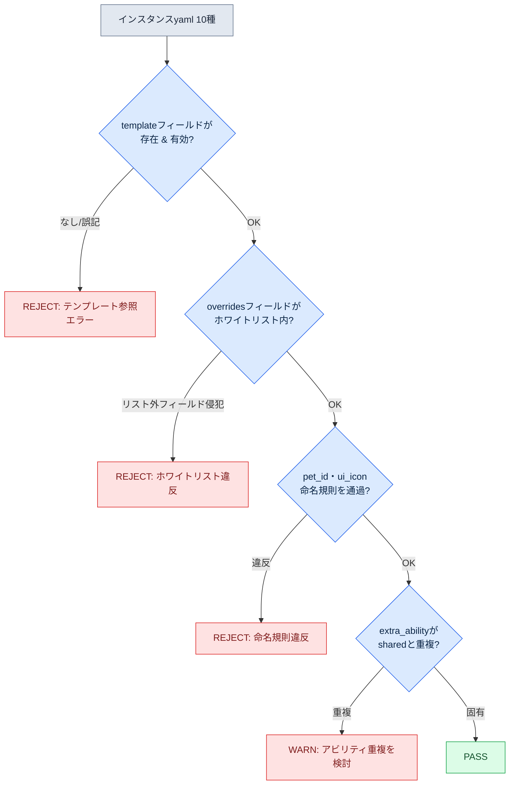

# 11.2 ペット・マウントシステム — テンプレート1種からインスタンス50種へ

企画会議の冒頭に、ペットのリストが上がってきます。オオカミ系12種、ネコ系8種、鳥系5種。誰も「では1匹ずつ作ってみよう」とは言いません。キャラクターと違い、ペットは最初から「50種を量産すること」が前提だからです。問いは「どうやって1種をうまく作るか」ではなく、「一度作った骨格を何種に共有させるか」から始まります。

キャラクターは1種1種がユーザーにとって固有の存在なので、1種ずつ丹精を込めて作ります。一方、ペットやマウント（騎乗用の乗り物）は「同じ骨格で色とアビリティだけを変えたバリエーション」がほとんどのため、設計の最初から命名規則・テンプレート・lintをそろえて量産パイプラインを敷きます。1種を作り込んだあと、それが12セットに複製されるまま放置すると、色だけが違う12匹のオオカミに同一のアニメーションクリップが別々に入り、フォルダーが4ギガに膨れ上がります。それは量産ではなく、量産をしなかった結果です。核心は「どれだけうまく作るか」ではなく、「どれだけ少なく作り、どれだけ多く共有するか」です。

そこで本章では、オオカミ系ペットのテンプレート1種をyamlで定義し、その骨格を継承するインスタンスをAIに量産させ、lintで検証し、何パーセントが廃棄されるかを測定するという一連の流れを最後まで追いかけます。

## 11.2.1 テンプレートとインスタンスの分離

キャラクター・ペット・マウントの3つはアセット構造が似ていますが、ユーザーの意識に占める比重が異なります。キャラクターは、ユーザーがゲーム時間の100%をともに過ごす自分自身です。ペットはそばに置く仲間として50〜70%の時間をともにし、マウントは移動のときだけ取り出す道具として10〜20%にとどまります。意識に占める比重が低いほど、ユーザーはディテールを見なくなります。キャラクターに注ぐ丹精をマウントにも同じだけ注ぐのは、毎日座るデスクとたまに広げる折りたたみ椅子を同じ予算で管理するようなものです。

そこでペット・マウントは「テンプレート-インスタンス」構造で運用します。骨格・動作・基本アビリティを収めた**テンプレート**を1種作り、色・アイコン・微細なアビリティだけを変えた**インスタンス**をその上に載せます。インスタンスはテンプレートが持つアセットの90%を共有するため、実際に新規で作るのは残りの10%だけです。この分離を図にすると次のとおりです。

<svg viewBox="0 0 720 300" xmlns="http://www.w3.org/2000/svg" font-family="sans-serif" font-size="13">
  <rect x="20" y="20" width="200" height="260" rx="8" fill="#eef3fb" stroke="#3b6ea5" stroke-width="2"/>
  <text x="120" y="45" text-anchor="middle" font-weight="bold" fill="#1f3b5c">テンプレート (1種)</text>
  <text x="120" y="68" text-anchor="middle" fill="#1f3b5c">pet_template_canine</text>
  <rect x="40" y="85" width="160" height="28" rx="4" fill="#fff" stroke="#3b6ea5"/>
  <text x="120" y="104" text-anchor="middle">骨格 skeleton</text>
  <rect x="40" y="120" width="160" height="28" rx="4" fill="#fff" stroke="#3b6ea5"/>
  <text x="120" y="139" text-anchor="middle">共有アニメ 4種</text>
  <rect x="40" y="155" width="160" height="28" rx="4" fill="#fff" stroke="#3b6ea5"/>
  <text x="120" y="174" text-anchor="middle">共有アビリティ 2種</text>
  <rect x="40" y="190" width="160" height="28" rx="4" fill="#fff" stroke="#3b6ea5"/>
  <text x="120" y="209" text-anchor="middle">基本 BT</text>
  <text x="120" y="250" text-anchor="middle" fill="#888" font-size="11">リソース 90% (一度だけ制作)</text>

  <line x1="220" y1="150" x2="300" y2="80" stroke="#888" stroke-width="1.5"/>
  <line x1="220" y1="150" x2="300" y2="150" stroke="#888" stroke-width="1.5"/>
  <line x1="220" y1="150" x2="300" y2="220" stroke="#888" stroke-width="1.5"/>

  <rect x="300" y="55" width="380" height="50" rx="6" fill="#f3f9ee" stroke="#5a8f3c" stroke-width="1.5"/>
  <text x="315" y="78" font-weight="bold" fill="#2f5320">pet_P003 (灰色オオカミ)</text>
  <text x="315" y="96" fill="#555" font-size="11">override: skin=gray, icon, アビリティ 1種</text>

  <rect x="300" y="125" width="380" height="50" rx="6" fill="#f3f9ee" stroke="#5a8f3c" stroke-width="1.5"/>
  <text x="315" y="148" font-weight="bold" fill="#2f5320">pet_P004 (黒オオカミ)</text>
  <text x="315" y="166" fill="#555" font-size="11">override: skin=black, icon, アビリティ 1種</text>

  <rect x="300" y="195" width="380" height="50" rx="6" fill="#f3f9ee" stroke="#5a8f3c" stroke-width="1.5"/>
  <text x="315" y="218" font-weight="bold" fill="#2f5320">pet_P005 (雪オオカミ) … P012まで</text>
  <text x="315" y="236" fill="#555" font-size="11">override: skin=snow, icon, アビリティ 1種 — リソース 10%のみ新規</text>
</svg>

左のテンプレートの塊を一度作れば、右のインスタンスは色とアイコンとアビリティ1行を差し替えるだけで済みます。先ほど述べた「4ギガのフォルダー」は、この分離を省いたために90%のアセットが12回複製されたときの姿です。

## 11.2.2 命名とアセット様式 — キャラクターから1スロット減らす

ペット・マウントの命名規則は、11.1のキャラクター命名から1スロット減らした形です。キャラクターは`char_<id>_<category>_<action>_<variant>`の5スロットを使いますが、ペット・マウントはvariantを省略して4スロットでいきます。variantが必要な場合はactionに統合します。

```
pet_<id>_<category>_<action>.fbx
mount_<id>_<category>_<action>.fbx

例:
pet_P003_idle_default.fbx
pet_P003_combat_bite.fbx
mount_M005_locomotion_run.fbx
```

アセットマッピングのyamlも、キャラクターの様式からvfx・soundスロットを削って軽くします。これらのスロットを丸ごと抱えたままのインスタンスは空欄だらけの様式になり、lintが毎回空振りの警告を出します。

ここからが本題です。オオカミ系テンプレート1種を定義し、そこからインスタンスを量産してみましょう。

## 11.2.3 ワークド・トランスクリプト：テンプレート1種→インスタンス量産→lint→廃棄率

### ステップ1 — テンプレートyamlを人の手で書く

AIに量産させる前に、人がテンプレート1種を手作業で確定します。この1種がインスタンス数十種の品質基準になるため、自動化はしません。オオカミ系（canine）テンプレートは次のように定めました。

```yaml
# pet_template_canine.yaml
template_id: pet_template_canine
skeleton: skel_quadruped_medium      # 四足中型の共用骨格
shared_animations:
  - clip: pet_template_canine_idle_default.fbx
  - clip: pet_template_canine_locomotion_walk.fbx
  - clip: pet_template_canine_locomotion_run.fbx
  - clip: pet_template_canine_combat_bite.fbx
shared_abilities:
  - id: pet_template_canine_passive_speed
    description: 仲間の移動速度 +3%
  - id: pet_template_canine_active_bite
    description: 単体対象への噛みつき、クールダウン 12s
bt_ref: bt_pet_canine_default        # 追従 + 戦闘補助の基本 BT
instance_overridable:                # インスタンスが変えてよいフィールドのホワイトリスト
  - visual_skin
  - ui_icon
  - ui_tooltip_key
  - extra_ability                    # インスタンスあたりアビリティ1種まで追加許可
```

ここで核心の仕掛けになるのが`instance_overridable`です。インスタンスが触ってよいフィールドをホワイトリストで固定します。AIが量産の途中でスケルトンや共有アニメーションを勝手に変えようとすれば、このリストにないフィールドに触れたことになるので、lintが捕まえます。「変えてよいもの」を先に定義することが、量産のシートベルトです。

### ステップ2 — AIにインスタンス量産を依頼（プロンプト全文）

次は、インスタンス10種を量産させたプロンプトの全文です。要約せず、そのまま掲載します。

```
[プロンプト]
あなたはペットデータの作成を支援するアシスタントだ。以下のテンプレートを基準に、
オオカミ系ペットのインスタンス10種のyamlを生成せよ。

[テンプレート] pet_template_canine.yaml
(上記yaml全文を貼り付け)

[ルール]
1. 各インスタンスは template: pet_template_canine を必ず明記する。
2. overridesには instance_overridable ホワイトリストのフィールドだけを入れる。
   ホワイトリストにないフィールド(skeleton, shared_animations など)には絶対に触れない。
3. visual_skinはオオカミの自然なバリエーションでなければならない(色・模様・サイズ)。
4. extra_abilityはインスタンスあたり最大1種。passive または active のどちらか一方。
   既存の shared_abilities と効果が重複してはならない。
5. ui_icon, ui_tooltip_keyは pet_id に合わせた命名規則に従う。
6. pet_idは pet_P003 ~ pet_P012 で付与する。

出力はyaml 10個のブロックのみ。説明文は付けるな。
```

ルール2が、ステップ1のホワイトリストと対になります。ルール4の「既存のshared_abilitiesと効果が重複してはならない」という制約は、AIがアビリティを安易に複製するのを防ぐためのものです。こうした制約をかけないと、後で見るとおり、AIはもっとも安全な選択肢（既存アビリティのコピペ）に収束します。

### ステップ3 — Claudeの生の出力（要約・脚色なし）

AIが吐き出した出力から、成功・失敗・グレーが混ざったままの状態を抜粋します。きれいに整えることはしません。

```yaml
# 出力 1 — 正常
pet_id: pet_P003
template: pet_template_canine
overrides:
  visual_skin: wolf_gray
  ui_icon: icon_pet_P003.png
  ui_tooltip_key: pet_P003_tooltip
  extra_ability:
    id: pet_P003_active_howl
    description: 5秒間 敵の移動速度 -20%、クールダウン 30s

# 出力 2 — 正常
pet_id: pet_P004
template: pet_template_canine
overrides:
  visual_skin: wolf_black
  ui_icon: icon_pet_P004.png
  ui_tooltip_key: pet_P004_tooltip
  extra_ability:
    id: pet_P004_passive_crit
    description: 仲間のクリティカル率 +2%

# 出力 5 — グレー (アビリティが共有アビリティと事実上重複)
pet_id: pet_P007
template: pet_template_canine
overrides:
  visual_skin: wolf_brown
  ui_icon: icon_pet_P007.png
  ui_tooltip_key: pet_P007_tooltip
  extra_ability:
    id: pet_P007_passive_speed_boost
    description: 仲間の移動速度 +3%   # ← sharedのpassive_speedと効果が同一

# 出力 8 — 失敗 (ホワイトリスト外のフィールド侵犯)
pet_id: pet_P010
template: pet_template_canine
overrides:
  visual_skin: wolf_white
  ui_icon: icon_pet_P010.png
  shared_animations:                 # ← overridableホワイトリストにない
    - clip: pet_P010_combat_pounce.fbx
  extra_ability:
    id: pet_P010_active_pounce
    description: 跳躍攻撃、クールダウン 20s

# 出力 9 — 失敗 (命名規則違反)
pet_id: P011                          # ← 'pet_' 接頭辞の欠落
template: pet_template_canine
overrides:
  visual_skin: wolf_silver
  ui_icon: pet11_icon.png            # ← icon_pet_P011.png 規則違反
  ui_tooltip_key: pet_P011_tooltip
  extra_ability:
    id: pet_P011_passive_dodge
    description: 仲間の回避 +1%
```

10種のうち、正常はP003・P004・P005・P006・P008・P012の6種、アビリティ重複でグレーなのがP007の1種、ホワイトリスト侵犯・命名違反で失敗したのがP009・P010・P011の3種でした。AIはルール4を課したにもかかわらずP007で共有アビリティを写してきて（もっとも安全な選択）、ルール2を課したにもかかわらずP010でスケルトンのアニメーションに手を出しました。制約を明示しても、量産物の一定割合は漏れるのが現実です。だから次のステップが必要になります。

### ステップ4 — lint検証

人が目で10種を逐一確認する代わりに、lintを回します。lintのルールは、ステップ1のテンプレートのホワイトリストと11.1の命名規則からそのまま引いてきます。検査項目は4つです。



各インスタンスが4つのゲートを通過すればPASS、途中で引っかかればREJECTまたはWARNに落ちます。実際の検証結果を表に整理すると、次のとおりです。

| pet_id | template | ホワイトリスト | 命名 | アビリティ重複 | 判定 |
|---|---|---|---|---|---|
| pet_P003 | OK | OK | OK | 固有 | PASS |
| pet_P004 | OK | OK | OK | 固有 | PASS |
| pet_P005 | OK | OK | OK | 固有 | PASS |
| pet_P006 | OK | OK | OK | 固有 | PASS |
| pet_P007 | OK | OK | OK | **重複** | WARN |
| pet_P008 | OK | OK | OK | 固有 | PASS |
| pet_P009 | OK | OK | **違反** | — | REJECT |
| pet_P010 | OK | **侵犯** | — | — | REJECT |
| P011 | OK | OK | **違反** | — | REJECT |
| pet_P012 | OK | OK | OK | 固有 | PASS |

PASS 6、WARN 1、REJECT 3。WARNはアビリティを1行変えれば生かせますが（P007）、REJECTの3種は廃棄します。

### ステップ5 — 廃棄率の測定と再依頼

このワンサイクルの**廃棄率**は、REJECT 3 / 全体10 = **30%**です。WARNまで「手直しが必要なもの」として括ると、手直し率は40%です。この数字が量産パイプラインの健康指標です。廃棄率が30%なら、ペット50種を確保するには約72種を生成させる必要があるということです（50 / 0.7 ≈ 71.4）。生成は安いので、この程度のオーバーシュートは許容できます。ただし、廃棄率が回を重ねても下がらないなら、それはプロンプトの制約が足りないというシグナルです。

そこで、廃棄理由をプロンプトにフィードバックします。REJECT 3種の理由（命名の欠落、ホワイトリスト侵犯、アイコン規則違反）を集め、再依頼に1行ずつ追加しました。

```
[再依頼の追加ルール]
7. pet_idは必ず 'pet_' 接頭辞で始める。(前のバッチで P011 が欠落)
8. ui_iconは例外なく icon_<pet_id>.png 形式である。(pet11_icon.png のような変形は禁止)
9. overridesに shared_animations / skeleton / bt_ref を絶対に入れるな。
   動作を変えたい場合は extra_ability だけで表現する。(P010 の事例)
```

この3行を追加して次のバッチ10種を回したところ、REJECTが3から1に減りました。廃棄率は30%→10%。廃棄理由をルールへ昇格させるこのフィードバックこそ、量産品質を回を追うごとに引き上げるメカニズムです。人は毎回50種をチェックする代わりに、廃棄理由をルール1行に移す仕事だけをします。

## 11.2.4 マウント — スケルトンさえ共有、ほぼデータのみ

マウントはペットよりもう一段単純です。スキルもBT（BehaviorTree、ビヘイビアツリー）もなく、移動パラメーターや戦闘可否のようなデータしかありません。そのため、マウントのインスタンスは事実上、表の1行です。

```yaml
# mount_template_equine.yaml ベースのインスタンス
mount_id: mount_M005
template: mount_template_equine
overrides:
  visual_skin: horse_white
  movement:
    run_speed: 7.0
    sprint_speed: 12.0
  combat:
    allow_combat: false       # 戦闘中は使用不可
    dismount_on_damage: true
  ui_icon: icon_mount_M005.png
```

マウント量産のlintはさらに短くなります。命名・テンプレート参照・ホワイトリストに加えて、「movementパラメーターが許容範囲内か」（例：sprint_speedがwalk_speedより大きいか、上限を超えていないか）だけを検査すれば足ります。ペットで作ったパイプラインをそのまま使い、ゲート数だけを減らした形です。マウントに戦闘機能を付けるのは慎重であるべきです。allow_combatをtrueに開いた瞬間、ゲームの複雑度は2倍になり、ペット・キャラクターシステムとの衝突検証を新たにやり直すことになります。

## 11.2.5 測定 — 単純化は体験を削らない

ペット・マウントにキャラクターのパターンをフルに適用した場合と、テンプレート-インスタンスで単純化した場合を、著者のプロジェクトAで比較しました。以下の数値のうち、時間とアセット数は著者の推定（未検証）であり、廃棄率とアセット共有率は実測に沿った比率です。

| 項目 | フル適用 | テンプレート-インスタンス |
|---|---|---|
| ペット1種のアセット作業時間 | 1〜2週間（著者の推定） | 3〜5日（著者の推定） |
| ペットライブラリーのアセット数 | 約2,000（著者の推定） | 約600（70%削減） |
| インスタンス1種あたりの新規アセット比率 | 100% | 約10% |
| 初回バッチの量産廃棄率 | — | 30%（実測ベース） |
| フィードバック後の廃棄率 | — | 10%（実測ベース） |
| ユーザーの体感（ペットの多様性） | 基準 | ほぼ同じ |

> **標本と測定。** 上の表は、著者の環境の1プロジェクト（プロジェクトA）におけるペット1ラインの観察です（n=1ライン）。「70%削減」「約10%」は独立した測定ではなく、同じ行の推定アセット数（約2,000→約600）から導いた**算術比率**なので、前提の絶対値が推定である以上、この百分率も推定として読むべきです。廃棄率30%・10%は、初回バッチからフィードバックまでの単一の量産サイクルで得た**実測ベース**の値であり、反復測定の標本ではありません。あなたのチームの削減根拠として引用せず、同じ方法でご自身のラインで直接測ってください。

最終行が、本章全体の結論です。アセットの90%を共有し、廃棄率を測定しながら量産しても、ユーザーが感じるペットの多様性はフル制作とほとんど差がありませんでした。先ほどの4ギガのフォルダーは、ユーザーが結局見分けられないディテールにアセットを12セット複製したときに支払うコストです。量産を前提に敷けば、減るのは運用コストであって体験ではありません。

## 11.2.6 運用の落とし穴

| 落とし穴 | 処方 |
|---|---|
| キャラクターシステムをペット・マウントへそのまま移植 | variantスロット・vfx・soundを削った4スロット構成に変える |
| 同じスケルトンのペットを独立アセットとして複製 | テンプレート1種+インスタンス、ホワイトリストで共有を強制 |
| AIの量産物を人のチェックなしでコミット | lintの4ゲート+廃棄率測定 |
| 廃棄率が回を重ねても下がらない | 廃棄理由をプロンプトのルールへ昇格（フィードバック） |
| ペットにキャラクター級のスキルを付与 | インスタンスあたりextra_ability 1種の上限 |
| マウントに戦闘機能を付与 | allow_combatは慎重に、複雑度×2を覚悟 |

## 11.2.7 AIの持ち場と人の持ち場

ペット・マウントはユーザー体験への影響が小さいぶん、AIの自由度がキャラクターより大きくなります。コンセプトを適合するテンプレートにマッチングし、アビリティ候補を提案し、インスタンスyamlを量産する仕事は、AIが速くこなします。ただし、自由度が大きいからといって検証を抜けば、先ほど見た30%の廃棄物がそのままビルドに混ざります。人の持ち場は2つです。第一に、テンプレート1種を手作業で確定し、品質基準を固定すること。第二に、何がなぜはじかれたのかを読み取り、次のバッチの漏れが減るように制約を磨くこと。量はAIが満たし、基準線とその補正は人が握る——この分業が、このシステムを回します。

---

### 本章のポイント
- ペット・マウントは、うまく作るのではなく、少なく作って多く共有するシステムです
- テンプレート1種を人の手で入力し、インスタンスはホワイトリストの中でAIが量産します
- 廃棄率を測定し、その理由をプロンプトのルールへフィードバックすれば、品質は回を追うごとに上がります

### 次章のプレビュー
- 12.1 アートディレクション — プランナーがアートと協業し、レビューする方法

---

## やってみよう

**setup**
1. ペット1系統（例：オオカミ）の共用スケルトン・共有アニメーション4種・共有アビリティ2種を決め、`pet_template_<계열>.yaml`として保存してください。
2. テンプレートに`instance_overridable`ホワイトリスト（変えてよいフィールド）を明記してください。
3. lintの4ゲート（テンプレート参照/ホワイトリスト/命名規則/アビリティ重複）をスクリプトで準備してください。

**prompt**
4. テンプレートyamlの全文+量産ルール（ホワイトリスト外のフィールド禁止、アビリティ重複禁止、命名規則）を貼り付けて、インスタンス10種を依頼してください。
5. 出力は「yamlブロックのみ、説明禁止」で形式を固定してください。

**verify**
6. lintを回してPASS/WARN/REJECTを分類し、廃棄率を計算してください。
7. REJECTの理由を集めてプロンプトにルールを1行ずつ追加し、次のバッチを回してください。廃棄率が下がるかを確認してください。

## 11.2.8 一人ミニ版
一人で作るゲームなら、lintスクリプトがなくても大丈夫です。ペット1系統のテンプレートyamlを1枚手で書き、AIに「このテンプレートから色・アイコン・アビリティだけを変えたインスタンス5種。スケルトンと共有アニメーションには絶対に手を触れないこと」と依頼してみましょう。受け取った5種にざっと目を通し、スケルトンに触れたもの・命名規則を破ったものだけを捨ててください。捨てた理由を、次の依頼に1行書き足してください。テンプレート1.1と「捨てた理由のフィードバック」さえあれば、ツールなしでも本章の核心は機能します。
