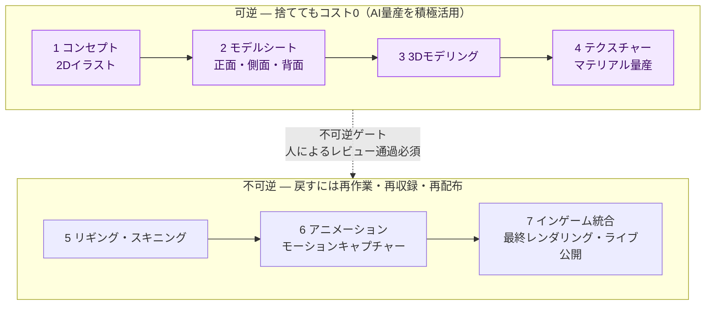
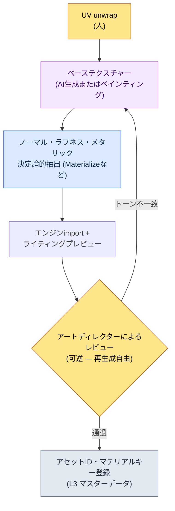

# 12.1 AIアートアセットパイプライン — 可逆な段階で量産し、不可逆ゲートの前で止まる

> 第一読者：アートチームと協業するゲームプランナー・アートディレクター（中規模（10〜50人）チーム）
> 一人/趣味の読者向け縮小バージョン：§12.1.8「一人ならこれだけ」

AIで生成したコンセプトアート100枚を会議室の壁に貼った日のことを覚えています。30秒で印刷された100枚のうち、アートディレクターが選んだのは3枚で、97枚はその場で捨てられました。誰かはそれを「97%の無駄」と呼びました。しかし手で描いていたら、その3枚にたどり着くために作家は2週間を費やしたはずです。何が無駄なのかが、逆転していたのです。

本章が扱うのは、その逆転を運用に変える方法です。核心は一行です。**AIアートは可逆な段階（コンセプト・テクスチャー探索）では思う存分量産し、不可逆な段階（最終レンダリング・モーションキャプチャー・ビルド反映）の前には人が守るゲートを置きます。**捨ててもよい場所では99枚を捨て、後戻りできない場所では1枚もそのまま通しません。アートツールの使い方は他の本に十分書かれているので、本章はそのツールを*プランナーのパイプラインに安全に組み込む位置*だけに集中します。

---

## 12.1.1 アートパイプラインには引き返せる線がある

アートアセットがコンセプトからインゲームまで進む道のりは7段階です。著者のプロジェクト（以下「プロジェクトA」）のキャラクターアセットラインをそのまま書き写すと、次のようになります。重要なのは段階の数ではなく、その真ん中を貫く**可逆/不可逆の境界線**です。



左の4段階（コンセプト〜テクスチャー）は**可逆**です。コンセプトを100枚生成して97枚を捨てても失うのはトークンコストだけですし、テクスチャーを5回生成し直してもファイルを上書きすれば終わりです。だからこの区間は、AI量産がもっとも大きなROI（Return on Investment、投資対効果）を出す場所です。量産ツールは、セルフホスティングするStable Diffusion（SDXL）/ComfyUIが主軸です。理由はIP保護です — 資産を外部のクローズドなサービスにアップロードせずローカルで動かし、キャラクターでファインチューニングしたLoRAとControlNetで、同じ人物の一貫性を生成のたびにコントロールできます。クローズド型ツール（Midjourneyなど）は初期のムードボードを素早く敷くときだけ限定的に使い、一貫性・反復コントロールが必要な本番の量産はSD/ComfyUIに持ち込みます。

右の3段階（リギング以降）は**不可逆**です。モーションキャプチャーはスタジオと俳優のスケジュールに縛られ、最終レンダリングがビルドに載ってライブに公開されれば、ユーザーの記憶とコミュニティの反応がついて回ります。一度越えてしまえば、戻すコストが作るコストより大きくなります。だから境界線の上に**人が守るゲート**が立ちます。AIが可逆区間でどれだけ量産しても、不可逆へ渡るアセットは人によるレビューを通過したものだけです。

この1枚の図が本章の骨格です。「AIをアートにどこまで使うか」という問いは、実は「この作業は境界線のどちら側か」という問いなのです。

---

## 12.1.2 [ワークド・トランスクリプト] コンセプト一式を量産から廃棄・再依頼まで

可逆区間の最初の段階であるコンセプト量産を、1サイクル最後まで見せます。抽象的に「AIがコンセプトを出す」とだけ書いては、何が実際に出てきて何が廃棄されるのか分かりません。以下はプロジェクトAで学者ギルドのシニアNPCのコンセプトを量産したセッションを忠実に再現したものです。プロンプトはそのままコピーして使えますし、出力は実際のセッションを再構成したものです。

### 第1段階 — 入力：企画意図を先に明示する

ここでもっとも頻繁に間違える場所があります。プロンプトを「ビジュアル描写」から始めることです。会社のフィードバックatom `image_prompt_design_intent_first`が釘を刺している原則は正反対です — **画像プロンプトも設計意図が先**です。外見の形容詞を並べるのではなく、このキャラクターがゲームの中でどんな機能・ナラティブを背負うのかを先頭に置きます。

```yaml
# concept_brief_scholar_senior.yaml — コンセプト量産の入力
asset_id: npc_scholar_senior_01
role: 学者ギルドのシニア — 封印弱化を初めて観測した人物
function: メインクエスト発注NPC (プレイヤーが信頼すべき情報源)
narrative_seed:
  - 30年間鐘楼で封印の脈を記録してきた人
  - 感情を数字の裏に隠す (scholarly_strict トーン)
style_anchor: semi-realistic, painted, 東アジアファンタジー   # L0ビジョンで固定
forbidden: anime スタイル · 現代の衣服 · 一般的なファンタジー魔法使いローブ
```

`function`と`narrative_seed`が外見より先です。「なぜこのキャラクターはこういう見た目でなければならないのか」を入力が持っていてこそ、量産結果から「なぜこちらの方が良いのか」を判断できます。

### 第2段階 — プロンプト：量産しつつ形式と禁止事項を強制する

```
添付した concept_brief をもとに、キャラクターコンセプトの方向提案を6案生成せよ。
これは探索用の量産だ — 最終ではなく、アートディレクターが選ぶ候補だ。

ルール:
1) function と narrative_seed を視覚に翻訳せよ。単なる美形は禁止。
   (例: 「感情を数字の裏に隠す」 → 表情・小物・姿勢でどう表れるか)
2) style_anchor から外れるな。forbidden 項目は絶対禁止。
3) 6案は互いに十分異なること。微細なバリエーション6枚に探索価値はない。
4) 各案に一行の意図根拠を付けよ (なぜこの方向が function に合うのか)。
5) お前が「style_anchor と衝突しうる」と疑う案は別途表示せよ。

出力形式: (案番号 | 核心ビジュアル | 意図根拠 | 衝突疑い)。それ以外の説明は禁止。
```

このプロンプトでビジュアル描写が占める分量はほとんどありません。大部分は、出力形式を固定し禁止事項に釘を刺すことに使われています。AIに自由を与えると、学習データの平均 — 一般的なファンタジーの魔法使い — へ回帰してしまうからです。**意図翻訳の義務、style_anchorの固定、6案の多様性の強制、そして「衝突したら申告せよ」という逃げ道**が、回帰を防ぐ4本のかんぬきです。

### 第3段階 — Claudeの出力（再構成、抜粋）

```
| 案 | 核心ビジュアル                       | 意図根拠                          | 衝突 |
|----|--------------------------------------|-----------------------------------|------|
| 1  | 真鍮の拡大鏡を恒久装着、インク染みの指 | 観測こそアイデンティティ — 道具の身体化 |      |
| 2  | 表情のない老学者、手に計器盤の巻物   | 感情を数字の裏に隠す = 無表情+記録物 |    |
| 3  | 鐘楼の背景、背後で冷えていく封印の脈の光 | 職務空間が人物を説明            |      |
| 4  | 華やかな星刺繍のローブ、手に魔力の球体 | 威厳の強調                        | ★    |
| 5  | 片目が義眼、生涯の観測の痕跡          | 30年の職務の身体的代償            |      |
| 6  | 若く端正な学者、美形の強調            | 好感度優先                        | ★    |
```

出力の中でもっとも価値があるのは表ではなく、**★印の2行**です。4案（華やかな魔法使いのローブ、魔力の球体）と6案（美形優先）に、AIが自ら「style_anchor・forbiddenと衝突する可能性がある」と申告しました。ルール5の逃げ道がなかったら、この2案は他の4案と同じ顔で表に紛れ込んでいたはずです。疑わしい箇所をAI自身に手を挙げて表示させること — それが自由放任の量産と制御された量産を分けます。

### 第4段階 — 検証と拒否（人の出番）

この出力をそのまま受け取りません。アートディレクターが6案をbriefに照らして一度チェックします。実際このセッションでは、判定は次のように分かれました。

- **4案は廃棄。**AIが申告したとおりです。「魔力の球体を持つ星の刺繍のローブ」は`forbidden: 일반 판타지 마법사 로브`への正面からの違反です。このキャラクターは魔法を使う人ではなく、魔力を*観測・記録*する人です。functionの誤訳です。
- **6案は廃棄。**美形優先は`narrative_seed: 30년 직무의 신체 대가`と食い違います。このNPCの説得力は「長くやってきた人」の摩耗から生まれます。若くきれいな顔はナラティブを削ります。
- **1案・5案は採用、2案・3案は保留。**1案（拡大鏡の身体化）と5案（義眼）は、「道具・職務が人物を作る」という意図に正確に貼り付きました。

ここでの廃棄2件は損失ではありません。手で描いていたらこの2方向が間違いだと分かるまでに数日かかったはずのところを、量産が6案を同時に広げ、1時間以内にふるい落としました。

### 第5段階 — 再依頼

```
1案(拡大鏡の身体化)と5案(義眼)の方向を統合せよ。
- 真鍮の拡大鏡 + 片目の義眼を一人の人物に統合
- 感情抑制(scholarly_strict): 表情は無、小物だけで職務を語る
- forbidden 再確認: 魔法使いローブ・魔力の球体・美形の強調はすべて禁止
これはアートディレクターが手作業の仕上げに渡す「最終候補1案」を作る段階だ。
```

AIは拡大鏡と義眼を一人の老学者に統合した単一の方向を改めて答え、その1枚がコンセプトアーティストの机に渡り、手作業で仕上げられました。**量産（6案）→ 廃棄（2案）→ 収束（1案）→ 人による仕上げ**という1サイクルがここで閉じます。AIが作ったのは最終アセットではなく、アートディレクターが選ぶ候補の幅でした。

この一巡が、本書全体のShow基準です。AIが何を吐き出し、何が廃棄され、人が何を仕上げるのかを一度でも最後まで見なければ、「AIでコンセプトを量産した」という文は空虚です。

---

## 12.1.3 廃棄率が高いのは探索が深いという信号だ

上のセッションでは6案中2案が廃棄されました。コンセプトライン全体で見れば、廃棄はさらに積み上がります。会議室の壁に貼った100枚のうち、採用は3枚でした。

この比率を正直に扱っておきます。これは導入初期のコンセプトセッション数件を直接カウントした方向性の値であって、精密な母集団比率ではありません（著者の推定、未検証 — キャラクターの性格やブリーフの品質によって大きくぶれます）。したがって「正確に何%」ではなく、**「手作業の時期より廃棄をはるかに自由にできるようになった」という方向**で読むのが正しいのです。

重要なのは、廃棄率0%が目標ではないという点です。紙1枚が高ければ、その1枚をとことん磨き込みます。紙100枚が30秒で印刷されるなら、99枚を捨てても負担はなく、その分だけ探索の幅が広がります。**廃棄率が上がるのは探索の深さが深まっているという信号**です。廃棄率そのものを減らそうとする運用は — たとえば「AIが出したものはなるべく使おう」という圧力は — 探索の価値も一緒に削ります。§12.1.2で4案・6案をためらいなく捨てられたのは、捨てるコストが0だったからです。

---

## 12.1.4 テクスチャー量産 — 可逆区間の2番目の持ち場

コンセプトと並んで、可逆区間でROIが大きいもう一つの持ち場がテクスチャーです。3Dモデルに着せるマテリアルを生成する段階ですが、ここでもAIが入る欄と決定論が受け持つ欄がはっきり分かれます。



AIが入るのは**ベーステクスチャー**の1欄だけです。ノーマル・ラフネス・メタリックのようなPBRマップは、AIに毎回違うものを出させるのではなく、決定論的な抽出ツールが受け持ちます。同じベースから同じマップが出てこそ、マテリアルが一貫するからです。これは§6.2の都市ジェネレーターで、報酬カーブをAIに任せずルールブックが押さえていたのと同じ分担です — **決定論で保証できるものはコードが、探索が必要なものはAIが。**

ベーステクスチャーでさえ、すべてのアセットにAIが適しているわけではありません。キャラクターの顔のように、微細なディテールがゲームのアイデンティティを左右する場所では、依然として人の手が優先です。だからレビューゲートが「トーン不一致」を捕まえたら、自動廃棄ではなく再生成へ戻します。ここまでが全部、境界線の左側 — 何度やり直しても失うもののない可逆区間です。

---

## 12.1.5 不可逆ゲート — 一貫性検証とビジュアルリグレッション

境界線を越える直前に、可逆区間で量産されたアセットがゲーム全体のトーンと食い違っていないかを検査します。これは人の目だけでは漏れが出る場所なので、コードが1次チェックを担います。

```python
# visual_regression.py — アセット差し替え時の意図外変化の検出 (骨格)
# 入力: アセットID + 差し替え前/後の同一条件レンダーキャプチャ
# 出力: 変化等級 (人の検収ゲートへ alert)

def compare_renders(asset_id, before_png, after_png, threshold=(1.0, 5.0)):
    diff = pixel_diff(before_png, after_png)   # 0~100 正規化
    if diff > threshold[1]:
        return ("BLOCK", f"{asset_id}: 大きな変化 {diff:.1f}% — 検収前の不可逆進入は禁止")
    elif diff > threshold[0]:
        return ("WARN",  f"{asset_id}: 軽微な変化 {diff:.1f}% — 意図の確認が必要")
    else:
        return ("PASS",  f"{asset_id}: 変化なし")
```

この30行が、「テクスチャーを1枚差し替えたら別のキャラクターの影が壊れた」という事故を、不可逆への進入*前に*捕まえます。重要な設計は、`BLOCK`が自動廃棄ではなく**レビューゲートにalertを上げるだけ**だという点です — 意図された変更（リデザイン）までコードが殺してしまうと、作家たちは1〜2四半期のうちに「オフにしよう」と言い出します。疑わしい候補は機械が拾い、不可逆へ渡すかどうかは人が決めます。

レビューが捕まえるもう一つは**スタイルの一貫性**です。AIの出力は毎回微妙に違うため、量産されたコンセプト・テクスチャーがゲームのトーンを保っているかを、人が最後に見ます。このゲートを通過したものだけが、リギング・モーションキャプチャー・最終レンダリングという不可逆の段階へ進みます。一度モーションをキャプチャーしてビルドに載せてしまえば、一貫性の事故は再作業・再収録・再配布でしか直せないからです。

---

## 12.1.6 アートチームには決定だけが渡る — md→html→sync

プランナーがAIでコンセプト・テクスチャーを量産しても、実際に絵を描くアートチームは別組織です。ここでの協業の核心は、**アートチームが企画チームのツールやコンベンションを学ぶ必要がないように**することです。プロジェクトAのアートガイド（`96_ArtGuide/`）は、これを自動化で解決します。

アートの決定事項は企画チームがmdで書き、`_convert_md_to_html.py`がhtmlに変換した後、`_SyncToArtRepo.bat`が別のアートリポジトリへpushします。アートチームはそのリポジトリでhtmlだけを見ます — mdのコンベンションも、企画チームのSVNも知らなくてよいのです（パイプラインの図は§12.2.4）。

そしてこの決定文書は7つのドメイン（`00_Common`・`01_Character`〜`07_Env`）に分かれ、それぞれが自分のスタイルルールを持って統合ゲートで合流します。これが次章（12.2）で扱うArtGuideの7領域ですが、核心だけ先に言うとこうです — **スタイルのルールブックを1つの枠ではなく7つの引き出しに分けておけば、AI量産のプロンプトが毎回作家の頭の中で新しく組み立てられるのではなく、引き出しから取り出せるようになります。**§12.1.2の`style_anchor`・`forbidden`が、まさにその引き出しから出てきた入力です。ルールブックが分離されていてこそ、量産結果が一般的なファンタジーの平均へ回帰しません。

だからといって、すべてのゲームが7領域を全部備えるべきというわけではありません。カジュアルなジャンルなら、キャラクター・環境の2枠でも十分です。分離は漸進的に、インターフェースは狭く。

---

## 12.1.7 数値とリスクを正直に扱う方法

本章の数値は3種類だけです。(1) **方向・比率** — 「100枚量産して採用3枚」は著者の経験に基づく方向性の値（未検証）なので、絶対値ではなく「可逆区間では廃棄コストが0に収束する」という方向として読みます。(2) **測定値** — ビジュアルリグレッションの変化率（`diff %`）、一貫性事故の件数、BLOCK処理の件数は`visual_regression.py`が数字で吐き出すので、会議で「感覚」の代わりに数字で話せます。一方、「継続率（リテンション）が上がった」はアート一つで左右されるものではないので、因果を断定しません。

(3) **リスクは運用コストの中に**置きます。AIアートの3つのリスク — 学習データの著作権、スタイル一貫性の毀損、アーティストの雇用 — は、ROI計算の外ではなく中にあります。著者の方針は、可逆区間ではAIを積極活用し、不可逆へ渡す最終アセットは手作業で仕上げる、そしてビルドに直接入るアセットのAI出力比率は0を原則とする、というものです。ただし、これは一つのポリシーにすぎません — ライセンスが明示されたモデルだけを使い、最終アセットまでAIを活用するチームもあります。法務ポリシーは会社ごとに違い、本書は正解ではなく境界線の引き方を提示します。

3つのリスクのうち、もっとも見落とされやすいのは3つ目です。AIを「アーティストを置き換える量産機」ではなく「探索の幅を広げてアーティストの決定権を強める補助」として位置づけなければ、ツールはKPI上は成功しても組織から拒否されます。これはfeedback atom `design_intent_vs_automation_boundary`（設計意図 vs 自動化境界）が釘を刺した場所でもあります。

---

## 12.1.8 よくある失敗

| パターン | なぜ失敗するのか | 処方 |
|---|---|---|
| AIコンセプトを最終アセットとして直接ビルドに投入 | 不可逆の段階を人によるレビューなしで通過 | 境界線の前にゲート（§12.1.1） |
| プロンプトを外見描写から始める | functionの誤訳 — 美形の魔法使いへ回帰 | 設計意図を先に（§12.1.2、`image_prompt_design_intent_first`） |
| 量産6案が微細なバリエーション | 探索価値なし、廃棄するものがない | 多様性の強制（§12.1.2） |
| 廃棄率を減らそうとする | 探索の深さも一緒に削る | 可逆区間の廃棄は信号と見る（§12.1.3） |
| テクスチャーのPBRマップまでAI生成 | マテリアルの一貫性が呼び出しのたびに揺れる | 決定論的抽出の分離（§12.1.4） |
| ビジュアルリグレッションなしでアセット差し替え | 意図外の変化が不可逆へ漏れる | `visual_regression.py`ゲート（§12.1.5） |

---

## 12.1.9 やってみよう — 今日できる一歩

> **一人ならこれだけ**：アートチームもマスターデータもなくて構いません。自分のゲーム（または好きなゲーム）のNPCを一人選び、§12.1.2の`concept_brief`形式で`function`と`narrative_seed`を*外見より先に*書き、6案量産プロンプトをそのまま貼り付けて一度回してみましょう。出てきた6案のうち意図と食い違う1案を選んで「これはfunctionの誤訳だ、廃棄してやり直し」と反論してみると、可逆区間の廃棄が損失ではなく探索だということが体に入ってきます。

チームなら、次の一歩から始めましょう。パイプラインに**可逆/不可逆の境界線を明示的に1本引きます**（§12.1.1）。どの段階までが「捨てても0」で、どこからが「戻すと高くつく」のかを合意し、その境界の上に人によるレビューゲートを置きます。境界が引かれれば、「AIをどこまで使うか」という毎回ゼロから始まる戦いが、「この作業は境界のどちら側か」という一度の判定に変わります。

setup → prompt → verifyで要約すると — **setup**: パイプラインに可逆/不可逆の境界線とレビューゲートを定義します。**prompt**: §12.1.2の形式で設計意図を先に入力し、6案を量産しつつ禁止事項・多様性・申告を強制します。**verify**: 可逆区間で意図の誤訳1件を自分で選んで廃棄・再依頼の1サイクルを閉じ、不可逆への進入前に`visual_regression.py`で意図外の変化をチェックします。

---

### 本章のポイント
- 可逆区間（コンセプト・テクスチャー）では量産し、不可逆ゲートの前では人がレビューします。
- 廃棄率が上がるのは探索が深まっている信号であって、ツールの失敗ではありません。
- 画像プロンプトも、外見ではなく設計意図を先に入力します。

### 次章のプレビュー
- 12.2 ArtGuideの7領域 — スタイルのルールブックを7つの引き出しに分け、量産の一貫性を守る

---
