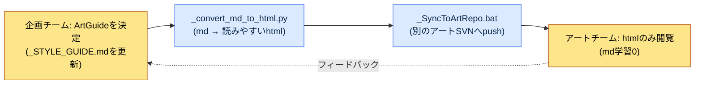

# 12.2 ArtGuideの7領域（キャラクター・アニメ・モンスター・NPC・VFX・UI・環境）

木曜日の統合レビュー。同じ画面に新規アセットを7つ並べて見た瞬間、私たちは同時に笑ってしまいました。学者キャラクターはグレートーンの重厚なシルエットなのに、その隣で炸裂するスキルVFXが蛍光ピンクだったのです。どちらも、それぞれの領域では完璧な決定でした。キャラクターディレクターは自分の`_STYLE_GUIDE.md`をそのまま守っていましたし、VFXアーティストも「よく目立つように」という私の仕様を忠実に守ってくれていました。誰も間違っていないのに、同じ画面に置くと2つのゲームが喧嘩していたのです。

この場面こそ、ArtGuideを7領域に分割する理由であり、同時に7領域を再び束ねなければならない理由でもあります。ArtGuideはゲームのビジュアル憲法です。領域に分ければ分野別のディレクターが自治を持ち、決定が速くなります。しかし統合レビューで再び束ねなければ、先ほどの蛍光ピンクのような事故が四半期ごとに積み上がります。プランナーがこのバランスのどの地点に手を入れるのか。それがこの章のすべてです。

---

## 12.2.1 アセット1枚：7領域の実際の構造

著者がディレクターとして働いたプロジェクトA（東洋ファンタジー調のモバイルファーストMMORPG）のデザインリポジトリには、`96_ArtGuide/`というフォルダがあります。番号`96`はリポジトリの整列規則上、アートガイドがほぼ最後に来るように付けたもので、その下が7つのドメインに分かれます。抽象的な「プロジェクトのアートフォルダ」ではなく、以下がそのフォルダの実際のサブ構造です。

<svg viewBox="0 0 760 360" xmlns="http://www.w3.org/2000/svg" font-family="sans-serif" font-size="13">
  <rect x="300" y="10" width="160" height="40" rx="6" fill="#2c3e50"/>
  <text x="380" y="35" fill="#fff" text-anchor="middle" font-size="14">96_ArtGuide/</text>
  <line x1="380" y1="50" x2="380" y2="70" stroke="#888" stroke-width="1.5"/>
  <line x1="70" y1="70" x2="690" y2="70" stroke="#888" stroke-width="1.5"/>
  <!-- 7 domain boxes -->
  <g>
    <rect x="20" y="70" width="100" height="70" rx="5" fill="#e8f0fe" stroke="#4285f4"/>
    <text x="70" y="92" text-anchor="middle" font-weight="bold">00_Common</text>
    <text x="70" y="112" text-anchor="middle" font-size="11">共通規約</text>
    <text x="70" y="128" text-anchor="middle" font-size="11">パレット·ルール</text>
  </g>
  <g>
    <rect x="130" y="70" width="100" height="70" rx="5" fill="#fce8e6" stroke="#ea4335"/>
    <text x="180" y="92" text-anchor="middle" font-weight="bold">01_Character</text>
    <text x="180" y="112" text-anchor="middle" font-size="11">プレイヤー</text>
    <text x="180" y="128" text-anchor="middle" font-size="11">キャラクター</text>
  </g>
  <g>
    <rect x="240" y="70" width="100" height="70" rx="5" fill="#e6f4ea" stroke="#34a853"/>
    <text x="290" y="92" text-anchor="middle" font-weight="bold">02_Animation</text>
    <text x="290" y="112" text-anchor="middle" font-size="11">すべての</text>
    <text x="290" y="128" text-anchor="middle" font-size="11">アニメーション</text>
  </g>
  <g>
    <rect x="350" y="70" width="100" height="70" rx="5" fill="#fef7e0" stroke="#fbbc04"/>
    <text x="400" y="92" text-anchor="middle" font-weight="bold">03_Monster</text>
    <text x="400" y="112" text-anchor="middle" font-size="11">敵NPC</text>
    <text x="400" y="128" text-anchor="middle" font-size="11">ビジュアル</text>
  </g>
  <g>
    <rect x="460" y="70" width="100" height="70" rx="5" fill="#e8f0fe" stroke="#4285f4"/>
    <text x="510" y="92" text-anchor="middle" font-weight="bold">04_NPC</text>
    <text x="510" y="112" text-anchor="middle" font-size="11">友好NPC</text>
    <text x="510" y="128" text-anchor="middle" font-size="11">関係·voice</text>
  </g>
  <g>
    <rect x="570" y="70" width="100" height="70" rx="5" fill="#fce8e6" stroke="#ea4335"/>
    <text x="620" y="92" text-anchor="middle" font-weight="bold">05_VFX</text>
    <text x="620" y="112" text-anchor="middle" font-size="11">視覚効果</text>
    <text x="620" y="128" text-anchor="middle" font-size="11">スキル·演出</text>
  </g>
  <g>
    <rect x="680" y="70" width="70" height="70" rx="5" fill="#e6f4ea" stroke="#34a853"/>
    <text x="715" y="92" text-anchor="middle" font-weight="bold" font-size="11">06_UI</text>
    <text x="715" y="112" text-anchor="middle" font-size="10">画面·HUD</text>
    <text x="715" y="128" text-anchor="middle" font-size="10">(9.3)</text>
  </g>
  <!-- 07 on second row -->
  <line x1="380" y1="140" x2="380" y2="170" stroke="#888" stroke-width="1"/>
  <g>
    <rect x="300" y="170" width="160" height="60" rx="5" fill="#fef7e0" stroke="#fbbc04"/>
    <text x="380" y="195" text-anchor="middle" font-weight="bold">07_Environment</text>
    <text x="380" y="216" text-anchor="middle" font-size="11">背景·小物·ランドマーク</text>
  </g>
  <!-- footer note -->
  <text x="380" y="280" text-anchor="middle" font-size="12" fill="#555">各ドメイン = ディレクター/シニア1人の自治 + ドメイン別 _STYLE_GUIDE.md(憲法)</text>
  <text x="380" y="305" text-anchor="middle" font-size="12" fill="#555">00_Common = 七つのドメインの上にかかる共通上位規約 (色·材質·時代トーン)</text>
</svg>

図のポイントは2つです。第一に、7つのドメインが横並びで対等に自治を持ちます。1つのフロアに7つの作業室が並んだオフィスを思い浮かべてください。各部屋の責任者がその部屋の決定権を握りつつ、廊下ですれ違うときに「同じゲームだ」という感覚は失わないようにしなければなりません。第二に、その上に`00_Common`が載っています。7つの部屋すべてが従うべき共通規約、すなわち全体のカラーパレットと質感の基準と時代のトーンがここに住んでいます。`06_UI`は9.1.3で扱ったUI協業標準と同じドメインなので、この章では境界線だけを引いて先へ進みます。

## 12.2.2 領域ごとにプランナーの手が届く深さは異なる

7つのドメインに、プランナーが同じ強度で関与するわけではありません。プランナーは意図とナラティブを決定し、アートはビジュアルを決定するという原則はすべてのドメインで同じですが、意図がビジュアルをどこまで引っ張っていくかはドメインごとに異なります。

| 領域 | プランナーの関与 | プランナーが越えてはならない一線 |
|---|---|---|
| 01_Character | 強い | コンセプト・性格・勢力・役割まで。顔の比率や筆のタッチは範囲外 |
| 02_Animation | 中程度 | スキルモーションの「種類・リアクション」まで。フレームのタイミングは範囲外 |
| 03_Monster | 強い | 敵のコンセプト・勢力・生態まで。鱗のパターンのディテールは範囲外 |
| 04_NPC | 強い | 役割・関係・voice_profileまで。衣装の刺繍は範囲外 |
| 05_VFX | 弱い | 「ゆっくり発射、大きな爆発、紫色」まで。パーティクル数は範囲外 |
| 06_UI | 強い | 情報構造・優先順位まで（9.3）。ピクセル単位の余白は範囲外 |
| 07_Environment | 中程度 | 雰囲気・ランドマークの意図まで。木のポリゴンは範囲外 |

右側の列がこの表の本当の中身です。関与が「強い」と書かれたドメインでも、プランナーが越えてはならない一線があります。キャラクターのコンセプトは強く引っ張りつつも、顔の比率にまで手を出せば、その瞬間キャラクターディレクターの自治が崩れます。そして、強いと弱いの境界そのものがジャンルによって揺れます。ホラーゲームならVFXが恐怖の核心なのでプランナーの関与は強くなり、カジュアルパズルならキャラクターへの関与はむしろ弱くなります。上の表はプロジェクトAのジャンルを基準にしたものであって、普遍的な法則ではありません。

## 12.2.3 ドメインの憲法：_STYLE_GUIDE.md

各ドメインは、標準のドキュメント一式で運営します。`01_Character/`ドメインの実際のファイル構成を見てみましょう。

```
01_Character/
├── _STYLE_GUIDE.md          — キャラクター全体スタイル (憲法)
├── _COLOR_PALETTE.md        — 色·材質ガイド
├── _PROPORTION_REFERENCE.md — 比率·シルエットのルール
├── _DO_AND_DONT.md          — 許可·禁止
├── individual/              — キャラクター別シート
│   ├── K_001_director.md
│   ├── K_007_scholar.md
│   └── ...
└── _REVIEW_LOG.md           — レビュー履歴
```

`_STYLE_GUIDE.md`がドメインの憲法です。個別のキャラクターシート（`individual/`）は、すべてこの憲法の上で変奏されます。憲法が揺らげばその下のすべてのキャラクターが揺らぐため、このファイル1枚がドメインで最も頻繁にレビューされるドキュメントです。骨格は次のとおりです。

```markdown
---
title: 01_Character Style Guide
layer: L1
---

## 1. トーン
- 19世紀産業革命以前、韓国ファンタジーの雰囲気
- 写実的な比率 (7~7.5頭身、デフォルメ禁止)

## 2. 色
- 彩度: 普通 (実写の60~70%水準)
- メインパレット: 00_Common 継承
- キャラクター別アクセント色 (1~2個)

## 3. 衣装ルール
- 勢力別の衣装区分 (学者 → グレー + 紫アクセント)
- 職業·階級に応じた衣装ディテール

## 4. DO
- 5m距離からシルエットだけで誰か識別可能
- 勢力アイデンティティを視覚で表現

## 5. DON'T
- 日本アニメスタイル
- 非時代劇要素 (現代の衣装·小物)
- 彩度過多
```

ここで1行が重要です。`## 2. 색상`（「2. 色」）にある「메인 팔레트: 00_Common 상속」、すなわち「メインパレットは00_Commonを継承する」という行です。キャラクタードメインが色を独自に決めるのではなく、上位の共通規約を受け継ぐという明示です。この1行こそ、冒頭の蛍光ピンク事故を構造的に防ぐ仕掛けです。すべてのドメインの`_STYLE_GUIDE.md`が、色だけは`00_Common`を継承するようにすれば、少なくとも色の衝突は憲法の段階で遮断されます。

## 12.2.4 非プランナーをどう協業に巻き込むか

ここで、プロジェクトAが実際にぶつかった最も現実的な問題が登場します。アートチームはMarkdown（マークダウン）を読みません。正確に言えば、読めと強要してはいけません。アーティストにgit diffとfrontmatterとMarkdownの見出し階層を学習させるコストは、その学習で得られる協業効率より、ほぼ常に大きいのです。企画チームのツールをアートチームにそのまま突きつけた瞬間、協業はむしろ遅くなります。

そこでプロジェクトAのパイプラインは、「企画チームはmdで決定し、アートチームはhtmlだけを見る」という1行に要約されます。



鍵になるのは2つの自動化アセットです。`_convert_md_to_html.py`は、ドメインのMarkdownガイドを、アーティストがブラウザで快適に読めるhtmlに変換します。カラーパレットは実際の色チップとして、DO/DON'Tは視覚的な対比としてレンダリングされます。`_SyncToArtRepo.bat`は、そのhtmlを企画リポジトリではなく**別のアート専用リポジトリ**へ送り込みます。リポジトリを分離する理由は単純です。アーティストが自分のリポジトリだけを受け取るようにすれば、企画チームの内部mdの履歴、作業中のドラフト、ほかのドメインの決定過程にさらされません。アーティストが見るのは、確定した決定の読みやすい成果物だけです。Markdownの学習コストが0に落ちます。

この構造で、プランナーには責任が1つ追加されます。mdを更新したら、必ず変換・同期のステップを回さなければなりません。更新だけして同期を抜かすと、アートチームは昨日の決定で今日の絵を描くことになります。決定と伝達の間のこの1マスが空いていると、自治も統合も意味を持ちません。

## 12.2.5 画像プロンプトも決定である：設計意図優先

非プランナーとの協業の延長線上で、コンセプト段階に生成AIを使うときにプランナーが守るべき原則が1つあります。プロジェクトAの内部規約名では`image_prompt_design_intent_first`、かみ砕いて言えば「画像プロンプトにも設計意図を先に書く」です。

生成画像でコンセプトを探索するときによくある失敗は、プロンプトが成果物の外見描写だけで埋まることです。「灰色の道袍（トポ：韓国の伝統的な外衣）をまとった50代の東洋人男性、落ち着いた表情、実写風」のように。このプロンプトは絵こそ出力しますが、**なぜそうあるべきか**を含んでいないため、アートディレクターがその絵を変奏するときに道に迷います。設計意図優先の原則は、プロンプトの前に意図ブロックを強制します。

```
[設計意図]
- 役割: 学者勢力の精神的支柱、プレイヤーの最初のメンター
- 読み取られるべきもの: 5m距離でも「知識人·非戦闘」シルエット
- 勢力シグナル: 学者 = グレー + 紫アクセント (00_Common 継承)
- 禁止: 武器携帯、華やかな甲冑 (戦闘職と誤読される)

[プロンプト]
グレーの道袍の50代東洋人男性学者、紫色のオッコルム(結び紐)アクセント、
武器なし、落ち着いた学究的な表情、19世紀以前の韓国ファンタジー、
実写比率7.5頭身、彩度普通、...
```

意図ブロックがプロンプトの上にあれば、その絵は決定の一部になります。次の人が同じキャラクターの別のポーズを出力するとき、外見をなぞるのではなく、意図をあらためて満たすことになります。画像が気に入らず破棄するときも、「意図のうち何が読み取れなかったのか」で議論できます。外見だけが書かれたプロンプトは「自分の好みではこちらの方がいい」で終わり、検証する根拠を残しませんが、意図が先に立つプロンプトは、何が満たされ何が欠けたのかを検討できる記録を残します。

ここでツールの選択が、意図優先の原則とかみ合います。「同じキャラクターの別のポーズ」を意図どおりに繰り返し生成するには、プロンプトだけでは足りません。プロジェクトAのツール分担は§12.1.1のとおりです。本格的な量産はセルフホスティングのSD(SDXL)/ComfyUIにキャラクターLoRA（顔・衣装の固定）とControlNet（ポーズ・シルエット）をかけ、意図ブロックが要求する「5m距離での識別性」をポーズが変わっても維持し、IPも一緒に守ります。クローズド型ツール（Midjourneyなど）は、初期のムードボード程度にだけ使います。

## 12.2.6 ワークド・トランスクリプト：キャラクターコンセプト仕様の1サイクル

ドメインの自治とプランナーの関与が実際にどう回っているのか、`01_Character`の1サイクルを最初から最後までたどってみます。以下は、著者が学者キャラクター（`K_007_scholar`）のコンセプト仕様のドラフトをAIに任せた、実際の作業の再構成です。要約せず、ぎこちなかった出力と著者の拒否まで、そのまま掲載します。

**① 著者がAIに投げたプロンプト（全文）**

```
君は我々のプロジェクトのキャラクターコンセプト補助作家だ。以下の規約を守ってK_007_scholarの
コンセプト仕様書のドラフトをマークダウンで書け。

規約:
- 01_Character/_STYLE_GUIDE.md 準拠: 19世紀以前の韓国ファンタジー、7~7.5頭身、
  彩度普通、日本アニメスタイル禁止。
- 色は00_Commonパレットを継承し、学者勢力のアクセントは紫。
- voice_profile 5項目(語調/口癖/禁止語/感情デフォルト/関係呼称)を必ず含める。
- コンセプト·性格·勢力·役割までだけを決定し、顔の比率や筆のタッチのような視覚ディテールは
  空けておけ(キャラクターディレクターの自治領域)。
- 出力は individual/ キャラクターシート形式。
```

**② Claudeの生の出力（失敗を含む、手を加えていない）**

```markdown
# K_007 学者 (Scholar)

## 役割
学者勢力の精神的支柱であり、プレイヤーの最初のメンター。

## 外見
- 身長180cm、7.5頭身、痩せ型
- 白い髭、深いしわ、炯々とした眼光
- グレーの道袍に紫のオッコルム(結び紐)
- ★ 推奨: かすかに輝く金色の瞳で神秘感を強調

## 性格
博学だが傲慢ではなく、弟子に厳格だが温かい。

## voice_profile
- 語調: ゆっくりと穏やか
- 口癖: 「...そうじゃな」、文末を長く
- 感情デフォルト: 平静
- 関係呼称: プレイヤーを「若き友」と呼ぶ
```

**③ 著者の検証・拒否（どこがなぜ間違っていたのか）**

出力には2か所の欠陥がありました。第一に、`## 외형`（外見）の「★ 추천: 살짝 빛나는 황금빛 눈동자」（推奨：かすかに輝く金色の瞳）という行。これは明白な越権です。瞳の色のようなビジュアルのディテールはキャラクターディレクターの自治領域なのに、AIがコンセプト段階で釘を打ってしまいました。そのまま放置すれば、ディレクターが「企画で決まったことだから」と自分の判断を引っ込めるか、無視して衝突するかのどちらかです。第二に、`voice_profile`が5項目ではなく4項目です。「禁止語」が丸ごと抜けています。メンターキャラクターがどんな言葉を絶対に口にしないのかは性格と同じくらい重要なのに、AIが欠落させました。

**④ 再リクエスト（正確に2か所だけ修正）**

```
二つだけ直せ。
1. ## 外見から「金色の瞳」の推奨行を削除しろ。瞳の色はキャラクター
   ディレクターの決定領域だ。外見項目はシルエット·体型·勢力色までだけを書き、
   細部の色·材質は「(ディレクター決定)」として空けておけ。
2. voice_profile に抜けている「禁止語」項目を追加しろ。学者メンターとして
   言わない言葉(悪態、下品な冗談、現代語)を明示しろ。
```

このサイクルの教訓はツールではなく境界です。AIは素早く、もっともらしいドラフトをくれましたが、プランナーが越えてはならない一線（ビジュアルのディテール）を代わりに越えてしまい、必ず入れるべきもの（禁止語）を落としました。検証の基準は「うまく書けているか」ではなく「ドメイン自治の境界を守っているか」でした。AIをキャラクターコンセプトに使う限り、この境界のチェックは人が最後まで握っていなければなりません。

## 12.2.7 領域間の一貫性をどう束ね直すか

7つのドメインが自治を持つと、冒頭の蛍光ピンクのように、ドメイン間で不一致が生まれます。よく出るパターンは決まっています。

| 不一致のパターン | 実際の例 |
|---|---|
| キャラクターと環境のトーン差 | キャラクターは重厚なのに背景が華やかでちぐはぐに見える |
| キャラクターとVFXの色彩衝突 | キャラクターはグレートーン、スキルVFXは蛍光ピンク |
| NPCとMonsterの境界が曖昧 | 友好NPCなのにモンスターのように威圧的に見える |
| UIとキャラクターの色味の不一致 | UIは冷たいトーン、キャラクターは温かいトーン |

この不一致を捕まえる仕掛けが、週1回の統合レビューです。手順は単純です。

```
週1回 ArtGuide 統合レビュー (木曜日)
─────────────────────────────────
1. その週の新規アセット5~10個をランダム抽出
2. 同じ画面に一緒に配置 (インゲームシミュレーション)
3. 七つのドメインディレクター + ゲームディレクターが同時検収
4. 不一致を発見 → 当該ドメイン _STYLE_GUIDE 補強
   または 00_Common 上位規約を補強
```

鍵は3番と4番です。レビューをドメインディレクターたちが**同時に**行うこと、そして発見された不一致を、個別アセットを直して終わりにするのではなく、ガイドドキュメントへ還元することです。冒頭の蛍光ピンク事故は、そのアセット1つをグレーに変えて終わらせると、翌週に同じ形で再発します。代わりに`00_Common`へ「スキルVFXの彩度はキャラクターパレットの彩度+20%以内」という規約を追加すれば、同じ事故が構造的に閉じられます。月4回積み重なるこのサイクルこそ、自治がサイロに固まるのを防ぐ唯一のガードレールです。

## 12.2.8 自治は責任の分散ではなく、決定時間の再配分である

7領域分離がもたらした変化を、プロジェクトAの運営経験から整理すると次のとおりです。以下の数値のうちサイクル日数と時間は、著者の運営経験に基づく**著者の推定(未検証)**であり、正確な測定値ではなく、分離前後の方向とおおよその比率としてだけ読むべきものです。

| 項目 | 分離前 | 分離後 | 性格 |
|---|---|---|---|
| アート決定サイクル | 1〜2週間 | 3〜5日 | 著者の推定(未検証) |
| 領域間の一貫性事故 | 四半期ごとに複数件 | 顕著に減少 | 方向のみ |
| ゲームディレクターのアートレビュー時間 | 週あたり多くの時間 | 大幅に減少 | 方向のみ |
| 新規領域ディレクターのオンボーディング | 数か月 | 約1か月 | 著者の推定(未検証) |
| アートアセットの破棄率 | 高い | 減少 | 方向のみ |

表を正直に読めば、断言できるのは、すべての項目が同じ方向に動いたという事実だけです。最も明確な効果は、ゲームディレクターの時間が回収されたことです。自治のない構造では、すべてのアート決定がゲームディレクター1人の机を経由しなければなりませんでした。1つの机に書類が積み上がる構造です。7領域に分けると、書類は7つの机に分散されました。書類の総量は同じですが、どの机も潰れません。

ここで、最もよくある誤解を断ち切らなければなりません。自治は責任の分散ではありません。時間の再配分です。ドメインディレクターが自分の領域を決定するからといって、ゲーム全体のビジュアルの責任が7つの欠片に散らばるわけではありません。統合レビューでその7つが再び1か所に集まり、最終的なビジュアルの責任は依然として1人に収束します。自治を責任回避の口実にした瞬間、つまり「それは私のドメインの外なので」が口癖になった瞬間、冒頭の蛍光ピンクは誰の問題でもないままビルドに入ります。

そして1つ、ただし書きがあります。7領域の自治は規模の関数です。小規模（〜10人）のチームでは、むしろオーバーエンジニアリングです。ディレクター1人が帽子を5つかぶっている段階なら、ドメインガイド7枚ではなく統合ガイド1枚で十分です。自治は、机が足りなくなったときに初めて値打ちを発揮します。

## 12.2.9 よくある失敗と処方箋

| パターン | 処方箋 |
|---|---|
| 領域を分離せず、すべての決定をゲームディレクターに集中させる | 7領域の自治を導入（ただし中規模（10〜50人）から） |
| ドメインの_STYLE_GUIDEが不在 | 各ドメインの憲法作成をゲートとして強制する |
| 領域間の統合検証がない | 週1回の統合レビュー+ガイドへの還元 |
| プランナーがビジュアルのディテールまで決定する | 意図・ナラティブの仕様までにとどめ、ディテールはディレクターへ |
| 自治がサイロに固まる | 統合レビューで00_Commonへ還元する |
| md更新後の同期漏れ | `_convert_md_to_html.py`→`_SyncToArtRepo.bat`を習慣化する |
| 画像プロンプトが外見描写だけ | 設計意図ブロックを先行させる（`image_prompt_design_intent_first`） |

---

### 本章のポイント
- 7領域の自治と週1回の統合レビューのバランスこそ、ArtGuideの本体です。
- プランナーは意図・ナラティブまで、ビジュアルのディテールはドメインディレクターの自治領域です。
- 自治は責任の分散ではなく、決定時間の再配分です。

### 次章のプレビュー
- 12.3 仕様書 → コンセプト → インゲームアセットの流れ

---

## やってみよう

**setup** — 最も手のかかるドメイン1つ（普通は`01_Character`）から始めましょう。ドメインフォルダに`_STYLE_GUIDE.md`（憲法）、`_COLOR_PALETTE.md`、`_DO_AND_DONT.md`、`individual/`を作ります。色の項目には、必ず「メインパレット：00_Common継承」という1行を入れておきましょう。

**prompt** — 個別のアセットシートをAIでドラフトするときは、プロンプトに(1)当該ドメインの`_STYLE_GUIDE.md`の規約、(2)「コンセプト・ナラティブまでだけを決定し、ビジュアルのディテールは『（ディレクター決定）』として空けておくこと」、(3)抜けてはならない必須項目（例：voice_profileの5項目）を明記します。画像プロンプトなら、外見描写の上に`[설계 의도]`（設計意図）ブロックを先に書きます。

**verify** — 出力を受け取ったら、「うまく書けているか」ではなく「ドメイン自治の境界を守っているか」でチェックします。①プランナーが越えてはならないビジュアルのディテールをAIが代わりに決定していないか、②必須項目が欠落していないか、この2つだけを見ます。ずれた箇所だけをピンポイントで再リクエストします。毎週木曜日、新規アセット5〜10個を1つの画面に集め、ドメインディレクターたちと同時に見ましょう。不一致はアセットではなくガイドドキュメント（`00_Common`またはドメインの`_STYLE_GUIDE`）へ還元します。

**一人ミニ版** — 1人で作るゲームなら、7つのドメインを作らないでください。`00_Common`1枚にカラーパレット・時代のトーン・DO/DON'Tをまとめておき、そこにキャラクター・環境・VFXのセクションを見出しだけで分けます。AIにアセットを任せるときはその1枚を丸ごとプロンプトに貼り付け、「このガイドに違反している箇所があれば指摘すること」も一緒に指示します。統合レビューは1人で週に1回、その週に作ったものを1つの画面に並べて見る5分の儀式で十分です。自治を分け合う相手がいないだけで、憲法1枚と週1回の整列という骨格は、1人チームでもまったく同じように値打ちを発揮します。
