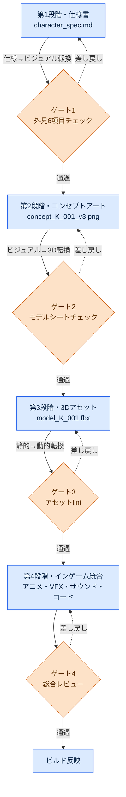
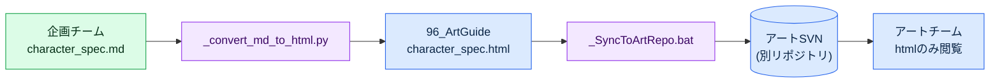

# 12.3 仕様書→コンセプト→インゲームアセットのフロー

スプリントの終盤、コンセプトアーティストが社内メッセンジャーにキャラクターのラフ案を1枚投げてきました。「これ、学者ギルドのシニアで合ってますよね？」画面の中の人物は30代の男性で、革の鎧を着ていました。仕様書には40代の女性、グレーの学者ガウンと書かれていました。どこで食い違ったのか追跡してみると、コンセプトアーティストが受け取った資料は2か月前のバージョンの仕様書で、その間に外見ガイドは2回変わっていました。変わった事実を知っている人は、プランナー本人だけでした。

この事故は技術の問題ではありません。フローの問題です。仕様書の1ページがゲーム内のアセットになるまで平均4〜8週間。その間、キャラクター1人の情報はプランナーの頭の中からコンセプトアーティストへ、モデラーへ、アニメーターへと、手から手へ渡っていきます。渡す瞬間ごとに様式がずれる可能性があり、ずれたまま受け取ってしまえば、受け取った人は推測で空欄を埋めます。その推測は2か月後、社内メッセンジャーの1行になって返ってきます。

本章では、その手から手へのフローを、一人の記憶ではなくシステムの上に載せる方法を扱います。

---

## 12.3.1 手から手へ — 4段階と転換点

プロジェクトAでキャラクターアセットが流れていく道は4段階です。重要なのは段階そのものではなく、段階と段階の間の転換点です。事故は段階の中ではなく、ある段階から次の段階へアセットを渡すその瞬間に起きます。

このフローは文章で説明する代わりに図で示すべきところですが、本書では全24部を通じて、手でボックスを描く代わりにClaudeからmermaidコードを受け取ってレンダリングしてきました。本章は、まさにその技法を適用して描いた結果を本文に載せます。自分の技法を自分の本文で証明するわけです。以下が、Claudeに「spec→assetの4段階フローを、転換点のゲートが見えるようにmermaidで」と依頼して受け取った出力を、そのままレンダリングしたものです。



3つの転換点（仕様→ビジュアル、ビジュアル→3D、静的→動的）ごとにゲートが立っています。ゲートとは、決裁書類を次の部署へ回す前に様式を検査する窓口です。様式が合わなければ差し戻し（点線）となり、前の段階に戻ります。様式の合わない書類を受け取ってしまえば、次の部署は空欄を推測で埋めます。メッセンジャー事故は、ゲート1がないときに起きます。

mermaidの利点がこの図に表れています。ゲートをもう1つ追加したり段階の順序を変えたりするとき、ボックスを描き直すのではなく、テキストを1行直せば済みます。図がテキストだからバージョン管理の対象になり、仕様書の隣に一緒にコミットされます。

---

## 12.3.2 第1段階 — 仕様書がすべての入力の根

フローの出発点は、1枚のMarkdown（マークダウン）仕様書です。この文書が、後に続く3段階すべての入力になります。ここに空欄があれば、その空欄は消えるのではなく次の段階へ押し付けられ、推測に変わります。

以下が、実際に作成している`character_spec`の様式です。`related_atoms`フィールドが、この仕様をJIT atomシステム（第11部参照）につなぎます。

```markdown
---
title: 学者ギルドシニア K_001 キャラクター仕様
type: character_spec
layer: L2
related_atoms: [character_K_001, voice_profile_K_001]
status: draft
---

## 1. アイデンティティ
- 名前: (TBD)
- 役割: 学者ギルドシニア、メインNPC、仲間化可能
- 勢力: scholar_guild
- 性格: 学者_厳格、権威的だが公正

## 2. 外見ガイド
- 年齢: 40代
- 性別: 女性
- 体格: 平均よりやや大きい (170cm相当)
- 衣装: グレー + 紫アクセント、学者ガウン、眼鏡

## 3. 表情・姿勢
- 平時: 沈着、口角は下がり気味
- 怒り時: 沈黙 + 視線の遮断
- 悲しみ: 話題転換、表情変化は微細

## 4. ゲーム内の役割
- メインクエスト chapter 1·5·12 に登場
- サイドクエスト 8件を発注
- 仲間合流 chapter 7

## 5. 音声・セリフ
- voice_profile: scholar_K_001
- 代表セリフ 3つ:
  - "それは記録のない話ですか？"
  - "感情で決めないでください。データが先です。"
  - "...あなたの選択ですね。分かりました。"

## 6. 参考資料
- 実在の学者5名の画像 (legal レビュー完了)
- refgameのキャラクタートーンを参考
```

外見6項目（セクション2の年齢・性別・体格・衣装、そしてセクション3の表情・姿勢）が、ゲート1のチェックリストになります。メッセンジャー事故の原因だった「40代の女性／グレーのガウン」の2行が、まさにこのセクションです。ゲート1が機能していれば、コンセプトアーティストが受け取った資料の外見6項目が現在の仕様書と一致するか、渡す前に検査されていたはずです。

### ワークド・トランスクリプト — 仕様書の空欄を埋める1往復

仕様書をゼロから手ですべて埋める代わりに、アイデンティティと役割だけを決めておき、外見・表情のドラフトをClaudeから受け取ります。以下は、実際の1往復の全文です。要約していません。

**プロンプト（全文）：**

> 以下のキャラクターのアイデンティティ・役割は確定だ。これをもとにcharacter_specの「2. 外見ガイド」と「3. 表情・姿勢」のドラフトを埋めよ。
> - 役割：学者ギルドのシニア、メインNPC、仲間化可能
> - 性格：学者_厳格、権威的だが公正
> - 勢力：scholar_guild
> 制約：refgameのトーン（東洋ファンタジー、彩度低め）。外見はシルエットだけで他のメインNPCと区別できること。表情は怒り・悲しみを直接表に出さない抑制型で。

**Claudeの生の出力（そのまま、手を加えていません）：**

> ## 2. 外見ガイド
> - 年齢：40代後半
> - 性別：女性
> - 体格：痩せ型、165cm前後（※「権威的」を身長で表現するか姿勢で表現するか要確定 — 私は姿勢の方を推奨します）
> - 衣装：濃紺の学者服、銀糸の刺繍（※勢力のカラーパレットが分かりません。scholar_guildの代表色は別にありますか？）
>
> ## 3. 表情・姿勢
> - 平時：顎をやや上げた正姿勢、視線は相手よりやや上
> - 怒り時：口数が減り、口調だけ冷たくなる
> - 悲しみ：窓の外を見る動作で代替、顔はほとんど変化なし
>
> もう1つ。「仲間化可能」なら戦闘中の表情も必要になるはずですが、それはこの仕様の範囲外ですか？

**人による検証・拒否：**

この出力は半分だけ採用しました。表情・姿勢のセクションはほぼそのまま受け取りました — 抑制型という制約を正確につかんでいて、「窓の外を見る動作で悲しみを代替」は仕様書になかった良いディテールです。外見は拒否しました。理由は2つです。第一に、体格を「痩せ型、165cm」としていますが、確定済みの仕様書は「平均よりやや大きい、170cm」でした。Claudeはアイデンティティ・役割しか受け取っていないので体格を知りようがなく、推測したのです — まさにゲートが止めるべき推測です。第二に、衣装の濃紺はrefgameのトーンには合っていますが、私たちのゲームのscholar_guild代表色（グレー＋紫）と衝突します。Claudeが投げた質問（「勢力の代表色は別にありますか？」）が、まさにこの衝突を先回りして突いていました。

**再依頼：**

> 良い。表情・姿勢は採用。外見は次の値で固定して整理し直せ。体格 = 平均よりやや大きい170cm、衣装 = グレーの学者ガウン＋紫のアクセント（scholar_guildの代表色）、眼鏡着用。戦闘の表情はこの仕様の範囲外なので外せ。

この1往復から学べるのは、Claudeが空欄を推測で埋めたその場所こそが、仕様書の空欄だったということです。分からない値に出会ったとき、Claudeの挙動は2つに分かれました。勢力の色と戦闘の表情は「これは分からない」と質問として持ち上げ、その質問はゲートのチェックリストより先に欠落を突き止めました。一方、体格は分からないという表示なしに、もっともらしい数字で埋めてしまいました。後者がある限り、人が確定済みの仕様書と1行ずつ突き合わせる検証は省略できません。

---

## 12.3.3 第2段階 — コンセプトアート、そしてゲート1

確定した仕様書がコンセプトアーティストに渡ります。フローは§12.1.2のコンセプトワークフローと同じです。AIで数十〜数百枚を量産し、ひと握りにキュレーションし、1〜3案を手作業で整えたうえでモデルシート（正面・側面・背面）を作ります。

核心は、この段階の終わりに立つゲート1です。モデルシートが第3段階（3D）へ渡る前に、次の5項目を検査します。

| 項目 | 確認基準 |
|---|---|
| 仕様書の外見6項目への適合 | 衣装・体格・年齢・性別・表情・姿勢が現在の仕様書と一致 |
| メインNPC間のシルエット区別 | シルエットだけで他のキャラクターと識別可能 |
| ArtGuide `01_Character/_STYLE_GUIDE`の遵守 | 領域スタイルガイドへの違反なし |
| voice_profileとの矛盾なし | 視覚的な印象が音声の印象と衝突しない |
| 縮小時の識別性 | UI・ミニマップのサイズに縮めても誰なのか分かる |

ここで`image_prompt_design_intent_first` atomが働きます。コンセプトアーティストがプロンプトを書くときも、「グレーのガウンの女性学者」という外見の単語から並べるのではなく、仕様書の設計意図（「権威的だが公正」「感情を抑制する学者」）から入れます。外見キーワードだけを握って数百枚を量産すると、服の色は合っているのに眼差しが学者ではない絵が山ほど出てきます — 意図を先頭に置くのは、その「外見は合っているが印象はずれている」山をあらかじめ減らすためです。量産ツールは§12.1.1・§12.2.5と同じです — セルフホスティングのSD（SDXL）/ComfyUIにキャラクターLoRA（顔・衣装の固定）とControlNet（ポーズ・シルエットの固定）を併せてかけ、同じ人物を別のポーズで数百枚出力しても顔が崩れないようにします。

ゲート1の最初の項目「仕様書の外見6項目への適合」が、メッセンジャー事故を防ぐ直接のかんぬきです。コンセプト案がモデルシートとして固まる前に現在の仕様書と突き合わせるので、2か月前のバージョンを手に作業したずれは、この場所で引っかかります。

---

## 12.3.4 非プランナーとの協業 — mdは企画チームだけ、アートチームはhtmlだけ

ここで1つ、運用上の非対称に触れておく必要があります。ここまで見てきた仕様書はすべてMarkdownですが、コンセプトアーティストと3Dモデラーは、Markdownを読むためにゲーム会社に来た人たちではありません。そこでプロジェクトAは、§12.2.4で見た一方向変換パイプライン（「企画チームはmdで決定、アートチームはhtmlだけを見る」）をspec→assetフローにもそのまま使います。企画チームが下したmdの決定をhtmlに変換して別のアートSVNへ押し込み、アートチームはhtmlだけを見ます — mdの学習コストは0です。



`_convert_md_to_html.py`がmdを読みやすいhtmlに変換し、`_SyncToArtRepo.bat`がその結果を企画SVNではなくアートSVNへpushします。2つのリポジトリを分離する理由はPC分離の原則と同じです — 一方の作業フローがもう一方を上書きしないように保護することです。変換は常に企画→アートの一方向で、アートチームがhtmlに手を入れても企画のmdへ逆流しません。

その変換の終着点である`96_ArtGuide`は、7つのドメイン（`00_Common`・`01_Character`〜`07_Env`）に分かれています。各ドメインは自分の`_STYLE_GUIDE`で自治しつつ、`00_Common`が全ドメイン共通の規約（彩度範囲・命名・解像度）を束ねます（構造の図は§12.2.1）。ゲート1の3番目のチェック項目が、まさにこの`01_Character/_STYLE_GUIDE`の遵守かどうかです。

---

## 12.3.5 第3段階 — 3Dアセットと自動lint

モデルシートが3D段階へ渡ると、8つの工程を経ます。ハイポリモデリング→リトポロジー（ゲーム用ローポリ）→UVアンラップ→テクスチャー→リギング・スキニング→テストポーズ→チェック、という流れです。この段階は、AIが最も弱い区間です。3D生成モデルはまだゲーム品質のリトポロジー・UVを出してくれないため、人と従来のツールが主役です。

代わりにこの段階には、ゲート3、すなわち自動アセットlintが付きます。人が毎回ポリゴン数を数えるのではなく、アセットがコミットされた瞬間に自動で検査されます。

| 検査項目 | 通過条件 |
|---|---|
| ポリゴン数 | キャラクターあたり標準範囲（著者の運用基準 40,000〜80,000） |
| テクスチャー解像度 | 2048×2048標準 |
| UV unwrapの効率 | 活用面積80%以上 |
| ボーン（bone）数 | 標準ボーンセットの遵守 |
| アセット命名規則 | 第11部の命名規則の遵守 |

違反が見つかると、該当する3Dアーティストに通知が飛びます。人の目利きに頼っていた検査を、決定論に移したわけです。ポリゴン数・解像度のような項目は正誤が明確なので、AIでも人でもなく、lintスクリプトの持ち分です。

ここで不可逆な段階が1つ登場します。テクスチャーを焼くレンダリング工程です。一度ベイクしたテクスチャーは元に戻せないので、レンダリング直前にゲート3がもう一度働きます。第4段階のモーションキャプチャーも同じく不可逆です — キャプチャーセッションは、俳優と機材をもう一度呼ばない限りやり直せません。不可逆な段階の前のゲートは、他のゲートより厳格に運用します。

---

## 12.3.6 第4段階 — インゲーム統合と総合レビュー

3Dアセットにアニメーション・VFX・サウンド・コードが合わさり、ゲームの中に初めて登場します。すべての分野が一堂に会する段階であり、ゲート4（総合レビュー）が最後のかんぬきです。

| レビュー項目 | 担当 |
|---|---|
| 仕様書の意図への適合 | プランナー |
| ビジュアルのトーン・一貫性 | アートディレクター |
| アニメーションの自然さ | アニメーションディレクター |
| ゲーム内での識別性 | ゲームディレクター |
| パフォーマンス（frame負荷） | テクニカルアーティスト |

キャラクター1体あたり5人が30分〜1時間かけて見ます。この段階のlintはアセットとリソースのマッピング（`Skill_Art_Resource_Mapping`）が自動で回り、インゲームに実際に紐付いたリソースと仕様書が指すリソースが一致するかを検査します。統合段階でのAIの役割は、ビジュアルリグレッションテストとlintの自動化に限定されます — 何を見せるかを決めるのではなく、昨日と今日のフレームが意図せず変わっていないかをピクセルで突き合わせる、決定論的な作業です。

---

## 12.3.7 変更が1つの段階に触れると、下流のすべてが揺れる

本章冒頭のメッセンジャー事故は、実は2つの事故が重なったものです。1つはゲート1の不在（ずれた資料が通過）、もう1つは変更追跡の不在（外見ガイドが2回変わった事実が下流へ伝播しなかった）です。2番目の事故を防ぐのが、変更影響の追跡です。

キャラクター1人のどの段階の資料でも変わると、その下流のすべての資料が影響を受けます。これを人が毎回手で計算すると、必ず抜けが出ます。そこで、チェーン上の位置を見て下流の資料を自動でかき集めるツールを置きます。

```python
# spec_change_impact.py
# チェーンのどこかの地点が変わったら、その下流(downstream)アセットを全部集める。

CHAIN = ["spec", "concept", "model", "texture", "rig", "anim", "vfx", "ingame"]

def find_downstream_artifacts(spec_id, changed_field):
    artifacts = []
    chain_position = get_chain_position(changed_field)   # 例: "외형.의상" → "spec"(0)
    for stage in CHAIN[chain_position + 1:]:              # specの下流すべて
        artifacts.extend(get_artifacts(spec_id, stage))
    return artifacts

# 使用: K_001の衣装が変わったら？
changed = find_downstream_artifacts("K_001", "외형.의상")
# → ["concept_K_001_v3.png", "model_K_001.fbx",
#     "texture_K_001_diffuse.png", "rig_K_001.fbx", ...]
```

`changed_field`が`"외형.의상"`（外見.衣装）ならチェーン上の位置は0番（spec）で、その下流であるconcept・model・texture・rigのすべてが影響リストに載ります。このリストが自動通知で担当者たちに届きます。机の上の決裁トレーの比喩で見ると、1番のトレーを修正した瞬間に2〜8番のトレーへ自動で赤い旗が立ち、旗の立ったトレーはレビューキューに再び入ります。メッセンジャー事故は、まさにこの旗がなかったために起きました — 1番（仕様書の外見）が2回変わったのに、2番（コンセプト）に旗が立たなかったのです。

---

## 12.3.8 測定 — 4段階標準化の効果

以下は、著者が運用したプロジェクトAの標準化前後の比較です。絶対的な時間・件数は著者の推定（未検証）であり、信頼できるのは方向とおおよその比率です。

| 項目 | 標準化前 | 標準化後 | 方向 |
|---|---|---|---|
| キャラクター1体（仕様書→インゲーム） | 8〜12週間 | 4〜6週間 | 約半分 |
| 段階間の推測事故 | 四半期あたり10〜15件 | 四半期あたり2〜3件 | 大幅減 |
| 変更漏れ事故 | 四半期あたり8〜10件 | 四半期あたり1〜2件 | 大幅減 |
| 総合レビュー時間（キャラクターあたり） | 分散・反復（計4〜6時間） | 30分〜1時間に集中 | 集中化 |
| 新規キャラクターデザイナーのオンボーディング | 約2か月 | 約1か月 | 約半分 |

キャラクターのサイクルがおよそ半分に縮みました。ただし、この数字を誤解してはいけません。標準化は、すべてのキャラクターを同じ速度で打ち出すコンベヤーではありません。メインキャラクターには依然として8週間近くをかけ、端役は4週間で仕上げます。標準化がやったのは、速度を均一にしたことではなく、段階ごとの時間の差を揺らぎなく維持できるようにしたことです。標準が統制に流れると、作り手の創造の時間を削る事故になって返ってきます — 標準化の目的は推測と漏れをなくすことであって、時間を圧縮することではありません。

---

## 12.3.9 段階別のAIの持ち場

| 段階 | AIの役割 | 強度 |
|---|---|---|
| 1. 仕様書 | ドラフト作成の補助、欠落の質問（プランナーがレビュー） | 強 |
| 2. コンセプト | Stable Diffusion（SDXL）・ComfyUIでの量産（LoRA・ControlNet）、LLMプロンプト | 強 |
| 3. 3D | 生成モデルが未成熟、人・従来ツールが主役 | 弱 |
| 4. 統合 | ビジュアルリグレッション・lint自動化 | 決定論 |

第1・2段階ではAIが強く、第3段階は人が、第4段階は決定論的なツールが受け持ちます。この分離が定着すると、各段階の責任が明確になります — どこまでがAIのドラフトで、どこからが人の決定なのか、ゲートの前で迷わなくなります。

---

## 12.3.10 よくある失敗と処方箋

| パターン | 処方箋 |
|---|---|
| 仕様書が外見・表情の6項目を欠落 | 第1段階で必須チェック、AIに欠落の質問を出させる |
| コンセプト段階のゲートを省略 | モデルシートが固まる前に外見6項目の突き合わせを強制 |
| 変更影響を手で計算 | spec_change_impactで自動追跡 |
| 総合レビューを最後にまとめて実施 | 段階ごとにゲートを分散 |
| アセットlintなしでビルド | ゲート3で自動ブロック |
| 4週間ですべてのキャラクターを強制圧縮 | 段階ごとの時間の差を維持 |

最初の行と3行目が、本章冒頭のメッセンジャー事故への直接の処方箋です。

---

### 本章のポイント
- 事故は段階の中ではなく、段階の間の転換点で起きます — ゲートがその場所を守ります。
- 仕様書の空欄は消えず、下流へ押し付けられて推測になります。
- 変更影響の自動追跡が、漏れ事故を防ぐ最大のガードレールです。

### 次章のプレビュー
- 13.1 FAQ・メタゲーム分析 — データ・KPIの始まり

---

## やってみよう — spec→assetフローの最小構築

**setup**
1. `character_spec.md`の様式を1つ作ります（アイデンティティ・外見6項目・表情・役割・音声・参考の6セクション、`related_atoms`フィールドを含む）。
2. md→html変換スクリプト（`_convert_md_to_html.py`のようなもの）を置き、アートチームにはhtmlだけを共有します。
3. 4つの転換点にゲートのチェックリストを付けます（外見6項目／モデルシート／アセットlint／総合レビュー）。

**prompt**
> 以下のcharacter_specのアイデンティティ・役割は確定だ。「外見ガイド」と「表情・姿勢」のドラフトを埋めよ。ただし分からない値は推測せず、質問として明示せよ。制約：refgameのトーン、シルエットだけで区別可能、抑制型の表情。

**verify**
1. AIが推測した値（特に体格・色）を確定済みの仕様書と1行ずつ突き合わせます — ずれていたら拒否し、固定値で再依頼します。
2. ゲート1のチェックリスト5項目を、モデルシートへ渡す前に通過させます。
3. 外見の1行をわざと変えてみて、`spec_change_impact`が下流アセットのリストを正確に吐き出すか確認します。

### 一人ミニ版
一人で作業しているなら、変換パイプライン・アートSVN・5人レビューは過剰です。最低限、次の2つだけ残してください。（1）`character_spec.md`という1つの様式 — 外見6項目は必須、空欄は禁止。（2）外見を変えるたびに「この変更が届く下流ファイル」を仕様書のいちばん下に1行、手で書き留めておく習慣。ツールがなくても、その1行が変更漏れ事故を防ぎます。
