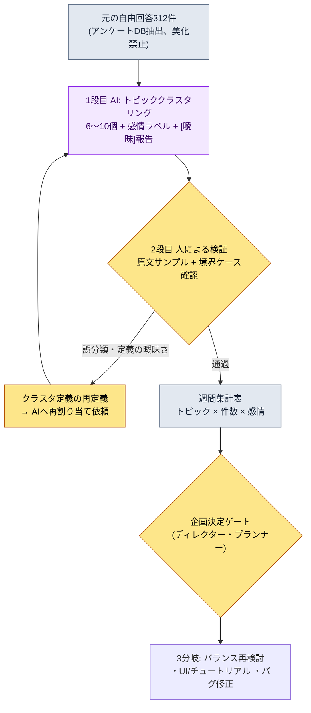
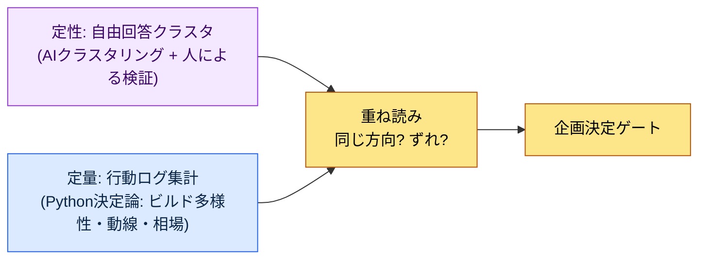

# 13.1 自由回答数百件をトピックに — クラスタリングはAI、診断は人間

> 主な読者: ユーザーフィードバックとメタゲームを読み解く必要があるMMORPGプランナー（中規模（10〜50人）チーム）
> 一人・趣味開発の読者向け縮小バージョン: §13.1.8「一人ならここまでで十分」

アップデートを配信した翌朝、ゲーム内アンケートの自由回答欄に312件が積み上がっていた画面を覚えています。一言だけの短い文から、5行にわたる怒りまで入り混じっていました。企画チームの誰も、その312件をすべては読みませんでした。正確に言えば、読めなかったのです。読んだとしても「だいたい強化がきついという話が多いですね」程度の印象で会議に入り、その印象は最も声の大きい5件が作った錯覚でした。312件が実際に何を語っているのかは、誰も知りませんでした。

本章では、その312件を人がすべて読まなくても「何が何件」と言えるようにする方法を扱います。核心は2つです。第一に、数百件の自由回答を**トピックに束ね、感情をラベリングする**退屈な分類をAIに任せます。第二に、AIのクラスタを鵜呑みにせず、人が**誤分類を1件捕まえて拒否し、再依頼**します。FAQ・メタゲーム分析の一般論は他の書籍にもあるので、本章はその分析を*AIワークフローで回す部分*だけに集中します。

---

## 13.1.1 自由回答は「読む資料」ではなく「分類する資料」

FAQと自由回答は、プランナーが意図したゲームとユーザーが実際に体験しているゲームの差を映し出す鏡です。同じ質問が案内デスクに1日30回寄せられるなら、対応の人員を増やすのではなく、案内板をデザインし直すべきです。問題は、その「30回」を数える作業です。自由回答は構造化されたログではないので、`GROUP BY`がかけられません。「強化が高すぎます」と「財貨が足りなくて育てられません」は同じトピックですが、文字列が異なります。人が目視で束ねると312件に2〜3時間かかり、束ねる基準も人によってぶれます。

ここがAIの入る場所です。自由回答の分類は、(1)量が多く、(2)退屈で、(3)自然言語の意味判断が必要 — つまり決定論的なコードでは対応できず、人がやるには高くつく作業です。ただし、最初に釘を刺しておくことが1つあります。**AIが作るのはトピッククラスタ（仮説）であって、確定診断ではありません。**「強化への不満38%」はAIがラベルを付けた結果にすぎず、それが「強化を下方修正せよ」という決定に直結してはいけません。第13部全体を貫く原則が、ここでもそのまま当てはまります — KPIの定義と最終診断は人、自然言語の束ねと1次ラベリングはAIです。

自動化の本当の価値もこの点にあります。分類を自動化すると、分析自体が速くなること以上に、**312件という信号が毎週の朝、分類された形でデスクに届く**ことが核心です。自動化の価値は時間の節約ではなく信号の露出です（チーム運営の概念 `automation_signal_value_over_time_savings`）。郵便受けに積もるだけだった手紙が、毎日仕分けされて担当部署に配達されるようになる違いです。

---

## 13.1.2 [ワークド・トランスクリプト] 自由回答312件 → トピッククラスタ

実際にどう回すのか、1サイクルを最後まで見せます。以下は著者のプロジェクト（モバイル優先MMORPG、以下「プロジェクトA」）のゲーム内アンケート自由回答をトピッククラスタリングしたセッションを忠実に再現したものです。入力プロンプトはそのままコピーして使えますし、出力は実際のセッションを再構成したものです。

### ステップ1 — 入力: 自由回答をそのまま投げる（加工なし）

まず元の自由回答を、機械が読める形式で抽出します。これはアンケートDBから取り出すだけなので、新しく書くものではありません。重要なのは、**美化も要約もせず、誤字・暴言・一言だけの回答まで生のまま**入れることです。分類の精度は、原文が生であるほど上がります。

```jsonl
# survey_freetext_2026-W21.jsonl (抜粋、312件中6件)
{"id": 0041, "text": "強化費用おかしいだろ(-_-) +10行くのに財貨が全然貯まらない"}
{"id": 0088, "text": "ボスのパターンは面白いけど報酬が渋すぎます"}
{"id": 0102, "text": "ギルド戦のマッチング長すぎ 5分以上待たされる"}
{"id": 0156, "text": "課金しないと強化できない これがゲームかよ"}
{"id": 0203, "text": "新ダンジョンの雰囲気いいですね 音楽もいいし"}
{"id": 0274, "text": "メールの報酬なんで来ないの？ バグっぽい"}
```

### ステップ2 — プロンプト: クラスタリングをさせつつ、カテゴリ・根拠・[曖昧]の報告を強制する

```
添付した survey_freetext_2026-W21.jsonl(アンケート自由回答312件)をトピック6〜10個に
束ねて、各回答に否定/中立/肯定のラベルを付けて。細かく刻みすぎず、回答1件は
必ず1つのクラスタだけに。合わなければ「その他」へ。クラスタごとに件数・比率・主要感情・代表原文1件を
表で出して、割り当てに確信が持てないものは無理に入れず[曖昧]リストに分けて理由を1行ずつ。
解説は省いて、(ア)クラスタ定義 (イ)集計表 (ウ)[曖昧]リストだけ。
```

このプロンプトで分類を指示している言葉は最初の2行だけで、残りはすべて出力の形を縛る制約です。AIに自由を与えると、クラスタを20個に刻んだり、すべての回答をどこかへ無理やり押し込んだりします。それを防ぐのが、**クラスタ数の上限（6〜10）、単一割り当て、感情の3分類、そして「確信が持てなければ[曖昧]へ出せ」という逃げ道**の4行です。分類の精度はこの柵から生まれます。

### ステップ3 — Claudeの出力（再構成、抜粋）

```
(ア) クラスタ定義
C1 強化/成長コスト  — 強化・財貨獲得の要求が過剰だという不満
C2 課金プレッシャー   — 無課金/微課金が成長から排除されているという認識
C3 コンテンツ報酬不足 — ボス・ダンジョンなどプレイに見合わず報酬が渋いという意見
C4 マッチング/待機時間 — ギルド戦・マッチングの待ちが長いという不満
C5 コンテンツ好評    — 新ダンジョン・演出・音楽など肯定的な反応
C6 バグ/支給漏れ    — 報酬未支給・不具合の報告
その他            — 上記6つに合わない単発もの

(イ) 集計表
| クラスタ | 件数 | 比率 | 主要感情 | 代表原文                                   |
|----------|------|------|----------|--------------------------------------------|
| C1 強化コスト | 71 | 23%  | 否定     | "強化費用おかしいだろ(-_-) +10行くのに財貨が全然貯まらない" |
| C2 課金プレッシャー | 58 | 19%  | 否定     | "課金しないと強化できない これがゲームかよ"        |
| C3 報酬不足 | 49 | 16%  | 否定     | "ボスのパターンは面白いけど報酬が渋すぎます"        |
| C4 マッチング待機 | 34 | 11%  | 否定     | "ギルド戦のマッチング長すぎ 5分以上待たされる"      |
| C5 コンテンツ好評| 41 | 13%  | 肯定     | "新ダンジョンの雰囲気いいですね 音楽もいいし"          |
| C6 バグ支給漏れ | 28 | 9%   | 否定     | "メールの報酬なんで来ないの？ バグっぽい"                |
| その他       | 31 | 10%  | 混合     | (単発多数)                                 |

(ウ) [曖昧]リスト (4件)
- id 0088 "ボスのパターンは面白いけど報酬が渋すぎます"
  → C3(報酬不足)に割り当てたが、前半はC5(好評)とも重なる。複合回答。
- id 0156 "課金しないと強化できない" → C1とC2の境界。C2へ送った。
- (ほか2件)
```

出力で最も価値があるのは集計表ではなく、**一番下の[曖昧]リスト**です。AIが自分の割り当ての不確実性を報告し、人に引き渡した場所です。良いプロンプトとは、AIが「これは確信が持てません」と言えるようにするものです。

### ステップ4 — 検証と拒否（人の出番）

この出力をそのまま報告に載せてはいけません。人が原文のサンプルを自分で当たります。実際にこのセッションでは1件が引っかかりました。

C2（課金プレッシャー）の58件を開いて原文を流し読みしていたところ、`id 0156 "課金しないと強化できない これがゲームかよ"`が目に留まりました。AIはこれをC2（課金プレッシャー）に送りました。しかし、この文の一次的な痛みは「課金」ではなく**「強化できない」** — つまりC1（強化コスト）です。ユーザーは強化の壁に阻まれ、その壁の原因を課金だと指摘したのであって、課金そのものが不満の核ではありません。C1とC2が隣接していて紛らわしいのは確かですが、これをC2として数えると「強化コスト」の信号が23%より小さく見え、本来手を入れるべき強化曲線が優先順位から押し出されます。誤分類1件が決定の方向を変えうる境界ケースです。

そこで拒否して再依頼します。

```
C1(強化コスト)とC2(課金プレッシャー)の境界が紛らわしいな。一次的な痛みが「成長の壁そのもの」ならC1、
「課金しないと排除されるという公平性」ならC2で引き直して。id 0156は「強化できない」が
核だからC1。この基準で境界にかかったものを再割り当てして、変わった件数だけ教えて。
```

AIは境界を引き直し、C2にあった9件をC1へ移しました。その結果、C1は71→80件（26%）、C2は58→49件（16%）に変わりました。**強化コストが単一最大トピックだという絵柄は同じでしたが、その大きさが23%から26%へとくっきりしました。**1往復で信号の輪郭が鮮明になります。この再割り当て件数（9件）と比率の変化は、このセッションで実際にカウントした値です（標本312件、単一週）。

ここで1つはっきりさせておきます。人が拒否したのは「AIが間違っていたから」ではありません。C2への割り当ても解釈としては成立しました。人がしたのは、**クラスタ定義（=KPI定義）をより鋭く研いでAIにフィードバックしたこと**です。定義は人が、その定義で312件を洗い直す労働はAIが担います。

---

## 13.1.3 パイプライン — 自由回答から決定ゲートまで

上のセッションを毎週自動で回すと、パイプラインになります。人の手が触れる場所は2か所だけです。クラスタ定義を鋭く定める場所（前）と、分類結果を決定につなぐゲート（後）。その間の312件の束ねとラベリングはAIが回します。



決定的な設計は、2段目（人による検証）がAI出力を自動通過させないという点です。自動通過型にすると、AIが一度間違って引いた境界が、毎週同じ方向に信号を歪めます。疑わしい候補（[曖昧]リスト）はAIが挙げますが、クラスタ定義を直すかどうかは人が決めます。そして集計表は、それ自体が決定ではなく、**決定ゲートへの入力**にすぎません。「C1強化コスト26%」はディレクターに強化曲線を覗き込ませる信号であって、自動下方修正のトリガーではありません。

---

## 13.1.4 メタゲーム — 自由回答と行動ログを重ねて見る

自由回答が「ユーザーが言ったこと」だとすれば、メタゲームは「ユーザーが実際にやったこと」です。リリースされると、プランナーが意図しなかったプレイ方式が定着しますが、それがメタゲームです。ビルドメタ（特定スキル構成への偏り）、動線メタ（好まれる狩り経路）、取引メタ（公式相場と異なるユーザー間の合意価格）のようなものです。これは自由回答と違って**行動ログで定量的に測定**でき、決定論的なコード（Python）が集計します。AIが入り込む場所ではありません。

核心は、2つを**重ねて見る**ことです。上のセッションではC1（強化コスト）の不満が26%で最大でした。このとき、行動ログでビルド多様性指数（上位スキル構成への集中度）が同じ週に下がっていたなら、「言葉でも行動でも、1つのビルド・1つの成長経路へ収束しつつある」という2つの信号が同じ方向を指しています。定量と定性が一致するとき、決定の確信が固まります。逆に、自由回答は静かなのに行動ログだけが1つのビルドへ偏っていくなら、ユーザーが不便を感じながらも口にしない（=静かな離脱の直前）危険信号かもしれません。



ここでも分業は明確です。行動ログの集計は**AIではなくコード**が行います。ビルドの占有率や取引相場は、呼び出すたびに答えが変わってはいけない決定論的な数値だからです。AIは自由回答という非構造化テキストを束ねることだけに使い、定量KPIはコードで釘付けにします。

---

## 13.1.5 本章の数値の出所

本章の比率は、序文「一つの約束」の原則に従います。§13.1.2の「C1 23%→26%、再割り当て9件」は標本312件（単一週）で実際にカウントした値なので、絶対値ではなく「強化コストが単一最大トピック」という*方向*として読みます。因果は断定しません — 「FAQ分析をしたら継続率（リテンション）が上がった」のような表はありません。代わりに、このワークフローで実際に測定できるのは3つです: クラスタ検証で人が覆した誤分類の件数（0なら検証が形式的だったという信号）、週間集計の算出までにかかった時間、定量・定性信号が一致しているかどうか。

---

## 13.1.6 破棄・再依頼はツールの失敗ではなくゲートの信号

§13.1.2では、人がC2割り当ての9件を覆しました。検証を毎週回すと、この種の覆しが毎回0〜数件ずつ出ます。重要なのは、**覆し0件が目標ではない**という点です。検証で1件も覆らないなら、2つのうちどちらかです — AIが完璧だったか（まれです）、検証者が原文を見ずにハンコだけ押したか。後者が圧倒的に多いのです。

毎週1〜2件の境界ケースが引っかかり、それをきっかけにクラスタ定義が少しずつ鋭くなっていくとき、検証ゲートは実際に機能しています。これは、AIの分類精度を人が定期的にサンプリングしてレビューすべきだという一般原則の具体形です。同じユーザータイプが別のトピックへ散らばる誤分類は、人のレビューなしに自動分類だけを信頼すると、毎週積み重なっていきます。

---

## 13.1.7 よくある失敗

| パターン | なぜ失敗するのか | 処方 |
|---|---|---|
| 自由回答を人が目視で流し読みするだけ | 声の大きい5件が312件を代表する錯覚 | AIクラスタリングで全数分類（§13.1.2） |
| 「AIさん、ユーザーフィードバックを分析して」と丸投げ | クラスタが20個に刻まれるか、無理やり割り当てられる | クラスタ数の上限・単一割り当て・[曖昧]の強制 |
| AIの集計表を検証なしで報告 | 境界の誤分類が決定の方向を変える | 原文サンプル + 境界ケースの直接確認 |
| 集計比率を決定に直結 | 「不満26%だから下方修正」と自動トリガー化 | 集計表は決定ゲートへの入力にすぎない |
| 定性だけ見て行動ログを無視 | 言葉にしない静かな離脱を見落とす | 定量（コード）・定性（AI）を重ね読み（§13.1.4） |
| 定量KPIをAIに集計させる | 呼び出すたびに数値が変わりバランスが揺れる | ビルド・相場の集計は決定論的なコードで |

3つ目が最も見落とされがちです。集計表はきれいなので、そのまま信じたくなります。しかし、id 0156の1件のように、境界の誤分類1つが優先順位を丸ごと変えることがあります。検証とは312件を読み直すことではなく、**最も大きい2〜3個のクラスタの境界ケースだけ**を原文で確認する作業です。

---

## 13.1.8 やってみよう — 今日できる一歩

> **一人ならここまでで十分**: アンケートDBがなくても大丈夫です。自分のゲーム（または好きなゲーム）のストアレビュー・コミュニティ投稿を30〜50件だけテキストで集め、§13.1.2のプロンプトをそのまま貼り付けて一度回してみましょう。出てきたクラスタの中から「これは少しおかしいのでは」と思う割り当てを1件選び、「この回答の一次的な痛みは別のトピックだ。定義を引き直して再割り当てせよ」と反論してみると、クラスタリングがどんな判断の束なのかが体に入ってきます。

チームなら、次の一歩から始めましょう。自由回答の1週間分を`survey_freetext_YYYY-Www.jsonl`として美化なしで抽出し、§13.1.2のプロンプトで一度回してみます。その次に、最も大きい2つのクラスタの境界ケースだけを原文で確認します。クラスタ定義を一度鋭く定めておけば、以後は毎週同じプロンプトで、再現可能な週間集計が自動的に積み上がっていきます。

---

### 本章のポイント
- 自由回答は読む資料ではなく、AIで全数分類する資料です。
- クラスタ定義（=KPI定義）は人、312件の束ねはAI。
- 検証で覆しが0件なら、ハンコだけ押したという信号です。

### 次章のプレビュー
- 13.2 KPI定義・追跡 — 5〜7個に絞った診断表と測定の落とし穴
