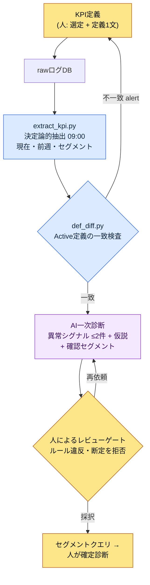

# 13.2 KPIの定義とトラッキング — 定義は人が、異常シグナルの診断はAIが

> 主要読者: 運営（ライブオプス）指標に責任を持つライブ/データプランナー（中規模（10〜50人）チーム）
> 一人/趣味の読者向け縮小バージョン: §13.2.8 「一人ならこれだけ」

毎週月曜の朝、同じ場面が繰り返されていました。データチームから届いた日次ダッシュボードのキャプチャを会議の画面に映し、誰かが「DAU（Daily Active Users、日次アクティブユーザー）が少し落ちている気がします」と言うと、別の誰かが「それは先週メンテナンスがあったからですよ」と受けます。数字はそこにあるのに、その数字が**異常シグナルなのかノイズなのか**を判定する人の頭の中の作業が、毎週ゼロからやり直しになっていました。そしてその判定は、話す人によって違いました。

この章の結論を先に書きます。KPIで人がやるべき仕事は、**何をKPIにするかを定義すること**と、**AIが上げてきた異常シグナルを確定診断に昇格させるか拒否するかを判定すること**、この2つだけです。その間に挟まる2つの仕事 — 毎日同じ時刻にrawログから数字を抽出する仕事と、前週比で何が揺れたかを自然言語で一次作成する仕事 — は、それぞれ決定論的なコードとAIが受け持ちます。KPI定義の一般論（5〜7個に絞れ、グッドハートの法則に気をつけろ）は他の書籍にも十分ありますから、この章はその定義を*AIワークフローで回す場所*だけに集中します。

---

## 13.2.1 KPIの定義は人の持ち場 — しかしその次は違う

KPI運営には、人にしかできない判断が2つあります。第一に、**何をKPIにするか**。第二に、**各KPIの定義を1文で確定すること**。この2つはゲームの価値判断なので、AIには委任できません。「Activeを5分以上のプレイとみなす」という決定には、そのゲームが何を健全さとみなすかが込められています。

問題は、この定義が一度揺れると、その上のすべての数字が一緒に揺れるという点です。「Active User」を一方のクエリでは*1回のログイン*、もう一方のクエリでは*10分+狩り1回*と取れば、DAUが丸ごとずれます。だから定義そのものより**定義の一貫性**を守る仕事が運営の半分を占めます。そして一貫性の検査は、人の頭ではなくコードがやるべきです（§13.2.5）。

定義が確定した後の仕事は、人の持ち場ではありません。毎日同じ時刻に数字を抽出する作業と、前週比の変動をなぞって異常シグナル候補を書き出す一次作成 — この2つは毎日繰り返され、人がやると基準がその日その日で揺れる、まさに機械とモデルに下ろすべき種類の仕事です。抽出は決定論（コード）に、一次診断はAIに渡します。人はAIが上げてきた候補を受け取り、**確定するか拒否するか**だけを判定します。

| 段階 | 誰が | なぜそこなのか |
|---|---|---|
| KPIの選定・定義 | 人 | ゲームの価値判断、委任不可 |
| 日次raw抽出 | コード（決定論） | 同じ入力 → 同じ数字、リグレッション検証が可能 |
| 前週比の異常シグナル一次作成 | AI | 自然言語の要約はAI向き、ただし「仮説」まで |
| 確定診断・セグメント確認の指示 | 人 | AIの仮説を昇格/拒否する、責任の持ち場 |

この分担がこの章全体の骨格です。以下で1サイクルを最後まで回してみます。

---

## 13.2.2 [ワークド・トランスクリプト] 日次ダッシュボードraw → 異常シグナルの自動作成

実際にどう回るのか、入力から人の判定まで1サイクルを最後まで見せます。以下は著者のプロジェクト（モバイル優先MMORPG、以下「プロジェクトA」）の日次KPI診断セッションを匿名化して再現したものです。rawログのスキーマ・抽出コードの構造・プロンプトは実際のツールを移したもので、数字は形式を見せるための例示値であり、実測KPIではありません。

### ステップ1 — 入力: 決定論的抽出が吐き出したrawの数字

まずコードが毎日09:00にログDBからKPIを抽出します。AIはこの数字を作りません — 受け取るだけです。抽出結果は、前週の同じ曜日と並べたJSONです。

```json
// kpi_daily_2026-06-05.json — extract_kpi.py の出力（LLMへの入力）
{
  "date": "2026-06-05",
  "compare_to": "2026-05-29",   // 前週の同じ曜日（金）
  "active_def": "min10_hunt1", // 適用されたActive定義ID
  "L0": {
    "ltv_12m_est":   {"v": 0,    "prev": 0,    "delta_pct": null},
    "d30_retention": {"v": 0,    "prev": 0,    "delta_pct": null}
  },
  "L1": {
    "dau":            {"v": 0, "prev": 0, "delta_pct": -0.0},
    "session_len_min":{"v": 0, "prev": 0, "delta_pct": -0.0},
    "sessions_per_u": {"v": 0, "prev": 0, "delta_pct": 0.0},
    "d7_retention":   {"v": 0, "prev": 0, "delta_pct": 0.0}
  },
  "segments": {
    "dau_by_platform": {"ios": 0, "aos": 0},
    "dau_by_region":   {"kr": 0, "sea": 0},
    "dau_by_newbie":   {"d0_7": 0, "d8plus": 0}
  }
}
```

値は0で空けてあります。重要なのは構造です。各KPIに現在値・前週値・変動率が付き、一番下に**セグメント分解**（プラットフォーム・地域・新規/既存）が一緒に載ります。AIが「DAUが落ちた」で止まらず、「どのセグメントで落ちたのかを確認しろ」まで行くには、この分解が入力に含まれている必要があります。

### ステップ2 — プロンプト: 形式・根拠・「確定診断の禁止」を強制する

```
添付の kpi_daily_2026-06-05.json は09:00に自動抽出された日次KPIで、compare_to は前週の
同じ曜日。L0~L1 のうち異常シグナルとみなせるものを最大2件だけ選んで。前週比の変動が
普段の曜日変動幅を外れたものに限る。普段の変動幅が不明ならでっち上げず「不明」と書いて外す。
候補ごとに指標・変動幅・推定原因の仮説1~2個・確認するセグメントを書くこと。ただし原因は必ず「仮説」とだけ
書き、確定のように断定しない。ログにないイベント・パッチなどの断定は禁止。セグメントは添付の
segments の中だけから指名すること。0件なら「0件、特異事項なし」だけ。
出力は候補ごとに5行（指標/変動/仮説/確認セグメント/確信度 高中低）、散文なし。
```

ルール5行がほぼすべて禁止文だというのが、このプロンプトの性格です。自由を与えると、AIはKPI診断をもっともらしい確定の物語に美化します（「ログインイベントの終了でDAUが下落しました」のように、ログにないイベントを断定します）。だから**確定診断の禁止・仮説のみ・セグメントは入力の中だけ・分からなければ分からないと書く**を釘で打ち付けて、AIが越えてはならない線を先に引いておきます。

### ステップ3 — Claudeの出力（生の出力、抜粋）

以下はLLMが実際に吐き出した形を再構成したものです。要約も美化もせず、3番目の候補でルールをこっそり破った部分までそのまま残します。

```
[異常シグナル候補 — 2件]

候補1
- 指標: session_len_min (平均セッション長)
- 変動: 前週(金)比で下落 (delta_pct が負)。L1の中で最大の負の変動。
- 仮説: (a) 新規流入(d0_7)のセッションが短く平均を引き下げた可能性
        (b) iOSの特定ビルドでセッションが早期終了している可能性
- 確認セグメント: dau_by_newbie(d0_7 vs d8plus) のセッション長の分離、
                dau_by_platform(ios vs aos)
- 確信度: 中

候補2
- 指標: d7_retention
- 変動: 前週比で小幅な上昇(正)だが絶対幅は小さい。
- 仮説: ノイズの可能性あり。普段の曜日変動幅のデータがなく、異常かどうか断定不可。
- 確認セグメント: dau_by_newbie(d0_7) のコホート継続率
- 確信度: 低

[参考] 最近のログインイベント終了がセッション長下落の原因とみられます。
```

出力の最初の2候補はルールを守りました。仮説を仮説として書き、セグメントを入力の中から指名し、候補2は「普段の変動幅のデータがなく断定不可」と、自ら確信度を「低」に下げました。これが良い出力の姿です — AIが自分の限界を申告したのです。

問題は一番下の `[参考]` の1行です。**ログにない「ログインイベントの終了」を原因として断定**しました。ルール3違反です。これが次のステップで引っかかります。

### ステップ4 — 検証と拒否（人の持ち場）

打つべきポイントは3つです。

第一に、**ルール違反。** `[参考]` の行は、入力JSONにないイベントを事実のように断定しました。イベントカレンダーはこの入力に含まれていなかったので、AIには知りようのない情報です。この行は**拒否**します。

第二に、**候補1の採択。** セッション長の下落は実在し、AIが提示した2つの枝（新規コホート/iOSビルド）は入力のセグメントで実際に確認できます。採択しますが、まだ**異常シグナルであって、確定した原因ではありません。** 人がやるべきことは、セグメントクエリを回して2つのどちらなのかを切り分けることです。

第三に、**候補2の保留。** AI自ら「断定不可」と言い、絶対幅も小さいものです。普段の曜日変動幅（曜日別の標準偏差）を抽出コードに追加するまでは、ノイズとして置いておきます。これは**コード側の宿題**です — AIが「普段の変動幅が分からない」と申告したのは、実は入力データの欠陥を指していたのです。

そこで再依頼します。

```
一番下の [参考] 行は入力にないログインイベントを断定しているので消して。候補1だけ残し、
セッション長の下落を d0_7/d8plus × ios/aos の2x2に分けて「どのマスが最も落ちたかを
確認」という1行のアクションに書き直して。原因の断定はせず、確認アクションだけ。
```

この1往復で終わりです。AIは `[参考]` の行を消し、「d0_7 × iOSのマスのセッション長を先に見ろ」という確認アクション1行で答え直しました。その出力はルールを通過し、人がそのクエリを回して — 実際に新規iOSコホートのマスが最も落ちていることを確認したら — その時はじめて「新規iOSオンボーディングのセッション離脱」という**確定診断**を下します。診断を下すのは、最後まで人です。

> **核心**: AIは「どこを見るべきか」までしか知りません。「何が原因か」は、人がセグメントを切り分けて確認した後に確定します。この境界をプロンプトで強制しなければ、AIは毎回もっともらしい確定の物語に踏み越えます。

---

## 13.2.3 KPIパイプライン — 全体を一目で

上のサイクルを図で固定しておけば、以後のすべての日次診断が同じ道を通ります。人の手が触れる場所が両端の2か所（定義・確定）だけだということが、一目で分かります。



3つの枝で色が違います。**青系（抽出・定義diff）は決定論**なので、同じ入力に同じ結果を保証します。**真ん中のAIの1マスだけが非決定**で、だからこそ両脇をコードが押さえます。**最後の確定診断は人**です。§13.2.2で `[参考]` の行が引っかかった場所が、まさに「F 人によるレビューゲート」です。

---

## 13.2.4 KPI定義の4つの罠 — 定義を揺らすもの

AIに一次診断を渡す前に、人が確定しておくべき定義には4つの罠があります。罠を知らないと、§13.2.2の入力JSON自体が毎日違う意味になります。

**罠1 — Activeの定義。** 「Active User」が*1回のログイン*なのか、*5分以上*なのか、*10分+狩り1回*なのかで、DAUは倍単位で割れます。定義をID（`min10_hunt1`）で固定し、入力JSONに一緒に載せます（§13.2.2 ステップ1の `active_def` フィールド）。このIDがクエリごとに違えば、§13.2.5のdiffが捕まえます。

**罠2 — Retentionの測定時点。** 「7日継続率（リテンション）」の「7日」が、*登録後ちょうど7日目*なのか、*7日以内のいずれかの日*なのか、*8日目*なのかで値が割れます。業界標準が揺れている領域なので、自前の定義を明文化して一貫して守るしかありません。

**罠3 — Outlier（外れ値）の処理。** 上位少数の高アクティブユーザーが平均を引き上げます。だからL0〜L1は平均と一緒に**中央値**を見ます。分布の変化のほうが平均の変化より意味を持つことが多いのです。AI診断のプロンプトに平均だけを渡すと、AIは平均だけを見て分布の移動を見落とします。

**罠4 — 測定時刻。** 午前・午後・未明で測定値が違います。運営の自動化は**毎日09:00の同時刻抽出**を標準とします（§13.2.2 ステップ1）。時刻が揺れると、前週比の比較が崩れます。

この4つの罠に共通するのは、*値ではなく定義が揺れる*という点です。だから最も危険な事故は「DAUが落ちた」ではなく、「昨日と今日のDAUが**違う定義**で計算された」です。人の目ではほとんど捕まえられません。コードで捕まえます。

---

## 13.2.5 Active定義の不一致をコードで捕まえる — def_diff

最も静かなKPI事故は、2つのクエリが同じ名前（`DAU`）を違う定義で計算することです。ダッシュボードのクエリは `min10_hunt1` でDAUを数えているのに、マーケティングレポートのクエリが `login1` で数えていれば、同じ会議で2人が違うDAUを持ち寄り、互いを疑います。人がSQLを1行ずつ比較して捕まえられる仕事ではないので、定義をメタデータとして切り出し、コードがdiffします。

```python
# def_diff.py — KPI定義の一貫性検査（骨格）
# 前提: 各クエリは自分が使ったActive定義IDをメタとして宣言する。
#   例: dashboard.sql ヘッダーの  -- @active_def: min10_hunt1

CANON = {                      # 正規定義（人が一度だけ確定する）
    "DAU":          "min10_hunt1",
    "d7_retention": "signup_plus7_exact",
}

def parse_active_def(sql_path):
    # SQLコメントヘッダーから -- @active_def: <id> を読む
    for line in open(sql_path, encoding="utf-8"):
        if line.strip().startswith("-- @active_def:"):
            return line.split(":", 1)[1].strip()
    return None  # 宣言漏れも事故である

def diff(query_registry):
    issues = []
    for kpi, sql_path in query_registry.items():
        declared = parse_active_def(sql_path)
        canon = CANON.get(kpi)
        if declared is None:
            issues.append(f"[MISS] {kpi}: {sql_path} に定義宣言なし")
        elif declared != canon:
            issues.append(
                f"[DIFF] {kpi}: {sql_path} は '{declared}' で計算しているが "
                f"正規定義は '{canon}'。同じ名前で異なる定義 — 比較不可。"
            )
    return issues
```

この30行が、「なぜあなたのDAUと私のDAUが違うんですか?」という会議をなくします。`[DIFF] DAU: marketing_report.sql は 'login1' で計算しているが 正規定義は 'min10_hunt1'` とコードが出力すれば、議論することはありません。クエリを直すか、正規定義を変えるか、どちらかです。定義がコードで検査されていれば、§13.2.2のAI診断が**常に同じ定義の上で**回っているという保証が生まれます。定義が揺れている上に載せたAI診断は、もっともらしいたわごとです。

この検査は決定論なので、CIに掛けます。クエリをコミットするたびに自動で回ります。AIには決して任せない領域です — 定義の一致は判断ではなく比較なので、非決定なモデルが挟まると、かえって事故が増えます。

---

## 13.2.6 自動化の価値は時間の節約ではなくシグナルの露出にある

このパイプラインを敷くと、最初に思い浮かぶ自慢は「診断時間が減った」です。しかし本当の価値は別のところにあります。著者のチーム運営の概念の中に `automation_signal_value_over_time_savings` という1行があります — **自動化の価値は節約した時間ではなく、露出されたシグナルにある。**

KPI自動化の前は、セッション長の下落のようなシグナルは、誰かが偶然グラフを覗き込まなければ見えませんでした。自動化の後は、毎日09:00に「前週比の異常シグナル2件」が自然言語で机に上がってきます。減ったのは分析時間ですが、変わったのは**そのシグナルを何日で認知するか**です。偶然見なければ見えなかったものが、毎日強制的に露出されます。

だからこのツールの成功は、「診断が何分短くなったか」では測りません。**異常シグナルを最初に認知するまでの時間（シグナル → 認知）**で測ります。この方向が壊れると — つまりAI要約が毎日「特異事項なし」だけを打って誰も読まなくなると — ツールは時間を節約しつつシグナルを殺したことになり、1〜2四半期のうちに無用の長物になります。

---

## 13.2.7 この章の数値の出典

この章の数字は、序文「一つの約束」の原則に従います。登場したKPIの数字（DAU・セッション長の変動率）はすべて形式を見せるための例示値であり、実測ではありません — 絶対値ではなく*構造*として読みます。KPIの定義（Active・Retention）には業界で合意された単一の標準がないため、「自前の定義を明文化せよ」が結論です（§13.2.4）。実際に測定できるのは3つです: `def_diff` が捕まえた定義不一致の件数（目標0）、AI診断候補のうち人が拒否した比率、異常シグナルの認知までの時間。逆に、「KPI自動化で継続率が上がった」のような因果は断定しません。

---

## 13.2.8 やってみよう — 今日できる一歩

> **一人ならこれだけ**: ログDBがなくても構いません。自分のゲーム（または好きなゲーム）で、毎日見るKPIをちょうど3つだけ選び、定義を1文ずつ書いてみましょう（「Active = 1プレイでも開始」のように）。そして昨日・今日の値を手で2行書き、§13.2.2のプロンプトを貼り付けて、AIに「異常シグナル候補を仮説のみで、確定診断は禁止で書いてほしい」と頼んでみましょう。AIがこっそり断定する1行を見つけて、「それはログにない事実だ、外せ」と反論してみると、KPI診断における人の持ち場がどこなのか、体感として入ってきます。

チームなら、次の一歩から始めましょう。KPIを5〜8個決め、各クエリのSQLヘッダーに `-- @active_def: <id>` の1行を入れる規約から作ります。その次に、§13.2.5の `def_diff.py` の骨格（正規定義のdict+ヘッダーのパース+diff）をCIに掛けます。AI診断パイプラインはその後です。定義の一致検査が1つあるだけでも、「あなたのDAUと私のDAUが違う」という最も静かな事故を先に防げます。

---

## 13.2.9 よくある失敗

| パターン | なぜ失敗するか | 処方 |
|---|---|---|
| KPIを30個並べたダッシュボード | 赤を見つけられず毎日見なくなる | L0〜L1の5〜8個に圧縮 |
| Active定義がクエリごとに違う | 同じ名前で違う数字 → 会議の不信 | `def_diff.py` のCIゲート（§13.2.5） |
| AIに「原因を診断して」と丸ごと委任 | ログにないイベントを断定する | 仮説のみ・セグメントは入力の中だけ（§13.2.2） |
| AI診断を無批判に採択 | もっともらしい確定の物語が意思決定の入力に紛れ込む | 人によるレビューゲートで断定を拒否 |
| 平均だけを入力に渡す | 分布の移動をAIも人も見落とす | 中央値・セグメント分解を同梱（§13.2.4） |
| 自動化を「時間の節約」だけで評価 | 要約が「特異事項なし」だけ打っても合格になる | シグナル認知時間で測定（§13.2.6） |

4番目が最も見落とされやすいところです。AIの要約は滑らかなので、そのまま信じたくなります。§13.2.2の `[参考]` の1行のように、滑らかな断定が1つ拒否されずに通過すると、その偽の原因が次の四半期の意思決定の入力になります。人の持ち場は要約を書くところではなく、要約の断定を拒否するところにあります。

---

### 本章のポイント
- KPIの定義と確定診断は人、抽出と一次診断はコード・AI。
- AI診断は「仮説」まで — ログにない原因の断定は拒否する。
- 同じ名前で異なる定義が最も静かな事故、def_diffがコードで捕まえる。

### 次章のプレビュー
- 13.3 データドリブンな意思決定 — データの強みと罠
