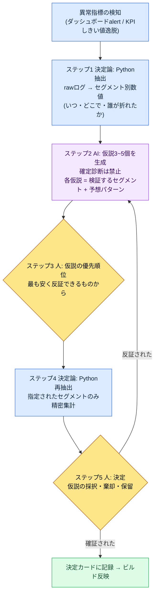

# 13.3 異常指標から決定まで — AIは仮説を、人は決定を

> 1次読者：KPIを見て四半期の決定を下すデータ担当・ディレクター（中規模（10〜50人）チーム）
> 一人・趣味の読者向け縮小版：§13.3.9「一人ならここまでで十分」

月曜の朝、ダッシュボードで赤い線を1本見たことがあります。30日継続率（リテンション）が前週比で目に見えて折れていました。会議室に集まった人たちが、それぞれ一つずつ原因を挙げました。ある人は先週パッチした新規狩り場を、ある人は競合タイトルの新シーズンを、ある人はただ「季節要因」を口にしました。どれももっともらしいものでした。問題は、その日の午後が終わるまで、私たちが何を検証すべきかにすら合意できなかったことです。仮説は5個あるのに、検証するセグメントは一つも決まっていませんでした。

本章はその朝を終わらせる方法を扱います。核心は一行です。**異常指標を見たら、AIに確定診断をさせるのではなく、検証可能な仮説3〜5個を出させます。** AIは「継続率が落ちた理由はXだ」と断定しません。「Xなら、このセグメントでこう見えるはずだ」という検証設計を出し、決定は人が下します。データドリブンの一般論は他の書籍に十分ありますから、本章はその一般論を*AIワークフローで回す場面*だけに集中します。

---

## 13.3.1 KPI定義は人、解釈の補助はAI

まず境界を打ち込んでおきます。本章全体が、次の一文の上に立っています。**KPIを何と定義するかは人が決め、そのKPIが揺らいだときに、なぜ揺らいだのかの仮説を素早く広げる仕事だけをAIが手伝います。**

この境界が崩れると、データドリブンそのものが崩れます。KPIの定義をAIに任せると「測定しやすいもの」がKPIになり、診断までAIに任せると、もっともらしい確定文が人の検証を飛ばして決定に直行します。だからAIにはただ一つの区間だけを開きます — 異常が捕捉された後、人が決定を下す前、その間の「何を疑い、何を確認するか」を広げる区間です。

この分担は、第13部の前の章と同じ背骨を共有しています。rawログはPythonが決定論で抽出し（13.1）、KPIの定義・階層は人が固定し（13.2）、本章ではその上で異常が捕捉されたときの*解釈の補助*だけをAIが担います。抽出は決定論、定義は人、解釈の補助はAI。三つが混ざらないことが、このパート全体の安全装置です。

著者のプロジェクト（モバイル優先のMMORPG、以下「プロジェクトA」）には、この補助を支える実在のログが敷かれています。チームメモリーフォルダ配下の`_economy_log/`（トークン・時間の経済性ログ）、`_scores_latest.json`（指標スコアのキャッシュ）、`_roi_report.md`（ROI（Return on Investment、投資対効果）レポート）がそれです。本章のワークド・トランスクリプトは、これらのログから抽出した異常シグナルを入力として受け取ります。

---

## 13.3.2 決定ループ — AIが入るマスはただ一つ

一つの異常指標が決定につながる全体のループを、まず図で固定しておきます。この図の中でAIが入るマスはただ一つ、「仮説の生成」だけです。その前（抽出）も後ろ（検証・決定）も、人とコードの持ち場です。



人の手が触れる場所は3か所です。何が異常かを定義する場所（先頭、すでに13.2で完了）、どの仮説を先に検証するかを選ぶ場所（ステップ3）、最終決定を下す場所（ステップ5）。その間の退屈なログ集計はPythonが、仮説を素早く広げる仕事はAIが受け持ちます。**AIが確定診断を下すマスは、このループには存在しません。** 仮説は反証されるために存在し、反証されればステップ2に戻ります。

---

## 13.3.3 [ワークド・トランスクリプト] 継続率の下落 — 仮説3〜5個を受け取る

実際にどう回すのか、1サイクルを最後まで見せます。以下は、冒頭の月曜の朝の継続率下落を再構成したセッションです。入力プロンプトはそのままコピーして使えますし、出力は実際のセッションを忠実に再構成したものです。

### ステップ1 — 入力：Pythonが抽出した異常シグナルをそのまま投げる

まず、人が「継続率が落ちた」という感触を投げることはしません。Pythonが決定論で抽出したセグメント別の数値表を投げます。これは新しく書くものではなく、`_economy_log`/イベントログから抽出するだけです。

```python
# retention_break_extract.py (骨格) — 異常区間のセグメント分解
# 入力: 日次コホート継続率ログ
# 出力: どのセグメントでどれだけ折れたか (LLM入力用の表)
def extract_break(rows, kpi="d30_retention", baseline_weeks=4):
    base = mean([r[kpi] for r in rows if r.week < target_week][-baseline_weeks:])
    cur  = [r for r in rows if r.week == target_week]
    return [
        {"segment": s.name,
         "baseline": round(base_by_seg[s.name], 3),
         "current":  round(s.value, 3),
         "delta_pct": round((s.value/base_by_seg[s.name]-1)*100, 1),
         "n": s.sample_size}          # 標本数 — 小さければ信頼度が低い。一緒に渡す
        for s in cur
    ]
```

このスクリプトが吐いた表が、AIに渡す1次入力です。核心は、標本数（`n`）を一緒に渡すという点です。標本の小さいセグメントの揺らぎをAIが原因と錯覚しないようにするには、人ではなくデータがその警告を持っているべきです。

```
# retention_break_2026Q2W3.txt (抽出結果、抜粋)
segment                baseline  current  delta_pct      n
新規(登録7日以内)          0.41     0.31      -24.4%     8,200
復帰(30日+休眠後)          0.28     0.27       -3.6%     1,100
課金(有料)                0.62     0.60       -3.2%     2,400
無課金                   0.34     0.25      -26.5%    14,900
新規狩り場_プレイ          0.39     0.22      -43.6%     3,050
新規狩り場_未プレイ        0.40     0.38       -5.0%    11,200
```

### ステップ2 — プロンプト：診断を禁止し、仮説と検証設計を強制する

```
添付したretention_break_2026Q2W3.txtは、Pythonが抽出したd30継続率のセグメント別変化
(baseline=直前4週平均、current=今週、n=標本数)。無課金・新規狩り場_プレイで
大きく落ちている。原因を診断せず、検証可能な仮説を3~5個だけ立ててほしい。仮説ごとに、
仮説の一文 / 検証するセグメント(どうさらに分割するか) / 正しければ見えるパターン /
誤りを示す反証条件、の4行で。標本の小さいセグメント(n<2000)は根拠の核心に使わず、
使うなら限界を明記。仮説は最も安く反証できる順に並べ、データで判別できないものは
「人の判断が必要」と別に表示。出力は仮説カードの一覧のみで、叙述は省くこと。
```

このプロンプトには「原因を探せ」という言葉が一行もありません。代わりに、仮説が備えるべき骨格と、越えてはならない線だけが書かれています。AIに自由を与えると「おそらく新規狩り場の難易度のせいだろう」というもっともらしい確定文を吐き出し、その文が議事録に記録されると、検証なしに決定になります。それを防ぐ装置が、**断定の禁止、仮説ごとの検証セグメント・予想パターン・反証条件の義務化、反証コスト順の整列、「判別できないものは人へ」** の四つです。出力を診断ではなく検証設計に変えておく装置です。

### ステップ3 — Claudeの出力（生の出力、再構成）

```
[仮説1] (反証コスト最低)
仮説: 新規狩り場の難易度が無課金の新規ユーザーの参入障壁となり、7日以内の離脱を増やした。
検証セグメント: 新規狩り場_プレイのセグメントを「初回死亡回数」の区間(0~2 / 3~5 / 6+)で再分解。
予想パターン: 仮説が正しければ、初回死亡6+の区間でd7→d30の離脱率が急増するはず。
反証条件: 死亡回数と離脱率の間に単調な関係がなければ棄却。

[仮説2]
仮説: 新規狩り場そのものではなく、同じパッチに含まれた別の変更(報酬カーブ・UI)が原因。
検証セグメント: 新規狩り場_未プレイなのにパッチ後に接続したユーザーの継続率。
予想パターン: 未プレイのセグメントも一緒に下落していれば、狩り場は犯人ではない。
反証条件: 未プレイのセグメントがbaseline維持(-5%水準)なら本仮説を棄却し、仮説1へ。

[仮説3]
仮説: 外部要因(競合タイトルの新シーズン)で無課金全体が離脱し、狩り場は無関係。
検証セグメント: 課金/無課金 × 新規狩り場プレイ有無の2×2クロス表。
予想パターン: 外部要因なら、狩り場のプレイ有無に関係なく無課金全体が一様に下落。
反証条件: 下落が新規狩り場_プレイに集中していれば外部要因説は弱まる。

[仮説4] (人の判断が必要)
仮説: 測定自体の問題 — 今週のコホート定義/ログ収集に変動があった。
検証セグメント: (データでは判別不能) パッチと同時にtelemetryスキーマの変更があったか、人の確認が必要。
予想パターン: スキーマ変更があったなら、下落は実際ではなく測定アーティファクトの可能性がある。
反証条件: ログパイプラインの無変更が確認されれば棄却。

注意: 「復帰」(n=1,100)のセグメントは標本が小さいため、-3.6%をシグナルとは見なさなかった。
```

この出力で最も価値があるのは仮説4です。AIが「これはデータでは判別できない、telemetryスキーマの変更有無を人が確認してほしい」と、自分の限界を申告した場所です。良いプロンプトは、AIが「分からない」と言えるようにします。そして最後の行 — 標本1,100のセグメントを自らシグナルから除外したこと — がルール3の働いた痕跡です。

### ステップ4 — 検証と決定（人とPythonの持ち場）

この仮説カードをそのまま決定に移してはいけません。人が優先順位を決め、Pythonが再び集計します。

仮説2が反証コスト最安でした。新規狩り場_未プレイのセグメントは、すでにステップ1の表にありました — `-5.0%`。baselineを維持していました。つまり、狩り場をプレイしなかったユーザーは無事でした。**仮説2はその場で棄却され、同時に仮説3（外部要因による全般下落）も弱まりました。** 外部要因なら、未プレイも一緒に落ちていたはずだからです。下落は新規狩り場を*プレイした*ユーザーに集中していました。

そこで仮説1に絞ってPythonを再び回しました。新規狩り場_プレイを初回死亡回数で再分解した結果、6回以上死亡した区間でd30離脱が際立ちました（方向：死亡が多いほど離脱が急になる単調な関係 — 正確な数値はビルドのtelemetryで測定し、ここでは方向のみ）。仮説1の予想パターンと一致しました。

残るは仮説4でした。人がパッチノートを確認しました — telemetryスキーマは無変更。測定アーティファクトの可能性は棄却。これで決定の材料がそろいました。

> **[ステップ5 人の決定 — 決定カード]**
>
> - **採択**：新規狩り場の序盤難易度（初回死亡頻度）が、無課金新規離脱の1次要因。次のビルドで1〜5レベル区間の敵密度・体力の下方修正をA/Bテスト。
> - **棄却**：外部要因説（仮説3）、測定アーティファクト説（仮説4）。
> - **保留**：報酬カーブ（仮説2の残余）— 狩り場の難易度調整後も下落が残れば再点火。
> - **AIの役割の記録**：診断0件、仮説4件+検証設計の提供。決定は人。

入力（異常シグナル）→抽出→仮説→検証→決定の1サイクルが、ここで閉じます。AIはただの一度も「原因はこれだ」と言いませんでした。検証する道だけを敷きました。これが本章のShow基準です — 「AIがデータを分析した」という文は、何を仮説し、何が反証され、人が何を決定したのかを一度でも最後まで見なければ空虚です。

---

## 13.3.4 なぜ「確定診断」を禁止するのか

仮説生成と確定診断の違いは些細に見えますが、決定の安全を分けます。二つを並べると違いは明確です。

| | 確定診断（禁止） | 仮説生成（本章の方式） |
|---|---|---|
| AIの出力 | 「継続率下落の原因は新規狩り場の難易度だ」 | 「難易度仮説 — 初回死亡6+の区間を見よ。こうなら正しく、ああなら誤り」 |
| 人の次の行動 | そのまま書き取って決定 | 最も安い仮説から反証を試みる |
| 誤っていたとき | 誤った決定がビルドへ直行 | 検証段階で棄却、コスト0 |
| 責任の所在 | 「AIがそう言った」（責任が蒸発） | 人が仮説を選んで決定（責任が明確） |

確定診断の本当の危険は、正確度ではなく**検証を飛ばさせるという点**です。もっともらしい一文は、会議室の疑いを眠らせます。一方、仮説カードはそれ自体が「これを確認せよ」という宿題なので、検証なしには決定に進めない構造です。AIを診断機ではなく仮説発生器として置く理由がここにあります。

---

## 13.3.5 グッドハート事前警告 — AIがKPIの歪みを先に指摘する

データドリブンの最も深い落とし穴は、グッドハートの法則です。*「測定指標が目標になった瞬間、その指標はもはや良い指標ではない」*。DAUを目標に掲げると、人為的な通知でDAUだけが膨らみ、長期の継続率が削られます。問題は、この歪みがたいてい**決定を下したかなり後になってから**副作用として現れるという点です。

だからAIをもう1マス早く投入します。決定案をビルドに入れる前に、「このKPIを目標に掲げたら、どう攻略されうるか」をAIに先にやらせます。これは診断ではなく*レッドチーム*です — 自分たちの決定の穴を、わざと探させるのです。

> **[グッドハート事前警告プロンプト]**
>
> 今四半期の目標KPIはd7継続率+5%pで、達成手段の草案は7日連続ログインボーナスの
> 大幅強化だ。あなたがこの決定のレッドチームになって、このKPIを目標に掲げたときに
> 起こりうるグッドハート歪みのシナリオ3個と、各シナリオで一緒に壊れるガード指標、
> そして歪みを早期に捕まえるモニタリングセグメントを表で出してほしい。断定ではなく
> 「こうなりうる」の形で。

AIが出したのは確定の予言ではなく、疑うべき地点のリストです。核心だけ移すとこうなります。

| グッドハート歪みのシナリオ（仮説） | 一緒に壊れるガード指標 | 早期モニタリング |
|---|---|---|
| ログインだけ踏んで核心コンテンツを未プレイ | セッションあたり戦闘回数・狩り場進入率 | d7継続率↑+戦闘回数↓が同時に発生したら警告 |
| 報酬インフレで経済崩壊 | 通貨のシンク/ソース比率、アイテム相場 | `_economy_log`のシンク-ソースギャップ拡大を追跡 |
| ログインボーナス終了直後の崖離脱 | d8〜d14継続率（報酬が終わった直後） | d7だけ見ず、d14をペアで |

この表の価値は正解ではなく、**決定の前にガード指標をあらかじめペアで束ねておくという点**です。d7継続率を目標に掲げるなら、AIが指摘した「戦闘回数」と「d14継続率」を同じ画面に並べておいて見ます。そうすれば、d7が上がっても戦闘回数が一緒に下落した瞬間 — グッドハートの歪みが始まるその瞬間 — に、副作用が四半期末まで蓄積する前に捕まえられます。単一KPIを目標に掲げる代わりにガード指標と束ねるこの習慣が、13.2で決めた「5〜7個のKPIバランス」を決定段階で実際に機能させる方法です。

ここで押さえておくことがあります。AIがこのレッドチームで生み出した価値は「時間の節約」ではありません。人がこの三つのシナリオを思いつくのにかかる時間は、長くありません。本当の価値は、**決定するその場で歪みのシグナルを露出させること** — ふだん見ていないガード指標を、決定のテーブルの上に引き上げるというシグナル効果です。自動化の価値は時間の節約ではなく、ふだん見えないシグナルを見えるようにすることにあります（プロジェクトAのチームメモリー概念`automation_signal_value_over_time_savings`）。

---

## 13.3.6 決定ごとにAI仮説の重みは異なる

仮説生成が、すべての決定に同じように有用なわけではありません。決定の時間軸とデータ密度によって、AI仮説をどれだけ信頼するかが変わります。

| 決定の類型 | データ密度 | AI仮説の位置づけ |
|---|---|---|
| スキルバランスの数値変更 | 高い（シミュレーション・ログが豊富） | 仮説→検証→決定のループをそのまま、AIの補助は強い |
| UIコンポーネントの変更 | 高い（A/Bが可能） | 同様、AI仮説は有効 |
| 新規コンテンツのリリース可否 | 中間（類似コンテンツの参照のみ） | 仮説は参考、決定の重みは人側へ |
| 長期ビジョン・新規分野 | 低い（前例なし） | ループ自体が回らない — 人が決定、AIはリスクの列挙のみ |

ルールは単純です。**データの厚い決定ほど§13.3.2のループをそのまま回し、データの薄い決定ほど、AIは仮説発生器からリスクチェックリスト作成器へ役割が下がります。** 長期ビジョンをデータで解こうとする試みが危険なのは、未来のデータがない場所でAIが過去のデータからもっともらしい仮説をでっち上げると、その仮説がビジョンを過去へ引き寄せるからです。データのない領域の決定は、回避したりAIに丸投げしたりするのではなく、人が責任を持って下す場所として残しておきます。

> **[方向標識 — 埋め込みでトピック・コホートを座標化するなら（まだ時期尚早）]**
>
> 処方ではなく研究動向として読んでください。第13部の二つの場所で、同じ埋め込みの発想が開きます。一つは§13.1の自由回答です — 非定型の自然言語を文埋め込みでクラスタリングすれば、§13.1.2の[曖昧]境界ケースを「二つのトピック中心の間の距離」として座標化し、どの中心からも遠い回答を「新トピックの出現」として標識できます。もう一つは§13.1.4の行動ログです — プレイログを埋め込めば、誰も事前に定義していない「創発コホート」をベクトル空間（付録Mの「地図」）のクラスタとして浮かび上がらせ、§13.3の仮説ループの「検証するセグメント」候補として投入する道が開きます（§13.3.3が前提とした「人があらかじめ定義したセグメント」という限界を1マス突き破る場所です）。ただし、クラスタは原因ではなく仮説にすぎず、小さいクラスタはシグナルではなく（§13.3.3の標本警告と同じ場所）、クラスタに名前を付けるラベリングは依然として人の仕事です（§13.1.1）。何より、圧縮が捨てた次元でライブ事故が起こりえます。だからこの発想は、経済編§8.2.7の「次元ベクトル」の手がかりと正確に同じ場所に置きます（概念の直観は付録M）— 同じtelemetryの土壌の上で、同じ節制で。telemetryが固く敷かれたチームが数年後にのぞき込む方向標識にすぎず、いまやるべきことは§13.3.2のループを正直に回すことです。

---

## 13.3.7 本章の数値の出典

本章の数字は、序文「一つの約束」の原則に従います。グッドハートの法則は1975年にチャールズ・グッドハートが定式化した公開命題であり、プロジェクトAの`_economy_log`・`_roi_report.md`・`_scores_latest.json`は実在するチームメモリーの産出物で、整合性の失敗時にClickUpへ通知するルール`integrity_check_clickup_notify`はスコア294.93の実運用atomです（付録A.3.6・A.3.1）。§13.3.3では「初回死亡6+の区間で離脱が急になる」という*方向*だけを仮説検証で確認し、絶対値はビルドのtelemetryに委ねました。セグメント表（baseline 0.41など）はワークフローの形を見せるための*例示構成*であって、特定四半期の実測公開値ではありません — 覚えるべきは数字ではなく構造です。

---

## 13.3.8 よくある失敗

| パターン | なぜ失敗するか | 処方 |
|---|---|---|
| AIに「原因は何か」と聞く | もっともらしい確定文が検証なしに決定される | 診断禁止、仮説3〜5個+反証条件を強制（§13.3.3） |
| 標本の小さいセグメントの揺らぎをシグナルに | ノイズを原因と誤認 | 抽出段階で`n`を一緒に渡し、しきい値を明記 |
| 単一KPIを目標に直行 | グッドハートの歪みが四半期末に爆発 | 決定前のAIレッドチーム+ガード指標のペア（§13.3.5） |
| データのない長期決定をデータで | 過去の仮説が未来のビジョンを引き下げる | データ密度に応じてAIの役割を変える（§13.3.6） |
| 仮説を受け取って検証なしに採択 | 仮説が結論にすり替わる | 最も安い仮説から反証、未プレイのセグメントを活用 |

三つ目が最も遅れて爆発します。d7継続率が上がって決定が成功のように見えるのに、2か月後にd14の崖と戦闘回数の下落が一緒にやって来ます。決定の*前に*AIレッドチームを一度回す30分が、その2か月を買い戻します。

---

## 13.3.9 やってみよう — 今日できる一歩

> **一人ならここまでで十分**：ログパイプラインがなくても構いません。自分のゲーム（またはよく見ているゲームの公開指標）で、最近折れた数字を一つ選んでください。その数字をAIに投げるとき、「原因を教えて」ではなく「確定診断は禁止、検証可能な仮説3個を反証条件付きで」と頼んでみましょう。その中で最も安く確認できる仮説を一つ選び、自分でデータを一度分割してみると、「診断を受け取ること」と「仮説を検証すること」が決定の安全においてどれほど違うか、体で入ってきます。

チームなら、次の一歩から始めましょう。異常指標の抽出スクリプトがセグメント別の数値を出すとき、**標本数（`n`）を必ず一緒に出力する**よう1行を足します（§13.3.3の`retention_break_extract.py`）。そして次のKPI目標を決めるとき、§13.3.5のグッドハート・レッドチームのプロンプトを一度回し、ガード指標のペアを決定カードに記入しておきます。この二つだけでも、「AIが原因を診断した」が「AIが仮説を広げ、人が検証して決定した」に変わります。

---

### 本章のポイント
- AIには確定診断ではなく、検証可能な仮説3〜5個を出させます。
- 仮説ごとに検証セグメント・予想パターン・反証条件を義務化します。
- 決定の前にグッドハート・レッドチームで、ガード指標をあらかじめペアで束ねます。

### 次章のプレビュー
- 14.1 PCのHUD 30種をモバイル10種に — プラットフォーム別決定の始まり
