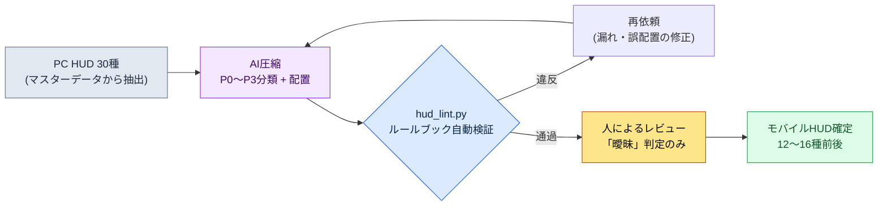

# 14.1 PC HUD 30種をモバイル10種に — 制約をルールブックに、圧縮をAIに

> 主な読者：モバイルファーストのプロジェクトのUX・システムプランナー（中規模（10〜50人）チーム）
> 一人/趣味の読者向けの縮小バージョン：§14.1.7「一人ならここまでで十分」

PCビルドでは問題なく動いていた戦闘HUDを、初めてモバイル解像度に表示してみた日のことを覚えています。画面の半分がゲージ・アイコン・ミニマップ・クエストトラッカーで覆われ、肝心のキャラクターが見えませんでした。要素の一つひとつは、どれも必要に見えました。問題は、「何を削るか」が会議のたびに毎回ゼロからの争いになったことです。ある人はミニマップを守りたがり、ある人はチャットを守りたがりました。根拠が「感覚」だったため、結論が毎回変わりました。

この章では、その争いを終わらせる方法を扱います。核心は二つです。第一に、モバイルの制約を「感覚」ではなく**検証可能なルールブック**に変えます。第二に、「PCの30種をモバイルの10種に減らす」退屈で反復的な圧縮作業はAIに任せ、人は**ルールブック違反を捕まえるレビュー**だけを行います。モバイルUXの一般知識はすでに他の書籍に十分ありますから、この章はその知識を*AIワークフローで回す部分*だけに集中します。

---

## 14.1.1 モバイルの制約は「注意事項」ではなく「ルールブック」

モバイルの制約を表で列挙する本はたくさんあります。画面が小さく、指が太く、セッションが短く、バッテリーが減るという話です。どれも正しいのですが、表で覚えたところで、会議での「それで、このボタンはありなのか」という質問には答えが出ません。制約が**数値による合格/不合格基準**に変わってこそ、AIも人も同じ線を引けます。

幸い、モバイル入力制約の多くは、すでにプラットフォーム企業が公開ガイドラインとして打ち込んでいます。タッチ44pt（HIG）・48dp（Material）・コントラスト4.5:1（WCAG）・間隔8dpといった公開標準は§9.1のルールブックに従い、ここでは本章のlintが直接使う**最小タッチターゲット44pt（HIG）**だけをインラインで置きます。でっち上げる必要のない数値です。「ボタンが少し小さい気がする」ではなく「このボタンは38ptなのでHIGの44pt未達」と言えてこそ、人が判定してもAIが判定しても同じ判定になります。

ここに一行を加えます — MMORPGのモバイルでは横持ち両手グリップが標準であり、押す要素は左右下コーナーに、消費/スロットは中央下部に置きます（なぜ横持ちが標準なのか、三領域モデルとは何かは§9.1で扱います）。本章のすべての配置判定は、その横持ち両手グリップを前提とします。

プラットフォーム基準をPCと並べて見ると、圧縮の出発点が明確になります。PCは精密・大量（30〜50種を処理可能）、モバイル横持ちは両手のコーナー限定のため12〜16種が限界です（全体の比較表は§9.1のルールブックを参照 — 著者の推定、未検証）。したがってモバイル作業の本質は「デザイン」ではなく**「PCの30〜50種をモバイル横持ちの12〜16種へ優先度圧縮」**です。そしてこの圧縮は、手作業でやると退屈なうえに、やるたびに基準線がぶれます — 同じルールを疲れずに繰り返し適用する仕事なので、AIがドラフトを作り人がレビューする分担にぴったり当てはまります。

---

## 14.1.2 [ワークド・トランスクリプト] PC HUD 30種 → モバイル優先度圧縮

実際にどう回すのか、1サイクルを最後まで見せます。以下は著者のプロジェクト（モバイルファーストMMORPG、以下「プロジェクトA」）の戦闘HUD圧縮セッションを忠実に再現したものです。入力プロンプトはそのままコピーして使え、出力は実際のセッションを再構成したものです。

### ステップ1 — 入力：PC HUDの仕様をそのまま投げる

まず、PC HUD要素のリストを機械が読める表にします。これはすでにマスターデータにあるので、新しく書くのではなく抽出するだけです。

```yaml
# hud_pc_inventory.yaml — PCビルド現行HUD (抜粋、30種中12種)
- id: hp_bar          # HPバー
  현재위치: 左上
  상시노출: true
  조작가능: false
- id: mp_bar          # MPバー
  현재위치: 左上
  상시노출: true
  조작가능: false
- id: skill_slots     # スキル12枠
  현재위치: 下部中央
  상시노출: true
  조작가능: true
- id: minimap         # ミニマップ
  현재위치: 右上
  상시노출: true
  조작가능: true
- id: quest_tracker   # クエスト追跡
  현재위치: 右側
  상시노출: true
  조작가능: false
- id: chat            # チャットウィンドウ
  현재위치: 左下
  상시노출: true
  조작가능: true
# ... buff_bar, party_frame, target_frame, exp_bar, currency, mail_alert ...
```

### ステップ2 — プロンプト：分類形式と一行根拠を釘で打ち付ける

```
添付した hud_pc_inventory.yaml (PCビルド現行HUD 30種) を、モバイル横持ちグリップの両手操作
基準で優先度圧縮してください。各要素をP0 (戦闘中常時必須)〜P3 (削除または状況に応じて表示) に
分類し、常時表示 (P0〜P1) の合計は16種を超えないこと。操作可能な要素 (조작가능:true) は
両手の親指が届くコーナー (左下=移動、右下=スキル) への配置を提案してください。分類ごとに根拠を
一行ずつ必ず付け、曖昧なものは無理に決めず、別途マークして人に回してください。
出力は表 (要素 | 分類 | 配置領域 | 根拠 | 曖昧) のみ、説明は不要です。
```

このプロンプトで、圧縮しろという指示そのものは一行だけで、残りの分量はすべて出力を囲い込む柵だという点に注目してください。AIに自由を与えると、一般的なRPGの平均を吐き出します。だから**分類基準（P0〜P1 ≤ 16種）・出力形式（表）・根拠の義務、そして「曖昧なら人に回せ」という逃げ道**をあらかじめ入力しておきます。圧縮の品質はこの四つの柵が決めます。

### ステップ3 — Claudeの出力（再構成、抜粋）

```
| 要素        | 分類 | 配置領域      | 根拠                                   | 曖昧 |
|------------|------|--------------|----------------------------------------|------|
| hp_bar     | P0   | 上部固定      | 死亡に直結、0.5秒単位の確認が必要        |      |
| skill_slots| P0   | 右下(右親指)  | 操作の核心、右親指が届くコーナー必須      |      |
| mp_bar     | P0   | 上部固定      | スキル使用可否の判断、常時必要           |      |
| target_frame| P0  | 上部中央      | 対象の体力確認、戦闘判断の核心           |      |
| minimap    | P1   | 右上縮小      | 方向確認用、戦闘中は縮小/半透明可        |      |
| buff_bar   | P1   | hp_bar下     | バフ満了の確認、アイコン縮小可           |      |
| quest_tracker| P2 | メニュートグル | 戦闘中は不要、平常時はトグル表示         |      |
| chat       | P2   | 左下タブ      | 戦闘中は自動非表示、タブで展開           | ★    |
| party_frame| P1   | 左側縮小      | パーティプレイ時はP0へ昇格 (条件付き)    | ★    |
| mail_alert | P3   | コンテキスト   | 受信時のみ一時表示                      |      |
| exp_bar    | P3   | 画面最下部1px | 情報価値が低い、細い線で十分             |      |
| currency   | P2   | メニュー内    | 戦闘中は不要                            |      |

常時表示(P0+P1)合計: 7種 (ルール2通過: ≤16)
曖昧2件(chat、party_frame)は人の決定が必要:
- chat: ソーシャル比重が高いゲームならP1昇格を検討
- party_frame: ソロ/パーティのコンテキストによって分類が分かれる
```

この出力で最も価値があるのは表ではなく、**一番下の2行、「曖昧2件」**です。AIが自分の限界を申告し、判断を人に渡した場所です。プロンプトに逃げ道を開けておくと、AIは無理に答えをでっち上げる代わりに、わからない場所に旗を立てます。

### ステップ4 — 検証と拒否（人の出番）

この出力をそのまま受け取ってはいけません。ルールブックで一度叩きます。実際にこのセッションでは1件が引っかかりました。

`party_frame`をAIは「左側縮小」に配置しましたが、横持ちグリップでは画面左側中央は両手の親指のどちらも届かない領域です（左手は左下の移動、右手は右下のスキルに縛られています）。ところがパーティフレームは、クリック（パーティメンバーのターゲティング）が必要な**操作要素**です。ルール3（「操作可能要素は両手親指の届きやすいコーナー」）違反です。AIは`조작가능`フラグをparty_frameで見落としました。これは入力yamlでparty_frameの`조작가능`が空だったせい — つまり人間側のデータ欠陥でした。

そこで再依頼します。

```
party_frameはパーティメンバーのターゲティングクリックが必要な操作要素です (さっきの入力から
抜けていました)。操作要素は親指が届くコーナーに置くルールで、配置をやり直してください。
ソロのときとパーティのときを分けて提案してください。
```

この1往復で終わりです。AIはソロ時は「非表示」、パーティ時は「下部右側（届きやすい）へ昇格」と答え直し、その決定はルールブックを通過しました。**圧縮30種を人がゼロからやれば半日、AIドラフト + ルールブックレビュー + 1回の往復なら1時間以内**です（著者の推定 — 正確な節約時間はチームや要素数によって変わるため、絶対値よりも「ゼロから手作業」と「ドラフト+レビュー」の構造の違いとして読むのが正しいです）。

---

## 14.1.3 指の領域 — 両コーナーと中央下部

上のセッションで繰り返された「指の領域」を図で一度固定しておくと、以降のすべての配置判定が速くなります。横に持ったスマートフォンでは、指が届き視線が頻繁に向かう下部は三つの場所に分かれます。左手の親指は左下（移動）、右手の親指は右下（スキル）のコーナーに届き、**両親指の間の中央下部**は消費アイテム・自動アイテム・スキルスロットを置く場所です。瞬間的な反応を要するトゥイッチ操作ではありませんが、自分が使うものや自動で消費されるものを一目で確認し、時々押す重要なグランス領域です。P0の操作・スロットは緑、指が届かず読むだけの上部・中央上方は赤です。

<svg viewBox="0 0 660 340" xmlns="http://www.w3.org/2000/svg" role="img" aria-label="モバイル横画面における両手親指の到達領域図">
  <!-- スマートフォン外枠 (横向き) -->
  <rect x="20" y="30" width="620" height="280" rx="30" ry="30" fill="#0f1117" stroke="#3a3f4b" stroke-width="3"/>
  <rect x="34" y="44" width="592" height="252" rx="14" ry="14" fill="#11151d"/>
  <!-- 上部ステータス帯 (赤 — 難しい) -->
  <rect x="34" y="44" width="592" height="62" fill="#7f1d1d" opacity="0.42"/>
  <text x="330" y="80" fill="#fecaca" font-family="sans-serif" font-size="13" text-anchor="middle">難しい — 上部・中央 (ステータス表示専用: HP・MP・ターゲット、読むだけ)</text>
  <!-- 中央ゲーム画面 -->
  <text x="330" y="205" fill="#5b6675" font-family="sans-serif" font-size="14" text-anchor="middle">ゲーム画面 (戦闘が繰り広げられる場所)</text>
  <!-- 左下の親指コーナー (緑) -->
  <path d="M34 296 L34 146 A150 150 0 0 1 184 296 Z" fill="#14532d" opacity="0.7"/>
  <path d="M34 146 A150 150 0 0 1 184 296" fill="none" stroke="#22c55e" stroke-width="2.5" stroke-dasharray="5 4"/>
  <text x="92" y="250" fill="#bbf7d0" font-family="sans-serif" font-size="13" text-anchor="middle" font-weight="bold">左親指</text>
  <text x="92" y="270" fill="#bbf7d0" font-family="sans-serif" font-size="12" text-anchor="middle">移動</text>
  <!-- 右下の親指コーナー (緑) -->
  <path d="M626 296 L626 146 A150 150 0 0 0 476 296 Z" fill="#14532d" opacity="0.7"/>
  <path d="M626 146 A150 150 0 0 0 476 296" fill="none" stroke="#22c55e" stroke-width="2.5" stroke-dasharray="5 4"/>
  <text x="568" y="250" fill="#bbf7d0" font-family="sans-serif" font-size="13" text-anchor="middle" font-weight="bold">右親指</text>
  <text x="568" y="270" fill="#bbf7d0" font-family="sans-serif" font-size="12" text-anchor="middle">スキル</text>
  <!-- 中央下部スロット帯 (アンバー — 消費・クイックスロット・自動アイテム) -->
  <text x="330" y="238" fill="#b45309" font-family="sans-serif" font-size="12" text-anchor="middle" font-weight="bold">中央下部 — 消費・クイックスロット・自動</text>
  <rect x="256" y="248" width="148" height="44" rx="8" fill="#f59e0b" opacity="0.45" stroke="#f59e0b" stroke-width="2" stroke-dasharray="5 4"/>
  <circle cx="295" cy="270" r="12" fill="#fbbf24"/><text x="295" y="274" fill="#000" font-size="8" text-anchor="middle">ポーション</text>
  <circle cx="330" cy="270" r="12" fill="#fbbf24"/><text x="330" y="274" fill="#000" font-size="8" text-anchor="middle">自動</text>
  <circle cx="365" cy="270" r="12" fill="#fbbf24"/><text x="365" y="274" fill="#000" font-size="8" text-anchor="middle">スロット</text>
  <!-- HUDドットの例 -->
  <circle cx="70" cy="72" r="9" fill="#ef4444"/><text x="70" y="76" fill="#fff" font-size="9" text-anchor="middle">HP</text>
  <circle cx="125" cy="72" r="9" fill="#ef4444"/><text x="125" y="76" fill="#fff" font-size="9" text-anchor="middle">MP</text>
  <circle cx="330" cy="60" r="9" fill="#ef4444"/><text x="330" y="64" fill="#fff" font-size="8" text-anchor="middle">対象</text>
  <circle cx="588" cy="72" r="10" fill="#ef4444"/><text x="588" y="76" fill="#fff" font-size="8" text-anchor="middle">マップ</text>
  <circle cx="92" cy="232" r="17" fill="#22c55e"/><text x="92" y="236" fill="#000" font-size="9" text-anchor="middle">移動</text>
  <circle cx="556" cy="240" r="14" fill="#22c55e"/><text x="556" y="244" fill="#000" font-size="9" text-anchor="middle">スキル</text>
  <circle cx="592" cy="210" r="13" fill="#22c55e"/><text x="592" y="214" fill="#000" font-size="9" text-anchor="middle">スキル</text>
  <circle cx="582" cy="272" r="12" fill="#22c55e"/><text x="582" y="276" fill="#000" font-size="8" text-anchor="middle">スキル</text>
</svg>

ルールは単純です。**読むだけの情報（HP/MP/ターゲットの体力）は赤（上部・中央上方）に置いて構いません。指が届く必要がないからです。**逆に**押す要素は指の領域（緑・アンバー）の中**でなければなりません — 移動・スキルは左右の下コーナーに、消費・自動アイテムとクイックスロット・スキルスロットは中央下部に置きます。三つとも指が届き、視線が頻繁に向かう場所です。§14.1.2でparty_frameが引っかかった理由は、この図1枚で説明できます — 押す要素を、指の領域ではない左側中央（読み取り領域）に置いたからです。

---

## 14.1.4 ルールブックをコードに — 配置案の自動lint

圧縮案がルールブックを守っているかを毎回目視で確認すると、また見落とします。§14.1.1の五つのルールのうち、座標・サイズで判定できるものはコードにレビューさせます。人は、コードが捕まえられない「曖昧」判定だけに時間を使います。

```python
# hud_lint.py — モバイルHUD配置案の検証 (骨格)
# 入力: AIが提案した配置案 (要素ごとの座標・サイズ・조작가능・분류)
# 出力: ルールブック違反のリスト

MIN_TAP_PT = 44       # Apple HIG 最小タッチターゲット (pt)

def in_action_zone(e, w, h):
    """横持ちグリップで指が届く領域: 左・右下コーナー + 中央下部スロット帯。"""
    x, y = e["x"] / w, e["y"] / h
    bottom = y > 0.55
    left_corner  = bottom and x < 0.30                 # 左手親指 = 移動
    right_corner = bottom and x > 0.70                 # 右手親指 = スキル
    center_slot  = (y > 0.72) and (0.35 <= x <= 0.65)  # 中央下部 = 消費・クイックスロット
    return left_corner or right_corner or center_slot

def lint(elements, screen_w, screen_h):
    issues = []
    for e in elements:
        # ルールA: 操作/スロット要素は指の領域 (両コーナー + 中央下部) になければならない
        if e["조작가능"] and not in_action_zone(e, screen_w, screen_h):
            issues.append(f"[A] {e['id']}: 操作・スロット要素が指の領域の外に配置 "
                          f"(x={e['x']}, y={e['y']})")
        # ルールB: タッチターゲット最小サイズ (HIG 44pt)
        if e["조작가능"] and min(e["w"], e["h"]) < MIN_TAP_PT:
            issues.append(f"[B] {e['id']}: タッチターゲット {min(e['w'], e['h'])}pt "
                          f"< {MIN_TAP_PT}pt (HIG未達)")
    # ルールC: P0/P1常時表示の総量
    onscreen = [e for e in elements if e["분류"] in ("P0", "P1")]
    if len(onscreen) > 16:
        issues.append(f"[C] 常時表示 {len(onscreen)}種 > 16種 (過密)")
    return issues
```

この30行があれば、会議で「このボタン、小さくないですか」は議論の種ではなく判定の対象になります。`[B] skill_slots: タッチターゲット 40pt < 44pt (HIG未達)`とコードが出力すれば、意見を集める必要はありません。直せばいいのです。これは9.1（HUD）で扱ったlintゲートをモバイルの次元に移したものです — 決定論で捕まえられるものはコードが、非決定的で判断が必要なものは人が受け持つという分担は、モバイルでもそのまま成立します。

サイクル全体を一目で見るとこうなります。



人の手が触れる場所は2か所だけです。入力データをきれいに入れる場所（先頭）と、ルールブックが捕まえられない曖昧な判断を下す場所（最後）。その間の退屈な30種の圧縮は、AIとlintが回します。

---

## 14.1.5 本章の数値の出典

本章に出てきた数値の出典だけを短く記録しておきます（本書全体の数値原則は序文「一つの約束」を参照）。タッチ44pt（HIG）・48dp（Material）・コントラスト4.5:1（WCAG）はプラットフォームの公式標準であり、「常時情報8〜12種」と「圧縮半日→1時間」は著者の経験に基づく推定（未検証）なので、絶対値よりも*方向*として読みます。モバイルHUDで実際に測定可能な指標はルールブック違反件数（lint 0）、常時表示要素数（目標 ≤12）、誤タップ率（telemetry）であり、継続率（リテンション）のような結果指標はHUD一つで左右されないため、因果関係を断定しません。

---

## 14.1.6 よくある失敗

| パターン | なぜ失敗するのか | 処方 |
|---|---|---|
| PC HUDをそのまま縮小移植 | 30種が6インチを覆い、ゲームが見えない | §14.1.2の圧縮セッション |
| 「AIよ、モバイルUIを作って」と丸ごと委任 | ルールブックなしでは一般的なRPGの平均が出てくる | ルールブック（§14.1.1）を先にプロンプトに入力する |
| 圧縮案を目視だけでレビュー | タッチサイズ・親指ゾーン違反を毎回見落とす | `hud_lint.py`で自動検証 |
| 根拠なしの「これは削ろう」会議 | 結論が毎回変わる | P0〜P3 + 一行根拠の強制 |

---

## 14.1.7 やってみよう — 今日できる一歩

> **一人ならここまでで十分**：マスターデータがなくても大丈夫です。自分のゲーム（または好きなゲーム）のPC HUD要素を手で10〜15個だけ書き出してyamlにし、§14.1.2のプロンプトをそのまま貼り付けて一度回してみましょう。AIの分類に同意できない項目を1個見つけて「根拠をもう一度示せ」と反論してみると、圧縮がどのような判断の束なのかが体に入ってきます。

チームの場合は、次の一歩から始めましょう。現行HUD要素のリストを`hud_pc_inventory.yaml`として抽出し（すでにマスターデータにあります）、§14.1.4の`hud_lint.py`のルールブック3行（タッチサイズ・親指ゾーン・総量）を先にコードとして固定しておきます。ルールブックがあれば、AIの圧縮案でも人の試案でも、同じ物差しで測れます。

---

### 本章のポイント
- モバイルの制約は暗記する表ではなく、lint可能なルールブックに変えます（HIG 44pt・WCAG 4.5:1）。
- 30種→10種の圧縮はAIに、ルールブック違反のレビューはコードに、曖昧な判断だけを人に。
- 押す要素は左右下コーナーの中に、読む情報は上部に — この一行が配置を決めます。

### 次章のプレビュー
- 14.2 プラットフォーム別の差異（iOS/Android/PC）をAIで分岐管理する
