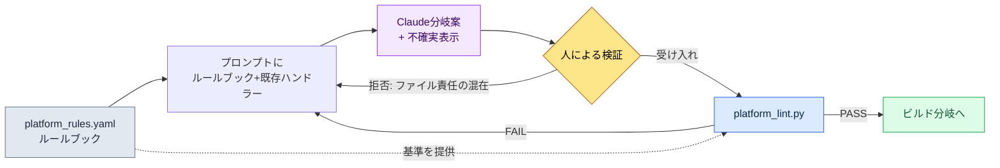

# 14.2 プラットフォーム別の違い（iOS / Android / PC）

アルファビルドを初めてPCで動かした日、企画チームのメッセンジャーチャンネルにスクリーンショットが1枚投稿されました。モバイルでは画面下部いっぱいに広がっていたバーチャルジョイスティックが、27インチモニターの真ん中に手のひらサイズで浮かんでいました。誰かが一言コメントを付けました。「これ、マウスでどうやって掴むんですか？」コアロジックは無事でした。戦闘も、インベントリも、クエストもそのまま動いていました。壊れていたのはただ一つ、入力と画面をモバイル前提で固定していた部分でした。

同じゲームをiOS・Android・PCの3か所に出すと、運営の単位が×3になりそうに思えますが、実際はそうではありません。コアロジックは1つで、そこにプラットフォーム適応レイヤーが×3で付きます。問題は、「どこまでがコアで、どこからが適応レイヤーか」を人がいちいち判断するのは難しいという点です。iOSでは動くのにAndroidだけ壊れる分岐、PCでだけ意味のあるキーマッピング — こうした違いは頭の中に収まりきりません。そこで本章の核心は、プラットフォーム制約を**ルールブック（rulebook）として明文化**し、そのルールブックを根拠にAIに分岐案を生成させ、最後に**lintがルール違反を検出する**ワークフローです。

---

## 14.2.1 3つのプラットフォームは何が違うのか

まず、違いの地形を見ます。以下は、プロジェクトA（著者が企画ディレクターとして参加しているモバイル優先のMMORPG）でPC補助リリースを検討しながら整理したプラットフォーム制約表です。数値のうち公開標準に基づくものは出典を併記し、それ以外はプロジェクト内部の合意値です。

| 領域 | iOS | Android | PC |
|---|---|---|---|
| 入力 | タッチ | タッチ（+一部キーボード） | キーボード・マウス・ゲームパッド |
| 最小タッチターゲット | 44pt（Apple HIG） | 48dp（Material） | クリック — 該当なし |
| 画面 | 4.7〜6.7インチ | 4.5〜7インチ（ばらつき大） | 21〜32インチ |
| 決済 | App Store | Google Play | 独自・Steam |
| 通知 | APNs | FCM | OS・独自 |
| 保存 | iCloud | Google Drive・独自 | Steam Cloud・独自 |
| OSの世代交代サイクル | 1〜2年 | 1年（断片化が大きい） | 5〜10年 |

iOSとAndroidは決済・保存・通知の*API*が異なりますが、ユーザーが見る画面と操作はほぼ同じです。PCは入力・画面・視覚効果が丸ごと異なります。そのため運営負担は直感に反して×3ではなく×2に近いのです — iOSとAndroidの間の距離が短いためです。

ここで重要なのは表そのものではなく、この表を**人が読む文書ではなく機械が読むルールブック**に変えることです。そうして初めて、AIが分岐案を作るときの根拠になり、lintが違反を検出できるようになります。

---

## 14.2.2 コアとプラットフォームレイヤーを分ける線

プロジェクトAのフォルダ構造は、コア1つにプラットフォーム適応レイヤー3つを付ける形です。

```
game/
├── core/                  — ゲームロジック（プラットフォーム非依存）
│   ├── combat/  inventory/  narrative/  ...
├── platform/              — プラットフォーム適応レイヤー
│   ├── ios/      → input/  payment/  notification/
│   ├── android/  → input/  payment/  notification/
│   └── pc/       → input/  payment/  ui/
└── shared/                — 双方で使用（ユーティリティ・レンダリング）
```

ルールは1つです。**coreはplatformを名前で呼ばない。**coreが`if platform == "ios"`のような文を持った瞬間、レイヤー分離は崩れます。入力を例に取ると、coreは「スキル1を使う」という意図（`InputIntent.SKILL_1`）だけを知っていて、その意図をタッチ座標から取り出すのか、キーボードの`1`から取り出すのかは、各platformレイヤーが責任を持ちます。

この線を引いておくと、次の段階が可能になります。新しいプラットフォームを追加するとき、coreに手を触れずに`platform/`配下のフォルダを1つ埋めるだけで済みます。以下は、この線が実際にどう分かれるのかを1枚で見た図です。

<svg viewBox="0 0 720 360" xmlns="http://www.w3.org/2000/svg" font-family="sans-serif" font-size="13">
  <rect x="0" y="0" width="720" height="360" fill="#fbfbfd"/>
  <!-- core -->
  <rect x="270" y="20" width="180" height="70" rx="8" fill="#1d3557" />
  <text x="360" y="50" fill="#fff" text-anchor="middle" font-weight="bold">core/</text>
  <text x="360" y="70" fill="#cdd9e8" text-anchor="middle" font-size="11">ゲームロジック・プラットフォーム非依存</text>
  <text x="360" y="84" fill="#cdd9e8" text-anchor="middle" font-size="11">InputIntent · PaymentInterface</text>
  <!-- arrows down -->
  <line x1="360" y1="90" x2="130" y2="150" stroke="#888" stroke-width="1.5" marker-end="url(#a)"/>
  <line x1="360" y1="90" x2="360" y2="150" stroke="#888" stroke-width="1.5" marker-end="url(#a)"/>
  <line x1="360" y1="90" x2="590" y2="150" stroke="#888" stroke-width="1.5" marker-end="url(#a)"/>
  <defs>
    <marker id="a" markerWidth="8" markerHeight="8" refX="6" refY="3" orient="auto">
      <path d="M0,0 L6,3 L0,6 Z" fill="#888"/>
    </marker>
  </defs>
  <!-- platform boxes -->
  <g>
    <rect x="40" y="150" width="180" height="120" rx="8" fill="#e8f0f8" stroke="#1d3557"/>
    <text x="130" y="173" text-anchor="middle" font-weight="bold" fill="#1d3557">platform/ios</text>
    <text x="130" y="196" text-anchor="middle" font-size="11">touch → intent</text>
    <text x="130" y="214" text-anchor="middle" font-size="11">StoreKit · APNs</text>
    <text x="130" y="232" text-anchor="middle" font-size="11">ターゲット ≥ 44pt</text>
    <text x="130" y="256" text-anchor="middle" font-size="10" fill="#777">iCloud保存</text>
  </g>
  <g>
    <rect x="270" y="150" width="180" height="120" rx="8" fill="#e8f0f8" stroke="#1d3557"/>
    <text x="360" y="173" text-anchor="middle" font-weight="bold" fill="#1d3557">platform/android</text>
    <text x="360" y="196" text-anchor="middle" font-size="11">touch → intent</text>
    <text x="360" y="214" text-anchor="middle" font-size="11">Play Billing · FCM</text>
    <text x="360" y="232" text-anchor="middle" font-size="11">ターゲット ≥ 48dp</text>
    <text x="360" y="256" text-anchor="middle" font-size="10" fill="#777">断片化対応</text>
  </g>
  <g>
    <rect x="500" y="150" width="180" height="120" rx="8" fill="#f8efe8" stroke="#9a4f1d"/>
    <text x="590" y="173" text-anchor="middle" font-weight="bold" fill="#9a4f1d">platform/pc</text>
    <text x="590" y="196" text-anchor="middle" font-size="11">key/mouse → intent</text>
    <text x="590" y="214" text-anchor="middle" font-size="11">Steam・OS通知</text>
    <text x="590" y="232" text-anchor="middle" font-size="11">ゲームパッド・キーマッピングUI</text>
    <text x="590" y="256" text-anchor="middle" font-size="10" fill="#777">解像度が多様</text>
  </g>
  <!-- shared -->
  <rect x="270" y="300" width="180" height="44" rx="8" fill="#ddd" />
  <text x="360" y="327" text-anchor="middle" fill="#333">shared/ — ユーティリティ・レンダリング</text>
  <text x="360" y="290" text-anchor="middle" font-size="10" fill="#9a4f1d">PCは入力・画面・視覚が丸ごと異なる（オレンジ）</text>
</svg>

iOSとAndroidのボックスは同じ青系で、PCだけがオレンジです — 違いの大きさを色で示しました。運営負担の非対称性がここで一目で分かります。

---

## 14.2.3 ルールブック：違いを機械が読めるようにする

核心の転換点はここです。プラットフォーム制約を散文の文書に書いておくと、人は忘れます。代わりに**宣言的なルールブックファイル**1つに集めます。プロジェクトAで使っている`platform_rules.yaml`の抜粋です（実際のファイルから本章用に核心ルールだけを抜き出しました）。

```yaml
# platform/platform_rules.yaml
targets:
  ios:
    min_touch_pt: 44          # Apple HIG
    contrast_ratio: 4.5       # WCAG SC1.4.3
    gamepad: optional         # iOS 17+ 標準
    forbidden_in_core: ["import platform.ios", "StoreKit", "APNs"]
  android:
    min_touch_dp: 48          # Material
    contrast_ratio: 4.5
    forbidden_in_core: ["import platform.android", "BillingClient", "FCM"]
  pc:
    min_target_px: 24         # WCAG SC2.5.8 (ポインター)
    input: ["keyboard", "mouse", "gamepad"]
    forbidden_in_core: ["import platform.pc", "SteamAPI"]
required_intents: ["MOVE_FORWARD", "ATTACK", "SKILL_1", "SKILL_2"]
```

このファイルが3つの役割を同時に果たします。(1) AIが分岐案を作るときに読む**仕様**、(2) lintが検証する**基準**、(3) 人が合意を記録する**単一の情報源**です。`forbidden_in_core`が特に重要です — coreフォルダ内に絶対に登場してはならないトークンのリストなので、レイヤー侵犯を機械的に検出する根拠になります。

---

## 14.2.4 ワークド・トランスクリプト：ルールブック → AI分岐案 → 検証

ここからは実際の作業を最初から最後までたどります。状況はこうです。PC補助リリースを準備する中で、モバイルにしかなかった入力ハンドラーをPC用に分岐する必要があります。ルールブックを根拠にClaudeからPC入力アダプターの草案を受け取り、lintで検証し、拒否・再依頼まで1サイクルを回します。

### 1) プロンプト（全文）

> 以下は、私たちのプロジェクトのプラットフォームルールブックの抜粋と、既存のiOS入力ハンドラーです。
>
> [platform_rules.yaml 上記の抜粋を貼り付け]
>
> ```python
> # platform/ios/input/touch_handler.py
> from core.input.input_intent import InputIntent
>
> def map_touch_to_intent(touch_event):
>     if touch_event.location in skill_button_1_area:
>         return InputIntent.SKILL_1
>     if touch_event.is_drag_up:
>         return InputIntent.MOVE_FORWARD
>     return None
> ```
>
> これを参考に`platform/pc/input/keyboard_handler.py`の草案を作ってください。制約：(1) coreはimportしてよいが、platform.ios/androidは絶対にimportしないこと、(2) `required_intents`の4つをすべてマッピングすること、(3) キーマッピングはユーザーが変更できるようdictに分離すること。確信のない部分は明示してください。

### 2) Claudeの生の出力（要約・整理なし）

> 草案です。キーマッピングをモジュール上部のdictに分離して、ユーザーがカスタマイズできるようにしました。
>
> ```python
> # platform/pc/input/keyboard_handler.py
> from core.input.input_intent import InputIntent
>
> DEFAULT_KEYMAP = {
>     "w": InputIntent.MOVE_FORWARD,
>     "1": InputIntent.SKILL_1,
>     "2": InputIntent.SKILL_2,
>     # ATTACKはマウス左クリックを想定 — キーボードのデフォルトは未指定
> }
>
> def map_keyboard_to_intent(key_event, keymap=DEFAULT_KEYMAP):
>     return keymap.get(key_event.key.lower())
>
> def map_mouse_to_intent(mouse_event):
>     if mouse_event.button == "left":
>         return InputIntent.ATTACK
>     return None
> ```
>
> ⚠️ 確信のない部分：`required_intents`にATTACKが含まれていますが、私はこれをキーボードではなく**マウス**にマッピングしました。ルールブックの`required_intents`が「入力デバイスを問わずマッピングされていればOK」なのか、「単一ハンドラー内ですべて処理」なのか、仕様の記述がないため前者と仮定しました。後者であれば、lintがATTACK欠落として検出する可能性があります。

### 3) 人による検証 / 拒否

ここでClaudeが指摘した⚠️のポイントが、まさに罠でした。私たちのlint（`platform_lint.py`）は、ハンドラーの**ファイル単位**ではなく**プラットフォーム単位**で`required_intents`の充足を検査します。ATTACKが`keyboard_handler.py`になくても、`mouse_handler`側にあれば通過です。ところがClaudeが作った出力は、マウスマッピングを`keyboard_handler.py`ファイルの中に一緒に入れてしまいました — ファイルの責任が混ざっています。構造上は通過するでしょうが、私たちのフォルダ規則（入力デバイスごとのファイル分離）に違反します。**拒否です。**

拒否理由は2行で明確です。(1) マウスマッピングは別の`mouse_handler.py`に分離すること。(2) ATTACKをキーボードでも使えるよう、`Space`をfallbackとして置くこと。

### 4) 再依頼 → lint通過

再依頼の後に受け取った分離版を`platform_lint.py`にかけました。lintはルールブックを読んで次を検査します。

```
$ python platform_lint.py platform/pc/
[core-leak]    PASS  — core/ 内にforbiddenトークン0件
[intent-cover] PASS  — pc: MOVE_FORWARD, ATTACK, SKILL_1, SKILL_2 (4/4)
[touch-target] SKIP  — pcはmin_target_px=24 (UIレイヤーで別途検査)
[no-cross-import] PASS — platform.pcがplatform.ios/androidを未参照
```

`intent-cover`が4/4で出ることが核心です。AIが作った草案がルールブックの基準を満たしているかを、人の目ではなくスクリプトが確定しました。この1行が、マルチプラットフォーム運営で人が毎回頭の中で検算していた作業を置き換えます。

このサイクルを図に圧縮すると次のようになります。



ルールブックがプロンプトとlintの**両方**に基準を供給している点が、この構造の中心です。AIが生成し、人が判断し、lintが確定する — 3つの役割が同じルールブックを見ています。

---

## 14.2.5 ビルド分岐：同じコア、異なる組み立て

ハンドラーがそろえば、ビルドは単純な組み立てです。coreとsharedは固定で、platformフォルダ1つだけを差し替えます。

```
[core/ + shared/ + platform/ios/]      → iOSビルド
[core/ + shared/ + platform/android/]  → Androidビルド
[core/ + shared/ + platform/pc/]       → PCビルド
```

CIではこの3つを**順次ではなく並列**で回し、各ビルド直後に`platform_lint.py`を自動実行します。順次で回すとビルド時間が3倍になり、lintを外すとルール違反がデプロイ段階まで生き残ります。並列ビルド+自動lint、この2つがマルチプラットフォームCIの最小要件です。

リリースサイクルはプラットフォームごとに異なるため、ビルドが通過したからといって同時にデプロイはしません。iOSの審査は通常1〜3日かかるため頻繁なリリースには保守的で、Androidは数時間以内に反映されるためより頻繁に出せて、Steamは1〜2日ほどです。同じ変更でもiOSが最も遅く出ることになるので、ホットフィックスのスケジュールは常にiOS基準で逆算します。

---

## 14.2.6 UIバリアント：共通80・バリアント15・専用5

コードの下では画面も分かれます。経験上、推奨される分布は共通コンポーネント80%、プラットフォームバリアント（サイズ・位置だけ異なる）15%、プラットフォーム専用5%です。ただしこの比率はジャンルによって揺れます — カジュアルパズルなら共通が90%まで上がり、MMORPGは入力の違いのためバリアントがさらに増えます。

専用コンポーネントはプラットフォームの魅力を生かす場所なので、何でも共通化するのが答えではありません。モバイルのバーチャルジョイスティック・振動、PCのキーマッピングUI・ゲームパッド設定のように、そのプラットフォームでだけ意味のあるものがここに入ります。ただし専用が30%を超えたら、それは魅力ではなく運営負担のシグナルです — lintに`platform-specific-ratio`警告を仕掛けておけば、人が忘れてもビルドが指摘してくれます。

ここまでがAI補助の限界線でもあります。プラットフォームの違いは大部分が決定論的なルールの領域なので、AIが自由に候補を探索するよりも、ルールブックを満たす分岐案を**生成**するのに使われます。入力マッピングの推薦、Figma案のプラットフォームバリアント変換、多言語×マルチプラットフォームのテキスト適応くらいがAIが実質的に貢献するポイントで、その出力は常にlintを通過しなければなりません。進歩的な自動化の前に、アダプターの標準化が先です。

---

## 14.2.7 分離の値打ち — そしてよくある罠

レイヤー分離の最大の効果は**新規プラットフォーム追加の速度**です。単一コードベースにif文を積み上げてPCを付け足すと、実質的には新しいゲームを作るコストに近くなりますが、coreに手を触れずに`platform/pc/`だけを埋めれば、その時間は大きく減ります。新規プラットフォーム追加がどれだけ速くなるかの比率はプロジェクトごとに異なるため、具体的な倍率は断定しません — ただ私たちの内部検討では、PC補助追加のスケジュールが単一コード前提に比べて半分以下に減ると見積もりました（著者の推定、未検証）。副次効果として、プラットフォームごとの事故が隔離され、core変更の信頼度が上がります（1か所だけ直せば3つのビルドに一貫して反映されます）。

よく踏む罠と処方は次のとおりです。

| 罠 | 処方 |
|---|---|
| coreに`if platform == ...`分岐が激増 | `forbidden_in_core` lintで遮断し、アダプターに分離 |
| AI分岐案を人の目だけでチェック | `platform_lint.py`でintent-coverを確定 |
| 入力デバイスのマッピングを1ファイルに詰め込む | デバイスごとにハンドラーを分離（keyboard/mouse） |
| 専用コンポーネント30%+ | `platform-specific-ratio`警告、共通化の検討 |
| ビルド通過後すぐ3プラットフォーム同時デプロイ | リリースサイクルの違いに合わせてiOS基準で逆算 |

罠の共通点は「人が記憶で防ごうとした」という点です。ルールブックに書いてlintにかければ、人が忘れてもビルドが覚えています。

---

### 本章のポイント
- プラットフォーム制約は散文ではなくルールブックファイルとして明文化してこそ、AIとlintが同じ基準を見ることができます
- AIはルールブックに基づいて分岐案を生成し、人が判断し、lintが充足を確定します
- 運営負担は×3ではなく×2です — iOS・Androidの距離が短く、PCだけが遠いためです

### 次章のプレビュー
- 14.3 タッチ / マウス入力デザイン — 2つの入力の本質的な違い

---

## やってみよう

**setup.** プロジェクトに`platform/platform_rules.yaml`を作り、上記の抜粋のようにプラットフォームごとの`min_touch`、`contrast_ratio`、`forbidden_in_core`、`required_intents`を書きましょう。数値はでっち上げず、公開標準から持ってきます（タッチ44pt・48dp・コントラスト4.5:1などの公開標準は§9.1のルールブックに従います。PCのポインターターゲット24pxはWCAG SC2.5.8です）。

**prompt.** ルールブックの抜粋+既存の1プラットフォームのハンドラーを一緒に貼り付けて、こう依頼してみましょう。「このルールブックを守って`platform/<新プラットフォーム>/input/`ハンドラーの草案を作ってください。`forbidden_in_core`のトークンを絶対に入れず、`required_intents`をすべてマッピングし、確信のない部分を⚠️で表示してください。」

**verify.** ルールブックを読んで次を検査する`platform_lint.py`（40行のスクリプトで十分です）を回しましょう。(1) coreフォルダ内の`forbidden_in_core`トークン0件、(2) プラットフォームごとの`required_intents`すべてマッピング済み、(3) platformフォルダ間のcross-importなし。1つでもFAILならプロンプトに戻り、拒否理由を書いて再依頼します。

### 一人ミニ版
一人で作業していてビルドCIもないなら、ルールブックをYAMLの代わりにMarkdownのチェックリスト1枚に縮めましょう。「ターゲット≥44pt、coreにプラットフォームimport禁止、意図4つをマッピング」の3行で十分です。lintスクリプトの代わりに、AIに成果物を渡して「このチェックリスト3項目を1つずつ通過/失敗で判定してください」と指示すれば、人の検算の代わりになります。核心はツールの規模ではなく — 基準を頭の外に書いておき、生成と検証を分離することです。
