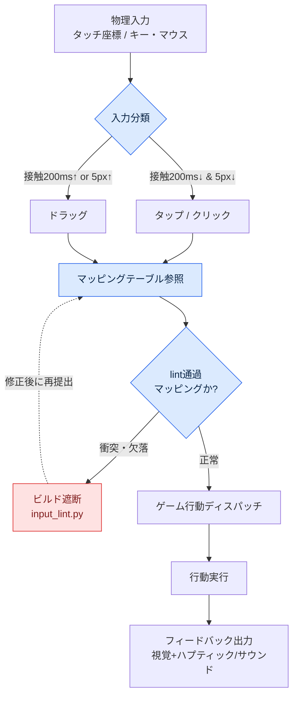

# 14.3 タッチ／マウス入力デザイン

QAビルドを受け取ったチームメンバーBが、片手でスマホを握ったまま眉をひそめました。「スキルを3回押したのに、2回しか出ないんです」。画面をのぞき込むと、親指がスキルボタンを押すその瞬間、同じ指がボタンの横1/3を覆っていました。マウスでテストしていたときには一度も起きなかった問題です。マウスには指がありませんから。

この場面が、タッチとマウスの本質を一行で要約しています。どちらも「一点を指す」入力ですが、一方は指すための道具が画面を覆い、もう一方は覆いません。同じ行動を二つの入力で別々に解かなければならない理由は、ここから始まります。本章ではまず二つの入力の違いを整理し、入力マッピングをAIに提案させたあと、衝突・到達性を自分の手で検証するワークド・トランスクリプトという一本の背骨を、最後までたどります。

---

## 14.3.1 二つの入力の本質的な違い

指の太さ、視界の遮り、マルチタッチの上限、精度がすべて異なります。表に固定する前に、一つの場面で感覚をつかんでおきましょう。マウスカーソルは1ピクセルのペン先で、指は直径1センチ近いハンコです。ペン先は文字を書けますが、一度に1文字ずつです。ハンコは速く押せますが文字は書けず、押す瞬間に紙が見えなくなります。

| 属性 | タッチ | マウス |
|---|---|---|
| 精度 | 約7〜10mm（指の接触面） | 1px単位 |
| 視界の遮り | 指が接触点の周囲を覆う | なし |
| ホバーの可否 | ほぼ不可（接触＝入力） | 自由（移動≠入力） |
| 同時入力 | 2〜10点のマルチタッチ | 左・右・中・ホイール |
| ドラッグ/タップの区別 | 時間と距離で推論が必要 | クリック/ドラッグが明確 |
| ハプティックフィードバック | 可能 | ほぼなし |

この中でデザインへの影響がもっとも大きい2行が、「視界の遮り」と「ホバー」です。視界の遮りは結果をどこに表示するかを強制し、ホバーの不在は、モバイルではツールチップという情報チャネルが丸ごと一つ消えるという意味です。残りの4行は、この2行から派生する細部に近いものです。

公開標準がこの違いを数値で打ち付けています — タッチ44pt（HIG）・48dp（Material）・コントラスト4.5:1・タッチターゲット24CSSピクセル（WCAG SC2.5.8）といった公開標準は§9.1のルールブックに従います。これらの数字は好みではなく人体と測定の産物であり、マッピングを検証するときに当てる物差しも、結局この標準なのです。

## 14.3.2 ゲームの行動別マッピング

移動・攻撃・スキルの3つの行動を二つの入力で解くと、次のように分かれます。一つの行動に方式が3つずつあるというのは、正解がないという意味ではなく、ゲームのアイデンティティが選択を強制するという意味です。

- 移動 — タッチ: ⓐ仮想ジョイスティック（左側） ⓑ画面タップ→自動移動 ⓒドラッグ→カメラ回転 / マウス: ⓐWASD ⓑクリック→自動移動 ⓒマウス移動→視点
- 攻撃 — タッチ: ⓐ攻撃ボタンをタップ ⓑ敵をタップ→自動攻撃 ⓒスワイプ→コンボ / マウス: ⓐ左クリック ⓑ敵をクリック→自動攻撃 ⓒ連打→コンボ
- スキル — タッチ: ⓐスロットをタップ ⓑスロット長押しで照準 ⓒジェスチャー / マウス: ⓐキー1〜8 ⓑキー+マウス照準 ⓒマクロ

著者が作業しているプロジェクトA（モバイル優先のMMORPG）は、移動についてモバイルはⓐ+ⓑのハイブリッド（ジョイスティックと自動移動の併用）、PCはWASD+自動移動を採用しました。攻撃はモバイルがⓑ+ⓐ（敵をタップしてからボタン）、PCはⓐ・ⓑの自由選択です。スキルはモバイルがⓐ、またはターゲティング時はⓑ、PCはキー1〜8にマウス照準を載せます。同じゲーム、同じ行動なのにマッピング表が2枚できるという点が、本章のすべてです。

問題は、マッピング表が長くなるほど衝突が隠れることにあります。スロットの長押し（スキル照準）と画面ドラッグ（カメラ回転）が同じ領域で重なったらどうなるでしょうか。1〜8のキーがスキルに割り当てられているのに、誰かがインベントリのショートカットも1で提案してきたら？　人の目で表をなぞるだけでは見落とします。だからこそ、マッピングはAIに提案させつつ、検証はツールに任せるワークフローが必要です。

## 14.3.3 ワークド・トランスクリプト — AIのマッピング提案とlint検証

ここからが本章の背骨です。PCのキーボード/マウスマッピングの草案をClaudeに提案させ、その出力を人が検証し、衝突・到達性のlintを回して却下し、再依頼する1サイクルを丸ごと載せます。要約はしません。生の出力には間違いも含まれていて、私たちはその間違いを捕まえる過程を見ようとしているのです。

### プロンプト（全文）

> あなたはPC向けMMORPGの入力マッピングを設計する。以下の行動リストをキーボード/マウスにマッピングしたJSONを提案すること。
>
> 行動: 移動（前後左右）、ダッシュ、ジャンプ、通常攻撃、スキル1〜8、インベントリ、マップ、キャラクター画面、メニュー、視点ロックトグル、ズームイン/ズームアウト、コンテキストメニュー（補助行動）、自動移動トグル。
>
> 制約:
> - 業界の慣習に従うこと（WASD移動、ESCメニューなど）。
> - 一つの物理キー/ボタンに二つの行動を重ねないこと。
> - 各項目に`action`、`input`、`note`フィールドを付けること。
> 出力はJSON配列のみ。

### Claudeの生の出力（そのまま、手を加えず）

```json
[
  {"action": "move_forward",  "input": "W",      "note": "標準の移動"},
  {"action": "move_back",     "input": "S",      "note": "標準の移動"},
  {"action": "move_left",     "input": "A",      "note": "標準の移動"},
  {"action": "move_right",    "input": "D",      "note": "標準の移動"},
  {"action": "run",           "input": "Shift",  "note": "押している間ダッシュ"},
  {"action": "jump",          "input": "Space",  "note": "標準"},
  {"action": "attack_basic",  "input": "Mouse1", "note": "左クリックの主行動"},
  {"action": "skill_1",       "input": "1",      "note": ""},
  {"action": "skill_2",       "input": "2",      "note": ""},
  {"action": "skill_3",       "input": "3",      "note": ""},
  {"action": "skill_4",       "input": "4",      "note": ""},
  {"action": "skill_5",       "input": "5",      "note": ""},
  {"action": "skill_6",       "input": "6",      "note": ""},
  {"action": "skill_7",       "input": "7",      "note": ""},
  {"action": "skill_8",       "input": "8",      "note": ""},
  {"action": "inventory",     "input": "I",      "note": "Tabはターゲット切り替えに譲る"},
  {"action": "map",           "input": "M",      "note": ""},
  {"action": "character",     "input": "C",      "note": ""},
  {"action": "menu",          "input": "Escape", "note": "標準"},
  {"action": "cam_lock",      "input": "Mouse3", "note": "ホイールクリックで視点ロックをトグル"},
  {"action": "zoom_in",       "input": "WheelUp",   "note": ""},
  {"action": "zoom_out",      "input": "WheelDown", "note": ""},
  {"action": "context_menu",  "input": "Mouse2", "note": "右クリックの補助行動"},
  {"action": "auto_move",     "input": "Mouse2", "note": "右クリックダブルで自動移動"}
]
```

出力はきれいに見えます。だから危険なのです。一番下の2行を見てください。`context_menu`と`auto_move`が、どちらも`Mouse2`（右クリック）に割り当てられています。制約に「一つのキーに二つの行動を重ねないこと」とはっきり書いたにもかかわらず、モデルは「ダブルクリックで区別できる」という言い訳を`note`に添えて重ねました。これが、AIの出力をそのままビルドに入れてはいけない理由です。人が表をなぞると23行中22行目と23行目の衝突は見落としやすく、モデルは自分の衝突を合理化します。

だから検証を目ではなくコードに任せます。衝突（同じ入力の重複）と到達性（必須行動の欠落、両手の親指コーナーの外）を検査する小さなlintを回します。

```python
# input_lint.py — 入力マッピングの衝突・到達性検査
import json, sys
from collections import defaultdict

REQUIRED = {"move_forward","move_back","move_left","move_right",
            "attack_basic","menu","inventory","map"}

def lint(mapping):
    errors, warns = [], []
    seen = defaultdict(list)
    for m in mapping:
        seen[m["input"]].append(m["action"])
    # 1) 衝突: 同じ入力に2つ以上の行動
    for inp, acts in seen.items():
        if len(acts) > 1:
            errors.append(f"CONFLICT  {inp} <- {', '.join(acts)}")
    # 2) 到達性: 必須行動の欠落
    actions = {m["action"] for m in mapping}
    for r in sorted(REQUIRED - actions):
        errors.append(f"MISSING   required action '{r}'")
    # 3) 空のnote警告（設計意図の未記載）
    for m in mapping:
        if not m["note"].strip():
            warns.append(f"NO_NOTE   {m['action']} ({m['input']})")
    return errors, warns

data = json.load(open(sys.argv[1], encoding="utf-8"))
errs, warns = lint(data)
for e in errs:  print("[ERROR]", e)
for w in warns: print("[WARN] ", w)
print(f"\n=> {len(errs)} error(s), {len(warns)} warning(s)")
sys.exit(1 if errs else 0)
```

上のJSONを`claude_map.json`として保存し、lintを回した実際の出力はこうです。

```
[ERROR] CONFLICT  Mouse2 <- context_menu, auto_move
[WARN]  NO_NOTE   skill_1 (1)
[WARN]  NO_NOTE   skill_2 (2)
[WARN]  NO_NOTE   skill_3 (3)
... (skill_4~8も同様)

=> 1 error(s), 8 warning(s)
```

lintは、人の目が見落としたただ一つの衝突を正確に拾い上げました。到達性検査は通過しました（必須8行動がすべて存在）。空の`note`8件は警告にすぎずビルドは止めませんが、設計意図の未記載という負債をあらわにします。次は却下の理由を持って、モデルに突き返します。

### 人による却下 + 再依頼

> lintの結果、`Mouse2`にcontext_menuとauto_moveが重なっているため却下する。ダブルクリックでの区別は右クリックに遅延が生じ、戦闘中に誤作動する。auto_moveは別の入力に分離すること。また、skill_1〜8のnoteが空になっている — 各スロットがどの系統のスキルなのか、1行ずつ埋めること。

### Claudeの再出力（衝突解消分のみ抜粋）

```json
  {"action": "context_menu", "input": "Mouse2",      "note": "右クリック = 補助/コンテキスト行動のみ"},
  {"action": "auto_move",    "input": "Numpad0",     "note": "自動移動トグル、戦闘キーと物理的に分離"},
  ...
  {"action": "skill_1", "input": "1", "note": "近接の主力スキル"},
  {"action": "skill_8", "input": "8", "note": "緊急回避/生存スキル — 小指の到達限界のためQへの再配置を検討"}
```

再出力の最後の行が興味深いところです。モデル自身が「8番キーは小指の到達限界」だとして、到達性の問題を自己申告しました。これは次節で扱う到達性検証と、まさに同じテーマです。lintをもう一度回すと`0 error(s)`で通過します。核心はこれです。AIは23行の草案を素早く作りますが、その草案の合法性は、人が定義したルール（REQUIRED集合、衝突の定義）とコードが保証します。提案はモデル、判定はツール、決定は人です。

## 14.3.4 入力フロー — マッピングが画面に届くまで

1回の物理入力がゲーム行動に変換される経路を描いておくと、先ほどのlintがどの地点に挟まるのかが見えてきます。



左上から入ってきた物理入力は、まずタップかドラッグかに分類されます（次節の200ms/5px基準）。分類された入力はマッピングテーブルを参照しますが、そのテーブルがビルドに入る前に`input_lint.py`を通過しなければならない、という点がこの図の核心です。衝突や欠落があればディスパッチ段階に進めず、遮断されます。マッピング検証はランタイム以前、ビルドゲートで終わらせるべきです。

## 14.3.5 タッチデザインの5原則

ここからは、マッピングが通過したものとして、そのマッピングが指と出会う表面を設計します。

**原則1 — 最小タッチ面積。** Apple HIGの44pt、Materialの48dpが下限です。HD画面ではおおよそ100px（Retina 2倍環境では200px）前後に取れば、二つの標準を同時に満たします。これを下回ると、冒頭の「3回押して2回」が統計として現れます。

**原則2 — 親指の到達領域。** モバイルMMORPGは横持ち両手グリップが標準で、押す要素は左右の下コーナーに、消費アイテム/スロットは中央下部に置きます（3領域モデルの根拠は§9.1）。P0行動（左=移動、右=攻撃・スキル）は左右下の2つのコーナーの中に、あまり見ない情報は到達限界の外である上部に置きます。2つのコーナーを合わせても画面の半分に満たないという点が、入力設計の核心です。次のSVGが、横向きモードでの両手の親指の到達領域と中央下部のスロット帯を示しています。

<svg viewBox="0 0 420 240" xmlns="http://www.w3.org/2000/svg" role="img" aria-label="横向きモードでの両手親指の到達領域">
  <rect x="10" y="10" width="400" height="220" rx="14" fill="#f7f7fa" stroke="#333" stroke-width="2"/>
  <!-- 左親指の扇形 -->
  <path d="M 30 230 A 150 150 0 0 1 180 80 L 30 80 Z" fill="#3a7bd5" opacity="0.20"/>
  <path d="M 30 230 A 95 95 0 0 1 125 135 L 30 135 Z" fill="#3a7bd5" opacity="0.40"/>
  <!-- 右親指の扇形 -->
  <path d="M 390 230 A 150 150 0 0 0 240 80 L 390 80 Z" fill="#d5533a" opacity="0.20"/>
  <path d="M 390 230 A 95 95 0 0 0 295 135 L 390 135 Z" fill="#d5533a" opacity="0.40"/>
  <!-- 中央上部の矩形領域 -->
  <rect x="150" y="22" width="120" height="50" rx="6" fill="#999" opacity="0.18"/>
  <text x="210" y="52" font-size="12" text-anchor="middle" fill="#444">上部 = 到達外（情報表示）</text>
  <!-- 中央下部のスロット帯（アンバー — 消費・クイックスロット） -->
  <rect x="160" y="178" width="100" height="36" rx="6" fill="#f59e0b" opacity="0.35" stroke="#f59e0b" stroke-width="1.5" stroke-dasharray="4 3"/>
  <text x="210" y="200" font-size="10" text-anchor="middle" fill="#92400e">中央下部 = 消費・クイックスロット</text>
  <text x="78" y="205" font-size="12" text-anchor="middle" fill="#1c4a8a">左親指</text>
  <text x="342" y="205" font-size="12" text-anchor="middle" fill="#8a2a1c">右親指</text>
  <text x="78" y="160" font-size="10" text-anchor="middle" fill="#1c4a8a">快適</text>
  <text x="342" y="160" font-size="10" text-anchor="middle" fill="#8a2a1c">快適</text>
  <text x="210" y="225" font-size="11" text-anchor="middle" fill="#555">濃い領域 = P0ボタン配置 / 淡い領域 = 到達限界</text>
</svg>

濃い扇形が親指が無理なく届く場所で、淡い扇形が手を伸ばさないと届かない限界です。14.3.3の再出力でモデルが申告した「8番キーは小指の限界」がPC版の話だとすれば、モバイル版での相当する間違いが、まさにこの淡い領域にP0ボタンを置くことです。

**原則3 — 視界の遮りの回避。** 指は接触点だけを隠すのではなく、その上に手全体が画面を覆います。右下のスキルをタップすると、右下の約1/4が見えなくなります。だから行動の結果（ダメージ数字、状態変化）は、指が届かない領域に表示します。左側のジョイスティックを握る手はキャラクターとミニマップの位置を侵すので、ミニマップは右上に移します。

**原則4 — ドラッグ/タップの区別。** マウスと違い、タッチはユーザーの意図を時間と距離で推論しなければなりません。ゲーム全体で一つの基準に統一します — たとえば接触200ms以内かつ移動5px以内ならタップ、それ以上ならドラッグ。この2つの数字がばらつくと、「タップしようとしたらキャラクターが転がった」といった意図の失敗が積み重なります。先ほどのmermaidの分岐点が、まさにこの判定です。

**原則5 — ハプティック。** 振動は、画面を見ていなくても伝わる唯一のチャネルです。ただし、すべての入力に振動を付けるとノイズになります。通常のタップは無振動、スキル使用は短く、決済確認のような危険行動は強く、敵撃破は微細に — 4〜5種類以内で運用します。

## 14.3.6 マウスデザインの5原則

マウスは、タッチにはない3つの贅沢を享受します。ホバー、複数ボタン、カーソルの精度です。

**原則1 — ホバー。** マウスは押さなくても指せます。スキルスロットにマウスを載せると名前・クールタイム（クールダウン）・説明のツールチップが表示され、クリックすると使用されます。タッチにはこの中間状態がないので、ホバーはPCが情報をさらに載せられる通路です。ただし、ホバーだけに依存する情報はモバイル版で行き場を失うという点を、14.3.3のマッピング段階であらかじめ意識しておく必要があります。

**原則2 — 複数ボタン。** 左クリックは主行動、右クリックは補助/コンテキスト、ホイールクリックは視点リセット、ホイールはズーム。先ほどのlintが捕まえた衝突は、まさにこの右クリックに二つの行動を重ねた事例でした。ボタンが多いからと全部埋めようとして、衝突を作ってしまうのです。

**原則3 — キーボード標準。** ESC=メニュー、M=マップ、1〜8=スキル、WASD=移動、Shift=ダッシュ、Space=ジャンプ。ユーザーが学ばなくても推測できなければなりません。標準から外れるキーには相応の理由を`note`に書いておきます。14.3.3でTabをインベントリではなくターゲット切り替えに譲った決定が、その例です。

**原則4 — 視点制御。** マウスドラッグで視点を回しつつ、カーソルを画面にロックするゲームモードと解除するUIモードを明確にトグルします。このトグルが曖昧だと、メニューを閉じたのにカーソルが消えるという混乱が生じます。

**原則5 — マクロ・自動化の許容範囲。** 自動攻撃・自動移動をどこまで許容するかは、ゲームのアイデンティティの問題です。緩めすぎるとPCがマクロ画面になり、一律に禁止するとモバイルから移ってきたユーザーの参入障壁が高くなります。正解はスペクトラムのどの点をゲームの色に合わせて選ぶかであって、両極端ではありません。

## 14.3.7 両プラットフォーム共通 — 入力フィードバックの統一

原則はプラットフォームごとに異なりますが、ユーザーが同じ行動に対して受け取る「感触」は、プラットフォームが変わっても同じであるべきです。モバイルからPCに移ってきたユーザーに、ボタンの光り方の意味を学び直させてはいけません。

| 状況 | タッチ | マウス |
|---|---|---|
| 入力認識 | ボタンの発光 + 短いハプティック | ボタンの発光 + クリック音 |
| 入力失敗 | ボタンの揺れ + ハプティック | ボタンの揺れ + 警告音 |
| クールタイムの進行 | 円形ゲージ | 円形ゲージ |
| 使用可能への回復 | 発光 + ハプティック | 発光 + サウンド |

視覚チャネル（発光・揺れ・ゲージ）は両者で同一とし、補助チャネルだけをプラットフォームに合わせてハプティック↔サウンドで分けます。この一貫性が、マルチプラットフォームユーザーの学習コストを半分に減らします。

## 14.3.8 よくある失敗と処方

| パターン | 処方 |
|---|---|
| ボタンが標準下限（44pt/48dp）未満 | 100px前後に強制 |
| 指で隠れる領域に結果を表示 | 隠れない領域へ移動 |
| ハプティックの乱発 | 4〜5種類以内 |
| 右クリックに二つの行動が重複 | lintで衝突を遮断してから分離 |
| ホバー専用の情報をモバイルにそのまま | モバイルはタップ/長押しの代替チャネル |
| キーマッピングの固定 | ユーザーカスタマイズを許可 |
| 両プラットフォームに同一マッピングを強制 | プラットフォームごとに自然なマッピング |

この表の4行目が、14.3.3のワークド・トランスクリプトの結論です。右クリックの衝突は、人の目で表をなぞるだけではほぼ毎回見落とされ、lintをビルドゲートに掛けておけばほぼ毎回捕まります。

---

### 本章のポイント
- タッチは指が画面を隠すハンコ、マウスは隠さないペン先 — 片方のUXをそのまま移すと手と食い違います。
- 入力マッピングはAIが提案し、衝突・到達性はlintが判定します — 人の目は23行のうち衝突の1行を見落とします。
- フィードバックの視覚チャネルは両プラットフォームで統一し、補助チャネルだけをハプティック↔サウンドで分けます。

### 次章のプレビュー
- 15.1 運営（ライブオプス） — リリース後にゲームが生きていくサイクル

---

### やってみよう（setup → prompt → verify）

1. **setup** — 行動リストと制約を一つのファイルにまとめましょう（移動・攻撃・スキル・UI・視点）。先ほどの`input_lint.py`をプロジェクトに置きます。`REQUIRED`集合を自分のゲームの必須行動に置き換えます。
2. **prompt** — 14.3.3のプロンプト全文をそのまま使い、行動リストだけを差し替えましょう。出力はJSON配列のみを受け取るように固定します。
3. **verify** — 受け取ったJSONを`python input_lint.py claude_map.json`で回しましょう。ERRORが0になるまで、却下の理由（衝突した入力・欠落した行動）を明示して再依頼します。WARN（空のnote）は、設計意図の未記載という負債として別途記録します。

### 一人ミニ版
一人で作る小さなゲームなら、ツールを減らしましょう。行動が10個以内なら、`REQUIRED`集合と「同じ入力の重複」検査の二つだけを残した20行のlintで十分です。AIにマッピングを出させ、このミニlintで衝突だけをふるいにかけたあと、実機で親指（または小指）が届くか一度押してみてください。提案はモデル、衝突の判定はコード、到達の判定は自分の手 — この三つさえ守れば、規模にかかわらず通用します。
