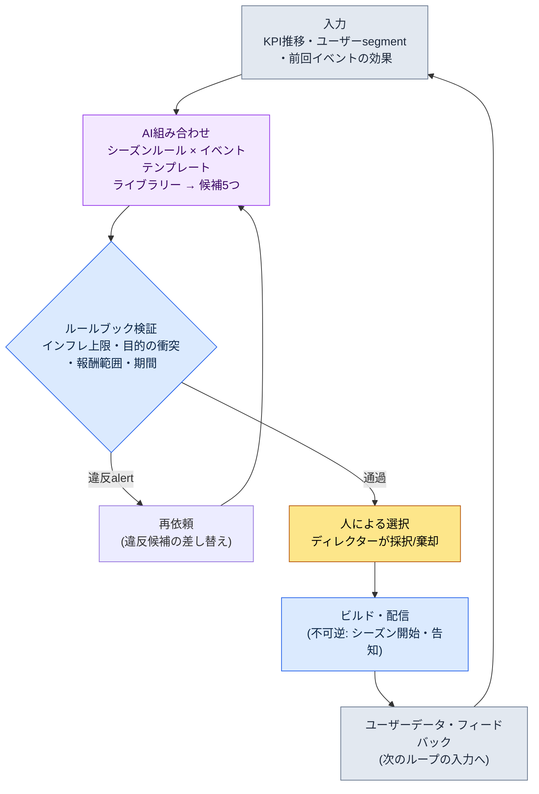

# 15.1 運営（ライブオプス）概観 — イベント候補をAIが組み合わせ、ルールブックがふるいにかけ、人が選ぶ

> 第一読者: リリース後の運営（ライブオプス）を初めて担うプランナー（中規模、10〜50人のチーム）
> 一人/趣味の読者向け縮小バージョン: §15.1.7「一人ならこれだけで十分」
>
> **前提**: 著者はグローバルにリリースされたモバイルMMORPGの運営を、P2E（Play To Earn）経済まで含めて経験しており、そこに現在のプロジェクトのリリース前AIワークフローを合わせて本章を書いています。ワークド・トランスクリプトは「入力→AI組み合わせ→ルールブック検証→人による選択」パターンを、運営の様式で実際に1回回した結果です。推定と観察は推定・観察と明示し、でっち上げたKPIの表は載せていません。

リリース翌日の朝のオフィスは、リリース前とは違います。マイルストーンが終わったのに仕事は減らず、むしろ単位だけが細かくなります。四半期単位で組まれていたスケジュールが、週・日・時間単位に刻まれていきます。そして毎週、同じ質問が会議室に戻ってきます。「今週末のイベント、何を回しましょうか？」

この質問が毎週白紙から始まるなら、運営チームはすぐに疲弊します。本章は、その質問を白紙から引き上げる方法を扱います。核心は2つです。第一に、イベントとシーズンを毎回新しくひねり出す代わりに、**検証済みの様式のライブラリー**として蓄積しておくこと。第二に、「その様式を組み合わせて来週の候補を5つ作る」という退屈な下書き作業をAIに任せ、人は**ルールブック検証を通過した候補のどれを採択するか**だけを決めること。ゼロから作るのと、5つの中から選ぶのとでは、作業負担が違います。

---

## 15.1.1 運営は「感覚」ではなく「ループ」である

運営の標準サイクルを表で覚えさせる本は多くあります。月曜に報告し、火・水に準備し、金曜に配信するという話です。どれも正しいのですが、表を覚えるだけでは、「今週のイベント」という毎週戻ってくる決定がどのように下されるのかが見えません。運営の本質はスケジュール表ではなく**閉じたループ**です — 候補が生まれ、検証を通過し、人が選び、ビルドとして出ていき、ユーザーデータが再び次の候補の入力になる一巡です。

このループの上で、運営の4軸（コンテンツ・イベント・バランス・CS）がそれぞれの速度で回ります。コンテンツは月〜四半期、イベントは週〜月、バランスは週〜隔週、CSは日・時間単位です。4軸がばらばらに回ると、同じユーザーデータを見ても毎週違う決定が出てきます。だからこそ4軸を1つのループに束ね、そのループの1マス（イベント候補の生成）をAIが回せる形にすることが、本章の目標です。



人の手が触れる場所は2か所だけです。いちばん上で入力（KPI・segment・過去の効果）をきれいに入れる場所、そして検証を通過した候補のどれを出すかを決める場所です。その間の退屈な「組み合わせを5つひねり出す」と「ルール違反をふるいにかける」は、AIとルールブックが回します。そしていちばん下の1行 — ビルドとして出ていったイベントが生んだユーザーデータが、再び入力として戻ってくるという点 — が、このループを運営らしくします。リリース前の設計は一度出たら終わりですが、運営は結果が次の入力になります。

このループに入る2つのライブラリー（シーズンルール・イベントテンプレート）の具体は§15.2で、最後のマス（ユーザーフィードバックの自動分類）は§15.3で見ます。本章は、ループを最後まで一巡することに集中します。

---

## 15.1.2 [ワークド・トランスクリプト] イベント候補5つの組み合わせ → ルールブック検証 → 人による選択

実際にどう回すのか、1サイクルを最後まで見せます。以下は、著者がリリース前のコンテンツツールで検証した「ライブラリー組み合わせ → ルールブック検証 → 人による選択」パターンを運営の様式（シーズンルール + イベントテンプレート）に移し、実際に1回回したセッションを再現したものです。入力プロンプトはそのままコピーして使えます。出力はそのセッションを再構成したものです。

### ステップ1 — 入力: ライブラリーと現在の状況をそのまま投げる

まず、組み合わせの材料2つを、機械が読める形で置きます。イベントテンプレートライブラリー（検証済みの様式）とシーズンルールライブラリー、そして今週の現在状況（KPI・segment）です。ライブラリーは一度作っておけば毎週再利用します。

```yaml
# event_templates.yaml — 検証済みイベントテンプレートライブラリー (抜粋、9種中4種)
- id: tpl_attendance      # ログインボーナス
  目的: [新規流入, 休眠復帰]
  期間_推奨: 7~14日
  報酬等級: 低~中
- id: tpl_coop_raid       # 協力レイド
  目的: [既存活性化, コミュニティ]
  期間_推奨: 3~7日
  報酬等級: 中~高
- id: tpl_pvp_season      # PvPシーズン
  目的: [コミュニティ, 既存活性化]
  期間_推奨: 14~28日
  報酬等級: 高
- id: tpl_limited_package # 限定パッケージ
  目的: [売上]
  期間_推奨: 3~7日
  報酬等級: 高 (課金連動)

# season_rules.yaml — シーズンルールの断片 (抜粋)
season_inflation_cap: 四半期あたり '高' 等級報酬イベント ≤ 3回
purpose_conflict_rule: 同一週に [売上] 目的イベント2つの同時実施を禁止
overlap_rule: '高' 報酬イベントは同時2つ禁止 (疲労・インフレ)

# current_state.yaml — 今週の状況
週: 2026-W23
直近2週_売上イベント: 1回 (四半期累計 '高' 等級2回)
DAU_推移: 緩やかな下落 (直近4週 -6%, 業界観察上 '警戒' 区間)
主要_segment: 復帰可能_休眠層の比重が上昇
今後の外部日程: なし
```

### ステップ2 — プロンプト: 組み合わせを任せつつ、形式とルールを強制する

```
添付したテンプレート・シーズンルール・今週の状況のyamlから、来週のイベント候補を5つだけ組み合わせて。
新しいメカニズムは作らず、添付テンプレートの組み合わせのみで。シーズンルール違反の有無は自分で表示し、
各候補がいまの信号(DAU下落・休眠復帰)になぜ合うのか、一行ずつ根拠を付けて。
目的が売上だけに偏らないよう分散させ、曖昧なものは表示してこちらに渡して。
表のみで、列は候補・テンプレート組み合わせ・主目的・期間・ルール違反・根拠・曖昧。
```

ルール5行のどれ1つとして「何を作るか」を語っていない点に注目してください。すべて「どの枠の中で、何を根拠に答えるか」という制約です。AIに自由を与えると、一般的なRPGの平均的なイベントを吐き出してくるからです。**材料をライブラリーに制限（ルール1）、シーズンルールの自己点検義務（ルール2）、現在の信号への対応根拠義務（ルール3）、目的の分散（ルール4）、そして「曖昧なら人に渡せ」という逃げ道（ルール5）** — 5行が合わさって、候補の形ではなく候補の資格を定めます。

### ステップ3 — Claudeの出力（再構成・抜粋）

以下は、要約していない生の出力です。ルール違反と曖昧の申告が混ざっています。

```
| 候補 | テンプレート組み合わせ        | 主目的     | 期間  | ルール違反 | 根拠                                         | 曖昧 |
|-----|------------------------------|-----------|-------|-----------|----------------------------------------------|------|
| C1  | tpl_attendance               | 休眠復帰   | 10日  | なし      | 復帰休眠層の比重上昇に直接対応、報酬 '中'      | -    |
| C2  | tpl_coop_raid                | 既存活性化 | 5日   | なし      | DAU下落期の接続動機付け、コミュニティ刺激      | -    |
| C3  | tpl_attendance+tpl_coop_raid | 休眠復帰+活性化 | 7日 | なし   | ログインボーナスで復帰を誘引 + レイドで残存、結合シナジー | -  |
| C4  | tpl_pvp_season               | コミュニティ | 21日 | なし      | 長期シーズンで残存曲線そのものを引き上げる     | ★    |
| C5  | tpl_limited_package          | 売上       | 5日   | ★違反     | 四半期 '高' 等級累計2回 → 追加時に上限へ近接/超過 | -    |

ルール点検結果:
- C5: season_inflation_cap違反リスク。今四半期の '高' 等級報酬イベントが
  すでに2回。C5を加えると3回で上限の境界。DAU下落期の売上プッシュは
  ユーザー疲労を増しかねず、信号とも逆方向。
- C4: ルール違反はないものの、21日のPvPシーズンは今週1週間ではなく3週間を
  占有する。'今週の候補' として適切かは運営ポリシーの判断が必要 → 曖昧と表示。
- C1・C2・C3はルール通過、現在の信号(休眠・DAU)と整合。
```

出力でいちばん価値があるのは、表ではなく**いちばん下のルール点検3行**です。AIがC5のインフレ違反を自分で捕まえて表示し、C4は「違反ではないが判断が分かれる」と人に渡しました。よいプロンプトは、AIが自分の限界を申告し、人にボールを渡せるようにします。

### ステップ4 — 検証と選択（人の出番）

この出力をそのまま受け取ってはいけません。ルールブックでもう一度ふるいにかけ、その次に人が選びます。このセッションでは、実際に2つの判断が分かれました。

まず、**C5は拒否**です。AIがすでにインフレ違反を表示しており、ルールブックのコード（§15.1.3）も同じ判定を出しました。四半期「高」等級の上限に掛かり、DAU下落期の売上プッシュは現在の信号と逆方向です。議論することはありません。外します。

次は**C4（21日のPvPシーズン）**です。AIが「曖昧」として渡してきた場所です。ルール違反はありませんが、これは「今週のイベント」ではなく「今シーズンの決定」です。1週間のループで即決する案件ではなく、シーズン統合会議に上げるべきものです。そこで今週の候補からは保留し、シーズンカレンダーの議題として別に切り出します。

残ったC1・C2・C3の中から、ディレクターが選びます。現在の信号（復帰休眠層の上昇 + DAUの緩やかな下落）にいちばん合うのは、**C3（ログインボーナス+協力レイドの結合）**でした。ログインボーナスで休眠層を呼び込み、レイドで呼び込んだユーザーをつなぎ留める結合シナジーが、今週の信号と整合していました。C1・C2は来週の候補プールに残しておきます。

ここで終わらなかった候補が、もう1つありました。C3の採択を決めてみると、7日間の期間の最終日が、近づいている定期メンテナンス日と1日重なっていました。そこで再依頼が1回回ります。

```
C3を採択する。ただし7日間の期間のうち、最終日が定期メンテナンス日と重なる。
メンテナンスでイベント終盤の参加が途切れないよう、期間を調整して再提案して。
報酬総量は維持し、日程だけ前倒しして。
```

AIは開始日を1日前倒しし、メンテナンス前に終了するように答え直し、その調整はルールブックを通過しました。入力 → AI組み合わせ → ルールブック検証 → 人による選択 → 日程再調整という1サイクルが、ここで閉じます。

この一巡が、本書全体のShowの基準です。AIが何を組み合わせ、ルールブックが何をふるいにかけ、人が何を選び何を拒否するのか。これを一度でも最後まで見なければ、「AIでイベント候補を出す」という文は空虚です。

---

## 15.1.3 ルールブックをコードに — 候補の自動検証

候補がシーズンルールを守っているかを毎週目視で確かめていると、また見落とします。§15.1.2の3つのルールのうち、数字で判定できるものはコードにチェックさせます。人は、コードが捕まえられない「曖昧」と「選択」にだけ時間を使います。

```python
# event_lint.py — 来週のイベント候補の検証 (骨格)
# 入力: AIが組み合わせた候補リスト + シーズンルール + 四半期累計の状態
# 出力: ルール違反リスト (自動拒否ではなくalert)

def lint(candidates, season, quarter_state):
    issues = []
    high_used = quarter_state["high_reward_count"]  # 四半期累計 '高' 等級回数
    for c in candidates:
        # ルールA: インフレ上限 (四半期あたり '高' 等級 ≤ 3)
        if c["報酬等級"] == "高" and high_used + 1 > season["inflation_cap"]:
            issues.append(f"[A] {c['id']}: '高' 等級の追加で四半期上限 "
                          f"{season['inflation_cap']}回を超過 (現在 {high_used})")
        # ルールB: 同一週 [売上] 目的2つ禁止
    sales = [c for c in candidates if "売上" in c["目的"]]
    if len(sales) > 1:
        issues.append(f"[B] [売上] 目的の候補が{len(sales)}件同時 → 1件に制限")
        # ルールC: 目的の偏り (5件中1つの目的が過半なら分散不足)
    from collections import Counter
    top = Counter(c["主目的"] for c in candidates).most_common(1)[0]
    if top[1] > len(candidates) // 2:
        issues.append(f"[C] 目的 '{top[0]}' {top[1]}件の偏り (分散不足)")
    return issues
```

このコードが、会議での「これは報酬が強すぎませんか？」という押し問答を、数字1行で片付けます。`[A] tpl_limited_package: '高' 等級の追加で四半期上限 3回を超過 (現在 2)`とコードが出力すれば、議論することはありません。外せばよいのです。§14.1（モバイルHUD）で扱ったlintゲートを、運営の次元に移したものです — 決定論で捕まえられるものはコードが、判断が必要なものは人が受け持つという分担は、運営でもそのまま成立します。

ただし、1つだけ違います。このlintは、違反を発見しても**自動で候補を廃棄しません。**alertを上げるだけです。§6.2（都市ジェネレーター）で見たのと同じ設計です。自動拒否型の検証を付けると、意図された変則（例: 四半期上限を知ったうえで、意図的に売上イベントを入れるキャンペーン決定）まで機械が殺してしまいます。疑わしい候補は機械が拾い、生かすか殺すかはディレクターが決めます。§15.1.2でC5を拒否したのも、lintが殺したのではなく、lintのalertを見て人が下した決定でした。

---

## 15.1.4 リリース前とリリース後 — 何が変わるのか

上のループがリリース前の設計ループと決定的に違う点は2つです。表で並べるより、この2つだけを正確に押さえます。

第一に、**結果が次の入力になります。**リリース前は、仕様書を書けばビルドまで一方向に流れます。運営では、今週のイベントが生んだユーザーデータ（参加率・離脱・売上・フィードバック）が、来週の候補組み合わせの入力（`current_state.yaml`）として戻ってきます。§15.1.1のループのいちばん下の矢印が、その回帰です。だから運営のKPIは「一度うまく当てること」ではなく、「毎週信号に合わせて調整すること」です。

第二に、**実験コストは小さくなりますが、不可逆な地点はより鋭くなります。**リリース前は一度の決定が四半期を左右しましたが、ライブでは1週間のイベントを回してみて、合わなければ翌週に変えます。ロールバック可能な実験が増えます。しかし、**シーズン開始とイベント告知は不可逆**です。§5.4.5で扱った「録音・キャスティング = 不可逆段階」の原則が、そのまま働きます。ユーザーがすでに見たシーズンルール・報酬は、「取り消し」てもコミュニティの認識に痕跡を残します。だから§15.1.1のループのすべての検証（AI組み合わせ・ルールブック・人による選択）は、ビルド・告知という不可逆のマスに入る**前**の可逆段階で終えなければなりません。C4（21日シーズン）を今週の即決から外してシーズン会議に上げたのも、この原則です — 不可逆な地点が大きい決定ほど、より長い可逆の検討を経ます。

この2つが、運営をリリース前の設計とは別の仕事にします。残り（時間単位が四半期→週、フィードバックがベータ→リアルタイム）は、この2軸の派生です。

---

## 15.1.5 保守的適用から進歩的適用へ

§15.1.2のワークド・トランスクリプトは、進歩的適用の一場面です。AIが候補を組み合わせ、人は採択を決めました。しかし、すべてのチームが最初からここまで来るわけではありません。段階があります。

**保守的適用**では、人が候補を発議します。運営チームが月曜の会議でイベントを直接企画し、シーズンルールを手で書き、ユーザーフィードバックを手動で分類します。自動が受け持つのは、測定（KPIダッシュボード）とリグレッションテスト（ビルド検証）だけです。業界の観察では、現在の大半のライブMMORPG運営はこの段階に近いところにあります。

**進歩的適用**では、「イベント候補の発議」と「フィードバック分類」までAIが草案を出します。§15.1.2が前者の場面で、後者（フィードバックの自動クラスタリング）は§15.3で見ます。人の決定は、「どの候補を採択するか」「AIが分類したフィードバックをどう受け止めるか」といったメタ決定に絞られていきます。

進歩的適用が根づくには、3つがそろう必要があります。イベントテンプレート・シーズンルールが再組み合わせ可能な単位に分離・蓄積された**ライブラリー**（§15.1.2の`event_templates.yaml`がその種）、現在の信号を入力として候補を草案の形で出す**候補ジェネレーター**（§15.1.2のプロンプト）、そして入ってくるフィードバックを自動分類する**クラスタリング**（§15.3）です。この3つが§5.3.12（ワールドBT（BehaviorTree、ビヘイビアツリー）・クエストクラウド）・§8.1.8（進歩的バランシング）と同じ骨格だという点が、本書の一貫したメッセージです — 分野は違っても、「検証済みの部品をライブラリーとして蓄積し、AIが組み合わせ候補を出し、人が採択する」という構造は同じです。

ここで、1つはっきりさせておきます。ライブラリー・候補ジェネレーター・クラスタリングのような発想は、2010年代にも理論的には可能でした。塞がっていたのは、AIがイベント告知文・ルール説明のような**ユーザーが読む自然言語**を書けず、日に数百〜数千件のフィードバックを自然言語で要約・分類できなかったからです。LLMの発展（2023〜）以降その2つの壁が下がり、紙の上にしかなかった進歩的運営のかなりの部分が、実現の領域に入ってきました。

---

## 15.1.6 よくある失敗

| パターン | なぜ失敗するか | 処方 |
|---|---|---|
| 毎週白紙からイベントを企画 | 運営チームがやがて消耗し、候補の質がコンディション次第で揺れる | イベントテンプレートライブラリーとして蓄積（§15.1.2） |
| 「AIよ、イベントを作って」と丸投げ | ライブラリー・ルールなしでは一般的なRPGの平均が出てくる | 材料の制限 + シーズンルールの自己点検を強制（§15.1.2） |
| 候補を目視だけでチェック | インフレ・目的の偏りを毎週見落とす | `event_lint.py`で自動検証（§15.1.3） |
| lintを自動拒否型にする | 意図されたキャンペーン決定まで機械が殺す | alertのみ、採択はディレクター（§15.1.3） |
| 不可逆な決定を週次ループで即決 | シーズン告知後のロールバックがコミュニティに痕跡を残す | 大きな決定はシーズン会議に分離（§15.1.4） |
| 単一KPI（DAU・売上）だけを追う | ユーザー疲労が蓄積し、信号と逆方向の候補を採択 | current_stateに多軸の信号を入力（§15.1.2） |

---

## 15.1.7 やってみよう — 今日できる一歩

**setup → prompt → verify**の順で、一歩だけやってみましょう。

- **setup**: 自分のゲーム（または運営したことのあるゲーム）の検証済みイベント様式4〜5個を、`event_templates.yaml`の形式で手で書き出します（目的・期間・報酬等級だけ）。シーズンルールは1行のものが3つあれば十分です — インフレ上限、目的の衝突禁止、重複禁止。
- **prompt**: §15.1.2のプロンプトをそのまま貼り付け、今週の状況（KPIの方向・主要segment）を`current_state.yaml`に書き込んで1回回します。
- **verify**: 出てきた候補5つのうちルールに違反したもの1つを自分で選び、「これはインフレ上限に掛かる。外してもう一度」と反論してみましょう。AIがどう差し替えるかを見れば、イベントの組み合わせがどんな判断の束なのか、体感として入ってきます。

> **一人ならこれだけで十分**: ライブラリーのyamlも、lintのコードも要りません。好きなゲームの直近1四半期のイベントを5〜6個だけ思い出し、「目的・期間・報酬」の3列で書き出してみましょう。それだけでも、そのゲームが毎週白紙からひねり出していたのではなく、様式を回して使っていたことが見えてきます。その表が、あなたの最初のテンプレートライブラリーです。

チームなら、次の一歩から始めましょう。直近1〜2四半期のイベントを集めて`event_templates.yaml`に正規化し（検証済みの様式だけ）、シーズンルール3行を先に`event_lint.py`としてコードに入れておきます。ライブラリーとルールがあれば、AIの組み合わせ候補でも人の試案でも、同じ物差しで測れます。

---

### 本章のポイント
- 運営はスケジュール表ではなく、閉じたループ — 結果が次の入力になります。
- イベント候補の組み合わせはAIに、ルール違反はlintに、採択はディレクターに。
- シーズン開始・告知は不可逆 — すべての検証は、その前の可逆段階で終えます。

### 次章のプレビュー
- 15.2 イベント・シーズン運営 — テンプレートライブラリーとシーズンルールをどう蓄積するか
