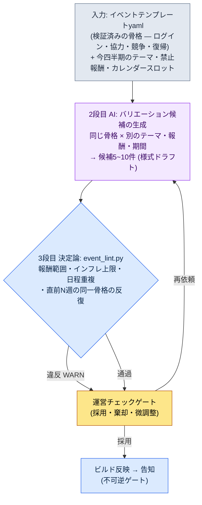
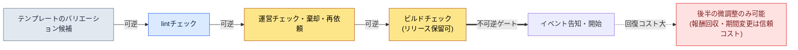

# 15.2 イベント・シーズン運営 — テンプレート1枚からバリエーション候補10件を、チェックだけは人の手で

> 第一読者：運営（ライブオプス）を担うMMORPGプランナー（中規模（10〜50人）チーム）
> 一人/趣味の読者向け縮小版：§15.2.9「一人ならこれだけ」

サービス4年目の運営型ゲームの月曜会議を思い出します。翌週のイベントを何にするかが、毎週白紙から始まりました。誰かが「この前のログインイベントの報酬を少し上げて、もう一度やるのは？」と言えば、別の誰かが「それは2か月前にやった」と返し、報酬をいくら上げるかはまた勘で決めていました。会議が終わると、運営プランナー1人が半日かけてイベントの様式をゼロから埋めていました。毎週、白紙から、半日です。

問題は、アイデアが足りないことではありませんでした。運営チームはすでに、ログイン・協力・競争・復帰という検証済みのイベント骨格をいくつか頭の中に持っていました。その骨格にテーマと報酬だけを差し替えれば、1週間分のイベントができあがります。ただ、その「差し替え」を毎回手作業で、勘でやっていたため、遅く、結果もぶれていました。

本章では、その差し替えをAIに任せる方法を扱います。核心は2つです。第一に、検証済みのイベント骨格を**バリエーション展開できるテンプレートyaml**として入力しておくこと。第二に、テンプレートから翌週の候補を複数出す退屈な仕事はAIに任せ、人は**報酬範囲・重複をコードで弾いたうえでトーンだけをチェック**することです。イベント企画の一般論（ログインは新規流入に効き、協力は活性化に効く、といった類）はすでに他の本に十分ありますから、本章はその知識を*AIワークフローとして回す場*にだけ集中します。

> **著者の運営経験メモ（正直に）**
> リリース後の運営（ライブオプス）を1〜2年単位で直接担った経験は、著者のキャリアの中では一部に限られます。本章のワークフローは、著者が運用している量産・チェックツール（コンテンツ・HUD）をイベント分野に移したものであり、効果の数値が*業界観察＋著者の推定*であることは本文中でそのつど明示します。ツールの構造（テンプレートyaml・lint・チェックゲート）は、著者が実際に運用しているコンテンツ量産ツールと同じ骨格です。

---

## 15.2.1 人がやるのはテンプレート作成と最後のチェックだけ

イベント量産の全体の流れは4段階です。核心は、1段目（テンプレート）と3段目（lint）が決定論で、2段目だけがAIだという点です。コンテンツ量産（§6.2）・HUD圧縮（§14.1）で見たのと同じ分担です。ルールブックが入力と検証を両側から押さえてくれれば、間に挟まったAIが毎回少しずつ違うバリエーションを出しても、報酬バランスとスケジュールはぶれません。



この図で人の手が触れる場所は2か所だけです。いちばん上でテンプレートと今四半期の制約をきれいに入れる場所、いちばん下でlintには捕まえられない「このテーマはいまのうちのゲームの空気に合うか」を判断する場所です。その間にある退屈な候補量産と報酬の算数は、テンプレートとAIとlintが回します。

決定的な設計は、lint（3段目）が違反を見つけても候補を自動で捨てず、運営ゲート（4段目）へWARNとして上げるだけ、という点です。その理由は§15.2.5で見ます。そして、いちばん最後の矢印（告知）が**不可逆**だという点が、ライブオプスを他の量産と分けます。都市NPCは気に入らなければビルド前に廃棄すれば済みますが、ユーザーに告知されたイベントを巻き戻すときは、コミュニティの信頼コストを支払うことになります（§15.2.7）。

---

## 15.2.2 入力 — イベントテンプレートyaml

運営チームが持つ検証済みの骨格を、様式として固定します。自由様式の仕様書のままでは、AIは何を変えればいいのか分かりません。スロットが分かれていて初めて、「このスロットだけ差し替えろ」が成立します。

```yaml
# event_templates/coop_raid.yaml — 協力レイドの骨格 (検証済み、4回運営)
template_id: coop_raid
purpose: [既存_活性化, コミュニティ]      # 1~2個だけ。4つ同時の追求は禁止
core_loop: 期間内にサーバー全体が貢献を累積 → 段階別に全サーバー報酬を解放
duration_range: [5, 10]              # 日。10日を超えると疲労が蓄積
slots:                               # ← AIがバリエーションを作る欄。骨格は固定
  theme: { type: 自由, 제약: 四半期_テーマ_遵守 }
  boss_or_target: { type: 自由, 제약: 既存_ボス_アセット_再利用_優先 }
  reward_tiers: { type: 報酬リスト, count: 3~5, 제약: reward_policy 参照 }
reward_policy:                       # ← lintが読む欄。バリエーション禁止
  강화석_per_event_max: 30           # イベント1回の支給上限
  골드_per_event_max: 50000
  한정코스튬: 許可 (永久所有, 経済影響 0)
  현금성재화_직접지급: 禁止
inflation_guard:
  강화석_분기_누적상한: 90           # 四半期内の全イベント合算
post_event_kpi:                      # ← 事後の自動計測スロット
  - 参加率 (イベント露出に対し1回以上参加)
  - 強化石の価格変動 (事後30日, 目標 ±10%)
  - イベント後の平日プレイ時間 (依存度のシグナル)
```

いちばん重要な分離は、`slots`（AIがバリエーションを作る）と`reward_policy`（lintが読み、AIは手を触れられない）の分離です。テーマとボスは毎回違っていて構いませんが、強化石の支給上限はゲーム経済が定めた一線です。この一線をAIが呼び出しのたびに違う数字で出してしまえば、インフレはその場で始まります。だから報酬の*項目*はAIが提案しつつ、報酬の*量*はポリシーの範囲内でしか動かないようlintが弾きます。

同じフォルダーに`daily_attendance.yaml`（ログイン）、`pvp_ladder.yaml`（競争）、`comeback.yaml`（復帰）が同じ形式で入っています。この4枚が、今四半期の候補生成の入力プールのすべてです。

---

## 15.2.3 [ワークド・トランスクリプト] テンプレート1枚 → バリエーション候補の生成

実際にどう回すのか、1サイクルを最後までお見せします。入力プロンプトはそのままコピーして使えますし、出力は実際の量産セッションを再構成したものです。

### ステップ1 — プロンプト：バリエーションを作らせつつ、骨格とポリシーを強制する

```
添付したcoop_raid.yaml（4回検証済みの協力レイド骨格）で、来週（W2）のバリエーション候補を5件だけ出して。
今四半期のテーマは「夏 — 水・祭り・暑さ」。
core_loopは絶対に触らず、slots（テーマ・ボス・報酬）だけ変えること。
報酬はreward_policyの上限内のみ。候補ごとに、なぜこのテーマ・報酬なのか1行ずつ添えて。
直前3週はログイン・PvPラダー・協力レイドだったから、協力レイドをまた回す候補には[反復注意]、
確信が持てなければ[あいまい]を付けてこちらに回して。表のみで。列は候補名・テーマ・報酬tier要約・根拠・フラグ。
```

6行のルールのうち、テーマや報酬を*指定する*行は1行もありません。すべて「ここまでだけ変えろ、これを超えるな、迷ったら申告しろ」という柵です。「夏イベントを作って」のように手綱を緩めると、ありふれたモバイルRPGの平均が出てくるからです。**バリエーションの範囲（slotsのみ）、報酬上限（reward_policy）、反復注意（直前3週の履歴）、そして「あいまいなら人へ」** — この柵が骨格を守らせ、バリエーションを解き放ちます。

### ステップ2 — Claudeの出力（実セッションの再構成、抜粋）

```
| 候補名        | テーマ           | 報酬tier要約                      | 根拠                                | フラグ      |
|--------------|----------------|----------------------------------|------------------------------------|------------|
| 氾濫の堤      | 川の氾濫を防ぐ    | 強化石25 / ゴールド4万 / コスチューム | 協力=堤防築きの隠喩、累積貢献に直結      |            |
| 灯籠流し      | 夏の水祭り       | 強化石20 / ゴールド3万 / 称号        | 祭りのトーン、競争より雰囲気の転換       |            |
| 猛暑ボス戦    | 暑さの化身を討伐  | 強化石30 / ゴールド5万 / コスチューム | 既存ボスアセットの再利用、報酬上限       | [反復注意]  |
| 海流レース    | 潮流に乗って競争  | 強化石28 / ゴールド4.5万 / マウント   | 協力+競争の混合                       | [あいまい]  |
| 錦鯉収集      | 収集型協力       | 強化石22 / ゴールド3.5万 / 称号      | ライトユーザーの参入障壁が低い          |            |

[反復注意] 猛暑ボス戦: core_loopがW-3の協力レイドと事実上同一。
  3週間隔で同一骨格の反復 → ユーザー疲労の懸念。別の骨格(ログイン/収集)を推奨。
[あいまい] 海流レース: 協力の累積 + 個人競争を1つのイベントに混在。
  purposeスロットが[活性化+競争]に増加。1~2目的の原則と衝突の可能性。
```

出力でいちばん価値があるのは表ではなく、**いちばん下の2行**です。AIが「猛暑ボス戦は3週間前の骨格と同じ」「海流レースは目的が2つに増えた」と自分の限界を申告し、人に引き渡した場所です。良いプロンプトは、AIが「これは確信が持てません」と言えるようにします。

次は、この候補の束をlintが弾く番です。

---

## 15.2.4 3段目のlint — 報酬範囲・重複をコードで弾く

候補が報酬ポリシーと日程の重複を守っているかを毎回目視で確かめていると、また見落とします。`reward_policy`・`inflation_guard`・カレンダーで判定できるものは、コードにチェックさせます。人は、コードでは捕まえられないトーン・面白さの判断にだけ時間を使います。

```python
# event_lint.py — イベントのバリエーション候補を検証 (骨格)
# 入力: AIが提案した候補リスト + テンプレートのポリシー + 四半期カレンダー
# 出力: WARNリスト (自動廃棄ではない — 運営ゲートへ上げる)

def lint(candidates, policy, quarter_ledger, recent_weeks):
    warns = []
    stone_used = sum(quarter_ledger.강화석)   # 今四半期にすでに支給した累計
    for c in candidates:
        # A: イベント1回の報酬上限 (ポリシー)
        if c.강화석 > policy["강화석_per_event_max"]:
            warns.append(f"[A] {c.name}: 強化石 {c.강화석} > 上限 "
                         f"{policy['강화석_per_event_max']} (イベントあたり超過)")
        # B: 四半期インフレ累積上限
        if stone_used + c.강화석 > policy["강화석_분기_누적상한"]:
            warns.append(f"[B] {c.name}: 四半期累計 {stone_used + c.강화석} > "
                         f"{policy['강화석_분기_누적상한']} (インフレ上限)")
        # C: 直前N週の同一骨格の反復
        if c.template_id in recent_weeks[-2:]:
            warns.append(f"[C] {c.name}: {c.template_id} の骨格が直前2週にある (反復)")
        # D: カレンダースロットの衝突 (同じ週に別の大型イベント)
        if quarter_ledger.slot_taken(c.week):
            warns.append(f"[D] {c.name}: W{c.week} スロットにすでに大型イベントを配置済み")
    return warns
```

先ほどのワークド・トランスクリプトの5候補をこのコードに通すと、こう出ます。

```
[PASS] 氾濫の堤: 強化石 25 ≤ 30, 四半期累計 65+25=90 ≤ 90 (境界到達)
[WARN] [C] 猛暑ボス戦: coop_raid の骨格が直前2週(W-3)にある (反復)
[WARN] [B] 海流レース: 四半期累計 65+28=93 > 90 (インフレ上限超過)
[PASS] 灯籠流し: 強化石 20 ≤ 30, 四半期累計 65+20=85 ≤ 90
[PASS] 錦鯉収集: 強化石 22 ≤ 30, 四半期累計 65+22=87 ≤ 90
```

ここで興味深いのは`海流レース`です。AIは目的の衝突を理由に[あいまい]を付けましたが、lintはまったく別の理由 — **四半期インフレ累積上限の超過** — で引っかけました。強化石28を足すと四半期累計が93になり、ポリシー上の90を超えます。AIが見落とした算数を、コードが捕まえたのです。逆に`猛暑ボス戦`は、AIの[反復注意]とlintの[C]が同じものを指しました。人・AI・コードの3者が、それぞれ別の網で濾しているわけです。

この30行のおかげで、「今回の報酬、ちょっと強すぎないか？」がもう勘と勘の対決で終わりません。コードが`[B] 四半期累計 93 > 90`と出力すれば、議論の余地はありません。報酬を下げるか、候補を替えればいいだけです。

---

## 15.2.5 1サイクルを最後まで — レビュー・棄却・再依頼

抽象的に「運営チームがチェックする」とだけ書いたのでは、このゲートが実際に何を濾しているのか分かりません。lintを通過した後、人が何を殺し、何を生かすのかを一度最後まで追いかけます。

> **[4段目 運営チェック — 判定]**
>
> 運営プランナーは候補5件をこう処理しました。
>
> - **猛暑ボス戦** → **棄却。** lintの[C]とAIの[反復注意]が同じ箇所を指しました。3週間で同じ協力レイドの骨格をまた回せば、「また累積貢献か」という疲労が来ます。次の四半期スロットへ繰り越しをメモ。
> - **海流レース** → **棄却。** lint [B]のインフレ上限超過。報酬を25に下げれば通りますが、AIの[あいまい]が突いた目的の衝突（活性化＋競争）の方が、より根本的な問題でした。協力イベントに個人ランキングを混ぜると、ライトユーザーは「結局はガチ勢のお祭りだ」と感じます。報酬だけ削って生かすのではなく、丸ごと保留。
> - **氾濫の堤** → **採用候補の第1位。** ただし、lintは`四半期累計 90 境界到達`をPASSにしましたが、*境界*だという点が気にかかりました。このイベントを使うと、今四半期の強化石の余裕が0になります。6月最終週のシーズン締めくくりのプッシュに、報酬の余力がなくなります。
> - **灯籠流し / 錦鯉収集** → **存続。** どちらも報酬が軽く（20・22）、四半期の余裕を残します。

ここで、lintを通過した`氾濫の堤`を人が第1位の座から揺さぶったことが、このゲートの核心です。コードは`90 ≤ 90`をPASSにしました。ポリシー上は違反ではありません。しかし運営プランナーは*四半期全体の報酬のリズム*を見ました。lintは1つのイベントの合法性を見ますが、人は四半期の終わりのシーズン締めくくりまで見ます。だから再依頼を回します。

```
氾濫の堤の報酬を強化石 25 → 18 に下げたバリエーションを作り直せ。
理由: 6月最終週のシーズン締めくくりのプッシュに、強化石の余裕12を残す必要がある。
報酬の魅力が落ちるぶん、強化石の代わりに限定コスチューム・称号で
体感価値を補強する方向でreward_tiersを再構成しろ。
```

AIは強化石を18に下げ、限定コスチュームを2種に増やした（経済への影響が0の永久所有報酬）候補を出し直しました。lintを回し直すと`四半期累計 65+18=83 ≤ 90`で、シーズン締めくくりに余裕7が残りました。入力 → 候補量産 → lint → チェック → 棄却 → 再依頼という1サイクルが、ここで閉じます。

この一周が、本書全体のShowの基準です。ツールが何を吐き、何が引っかかり、人が何を殺すのかを一度でも最後まで見なければ、「AIでイベントを量産した」という文は空虚です。

自動廃棄型のlintを付けなかった理由も、このサイクルにあります。もしlintが[B]違反を自動で捨てていたら、運営チームは`海流レース`の本当の問題（目的の衝突）を学ぶ機会を失っていたでしょうし、`氾濫の堤`のように*合法だが四半期のリズム上は危うい*候補を揺さぶる場も消えていたはずです。疑わしい候補は機械が挙げ、採用と棄却は人が決めます。

---

## 15.2.6 シーズン — より大きなリズム、同じ分離

イベントが週〜月のリズムなら、シーズンは四半期のリズムです。回し方は同じです。シーズンも検証済みの要素をスロットに分離しておけば、四半期ごとにテーマだけを差し替えられます。

| シーズンスロット | バリエーション（AI・人） | 固定（ポリシー・lint） |
|---|---|---|
| シーズンテーマ | 夏・冬・新年（自由） | — |
| シーズンパス報酬トラック | 段階別の報酬項目 | 段階数・完了難易度・報酬上限 |
| シーズンPvPランキング | ランキング報酬項目 | 報酬インフレ上限 |
| メタシャッフル | 新規キャラクター・バランス | 変更幅のガードレール（§8.1） |

シーズンパスで人がポリシーとして固定する核心の数値は**完了率目標**です。アクティブユーザーの70%程度が最終段階に到達するように難易度を取る、というのが業界でよく引用される基準です（著者の推定 — ゲームごとに異なるため、絶対値ではなく*方向*として読むのが正しいです：30%未満なら挫折、90%超なら挑戦感の不在）。この目標がスロットに入力されていれば、シーズンパスのバリエーションをAIが提案するときにも、「予想完了率」をあわせて算出するよう強制できます。

四半期カレンダーがひと目で見えてこそ、イベントとシーズンは衝突しません。運営チームの共用卓上カレンダーに近いものです。誰が見ても同じ絵を見るからこそ、衝突が減ります。

<svg viewBox="0 0 720 300" xmlns="http://www.w3.org/2000/svg" role="img" aria-label="第2四半期(4~6月)イベント・シーズン統合カレンダー">
  <rect x="0" y="0" width="720" height="300" fill="#0f1117"/>
  <text x="16" y="26" fill="#e5e7eb" font-family="sans-serif" font-size="15" font-weight="bold">第2四半期統合カレンダー — シーズン1本(四半期)、イベントは週単位</text>
  <!-- シーズンの帯 -->
  <rect x="16" y="42" width="688" height="30" rx="5" fill="#1e3a5f" stroke="#3b82f6" stroke-width="1.5"/>
  <text x="360" y="62" fill="#bfdbfe" font-family="sans-serif" font-size="13" text-anchor="middle">シーズン「夏祭り」(シーズンパス50段階 · PvPランキング) — 4月~6月常時</text>
  <!-- 月の区切り -->
  <text x="130" y="96" fill="#9ca3af" font-family="sans-serif" font-size="12" text-anchor="middle">4月</text>
  <text x="360" y="96" fill="#9ca3af" font-family="sans-serif" font-size="12" text-anchor="middle">5月</text>
  <text x="590" y="96" fill="#9ca3af" font-family="sans-serif" font-size="12" text-anchor="middle">6月</text>
  <line x1="245" y1="84" x2="245" y2="270" stroke="#374151" stroke-width="1" stroke-dasharray="4 4"/>
  <line x1="475" y1="84" x2="475" y2="270" stroke="#374151" stroke-width="1" stroke-dasharray="4 4"/>
  <!-- イベントブロック: 色 = 骨格の種類 -->
  <!-- 4月 -->
  <rect x="20" y="110" width="100" height="34" rx="4" fill="#14532d"/><text x="70" y="131" fill="#bbf7d0" font-size="11" text-anchor="middle">W1 ログイン</text>
  <rect x="128" y="110" width="100" height="34" rx="4" fill="#7c2d12"/><text x="178" y="131" fill="#fed7aa" font-size="11" text-anchor="middle">W2 協力(堤)</text>
  <!-- 5月 -->
  <rect x="250" y="110" width="100" height="34" rx="4" fill="#581c87"/><text x="300" y="131" fill="#e9d5ff" font-size="11" text-anchor="middle">W3 PvPラダー</text>
  <rect x="358" y="110" width="100" height="34" rx="4" fill="#14532d"/><text x="408" y="131" fill="#bbf7d0" font-size="11" text-anchor="middle">W4 収集協力</text>
  <!-- 6月 -->
  <rect x="480" y="110" width="100" height="34" rx="4" fill="#7c2d12"/><text x="530" y="131" fill="#fed7aa" font-size="11" text-anchor="middle">W5 復帰</text>
  <rect x="590" y="110" width="110" height="34" rx="4" fill="#854d0e"/><text x="645" y="131" fill="#fde68a" font-size="11" text-anchor="middle">W6 シーズン締め</text>
  <!-- インフレゲージ -->
  <text x="16" y="180" fill="#9ca3af" font-family="sans-serif" font-size="12">四半期の強化石インフレ累積 (上限90)</text>
  <rect x="16" y="190" width="688" height="22" rx="4" fill="#1f2937"/>
  <rect x="16" y="190" width="635" height="22" rx="4" fill="#b45309"/>
  <line x1="651" y1="184" x2="651" y2="218" stroke="#ef4444" stroke-width="2"/>
  <text x="640" y="232" fill="#fca5a5" font-size="11" text-anchor="end">現在累計 83 / 上限 90 (余裕7 = シーズン締めくくりプッシュの分)</text>
  <!-- 凡例 -->
  <rect x="16" y="252" width="14" height="14" fill="#14532d"/><text x="36" y="264" fill="#9ca3af" font-size="11">ログイン・収集</text>
  <rect x="120" y="252" width="14" height="14" fill="#7c2d12"/><text x="140" y="264" fill="#9ca3af" font-size="11">協力・復帰</text>
  <rect x="240" y="252" width="14" height="14" fill="#581c87"/><text x="260" y="264" fill="#9ca3af" font-size="11">競争(PvP)</text>
  <rect x="360" y="252" width="14" height="14" fill="#854d0e"/><text x="380" y="264" fill="#9ca3af" font-size="11">シーズンイベント</text>
</svg>

この1枚の図が、§15.2.5の判断を視覚で説明します。色が骨格の種類です。**同じ色が2〜3週以内に2回現れたら、§15.2.4のlint [C]が鳴きます。** そして下のインフレゲージが赤い線（上限90）に触れる寸前なので、6月のシーズン締めくくり（W6）に使える余裕は7がかろうじて残っています — `氾濫の堤`の報酬を18に下げて確保した、あの7です。

---

## 15.2.7 不可逆ゲート — 告知の前にすべてのチェックを終える

都市NPC（§6.2）やHUD（§14.1）と、ライブオプスが決定的に違う点が1つあります。**告知は取り消せません。** NPCのトーンが合わなければビルド前に廃棄すれば済みますし、ユーザーはそのNPCが存在したことすら知りません。しかしユーザーに告知されたイベントは、報酬・期間・ルールがコミュニティに残ります。開始後の「イベント報酬が強すぎたので回収します」は、不可逆のコストを伴います。



本書全体の原則（§5.4.5のボイス収録、§8.1のライブビルド、第12部の最終レンダリングと同じメッセージ）は、ライブオプスでも同じです。すべてのチェック — 報酬範囲、インフレ上限、日程の衝突、トーン — は、告知前の可逆段階で終えなければなりません。§15.2.3\~5の量産・lint・チェック・再依頼のサイクル全体が、この不可逆ゲートの*左側*で回る理由です。ゲートを越えた後にできるのは§15.2.8の後半の微調整くらいで、それすらユーザーの信頼を少しずつ削っていきます。

---

## 15.2.8 運営中のシグナルと処方

告知後もKPIは見ます。ただし告知前のチェックと違い、ここでできるのは後半の微調整だけです。自動で計測されるシグナルと、人の処方を分けます。

| シグナル（自動計測） | 処方（人が決定） |
|---|---|
| 参加率50%未満 | 後半の報酬を小幅に強化、または期間+2日（告知の信頼範囲内） |
| 参加率95%以上 | 易しすぎ — 次サイクルの難易度をメモ、現行イベントは維持 |
| 強化石価格が事後30日で-10%超 | sinkの強化（限定ショップ）、次四半期のインフレ上限を引き下げ |
| イベント後の平日プレイ時間の減少 | イベント依存のシグナル — 平日コンテンツの魅力を補強、イベント頻度を調整 |

最後の行（平日プレイ時間の減少）が、いちばん見落とされがちなシグナルです。イベント期間のDAU（Daily Active Users、日次アクティブユーザー）だけを見ていると、イベントはいつも成功に見えます。しかしイベントが終わった後の平日にユーザーが戻ってこないなら、イベントが普段のゲームの魅力を吸い取っているということです。だから§15.2.2のテンプレートの`post_event_kpi`に、「イベント後の平日プレイ時間」を最初からスロットとして入力しておきます。計測しなければ、処方はできません。

---

## 15.2.9 効果はどこまで正直に語れるか

イベントの章には、「協力イベントを回したら継続率（リテンション）が30%から50%に上がった」のような表を入れたい誘惑が強く働きます。そうした数字は、検証されていなければ本の信頼を削ります。本章が言えるのは3つだけです。

第一に、**方向は業界観察として語れます。** ログイン報酬を強化するイベントは短期のアクティブユーザー数を押し上げ、協力イベントはコミュニティの結束を高め、限定パッケージはイベント期間の売上を押し上げる — これは運営型ゲームを観察してきた業界の通念です。ただし*どれくらい*はゲーム・ユーザー構成によってばらつきが大きく、他社の数値をそのまま持ち込むのは危険です。

第二に、**著者の推定は推定だと書きます。** 「シーズンパス完了率目標70%」「イベント期間10日超で疲労蓄積」「イベント量産が半日→1時間」は、著者の経験に基づく推定であり、未検証の仮説です。絶対値を覚えるのではなく、*構造*（テンプレート+lintが白紙からの企画を置き換える）として読んでいただければ十分です。

第三に、**計測できるものだけをKPIとして約束します。** 継続率のような結果指標はイベント1本では左右されないので、因果を断定しません。代わりに、このワークフローが実際に計測可能にするのは次のものです — lintのWARN件数（報酬違反が0になるまで）、四半期インフレ累積（上限比）、同一骨格の反復間隔（週）、イベント別の参加率と事後の強化石価格変動。この4つは、会議で「感覚」ではなく数字で語れます。

---

## 15.2.10 よくある失敗

| パターン | なぜ失敗するか | 処方 |
|---|---|---|
| 毎週白紙からイベントを企画 | 遅く、結果がぶれる | 検証済みの骨格をテンプレートyamlとして入力する（§15.2.2） |
| 「AIさん、夏イベントを作って」と丸ごと委任 | ありふれたRPGの平均的イベントが出てくる | 骨格を固定+スロットだけバリエーション（§15.2.3） |
| 報酬の量をAIが自由に提案 | インフレがその場で始まる | reward_policyをlintが強制（§15.2.4） |
| 候補を目視だけでチェック | 四半期累積・反復間隔を毎回見落とす | event_lint.pyで自動検証（§15.2.4） |
| lint通過=採用へ直行 | 四半期のリズム・目的の衝突が見えない | 人のゲートは四半期全体を見る（§15.2.5） |
| 告知後に報酬回収を試みる | 不可逆の信頼コスト | すべてのチェックを告知前に（§15.2.7） |
| イベント期間のDAUだけ計測 | 平日の魅力の侵食が見えない | 事後の平日プレイ時間スロット（§15.2.8） |

5つ目がいちばん見落とされます。lintをPASSしたからとそのまま告知へ送ると、`氾濫の堤`のように*合法だが四半期の終わりに報酬の余力を0にする*候補を揺さぶる場が消えます。コードは1つのイベントの合法性を、人は四半期全体のリズムを見ます。

---

## 15.2.11 やってみよう — 今日できる一歩

> **一人ならこれだけ**：lintのコードはなくても構いません。自分のゲーム（または好きな運営型ゲーム）でよく見かけるイベント骨格を1つ選び、§15.2.2の形式のテンプレートyamlを手で書いてみましょう（`core_loop`・`slots`・`reward_policy`の3つの欄が核心です）。そして§15.2.3のプロンプトを貼ってバリエーション候補を5件出してみたあと、そのうち「報酬が強すぎる」と感じる1件を選んで、「これは今月の報酬余力を超える、下げてもう一度」と反論してみましょう。採用と棄却がどんな判断の束なのか、体で入ってきます。

チームなら、次の一歩から始めましょう。よく回すイベント骨格3〜4個をテンプレートyamlとして入力し、`event_lint.py`の3行（報酬上限・四半期インフレ累積・反復間隔）からコードにします。テンプレートとこの3行があるだけでも、「毎週白紙から企画」と「報酬を勘で決める」という2つのよくある失敗を先に防げます。このワークフローは、§15.1.5の進歩的適用の骨格3要素 — イベントテンプレート・シーズンルールライブラリー、AIイベント候補生成器、事後の自動計測 — の最初の実務実装です。

---

### 本章のポイント
- 検証済みのイベント骨格をテンプレートyamlとして入力すれば、AIがスロットだけを変えて候補を量産します。
- 報酬の量・インフレ上限・反復間隔はlintが、トーン・四半期のリズムは人が弾きます。
- 告知は不可逆なので、すべてのチェックは告知前の可逆段階で終えます。

### 次章のプレビュー
- 15.3 ユーザーフィードバックサイクル — ユーザーの意見とディレクターのビジョンのバランス、そしてフィードバックの自動クラスタリング
